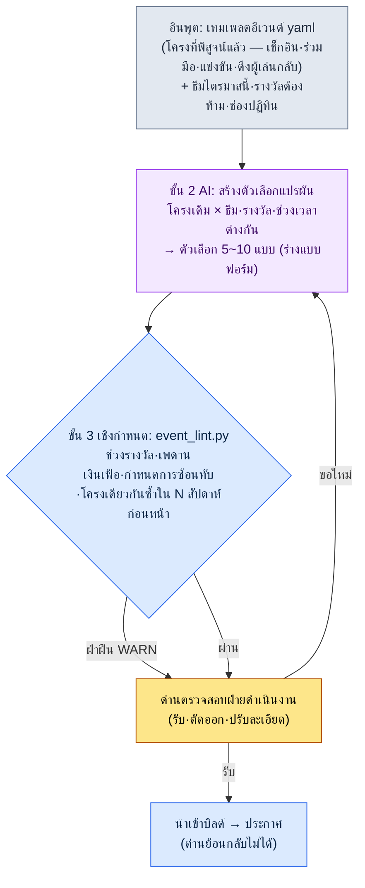

# 15.2 การดำเนินงานอีเวนต์และซีซัน — จากเทมเพลตหนึ่งฉบับสู่ตัวเลือกแบบแปรผัน 10 แบบ โดยให้มนุษย์ทำแค่การตรวจสอบ

> ผู้อ่านกลุ่มหลัก: นักออกแบบเกม (Game Designer) MMORPG ที่รับผิดชอบ Live Ops (ทีมขนาดกลาง 10–50 คน)
> ฉบับย่อสำหรับผู้อ่านคนเดียว/งานอดิเรก: §15.2.9 「ถ้าทำคนเดียวก็แค่นี้พอ」

ลองนึกถึงการประชุมวันจันทร์ของเกมไลฟ์ที่ดำเนินงานมา 4 ปี ทุกสัปดาห์เรื่องว่าจะจัดอีเวนต์อะไรในสัปดาห์หน้าต้องเริ่มจากกระดาษเปล่าเสมอ พอมีใครพูดว่า "เอาอีเวนต์เช็กอินครั้งก่อนมาเพิ่มรางวัลแล้วจัดใหม่ดีไหม" ก็จะมีอีกคนตอบว่า "อันนั้นเพิ่งจัดไปเมื่อสองเดือนก่อนนะ" แล้วจะเพิ่มรางวัลเท่าไรก็ตัดสินด้วยความรู้สึกอีก พอประชุมจบ นักออกแบบที่ดูแลการดำเนินงานคนหนึ่งก็ต้องใช้เวลาครึ่งวันกรอกแบบฟอร์มอีเวนต์ตั้งแต่ต้น ทุกสัปดาห์ จากกระดาษเปล่า ครึ่งวัน

ปัญหาไม่ได้อยู่ที่ขาดไอเดีย ทีมดำเนินงานมีโครงอีเวนต์ที่ผ่านการพิสูจน์แล้วอยู่ในหัวหลายแบบ — เช็กอิน ร่วมมือ แข่งขัน และดึงผู้เล่นกลับ เพียงแค่สลับธีมและรางวัลเข้าไปในโครงเหล่านั้น ก็ได้อีเวนต์ความยาวหนึ่งสัปดาห์ออกมา แต่เพราะ "การสลับ" นั้นทำด้วยมือและด้วยความรู้สึกทุกครั้ง มันจึงช้าและผลลัพธ์ก็ไม่นิ่ง

บทนี้ว่าด้วยวิธีส่งต่อ "การสลับ" นั้นให้ AI ทำ หัวใจมีสองข้อ ข้อแรก ป้อนโครงอีเวนต์ที่ผ่านการพิสูจน์แล้วในรูปของ **เทมเพลต yaml ที่แปรผันได้** ข้อสอง มอบงานน่าเบื่ออย่างการดึงตัวเลือกหลายแบบสำหรับสัปดาห์หน้าจากเทมเพลตให้ AI ทำ ส่วนมนุษย์ **เขียนช่วงรางวัลและการซ้ำซ้อนเป็นโค้ดแล้วตรวจแค่โทน** ทฤษฎีทั่วไปของการออกแบบอีเวนต์ (ทำนองว่าเช็กอินดีต่อการดึงผู้เล่นใหม่ และร่วมมือดีต่อการกระตุ้นกิจกรรม) มีอยู่เพียงพอแล้วในหนังสือเล่มอื่น ดังนั้นบทนี้จึงเน้นเฉพาะ *จุดที่นำความรู้นั้นมารันด้วยเวิร์กโฟลว์ AI* เท่านั้น

> **บันทึกประสบการณ์การดำเนินงานของผู้เขียน (พูดตรง ๆ)**
> ประสบการณ์ที่ผู้เขียนรับผิดชอบ Live Ops หลังเปิดตัวโดยตรงในรอบ 1–2 ปีนั้นจำกัดอยู่เพียงบางช่วงของอาชีพ เวิร์กโฟลว์ในบทนี้คือการย้ายเครื่องมือผลิตและตรวจสอบ (เนื้อหา/HUD) ที่ผู้เขียนใช้งานอยู่มาประยุกต์กับงานอีเวนต์ และตัวเลขผลลัพธ์เป็น *การสังเกตวงการ + การประมาณของผู้เขียน* ซึ่งจะระบุไว้ในเนื้อหาทุกครั้ง โครงสร้างเครื่องมือ (เทมเพลต yaml / lint / ด่านตรวจสอบ) นั้นมีโครงเดียวกับเครื่องมือผลิตเนื้อหาที่ผู้เขียนใช้งานจริง

---

## 15.2.1 มนุษย์ทำแค่การเขียนเทมเพลตและการตรวจสอบขั้นสุดท้ายเท่านั้น

ภาพรวมของการผลิตอีเวนต์มีสี่ขั้น หัวใจอยู่ที่ขั้น 1 (เทมเพลต) และขั้น 3 (lint) เป็นเชิงกำหนด (deterministic) มีเพียงขั้น 2 เท่านั้นที่เป็น AI เป็นการแบ่งงานแบบเดียวกับที่เห็นในการผลิตเนื้อหา (§6.2) และการบีบอัด HUD (§14.1) เมื่อ rulebook คอยยึดทั้งอินพุตและการตรวจสอบไว้ทั้งสองด้าน ต่อให้ AI ที่อยู่ตรงกลางสร้างความแปรผันที่ต่างกันเล็กน้อยทุกครั้ง สมดุลรางวัลและกำหนดการก็จะไม่สั่นคลอน



ในภาพนี้ จุดที่มือมนุษย์เข้าไปแตะมีเพียงสองแห่ง แห่งบนสุดคือจุดที่ป้อนเทมเพลตและข้อจำกัดของไตรมาสนี้เข้าไปให้สะอาด และแห่งล่างสุดคือจุดที่ตัดสินสิ่งที่ lint จับไม่ได้ ว่า "ธีมนี้เข้ากับบรรยากาศเกมของเราตอนนี้ไหม" ส่วนการผลิตตัวเลือกที่น่าเบื่อและการคำนวณรางวัลที่อยู่ระหว่างสองจุดนั้น เทมเพลต AI และ lint เป็นคนรัน

การออกแบบที่ชี้ขาดคือ ต่อให้ lint (ขั้น 3) พบการฝ่าฝืน มันจะไม่ทิ้งตัวเลือกโดยอัตโนมัติ แต่จะส่งขึ้นไปยังด่านฝ่ายดำเนินงาน (ขั้น 4) เป็นเพียง WARN เหตุผลจะเห็นใน §15.2.5 และข้อที่ลูกศรสุดท้าย (การประกาศ) เป็น **ย้อนกลับไม่ได้** นั้น คือสิ่งที่แยก Live Ops ออกจากการผลิตงานแบบอื่น NPC ในเมืองถ้าไม่ถูกใจก็แค่ทิ้งก่อนบิลด์ก็จบ แต่อีเวนต์ที่ประกาศต่อผู้ใช้ไปแล้ว เมื่อจะถอนกลับ ต้องจ่ายด้วยต้นทุนความไว้วางใจของชุมชน (§15.2.7)

---

## 15.2.2 อินพุต — เทมเพลตอีเวนต์ yaml

ตรึงโครงที่พิสูจน์แล้วซึ่งทีมดำเนินงานมีอยู่ให้เป็นแบบฟอร์ม ถ้าปล่อยเป็นเอกสารออกแบบรูปแบบอิสระ AI จะไม่รู้ว่าต้องแปรผันอะไร ต้องแบ่งช่อง (slot) ไว้ "เปลี่ยนแค่ช่องนี้" จึงจะเป็นจริงได้

```yaml
# event_templates/coop_raid.yaml — โครงเรดแบบร่วมมือ (พิสูจน์แล้ว, ดำเนินงาน 4 ครั้ง)
template_id: coop_raid
purpose: [กระตุ้นผู้เล่นเดิม, ชุมชน]      # แค่ 1~2 ข้อ ห้ามไล่ตาม 4 ข้อพร้อมกัน
core_loop: ทั้งเซิร์ฟเวอร์สะสมการมีส่วนร่วมในช่วงเวลา → ปลดล็อกรางวัลทั้งเซิร์ฟเวอร์เป็นขั้น ๆ
duration_range: [5, 10]              # วัน เกิน 10 วันจะเกิดความเหนื่อยล้าสะสม
slots:                               # ← ช่องที่ AI แปรผัน โครงคงที่
  theme: { type: อิสระ, ข้อจำกัด: ปฏิบัติตามธีมไตรมาส }
  boss_or_target: { type: อิสระ, ข้อจำกัด: ใช้เอสเซ็ตบอสเดิมซ้ำก่อน }
  reward_tiers: { type: รายการรางวัล, count: 3~5, ข้อจำกัด: อ้างอิง reward_policy }
reward_policy:                       # ← ช่องที่ lint อ่าน ห้ามแปรผัน
  강화석_per_event_max: 30           # เพดานการแจกต่ออีเวนต์ 1 ครั้ง
  골드_per_event_max: 50000
  คอสตูมจำกัด: อนุญาต (เป็นเจ้าของถาวร ผลกระทบต่อเศรษฐกิจ 0)
  แจกเงินสดโดยตรง: ห้าม
inflation_guard:
  강화석_분기_누적상한: 90           # รวมทุกอีเวนต์ในไตรมาส
post_event_kpi:                      # ← ช่องวัดผลอัตโนมัติหลังอีเวนต์
  - อัตราการเข้าร่วม (ผู้เข้าร่วมอย่างน้อย 1 ครั้งเทียบกับการได้เห็นอีเวนต์)
  - การเปลี่ยนแปลงราคาหินเสริม (30 วันหลังอีเวนต์, เป้าหมาย ±10%)
  - เวลาเล่นวันธรรมดาหลังอีเวนต์ (สัญญาณการพึ่งพา)
```

การแยกที่สำคัญที่สุดคือ `slots` (AI แปรผัน) กับ `reward_policy` (lint อ่าน และ AI แตะไม่ได้) ธีมและบอสจะต่างกันทุกครั้งก็ได้ แต่เพดานการแจกหินเสริมคือเส้นที่เศรษฐกิจของเกมกำหนดไว้ ถ้า AI ดึงเส้นนี้ออกมาเป็นตัวเลขที่ต่างกันทุกครั้งที่เรียก เงินเฟ้อก็เริ่มต้น ณ จุดนั้นทันที ดังนั้น *รายการ* รางวัลให้ AI เสนอ แต่ *ปริมาณ* รางวัลต้องขยับได้เฉพาะภายในช่วงนโยบายเท่านั้น โดยให้ lint เป็นคนเขียนกำกับ

ในโฟลเดอร์เดียวกันมี `daily_attendance.yaml` (เช็กอิน) `pvp_ladder.yaml` (แข่งขัน) และ `comeback.yaml` (ดึงผู้เล่นกลับ) อยู่ในรูปแบบเดียวกัน สี่ฉบับนี้คือพูลอินพุตทั้งหมดสำหรับการสร้างตัวเลือกในไตรมาสนี้

---

## 15.2.3 [บันทึกเซสชันจริง (worked transcript)] เทมเพลต 1 ฉบับ → สร้างตัวเลือกแปรผัน

ผมจะแสดงให้เห็นจนจบหนึ่งรอบว่ารันจริงอย่างไร พรอมต์อินพุตคัดลอกไปใช้ได้ทันที ส่วนเอาต์พุตเป็นการเรียบเรียงใหม่จากเซสชันการผลิตจริง

### ขั้นที่ 1 — พรอมต์: สั่งให้แปรผัน แต่บังคับโครงและนโยบาย

```
จากไฟล์ coop_raid.yaml ที่แนบมา (โครงเรดแบบร่วมมือที่ผ่านการพิสูจน์ 4 ครั้ง) ขอตัวเลือกแปรผันสำหรับสัปดาห์หน้า (W2) มา 5 ตัวเลือกเท่านั้น
ธีมไตรมาสนี้คือ "ฤดูร้อน — น้ำ·เทศกาล·ความร้อน"
ห้ามแตะ core_loop เด็ดขาด เปลี่ยนแค่ slots (ธีม·บอส·รางวัล) เท่านั้น
รางวัลต้องอยู่ภายในเพดาน reward_policy เท่านั้น และแต่ละตัวเลือกให้แนบเหตุผลหนึ่งบรรทัดว่าทำไมถึงเลือกธีม·รางวัลนี้
3 สัปดาห์ก่อนหน้าคือ เช็กอิน·PvP ladder·เรดร่วมมือ ดังนั้นตัวเลือกที่วนกลับมาเป็นเรดร่วมมืออีกให้ติด [ระวังการซ้ำ]
ถ้าไม่มั่นใจให้ติด [คลุมเครือ] แล้วส่งกลับมาให้ผม ขอเป็นตารางอย่างเดียว คอลัมน์คือ ชื่อตัวเลือก·ธีม·สรุป tier รางวัล·เหตุผล·ธง
```

ในกฎหกบรรทัดนี้ ไม่มีบรรทัดใดที่ *ระบุ* ธีมหรือรางวัลเลย ทั้งหมดเป็นรั้วที่บอกว่า "เปลี่ยนได้แค่ไหน อย่าข้ามอะไร สับสนเมื่อไรให้แจ้ง" เพราะถ้าปล่อยกว้างอย่าง "ช่วยสร้างอีเวนต์ฤดูร้อนให้หน่อย" จะได้ค่าเฉลี่ยของเกม RPG มือถือทั่วไปออกมา **ขอบเขตการแปรผัน (เฉพาะ slots) เพดานรางวัล (reward_policy) การระวังการซ้ำ (ประวัติ 3 สัปดาห์ก่อน) และ "ถ้าคลุมเครือให้ส่งคืนมนุษย์"** — รั้วเหล่านี้ทำให้รักษาโครงไว้ได้ ขณะที่ปล่อยให้การแปรผันเป็นอิสระ

### ขั้นที่ 2 — เอาต์พุตของ Claude (เรียบเรียงใหม่จากเซสชันจริง, ตัดมาบางส่วน)

```
| ชื่อตัวเลือก     | ธีม              | สรุป tier รางวัล                | เหตุผล                            | ธง           |
|---------------|----------------|-------------------------------|----------------------------------|-------------|
| เขื่อนกั้นน้ำท่วม | กั้นน้ำท่วมแม่น้ำ  | หินเสริม 25 / โกลด์ 4 หมื่น / คอสตูม | ร่วมมือ = อุปมาก่อเขื่อน เชื่อมตรงกับการสะสมส่วนร่วม |             |
| ลอยโคมไฟ      | เทศกาลน้ำฤดูร้อน  | หินเสริม 20 / โกลด์ 3 หมื่น / ฉายา   | โทนเทศกาล เน้นบรรยากาศมากกว่าแข่งขัน |             |
| บอสคลื่นความร้อน | ปราบอวตารความร้อน | หินเสริม 30 / โกลด์ 5 หมื่น / คอสตูม | ใช้เอสเซ็ตบอสเดิมซ้ำ รางวัลเต็มเพดาน | [ระวังการซ้ำ] |
| แข่งกระแสน้ำ    | แข่งขันโต้คลื่น   | หินเสริม 28 / โกลด์ 4.5 หมื่น / เมาท์ | ผสมร่วมมือ + แข่งขัน               | [คลุมเครือ]   |
| สะสมปลาคาร์ป    | ร่วมมือแบบสะสม   | หินเสริม 22 / โกลด์ 3.5 หมื่น / ฉายา | ผู้เล่นไลต์เข้าได้ง่าย กำแพงต่ำ      |             |

[ระวังการซ้ำ] บอสคลื่นความร้อน: core_loop เหมือนเรดร่วมมือของ W-3 แทบทุกประการ
  โครงเดียวกันซ้ำในระยะ 3 สัปดาห์ → กังวลความเหนื่อยล้าของผู้ใช้ แนะนำโครงอื่น (เช็กอิน/สะสม)
[คลุมเครือ] แข่งกระแสน้ำ: ผสมการสะสมแบบร่วมมือ + การแข่งขันส่วนบุคคลในอีเวนต์เดียว
  ช่อง purpose ขยายเป็น [กระตุ้น+แข่งขัน] อาจขัดกับหลัก 1~2 วัตถุประสงค์
```

ส่วนที่มีค่าที่สุดในเอาต์พุตไม่ใช่ตาราง แต่เป็น **สองบรรทัดล่างสุด** จุดที่ AI แจ้งขีดจำกัดของตัวเองและส่งคืนให้มนุษย์ ว่า "บอสคลื่นความร้อนมีโครงเดียวกับ 3 สัปดาห์ก่อน" และ "แข่งกระแสน้ำมีวัตถุประสงค์เพิ่มเป็นสองข้อ" พรอมต์ที่ดีคือสิ่งที่ทำให้ AI พูดได้ว่า "เรื่องนี้ผมไม่มั่นใจ"

ตอนนี้เอาตัวเลือกชุดนี้ไปให้ lint เขียนกำกับ

---

## 15.2.4 ขั้น 3 lint — เขียนช่วงรางวัลและการซ้ำซ้อนเป็นโค้ด

ถ้าตรวจด้วยตาทุกครั้งว่าตัวเลือกรักษานโยบายรางวัลและการซ้อนทับของกำหนดการไว้ไหม ก็จะพลาดอีก สิ่งที่ตัดสินได้ด้วย `reward_policy` `inflation_guard` และปฏิทิน ให้โค้ดเป็นคนตรวจ มนุษย์เอาเวลาไปใช้กับการตัดสินโทนและความสนุกที่โค้ดจับไม่ได้เท่านั้น

```python
# event_lint.py — ตรวจสอบตัวเลือกแปรผันของอีเวนต์ (โครง)
# อินพุต: รายการตัวเลือกที่ AI เสนอ + นโยบายเทมเพลต + ปฏิทินไตรมาส
# เอาต์พุต: รายการ WARN (ไม่ใช่การทิ้งอัตโนมัติ — ส่งขึ้นไปยังด่านฝ่ายดำเนินงาน)

def lint(candidates, policy, quarter_ledger, recent_weeks):
    warns = []
    stone_used = sum(quarter_ledger.강화석)   # ยอดสะสมที่แจกไปแล้วในไตรมาสนี้
    for c in candidates:
        # A: เพดานรางวัลต่ออีเวนต์ 1 ครั้ง (นโยบาย)
        if c.강화석 > policy["강화석_per_event_max"]:
            warns.append(f"[A] {c.name}: หินเสริม {c.강화석} > เพดาน "
                         f"{policy['강화석_per_event_max']} (เกินต่ออีเวนต์)")
        # B: เพดานสะสมเงินเฟ้อของไตรมาส
        if stone_used + c.강화석 > policy["강화석_분기_누적상한"]:
            warns.append(f"[B] {c.name}: สะสมไตรมาส {stone_used + c.강화석} > "
                         f"{policy['강화석_분기_누적상한']} (เพดานเงินเฟ้อ)")
        # C: โครงเดียวกันซ้ำใน N สัปดาห์ก่อนหน้า
        if c.template_id in recent_weeks[-2:]:
            warns.append(f"[C] {c.name}: โครง {c.template_id} มีอยู่ใน 2 สัปดาห์ก่อนหน้า (ซ้ำ)")
        # D: ช่องปฏิทินชนกัน (อีเวนต์ใหญ่อื่นในสัปดาห์เดียวกัน)
        if quarter_ledger.slot_taken(c.week):
            warns.append(f"[D] {c.name}: ช่อง W{c.week} มีอีเวนต์ใหญ่จัดวางไว้แล้ว")
    return warns
```

เมื่อนำห้าตัวเลือกจากบันทึกเซสชันจริงข้างต้นใส่ในโค้ดนี้ จะได้ผลออกมาดังนี้

```
[PASS] เขื่อนกั้นน้ำท่วม: หินเสริม 25 ≤ 30, สะสมไตรมาส 65+25=90 ≤ 90 (แตะเส้นพอดี)
[WARN] [C] บอสคลื่นความร้อน: โครง coop_raid มีอยู่ใน 2 สัปดาห์ก่อนหน้า (W-3) (ซ้ำ)
[WARN] [B] แข่งกระแสน้ำ: สะสมไตรมาส 65+28=93 > 90 (เกินเพดานเงินเฟ้อ)
[PASS] ลอยโคมไฟ: หินเสริม 20 ≤ 30, สะสมไตรมาส 65+20=85 ≤ 90
[PASS] สะสมปลาคาร์ป: หินเสริม 22 ≤ 30, สะสมไตรมาส 65+22=87 ≤ 90
```

ที่น่าสนใจตรงนี้คือ `แข่งกระแสน้ำ` AI ติด [คลุมเครือ] เพราะวัตถุประสงค์ขัดกัน แต่ lint จับด้วยเหตุผลที่ต่างกันโดยสิ้นเชิง — **เกินเพดานสะสมเงินเฟ้อของไตรมาส** เมื่อบวกหินเสริม 28 เข้าไป ยอดสะสมไตรมาสจะเป็น 93 ซึ่งเกิน 90 ตามนโยบาย โค้ดจับการคำนวณที่ AI มองไม่เห็น ในทางกลับกัน `บอสคลื่นความร้อน` นั้น [ระวังการซ้ำ] ของ AI และ [C] ของ lint ชี้ไปที่เรื่องเดียวกัน มนุษย์ AI และโค้ดทั้งสามต่างกรองด้วยตาข่ายคนละแบบ

ด้วย 30 บรรทัดนี้ "รางวัลครั้งนี้แรงไปหรือเปล่า" จึงไม่จบลงด้วยการชนความรู้สึกกับความรู้สึกอีกต่อไป เมื่อโค้ดพิมพ์ออกมาว่า `[B] สะสมไตรมาส 93 > 90` ก็ไม่มีอะไรต้องถกเถียง แค่ลดรางวัลลงหรือเปลี่ยนตัวเลือกก็พอ

---

## 15.2.5 ครบหนึ่งรอบจนจบ — ตรวจสอบ·ตัดออก·ขอใหม่

ถ้าเขียนเพียงเชิงนามธรรมว่า "ทีมดำเนินงานตรวจสอบ" ก็จะไม่รู้ว่าด่านนี้กรองอะไรจริง ๆ ลองตามไปจนจบสักครั้งว่าหลัง lint ผ่านแล้ว มนุษย์ฆ่าอะไรและไว้ชีวิตอะไร

> **[ขั้น 4 การตรวจสอบฝ่ายดำเนินงาน — คำตัดสิน]**
>
> นักออกแบบฝ่ายดำเนินงานจัดการตัวเลือก 5 ตัวดังนี้
>
> - **บอสคลื่นความร้อน** → **ตัดออก** lint [C] และ AI [ระวังการซ้ำ] ชี้ไปด้วยกัน ถ้าวนโครงเรดร่วมมือเดียวกันอีกในรอบ 3 สัปดาห์ ความเหนื่อยล้าแบบ "สะสมส่วนร่วมอีกแล้วเหรอ" จะมา จดบันทึกยกยอดไปเป็นช่องของไตรมาสหน้า
> - **แข่งกระแสน้ำ** → **ตัดออก** lint [B] เกินเพดานเงินเฟ้อ ถ้าลดรางวัลลงเหลือ 25 ก็ผ่าน แต่ความขัดแย้งของวัตถุประสงค์ (กระตุ้น+แข่งขัน) ที่ AI [คลุมเครือ] ชี้ไว้เป็นปัญหาที่รากลึกกว่า การเอาแรงกิ้งส่วนบุคคลไปผสมในอีเวนต์ร่วมมือ ทำให้ผู้เล่นไลต์รู้สึกว่า "สุดท้ายก็เป็นงานเลี้ยงของพวกตัวท็อป" จึงไม่ตัดแค่รางวัลเพื่อไว้ชีวิต แต่พักไว้ทั้งตัวเลือก
> - **เขื่อนกั้นน้ำท่วม** → **ตัวเลือกอันดับ 1 ที่จะรับ** แต่ถึง lint จะให้ `สะสมไตรมาส 90 แตะเส้นพอดี` เป็น PASS การที่มันเป็น *เส้นพอดี* ก็ยังติดใจ ถ้าใช้อีเวนต์นี้ ระยะหินเสริมที่เหลือในไตรมาสนี้จะกลายเป็น 0 จะไม่มีกำลังรางวัลเหลือไว้สำหรับ push ปิดซีซันในสัปดาห์สุดท้ายของเดือนมิถุนายน
> - **ลอยโคมไฟ / สะสมปลาคาร์ป** → **ไว้ชีวิต** ทั้งคู่รางวัลเบา (20·22) และเหลือระยะของไตรมาสไว้

หัวใจของด่านนี้คือการที่มนุษย์เขย่า `เขื่อนกั้นน้ำท่วม` ที่ผ่าน lint แล้วออกจากอันดับ 1 โค้ดให้ `90 ≤ 90` เป็น PASS ตามนโยบายแล้วไม่ใช่การฝ่าฝืน แต่นักออกแบบฝ่ายดำเนินงานมอง *จังหวะรางวัลของทั้งไตรมาส* lint มองความถูกกฎของอีเวนต์เดียว แต่มนุษย์มองไปถึงการปิดซีซันที่ปลายไตรมาส จึงวนขอใหม่

```
สร้างตัวเลือกของเขื่อนกั้นน้ำท่วมใหม่ โดยลดรางวัลหินเสริมจาก 25 → 18
เหตุผล: ต้องเหลือระยะหินเสริม 12 ไว้สำหรับ push ปิดซีซันในสัปดาห์สุดท้ายของเดือนมิถุนายน
เนื่องจากเสน่ห์ของรางวัลลดลง ให้เสริมคุณค่าที่สัมผัสได้ด้วยคอสตูมจำกัด·ฉายาแทนหินเสริม
จัด reward_tiers ใหม่ในทิศทางนั้น
```

AI ลดหินเสริมลงเหลือ 18 และเพิ่มคอสตูมจำกัดเป็น 2 ชนิด (รางวัลเป็นเจ้าของถาวรที่มีผลกระทบต่อเศรษฐกิจ 0) แล้วเสนอตัวเลือกใหม่ พอรัน lint อีกครั้งได้ `สะสมไตรมาส 65+18=83 ≤ 90` เหลือระยะ 7 ไว้สำหรับปิดซีซัน หนึ่งรอบของ อินพุต → ผลิตตัวเลือก → lint → ตรวจสอบ → ตัดออก → ขอใหม่ ปิดลงตรงนี้

หนึ่งรอบนี้คือเกณฑ์ Show ของทั้งหนังสือเล่มนี้ ถ้าไม่ดูสักครั้งให้จบว่าเครื่องมือพ่นอะไรออกมา อะไรถูกจับ และมนุษย์ฆ่าอะไร ประโยคที่ว่า "ผลิตอีเวนต์ด้วย AI" ก็กลวงเปล่า

เหตุผลที่ไม่ติด lint แบบทิ้งอัตโนมัติก็อยู่ในรอบนี้ ถ้า lint ทิ้งการฝ่าฝืน [B] โดยอัตโนมัติ ทีมดำเนินงานก็จะเสียโอกาสเรียนรู้ปัญหาจริงของ `แข่งกระแสน้ำ` (วัตถุประสงค์ขัดกัน) และจุดที่จะเขย่าตัวเลือกอย่าง `เขื่อนกั้นน้ำท่วม` ที่ *ถูกกฎแต่เสี่ยงต่อจังหวะของไตรมาส* ก็จะหายไปด้วย ให้เครื่องเป็นคนคัดตัวเลือกที่น่าสงสัย แต่การรับและการตัดออกให้มนุษย์เป็นคนตัดสิน

---

## 15.2.6 ซีซัน — จังหวะที่ใหญ่กว่า การแยกแบบเดียวกัน

ถ้าอีเวนต์เป็นจังหวะสัปดาห์–เดือน ซีซันก็เป็นจังหวะไตรมาส วิธีดำเนินงานเหมือนกัน ถ้าแยกองค์ประกอบที่พิสูจน์แล้วของซีซันออกเป็นช่อง ก็แค่สลับธีมในแต่ละไตรมาส

| ช่องซีซัน | แปรผัน (AI·มนุษย์) | คงที่ (นโยบาย·lint) |
|---|---|---|
| ธีมซีซัน | ฤดูร้อน·ฤดูหนาว·ปีใหม่ (อิสระ) | — |
| แทร็กรางวัลซีซันพาส | รายการรางวัลตามขั้น | จำนวนขั้น·ความยากในการจบ·เพดานรางวัล |
| แรงกิ้ง PvP ซีซัน | รายการรางวัลแรงกิ้ง | เพดานเงินเฟ้อของรางวัล |
| การสับเมตา | ตัวละครใหม่·การปรับสมดุล | ราวกั้นขอบเขตการเปลี่ยนแปลง (§8.1) |

ในซีซันพาส ตัวเลขหลักที่มนุษย์ตรึงไว้เป็นนโยบายคือ **เป้าหมายอัตราการจบ** การจัดความยากให้ผู้ใช้ที่ active ราว 70% ไปถึงขั้นสุดท้าย เป็นเกณฑ์ที่วงการมักอ้างถึงกันบ่อย (การประมาณของผู้เขียน — เพราะต่างกันไปในแต่ละเกม จึงควรอ่านเป็น *ทิศทาง* ไม่ใช่ค่าสัมบูรณ์: ต่ำกว่า 30% คือผิดหวัง เกิน 90% คือไร้ความท้าทาย) เมื่อป้อนเป้าหมายนี้เข้าไปในช่องแล้ว ก็บังคับให้ตอน AI เสนอตัวเลือกซีซันพาสต้องคำนวณ "อัตราการจบที่คาดการณ์" ออกมาด้วยได้

ปฏิทินไตรมาสต้องเห็นในภาพเดียวจบ อีเวนต์และซีซันจึงจะไม่ชนกัน มันใกล้เคียงกับปฏิทินตั้งโต๊ะส่วนกลางของทีมดำเนินงาน ทุกคนต้องเห็นภาพเดียวกัน การชนกันจึงจะลดลง

<svg viewBox="0 0 720 300" xmlns="http://www.w3.org/2000/svg" role="img" aria-label="ปฏิทินรวมอีเวนต์·ซีซัน ไตรมาส 2 (เม.ย.~มิ.ย.)">
  <rect x="0" y="0" width="720" height="300" fill="#0f1117"/>
  <text x="16" y="26" fill="#e5e7eb" font-family="sans-serif" font-size="15" font-weight="bold">ปฏิทินรวมไตรมาส 2 — ซีซัน 1 รายการ (ไตรมาส), อีเวนต์รายสัปดาห์</text>
  <!-- 시즌 띠 -->
  <rect x="16" y="42" width="688" height="30" rx="5" fill="#1e3a5f" stroke="#3b82f6" stroke-width="1.5"/>
  <text x="360" y="62" fill="#bfdbfe" font-family="sans-serif" font-size="13" text-anchor="middle">ซีซัน "เทศกาลฤดูร้อน" (ซีซันพาส 50 ขั้น · แรงกิ้ง PvP) — เม.ย.~มิ.ย. ตลอด</text>
  <!-- 월 구분 -->
  <text x="130" y="96" fill="#9ca3af" font-family="sans-serif" font-size="12" text-anchor="middle">เม.ย.</text>
  <text x="360" y="96" fill="#9ca3af" font-family="sans-serif" font-size="12" text-anchor="middle">พ.ค.</text>
  <text x="590" y="96" fill="#9ca3af" font-family="sans-serif" font-size="12" text-anchor="middle">มิ.ย.</text>
  <line x1="245" y1="84" x2="245" y2="270" stroke="#374151" stroke-width="1" stroke-dasharray="4 4"/>
  <line x1="475" y1="84" x2="475" y2="270" stroke="#374151" stroke-width="1" stroke-dasharray="4 4"/>
  <!-- 이벤트 블록: 색 = 골격 종류 -->
  <!-- 4월 -->
  <rect x="20" y="110" width="100" height="34" rx="4" fill="#14532d"/><text x="70" y="131" fill="#bbf7d0" font-size="11" text-anchor="middle">W1 เช็กอิน</text>
  <rect x="128" y="110" width="100" height="34" rx="4" fill="#7c2d12"/><text x="178" y="131" fill="#fed7aa" font-size="11" text-anchor="middle">W2 ร่วมมือ(เขื่อน)</text>
  <!-- 5월 -->
  <rect x="250" y="110" width="100" height="34" rx="4" fill="#581c87"/><text x="300" y="131" fill="#e9d5ff" font-size="11" text-anchor="middle">W3 PvP ladder</text>
  <rect x="358" y="110" width="100" height="34" rx="4" fill="#14532d"/><text x="408" y="131" fill="#bbf7d0" font-size="11" text-anchor="middle">W4 สะสมร่วมมือ</text>
  <!-- 6월 -->
  <rect x="480" y="110" width="100" height="34" rx="4" fill="#7c2d12"/><text x="530" y="131" fill="#fed7aa" font-size="11" text-anchor="middle">W5 ดึงผู้เล่นกลับ</text>
  <rect x="590" y="110" width="110" height="34" rx="4" fill="#854d0e"/><text x="645" y="131" fill="#fde68a" font-size="11" text-anchor="middle">W6 ปิดซีซัน</text>
  <!-- 인플레 게이지 -->
  <text x="16" y="180" fill="#9ca3af" font-family="sans-serif" font-size="12">สะสมเงินเฟ้อหินเสริมไตรมาส (เพดาน 90)</text>
  <rect x="16" y="190" width="688" height="22" rx="4" fill="#1f2937"/>
  <rect x="16" y="190" width="635" height="22" rx="4" fill="#b45309"/>
  <line x1="651" y1="184" x2="651" y2="218" stroke="#ef4444" stroke-width="2"/>
  <text x="640" y="232" fill="#fca5a5" font-size="11" text-anchor="end">สะสมปัจจุบัน 83 / เพดาน 90 (เหลือ 7 = ส่วนของ push ปิดซีซัน)</text>
  <!-- 범례 -->
  <rect x="16" y="252" width="14" height="14" fill="#14532d"/><text x="36" y="264" fill="#9ca3af" font-size="11">เช็กอิน·สะสม</text>
  <rect x="120" y="252" width="14" height="14" fill="#7c2d12"/><text x="140" y="264" fill="#9ca3af" font-size="11">ร่วมมือ·ดึงกลับ</text>
  <rect x="240" y="252" width="14" height="14" fill="#581c87"/><text x="260" y="264" fill="#9ca3af" font-size="11">แข่งขัน(PvP)</text>
  <rect x="360" y="252" width="14" height="14" fill="#854d0e"/><text x="380" y="264" fill="#9ca3af" font-size="11">อีเวนต์ซีซัน</text>
</svg>

ภาพหนึ่งใบนี้อธิบายคำตัดสินของ §15.2.5 ด้วยภาพ สีคือชนิดของโครง **ถ้าสีเดียวกันโผล่สองครั้งในรอบ 2\~3 สัปดาห์ lint [C] ใน §15.2.4 จะร้อง** และเกจเงินเฟ้อด้านล่างใกล้แตะเส้นแดง (เพดาน 90) จนเหลือระยะ 7 ไว้ใช้ปิดซีซันในเดือนมิถุนายน (W6) แค่พอดี — นั่นคือ 7 ที่ได้มาจากการลดรางวัล `เขื่อนกั้นน้ำท่วม` ลงเหลือ 18

---

## 15.2.7 ด่านย้อนกลับไม่ได้ — ทำการตรวจสอบทั้งหมดให้เสร็จก่อนประกาศ

มีจุดหนึ่งที่ Live Ops ต่างจาก NPC ในเมือง (§6.2) หรือ HUD (§14.1) อย่างชี้ขาด **การประกาศย้อนกลับไม่ได้** ถ้า NPC โทนไม่เข้าก็แค่ทิ้งก่อนบิลด์ก็จบ และผู้ใช้ก็ไม่รู้ด้วยซ้ำว่ามี NPC นั้นอยู่ แต่อีเวนต์ที่ประกาศต่อผู้ใช้ไปแล้ว รางวัล·ช่วงเวลา·กติกาจะค้างอยู่ในชุมชน หลังเริ่มไปแล้ว การพูดว่า "รางวัลอีเวนต์แรงไป จะขอเก็บคืน" มาพร้อมต้นทุนที่ย้อนกลับไม่ได้

```mermaid
flowchart LR
    A["ตัวเลือกแปรผันจากเทมเพลต"] -->|ย้อนกลับได้| B["ตรวจสอบ lint"]
    B -->|ย้อนกลับได้| C["ตรวจสอบฝ่ายดำเนินงาน·ตัดออก·ขอใหม่"]
    C -->|ย้อนกลับได้| D["ตรวจสอบบิลด์<br/>(เลื่อนรีลีสได้)"]
    D ==>|ด่านย้อนกลับไม่ได้| E["ประกาศ·เริ่มอีเวนต์"]
    E -.->|ต้นทุนการกู้คืนสูง| F["ทำได้แค่ปรับละเอียดในช่วงท้าย<br/>(เก็บรางวัลคืน·เปลี่ยนช่วงเวลา = ต้นทุนความไว้วางใจ)"]
    classDef code fill:#dbeafe,stroke:#2563eb,color:#0b2545;
    classDef human fill:#fde68a,stroke:#b45309,color:#000;
    classDef data fill:#e2e8f0,stroke:#64748b,color:#1e293b;
    classDef fail fill:#fee2e2,stroke:#dc2626,color:#7f1d1d;
    class A data;
    class B code;
    class C,D human;
    class F fail;
```



หลักการของทั้งหนังสือเล่มนี้ (สารเดียวกับ §5.4.5 การอัดเสียงพากย์, §8.1 ไลฟ์บิลด์, การเรนเดอร์ขั้นสุดท้ายในส่วนที่ 12) เป็นเช่นเดียวกันใน Live Ops การตรวจสอบทั้งหมด — ช่วงรางวัล, เพดานเงินเฟ้อ, การชนของกำหนดการ, โทน — ต้องเสร็จในขั้นที่ย้อนกลับได้ก่อนประกาศ นั่นคือเหตุผลที่รอบผลิต·lint·ตรวจสอบ·ขอใหม่ทั้งหมดใน §15.2.3\~5 หมุนอยู่ *ทางซ้าย* ของด่านย้อนกลับไม่ได้นี้ สิ่งที่ทำได้หลังข้ามด่านมีแค่การปรับละเอียดช่วงท้ายแบบ §15.2.8 และแม้แต่อย่างนั้นก็ค่อย ๆ กัดกินความไว้วางใจของผู้ใช้

---

## 15.2.8 สัญญาณระหว่างดำเนินงานและการสั่งยา

หลังประกาศก็ยังดู KPI อยู่ แต่ต่างจากการตรวจสอบก่อนประกาศ ตรงนี้ทำได้แค่ปรับละเอียดช่วงท้ายเท่านั้น แยกสัญญาณที่วัดอัตโนมัติกับการสั่งยาของมนุษย์ออกจากกัน

| สัญญาณ (วัดอัตโนมัติ) | การสั่งยา (มนุษย์ตัดสิน) |
|---|---|
| อัตราการเข้าร่วมต่ำกว่า 50% | เสริมรางวัลช่วงท้ายเล็กน้อย หรือต่อเวลา +2 วัน (ภายในขอบเขตที่ประกาศไว้และไว้ใจได้) |
| อัตราการเข้าร่วม 95% ขึ้นไป | ง่ายไป — จดความยากของรอบถัดไป แต่อีเวนต์ปัจจุบันคงไว้ |
| ราคาหินเสริม 30 วันหลังอีเวนต์ ลดเกิน -10% | เสริม sink (ร้านค้าจำกัด), ปรับเพดานเงินเฟ้อไตรมาสหน้าลง |
| เวลาเล่นวันธรรมดาหลังอีเวนต์ลดลง | สัญญาณการพึ่งพาอีเวนต์ — เสริมเสน่ห์เนื้อหาวันธรรมดา, ปรับความถี่อีเวนต์ |

บรรทัดสุดท้าย (เวลาเล่นวันธรรมดาลดลง) เป็นสัญญาณที่พลาดบ่อยที่สุด ถ้าดูแค่ DAU (Daily Active Users, ผู้ใช้ที่ใช้งานรายวัน) ในช่วงอีเวนต์ อีเวนต์ก็ดูเหมือนสำเร็จเสมอ แต่ถ้าหลังอีเวนต์จบแล้วผู้ใช้ไม่กลับมาในวันธรรมดา นั่นแปลว่าอีเวนต์กำลังดูดเสน่ห์ของเกมในยามปกติออกไป ดังนั้นจึงป้อน "เวลาเล่นวันธรรมดาหลังอีเวนต์" เข้าไปเป็นช่องใน `post_event_kpi` ของเทมเพลต §15.2.2 ตั้งแต่ต้น ถ้าไม่วัดก็สั่งยาไม่ได้

---

## 15.2.9 พูดถึงผลได้อย่างซื่อตรงได้ถึงไหน

บทอีเวนต์มีแรงยั่วยวนสูงที่จะใส่ตารางแบบ "พอจัดอีเวนต์ร่วมมือ อัตราการคงอยู่ (Retention) ขึ้นจาก 30% เป็น 50%" ตัวเลขแบบนั้นถ้าไม่ผ่านการตรวจสอบจะทอนความไว้วางใจของหนังสือลง สิ่งที่บทนี้พูดได้มีเพียงสามอย่าง

ข้อแรก **ทิศทางพูดได้ด้วยการสังเกตวงการ** อีเวนต์เสริมรางวัลเช็กอินดึงจำนวนผู้ใช้ที่ active ระยะสั้นให้สูงขึ้น อีเวนต์ร่วมมือเพิ่มความผูกพันของชุมชน และแพ็กเกจจำกัดดึงยอดขายในช่วงอีเวนต์ขึ้น — นี่คือความเชื่อทั่วไปของวงการที่สังเกตเกมไลฟ์มา เพียงแต่ *เท่าไร* นั้นแกว่งมากตามองค์ประกอบของเกมและผู้ใช้ การยกตัวเลขของบริษัทอื่นมาตรง ๆ จึงอันตราย

ข้อสอง **การประมาณของผู้เขียนก็เขียนว่าเป็นการประมาณ** "เป้าหมายอัตราการจบซีซันพาส 70%", "เกิน 10 วันแล้วเกิดความเหนื่อยล้าสะสม", "การผลิตอีเวนต์ครึ่งวัน→หนึ่งชั่วโมง" ล้วนเป็นการประมาณบนพื้นฐานประสบการณ์ของผู้เขียนและเป็นสมมติฐานที่ยังไม่ได้ตรวจสอบ อย่าท่องจำค่าสัมบูรณ์ แต่ให้อ่านเป็น *โครงสร้าง* (เทมเพลต+lint แทนที่การออกแบบจากกระดาษเปล่า)

ข้อสาม **สัญญาเป็น KPI เฉพาะสิ่งที่วัดได้** ตัวชี้วัดผลลัพธ์อย่างอัตราการคงอยู่ไม่ได้ถูกกำหนดด้วยอีเวนต์เดียว จึงไม่ฟันธงความเป็นเหตุเป็นผล แทนที่จะเป็นเช่นนั้น สิ่งที่เวิร์กโฟลว์นี้ทำให้วัดได้จริงคือสิ่งเหล่านี้ — จำนวน WARN ของ lint (จนกว่าการฝ่าฝืนรางวัลจะเป็น 0), การสะสมเงินเฟ้อไตรมาส (เทียบกับเพดาน), ช่วงระยะการซ้ำของโครงเดียวกัน (สัปดาห์), อัตราการเข้าร่วมและการเปลี่ยนแปลงราคาหินเสริมหลังจบของแต่ละอีเวนต์ สี่อย่างนี้ในที่ประชุมพูดได้ด้วยตัวเลข ไม่ใช่ "ความรู้สึก"

---

## 15.2.10 ความล้มเหลวที่พบบ่อย

| รูปแบบ | ทำไมจึงล้มเหลว | การสั่งยา |
|---|---|---|
| ออกแบบอีเวนต์จากกระดาษเปล่าทุกสัปดาห์ | ช้าและผลลัพธ์ไม่นิ่ง | ป้อนโครงที่พิสูจน์แล้วเป็นเทมเพลต yaml (§15.2.2) |
| มอบทั้งก้อนว่า "AI ช่วยสร้างอีเวนต์ฤดูร้อนให้หน่อย" | ได้อีเวนต์ค่าเฉลี่ยของ RPG ทั่วไป | ตรึงโครง + แปรผันแค่ slots (§15.2.3) |
| ให้ AI เสนอปริมาณรางวัลอย่างอิสระ | เงินเฟ้อเริ่มต้น ณ จุดนั้น | ให้ lint บังคับ reward_policy (§15.2.4) |
| ตรวจสอบตัวเลือกด้วยตาอย่างเดียว | พลาดการสะสมไตรมาส·ช่วงระยะการซ้ำทุกครั้ง | ตรวจสอบอัตโนมัติด้วย event_lint.py (§15.2.4) |
| ผ่าน lint = ตรงไปรับเลย | มองไม่เห็นจังหวะไตรมาส·วัตถุประสงค์ขัดกัน | ด่านมนุษย์มองทั้งไตรมาส (§15.2.5) |
| พยายามเก็บรางวัลคืนหลังประกาศ | ต้นทุนความไว้วางใจที่ย้อนกลับไม่ได้ | ตรวจสอบทั้งหมดก่อนประกาศ (§15.2.7) |
| วัดแค่ DAU ในช่วงอีเวนต์ | มองไม่เห็นการกัดกินเสน่ห์วันธรรมดา | ช่องเวลาเล่นวันธรรมดาหลังอีเวนต์ (§15.2.8) |

ข้อที่ห้าพลาดบ่อยที่สุด ถ้าผ่าน lint แล้วส่งไปประกาศทันที จุดที่จะเขย่าตัวเลือกอย่าง `เขื่อนกั้นน้ำท่วม` ที่ *ถูกกฎแต่ทำให้กำลังรางวัลปลายไตรมาสเป็น 0* ก็จะหายไป โค้ดมองความถูกกฎของอีเวนต์เดียว ส่วนมนุษย์มองจังหวะของทั้งไตรมาส

---

## 15.2.11 ลองทำดู — หนึ่งขั้นที่ทำได้วันนี้

> **ถ้าทำคนเดียวก็แค่นี้พอ**: ไม่ต้องมีโค้ด lint ก็ได้ เลือกโครงอีเวนต์หนึ่งแบบที่เห็นบ่อยในเกมของคุณ (หรือเกมไลฟ์ที่คุณชอบ) แล้วลองเขียนเทมเพลต yaml รูปแบบ §15.2.2 ด้วยมือ (สามช่อง `core_loop`·`slots`·`reward_policy` คือหัวใจ) จากนั้นแปะพรอมต์ §15.2.3 เพื่อดึงตัวเลือกแปรผัน 5 แบบออกมา แล้วเลือกหนึ่งแบบที่รู้สึกว่า "รางวัลแรงไป" มาโต้กลับว่า "อันนี้เกินกำลังรางวัลของเดือนนี้ ลดลงแล้วทำใหม่" คุณจะรู้สึกได้ด้วยตัวเองว่าการรับและการตัดออกเป็นชุดของการตัดสินแบบไหน

ถ้าทำเป็นทีม ให้เริ่มด้วยขั้นถัดไปนี้ ป้อนโครงอีเวนต์ที่จัดบ่อย 3\~4 แบบเป็นเทมเพลต yaml แล้วเริ่มจากเขียนสามบรรทัดของ `event_lint.py` (เพดานรางวัล·การสะสมเงินเฟ้อไตรมาส·ช่วงระยะการซ้ำ) เป็นโค้ดก่อน แค่มีเทมเพลตและสามบรรทัดนี้ ก็ป้องกันความล้มเหลวที่พบบ่อยสองอย่าง — "การออกแบบจากกระดาษเปล่าทุกสัปดาห์" และ "การตัดสินรางวัลด้วยความรู้สึก" — ได้ก่อน เวิร์กโฟลว์นี้คือการนำองค์ประกอบ 3 อย่างของโครงการประยุกต์แบบก้าวหน้าใน §15.1.5 — เทมเพลตอีเวนต์·ไลบรารีกติกาซีซัน, ตัวสร้างตัวเลือกอีเวนต์ด้วย AI, การวัดผลอัตโนมัติหลังอีเวนต์ — มาทำให้เป็นจริงในทางปฏิบัติเป็นครั้งแรก

---

### สรุปประเด็นสำคัญของบท
- เมื่อป้อนโครงอีเวนต์ที่พิสูจน์แล้วเป็นเทมเพลต yaml AI จะแปรผันแค่ slots เพื่อผลิตตัวเลือกออกมา
- ปริมาณรางวัล·เพดานเงินเฟ้อ·ช่วงระยะการซ้ำให้ lint เป็นคนเขียน ส่วนโทน·จังหวะไตรมาสให้มนุษย์เป็นคนเขียน
- การประกาศย้อนกลับไม่ได้ ดังนั้นการตรวจสอบทั้งหมดจึงต้องเสร็จในขั้นที่ย้อนกลับได้ก่อนประกาศ

### ตัวอย่างบทถัดไป
- 15.3 วงจรฟีดแบ็กจากผู้ใช้ — สมดุลระหว่างความเห็นของผู้ใช้กับวิสัยทัศน์ของผู้กำกับ และการจัดกลุ่มฟีดแบ็กอัตโนมัติ
