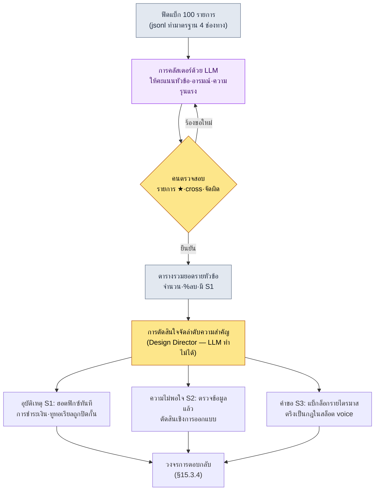

# 15.3 เปลี่ยนฟีดแบ็ก 100 รายการให้เป็นหัวข้อ — ให้ LLM ทำการคลัสเตอร์ ให้คนจัดลำดับความสำคัญ

> ผู้อ่านกลุ่มแรก: นักออกแบบเกม (Game Designer) และ Design Director ที่รับผิดชอบการดูแลผู้ใช้ในงาน Live Ops (ทีมขนาดกลาง 10–50 คน)
> ฉบับย่อสำหรับคนเดียว/ผู้เล่นงานอดิเรก: §15.3.7 「ถ้าทำคนเดียว แค่นี้ก็พอ」

ขอบอกตามตรงไว้ก่อน ผู้เขียนไม่ได้มีประสบการณ์ยาวนานในการรับผิดชอบ Live Ops โดยตรงต่อเนื่องเป็นปีถึงสองปีหลังเกมเปิดให้บริการ เนื้อหาส่วนใหญ่ของบทนี้เป็น **การสังเกตในวงการและประสบการณ์ในงานใกล้เคียง** ที่สั่งสมอยู่บนประสบการณ์ 24 ปี ดังนั้นบทนี้จึงไม่ฟันธงว่า "ต้องทำ Live Ops แบบนี้" แต่จะนำวงจร *อินพุต → AI → การตรวจสอบ → การตัดสินใจของคน* ที่พิสูจน์มาแล้วจากการผลิตเนื้อหาก่อนเปิดตัว มาเสียบเข้ากับอินพุตที่ชื่อว่า **ฟีดแบ็กจากผู้ใช้** แล้วลองหมุนให้สุดสักรอบหนึ่งเพื่อดูว่าผลลัพธ์เป็นอย่างไร โครงของเครื่องมือเหมือนกับ §6.2 city_hunting_generator ทุกอย่าง เปลี่ยนแค่อินพุตจาก "เมตาดาตาของเมือง" เป็น "ฟีดแบ็กจากผู้ใช้ 100 รายการ" เท่านั้น

ภาพของสัปดาห์แรกในการให้บริการมักจะคล้าย ๆ กัน ฟอรัม Discord ทิกเก็ต CS รีวิวในสโตร์ พอกพูนขึ้นวันละหลายร้อยถึงหลายพันรายการ คนอ่านให้ครบเป็นไปไม่ได้ และถ้าไม่อ่าน รายงานบั๊กตัวเดียวกันก็จะถูกฝังกลบไปทีละ 50 รายการ บทนี้ว่าด้วยวิธีให้ **LLM จับกองนั้นมัดเป็นหัวข้อและให้คะแนนตามอารมณ์** ก่อน แล้วคนจึงเข้ามาทำเฉพาะส่วน **การตัดสินใจจัดลำดับความสำคัญ** ที่ว่า "แล้วสัปดาห์นี้จะแก้อะไรกันแน่"

---

## 15.3.1 ฟีดแบ็กไม่ใช่ 'สิ่งที่ไว้อ่าน' แต่เป็น 'อินพุตสำหรับจัดประเภท'

ตารางที่แบ่งฟีดแบ็กออกเป็น 4 ช่องทาง (แบบสำรวจในเกม·ฟอรัม/Discord·รีวิวในสโตร์·ทิกเก็ต CS) และจัดเป็น 4 ประเภท (บั๊ก·คำขอ·ข้อร้องเรียน·คำชม) มีอยู่ในตำราการให้บริการเล่มไหนก็ได้ พูดถูกหมดทุกข้อ ปัญหาคือต่อให้ท่องตารางนั้นได้ ก็ยังไม่มีคำตอบว่า "วันนี้มีเข้ามา 412 รายการ จะจัดการอย่างไร" ตราบใดที่ยังมองฟีดแบ็กเป็น *สิ่งที่คนต้องอ่านและจัดประเภท* ปริมาณฟีดแบ็กก็จะชนะจำนวนคนในทีมงานบริการเสมอ

ลองเปลี่ยนมุมมอง ฟีดแบ็กหนึ่งรายการคือ **อินพุตที่มีโครงสร้าง** เป็นเรกคอร์ดที่มีห้าช่อง `{출처, 원문, 토픽, 감정, 심각도}` เมื่อมองแบบนี้ เนื้อแท้ของงานก็เปลี่ยนไป ไม่ใช่ "อ่านให้ครบ" แต่เป็น "มัดเป็นหัวข้อแล้วจัดลำดับความสำคัญ" และการคลัสเตอร์หัวข้อกับการให้คะแนนอารมณ์นั้น ถ้าคนทำจะน่าเบื่อและเกณฑ์จะแกว่งทุกครั้งที่ทำ แต่เครื่องจะใช้ไม้บรรทัดเดียวกันวัด 100 รายการเท่ากันหมด นี่คืองานประเภทที่ LLM ทำได้ดีกว่าคน การแบ่งงาน (rulebook = เชิงกำหนด, เนื้อหาหลัก = AI, การตรวจสอบ = คน) ที่ใช้ผลิตเมือง 30 แห่งใน §6.2 ก็ใช้ได้เหมือนกันตรงนี้ จุดต่างมีเพียงข้อเดียว คือสิ่งที่คนทำเป็นขั้นสุดท้ายไม่ใช่ "การตรวจสอบเนื้อหาหลัก" แต่เป็น "การตัดสินใจจัดลำดับความสำคัญ"

ขอชี้ถึงการกระจายตัวของประเภทฟีดแบ็กไว้สักจุดหนึ่ง ผู้ใช้ที่ลงมือเขียนข้อความเองมักจะเอนไปทางผู้ใช้ที่มีข้อไม่พอใจ ไม่ใช่ผู้ใช้ที่พึงพอใจ ลูกค้าที่พอใจจะจากไปเงียบ ๆ ส่วนลูกค้าที่ไม่พอใจจะกลับมาที่เคาน์เตอร์ ด้วยเหตุนี้การกระจายอารมณ์ในฟอรัมและรีวิวจึงมีแนวโน้มเอียงไปทางลบมากกว่าความพึงพอใจของผู้ใช้ทั้งหมดจริง ๆ (การสังเกตของผู้เขียน — ขนาดของความเอียงที่แท้จริงต่างกันไปในแต่ละเกม·ช่องทาง·ช่วงเวลา จึงควรอ่านเป็น *ทิศทาง* ไม่ใช่ค่าตัวเลขสัมบูรณ์) ต้องใส่ความเอียงนี้ไว้ในหัว เพื่อว่าเวลาเห็น "ลบ 60%" ในผลคลัสเตอร์ จะได้ไม่ตีความผิดว่าเกมกำลังจะเจ๊ง

---

## 15.3.2 [บันทึกเซสชันจริง (worked transcript)] ฟีดแบ็ก 100 รายการ → คลัสเตอร์หัวข้อ + อารมณ์

ลองหมุนหนึ่งวงจรให้สุดจริง ๆ อินพุตคือฟีดแบ็ก 100 รายการที่รวบรวมจาก 4 ช่องทางในหนึ่งสัปดาห์ ส่วนเอาต์พุตคือคลัสเตอร์หัวข้อ·อารมณ์·ลำดับความสำคัญ พรอมต์อินพุตคัดลอกไปใช้ได้เลย และเอาต์พุตด้านล่างคือสิ่งที่เรียบเรียงใหม่จากรูปแบบของเซสชันการจัดประเภทจริง

### ขั้นที่ 1 — อินพุต: ทำให้ฟีดแบ็กเป็นตารางที่เครื่องอ่านได้

นำข้อความดิบที่ขูดมาจากช่องทางต่าง ๆ มาทำให้เป็นมาตรฐาน หนึ่งบรรทัดต่อหนึ่งเรกคอร์ด อันนี้ไม่ใช่การเขียนขึ้นใหม่ แค่ดึงและจัดระเบียบก็พอ

```jsonl
{"id": "fb_0001", "src": "discord",     "text": "ตีบวก +12 พังไป 50 ครั้งแล้ว อัตรานี้มันถูกต้องไหม ขอเงินคืน"}
{"id": "fb_0002", "src": "store_review","text": "กราฟิกสวยนะ แต่แล็กหนักมากจนเด้งทุกครั้งที่สงครามกิลด์"}
{"id": "fb_0003", "src": "cs_ticket",   "text": "จ่ายเงินไปแล้วแต่เพชรไม่เข้า แนบเลขที่คำสั่งซื้อมาด้วย"}
{"id": "fb_0004", "src": "forum",       "text": "อาชีพใหม่นักธนูจะออกเมื่อไหร่ ㅠㅠ ตอนลงทะเบียนล่วงหน้าก็สัญญาไว้แล้วนี่"}
{"id": "fb_0005", "src": "discord",     "text": "เปิดสัปดาห์แรกแต่ทีมงานสื่อสารดีนะ ประกาศไว ๆ ฝากด้วยนะต่อไป"}
{"id": "fb_0006", "src": "store_review","text": "ดาเมจของบอสบางตัว (ฮึกรัง) มันไม่สมเหตุสมผล ใส่ของเต็มยังโดนทีเดียว ขอแพตช์ปรับสมดุล"}
{"id": "fb_0007", "src": "cs_ticket",   "text": "ทูทอเรียลขั้นที่ 5 ไปต่อไม่ได้ ปุ่มกดไม่ติด (เครื่อง: Galaxy ซีรีส์ A)"}
// ... fb_0008 ~ fb_0100 (생략)
```

ในขั้นอินพุต เรกคอร์ดจะเว้น `토픽·감정·심각도` ไว้ว่าง การเติมช่องว่างเหล่านั้นคืองานของ LLM ในสองขั้นถัดไป

### ขั้นที่ 2 — พรอมต์: สั่งให้คลัสเตอร์ แต่บังคับทั้งป้ายกำกับ รูปแบบ และทางออก

```
ช่วยมัดไฟล์ feedback_100.jsonl ที่แนบมา (ฟีดแบ็ก 100 รายการในหนึ่งสัปดาห์) ให้เป็นหัวข้อ และให้คะแนนอารมณ์ไปด้วย
หัวข้อให้เลือกจากรายการนี้เท่านั้น (ห้ามสร้างเอง): การตีบวก/อัตรา, การปรับสมดุล, เซิร์ฟเวอร์/ประสิทธิภาพ, การชำระเงิน/คืนเงิน,
ขอเนื้อหาใหม่, ทูทอเรียล/ออนบอร์ดดิง, UI/การควบคุม, คำชม/ให้กำลังใจ, อื่น ๆ ถ้า 'อื่น ๆ' เกิน 8 รายการ ให้เสนอหัวข้อใหม่เป็นตัวเลือกด้วย
อารมณ์ให้เป็น ลบ·กลาง·บวก ความรุนแรงให้เป็น S1·S2·S3·S4
// (เจตนา: S1 ใช้เมื่อเป็นรูปธรรม·ทำซ้ำได้·ปิดกั้นฟังก์ชันเท่านั้น ความไม่พอใจรุนแรงเฉย ๆ ให้เป็น S2)
รายการที่ไม่มั่นใจให้ปล่อยไว้ที่ 'อื่น ๆ' แล้วเติม ★ ท้าย id ส่งมาให้ฉัน อย่าฝืนยัดเข้าหมวด
ขอแค่สองตารางเท่านั้น — ตาราง A (รายรายการ): id·หัวข้อ·อารมณ์·ความรุนแรง / ตาราง B (รายหัวข้อ): หัวข้อ·จำนวน·%ลบ·ข้อความตัวอย่าง 1 ข้อ·มี S1 หรือไม่
```

ในพรอมต์นี้ สิ่งที่กำหนดผลการจัดประเภทไม่ใช่รายการหัวข้อหรือสเกลอารมณ์ แต่เป็นกลไกควบคุมสามอย่าง คือ *ตรึง* ป้ายกำกับให้คงที่ *ตอกหมุด* รูปแบบให้แน่น และ *เปิด* ทางออกไว้ ถ้าปล่อยให้ LLM สร้างหัวข้อได้เอง มันจะสร้างป้ายกำกับแบบเหมารวมอย่าง "ความไม่พอใจโดยรวม" หรือ "ขอให้ปรับปรุงตัวเกม" ที่นำไปจัดลำดับความสำคัญไม่ได้ รายการป้ายกำกับที่อนุญาต (กฎข้อ 1), นิยามความรุนแรง (กฎข้อ 3 — นิยามที่แคบของ S1 คือหัวใจ), รูปแบบเอาต์พุต (สองตาราง) และ "ถ้าไม่มั่นใจให้เติม ★ แล้วส่งให้คน" (กฎข้อ 5) ถ้าขาดสี่อย่างนี้ ตารางก็จะกลายจากเครื่องมือจัดลำดับความสำคัญไปเป็นสิ่งที่ไว้อ่านอีกชิ้นหนึ่ง รายการป้ายกำกับนี้เองคือ *ระบบหมวดหมู่ของเลเยอร์ฟีดแบ็ก L4* ที่กล่าวไว้ใน §15.1.5 — ป้ายกำกับต้องตรึงคงที่ จึงจะเปรียบเทียบแนวโน้มด้วยแกนเดียวกันได้ทุกไตรมาส

### ขั้นที่ 3 — เอาต์พุตของ Claude (เรียบเรียงใหม่, คัดบางส่วน)

```
[ตาราง A] การจัดประเภทรายรายการ (คัดบางส่วน)
id       | หัวข้อ          | อารมณ์ | ความรุนแรง
fb_0001  | การตีบวก/อัตรา   | ลบ    | S2
fb_0002  | เซิร์ฟเวอร์/ประสิทธิภาพ | ลบ | S2
fb_0003  | การชำระเงิน/คืนเงิน | ลบ  | S1
fb_0004  | ขอเนื้อหาใหม่     | กลาง  | S3
fb_0005  | คำชม/ให้กำลังใจ   | บวก   | S4
fb_0006  | การปรับสมดุล      | ลบ    | S1
fb_0007  | ทูทอเรียล/ออนบอร์ดดิง | ลบ | S1
fb_0042★ | อื่น ๆ           | กลาง  | S3
...

[ตาราง B] การรวมยอดรายหัวข้อ (ทั้งหมด 100 รายการ)
หัวข้อ          | จำนวน | %ลบ | ข้อความตัวอย่าง                       | มี S1
เซิร์ฟเวอร์/ประสิทธิภาพ | 24 | 92% | "เด้งทุกครั้งที่สงครามกิลด์"          | ใช่ (ทำซ้ำได้บางส่วน)
การตีบวก/อัตรา   | 21  | 95% | "ตีบวก +12 พังไป 50 ครั้ง"            | ไม่
การปรับสมดุล      | 14  | 86% | "ฮึกรังใส่ของเต็มยังโดนทีเดียว"       | ใช่
ขอเนื้อหาใหม่     | 12  | 8%  | "นักธนูจะออกเมื่อไหร่"                | ไม่
ทูทอเรียล/ออนบอร์ดดิง | 9 | 78% | "ขั้นที่ 5 ปุ่มกดไม่ติด (Galaxy A)"   | ใช่
การชำระเงิน/คืนเงิน | 8 | 100% | "เพชรไม่เข้า"                         | ใช่
UI/การควบคุม      | 6   | 67% | "ปุ่มสกิลเล็กไปจนกดผิด"               | ไม่
คำชม/ให้กำลังใจ   | 4   | 0%  | "ทีมงานสื่อสารดีนะ"                   | ไม่
อื่น ๆ           | 2   | -   | (fb_0042★, fb_0067★ รอคนตัดสิน)       | -

อารมณ์รวม: ลบ 71 / กลาง 18 / บวก 11
'อื่น ๆ' 2 รายการ (น้อยกว่า 8) → ไม่จำเป็นต้องเสนอหัวข้อใหม่
รายการที่ไม่มั่นใจ มี ★ 2 รายการ: fb_0042, fb_0067 (ขอให้คนตัดสิน)
```

ในเอาต์พุตนี้ ส่วนที่มีค่าที่สุดไม่ใช่ตาราง แต่เป็น **สองบรรทัดล่างสุด ที่ว่า "รายการที่มี ★ 2 รายการ"** เป็นจุดที่ LLM แจ้งสิ่งที่ตัวเองมัดไม่ได้และส่งต่อให้คน เป็นการออกแบบแบบเดียวกับใน §6.2 ที่ AI ติดป้ายว่าคลุมเครือให้ NPC 'เกรม (Grem)' ด้วยตัวเอง พรอมต์ที่ดีคือพรอมต์ที่ทำให้ AI พูดได้ว่า "อันนี้ผมไม่มั่นใจ"

### ขั้นที่ 4 — การตรวจสอบและการปฏิเสธ (ที่ทางของคน)

จะรับเอาต์พุตนี้มาดื้อ ๆ ไม่ได้ มีอยู่จุดหนึ่งที่ติดขัดจริง

หัวข้อ `การตีบวก/อัตรา` 21 รายการถูกจัดเป็น S2 (ความไม่พอใจ) ทั้งหมด แต่ในนั้น fb_0001 มีคำว่า "ขอเงินคืน" ติดมาด้วย LLM มองอันนี้เป็นเพียง "ความไม่พอใจรุนแรง (S2)" ตรงนี้คนต้องเข้าแทรก ความไม่พอใจต่ออัตราการตีบวก — ตราบใดที่ข้อมูลยืนยันว่าอัตราทำงานตามสเปก — ไม่ใช่อุบัติเหตุระดับ S1 เพราะความไม่พอใจต่ออัตราที่ทำงานตามสเปกเป็น *ปัญหาเชิงการออกแบบ·ความรู้สึก* ไม่ใช่ *บั๊ก* การตัดสิน S2 ของ LLM ถูกต้อง เพียงแต่สัญญาณ "การเรียกร้องคืนเงิน" ต้อง cross-link ไปยังหัวข้อการชำระเงิน เพื่อให้ CS ดูแยกต่างหาก LLM ติดป้ายหัวข้อเป็นป้ายเดียว และพลาดกรณีที่หนึ่งรายการคร่อมสองหัวข้อ

จึงร้องขอใหม่ดังนี้

```
เพิ่มกฎ: ถ้าหนึ่งรายการคร่อมสองหัวข้อ (เช่น ไม่พอใจการตีบวก + เรียกร้องคืนเงิน) นอกจากหัวข้อหลักแล้ว
ให้เขียนหัวข้อรองในช่อง 'cross' เพิ่มช่อง cross เข้าไปในตาราง A แล้วส่งเอาต์พุตใหม่
แต่ความไม่พอใจต่ออัตราการตีบวกเอง ถ้าข้อมูลยืนยันว่าอัตราเป็นไปตามสเปก ให้คงไว้ที่ S2 ไม่ใช่ S1
```

จบในการไป-กลับครั้งเดียวนี้ LLM ตอบใหม่ให้ fb_0001 เป็น `토픽=강화/확률, cross=결제/환불, 심각도=S2` ส่วนรายการที่มี ★ 2 รายการ คนอ่านเองแล้วย้าย fb_0042 ไปที่ `UI/조작` และ fb_0067 ไปที่ `튜토리얼/온보딩` **ถ้าคนอ่านและจัดประเภท 100 รายการตั้งแต่ต้นจะใช้เวลาครึ่งวัน แต่ถ้าใช้ร่างแรกจาก LLM + คนตรวจสอบ + ไป-กลับ 1 ครั้ง จะอยู่ในราวหนึ่งชั่วโมง** (การประมาณของผู้เขียน ยังไม่ได้ตรวจสอบ เป็นสมมติฐาน — ค่าที่ประหยัดได้จริงต่างกันไปตามจำนวนฟีดแบ็กและจำนวนช่องทาง จึงควรอ่านเป็นความต่างเชิงโครงสร้างระหว่าง "ทำด้วยมือตั้งแต่ต้น" กับ "ร่างแรก+ตรวจสอบ" มากกว่าเวลาสัมบูรณ์)

---

## 15.3.3 LLM ให้ลำดับความสำคัญไม่ได้ — ที่ทางของคน

ตรงนี้ขอลากเส้นแบ่งที่ชี้ขาด ตาราง B ข้างบนบอกได้แค่ "หัวข้อไหนกี่รายการ ลบมากแค่ไหน" เท่านั้น **"แล้วสัปดาห์นี้จะแก้อะไรก่อน" เป็นสิ่งที่ LLM ให้ไม่ได้** นั่นคือการตัดสินใจที่พัวพันกับต้นทุน·กำหนดการ·วิสัยทัศน์ของเกม และความรับผิดชอบในการตัดสินใจนั้นอยู่ที่ Design Director

วางตารางเดียวกันไว้ตรงหน้า สองทีมงานบริการอาจตัดสินใจตรงกันข้ามได้ ถ้าดูแค่จำนวน `เซิร์ฟเวอร์/ประสิทธิภาพ` (24 รายการ) กับ `การตีบวก/อัตรา` (21 รายการ) อยู่อันดับ 1·2 แต่ลำดับความสำคัญกลับไปคนละทางกับลำดับจำนวน เหตุผลคือ **ความรุนแรงและความย้อนกลับได้**



ในกระแสนี้ จุดที่มือคนแตะถึงมีแค่สองแห่ง ด่านตรวจสอบตรงกลาง (การตัดสินรายการ ★·cross·การจัดผิด) และการตัดสินใจจัดลำดับความสำคัญที่ล่างสุด ส่วนการจัดประเภท 100 รายการอันน่าเบื่อระหว่างนั้นให้ LLM หมุน และตรรกะจริงของการตัดสินใจจัดลำดับความสำคัญไม่ใช่จำนวน แต่เป็นสามแกนต่อไปนี้

| หัวข้อ | จำนวน | การตัดสินลำดับความสำคัญ (ที่ทางของ Design Director) |
|---|---|---|
| การชำระเงิน/คืนเงิน (S1) | 8 | **อันดับ 1** จำนวนน้อยแต่ปิดกั้นฟังก์ชัน + ย้อนกลับไม่ได้ (เงิน) ฮอตฟิกซ์ภายใน 24h |
| ทูทอเรียล/ออนบอร์ดดิง (S1) | 9 | **อันดับ 2** เชื่อมตรงกับการหลุดของผู้ใช้ใหม่ ทำซ้ำได้บนเครื่องเฉพาะ → แพตช์ |
| เซิร์ฟเวอร์/ประสิทธิภาพ | 24 | **อันดับ 3** จำนวนมากที่สุดแต่เป็นงานโครงสร้างพื้นฐาน = กำหนดการยาว ฮอตฟิกซ์ไม่ได้ ไว้สัปดาห์หน้า |
| การตีบวก/อัตรา (S2) | 21 | **คงไว้** ถ้าข้อมูลเป็นไปตามสเปกก็ไม่ใช่บั๊ก ตรวจแยกต่างหากด้วยการตัดสินเชิงการออกแบบ |
| ขอเนื้อหาใหม่ | 12 | **แบ็กล็อก** ลบ 8% (= ความคาดหวังเชิงบวก) ตรึงเป็นกฎในสล็อต voice รายไตรมาส |

เหตุที่ `เซิร์ฟเวอร์/ประสิทธิภาพ` ซึ่งจำนวนเป็นอันดับ 1 ตกลงไปเป็นลำดับความสำคัญอันดับ 3 ก็เพราะเป็นงานโครงสร้างพื้นฐานที่ฮอตฟิกซ์แก้ไม่ได้ และเหตุที่ `การชำระเงิน/คืนเงิน` ซึ่งจำนวนเป็นอันดับ 6 ขึ้นมาเป็นอันดับ 1 ก็เพราะเป็นอุบัติเหตุที่ย้อนกลับไม่ได้และมีเงินเป็นเดิมพัน **การจัดเรียงใหม่นี้ LLM ทำไม่ได้** LLM ให้ได้แค่ข้อเท็จจริงว่า "การชำระเงิน 8 รายการ ลบ 100%" การตัดสินว่านั่นเป็นอันดับ 1 เป็นหน้าที่ของคนที่รู้ต้นทุน·ความเสี่ยงทางกฎหมาย·วิสัยทัศน์ของเกม นี่คือภาพจริงในด้านฟีดแบ็กของสิ่งที่ §15.1.5 กล่าวไว้ว่า "AI สร้างการจัดประเภทและตัวเลือก ส่วนคนทุ่มไปที่การคัดเลือกและการตัดสินวิสัยทัศน์"

---

## 15.3.4 การตอบกลับ — เป็นขั้นที่ย้อนกลับไม่ได้ ด่านตรวจสอบจึงหนักกว่า

เมื่อกำหนดลำดับความสำคัญแล้วก็ตอบกลับผู้ใช้ ในงาน Live Ops การไม่ตอบกลับคือจุดที่ทำลายความเชื่อใจมากที่สุด ต่อให้ไม่มีอะไรจะตอบ "กำลังตรวจสอบ" ก็ยังดีกว่าการไม่ตอบ ร่างคำตอบกลับก็ให้ LLM ดึงออกมาตามหัวข้อได้เช่นกัน

> **[ร่างการตอบกลับ — เอาต์พุตของ LLM, รายหัวข้อ]**
>
> - **การชำระเงิน/คืนเงิน (S1)**: "ยืนยันกรณีเพชรไม่เข้าแล้ว จะจ่ายย้อนหลังภายใน 24 ชั่วโมงตามเลขที่คำสั่งซื้อ และจะตอบกลับเป็นรายบุคคล"
> - **เซิร์ฟเวอร์/ประสิทธิภาพ**: "กำลังตรวจสอบเพื่อทำซ้ำอาการเด้งที่เกิดตอนสงครามกิลด์ มีกำหนดดำเนินการก่อนในการปิดปรับปรุงสัปดาห์หน้า และจะแจ้งความคืบหน้าผ่านประกาศ"
> - **การตีบวก/อัตรา**: "ยืนยันด้วยข้อมูลแล้วว่าอัตราการตีบวกถูกนำมาใช้ตรงตามสเปกที่ระบุ อย่างไรก็ตาม ความเห็นเรื่องความยากตามความรู้สึกกำลังอยู่ระหว่างการตรวจสอบแยกต่างหาก"
> - **ขอเนื้อหาใหม่ (นักธนู)**: "อาชีพใหม่อยู่ในโรดแมป และเมื่อกำหนดการชัดเจนแล้วจะประกาศให้ทราบเป็นอันดับแรก"

ตรงนี้มีจุดหนึ่งที่ต่างจาก §6.2 อย่างชี้ขาด **การส่งคำตอบกลับเป็นขั้นที่ย้อนกลับไม่ได้** NPC ของเมืองทิ้งแล้วทำใหม่ก็จบ แต่ข้อความประกาศ·คำตอบกลับที่ผู้ใช้เห็นไปแล้วครั้งหนึ่งย้อนคืนไม่ได้ ถ้าส่งอัตโนมัติไปว่า "จ่ายภายใน 24 ชั่วโมง" แต่จริง ๆ ใช้เวลาสามวัน คำสัญญานั้นก็จะเหลือเป็นร่องรอยที่ย้อนกลับไม่ได้ในคอมมิวนิตี้ ด้วยเหตุนี้หลักการของขั้นที่ย้อนกลับไม่ได้ใน §15.1.4 จึงทำงาน **หนักกว่า** ในด้านฟีดแบ็กเมื่อเทียบกับด้านอื่น ร่างคำตอบกลับอัตโนมัติให้ LLM สร้าง แต่ **ก่อนผ่านด่านตรวจสอบของ CS จะไม่ส่งอัตโนมัติแม้แต่ตัวอักษรเดียว** ผู้ตรวจสอบดูเพียงว่าคำสัญญาเรื่องกำหนดการ (24h·สัปดาห์หน้า) ตรงกับกำหนดการทำงานจริงหรือไม่ และกรณีอ่อนไหว (ข้อพิพาททางกฎหมาย·ข้อพิพาทเรื่องคืนเงิน) ปนเข้าไปในกองส่งอัตโนมัติหรือไม่ เป็นที่ทางที่คนรับผิดชอบการตัดสินที่ lint จับไม่ได้

| ขั้น | ความย้อนกลับได้ | ใคร |
|---|---|---|
| การคลัสเตอร์ฟีดแบ็ก·การให้คะแนนอารมณ์ | ย้อนกลับได้ (รันใหม่ได้อิสระ) | LLM |
| การตรวจสอบหัวข้อ·การตัดสินใจจัดลำดับความสำคัญ | ย้อนกลับได้ (ก่อนยืนยัน) | คน (Design Director) |
| การสร้างร่างคำตอบกลับ | ย้อนกลับได้ (ทิ้ง·เขียนใหม่) | LLM |
| **การส่งคำตอบกลับ·การลงประกาศ** | **ย้อนกลับไม่ได้ (ผู้ใช้รับรู้แล้ว)** | **คน (หลัง CS ตรวจสอบ)** |

---

## 15.3.5 ตรึง voice ของผู้ใช้ไว้ในการทบทวนรายไตรมาส

เพื่อไม่ให้ฟีดแบ็กเดียวกันแกว่งไปสู่การตัดสินใจที่ต่างกันในแต่ละไตรมาส ต้อง **ตรึงผลการคลัสเตอร์ไว้เป็นสล็อตอินพุตคงที่ของการทบทวนรายไตรมาส** กล่าวคือ ไม่ใช่ "ช่วงนี้บ่นเรื่องตีบวกกันเยอะนะ" แบบด้นสด แต่เป็นตารางที่รวมยอดด้วยแกนป้ายกำกับเดียวกันทุกไตรมาสเข้าไปอยู่ในตารางการทบทวน เหตุที่ §15.3.2 ห้ามสร้างป้ายกำกับเองและตรึงไว้เป็นรายการที่อนุญาต ก็ได้คืนทุนตรงนี้

> **2026 Q2 voice ของผู้ใช้ (LLM รวมยอดอัตโนมัติ, สะสมรายไตรมาส)**
> ```
> คลัสเตอร์ 4 ช่องทางสะสมราว 5,000 รายการ (จำนวนคือยอดรวมจริงของไตรมาส — ไม่ใช่การปรุงแต่ง)
>
> หัวข้อลบสูงสุด:   강화/확률 > 서버/성능 > 밸런스 > 결제/환불
> หัวข้อขอสูงสุด:   신규직업 > 신규사냥터 > 길드시스템 > UI개선
> แนวโน้มอารมณ์รายไตรมาส:   Q1 ลบ 68% → Q2 ลบ 71% (แย่ลงเล็กน้อย — หัวข้อ강화ฉุด)
> ```

ตารางนี้กลายเป็น *อินพุต* ของการตัดสินใจรายไตรมาส การตัดสินใจเองเป็นหน้าที่ของ Design Director ส่วนอินพุตเป็นของผู้ใช้ แนวโน้มรายไตรมาส ("Q1 68% → Q2 71%") อ่านเป็น *ทิศทาง* เท่านั้น ค่าสัมบูรณ์ของไตรมาสเดียวไม่ใช่สัญญาณ แต่ทิศทางการเปลี่ยนแปลงบนแกนป้ายกำกับเดียวกันต่างหากที่เป็นสัญญาณ ถ้า %ลบสูงขึ้น ก็ย้อนดูว่า "หัวข้อไหนเป็นตัวฉุดขึ้น" แล้วเชื่อมไปสู่ลำดับความสำคัญของไตรมาสถัดไป ร่างรายงานรายไตรมาสนี้เองก็ให้ LLM ดึงออกมาเป็นภาษาธรรมชาติ ส่วนคนแค่เติมคอมเมนต์การตัดสินใจ — เป็นที่ทางจริงของร่างรายงานรายไตรมาสอัตโนมัติที่กล่าวไว้ใน §15.1.5

---

## 15.3.6 วิธีจัดการตัวเลขอย่างซื่อตรง

บทว่าด้วย Live Ops มักมีแรงล่อใจสูงที่จะใส่ตารางอย่าง "พอนำวงจรฟีดแบ็กมาใช้ NPS ก็ขึ้นจาก 20 เป็น 45" ผู้เขียนไม่เคยวัดความเป็นเหตุเป็นผลนั้นจึงไม่เขียน หลักการของหนังสือเล่มนี้มีหนึ่งในสามข้อต่อไปนี้

ข้อแรก **จำนวนยอดรวมจริงให้ใช้ตามนั้น** จำนวนรายหัวข้อใน §15.3.2 (เซิร์ฟเวอร์ 24·ตีบวก 21·ชำระเงิน 8) และยอดสะสมรายไตรมาสใน §15.3.5 คือค่าที่นับผลการจัดประเภททีละรายการ ไม่ใช่อัตราส่วนที่จัดวางให้ดูสวยงาม

ข้อสอง **การประมาณให้เขียนว่าเป็นการประมาณ** "จัดประเภท 100 รายการจากครึ่งวัน→หนึ่งชั่วโมง" (§15.3.2), "อารมณ์ในฟอรัมเอียงไปทางลบ" (§15.3.1) เป็นการประมาณบนพื้นฐานประสบการณ์·การสังเกตของผู้เขียน และเป็นสมมติฐานที่ยังไม่ได้ตรวจสอบ อย่าท่องค่าสัมบูรณ์ แต่อ่านเป็น *ทิศทาง* (ปริมาณฟีดแบ็กชนะจำนวนคนเสมอ, ข้อความที่เขียนเองเอนไปทางความไม่พอใจ) ก็พอ

ข้อสาม **สัญญาเป็นตัวชี้วัดเฉพาะสิ่งที่วัดได้** สิ่งที่วงจรฟีดแบ็กวัดได้จริงไม่ใช่ความพึงพอใจที่เป็นผลลัพธ์ (NPS) แต่เป็นตัวชี้วัดเชิงกระบวนการ — ปริมาณฟีดแบ็กที่ยังไม่จัดประเภทคงค้าง (เป้าหมาย 0), ลีดไทม์ตั้งแต่พบอุบัติเหตุ S1 จนถึงฮอตฟิกซ์, เวลาตอบกลับ, สัดส่วนหัวข้อ 'อื่น ๆ' (ถ้าป้ายกำกับที่อนุญาตครอบคลุมความเป็นจริงไม่ได้ 'อื่น ๆ' ก็จะพองตัว) สี่อย่างนี้พูดในที่ประชุมได้ด้วยตัวเลข ไม่ใช่ด้วย "ความรู้สึก"

---

## 15.3.7 ลองทำดู — หนึ่งขั้นที่ทำได้วันนี้

> **ถ้าทำคนเดียว แค่นี้ก็พอ**: ไม่ต้องมีระบบ CS ไม่ต้องมีชุดข้อมูล แค่คัดลอกรีวิวในสโตร์·โพสต์คอมมิวนิตี้ของเกมตัวเอง (หรือเกมที่ชอบ) สัก 20–30 รายการด้วยมือแล้วทำเป็น jsonl (`{"id":..., "src":..., "text":...}`) แล้วเอาพรอมต์ใน §15.3.2 มาวางตามนั้นแล้วลองรันสักครั้ง จากตาราง B ที่ได้ ให้หาสักหนึ่งรายการที่ "หัวข้อที่จำนวนเป็นอันดับ 1" กับ "หัวข้อที่คุณอยากแก้ก่อน" ต่างกัน แล้วลองเขียนเหตุผลที่ต่างกันสักหนึ่งบรรทัด — แล้วคุณจะซึมซับด้วยตัวเองว่าทำไมการจัดลำดับความสำคัญจึงไม่ใช่งานของ LLM แต่เป็นงานของคน

ถ้าเป็นทีม ให้เริ่มด้วยหนึ่งขั้นต่อไปนี้ ตรึงสคริปต์ดึงข้อมูลที่รวบรวมฟีดแบ็ก 4 ช่องทางให้เป็น jsonl หนึ่งบรรทัดต่อหนึ่งเรกคอร์ด และ **รายการป้ายกำกับหัวข้อที่อนุญาต** ใน §15.3.2 ไว้ก่อน ป้ายกำกับต้องตรึงคงที่ จึงจะวัดด้วยแกนเดียวกันได้ทั้งการจัดประเภทด้วย LLM หรือด้วยคน และเปรียบเทียบแนวโน้มรายไตรมาสได้ การตอบกลับอัตโนมัติเป็นเรื่องถัดไป — เพราะการตอบกลับย้อนกลับไม่ได้ จึงไม่เชื่อมเข้ากับการส่งอัตโนมัติเด็ดขาดหากไม่มีด่านตรวจสอบของ CS

---

### สรุปประเด็นสำคัญของบท
- ฟีดแบ็กไม่ใช่สิ่งที่ไว้อ่าน แต่เป็นอินพุตสำหรับจัดประเภท — การคลัสเตอร์·อารมณ์เป็นของ LLM ลำดับความสำคัญเป็นของคน
- ลำดับความสำคัญแยกตามความรุนแรง·ความย้อนกลับได้ ไม่ใช่จำนวน (การชำระเงิน 8 รายการ > เซิร์ฟเวอร์ 24 รายการ)
- การตอบกลับย้อนกลับไม่ได้ ด่านตรวจสอบของ CS จึงหนักกว่าด้านอื่น

### ตัวอย่างบทถัดไป
- 16.1 การดำเนินงาน TaskForce — เครื่องมือที่ดึงฉันทามติระหว่างสาขาต่าง ๆ ออกมา
