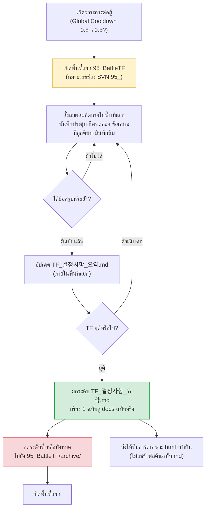

# 16.1 การดำเนินงาน TF การต่อสู้ — แยกพื้นที่ทำงานออกมา และให้เฉพาะการตัดสินใจเท่านั้นที่กลายเป็นฉบับจริง

บ่ายสี่โมงวันพฤหัสบดี การประชุม TF การต่อสู้จบลง แล้วทั้งเจ็ดคนก็แยกย้ายกลับไปที่โต๊ะของตน บนไวต์บอร์ดยังคงเหลือร่องรอยของการถกเถียงว่าจะลดค่า Global Cooldown จาก 0.8 วินาทีลงเหลือ 0.5 วินาทีดีหรือไม่ ซีเนียร์ฝ่ายบาลานซ์บอกว่า "ในซิมของผม 0.5 ถูกต้องแล้ว" ส่วนโค้ดลีดบอกว่า "ถ้า 0.5 เซิร์ฟเวอร์ติ๊กตามไม่ทัน" ฝ่ายดีไซน์ UI บอกว่า "ทั้งสองค่าผมก็ไม่แน่ใจ แต่ที่แน่ ๆ คือความกว้างของเกจคูลดาวน์จะแคบเกินไป"

ทั้งสามคนพูดถูกทั้งหมด และถ้าทั้งสามคนเริ่มจดข้อสรุปของตนลงในเอกสารของสายงานตนเอง สัปดาห์ถัดมาเอกสารทั้งสามฉบับนี้ก็จะขัดแย้งกันเอง ชีตบาลานซ์จดไว้ที่ 0.5 สเปกโค้ดจดไว้ที่ 0.8 ส่วนไกด์ UI จดไว้ที่ 0.6 ไม่ว่าใครมาดูก็ไม่รู้ว่าฉบับไหนคือฉบับจริง

เหตุผลที่ TF การต่อสู้มีอยู่ ก็คือการดูดซับความขัดแย้งนี้ให้จบในที่เดียวนั่นเอง และผลลัพธ์ของการดูดซับนั้น — การตัดสินใจเพียงหนึ่งเดียว — เท่านั้นที่ควรถูกยกขึ้นเป็นเอกสารฉบับจริง ส่วนเศษซากของการถกเถียงที่เหลือต้องจบลงภายในพื้นที่ทำงานที่ถูกแยกออกมา บทนี้ว่าด้วยกลไกของการแยกและการดูดซับนั้น

---

## 16.1.1 TF ไม่ใช่แผนกถาวร แต่เป็นพื้นที่ทำงานที่ถูกแยกออกมา

การปรับโครงสร้างระบบการต่อสู้ครั้งใหญ่ไม่ได้จบลงด้วยสายงานเดียว เพียงแค่แตะ Global Cooldown ค่าเดียว บาลานซ์ (ตัวเลข) โค้ด (เซิร์ฟเวอร์ติ๊ก) UI (การแสดงผลเกจ) แอนิเมชัน (ความยาวโมชัน) และซาวด์ (ความรู้สึกของการกระแทก) ก็สั่นไหวพร้อมกัน หากนำวาระแบบนี้ไปแยกดำเนินการตามสายงาน การตัดสินใจจะยืดออกไปครั้งละ 2\~4 สัปดาห์ และต่อให้ตัดสินใจได้ก็ยังเหลื่อมล้ำกันระหว่างสายงาน

TF (TaskForce) คือหน่วยที่รวบรวมหลายสายงานเข้ามาอยู่ในพื้นที่ทำงานเดียวกันชั่วคราว เพื่อป้องกันความเหลื่อมล้ำนี้ หัวใจอยู่ที่ "ชั่วคราว" และ "การแยก" หากปล่อยให้การถกเถียงของ TF ไหลเข้าสู่ระบบเอกสารฉบับจริงของบริษัทตรง ๆ การถกเถียงที่ยังไม่ได้ตรวจสอบ ข้อเสนอที่ถูกตีตก และตัวเลขที่ยังอยู่ระหว่างทดลองก็จะปนเปื้อนฉบับจริง ดังนั้นเราจึงสร้างพื้นที่ทำงานที่ถูกแยกออกมาขึ้นภายใน SVN โดยใช้หมายเลขขึ้นต้นด้วย `95_`

`95_BattleTF` หมายเลขในช่วง 95 เป็นข้อตกลงที่หมายถึงพื้นที่ทำงานของ TF ระยะสั้น โดยทั่วไป docs ฉบับจริงจะใช้หมายเลขในช่วง 10 และ 20 ส่วนหมายเลขในช่วง 90 คือสัญญาณของ "ชั่วคราว แยกออกมา และกำหนดยุติ" แค่เห็นหมายเลขโฟลเดอร์ก็สื่อได้ทันทีว่า "ที่นี่ไม่ใช่ฉบับจริง อย่าอ้างอิงตัวเลขที่เห็นในที่นี้"

กฎของการแยกนั้นเรียบง่าย

- เอกสารทุกชิ้นที่ผลิตขึ้นภายใน TF (บันทึกการประชุม ชีตทดลอง ข้อเสนอที่ถูกตีตก บันทึกดิบ) อยู่ได้เฉพาะภายใน `95_BattleTF` เท่านั้น
- เมื่อ TF ยุติ จะยกระดับเฉพาะ `TF_결정사항_요약.md` **เพียงหนึ่งเดียว** ขึ้นสู่ docs ฉบับจริง
- ที่เหลือทั้งหมดให้ลดลงไปเก็บไว้ใน `95_BattleTF/archive/` เพื่อจัดเก็บเท่านั้น

เหตุผลที่ TF ซึ่งกลายเป็นแผนกถาวรนั้นอันตราย ก็อยู่ตรงนี้ เมื่อการแยกถูกปลดออก ตัวเลขที่ยังไม่ได้ตรวจสอบของพื้นที่ทำงาน TF ก็จะเริ่มถูกอ้างอิงเสมือนเป็นฉบับจริง และการตัดสินใจเดียวกันก็จะถูกรื้อขึ้นมาในที่อื่นซ้ำ ๆ ทุกไตรมาส

---

## 16.1.2 จากการแยกสู่การดูดซับ: ภาพรวมทั้งกระบวนการ

หนึ่งรอบของ TF การต่อสู้มีโครงสร้างคือ เปิดพื้นที่ที่ถูกแยกออกมา สั่งสมการถกเถียง การทดลอง และการตัดสินใจไว้ภายในนั้น แล้วเมื่อยุติก็ดูดซับเฉพาะการตัดสินใจขึ้นสู่ฉบับจริง



วาระเข้ามาจากมุมบนซ้าย เสียงรบกวนทั้งหมดถูกจัดการภายในพื้นที่แยกสีเหลือง แล้วมีเพียงช่องสีเขียวช่องเดียว — สรุปการตัดสินใจ — เท่านั้นที่ไหลออกไปสู่ฉบับจริง สีแดงคือการลดระดับ ภาพเดียวนี้คือทั้งหมดของการดำเนินงานพื้นที่ทำงานช่วง 95

---

## 16.1.3 บันทึกเซสชันจริง (worked transcript) — ทำให้สรุปการตัดสินใจอยู่ในรูปที่ดูดซับได้

ในจังหวะที่ TF ยุติ งานที่กินแรงที่สุดคือการคัดเอา "เฉพาะการตัดสินใจที่จะยกขึ้นเป็นฉบับจริง" ออกมาจากบันทึกการประชุมและชีตทดลองของหนึ่งไตรมาส การถกเถียงนั้นยืดยาว ข้อเสนอที่ถูกตีตกกับข้อเสนอที่ยืนยันแล้วปะปนกันอยู่ และตัวเลขเดียวกันก็ถูกจดไว้ต่างกันเล็กน้อยในแต่ละการประชุม หากให้คนจัดการด้วยมือ ลำพังงานปิด TF ก็กินเวลาไปทั้งวัน

ด้านล่างนี้คือพรอมต์ที่รันจริง ผลลัพธ์ดิบของ Claude และกระบวนการทั้งหมดว่าผมตรวจสอบ ปฏิเสธ และร้องขอใหม่อย่างไร ลงไว้ตามจริงโดยไม่ย่อ

### พรอมต์รอบที่ 1 (ฉบับเต็ม)

```
จากบันทึกการประชุม 95_BattleTF จำนวน 6 ฉบับด้านล่าง ช่วยคัดเฉพาะการตัดสินใจที่ยืนยันแล้วซึ่งจะยกขึ้นเป็นฉบับจริง
แล้วร่าง TF_결정사항_요약.md ให้หน่อย TF กำลังจะยุติเร็ว ๆ นี้
เอาเฉพาะที่ยืนยันแล้ว (ตัดที่ถูกตีตก ที่กำลังทดลอง และ "ค่อยดูทีหลัง" ออก) แต่ละการตัดสินใจ
ให้อยู่ในรูปแบบ รหัสการตัดสินใจ·หัวข้อ·ค่าที่ยืนยัน·เหตุผล (แหล่งข้อมูล)·ผู้ตัดสินใจ·วันที่ยืนยัน
ถ้าหัวข้อเดียวกันมีค่าเปลี่ยนไปในแต่ละการประชุม ให้เก็บเฉพาะค่าสุดท้ายและทิ้งของก่อนหน้า
ถ้าไม่แน่ใจว่ายืนยันแล้วหรือไม่ อย่าทิ้ง แต่ให้แยกออกไปเป็น [ต้องพิจารณา] และถ้าไม่มีแหล่งเหตุผลให้ระบุเป็น [ไม่ได้บันทึกเหตุผล]

บันทึกการประชุม:
--- บันทึกการประชุม 2026-W14-mon ---
วาระ1: พิจารณา Global Cooldown 0.8→0.5 จากซิมบาลานซ์ (sim_gcd_0407.xlsx)
0.5 ทำให้การกระจาย DPS -12% โค้ดลีด: 0.5 ติดข้อจำกัดเซิร์ฟเวอร์ติ๊ก (33ms) ขอชะลอไว้ก่อน
ผลสรุป: เห็นพ้องเบื้องต้นที่ 0.6 (ชั่วคราว) ให้ฝ่ายโค้ดทดสอบโหลด 0.6 ภายในการประชุมครั้งหน้า
วาระ2: i-frame หลบหลีก 12f→10f แอนิเมชันไดเรกเตอร์บอกโมชัน 8f ถ้า 10f จะเกิดความขาดช่วงทางสายตา
ผลสรุป: ยืนยันคง 12f ผู้ตัดสินใจ ลีดฝ่ายออกแบบ
... (ไม่มีส่วนที่ตัดทอน ในความเป็นจริงมีบันทึกการประชุมฉบับเต็มทั้ง 6 ฉบับใส่เข้ามา) ...
--- บันทึกการประชุม 2026-W16-thu ---
วาระ1: Global Cooldown การทดสอบโหลด 0.6 ผ่าน (เซิร์ฟเวอร์ติ๊กเหลือ 18%)
ผลสรุป: ยืนยัน 0.6 ผู้ตัดสินใจ ลีดฝ่ายออกแบบ เหตุผล sim_gcd_0407.xlsx + load_0415.log
วาระ3: รางวัลสังหารเหรียญ 1.2 เท่า ฝ่ายบาลานซ์เสนอ ไม่มีเหตุผล ชะลอไว้
```

### ผลลัพธ์ดิบของ Claude (ตามจริง)

```markdown
# TF_결정사항_요약.md (ร่าง)

## การตัดสินใจที่ยืนยันแล้ว

### D-GCD-01 | Global Cooldown
- ค่าที่ยืนยัน: 0.6 วินาที (เดิม 0.8 วินาที)
- เหตุผล: sim_gcd_0407.xlsx (ผลกระทบต่อการกระจาย DPS), load_0415.log (โหลดเซิร์ฟเวอร์ติ๊กเหลือ 18%)
- ผู้ตัดสินใจ: ลีดฝ่ายออกแบบ
- วันที่ยืนยัน: 2026-W16-thu
- หมายเหตุ: ใน W14 มีข้อเสนอ 0.5 แต่ติดข้อจำกัดเซิร์ฟเวอร์ติ๊กจึงลู่เข้าหา 0.6 ข้อเสนอ 0.5 ถูกยกเลิก

### D-IFRAME-01 | i-frame หลบหลีก
- ค่าที่ยืนยัน: คง 12 เฟรม
- เหตุผล: [ไม่ได้บันทึกเหตุผล] — มีเพียงการบันทึกการตัดสินเชิงคุณภาพว่าโมชันแอนิเมชัน 8f ทำให้เกิดความขาดช่วงทางสายตา
- ผู้ตัดสินใจ: ลีดฝ่ายออกแบบ
- วันที่ยืนยัน: 2026-W14-mon

## [ต้องพิจารณา]

### R-COIN-01 | รางวัลสังหารเหรียญ 1.2 เท่า
- สถานะ: ชะลอ (ฝ่ายบาลานซ์เสนอ ไม่มีข้อมูลเหตุผล)
- ความเห็น: ยืนยันไม่ได้เพราะไม่ได้ส่งเหตุผลมา แนะนำให้โอนเป็นวาระเดี่ยวของทีมบาลานซ์หลัง TF ยุติ
```

### การตรวจสอบของผม — รับอะไรไว้และปฏิเสธอะไร

ผมดูทีละสามรายการ

**D-GCD-01 ผ่านไปตามนั้น** การทิ้งข้อเสนอชั่วคราว 0.5/0.6 ของ W14 แล้วเก็บเฉพาะการยืนยัน 0.6 ของ W16 นั้นถูกต้อง ทำตามกฎข้อ 3 ได้อย่างเหมาะสม การรวมแหล่งเหตุผลสองแหล่งเข้าด้วยกันก็ถูกต้องเช่นกัน

**D-IFRAME-01 ผมปฏิเสธ** Claude จัดรายการนี้เป็น "ยืนยันแล้ว" ทั้งที่เหตุผลคือ `[ไม่ได้บันทึกเหตุผล]` หากยกการตัดสินเชิงคุณภาพ (ความขาดช่วงทางสายตา) เพียงอย่างเดียวขึ้นเป็นการตัดสินใจที่ยืนยันแล้ว คนอื่นที่มาดูฉบับจริงก็จะหาเหตุผลของ "ทำไมต้อง 12f" ไม่เจอ นี่คือกรณีที่กฎข้อ 1 กับข้อ 5 ขัดกัน — Claude เห็นว่าผู้ตัดสินใจยืนยันแล้วจึงมองว่า "ยืนยัน" แต่ผมต้องบังคับใช้นโยบาย docs ของเราที่ว่า "การยืนยันที่ไม่มีเหตุผลรองรับ ขึ้นฉบับจริงไม่ได้" นโยบายนี้ไม่ได้จดไว้ในบันทึกการประชุม Claude จึงไม่มีทางรู้

**R-COIN-01 จัดประเภทถูก แต่ข้อกำหนดเกินเลยไป** "แนะนำให้โอนเป็นวาระเดี่ยวของทีมบาลานซ์" เป็นขั้นตอนที่ Claude แต่งขึ้น บริษัทเราไม่มีแทร็กการโอนแบบนั้น ผมรับการจัดประเภท (ต้องพิจารณา) ไว้ แต่ทิ้งประโยคที่เป็นข้อกำหนด

### พรอมต์ร้องขอใหม่รอบที่ 2

```
ปรับตามการตรวจสอบแล้วทำใหม่หน่อย D-GCD-01 ให้คงไว้ตามเดิม
D-IFRAME-01 เหตุผลมีแค่การตัดสินเชิงคุณภาพ ให้ดึงออกจากที่ยืนยันแล้วไปไว้ที่ [ยกระดับหลังเสริมเหตุผล]
R-COIN-01 ให้คงการจัดประเภทไว้ แต่ตัดประโยคข้อกำหนดอย่าง "แนะนำให้โอน" ออก — คุณไม่รู้ขั้นตอนของบริษัทเรา ให้จดแค่สถานะกับข้อเท็จจริง
และอย่าแต่งขั้นตอน แทร็ก หรือชื่อทีมที่ไม่มีในบันทึกการประชุม ถ้าไม่รู้ก็เว้นไว้เป็น [ต้องให้ลีดฝ่ายออกแบบตัดสิน]
// (เจตนา: เงื่อนไขยกระดับ D-IFRAME-01 สู่ฉบับจริง = แนบข้อมูลวัดเฟรมโมชันของแอนิเมชันไดเรกเตอร์เข้าบันทึกการประชุม)
```

### ผลลัพธ์รอบที่ 2 (ฉบับยืนยัน)

```markdown
# TF_결정사항_요약.md

## การตัดสินใจที่ยืนยันแล้ว (เป้าหมายยกระดับสู่ฉบับจริง)

### D-GCD-01 | Global Cooldown
- ค่าที่ยืนยัน: 0.6 วินาที (เดิม 0.8 วินาที)
- เหตุผล: sim_gcd_0407.xlsx, load_0415.log (โหลดเซิร์ฟเวอร์ติ๊กเหลือ 18%)
- ผู้ตัดสินใจ: ลีดฝ่ายออกแบบ / วันที่ยืนยัน: 2026-W16-thu
- หมายเหตุ: ข้อเสนอ 0.5 ถูกยกเลิกเพราะข้อจำกัดเซิร์ฟเวอร์ติ๊ก

## [ยกระดับหลังเสริมเหตุผล]

### D-IFRAME-01 | คง i-frame หลบหลีก 12f
- มีเพียงการบันทึกการตัดสินเชิงคุณภาพ (ความขาดช่วงทางสายตาเทียบกับโมชันแอนิเมชัน 8f)
- เงื่อนไขยกระดับ: แนบข้อมูลวัดเฟรมโมชันเข้าบันทึกการประชุม

## [ต้องให้ลีดฝ่ายออกแบบตัดสิน]

### R-COIN-01 | รางวัลสังหารเหรียญ 1.2 เท่า
- สถานะ: ชะลอ ฝ่ายบาลานซ์เสนอ ไม่มีข้อมูลเหตุผล ไม่มีค่าที่ยืนยัน
```

ในฉบับยืนยันนี้ เฉพาะส่วน "การตัดสินใจที่ยืนยันแล้ว" — D-GCD-01 รายการเดียว — เท่านั้นที่ถูกยกระดับสู่ docs ฉบับจริง อีกสองส่วนที่เหลือถูกลดลงไปที่ `archive/` บันทึกการประชุม 6 ฉบับของหนึ่งไตรมาสถูกดูดซับลงเหลือฉบับจริงเพียงบรรทัดเดียว

ตรงนี้เองที่แยกได้ว่าอะไรคือสิ่งที่ AI ทำได้และทำไม่ได้ AI ไล่ตามการเปลี่ยนแปลงของค่าในหัวข้อเดียวกันข้ามบันทึกการประชุมทั้ง 6 ฉบับ แยกข้อเสนอที่ถูกตีตกออก และทำเครื่องหมายตรงที่เหตุผลขาดหาย — งานทำซ้ำเรียบง่ายที่ต้องเทียบบันทึกการประชุมหกฉบับทีละบรรทัดนี้เองที่มือคนพลาดได้ง่าย แต่การบังคับใช้นโยบายที่ว่า "การยืนยันที่ไม่มีเหตุผลรองรับ ขึ้นฉบับจริงไม่ได้" ข้อเท็จจริงของบริษัทที่ว่า "ไม่มีแทร็กการโอน" และการตัดสินขั้นสุดท้ายว่า "ยืนยัน/ชะลอ" ล้วนเป็นสิ่งที่คนทำทั้งหมด หากลบย่อหน้าที่ AI เขียนออก แรงงานในการคัดและจัดเรียงก็หายไป แต่การตัดสินใจว่าอะไรจะขึ้นฉบับจริงยังคงอยู่ในมือคน

---

## 16.1.4 คำขอจากภายนอกเข้ามาโดยถูกจัดประเภทเป็น 3-track

วาระที่เข้ามาที่ TF ไม่ได้เกิดขึ้นภายในทั้งหมด มีคำขอจากผู้เผยแพร่ (publisher) เอาต์ซอร์สฝ่ายอาร์ต และทีมธุรกิจที่ว่า "เกี่ยวกับการต่อสู้ ช่วยทำเรื่องนี้ให้หน่อย" เข้ามาด้วย หากรับสิ่งเหล่านี้เป็นวาระ TF อย่างไม่เลือก TF ก็จะกลายเป็นช่องรับเรื่องร้องเรียนจากภายนอก

ดังนั้นพอคำขอจากภายนอกเข้ามา จะจัดประเภทเป็นสามแยกทันที เฉพาะเรื่องที่ต้องตัดสินใจเกี่ยวกับการต่อสู้เท่านั้นที่ส่งเข้า 95_BattleTF เรื่องที่จบได้ในสายงานเดียว ผู้รับผิดชอบจัดการเดี่ยว ส่วนเรื่องที่อยู่นอกขอบเขตหรือเหตุผลไม่พอ ให้เขียนเหตุผลแล้วตอบกลับหรือชะลอไว้ สิ่งที่เข้าสู่ TF มีเพียงแยกแรกเท่านั้น — นี่คือแนวป้องกันด่านแรกที่กัน TF ไม่ให้แปรสภาพเป็นช่องรับเรื่องร้องเรียน ตัวการจัดประเภทเองเป็นการตัดสินของคน แต่การให้ AI อ่านข้อความคำขอที่เข้ามาแล้วติดแท็กเบื้องต้นว่า "เรื่องนี้พาดพิงกี่สายงาน" ในระดับนั้น ให้ AI ช่วยกวาดสายตาดูก่อนได้

ลำดับการตัดสินของการจัดประเภทสามแยกนี้ (`request-triangulate`) บันทึกเซสชันจริง และการจัดการต่อเนื่องแยกตามแทร็ก เป็นหน้าที่ของบทถัดไป 16.2 ที่จะดูแลทั้งหมด ในที่นี้ระบุไว้เพียงกฎทางเข้าที่ว่า "TF รับเฉพาะแยกแรกเท่านั้น"

---

## 16.1.5 ส่งให้ทีมอาร์ตเฉพาะ html เท่านั้น — md เรียนรู้เป็นศูนย์

เมื่อการตัดสินใจของ TF ถูกยกระดับเป็นฉบับจริง ก็จะแชร์ไปยังทีมที่เกี่ยวข้อง ตรงนี้มีความไม่สมมาตรอยู่อย่างหนึ่ง คือไม่ให้ไฟล์ต้นฉบับ Markdown (.md) แก่ทีมอาร์ต แต่ส่งเฉพาะ html ที่เรนเดอร์แล้ว

เหตุผลเรียบง่าย ทีมอาร์ตรู้แค่ **ผลลัพธ์** ของการตัดสินใจก็พอ "ช่วยปรับความกว้างของเกจคูลดาวน์ใหม่โดยอิงเกณฑ์ 0.6 วินาที" — บรรทัดเดียวนี้คือทั้งหมดที่พวกเขาต้องการ ในไฟล์ต้นฉบับ md มีระบบรหัสการตัดสินใจ การอ้างอิง atom ร่องรอยของข้อเสนอ 0.5 ที่ถูกตีตก และชื่อไฟล์ข้อมูลเหตุผลรวมอยู่ด้วย สิ่งเหล่านี้คือภาษาทำงานที่ฝ่ายออกแบบกับฝ่ายโค้ดใช้ร่วมกัน ไม่ใช่สิ่งที่ฝ่ายอาร์ตต้องมาเรียนรู้

หากให้ md ไปตรง ๆ ทีมอาร์ตจะต้องจ่ายต้นทุนสองอย่าง อย่างแรก เสียเวลาไปกับการตีความระบบสัญลักษณ์ที่ไม่เกี่ยวกับตน อย่างที่สอง อาจเข้าใจผิดว่าข้อมูลที่ยังไม่ได้ตรวจสอบหรือถูกตีตกเป็นการตัดสินใจ html กันทั้งสองอย่างนี้ได้ — เห็นเพียงผลการตัดสินใจที่เรนเดอร์ออกมาอย่างเรียบร้อย ส่วนสัญลักษณ์ภายในถูกกรองออกในขั้นตอนการบิลด์

เขียนเป็นหลักการได้ว่า **ภาษาทำงาน (md) วนอยู่เฉพาะภายในสายงานที่ใช้ภาษานั้น และส่งออกไปข้างนอกเฉพาะผลลัพธ์ (html) เท่านั้น** เป็นปรัชญาเดียวกับการแยกพื้นที่ทำงาน TF (ช่วง 95) ของดิบที่ใช้ภายในเก็บไว้ภายใน ส่วนที่ส่งออกไปข้างนอกคือผลลัพธ์ที่ดูดซับแล้วเท่านั้น

---

## 16.1.6 รากฐานของการดำเนินงาน TF — ห้าหลักการ

เพื่อให้กลไกการแยกและการดูดซับทำงานได้ ต้องมีหลักการดำเนินงานห้าข้อรองรับอยู่ข้างใต้ ขาดไปแม้ข้อเดียว TF ก็จะพังกลายเป็นแค่เวทีถกเถียง

- **อำนาจตัดสินใจชัดเจน** — ในที่ประชุมต้องกำหนดไว้ตามประเภทวาระว่าใครคือผู้ตัดสินใจขั้นสุดท้าย กฎการต่อสู้คือลีดฝ่ายออกแบบ ตัวเลขคือซีเนียร์ฝ่ายบาลานซ์ วิธีอิมพลีเมนต์คือโค้ดลีด ความขัดแย้งระหว่างสายงานเอสคาเลตไปที่เกมไดเรกเตอร์ หากอำนาจตัดสินใจคลุมเครือ การประชุมก็จะยืดออกไปเป็นการถกเถียง
- **บันทึกการประชุมเป็นข้อบังคับ** — การตัดสินใจที่ไม่มีบันทึกการประชุม ไม่ใช่การตัดสินใจ ต้องเหลือไว้เป็นบันทึกภายในพื้นที่แยกเสมอ วัตถุดิบที่จะดูดซับเมื่อยุติก็คือบันทึกการประชุมนี้นี่เอง
- **ข้อมูลมาก่อน** — อินพุตคือข้อมูล ไม่ใช่ความเห็น หาก "ผมว่า..." มีมากขึ้น TF ก็จะหมดสภาพ การที่ทำให้ `[ไม่ได้บันทึกเหตุผล]` ถูกทำเครื่องหมายอัตโนมัติในบันทึกเซสชันจริงก่อนหน้านี้ ก็เป็นส่วนต่อขยายของหลักการนี้เช่นกัน
- **กำหนดเวลา** — แต่ละวาระให้ติดกำหนดเวลาของการตัดสินใจ การทดลอง การอิมพลีเมนต์ และการตรวจสอบ วาระที่ไม่มีกำหนดเวลาจะลอยเคว้งครั้งละ 1\~2 สัปดาห์
- **ประเมินซ้ำเป็นระยะ** — TF ไม่ใช่สิ่งถาวร ให้ทบทวนการคงอยู่ในทุกไตรมาส หากการตัดสินใจต่อไตรมาสลดต่ำกว่าจำนวนที่กำหนด ก็ยุบหรือลดขนาด แต่หากมีการคาดการณ์ว่าวาระจะพุ่งทะลักในไตรมาสถัดไป ก็ตกลงร่วมกันให้ขยายเวลาออกไปอีกหนึ่งไตรมาส

เมื่อหลักการทั้งห้าถูกผูกเข้าด้วยกันและทำงาน พื้นที่ช่วง 95 ที่ถูกแยกออกมาก็จะไม่ใช่เวทีถกเถียง แต่กลายเป็นโรงงานตัดสินใจ

---

## 16.1.7 กับดักที่พบบ่อย

ขอประมวลกับดักและข้อกำหนดที่เกิดซ้ำในช่วงกลางของการดำเนินงาน TF เป็นต้นไป

| กับดัก | อาการ | ข้อกำหนด |
|---|---|---|
| แปรเป็นที่ประชุมเฉย ๆ | มีแต่แลกเปลี่ยนความเห็น ไม่มีการตัดสินใจ | บังคับช่องการตัดสินใจ N ช่องทุกการประชุม |
| ล่วงล้ำอำนาจ | TF เข้าแทรกการตัดสินใจของสายงานอื่น | ทำตารางอำนาจตัดสินใจให้ชัดเจน |
| สมาชิกรับภาระเกิน | เข้าร่วม TF ซ้อนกัน 5\~6 ตัวจนกัดกินงานหลัก | จำกัดเวลาเข้าร่วม TF รวมไม่เกิน 8 ชั่วโมงต่อสัปดาห์ |
| กลายเป็นถาวร | ประชุมเรื่องเดิมซ้ำ ๆ โดยไม่ยุบ | ประเมินซ้ำรายไตรมาส |
| การแยกรั่ว | ตัวเลขที่ยังไม่ได้ตรวจสอบในช่วง 95 ถูกอ้างอิงเสมือนเป็นฉบับจริง | ยกระดับสู่ฉบับจริงได้เฉพาะสรุปการตัดสินใจ 1 ฉบับ |
| ขาดการเชื่อมต่อภายนอก | ไม่แชร์การตัดสินใจออกไปภายนอก | ยกระดับเป็นฉบับจริง + ส่ง html |

การแยกรั่วเป็นสิ่งที่เงียบที่สุดและอันตรายที่สุด เมื่อข้อตกลงเรื่องหมายเลขโฟลเดอร์พังลง ทุกอย่างก็พังตามไปด้วย

---

## 16.1.8 การวัด — สิ่งที่ TF ดูดซับ

ผมขอนำเฉพาะทิศทางและสัดส่วนมาจากบันทึกการดำเนินงานโปรเจกต์ A ของผู้เขียน ตัวเลขด้านล่างไม่ใช่ค่าสัมบูรณ์ แต่เป็นทิศทางการเปลี่ยนแปลงตอนดำเนินงานเทียบกับตอนไม่มี TF — รอบเวลาสัมบูรณ์แตกต่างกันไปตามขนาดทีมและรอบการบิลด์ (เป็นการสังเกตการณ์อิงสภาพแวดล้อมของผู้เขียน)

| รายการ | ไม่มี TF | มี TF | ทิศทาง |
|---|---|---|---|
| รอบของการตัดสินใจการต่อสู้ 1 รายการ | แยกตามสายงาน หลายสัปดาห์ | ระดับไม่กี่วัน | สั้นลง |
| ความขัดแย้งระหว่างสายงานหลังตัดสินใจ | หลายครั้งต่อไตรมาส | น้อยครั้งต่อไตรมาส | ลดลง |
| การเอสคาเลตขึ้นเกมไดเรกเตอร์ | หลายครั้งต่อสัปดาห์ | 1\~2 ครั้งต่อสัปดาห์ | ลดลง |
| การแชร์ข้อมูลระหว่างสายงาน | กระจัดกระจาย | ตรึงไว้ด้วยบันทึกประชุม·การยกระดับฉบับจริง | เป็นระบบ |

สิ่งที่ได้กลับคืนมามากที่สุดคือเวลาของเกมไดเรกเตอร์ เพราะ TF ดูดซับการตัดสินใจระหว่างสายงานไว้ภายในพื้นที่แยก ความขัดแย้งที่จะไหลขึ้นมาถึงโต๊ะของไดเรกเตอร์จึงลดลง สรุปแล้ว TF คือกลไกที่ดึง "ข้อตกลงระหว่างสายงานที่ไดเรกเตอร์เคยต้องไกล่เกลี่ยทีละเรื่อง" ลงมาจัดการในพื้นที่ทำงานเดียว

---

## สรุปประเด็นสำคัญของบท

- TF คือพื้นที่ทำงานชั่วคราวที่ถูกแยกออกมาด้วยช่วง 95 และเมื่อยุติจะมีเพียงสรุปการตัดสินใจ 1 ฉบับเท่านั้นที่ถูกดูดซับเป็นฉบับจริง
- AI คัดและจัดเรียงการตัดสินใจข้ามบันทึกการประชุม แต่คนเป็นผู้กำหนดว่าจะยกระดับเป็นฉบับจริงหรือไม่
- คำขอจากภายนอกถูกจัดประเภทเป็น 3-track และส่งออกให้ทีมอาร์ตเฉพาะผลลัพธ์ html เท่านั้น

---

> **การประยุกต์นอกเกม** หลักการที่ว่าให้ดูดซับเฉพาะการตัดสินใจเป็นฉบับจริงจากพื้นที่ทำงานที่ถูกแยกออกมานั้น ประยุกต์ใช้ได้ตรง ๆ กับทุกโปรเจกต์ที่ตัดข้ามแผนกแม้ไม่เกี่ยวกับเกม ตัวอย่างเช่น ลองนึกถึง TF ที่ฝ่ายการตลาด ฝ่ายกฎหมาย และฝ่ายขายมาร่วมกันหารือการปรับแก้ข้อกำหนดและเงื่อนไขฉบับใหม่ดูสิ บันทึกการประชุม ความเห็นในการพิจารณา และร่างถ้อยคำที่ถูกตีตก ให้เก็บไว้ในโฟลเดอร์ชั่วคราวของไดรฟ์ที่แชร์กัน (พื้นที่แยกอย่าง `95_약관TF`) แล้วพอ TF จบ ให้ยกระดับเฉพาะ `최종_확정문구.docx` เพียงฉบับเดียวขึ้นสู่ตู้เอกสารฉบับจริงภายในบริษัท ที่เหลือลดลงไปเก็บใน archive ทำเช่นนี้แล้ว เมื่ออีกหกเดือนต่อมามีคนมาถามว่า "ทำไมข้อนี้ถึงกำหนดไว้แบบนี้นะ" ก็จะกันอุบัติเหตุที่ร่างยังไม่ยืนยันแอบเข้ามาทำตัวเป็นฉบับจริงได้

---

## ลองทำดู — การดูดซับการตัดสินใจเมื่อสิ้นไตรมาส

**setup**
- สร้างพื้นที่แยก `95_BattleTF/` ใน SVN (หรือโฟลเดอร์) แล้วรวบรวมบันทึกการประชุมของหนึ่งไตรมาสไว้ในนั้น
- สร้าง `95_BattleTF/archive/` ไว้ล่วงหน้า (ที่ที่เป้าหมายการลดระดับจะไป)

**prompt**
- แปะพรอมต์รอบที่ 1 ของบทนี้พร้อมกับบันทึกการประชุมฉบับเต็ม กฎหลัก: ① เฉพาะการตัดสินใจที่ยืนยันแล้ว ② หัวข้อเดียวกันเอาเฉพาะค่าสุดท้าย ③ ถ้าคลุมเครืออย่าทิ้ง แต่ให้แยกระบุ ④ ถ้าไม่มีเหตุผลให้ระบุชัด ⑤ อย่าแต่งขั้นตอนของบริษัทหรือชื่อทีมขึ้นมา

**verify**
- ดูการจัดประเภท "ยืนยันแล้ว" ในผลลัพธ์ทีละรายการ รายการที่มีเหตุผลเป็นแค่การตัดสินเชิงคุณภาพ ให้ดึงออกจาก "ยืนยันแล้ว" (บังคับใช้นโยบายยกระดับสู่ฉบับจริง)
- ตรวจว่าในประโยคข้อกำหนดที่ AI สร้างขึ้น (การโอน แทร็ก คำแนะนำ) มีขั้นตอนที่ไม่มีอยู่จริงแทรกอยู่หรือไม่ แล้วลบทิ้ง
- คัดลอกเฉพาะส่วน "การตัดสินใจที่ยืนยันแล้ว" ไปยัง docs ฉบับจริง ที่เหลือลดลงไปที่ `archive/`

---

## 16.1.9 ฉบับย่อสำหรับคนเดียว

สำหรับนักพัฒนาคนเดียวที่ทำงานลำพัง การแยกและการดูดซับก็ยังใช้ได้ตรง ๆ เพียงเปลี่ยน "TF" เป็น "หลายบทบาทในหัวของตัวเอง"

- เวลาจะตัดสินใจฟีเจอร์หนึ่ง ให้ขุดโฟลเดอร์ชั่วคราวอย่าง `95_temp_결정/` ขึ้นมา แล้วระบายซิม โน้ต และข้อเสนอที่ถูกตีตกลงไปในนั้นให้หมด
- พอได้ข้อสรุป ให้ย้ายเฉพาะ `결정요약.md` ฉบับเดียวมายังโฟลเดอร์งานหลัก แล้วลดโฟลเดอร์ชั่วคราวทั้งก้อนลงไปที่ `archive/`
- เวลาส่งให้ภายนอก (เอาต์ซอร์สฝ่ายอาร์ต นักแปล) ให้เรนเดอร์สรุปการตัดสินใจเป็น html แล้วส่งเฉพาะผลลัพธ์ ส่วนโน้ตงานของตัวเอง (md) อย่าให้ไป

เมื่อมีพื้นที่แยก จะแยกแยะ "ค่านี้ยืนยันแล้วหรือยังอยู่ระหว่างทดลอง" ได้ด้วยตำแหน่งโฟลเดอร์เพียงอย่างเดียว แม้ทำงานคนเดียว นี่ก็เป็นวิธีที่ถูกที่สุดในการไม่ส่งต่อความสับสนแบบเดิมให้ตัวเองในอนาคต
