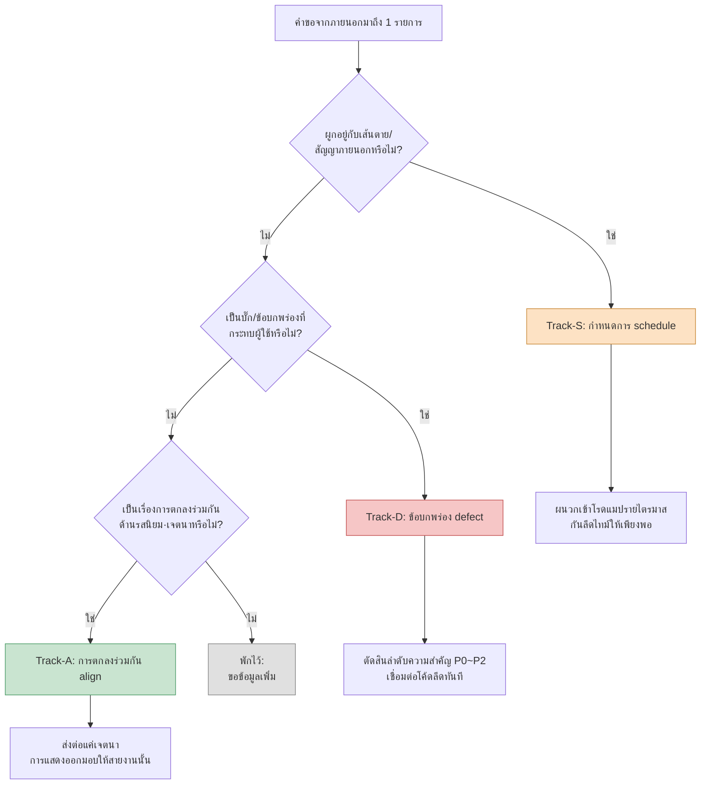

# 16.2 การทำงานร่วมกับสายงานอื่น — จำแนกคำขอจากภายนอกออกเป็น 3-track

เช้าวันอังคาร แชตภายในทีมดังขึ้นเกือบพร้อมกันสามครั้ง

อาร์ตลีด: "สีของเอฟเฟกต์การต่อสู้ตอนนี้โทนหม่นเกินไป จะปรับให้สดใสขึ้นได้หรือไม่"

QA ลีด: "มีเคสที่รางวัลเช็กชื่อกิลด์ถูกแจกซ้ำสองครั้ง แนบวิดีโอที่ทำให้เกิดซ้ำมาด้วยแล้ว"

ผู้รับผิดชอบฝั่งผู้จัดจำหน่าย: "ขอให้นำแนวทาง (guideline) สำหรับวัฒนธรรมอิสลามมาปรับใช้กับบิลด์เอเชียตะวันออกเฉียงใต้ด้วย ภายในก่อนการตรวจสอบของไตรมาสหน้า"

จำนวนตัวอักษรของข้อความทั้งสามใกล้เคียงกัน แต่ข้อความหนึ่งเป็นงานที่จบได้ใน 30 นาที อีกข้อความหนึ่งเป็นเหตุที่ต้องดึงตัวโค้ดลีดมาจัดการทันที และอีกข้อความหนึ่งเป็นกำหนดการภายนอกที่ต้องสอดเข้าไปในแผนระดับไตรมาส หากปฏิบัติต่อทั้งสามด้วยน้ำหนักเท่ากันเพียงเพราะตกลงมาในกล่องจดหมายเดียวกัน เราก็จะใช้เวลาครึ่งวันไปกับงาน 30 นาที ในขณะที่เหตุจริง ๆ ถูกปล่อยทิ้งไว้จนถึงเย็น

คำขอที่ส่งเข้ามาหานักออกแบบเกมมีเนื้อในที่แตกต่างกันพอ ๆ กับจำนวนสายงาน ปัญหาคือคำขอเหล่านั้นมาถึงในรูปแบบเดียวกันหมด นั่นคือ "ข้อความบรรทัดเดียว" บทนี้ว่าด้วยงานของการแยกบรรทัดเหล่านั้นออกเป็นสามแทร็กทันทีที่ได้รับ ในวินาทีที่แทร็กถูกแยก มันก็จะกำหนดว่าเราต้องหยุดทำอะไรตอนนี้และเลื่อนอะไรไว้ทีหลัง

---

## 16.2.1 การทำงานร่วมกันกำหนดงานหลัก

นักออกแบบเกมไม่ได้สร้างทั้งโค้ด อาร์ต หรือเสียงด้วยตัวเอง เพียงเขียนสเปก ส่งต่อเจตนา และตรวจสอบผลลัพธ์เท่านั้น ทุกผลงานออกมาผ่านมือของสายงานอื่น ดังนั้นคุณภาพของการทำงานร่วมกันจึงกำหนดคุณภาพของผลงานออกแบบโดยตรง

ในโปรเจกต์ A ที่ผู้เขียนทำงานในฐานะ Design Director (โมบายล์มาก่อน MMORPG ทีมขนาดกลาง (10\~50 คน)) หากกางสายงานที่นักออกแบบเกมต้องทำงานร่วมด้วยเป็นประจำออกมา จะได้ดังนี้

<svg viewBox="0 0 720 300" xmlns="http://www.w3.org/2000/svg" font-family="sans-serif" font-size="13">
  <rect x="300" y="120" width="120" height="60" rx="8" fill="#2b3a55" stroke="#1a2433"/>
  <text x="360" y="146" fill="#fff" text-anchor="middle" font-weight="bold">นักออกแบบเกม</text>
  <text x="360" y="166" fill="#cdd6e5" text-anchor="middle" font-size="11">40~60% ของเวลา</text>

  <g fill="#e8edf5" stroke="#9fb0c9">
    <rect x="40" y="30" width="130" height="44" rx="6"/>
    <rect x="40" y="100" width="130" height="44" rx="6"/>
    <rect x="40" y="170" width="130" height="44" rx="6"/>
    <rect x="40" y="240" width="130" height="44" rx="6"/>
    <rect x="550" y="30" width="130" height="44" rx="6"/>
    <rect x="550" y="100" width="130" height="44" rx="6"/>
    <rect x="550" y="170" width="130" height="44" rx="6"/>
  </g>
  <g fill="#1a2433" text-anchor="middle">
    <text x="105" y="50">ดีเวลอป (โค้ด·ทูล)</text><text x="105" y="66" font-size="10" fill="#5a6a82">ทุกวัน</text>
    <text x="105" y="120">อาร์ต</text><text x="105" y="136" font-size="10" fill="#5a6a82">สัปดาห์ละ 2~3 ครั้ง</text>
    <text x="105" y="190">เสียง</text><text x="105" y="206" font-size="10" fill="#5a6a82">สัปดาห์ละ 1~2 ครั้ง</text>
    <text x="105" y="260">แอนิเมชัน</text><text x="105" y="276" font-size="10" fill="#5a6a82">สัปดาห์ละ 1~2 ครั้ง</text>
    <text x="615" y="50">QA</text><text x="615" y="66" font-size="10" fill="#5a6a82">สัปดาห์ละ 1 ครั้ง+MS</text>
    <text x="615" y="120">ปฏิบัติการ·CS</text><text x="615" y="136" font-size="10" fill="#5a6a82">สัปดาห์ละ 1 ครั้ง</text>
    <text x="615" y="190">ภายนอก (ผู้จัดจำหน่าย·แพลตฟอร์ม)</text><text x="615" y="206" font-size="10" fill="#5a6a82">ไตรมาสละ 1~2 ครั้ง</text>
  </g>

  <g stroke="#9fb0c9" stroke-width="1.2" fill="none">
    <path d="M170 52 C 240 90, 270 120, 300 135"/>
    <path d="M170 122 C 230 130, 260 140, 300 148"/>
    <path d="M170 192 C 230 175, 260 162, 300 158"/>
    <path d="M170 262 C 240 210, 270 180, 300 170"/>
    <path d="M550 52 C 480 90, 450 120, 420 135"/>
    <path d="M550 122 C 490 130, 460 142, 420 150"/>
    <path d="M550 192 C 490 175, 460 162, 420 160"/>
  </g>
</svg>

นักออกแบบเกมเชื่อมโยงกับเจ็ดสายงานตั้งแต่ระดับรายวันไปจนถึงระดับไตรมาส เวลา 40\~60% ที่นักออกแบบเกมใช้ที่โต๊ะทำงานหมดไปกับการทำงานร่วมกันนี้ เท่ากับว่าเวลาที่ใช้กับงานหลัก (การออกแบบ) มีเพียงครึ่งหนึ่งที่เหลือ ถ้าเป็นเช่นนั้น การลดเวลาทำงานร่วมกันก็คือการเพิ่มเวลางานหลักนั่นเอง และสาเหตุที่กินเวลาทำงานร่วมกันมากที่สุดอยู่ที่การทุ่มพลังลงผิดที่เพราะจำแนกคำขอที่เข้ามาไม่ได้

---

## 16.2.2 เนื้อในสามแบบที่คำขอบรรทัดเดียวซ่อนไว้

ลองกลับไปดูข้อความสามอันก่อนหน้า ผิวเผินแล้วทั้งหมดคือ "ช่วย\~ให้หน่อย" แต่ภายในนั้นซ่อนลักษณะที่แตกต่างกันสามแบบ

- คำขอเรื่องสีของอาร์ตลีดเป็น **เรื่องของรสนิยมและเจตนา** ไม่ใช่เรื่องถูกผิด แต่เป็นเรื่องของการตกลงร่วมกัน แทบไม่ต้องใช้โค้ดหรือการประสานกำหนดการเลย
- บั๊กรางวัลซ้ำของ QA เป็น **ข้อบกพร่องที่ต้องจัดการทันที** เพราะเกี่ยวพันโดยตรงกับทรัพยากรของผู้ใช้ จึงมีลำดับความสำคัญสูง และต้องดึงโค้ดลีดมาเชื่อมโยงทันที
- การนำแนวทางของผู้จัดจำหน่ายมาปรับใช้เป็น **การเปลี่ยนแปลงที่ผูกกับกำหนดการภายนอก** ขอบเขตกว้าง มีเส้นตายภายนอกคือการตรวจสอบรายไตรมาส และมีหลายสายงานเข้ามาเกี่ยวข้อง

เนื้อในสามแบบนี้ผู้เขียนเรียกแต่ละแบบด้วยคำเดียว **align (การตกลงร่วมกัน)**, **defect (ข้อบกพร่อง)**, **schedule (กำหนดการ)** งานของการผลักคำขอที่เข้ามาให้เข้าหนึ่งในสามนี้เสียก่อนนี้ ในโปรเจกต์ A เราตรึงเป็นกฎไว้เป็นเวิร์กโฟลว์ชื่อ `request-triangulate` ชื่อ triangulate (การหาตำแหน่งแบบสามเหลี่ยม) นั้นตั้งขึ้นจากความหมายว่าล้อมจุดหนึ่ง (คำขอ) ด้วยจุดอ้างอิงสามจุด (ลักษณะสายงาน·ความเร่งด่วน·การพึ่งพาภายนอก) เพื่อระบุตำแหน่งให้ชัดเจน

ขั้นตอนการจำแนกเป็นดังนี้



**ลำดับ** ของคำถามคือหัวใจ เหตุที่ถามการพึ่งพากำหนดการก่อนเป็นอันดับแรก เพราะงานที่มีเส้นตายภายนอกผูกอยู่ ลีดไทม์ย่อมมาก่อนการตัดสินใจภายใน หากจำแนกงานที่เหลือเวลาก่อนการตรวจสอบรายไตรมาส 3 สัปดาห์ว่า "ค่อยตกลงทีหลังก็ได้" พอตกลงเสร็จเส้นตายก็มาจ่ออยู่ตรงหน้าแล้ว เหตุที่วางข้อบกพร่องเป็นอันดับสอง เพราะงานที่กระทบผู้ใช้ไปแล้วย่อมมาก่อนการถกเรื่องรสนิยมเสมอ การตกลงร่วมกันมาเป็นอันดับสุดท้าย ต้องเป็นงานที่ไม่เร่งด่วน ไม่ผูกกับภายนอก และไม่ทำร้ายผู้ใช้ จึงจะ "ค่อย ๆ ตกลงกัน" ได้

หากทั้งสามคำถามตอบว่า "ไม่" นั่นไม่ใช่การจำแนกล้มเหลว แต่เป็น **ข้อมูลไม่เพียงพอ** เมื่อเป็นเช่นนั้น อย่าฝืนกำหนดแทร็ก แต่ให้ใส่ไว้ในที่พักและถามกลับ ประโยคหนึ่งอย่างเช่น "อันนี้ต้องเข้าบิลด์ถัดไปแน่ ๆ ไหม หรือแค่พิจารณาไว้ก็พอ?" มักจะช่วยกำหนดแทร็กให้เอง

---

## 16.2.3 บันทึกเซสชันจริง (worked transcript): แยกกล่องจดหมายออกเป็นแทร็ก

หากทำการจำแนกนี้แค่ในหัว วันที่ยุ่งมันก็พังลง ดังนั้นผู้เขียนจึงใช้วิธีโยนชุดคำขอที่เข้ามาทั้งก้อนให้ AI รับการจำแนกขั้นต้น แล้วตรวจสอบและแก้ไขผลลัพธ์นั้น ด้านล่างคือการคัดลอกรอบหนึ่งที่รันจริงมาแทบทั้งหมด ไม่สรุปย่อ และเก็บทั้งส่วนที่ AI ผิดและส่วนที่ผู้เขียนปฏิเสธไว้ด้วย

### พรอมต์ฉบับเต็ม

```text
ช่วยจำแนกคำขอจากภายนอกด้านล่างออกเป็นสามแทร็ก — Track-S (กำหนดการ: ผูกกับเส้นตาย·สัญญา·การตรวจสอบภายนอก),
Track-D (ข้อบกพร่อง: บั๊กที่กระทบผู้ใช้, ตัดสิน P0~P2), Track-A (การตกลงร่วมกัน: รสนิยม·เจตนา, จบด้วยการตกลง)
ดูตามลำดับ การพึ่งพาภายนอก → ผลกระทบต่อผู้ใช้ → รสนิยม/เจตนา แล้วยืนยันด้วยแทร็กที่ติดก่อน
ถ้าไม่เข้าทั้งสาม ให้พักไว้และให้คำถามที่จะถามกลับ 1 ข้อ
ผลลัพธ์ให้แยกตามคำขอเป็น | แทร็ก | เหตุผล (1 บรรทัด) | การกระทำถัดไป (1 บรรทัด) |

[รายการคำขอ]
1. อาร์ตลีด: สีเอฟเฟกต์การต่อสู้ดูหม่น จะปรับให้สดใสขึ้นได้ไหม?
2. QA ลีด: บั๊กแจกรางวัลเช็กชื่อกิลด์ซ้ำ มีวิดีโอที่ทำให้เกิดซ้ำ
3. ผู้จัดจำหน่าย: นำแนวทางวัฒนธรรมมาปรับใช้กับบิลด์เอเชียตะวันออกเฉียงใต้ ก่อนการตรวจสอบไตรมาสหน้า
4. ผู้กำกับเสียง: ช่วงต้นของ BGM บอสมาช้ากว่าจังหวะเริ่มการต่อสู้ 0.5 วินาที
5. ทีมปฏิบัติการ: ผู้ใช้สอบถามเข้ามาจำนวนมากว่า "ฟอนต์แชตกิลด์เล็กเกินไป"
```

### ผลลัพธ์ดิบจาก Claude

```text
| # | แทร็ก | เหตุผล | การกระทำถัดไป |
|---|------|------|-----------|
| 1 | Track-A | โทนสีเป็นเรื่องรสนิยม·เจตนา ไม่เกี่ยวกับภายนอก/บั๊ก | ส่งต่อแค่เจตนา (ความตึงเครียดของการต่อสู้) การตัดสินค่าความอิ่มตัวสีมอบให้อาร์ต |
| 2 | Track-D | รางวัลซ้ำ = กระทบทรัพยากรผู้ใช้โดยตรง ทำให้เกิดซ้ำได้ | ตัดสิน P0 เชื่อมต่อโค้ดลีดทันที พิจารณาแฮ็กฟิกซ์ |
| 3 | Track-S | ผูกกับเส้นตายภายนอกคือการตรวจสอบรายไตรมาส | ผนวกเข้าโรดแมปรายไตรมาส แตกย่อยรายการแนวทางแล้วประเมินลีดไทม์ |
| 4 | Track-A | จังหวะ BGM ดูเหมือนเป็นเรื่องรสนิยมด้านการกำกับ | ตกลงกับผู้กำกับเสียง |
| 5 | Track-D | ความชัดของฟอนต์เป็นข้อบกพร่องด้าน UI | ลงทะเบียนเป็นบั๊ก P2 |
```

### การตรวจสอบโดยมนุษย์ / การปฏิเสธ

ที่ข้อ 4 และข้อ 5 ผู้เขียนหยุด

**ปฏิเสธข้อ 4** AI มองว่าความล่าช้าของช่วงต้น BGM เป็น "เรื่องรสนิยมด้านการกำกับ (Track-A)" แต่ "มาช้ากว่าจังหวะเริ่มการต่อสู้ 0.5 วินาที" ไม่ใช่รสนิยม แต่เป็น **ข้อบกพร่องด้านการซิงค์** ไม่ใช่การเปลี่ยนตัวไฟล์เสียงเอง แต่มีความเป็นไปได้สูงว่าเป็นปัญหาที่จุดเวลาทริกเกอร์บน BT (Behavior Tree) กับ audio cue เหลื่อมกัน เรื่องนี้ไม่จบด้วยการตกลง แต่ต้องไปแตะข้อมูลจังหวะฝั่งแอนิเมชัน·โค้ด → **แก้เป็น Track-D** แต่เพราะไม่กระทบทรัพยากรผู้ใช้จึงเป็น P2

**ลดข้อ 5 ลงเป็นพักไว้** AI ตัดสินทันทีว่า "ฟอนต์เล็ก" เป็นข้อบกพร่อง UI (Track-D) แต่เรื่องนี้แค่จากข้อความเดียวยังแยกไม่ออกว่าเป็นข้อบกพร่องหรือรสนิยม หากฟอนต์เรนเดอร์ตามสเปกการออกแบบแล้วแต่ "รู้สึกว่าเล็ก" นั่นใกล้เคียงกับการตกลงร่วมกัน (Track-A) แต่หากมันแตกออกมาเล็กกว่าสเปก นั่นคือข้อบกพร่อง (Track-D) → **พักไว้ ถามกลับทีมปฏิบัติการ:** "เป็นกรณีที่เห็นเล็กกว่าขนาดฟอนต์ตามสเปกจริง หรือเป็นความเห็นที่ขอให้เพิ่มขนาดสเปกเอง?"

### การขอใหม่

คำสั่งเพิ่มเติมในพรอมต์ที่โยนซ้ำโดยสะท้อนสองรายการที่ปฏิเสธไปนั้นสั้น

```text
ข้อ 4 ให้จำแนก '0.5 วินาทีช้ากว่าการเริ่มต่อสู้' ใหม่เป็นข้อบกพร่องด้านการซิงค์ (Track-D, P2)
ให้เพิ่มคำถาม 1 ข้อที่จะตรวจว่าจังหวะเหลื่อมกันที่ BT trigger หรือที่ audio cue
ข้อ 5 ให้จัดการเป็นพักไว้ และระบุคำถามที่ถามว่าเป็น 'การเรนเดอร์จริงเทียบกับสเปก' หรือไม่
```

ผลลัพธ์ที่ออกใหม่แก้ข้อ 4 เป็น `Track-D / P2 / "ตรวจว่า audio cue offset ของโหนดเริ่มต่อสู้บน BT เป็น 0 หรือไม่ หรือว่าตัวคลิป BGM เองมีช่วงเงียบ 0.5 วินาทีรวมอยู่"` และข้อ 5 เป็น `พักไว้ / "ให้ทีมปฏิบัติการยืนยันอีกครั้งว่าเรนเดอร์เล็กกว่าสเปก vs ขอให้ปรับสเปกขึ้น"` ส่งกลับมาแก้ถูกต้องตรงจุด ณ จุดนี้การจำแนกก็เสร็จสมบูรณ์

ตรงนี้สิ่งที่ AI ทำกับสิ่งที่คนทำแยกออกจากกันชัดเจน AI กระจายห้ารายการอย่างรวดเร็วในขั้นต้นเพื่อสร้าง **ตารางที่ไม่มีช่องว่าง** ให้ ส่วนคนจับสองรายการที่ **เส้นแบ่งแทร็กละเอียดอ่อน** (BGM ที่ดูเหมือนรสนิยมแต่เป็นข้อบกพร่องด้านการซิงค์ และฟอนต์ที่ดูเหมือนข้อบกพร่องแต่อาจเป็นรสนิยม) งานเติมห้าช่องให้ครบไม่ตกหล่นกับงานรู้ทันว่าในนั้นมีสองช่องที่ถูกเติมผิดเป็นความสามารถคนละอย่างกัน และบันทึกเซสชันจริงนี้มอบทั้งสองให้ฝ่ายที่ถนัดแต่ละอย่าง

---

## 16.2.4 มือที่ลงไปทำต่างกันไปตามแทร็ก

เมื่อจำแนกเสร็จ แต่ละแทร็กก็เข้าสู่งานต่อเนื่องที่ต่างกันโดยสิ้นเชิง เริ่มจากตารางเดียวกันแต่ปลายทางต่างกัน

คำขอที่จำแนกเป็น **Track-A (การตกลงร่วมกัน)** จัดการด้วยหลัก "ส่งต่อแค่เจตนา การแสดงออกมอบหมายไป" คำตอบที่ผู้เขียนส่งกลับให้คำขอเรื่องสีของอาร์ตไม่ใช่ค่าความอิ่มตัวสี แต่เป็นเจตนา "การต่อสู้นี้เป็นเฟส 1 ของบอส ความตึงเครียดจึงเป็นหัวใจ อยากให้ความกดดันมาก่อนความสดใส ภายในกรอบนั้นค่าความอิ่มตัวสีขอมอบให้อาร์ตเป็นผู้ตัดสิน" วินาทีที่นักออกแบบเกมระบุค่าความอิ่มตัวสีเอง ความเป็นอิสระของอาร์ตก็ถูกตัดทอน และความรับผิดชอบต่อผลงานก็พร่าเลือนไปด้วย การรักษาเส้นแบ่งระหว่างเจตนากับการแสดงออกคือทั้งหมดของแทร็กการตกลงร่วมกัน

คำขอที่จำแนกเป็น **Track-D (ข้อบกพร่อง)** นำไปสู่การตัดสินลำดับความสำคัญและการเชื่อมต่อโค้ด รางวัลกิลด์ซ้ำ (P0) ส่งต่อให้โค้ดลีด ณ ตรงนั้น ส่วนการซิงค์ BGM (P2) ลงทะเบียนใน backlog พร้อมแนบคำถามสำหรับคาดเดาสาเหตุไว้ด้วย ในแทร็กข้อบกพร่อง งานของนักออกแบบเกมไม่ใช่ "การแก้" แต่คือ **การจัดลำดับความสำคัญและให้อินพุตที่แม่นยำ** เกณฑ์ที่แยก P0 จาก P2 คือ "ตอนนี้กระทบต่อทรัพยากร·ความคืบหน้าของผู้ใช้หรือไม่" รางวัลซ้ำเกี่ยวพันโดยตรงกับทรัพยากรจึงเป็น P0 ส่วนความล่าช้า 0.5 วินาทีของ BGM แม้น่ารำคาญแต่ไม่ขวางความคืบหน้าจึงเป็น P2

คำขอที่จำแนกเป็น **Track-S (กำหนดการ)** เข้าสู่โรดแมปรายไตรมาส แนวทางด้านวัฒนธรรมของผู้จัดจำหน่ายเป็นคำขอบรรทัดเดียว แต่จริง ๆ แล้วแตกย่อยออกเป็นหลายรายการ — การแสดงสัญลักษณ์ทางศาสนา ข้อห้ามด้านสี ทิศทางของข้อความ เครื่องแต่งกายตัวละคร หัวใจคือทันทีที่ได้รับ ให้ตอบว่า "จะพิจารณา" แล้วยกทั้งก้อนวางลงบนแผนรายไตรมาส งานที่มีเส้นตายภายนอกผูกอยู่ แม้ดูเล็ก แต่ลีดไทม์คือชีวิต เริ่มช้าเมื่อใดก็เกิดเหตุแน่นอน

หากเทียบสามแยกนี้ในภาพเดียวจะเป็นดังนี้

<svg viewBox="0 0 720 240" xmlns="http://www.w3.org/2000/svg" font-family="sans-serif" font-size="13">
  <g>
    <rect x="20" y="30" width="210" height="180" rx="10" fill="#c9e4d0" stroke="#4f9d6a"/>
    <rect x="255" y="30" width="210" height="180" rx="10" fill="#f6c6c6" stroke="#c25151"/>
    <rect x="490" y="30" width="210" height="180" rx="10" fill="#fde2c4" stroke="#c98a3a"/>
  </g>
  <g text-anchor="middle" font-weight="bold" fill="#1a2433">
    <text x="125" y="58">Track-A · การตกลงร่วมกัน</text>
    <text x="360" y="58">Track-D · ข้อบกพร่อง</text>
    <text x="595" y="58">Track-S · กำหนดการ</text>
  </g>
  <g text-anchor="start" fill="#23303f" font-size="12">
    <text x="38" y="92">คำถามตัดสิน</text>
    <text x="38" y="112" fill="#3c5a45">เรื่องรสนิยม·เจตนา?</text>
    <text x="38" y="142">งานของนักออกแบบเกม</text>
    <text x="38" y="162" fill="#3c5a45">ส่งต่อแค่เจตนา</text>
    <text x="38" y="180" fill="#3c5a45">การแสดงออกมอบหมาย</text>

    <text x="273" y="92">คำถามตัดสิน</text>
    <text x="273" y="112" fill="#7a2e2e">บั๊กกระทบผู้ใช้?</text>
    <text x="273" y="142">งานของนักออกแบบเกม</text>
    <text x="273" y="162" fill="#7a2e2e">ตัดสิน P0~P2</text>
    <text x="273" y="180" fill="#7a2e2e">เชื่อมต่อโค้ดลีด</text>

    <text x="508" y="92">คำถามตัดสิน</text>
    <text x="508" y="112" fill="#7a5320">ผูกกับเส้นตายภายนอก?</text>
    <text x="508" y="142">งานของนักออกแบบเกม</text>
    <text x="508" y="162" fill="#7a5320">แตกย่อยรายการ</text>
    <text x="508" y="180" fill="#7a5320">กันลีดไทม์</text>
  </g>
</svg>

หากจำแนกแม่นยำ ห้าบรรทัดในกล่องจดหมายเดียวกันก็จะกระจายออกเป็นสามไลน์การจัดการที่ต่างกันอย่างเรียบร้อย หากจำแนกผิด ข้อบกพร่องจะถูกลากเข้าประชุมตกลงและกินเวลา หรืองานกำหนดการเริ่มช้าแล้วระเบิดตรงหน้าเส้นตาย

---

## 16.2.5 แยกออกมาทำงานร่วมกันด้วย TF

มีบางครั้งที่คำขอไม่ได้มาแค่หนึ่งสองรายการ แต่หลั่งไหลมาเป็นก้อนเดียว เช่นไม่กี่สัปดาห์ก่อนการตรวจสอบของผู้จัดจำหน่าย หรือช่วงที่ต้องรื้อระบบการต่อสู้ทั้งหมด เมื่อเป็นเช่นนี้ ให้แยกตัวงานเองออกไปไว้ในพื้นที่ทำงานชั่วคราวอย่าง `95_BattleTF` แล้วพอเสร็จก็เลื่อนเฉพาะการตัดสินใจขึ้นเป็นฉบับจริง กลไกการแยก·ดูดกลืนนั้นและการดำเนินงาน "ส่งเฉพาะ html ให้ทีมอาร์ต (เรียนรู้ md เป็น 0)" ได้กล่าวไว้ทั้งหมดในบทก่อนหน้า 16.1

หากเสริมแค่บรรทัดเดียวในมุมมองการจำแนก (3-track) จะได้ดังนี้ การทำงานร่วมกันที่บานเป็นก้อนเดียวมักเป็นช่วงที่ประเด็น Track-S (กำหนดการ) แตกย่อยกระจายไปหลายสายงาน ดังนั้นเมื่อการจัดการแทร็กรายอันรับมือไม่ไหว ก็ย้ายไปใส่ในภาชนะที่สูงขึ้นอีกขั้นหนึ่งคือพื้นที่ทำงานที่แยกไว้ กล่าวคือถ้าการจำแนก 3-track คือทางเข้า การแยกด้วย TF ก็คือห้องที่รองรับก้อนใหญ่ที่ผ่านทางเข้านั้นมาแล้ว

---

## 16.2.6 ความล้มเหลวที่พบบ่อยและวิธีแก้

| รูปแบบความล้มเหลว | วิธีแก้ |
|---|---|
| จัดการทุกคำขอด้วยน้ำหนักเท่ากัน | จำแนก 3-track ทันทีที่ได้รับ ถามเรื่องการพึ่งพาภายนอกก่อน |
| จำแนกงานกำหนดการผิดเป็นการตกลงร่วมกัน | ตรึงคำถามเส้นตายภายนอกไว้เป็นลำดับ 1 ในการตัดสิน |
| จัดการข้อบกพร่องด้านการซิงค์ที่ดูเหมือนรสนิยมเป็นการตกลงร่วมกัน | "จังหวะ/ค่าตัวเลขเหลื่อมกัน" ให้สงสัยว่าเป็นข้อบกพร่องก่อน |
| ตัดสินรสนิยมที่ดูเหมือนข้อบกพร่องว่าเป็นข้อบกพร่อง | ถามกลับว่า "เป็นการเรนเดอร์จริงเทียบกับสเปกหรือไม่" แล้วพักไว้ |
| ในแทร็กการตกลงร่วมกัน นักออกแบบเกมตัดสินถึงการแสดงออก | ส่งต่อแค่เจตนา การแสดงออกมอบให้สายงาน |
| เริ่มงานกำหนดการช้า | ผนวกเข้าโรดแมปรายไตรมาสทันที กันลีดไทม์ |

ครึ่งหนึ่งของตารางนี้เป็นความผิดพลาดในขั้นการจำแนก และอีกครึ่งหนึ่งเป็นความผิดพลาดในการจัดการหลังการจำแนก แม้จำแนกแม่นยำ แต่ถ้ามือที่ลงไปทำในแต่ละแทร็กผิด ผลก็หายไป (กับดักเรื่องการแยก TF·การเลื่อนเป็นฉบับจริง·สื่อกลาง ให้ดูตารางกับดักของ 16.1)

---

### สรุปประเด็นสำคัญของบท

- คำขอจากภายนอกแยกออกเป็นสามแทร็กคือ การตกลงร่วมกัน·ข้อบกพร่อง·กำหนดการ หากจัดการด้วยน้ำหนักเท่ากันจะใช้เวลาครึ่งวันไปกับงาน 30 นาที
- ลำดับการตัดสินคือ เส้นตายภายนอก→ผลกระทบต่อผู้ใช้→รสนิยม หากลำดับผิด งานกำหนดการจะระเบิดก่อนถึงเส้นตาย
- AI แข็งแกร่งในการกระจายขั้นต้นแบบไม่มีช่องว่าง ส่วนการตัดสินเส้นแบ่งแทร็กคนทำได้แม่นยำกว่า

---

> **การประยุกต์นอกเกม** ปัญหาที่คำขอบรรทัดเดียวถูกปฏิบัติด้วยน้ำหนักเท่ากันเพียงเพราะตกลงมาในกล่องจดหมายเดียวกัน ไม่ใช่เรื่องของเกม แต่เป็นชีวิตประจำวันของนักวางแผนบริการ·PM ทุกคน การจำแนกที่แยกคำขอที่เข้ามาออกเป็นสามแทร็ก "การตกลงร่วมกัน (รสนิยม·ทิศทาง)·ข้อบกพร่อง (บั๊กที่กระทบผู้ใช้)·กำหนดการ (เส้นตายภายนอก)" ทำงานได้เหมือนเดิมแม้เปลี่ยนโดเมน ยกตัวอย่างเช่น ถ้าในแชตของ PM บริการเว็บมี "ปรับสีปุ่มให้สว่างขึ้นอีกหน่อย (การตกลงร่วมกัน)", "ใบเสร็จการชำระเงินถูกส่งซ้ำ (ข้อบกพร่อง)", "เหลือ 3 สัปดาห์ก่อนเส้นตายปรับให้สอดคล้องกับกฎหมายคุ้มครองข้อมูลส่วนบุคคลฉบับแก้ไข (กำหนดการ)" ตกลงมาพร้อมกัน ก็ใส่ลงในแทร็กที่ติดก่อนตามลำดับ เส้นตายภายนอก→ผลกระทบต่อผู้ใช้→รสนิยม โดยจัดคนมาที่บั๊กการชำระเงินทันที ส่วนการแก้กฎหมายให้กันลีดไทม์ไว้ก่อนก็พอ

---

### ลองทำดู

**เส้นทางขั้นต่ำผ่านเว็บแชตบอต (ไม่ต้องใช้เทอร์มินัล)** — หัวใจของบทนี้ไม่ใช่สคริปต์เวิร์กโฟลว์ แต่คือแนวคิดที่ว่า "แยกคำขอบรรทัดเดียวออกเป็นสามแทร็ก การตกลงร่วมกัน·ข้อบกพร่อง·กำหนดการ" แนวคิดนั้นทำซ้ำได้เหมือนเดิมแม้ใช้แค่เว็บแชตบอต (ChatGPT หรือ Claude เว็บ) โดยไม่ต้องมีโครงสร้างพื้นฐาน CLI·hook·atom สองขั้นด้านล่างคือเส้นทางหลัก
1. รวบรวมคำขอที่เข้ามาในวันนั้นมาทีละบรรทัดโดยไม่ต้องมีรูปแบบ จะดึงมาจากแชต·เมล·บันทึกที่ไหนก็ได้
2. วางพรอมต์ด้านล่างในช่องป้อนของเว็บแชตบอต แล้ววางรายการคำขอที่รวบรวมไว้ต่อท้ายลงไป นี่คือการทำการจำแนกขั้นต้นที่ `request-triangulate` เคยทำด้วยมือสักครั้ง
   ```
   ช่วยจำแนกคำขอด้านล่างเป็น Track-A (การตกลงร่วมกัน)/Track-D (ข้อบกพร่อง)/Track-S (กำหนดการ)
   ดูตามลำดับ เส้นตายภายนอก → บั๊กที่กระทบผู้ใช้ → รสนิยม·เจตนา แล้วยืนยันด้วยแทร็กที่ติดก่อน
   ถ้าไม่เข้าทั้งสาม ให้พักไว้และให้คำถามที่จะถามกลับ 1 ข้อ ผลลัพธ์เป็น | แทร็ก | เหตุผล 1 บรรทัด | การกระทำถัดไป 1 บรรทัด |
   [วางรายการคำขอ]
   ```
   จากนั้นในตารางผลลัพธ์ คนตรวจสอบแค่สองช่องก็พอ — ถ้า "จังหวะ·ค่าตัวเลขเหลื่อมกัน" ถูกจำแนกเป็นการตกลงร่วมกัน ให้สงสัยข้อบกพร่องด้านการซิงค์ และถ้าความไม่พอใจเชิงสัมผัสอย่าง "\~เล็ก/ช้า" ถูกตัดสินเป็นข้อบกพร่อง ให้ถามกลับว่า "เป็นการเรนเดอร์จริงเทียบกับสเปกหรือไม่" แล้วลดลงเป็นพักไว้ ส่วนสคริปต์·เวิร์กโฟลว์ค่อยนำเข้ามาตอนที่การจำแนกนี้ติดมือจนชุดคำขอรายวันเริ่มหนักเกินรับไหว

**setup.** รวบรวมคำขอจากภายนอกที่เข้ามาไว้ที่เดียว (ช่อง·เอกสาร) เขียนนิยามของสามแทร็กไว้ทีละบรรทัด — การตกลงร่วมกัน (รสนิยม·เจตนา), ข้อบกพร่อง (บั๊กที่กระทบผู้ใช้), กำหนดการ (เส้นตายภายนอก)

**prompt.** โยนชุดคำขอที่รวบรวมไว้ให้ AI พร้อมตรึงลำดับการตัดสิน

```text
ช่วยจำแนกคำขอด้านล่างเป็น Track-A (การตกลงร่วมกัน)/Track-D (ข้อบกพร่อง)/Track-S (กำหนดการ)
ดูตามลำดับ เส้นตายภายนอก → บั๊กที่กระทบผู้ใช้ → รสนิยม·เจตนา แล้วยืนยันด้วยแทร็กที่ติดก่อน
ถ้าไม่เข้าทั้งสาม ให้พักไว้และให้คำถามที่จะถามกลับ 1 ข้อ ผลลัพธ์เป็น | แทร็ก | เหตุผล 1 บรรทัด | การกระทำถัดไป 1 บรรทัด |
[วางรายการคำขอ]
```

**verify.** ตรวจสอบสองจุดในตารางผลลัพธ์ด้วยตัวเอง (1) ถ้า "จังหวะ·ค่าตัวเลขเหลื่อมกัน" ถูกจำแนกเป็นการตกลงร่วมกัน ให้สงสัยว่าเป็นข้อบกพร่องด้านการซิงค์หรือไม่ (2) ถ้าความไม่พอใจเชิงสัมผัสอย่าง "\~เล็ก/ช้า" ถูกตัดสินเป็นข้อบกพร่อง ให้ถามกลับว่า "เป็นการเรนเดอร์จริงเทียบกับสเปกหรือไม่" แล้วลดลงเป็นพักไว้ เพียงคนจับสองรายการที่เป็นเส้นแบ่ง ที่เหลือก็เชื่อถือได้

### ฉบับย่อสำหรับคนเดียว

หากเป็นนักพัฒนาคนเดียวที่ไม่มีทั้งทีมและ TF ให้คงแทร็กไว้เหมือนเดิมแต่เปลี่ยนแค่เป้าหมาย รวบรวมรีวิวบนสโตร์ การแจ้งเข้ามาบน Discord บันทึกของผู้ทดสอบเบต้าไว้ในเอกสารเดียว แล้วจำแนกเป็นชุดด้วยพรอมต์ข้างต้นสัปดาห์ละครั้ง การตกลงร่วมกัน (รสนิยม) ให้ "รับไว้ถ้าไม่ขัดกับวิสัยทัศน์ของฉัน" ข้อบกพร่อง (บั๊ก) จัดการในสัปดาห์นั้น ส่วนกำหนดการ (การตรวจสอบของสโตร์·เส้นตายอีเวนต์) ให้ป้อนลงในปฏิทินพร้อมลีดไทม์ การดำเนินงานโฟลเดอร์ที่แยกไว้ในช่วงปรับปรุงเข้มข้น ให้ทำตามฉบับย่อสำหรับคนเดียวของ 16.1
