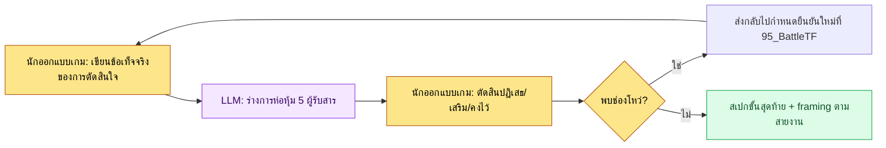

# 16.3 หนึ่งการตัดสินใจ สามรูปแบบการห่อหุ้ม — การจัด framing ผลงานตามสายงาน

ห้องประชุม 95_BattleTF บ่ายวันที่กำหนดให้รางวัลเช็กชื่อกิลด์เป็นทรัพยากร +5 ผมส่งการตัดสินใจเดียวกันนี้ออกไปสามทาง ช่องของทีมออกแบบเกมได้ markdown ระบุสเปก ทีมโปรแกรมได้คอลัมน์ข้อมูลหนึ่งบรรทัด ทีมอาร์ตได้ html หนึ่งหน้าจอ คำตอบกลับมาแทบจะพร้อมกันทั้งสามที่ หัวหน้าโปรแกรมถามว่า "จุดทริกเกอร์อยู่ตรงไหน" ผู้อำนวยการฝ่ายอาร์ตถามว่า "ตำแหน่งปุ่มเช็กชื่อตรงกับไกด์ 06_UI หรือเปล่า" ส่วนแอนิเมเตอร์ไม่พูดอะไรเลย เป็นการตัดสินใจเดียวกันแท้ ๆ แต่สิ่งที่ทั้งสามคนมองเห็นนั้นต่างกันโดยสิ้นเชิง

บทนี้คือบันทึกที่เปลี่ยน "การมองต่างกัน" นั้นจากอุบัติเหตุให้กลายเป็นการออกแบบ การห่อหุ้มหนึ่งการตัดสินใจให้ต่างกันตามแต่ละสายงาน — นั่นคือ framing

---

## 16.3.1 การตัดสินใจเดียวกันถูกห้าคนอ่านต่างกัน

การตัดสินใจเรื่องรางวัลเช็กชื่อกิลด์เพียงเรื่องเดียวมีผู้รับสาร (audience) เกาะติดอยู่ถึงห้ากลุ่ม แต่ละกลุ่มแม้อ่านประโยคเดียวกันก็เลือกอ่านเฉพาะส่วนของตัวเองและปล่อยส่วนที่เหลือผ่านไป อุบัติเหตุเกิดขึ้นตรงจุดที่ถูกปล่อยผ่าน

| ผู้รับสาร | สิ่งที่ตั้งใจอ่าน | สิ่งที่ข้ามไปโดยสัญชาตญาณ |
|---|---|---|
| หัวหน้าโค้ด | คอลัมน์ข้อมูล·อินเทอร์เฟซ·จุดทริกเกอร์ | โทนสี·เนื้อเรื่อง·การกำกับ |
| ผู้อำนวยการฝ่ายอาร์ต | การวางหน้าจอ·คอมโพเนนต์·ไกด์สไตล์ | ความสมบูรณ์ของข้อมูล·ทริกเกอร์ |
| ผู้อำนวยการฝ่ายเสียง | ทริกเกอร์ของพฤติกรรม·บรรยากาศ·ความยาว | รายละเอียดข้อมูล |
| แอนิเมเตอร์ | การเคลื่อนไหว·จังหวะ·การเปลี่ยนสถานะ | โทนภาพ·ค่าตัวเลข |
| QA | เกณฑ์การยอมรับ·ความเสี่ยง·สถานการณ์ขอบ (edge) | รายละเอียดภายในของวิธีการพัฒนา |

ปัญหาไม่ได้อยู่ที่ปริมาณของข้อมูล แต่อยู่ที่วิธีการนำเสนอ หากวางสเปกหนาเล่มเดียวกันลงบนโต๊ะของทั้งห้าคนเหมือน ๆ กัน ทั้งห้าคนจะเปิดอ่านคนละหน้าและปิดทิ้งคนละหน้า framing ไม่ปล่อยให้การเปิดอ่านนี้ขึ้นอยู่กับความบังเอิญ แต่จัดวางมันอย่างจงใจ

ด้านล่างคือเมทริกซ์ framing ที่แสดงว่าการตัดสินใจเดียวเปลี่ยนรูปไปอย่างไรเมื่อข้ามเส้นแบ่งของแต่ละสายงาน

<svg viewBox="0 0 720 360" xmlns="http://www.w3.org/2000/svg" role="img" aria-label="เมทริกซ์ framing ที่หนึ่งการตัดสินใจแยกออกเป็นผลงานตามแต่ละสายงาน">
  <rect x="0" y="0" width="720" height="360" fill="#fbfbfd"/>
  <!-- source decision -->
  <rect x="270" y="20" width="180" height="52" rx="8" fill="#1f2d3d"/>
  <text x="360" y="42" text-anchor="middle" fill="#ffffff" font-family="sans-serif" font-size="14" font-weight="bold">การตัดสินใจ: รางวัลเช็กชื่อ = ทรัพยากร +5</text>
  <text x="360" y="60" text-anchor="middle" fill="#aeb9c6" font-family="sans-serif" font-size="11">95_BattleTF / ข้อเท็จจริงเดียว</text>
  <!-- arrows -->
  <line x1="360" y1="72" x2="120" y2="140" stroke="#9aa7b4" stroke-width="1.5"/>
  <line x1="360" y1="72" x2="360" y2="140" stroke="#9aa7b4" stroke-width="1.5"/>
  <line x1="360" y1="72" x2="600" y2="140" stroke="#9aa7b4" stroke-width="1.5"/>
  <!-- three framings -->
  <rect x="30" y="140" width="180" height="86" rx="8" fill="#e8f0fe" stroke="#4a73b8" stroke-width="1.5"/>
  <text x="120" y="162" text-anchor="middle" fill="#1f2d3d" font-family="sans-serif" font-size="13" font-weight="bold">ออกแบบ → markdown</text>
  <text x="120" y="182" text-anchor="middle" fill="#33414f" font-family="sans-serif" font-size="11">เจตนา·กฎ·เหตุผลฉบับเต็ม</text>
  <text x="120" y="200" text-anchor="middle" fill="#33414f" font-family="sans-serif" font-size="11">รวมบริบทสำหรับเรียนรู้</text>
  <text x="120" y="218" text-anchor="middle" fill="#7a8794" font-family="sans-serif" font-size="10">spec_guild_attendance.md</text>

  <rect x="270" y="140" width="180" height="86" rx="8" fill="#fdeee8" stroke="#b8674a" stroke-width="1.5"/>
  <text x="360" y="162" text-anchor="middle" fill="#1f2d3d" font-family="sans-serif" font-size="13" font-weight="bold">อาร์ต → html</text>
  <text x="360" y="182" text-anchor="middle" fill="#33414f" font-family="sans-serif" font-size="11">หน้าจอ 1 หน้า·การวาง·คอมโพเนนต์</text>
  <text x="360" y="200" text-anchor="middle" fill="#33414f" font-family="sans-serif" font-size="11">เรียนรู้ md 0 (ส่งต่ออย่างเดียว)</text>
  <text x="360" y="218" text-anchor="middle" fill="#7a8794" font-family="sans-serif" font-size="10">guild_screen_v3.html</text>

  <rect x="510" y="140" width="180" height="86" rx="8" fill="#e8f6ec" stroke="#4a9a5e" stroke-width="1.5"/>
  <text x="600" y="162" text-anchor="middle" fill="#1f2d3d" font-family="sans-serif" font-size="13" font-weight="bold">โปรแกรม → ข้อมูล</text>
  <text x="600" y="182" text-anchor="middle" fill="#33414f" font-family="sans-serif" font-size="11">คอลัมน์·อินเทอร์เฟซ·ทริกเกอร์</text>
  <text x="600" y="200" text-anchor="middle" fill="#33414f" font-family="sans-serif" font-size="11">ระบุรายการตรวจ lint</text>
  <text x="600" y="218" text-anchor="middle" fill="#7a8794" font-family="sans-serif" font-size="10">guild_table 1 row</text>
  <!-- invariant band -->
  <rect x="30" y="262" width="660" height="72" rx="8" fill="#ffffff" stroke="#c7ced6" stroke-width="1.2"/>
  <text x="360" y="286" text-anchor="middle" fill="#1f2d3d" font-family="sans-serif" font-size="12" font-weight="bold">ข้อเท็จจริงที่ไม่เปลี่ยน (สิ่งที่ทั้งสามรูปแบบต้องรักษาไว้)</text>
  <text x="360" y="308" text-anchor="middle" fill="#33414f" font-family="sans-serif" font-size="11">ค่า = +5 · จุดเวลา = ล็อกอินครั้งแรกของวัน · ขอบเขต = สมาชิกกิลด์ทั้งหมด</text>
  <text x="360" y="326" text-anchor="middle" fill="#7a8794" font-family="sans-serif" font-size="10">ต่อให้ห่อหุ้มต่างกัน ถ้าสามค่านี้คลาดเคลื่อนคือ framing ล้มเหลว</text>
</svg>

การห่อหุ้มต่างกันได้ตามผู้รับสารแต่ละกลุ่ม แต่ข้อเท็จจริงที่ไม่เปลี่ยน (ค่า·จุดเวลา·ขอบเขต) ซึ่งวางอยู่ตรงกลางนั้นต้องไม่สั่นคลอนในการห่อหุ้มแบบใดเลย ศิลปะของ framing ไม่ใช่ "การแสดงให้เห็นต่างกัน" แต่คือ "การแสดงให้เห็นต่างกันโดยที่ยังรักษาสิ่งเดียวกันไว้"

---

## 16.3.2 บันทึกเซสชันจริง (worked transcript) — หนึ่งการตัดสินใจสู่สามรูปแบบการห่อหุ้ม

หากต้องปั้น framing ด้วยมือใหม่ทุกครั้งจะเป็นภาระมากจนสุดท้ายก็เลิกทำ ผมจึงใช้วิธีโยนการตัดสินใจหนึ่งเรื่องเข้าไปแล้วรับร่างการห่อหุ้มตามสายงานกลับมาในคราวเดียว ด้านล่างคือบันทึกการโต้ตอบจริงที่เกิดขึ้นเกี่ยวกับการตัดสินใจเรื่องรางวัลเช็กชื่อกิลด์ ผมคัดลอกมาตามเดิมโดยไม่ขัดเกลา

### พรอมต์ฉบับเต็ม

```
[ข้อเท็จจริงของการตัดสินใจ — กำหนดที่ 95_BattleTF]
- รางวัลเช็กชื่อกิลด์ = ทรัพยากรกิลด์ +5
- ทริกเกอร์: เมื่อสมาชิกกิลด์ล็อกอินครั้งแรกของวันนั้น 1 ครั้ง
- ขอบเขต: สมาชิกกิลด์ทุกคนของกิลด์นั้น ๆ แต่ละคน
- UI: แสดงปริมาณทรัพยากรรวมที่ส่วนบนของหน้าจอกิลด์ + ปุ่ม "เช็กชื่อ"

ช่วยห่อหุ้มการตัดสินใจเดียวนี้สำหรับสามสายงาน
สายออกแบบทำเป็น markdown ระบุเจตนา·กฎ·ผลกระทบต่อข้อมูล สายอาร์ตทำสเปกหน้าจอที่จะใส่ใน html
โดยเน้นการวาง·คอมโพเนนต์·การอ้างอิงไกด์สไตล์ (ห้ามกล่าวถึงข้อมูล·ทริกเกอร์)
สายโปรแกรมทำเป็นข้อมูลหนึ่งบรรทัด·อินเทอร์เฟซ·ทริกเกอร์·รายการตรวจสอบ
ทั้งสามรูปแบบให้ฝังค่าที่ไม่เปลี่ยน (+5, ล็อกอินครั้งแรก 1 ครั้ง, สมาชิกกิลด์ทั้งหมด) เหมือนกัน
ส่วนค่าที่ไม่รู้ห้ามกุขึ้นมา ให้ทำเครื่องหมาย [ต้องยืนยัน]
```

### ผลลัพธ์ดิบจาก Claude (ไม่มีการสรุปหรือเรียบเรียง)

```
1) ออกแบบ → markdown

## รางวัลเช็กชื่อกิลด์
- เจตนา: แปลงการเข้าเล่นวันละ 1 ครั้งให้เป็นทรัพยากรความร่วมมือระดับกิลด์ เพื่อยกอัตราการคงอยู่ให้สูงขึ้น
- กฎ: เมื่อสมาชิกกิลด์ล็อกอินครั้งแรกของวัน ทรัพยากรกิลด์ +5 วันละ 1 ครั้ง สะสมระดับกิลด์
- ผลกระทบต่อข้อมูล: guild_resource_total เพิ่มขึ้น ต้องมอนิเตอร์เงินเฟ้อของทรัพยากร [ต้องยืนยัน: ยังไม่ได้กำหนดเพดาน]

2) อาร์ต → สเปกหน้าจอ (เนื้อหาที่จะใส่ใน html)
- แสดงปริมาณทรัพยากรรวมที่ส่วนบนของหน้าจอกิลด์ (progress_bar + badge ตัวเลข)
- ปุ่ม "เช็กชื่อ" ทางขวา การเปลี่ยนสถานะเมื่อกดให้เป็นไปตามกฎสถานะปุ่มในไกด์ 06_UI
- สไตล์: สอดคล้องกับไกด์ 06_UI สีเป็น [ต้องยืนยัน: ยังไม่ได้กำหนดโทเค็นสีธีมของกิลด์]
- (ค่าตัวเลขข้อมูล·ทริกเกอร์ถูกตัดออกจากรูปแบบนี้โดยตั้งใจ)

3) โปรแกรม → ข้อมูล/อินเทอร์เฟซ
- ข้อมูล: เพิ่มคอลัมน์ใน guild_table — guild_resource_total (int, default 0)
- อินเทอร์เฟซ: GuildResourceManager.add(guild_id, amount)
- ทริกเกอร์: เรียก add(guild_id, 5) 1 ครั้งจากฮุกอีเวนต์ล็อกอินครั้งแรกของวัน
- ตรวจสอบ: integrity_check_guild_resource (ห้ามค่าติดลบ / บล็อกการเรียกเกินวันละ 1 ครั้ง)
- ภาวะพร้อมกัน: เมื่อสมาชิกกิลด์คนเดียวกันล็อกอินพร้อมกันหลายอุปกรณ์อาจบวกซ้ำ [ต้องยืนยัน]
```

### การตรวจสอบ·ปฏิเสธโดยมนุษย์

ผมไม่ได้ใช้ผลลัพธ์ดิบตามเดิม ผมจับได้สามจุด

- **ปฏิเสธ**: ประโยค "การเปลี่ยนสถานะเมื่อกดปุ่มให้เป็นไปตามไกด์ 06_UI" ในรูปแบบของอาร์ต หลักการของ 95_BattleTF คือไม่สอน md ให้ทีมอาร์ตแต่ส่ง html อย่างเดียว ฉะนั้นข้อความอ้างอิงไกด์จึงไปกระตุ้นให้ต้องกระโดดไปยังเอกสารภายนอก ผมจึงตัดสินใจใส่ตัวอย่างสถานะแบบอินไลน์เพื่อให้จบในหน้าจอเดียว
- **ขอเสริม**: `[ต้องยืนยัน]` สองรายการ (เพดานทรัพยากร, การบวกซ้ำหลายอุปกรณ์) ในรูปแบบของโปรแกรมคือช่องโหว่ที่ไม่มีในข้อเท็จจริงของการตัดสินใจ การที่ AI ไม่กุขึ้นมาแต่ทำเครื่องหมายไว้นั้นเป็นวิจารณญาณที่ถูกต้อง แต่นี่คือรูโหว่ของตัวการตัดสินใจเองซึ่งอยู่ก่อนหน้า framing จึงต้องส่งกลับไปที่ 95_BattleTF
- **คงไว้**: ค่าที่ไม่เปลี่ยนทั้งสาม (+5, ล็อกอินครั้งแรก 1 ครั้ง, สมาชิกกิลด์ทั้งหมด) ถูกป้อนไว้อย่างสอดคล้องกันในทั้งสามรูปแบบแล้ว เฉพาะส่วนนี้ผมไม่แตะต้องเลย

### การร้องขอใหม่

```
ช่วยแก้รูปแบบของอาร์ต:
- เอาข้อความอ้างอิงเอกสารภายนอกอย่าง "เป็นไปตามไกด์ 06_UI" ออกทั้งหมด
- บรรยายความต่างทางสายตาของ 3 สถานะ คือ กดปุ่ม/รอ/เสร็จ ลงในสเปกหน้าจอโดยตรง
- ภายใต้สมมติฐานว่าทีมอาร์ตทำงานโดยดูแค่หน้านี้หน้าเดียว ให้จบในตัวเองโดยไม่ต้องกระโดดไปเอกสารอื่น

ส่วน [ต้องยืนยัน] 2 รายการในรูปแบบของโปรแกรม ให้ดึงออกจากผลงาน
แล้วแยกไว้เป็นบล็อก "รายการที่ต้องกำหนดยืนยันใหม่ที่ 95_BattleTF" ไว้บนสุดแทน
```

ด้วยการปฏิเสธ·ร้องขอใหม่เพียงครั้งเดียวนี้ ผลงานก็กลายเป็นรูปแบบที่ทั้งสามสายงานหยิบไปใช้ที่โต๊ะของตัวเองได้ทันที AI ปั้นร่างการห่อหุ้มสามชุดและทำเครื่องหมายช่องโหว่ให้ด้วย แต่ว่าจะตัดอะไรออกจากการห่อหุ้มแบบไหน — การเอาการอ้างอิงภายนอกออกจากรูปแบบของอาร์ต และการยกรายการที่ยังไม่กำหนดออกจากรูปแบบของโปรแกรม — กรรไกรนั้นยังคงเหลืออยู่ในมือของผมจนถึงที่สุด วิจารณญาณหลักของ framing อยู่ที่ฝั่งการตัดออก ไม่ใช่ฝั่งการใส่เข้า

---

## 16.3.3 สามวิธีการ framing และจุดที่คืนทุน

วิธีการแยกออกไปตามว่าจะวางการห่อหุ้มไว้ที่ไหน จะเลือกใช้แบบใดในสามแบบนั้นตัดสินด้วยขนาดของสเปกและกำลังในการดำเนินงาน

**(1) สรุปตามผู้รับสารภายในเอกสารเดียว** ต่อท้ายเนื้อหาหลักด้วยส่วนสรุปตามสายงาน ทั้งห้าคนใช้ไฟล์เดียวกันแต่ต่างคนต่างอ่านเฉพาะหัวข้อของตัวเอง

```markdown
## สรุปตามผู้รับสาร

### โค้ด (การพัฒนา)
- ข้อมูล: guild_table.guild_resource_total (int)
- อินเทอร์เฟซ: GuildResourceManager.add(guild_id, amount)
- ทริกเกอร์: ล็อกอินครั้งแรกของวัน 1 ครั้ง
- ตรวจสอบ: integrity_check_guild_resource

### อาร์ต (สายตา)
- หน้าจอ: ปริมาณทรัพยากรรวมส่วนบนของกิลด์ + ปุ่มเช็กชื่อ
- คอมโพเนนต์: progress_bar, badge, button (3 สถานะ)
- ลำดับความสำคัญ: มาสเตอร์ดาตามายล์สโตนรอบนี้

### QA (การตรวจสอบ)
- เกณฑ์การยอมรับ: หลังเช็กชื่อ ทรัพยากรกิลด์สะท้อน +5, บล็อกการเกินวันละ 1 ครั้ง
- ความเสี่ยง: เงินเฟ้อของทรัพยากร, การบวกซ้ำหลายอุปกรณ์
```

**(2) ผลงานแยกตามผู้รับสาร** จากเนื้อหาหลัก 1 ชุด แยกไฟล์ตามสายงานออกจากกัน การที่ 95_BattleTF ส่งเฉพาะ html ให้ทีมอาร์ตและไม่ส่ง md คือรูปแบบจริงของวิธีนี้ — แม้เป็นการตัดสินใจเดียวกัน แต่ตัวสื่อกลางก็ต่างกันตามแต่ละสายงาน

```
spec_guild_attendance.md     — เนื้อหาหลักฝ่ายออกแบบ (บริบททั้งหมด)
guild_screen_v3.html         — อาร์ต (html เท่านั้น, เรียนรู้ md 0)
guild_table 1 row + add()    — โปรแกรม (ข้อมูล/อินเทอร์เฟซ)
qa_guild_attendance.md       — QA (เกณฑ์การยอมรับ·ความเสี่ยง)
```

เหมาะกับสเปกที่มีปริมาณมาก และตัวสื่อกลางเข้าสู่เครื่องมือของแต่ละสายงานได้ทันที แต่ในทางกลับกัน เมื่อการตัดสินใจหนึ่งเปลี่ยน ต้องแก้ผลงานหลายชิ้นไปพร้อมกันจึงมีภาระในการดำเนินงานสูง

**(3) กราฟ Wikilink** ใส่เฉพาะจุดเริ่มต้นตามสายงานเป็นลิงก์ไว้ในเนื้อหาหลัก แต่ละคนสำรวจตามกิ่งของตัวเอง

```
[[spec_guild_attendance]]
   ├── [[code_guild_table]]
   ├── [[ui_guild_screen_v3]]
   └── [[qa_guild_attendance]]
```

ต้นทุนและจุดคืนทุนของสามวิธีเป็นดังนี้ ในบรรดาค่าด้านล่าง "ผล" เป็นการประมาณของผู้เขียน (ยังไม่ได้ตรวจสอบ) ให้เชื่อถือเฉพาะทิศทางและสัดส่วนเชิงเปรียบเทียบเท่านั้น

| วิธีการ | ต้นทุน | จุดคืนทุน |
|---|---|---|
| (1) สรุปตามผู้รับสาร | ปริมาณเนื้อหาหลัก +30% โดยประมาณ | คืนทุนทันทีในเกือบทุกสเปก |
| (2) ผลงานแยก | ดำเนินงานผลงาน N ชุด | คืนทุนเฉพาะเมื่อปริมาณมากและตัวสื่อกลางต่างกันตามสายงาน |
| (3) กราฟ Wikilink | ลงทุนล่วงหน้าด้านโครงสร้างกราฟ | คืนทุนเมื่อสเปกสะสมจนตัวกราฟเองกลายเป็นสินทรัพย์ |

สเปกส่วนใหญ่เหมาะกับ (1) มันมีต้นทุนน้อยที่สุดและคืนทุนเร็วที่สุด (2) ใช้เฉพาะจุดที่ตัวสื่อกลางแยกออกจากกันอยู่แล้ว เช่น html ของอาร์ต ส่วน (3) เปิดใช้เมื่อสเปกสะสมมากพอจนกราฟลิงก์ให้คุณค่าในการสำรวจ

---

## 16.3.4 ตรึงผู้รับสารไว้ที่ห้ากลุ่ม

หากนิยามผู้รับสารใหม่ทุกสเปก framing ก็ต้องปั้นใหม่ทุกครั้ง ผมจึงตรึงรหัสไว้

| รหัสผู้รับสาร | ขอบเขต |
|---|---|
| code | โค้ด·ระบบ·ข้อมูล |
| art | อาร์ต·สายตา·UI |
| sound | เสียง·ออดิโอ |
| anim | แอนิเมชัน·โมชัน |
| qa | QA·การตรวจสอบ |

ห้ากลุ่มนี้คือมาตรฐานการดำเนินงานภายใน ผู้รับสารภายนอกอย่างฝ่ายเอาต์ซอร์ส·ฝ่ายกฎหมายจะจัดการแยกต่างหากนอกมาตรฐานนี้ การตรึงไว้ที่ห้ากลุ่มทำให้เมื่อมอบ framing ให้ LLM ไม่ต้องเขียนนิยามผู้รับสารใหม่ทุกครั้ง และจับผู้รับสารที่ตกหล่นได้ด้วยเช็กลิสต์

---

## 16.3.5 การทำงานอัตโนมัติและกับดักของมัน

หากเขียนสรุปห้าสายงานด้วยมือทุกสเปก สุดท้ายก็จะเลิกเขียน ผมจึงผูกขั้นตอนไว้ดังนี้



นักออกแบบเกมเขียนเฉพาะข้อเท็จจริงของการตัดสินใจ แล้ว LLM สร้างร่างการห่อหุ้มห้ารูปแบบ นักออกแบบเกมตัดสินปฏิเสธ·เสริม·คงไว้ เมื่อมีช่องโหว่ (`[ต้องยืนยัน]`) ออกมา จะไม่จัดการที่ framing แต่ส่งกลับไปยังขั้นตอนการตัดสินใจ — เพราะ framing ไม่ใช่เครื่องมืออุดรูโหว่ของการตัดสินใจ แต่เป็นเครื่องมือถ่ายทอดการตัดสินใจที่กำหนดไว้แล้ว

ในวงจรนี้มีกับดักที่เหยียบซ้ำ ๆ อยู่สี่ข้อ ผมวางไว้พร้อมแนวทางแก้

| กับดัก | อาการ | แนวทางแก้ |
|---|---|---|
| ข้อมูลซ้ำซ้อน | เนื้อหาเดียวกันซ้ำในเนื้อหาหลัก·สรุป จนเป็นภาระการดำเนินงาน | เนื้อหาหลัก 1 ครั้ง สรุปเฉพาะรายการที่ต่าง |
| ข้อมูลตกหล่น | ค่าที่สำคัญต่อสายงานหนึ่งหายไปทั้งก้อน | ตรวจการตกหล่นด้วยเช็กลิสต์ผู้รับสาร 5 กลุ่มที่ตรึงไว้ |
| มองข้ามเนื้อหาหลัก | ดูแค่สรุปแล้วปล่อยบริบทในเนื้อหาหลักผ่านไป | ระบุท้ายสรุปว่า "เหตุผลอยู่ในเนื้อหาหลัก" |
| สื่อกลางสับสน | ส่ง md ให้อาร์ตจนกลายเป็นภาระการเรียนรู้ | ตรึงหลักการสื่อกลางตามสายงาน (อาร์ต=html) |

การทำงานอัตโนมัติลดภาระการเขียนลงเหลือราว 5 นาทีต่อสเปก แต่วิจารณญาณในการปฏิเสธ·เสริม·คงไว้นั้นไม่ได้ถูกทำให้อัตโนมัติตามไปด้วย วิจารณญาณนั้นคือที่ทางของมนุษย์

---

## 16.3.6 การวัดผล — เมื่อเปิดใช้ framing

ต่อไปนี้คือค่าที่เปรียบเทียบก่อน·หลังการนำ framing มาใช้ในโปรเจกต์ A ที่ผู้เขียนดำเนินงานอยู่ ค่าสัมบูรณ์เป็นการประมาณของผู้เขียน (ยังไม่ได้ตรวจสอบ) สิ่งที่ควรเชื่อถือคือทิศทางของการเปลี่ยนแปลงและสัดส่วนเชิงเปรียบเทียบ

| รายการ | ไม่มี framing | ใช้ framing | ทิศทาง |
|---|---|---|---|
| อุบัติเหตุการตีความตามสายงาน | 15\~20 ครั้งต่อไตรมาส | 3\~5 ครั้งต่อไตรมาส | ลดลงมาก |
| เวลาที่ผู้รับสารใช้อ่านสเปก | 15\~30 นาที | 5\~10 นาที (เฉพาะหัวข้อตัวเอง) | ลดลง |
| การตัดสินใจ → เริ่มงาน | 1\~2 วัน | 4\~8 ชั่วโมง | สั้นลง |
| ความขัดแย้งในการตีความระหว่างสายงาน | 8\~12 ครั้งต่อไตรมาส | 2\~3 ครั้งต่อไตรมาส | ลดลง |
| เวลาในการเขียนสเปก | 1\~2 ชั่วโมง | 1.5\~2.5 ชั่วโมง (LLM ช่วย) | เพิ่มขึ้นเล็กน้อย |

ตัวการเขียนสเปกเองยาวขึ้นเล็กน้อย เพราะต้องเพิ่มการห่อหุ้มตามสายงานเข้าไป แต่หลังจากนั้นวงจรงานของแต่ละสายงานสั้นลง เวลาทั้งหมดตั้งแต่การตัดสินใจจนถึงเริ่มงานจึงลดลง การแลกเปลี่ยน (trade-off) นี้คือเหตุผลหลักของการนำ framing มาใช้ หากเป็นทีมที่รู้สึกว่าการตรวจสอบโดย LLM ช่วยเป็นภาระ การทำให้สรุป 5 ผู้รับสารแบบเขียนมือในวิธี (1) ตั้งหลักก่อนแล้วค่อยเพิ่มการทำงานอัตโนมัติเข้าไปคือลำดับที่ปลอดภัย

---

> **การประยุกต์นอกเกม** framing ที่ห่อหุ้มหนึ่งการตัดสินใจให้ต่างกันตามผู้รับสารแต่ละกลุ่มแต่ยังรักษาข้อเท็จจริงที่ไม่เปลี่ยน (ค่า·จุดเวลา·ขอบเขต) ไว้ทุกที่นั้น ไม่ใช่เรื่องของเกมเท่านั้น แต่ใช้ได้ตรง ๆ กับการประกาศ·การสื่อสารการรีลีสของทุกองค์กร ตัวอย่างเช่น หากตัดสินใจเรื่อง "ปรับค่าสมาชิกรายเดือนเป็น 9,900 วอนตั้งแต่วันที่ 1 กรกฎาคม" หนึ่งเรื่อง ทีมพัฒนาจะได้รูปแบบที่เป็นข้อมูลอย่างคอลัมน์ตารางการชำระเงิน·จุดเวลาที่มีผล ทีมดีไซน์จะได้แบนเนอร์แจ้งข่าวหนึ่งหน้าจอ ส่วนทีมดูแลลูกค้าจะได้สคริปต์ตอบคำถามที่คาดว่าจะมี การห่อหุ้มต่างกันทั้งสาม แต่ถ้าสามตัวเลข "9,900 วอน·วันที่ 1 กรกฎาคม·สมาชิกใหม่และเดิมทั้งหมด" คลาดเคลื่อนในการห่อหุ้มแบบใด ข้อพิพาทกับลูกค้าก็จะปะทุขึ้นในวินาทีนั้นทันที

---

## 16.3.7 ลองทำดู

**setup**

- ป้อนผู้รับสาร 5 สายงาน (code·art·sound·anim·qa) เป็นนิยามตายตัวลงในวิกิของทีม
- กำหนดหลักการสื่อกลางตามสายงาน (เช่น อาร์ต=html, โปรแกรม=ข้อมูล row, ออกแบบ=md)
- เตรียมสเปกหนึ่งเรื่องในรูปข้อเท็จจริงของการตัดสินใจ (ค่าที่ไม่เปลี่ยน = ระบุค่า·จุดเวลา·ขอบเขต)

**prompt**

```
[ข้อเท็จจริงของการตัดสินใจ]
(เขียนค่า·จุดเวลา·ขอบเขต บรรทัดละหนึ่ง)

ช่วยห่อหุ้มการตัดสินใจนี้สำหรับสายงานที่เกี่ยวข้องในบรรดา code·art·sound·anim·qa
ในแต่ละการห่อหุ้มให้ตัดข้อมูลที่สายงานนั้นไม่สนใจออก แต่ฝังค่าที่ไม่เปลี่ยน (ค่า·จุดเวลา·ขอบเขต) เหมือนกันในทุกรูปแบบ
รูปแบบของอาร์ตให้จบในตัวเองด้วยหน้าเดียวนั้นโดยไม่ต้องอ้างอิงเอกสารอื่น ค่าที่ไม่รู้ห้ามกุขึ้นมา ให้ทำเครื่องหมาย [ต้องยืนยัน]
```

**verify**

- ตรวจทานทีละบรรทัดว่าค่าที่ไม่เปลี่ยน (ค่า·จุดเวลา·ขอบเขต) เหมือนกันในทั้งสามรูปแบบหรือไม่
- หากมี `[ต้องยืนยัน]` ให้ส่งกลับไปยังขั้นตอนการตัดสินใจ (TF แบบ 95_BattleTF) ไม่ใช่ framing
- หากในรูปแบบของอาร์ตยังมีข้อความอ้างอิงเอกสารภายนอกเหลืออยู่ ให้เอาออก

**ฉบับย่อสำหรับคนเดียว**

หากทำงานคนเดียว ให้ลดผู้รับสารเหลือสองกลุ่ม — "ตัวเราในอนาคต" (การพัฒนา) และ "ผู้ตรวจสอบ" (QA) เขียนข้อเท็จจริงของการตัดสินใจหนึ่งบรรทัด แล้วขอ LLM ว่า "ช่วยแบ่งอันนี้เป็นสองชุด คือ บันทึกการพัฒนาและเช็กลิสต์การตรวจสอบ" จากนั้นแค่ตรวจทานว่าค่าตัวเลขหลักในสองชุดตรงกันหรือไม่ก็พอ แม้ผู้รับสารจะมีเพียงสองกลุ่ม โครงสร้างของ framing ที่ว่า "ห่อหุ้มการตัดสินใจเดียวกันให้ต่างกันแต่รักษาค่าที่ไม่เปลี่ยนไว้" ก็ยังทำงานเหมือนเดิม

---

### สรุปประเด็นสำคัญของบท
- การห่อหุ้มการตัดสินใจเดียวกันให้ต่างกันตามสายงานแต่รักษาค่าที่ไม่เปลี่ยนไว้ คือแก่นแท้ของ framing
- วิจารณญาณหลักของ framing ไม่ใช่ว่าจะใส่อะไรเข้าไป แต่คือจะเอาอะไรออกจากการห่อหุ้มแบบไหน
- LLM ทำได้ถึงร่างการห่อหุ้มและการทำเครื่องหมายช่องโหว่ ส่วนวิจารณญาณในการปฏิเสธ·เสริม·คงไว้เป็นหน้าที่ของมนุษย์
