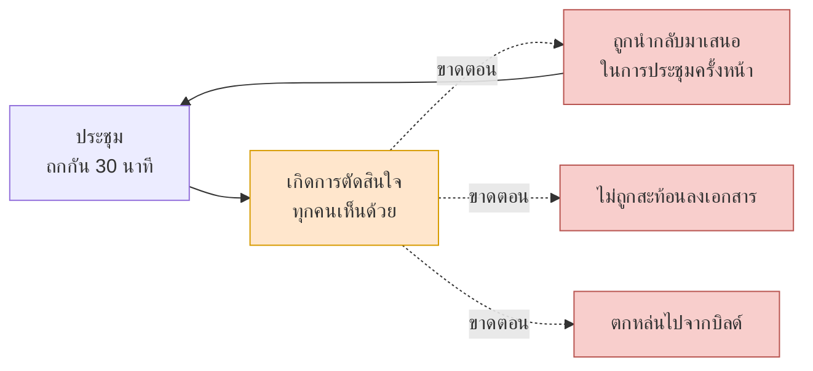
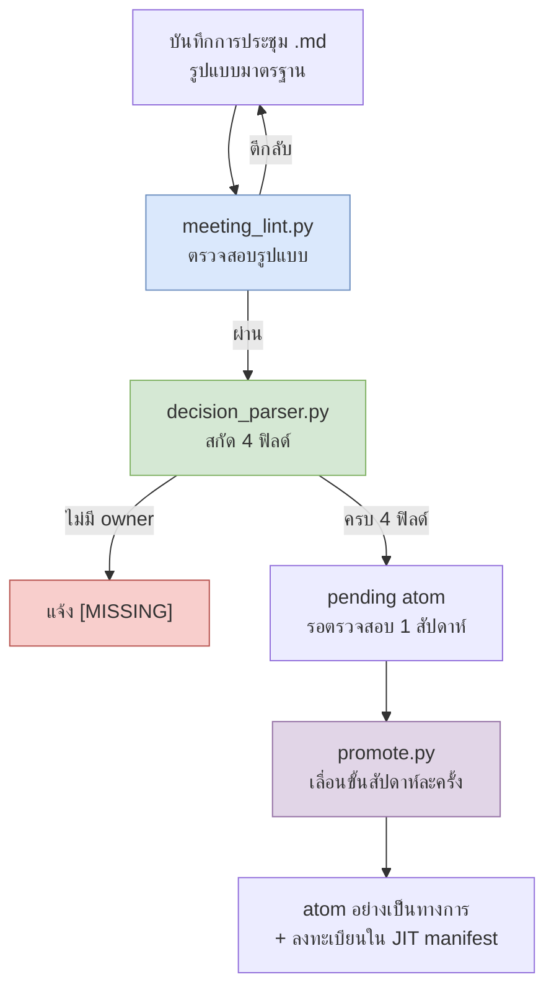

# 17.1 ทำไมบันทึกการประชุมจึงเป็นจุดที่เจ็บปวดที่สุด

ผ่านไป 5 นาทีหลังจบการประชุม บนไวต์บอร์ดในห้องประชุมยังมีตัวอักษรหลงเหลืออยู่ "การตรวจจับการโดนโจมตีในการต่อสู้ ให้ฝั่งไคลเอนต์สะท้อนผลก่อน แต่ลำดับความสำคัญของการตรวจสอบฝั่งเซิร์ฟเวอร์ไว้สปรินต์ถัดไป" นี่คือข้อสรุปที่คนห้าคนใช้เวลา 30 นาทีกว่าจะมาถึง ทุกคนพยักหน้าเห็นด้วย และมีบางคนถ่ายรูปเก็บไว้

3 สัปดาห์ต่อมา คนห้าคนเดิมกลับมารวมตัวกันในห้องประชุมเดิมอีกครั้ง บรรทัดแรกของรายการวาระเขียนไว้ว่า "การตรวจจับการโดนโจมตีในการต่อสู้ — ไคลเอนต์สะท้อนก่อน vs ตรวจสอบฝั่งเซิร์ฟเวอร์ ต้องตัดสินใจ" ไม่มีใครจำข้อสรุปเมื่อ 3 สัปดาห์ก่อนได้เลย รูปถ่ายไวต์บอร์ดอยู่ที่ไหนสักแห่งในคลังภาพของใครคนหนึ่ง และคนคนนั้นวันนี้ลาพักร้อน ต้องใช้เวลาอีก 30 นาที คราวนี้ข้อสรุปออกมาตรงข้ามกับเดิม

นี่คือเหตุผลทั้งหมดว่าทำไมบันทึกการประชุมจึงเป็นจุดที่เจ็บปวดที่สุด ในการประชุมมีการตัดสินใจเกิดขึ้น แต่การตัดสินใจนั้นกลับ**ไหลต่อ (propagate) ไปไม่ถึง**การประชุมถัดไป เอกสารถัดไป หรือบิลด์ถัดไป การตัดสินใจเกิดขึ้นแล้วแต่ไม่ถูกส่งต่อ บทนี้คือเรื่องราวของการเชื่อมห่วงโซ่ที่ขาดนั้นกลับเข้าด้วยกันด้วยข้อมูล

---

## 17.1.1 ประชุม → ตัดสินใจ → ลงมือทำ ขาดตรงไหน

ระบบ RnD ส่วนตัวที่ผู้เขียนดูแลอยู่แตกออกเป็นเอกสาร 17 ฉบับ ทั้งมาตรฐานการตั้งชื่อ atom, การทำแผนผังความสัมพันธ์อัตโนมัติ, คู่มือการแมป Layer, โครงสร้างการฉีด JIT และอื่น ๆ ในจำนวนนั้น เอกสารฉบับเดียวที่ดูดเวลาไปมากที่สุดคือแผนการปรับปรุงบันทึกการประชุม น้ำหนักของมันใหญ่ถึงขั้นเทียบได้กับอีก 16 ฉบับที่เหลือรวมกัน

ตอนแรกผมก็ฉงน บันทึกการประชุมน่ะหรือ ก็แค่จดตามที่ได้ยินก็จบไม่ใช่หรือ แต่พอลองวัดดูจริง ๆ กลับพบว่าตำแหน่งที่เจ็บปวดไม่ได้อยู่ที่*การเขียน*บันทึกการประชุม แต่อยู่ที่*หลัง*บันทึกการประชุมต่างหาก ในการประชุมมีการตัดสินใจเกิดขึ้นอย่างชัดเจน ปัญหาคือการตัดสินใจนั้นเป็นความรับผิดชอบของใคร อาศัยเหตุผลอะไร กำหนดเส้นตายเมื่อไหร่ และนำไปสู่อะไรต่อ ทั้งหมดนี้ระเหยหายไปทันทีที่ก้าวออกจากประตูห้องประชุม

ถ้าวาดความขาดตอนนี้ออกมาเป็นภาพหนึ่งภาพ ก็จะได้แบบนี้



เส้นประคือการส่งต่อที่ขาดตอน การตัดสินใจ (สีส้ม) เกิดขึ้นแล้ว แต่ไม่ไหลไปทางไหนเลยใน 3 แขนง (สีแดง) การตัดสินใจที่ไหลต่อไปไม่ได้จะวกกลับมาเป็นการประชุมในอีก 3 สัปดาห์ ลูปที่ลูกศรโค้งขึ้นไปวนกลับมาเป็นการประชุมอีกครั้งนั่นแหละคือตัวต้นเหตุของความเจ็บปวด

เมื่อการส่งต่อขาดตอน สี่สิ่งจะเกิดขึ้นพร้อมกัน

ประวัติของการตัดสินใจหายไป คำถาม "ทำไมถึงตัดสินใจแบบนั้น" จะได้คำตอบว่า "จำไม่ได้แล้ว นัดประชุมใหม่กันเถอะ" การประชุมซ้ำ ๆ เพิ่มขึ้น วาระเดิมถูกนำกลับมาเสนอใหม่ทุกไตรมาส คนที่เพิ่งเข้ามาใหม่จับบริบทไม่ได้ เพราะการสะสมของการตัดสินใจมองไม่เห็น จึงต้องอธิบายแบบตัวต่อตัวทุกครั้ง และการช่วยเหลือของ AI ก็ไร้ผล เพราะไม่มีบริบท คำตอบจึงหยุดอยู่แค่ทฤษฎีทั่วไป ถ้าบันทึกการประชุมกระจัดกระจาย ก็ไม่สามารถป้อนข้อมูล "ทีมของเราเคยตัดสินวาระนี้ไว้อย่างไร" ให้ AI ได้ และ AI ก็จะคืนค่าเฉลี่ยจากอินเทอร์เน็ตกลับมา

ทั้งสี่อย่างนี้มาจากรากเดียวกัน **เพราะการตัดสินใจถูกจัดการในฐานะบันทึกย่อ ไม่ใช่ในฐานะข้อมูล** บันทึกย่อระเหย แต่ข้อมูลไหล

---

## 17.1.2 มองบันทึกการประชุมเป็นฐานข้อมูลการตัดสินใจ ไม่ใช่ผลผลิต

ตรงนี้ต้องพลิกมุมมองสักครั้ง ถ้ามองบันทึกการประชุมเป็น "ผลผลิตของการประชุม" จดตามที่ได้ยินแล้วเก็บไว้ก็ถือว่าจบภารกิจ บันทึกการประชุมที่เก็บไว้ก็เหมือนกระดาษโน้ตบนโต๊ะ วันนั้นยังมองเห็น แต่สัปดาห์ถัดมาก็ไม่รู้ว่าไปอยู่ที่ไหนแล้ว

ถ้ามองบันทึกการประชุมเป็น "ฐานข้อมูลการตัดสินใจ" มันจะกลายเป็นงานที่ต่างออกไปอย่างสิ้นเชิง ตัวสินทรัพย์ไม่ใช่บันทึกการประชุมในตัวมันเอง แต่เป็น**การตัดสินใจ**ที่สกัดออกมาจากบันทึกการประชุม และการตัดสินใจนั้นต้องค้นหาได้ อ้างอิงได้ และส่งต่อได้ บันทึกการประชุมเป็นเพียงสายแร่ที่ใช้ขุดการตัดสินใจขึ้นมาเท่านั้น

การบังคับให้เกิดการพลิกมุมมองนี้ด้วยโค้ดคือแก่นของส่วนที่ 17 ทั้งหมด ในระบบของผู้เขียนมี atom หนึ่งตัวที่ค้ำจุนการพลิกมุมมองนี้ ชื่อว่า `decision_summary_not_clickup_mirror` ถ้าแปลออกมาก็คือหลักการที่ว่า "สรุปการตัดสินใจในบันทึกการประชุมไม่ใช่กระจกสะท้อนของ ClickUp (ตัวติดตามงาน, task tracker)"

เหตุที่ atom ตัวนี้จำเป็นนั้นแทงเข้าที่หัวใจของความเจ็บปวดพอดี มีหลายทีมที่แค่ย้ายช่องการตัดสินใจในบันทึกการประชุมไปจดลงบอร์ดงานเฉย ๆ พอทำแบบนั้น "สิ่งที่ต้องทำ" ก็ยังอยู่ แต่ "ทำไมถึงตัดสินใจแบบนั้น (เหตุผล)" หายไป ตัวติดตามงานบรรจุ*สิ่งที่จะต้องทำ* แต่ไม่บรรจุ*เหตุผลที่ตัดสินใจแบบนั้น* นี่แหละคือเหตุผลที่แท้จริงว่าทำไมการประชุมจึงวนซ้ำในอีก 3 สัปดาห์ สิ่งที่ต้องทำถูกปิดไปแล้ว แต่เพราะไม่มีเหตุผล พอมีใครถามว่า "เอ๊ะ แต่ทำไมเราถึงตกลงทำแบบนี้กันนะ" ก็ไม่มีใครตอบได้ ด้วยเหตุนี้ สรุปการตัดสินใจจึงต้องไม่กลายเป็นกระจกสะท้อนของตัวติดตามงาน แต่ต้องเป็นสินทรัพย์อิสระที่อุ้มเหตุผล (rationale) ไว้ในตัว ชื่อของ atom เองคือเส้นห้ามเส้นนี้

---

## 17.1.3 แตกการตัดสินใจออกเป็นสี่ฟิลด์

ความต่างระหว่างการตัดสินใจที่ส่งต่อได้กับการตัดสินใจที่ระเหยหายอยู่ที่โครงสร้าง การตัดสินใจที่ระเหยคือประโยคเดียวว่า "ให้ไคลเอนต์สะท้อนก่อน" ส่วนการตัดสินใจที่ส่งต่อได้ถูกแยกย่อยออกเป็นสี่ฟิลด์

<svg viewBox="0 0 720 300" xmlns="http://www.w3.org/2000/svg" font-family="sans-serif">
  <rect x="0" y="0" width="720" height="300" fill="#fbfbfb" stroke="#ddd"/>
  <text x="360" y="32" font-size="17" font-weight="bold" text-anchor="middle" fill="#333">การตัดสินใจ 1 รายการ = 4 ฟิลด์</text>
  <!-- decision -->
  <rect x="30" y="60" width="310" height="80" rx="6" fill="#dae8fc" stroke="#6c8ebf"/>
  <text x="46" y="86" font-size="14" font-weight="bold" fill="#1f3a5f">decision</text>
  <text x="46" y="108" font-size="12" fill="#333">ตัดสินใจอะไร</text>
  <text x="46" y="128" font-size="11" fill="#666">"ไคลเอนต์สะท้อนการตรวจจับการโดนโจมตีก่อน"</text>
  <!-- owner -->
  <rect x="380" y="60" width="310" height="80" rx="6" fill="#d5e8d4" stroke="#82b366"/>
  <text x="396" y="86" font-size="14" font-weight="bold" fill="#2d5016">owner</text>
  <text x="396" y="108" font-size="12" fill="#333">ใครรับผิดชอบ</text>
  <text x="396" y="128" font-size="11" fill="#666">สมาชิกทีม A (ถ้าไม่มี [MISSING])</text>
  <!-- rationale -->
  <rect x="30" y="160" width="310" height="80" rx="6" fill="#ffe6cc" stroke="#d79b00"/>
  <text x="46" y="186" font-size="14" font-weight="bold" fill="#7a4f00">rationale</text>
  <text x="46" y="208" font-size="12" fill="#333">ทำไมถึงตัดสินใจแบบนั้น</text>
  <text x="46" y="228" font-size="11" fill="#666">"เน้นความรู้สึกตอบสนองก่อน ยอมรับความเสี่ยงจากการโกง"</text>
  <!-- follow_up -->
  <rect x="380" y="160" width="310" height="80" rx="6" fill="#e1d5e7" stroke="#9673a6"/>
  <text x="396" y="186" font-size="14" font-weight="bold" fill="#4a2d5f">follow_up</text>
  <text x="396" y="208" font-size="12" fill="#333">นำไปสู่อะไรต่อ</text>
  <text x="396" y="228" font-size="11" fill="#666">"งานตรวจสอบฝั่งเซิร์ฟเวอร์ในสปรินต์ถัดไป"</text>
  <!-- caption -->
  <text x="360" y="278" font-size="12" text-anchor="middle" fill="#555">ถ้า owner ว่าง ไปป์ไลน์จะแจ้งเป็น [MISSING] — บังคับเส้นความรับผิดชอบของการส่งต่อ</text>
</svg>

ในบรรดาสี่ฟิลด์ ฟิลด์ที่สำคัญที่สุดคือ `owner` ถ้าการตัดสินใจไม่มีผู้รับผิดชอบ การตัดสินใจนั้นก็ไม่ใช่งานของใคร และการตัดสินใจที่ไม่ใช่งานของใครก็จะไม่ถูกส่งต่อไปสู่การลงมือทำ ด้วยเหตุนี้ ไปป์ไลน์การสกัดของผู้เขียนจึงไม่ปล่อยผ่านเฉย ๆ เมื่อ owner ว่าง แต่จะแจ้งอย่างชัดเจนเป็น `[MISSING]` มันดึงข้อเท็จจริงที่ว่าเส้นความรับผิดชอบว่างเปล่าขึ้นมาไว้บนพื้นผิว

`rationale` คือที่อยู่ของหลักการ `decision_summary_not_clickup_mirror` ที่กล่าวไปก่อนหน้า ถ้าไม่มีเหตุผล การประชุมก็จะวนซ้ำในอีก 3 สัปดาห์ `follow_up` คือสะพานที่ทำให้การตัดสินใจไหลต่อไปสู่การลงมือทำจริง ถ้าฟิลด์นี้ว่าง การตัดสินใจก็จะคงอยู่ในฐานะการตัดสินใจเท่านั้นและไปไม่ถึงบิลด์

---

## 17.1.4 ไปป์ไลน์การสกัด — ขุดการตัดสินใจขึ้นมาจากบันทึกการประชุม

จะให้คนกรอกสี่ฟิลด์นี้ด้วยมือทุกครั้งก็ทำได้ แต่ถ้าทำแบบนั้นแรงบังคับจะอ่อน ระบบของผู้เขียนใช้ไปป์ไลน์ที่สกัดการตัดสินใจจากบันทึกการประชุมโดยอัตโนมัติและแจ้งฟิลด์ที่ขาดหายไป สามสคริปต์เชื่อมต่อกันแบบอนุกรม



ขั้นแรก `meeting_lint.py` ตรวจสอบว่าบันทึกการประชุมเป็นไปตามรูปแบบมาตรฐานหรือไม่ มี frontmatter หรือไม่ ช่องทั้งสี่ (วาระ/การตัดสินใจ/แอ็กชัน/การประชุมครั้งหน้า) ถูกกรอกหรือยัง บันทึกการประชุมที่รูปแบบเสียจะถูกตีกลับตรงนี้และส่งคืนให้ผู้เขียนบันทึก เนื่องจากตัวพาร์สอัตโนมัติประมวลผลได้เฉพาะอินพุตที่บังคับรูปแบบไว้แล้วเท่านั้น lint นี้จึงทำหน้าที่เป็นด่านทางเข้า (entry gate) ของทั้งไปป์ไลน์

ขั้นที่สอง `decision_parser.py` คือหัวใจ มันอ่านช่องการตัดสินใจแล้วแยกย่อยออกเป็นสี่ฟิลด์ (decision/owner/rationale/follow_up) ตรงนี้ถ้าหา owner ไม่เจอ ก็จะไม่ทิ้งการตัดสินใจนั้นไป แต่จะแจ้งเป็น `[MISSING]` เพราะการปล่อยให้การตัดสินใจที่ไม่มีผู้รับผิดชอบผ่านไปเงียบ ๆ นั้นอันตรายที่สุด

ขั้นที่สามคือการตัดสินใจที่สกัดออกมาจะยังไม่กลายเป็นสินทรัพย์อย่างเป็นทางการในทันที แต่จะอยู่ในสถานะ `pending` รอเป็นเวลา 1 สัปดาห์ ช่วงเวลาตรวจสอบนี้คือด่านที่ย้อนกลับได้ ถ้าภายใน 1 สัปดาห์พบว่า "อันนี้ไม่ใช่การตัดสินใจ แต่เป็นแค่การถกกัน" หรือ "เหตุผลผิด" ก็จะทิ้งไป จากนั้น `promote.py` จะย้ายเฉพาะการตัดสินใจที่รอดมาจากการรีวิวสัปดาห์ละครั้งไปยังโฟลเดอร์ atom อย่างเป็นทางการ และลงทะเบียนใน JIT manifest การตัดสินใจที่ลงทะเบียนแล้วจะถูกฉีดเข้าสู่งานที่เกี่ยวข้องโดยอัตโนมัติตั้งแต่เซสชันถัดไป เมื่อนั้นการตัดสินใจจึงเริ่มไหล

เส้นแบ่งระหว่างย้อนกลับได้กับย้อนกลับไม่ได้อยู่ตรงนี้ จนถึงการทิ้ง pending ยังย้อนกลับได้ แต่เมื่อ promote เสร็จและการตัดสินใจถูกส่งต่อไปยังเอกสารอื่น ชีตข้อมูล หรือบิลด์ ตั้งแต่นั้นเป็นต้นไปจะย้อนกลับไม่ได้ เพราะการรับรู้ของสมาชิกทีมเปลี่ยนไปและการตัดสินใจที่ขึ้นต่อกันก็สะสมทับลงบนนั้น ด้วยเหตุนี้การตรวจสอบทั้งหมดจึงต้องเสร็จสิ้นก่อน promote กล่าวคือภายในช่วง pending ที่ยังย้อนกลับได้

---

## 17.1.5 บันทึกเซสชันจริง (worked transcript) — ส่งบันทึกการประชุมที่เสียหายหนึ่งฉบับผ่านด่าน

ถ้าพูดแบบนามธรรมอย่างเดียวก็จะไม่เข้าใจซึ้ง ผมจึงคัดลอกบันทึกที่ลองนำบันทึกการประชุมที่เสียหายหนึ่งฉบับใส่เข้าไปในไปป์ไลน์มาไว้ตามเดิม อินพุตคือบันทึกการประชุมที่รูปแบบพังไปครึ่งหนึ่ง

**อินพุต — `2026-06-02-battle.md` (รูปแบบไม่สมบูรณ์)**

```markdown
---
type: meeting_note
date: 2026-06-02
category: battle
---

## วาระ
1. ตำแหน่งการตรวจจับการโดนโจมตี (ไคลเอนต์ vs เซิร์ฟเวอร์)

## การตัดสินใจ
- ตกลงให้ไคลเอนต์สะท้อนการตรวจจับการโดนโจมตีก่อน เสียงส่วนใหญ่
  เห็นว่าความรู้สึกตอบสนองสำคัญกว่าการวิ่งไป-กลับเซิร์ฟเวอร์ ยอมรับความเสี่ยงจากการโกง
- การตรวจสอบฝั่งเซิร์ฟเวอร์ให้แยกเป็นงานต่างหากในสปรินต์ถัดไป

## รายการแอ็กชัน
- [ ] ออกแบบการตรวจสอบฝั่งเซิร์ฟเวอร์
```

บันทึกการประชุมฉบับนี้จดการตัดสินใจไว้ก็จริง แต่ไม่มี owner อยู่ตรงไหนเลย ใครรับผิดชอบการตรวจสอบฝั่งเซิร์ฟเวอร์ก็ว่างอยู่ ช่องกำหนดการประชุมครั้งหน้าก็ขาดหายไปทั้งช่อง ผมนำอันนี้ใส่เข้าไปในตัวพาร์สและดูว่าอะไรออกมา

**พรอมต์ (พรอมต์ช่วยเหลือ LLM แบบเต็มที่แนบไว้กับ decision_parser.py)**

```
อ่านช่อง "## การตัดสินใจ" ของบันทึกการประชุมด้านล่าง แล้วสกัด 4 ฟิลด์
ออกมาในแต่ละการตัดสินใจ: decision, owner, rationale, follow_up
- ถ้าระบุ owner จากเนื้อหาไม่ได้ ต้องเขียนเป็น "[MISSING]" เสมอ
  ห้ามเดาเพื่อเติมให้เต็ม
- rationale ให้อ้างเฉพาะเหตุผลที่เขียนไว้ในเนื้อหา ถ้าไม่มีให้ใส่ "[MISSING]"
- follow_up ให้เชื่อมกับรายการแอ็กชันหรือการกล่าวถึงสปรินต์ถัดไป
ส่งออกเป็น JSON array เท่านั้น

[วางเนื้อหาบันทึกการประชุม]
```

**ผลลัพธ์ดิบจาก Claude (ตามเดิม ไม่ย่อ)**

```json
[
  {
    "decision": "ให้ไคลเอนต์สะท้อนการตรวจจับการโดนโจมตีก่อน",
    "owner": "[MISSING]",
    "rationale": "ความรู้สึกตอบสนองสำคัญกว่าการวิ่งไป-กลับเซิร์ฟเวอร์ ยอมรับความเสี่ยงจากการโกง",
    "follow_up": "ดำเนินการตรวจสอบฝั่งเซิร์ฟเวอร์เป็นงานต่างหากในสปรินต์ถัดไป"
  },
  {
    "decision": "แยกการตรวจสอบฝั่งเซิร์ฟเวอร์เป็นงานต่างหากในสปรินต์ถัดไป",
    "owner": "[MISSING]",
    "rationale": "[MISSING]",
    "follow_up": "เชื่อมกับรายการแอ็กชัน 'ออกแบบการตรวจสอบฝั่งเซิร์ฟเวอร์' (ยังไม่ได้กำหนดผู้รับผิดชอบ)"
  }
]
```

ผมหยุดตรงนี้และตรวจดูผลลัพธ์ การตัดสินใจทั้งสองรายการถูกจับได้ว่า owner เป็น `[MISSING]` ถูกต้อง — เพราะไม่มีผู้รับผิดชอบอยู่ตรงไหนในบันทึกการประชุมเลย การที่มันไม่เดาเพื่อเติมให้เต็มจึงถูกต้องแล้ว rationale ของการตัดสินใจรายการที่สองก็เป็น `[MISSING]` เช่นกัน ซึ่งในเนื้อหาก็ไม่มีเหตุผลของการตัดสินใจรายการที่สองอยู่จริง ๆ นั่นหมายความว่าตัวพาร์สไม่ได้กุขึ้น จึงน่าเชื่อถือ

แต่มีจุดหนึ่งที่กำกวม follow_up ของการตัดสินใจรายการแรกคือ "การตรวจสอบฝั่งเซิร์ฟเวอร์ไปสปรินต์ถัดไป" ซึ่งอันนี้เนื้อหาทับซ้อนกับการตัดสินใจรายการที่สอง ตัวพาร์สมองเส้นแบ่งระหว่างสองการตัดสินใจเบลอไปเล็กน้อย นี่คือจุดที่คนต้องเข้าไปแทรกแซง

**การใช้สิทธิ์ยับยั้งของคน + การร้องขอใหม่**

```
follow_up ของการตัดสินใจรายการแรกซ้ำกับเนื้อหาของการตัดสินใจรายการที่สอง
ให้บีบ follow_up ของรายการแรกให้แคบลงเหลือ "สร้างงานตรวจสอบฝั่งเซิร์ฟเวอร์"
และโยนรายละเอียดเฉพาะของการตรวจสอบฝั่งเซิร์ฟเวอร์ไปไว้ที่การตัดสินใจรายการที่สอง
และเนื่องจากการตัดสินใจทั้งสองรายการมี owner เป็น [MISSING]
ให้แนบบรรทัดเตือนว่าต้องยืนยัน owner ก่อนนำบันทึกการประชุมฉบับนี้ขึ้น pending
ไว้บนสุดของผลลัพธ์
```

**ผลลัพธ์ใหม่จาก Claude (ดิบ)**

```
⚠️ คำเตือน: การตัดสินใจทั้ง 2 รายการมี owner [MISSING] ก่อนเลื่อนขั้นขึ้น pending
   ต้องร้องขอให้ผู้ดำเนินการประชุมยืนยัน owner

[
  {
    "decision": "ให้ไคลเอนต์สะท้อนการตรวจจับการโดนโจมตีก่อน",
    "owner": "[MISSING]",
    "rationale": "เน้นความรู้สึกตอบสนองก่อน ยอมรับความเสี่ยงจากการโกง",
    "follow_up": "สร้างงานตรวจสอบฝั่งเซิร์ฟเวอร์ (รายละเอียดดูที่การตัดสินใจ #2)"
  },
  {
    "decision": "แยกการตรวจสอบฝั่งเซิร์ฟเวอร์เป็นงานต่างหากในสปรินต์ถัดไป",
    "owner": "[MISSING]",
    "rationale": "[MISSING]",
    "follow_up": "เชื่อมกับรายการแอ็กชัน 'ออกแบบการตรวจสอบฝั่งเซิร์ฟเวอร์'"
  }
]
```

สิ่งที่บันทึกเซสชันนี้แสดงให้เห็นคือแก่นของส่วนที่ 17 ตัวพาร์สขุดการตัดสินใจขึ้นมาได้ แต่ไม่ได้ปกปิดข้อเท็จจริงที่ว่าเส้นความรับผิดชอบที่เรียกว่า owner นั้นว่างเปล่า `[MISSING]` ถูกประทับลงไปสองครั้ง และนั่นกลายเป็นสัญญาณกลับไปยังผู้ดำเนินการประชุมว่า "ให้ยืนยัน owner" การตัดสินใจจะถูกส่งต่อไปสู่การลงมือทำได้ก็ต่อเมื่อมีผู้รับผิดชอบ และถ้าไม่มีผู้รับผิดชอบ ระบบก็จะดันมันขึ้นมาบนพื้นผิว บันทึกการประชุมที่เสียหายหนึ่งฉบับจะผ่านด่านนี้ไปได้ก็ต่อเมื่อคนเข้าไปเติม owner เท่านั้น ปมแรกของการส่งต่อถูกผูกขึ้นตรงนี้

อนึ่ง `⚠️` ในผลลัพธ์ข้างต้นเป็นเพียงบรรทัดคำเตือนบนคอนโซลเท่านั้น ไม่ใช่ส่วนหนึ่งของรูปแบบเนื้อหา ตัวบันทึกการประชุมเองยังคงเป็นมาร์กดาวน์ 4 ช่องที่สะอาดเรียบร้อยอยู่เช่นเดิม

---

## 17.1.6 ตัดกิ่งก้านทิ้งแล้วตั้งกระดูกสันหลังขึ้น

เดิมทีส่วนที่ 17 ออกแบบไว้ 6 บท (แรงจูงใจ·การสกัด·หมวดหมู่·คำบรรยายภาพ·การซิงค์·การช่วยเหลือของ AI) แล้วยุบรวมเหลือ 4 บท เพราะคำบรรยายภาพและการซิงค์เป็นกิ่งก้านของบันทึกการประชุม และการมัดความเจ็บปวดที่ใหญ่ที่สุดอย่าง "การส่งต่อการตัดสินใจ" ไว้ในบทเดียวแล้วตั้งไว้ข้างหน้านั้นถูกต้องกว่า ผมดึงความเจ็บปวดที่ใหญ่ที่สุด (การส่งต่อ ประชุม → ตัดสินใจ → ลงมือทำ) ขึ้นมาไว้ที่ §17.1 แล้ววางไปป์ไลน์ที่แก้ความเจ็บปวดนั้น (meeting_lint → decision_parser → promote) ตามมาทีหลัง

มุมมองที่จัดการบันทึกการประชุมในฐานะฐานข้อมูล โครงสร้างที่แตกการตัดสินใจออกเป็น 4 ฟิลด์ ด่านที่แจ้ง `[MISSING]` เมื่อ owner ว่าง และการตรวจสอบแบบย้อนกลับได้ของ pending 1 สัปดาห์ — สี่อย่างนี้เชื่อมการส่งต่อที่ขาดตอนกลับเข้าด้วยกัน ความเจ็บปวดที่ว่าการตัดสินใจเกิดขึ้นแล้วแต่ไม่ไหลต่อ จะคลายลงได้ถ้าทำการตัดสินใจให้อยู่ในรูปที่ไหลได้ตั้งแต่แรก

---

### สรุปประเด็นสำคัญของบท
- ตัวต้นเหตุของความเจ็บปวดไม่ใช่การเขียนบันทึกการประชุม แต่คือการขาดตอนของการส่งต่อ ประชุม → ตัดสินใจ → ลงมือทำ
- ต้องแตกการตัดสินใจออกเป็น 4 ฟิลด์ (decision/owner/rationale/follow_up) มันถึงจะไหล ถ้าไม่มี owner ให้แจ้ง [MISSING]
- บันทึกการประชุมไม่ใช่ผลผลิต แต่เป็นฐานข้อมูลการตัดสินใจ และต้องไม่กลายเป็นกระจกสะท้อนของตัวติดตามงาน

---

> **การประยุกต์นอกเกม** ความเจ็บปวดที่ว่า "ในการประชุมมีการตัดสินใจเกิดขึ้นแล้ว แต่การตัดสินใจนั้นไหลต่อไปยังการประชุมครั้งหน้าไม่ได้" ไม่ได้วนซ้ำเฉพาะในการพัฒนาเกม แต่เกิดขึ้นทุกสัปดาห์ในห้องประชุมของทุกที่ทำงาน วิธีที่จดการตัดสินใจไม่ใช่เป็นบันทึกย่อหนึ่งประโยค แต่แตกเป็นสี่ฟิลด์ (อะไร·ใคร·ทำไม·การกระทำถัดไป) และดึงขึ้นมาบนพื้นผิวเป็น `[MISSING]` เมื่อผู้รับผิดชอบว่างเปล่านั้น ย้ายไปใช้กับการประชุมแบบใดก็ได้ตามเดิม ยกตัวอย่างเช่น ถ้าในการประชุมรายสัปดาห์ของฝ่ายการตลาดตกลงกันว่า "แคมเปญหน้าจะเน้นไปที่อินสตาแกรม" ก็ให้แนบ owner (ใครเป็นคนดำเนินการ), rationale (ทำไมต้องอินสตาแกรม — อ้างอัตราการแปลง (conversion) ของไตรมาสก่อน), follow_up (จัดทำร่างงบประมาณ) เข้าไปด้วย แล้วในอีก 3 สัปดาห์ คำถามที่ว่า "ตกลงใครรับไปทำนะ" ก็จะไม่มีวันเกิดขึ้นอีกเลย

---

## ลองทำดู

**เส้นทางต่ำสุดด้วยแชตบอตบนเว็บ (ไม่ต้องใช้เทอร์มินัล)** — แก่นของบทนี้ไม่ใช่สคริปต์ แต่คือแนวคิดที่ว่า "แตกการตัดสินใจออกเป็น 4 ฟิลด์เพื่อให้มันไหล" แนวคิดนั้นสามารถทำซ้ำได้ตามเดิมแม้ไม่มีโครงสร้าง CLI·hook·atom เพียงใช้แชตบอตบนเว็บ (ChatGPT หรือ Claude เว็บ) อย่างเดียว สามขั้นตอนด้านล่างคือเส้นทางหลัก
1. พอประชุมจบ ให้คัดลอกบันทึกการประชุม (หรือโน้ตการประชุม) มาตามเดิม ไม่มีรูปแบบก็ได้
2. วางพรอมต์ด้านล่างในช่องป้อนข้อความของแชตบอตบนเว็บ แล้ววางบันทึกการประชุมไว้ใต้มัน (ตรงตำแหน่ง `[เนื้อหาบันทึกการประชุม]`) นี่คือการทำสิ่งที่ `decision_parser.py` เคยทำด้วยมือสักครั้งหนึ่ง
   ```
   จากบันทึกการประชุมด้านล่าง ให้ดึง 4 ฟิลด์ออกมาเป็นตารางในแต่ละการตัดสินใจ:
   decision(อะไร), owner(ใครรับผิดชอบ), rationale(ทำไม), follow_up(การกระทำถัดไป)
   - ถ้าระบุ owner ไม่ได้ ต้องใส่ "[MISSING]" เสมอ ห้ามเดา
   - rationale ให้ใช้เฉพาะเหตุผลที่เขียนไว้ในเนื้อหา ถ้าไม่มีให้ใส่ "[MISSING]"
   [เนื้อหาบันทึกการประชุม]
   ```
3. ในตารางผลลัพธ์ ให้นำช่องที่ประทับ `[MISSING]` ไปสอบถามผู้ดำเนินการประชุมเพื่อเติมให้เต็ม ถ้านำตารางที่สมบูรณ์แล้วไปแปะสะสมเรียงตามวันที่ไว้ในเอกสารหนึ่งฉบับ เช่น `decisions.md` เอกสารฉบับนั้นก็คือฐานข้อมูลการตัดสินใจในตัว การค้นหาใช้การค้นหาภายในเอกสาร (Ctrl+F) ก็เพียงพอ สคริปต์·atom·JIT ค่อยนำมาใช้เมื่อนิสัยนี้สะสมจนการค้นหาเริ่มหนักหน่วงเท่านั้น

**setup** (เวอร์ชันโครงสร้าง — หลังจากเส้นทางต่ำสุดข้างต้นคล่องมือแล้ว)
- กำหนดรูปแบบมาตรฐานของบันทึกการประชุม 1 แบบ frontmatter (type/date/category) + 4 ช่อง (วาระ/การตัดสินใจ/แอ็กชัน/การประชุมครั้งหน้า)
- วางสคริปต์ 3 ตัว ได้แก่ `meeting_lint.py` สำหรับตรวจสอบรูปแบบ, `decision_parser.py` สำหรับสกัดการตัดสินใจ, `promote.py` สำหรับเลื่อนขั้น (ตอนแรกแค่ lint กับ parser ก็เพียงพอ)
- ระบุ 4 ฟิลด์ของการตัดสินใจให้ชัดเจน: decision, owner, rationale, follow_up ใส่กฎที่บังคับ `[MISSING]` เมื่อ owner ว่างลงไปใน parser

**prompt** (พรอมต์ช่วยเหลือ LLM ที่แนบกับ decision_parser)
```
อ่านช่อง "## การตัดสินใจ" ของบันทึกการประชุมด้านล่าง แล้วสกัด 4 ฟิลด์ออกมาในแต่ละการตัดสินใจ:
decision, owner, rationale, follow_up
- ถ้าระบุ owner ไม่ได้ ต้องใส่ "[MISSING]" เสมอ ห้ามเดา
- rationale ให้อ้างเฉพาะเหตุผลที่เขียนไว้ในเนื้อหา ถ้าไม่มีให้ใส่ "[MISSING]"
- follow_up ให้เชื่อมกับรายการแอ็กชัน·การกล่าวถึงสปรินต์ถัดไป
ส่งออกเป็น JSON array เท่านั้น
[เนื้อหาบันทึกการประชุม]
```

**verify**
- ตรวจสอบว่าทุกการตัดสินใจในผลลัพธ์มี owner กรอกครบหรือไม่ ถ้ามี `[MISSING]` แม้แต่ตัวเดียว ให้นำขึ้น pending หลังจากร้องขอให้ผู้ดำเนินการประชุมยืนยัน owner แล้วเท่านั้น
- ดูว่า rationale ไม่ได้กุเหตุผลที่ไม่มีในเนื้อหาขึ้นมา (ถ้าไม่มีต้องเป็น `[MISSING]` จึงจะปกติ)
- หลังวางไว้ใน pending 1 สัปดาห์แล้ว ให้เลื่อนขั้นเฉพาะการตัดสินใจที่รอดมาจากการรีวิวสัปดาห์ละครั้งไปเป็น atom อย่างเป็นทางการด้วย `promote.py`

## 17.1.7 ฉบับย่อสำหรับคนเดียว

ถ้าสคริปต์ 3 ตัวเป็นภาระ ให้ลดทอนแบบนี้ รวมรูปแบบบันทึกการประชุมให้เหลือ 4 ช่องเท่านั้น พอประชุมจบก็ดึงเฉพาะช่องการตัดสินใจออกมาแล้วรันด้วยพรอมต์ข้างต้นกับ LLM สักครั้ง เฉพาะการตัดสินใจที่ owner ออกมาเป็น `[MISSING]` ให้กรอกผู้รับผิดชอบลงไปตรงนั้นทันที แค่ทำเท่านี้โดยไม่ต้องอัตโนมัติก็ปิดการขาดตอนของการส่งต่อที่พบบ่อยที่สุดอย่างหนึ่งคือ "การตัดสินใจไม่มีผู้รับผิดชอบ" ได้แล้ว lint·promote ค่อยเพิ่มเข้ามาเมื่อบันทึกการประชุมสะสมจนต้องการการค้นหา
