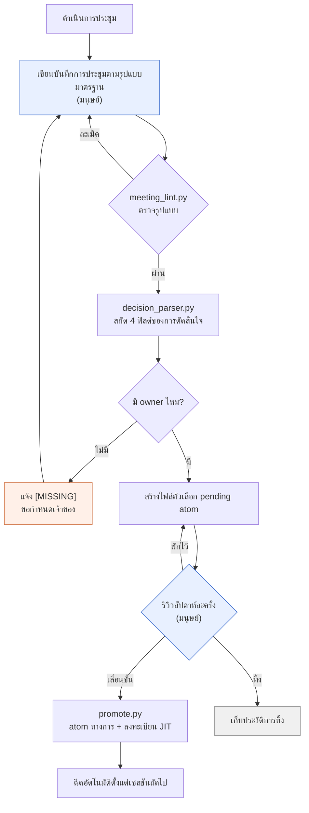

# 17.2 ไปป์ไลน์สกัดการตัดสินใจจากบันทึกการประชุม

เช้าวันพุธ พอเข้าออฟฟิศก็มีแจ้งเตือนเด้งขึ้นในแชตภายในทีม "สัปดาห์ที่แล้วเราตกลงกันว่าจะเพิ่มช่องอินเวนทอรีเป็น 30 ช่องใช่ไหมครับ แล้วใครรับหน้าที่แก้ชีตข้อมูลกันนะ" ในเทรดไม่มีใครตอบได้ บันทึกการประชุมมีอยู่แน่นอน อยู่ในโฟลเดอร์สักที่ พอเปิดดูก็เต็มไปด้วยวาระและการอภิปรายแน่นขนัด แต่ "สรุปแล้วตัดสินใจอะไร และใครรับผิดชอบ" กลับละลายอยู่ระหว่างบรรทัด สุดท้ายในการประชุมครั้งถัดไปก็ต้องหยิบวาระเดิมมาเริ่มใหม่ตั้งแต่ต้น

บทนี้เป็นเรื่องราวของเครื่องจักรที่อุดช่องว่างสามวันนั้น เมื่อบันทึกการประชุมหนึ่งฉบับเข้าสู่ระบบ มันจะผ่านการตรวจรูปแบบ สกัดสี่ฟิลด์ของการตัดสินใจออกมา การตัดสินใจที่ไม่มีเจ้าของจะถูกติดป้าย [MISSING] สร้างไฟล์ตัวเลือกขึ้นมา และหนึ่งสัปดาห์ต่อมาผ่านการตรวจสอบโดยมนุษย์จนกลายเป็นสินทรัพย์ที่ถูกฉีดเข้าระบบอัตโนมัติ มือคนแตะแค่สองจุดที่ปลายทั้งสองข้างเท่านั้น คือทางเข้าที่เขียนบันทึกการประชุม กับทางออกที่ตรวจสอบสัปดาห์ละครั้ง

---

## 17.2.1 ภาพรวมการไหลทั้งหมดของไปป์ไลน์

ก่อนอื่นมาดูภาพรวมทั้งหมดในหน้าเดียว แต่ละกล่องสี่เหลี่ยมคือสคริปต์เล็ก ๆ หรือการตัดสินใจของมนุษย์ กล่องที่ต้องย้ายด้วยมือมีแค่สองกล่อง ที่เหลือไหลไปโดยอัตโนมัติ



มีเพียงสองกล่องสีฟ้า (เขียนบันทึกการประชุม·รีวิวสัปดาห์ละครั้ง) เท่านั้นที่เป็นมนุษย์ ที่เหลือเป็นสคริปต์ กล่องสีส้ม (แจ้ง [MISSING]) คือจุดที่การตรวจอัตโนมัติเรียกมนุษย์กลับมาอีกครั้ง หากการตัดสินใจไม่มีเจ้าของ ไปป์ไลน์จะไม่ได้หยุดไปเฉย ๆ แต่จะส่งการตัดสินใจย้อนกลับไปยังขั้นตอนเขียนบันทึกการประชุมจนกว่าจะกำหนดได้ว่าใครรับผิดชอบ นี่คือการออกแบบหลักของไปป์ไลน์นี้ ไม่ปล่อยช่องว่างผ่านไปเงียบ ๆ แต่แจ้งให้รู้ดัง ๆ

โครงสร้างโฟลเดอร์สินทรัพย์ทั้งหมดถูกจัดวางไว้แบบนี้

<svg xmlns="http://www.w3.org/2000/svg" viewBox="0 0 720 300" font-family="monospace" font-size="13">
  <rect x="10" y="10" width="700" height="280" fill="#fafafa" stroke="#cccccc"/>
  <text x="24" y="38" font-weight="bold">meeting_pipeline/</text>
  <line x1="40" y1="48" x2="40" y2="270" stroke="#bbbbbb"/>
  <text x="52" y="68">scripts/</text>
  <text x="80" y="92" fill="#3366cc">meeting_lint.py</text>
  <text x="300" y="92" fill="#777777">ตรวจรูปแบบ·ส่วนที่จำเป็น</text>
  <text x="80" y="116" fill="#3366cc">decision_parser.py</text>
  <text x="300" y="116" fill="#777777">สกัด 4 ฟิลด์ + แจ้ง owner [MISSING]</text>
  <text x="80" y="140" fill="#3366cc">promote.py</text>
  <text x="300" y="140" fill="#777777">pending → atom ทางการ + อัปเดต JIT manifest</text>
  <text x="52" y="172">meetings/</text>
  <text x="80" y="196" fill="#999999">2026-05-18_battle_tf.md</text>
  <text x="300" y="196" fill="#777777">บันทึกการประชุมรูปแบบมาตรฐาน (อินพุต)</text>
  <text x="52" y="228">atoms/pending/</text>
  <text x="80" y="252" fill="#cc6633">meeting_decision_2026-05-18_D1.md</text>
  <text x="300" y="252" fill="#777777">ตัวเลือก (รอตรวจสอบ 1 สัปดาห์)</text>
</svg>

---

## 17.2.2 ขั้นที่ 1 — lint ที่บังคับรูปแบบ

การจะสกัดได้นั้น บันทึกการประชุมต้องมีรูปร่างที่เครื่องอ่านได้ หากไม่มีส่วน "## 결정" หรือการตัดสินใจถูกปนอยู่ในย่อหน้าร้อยแก้ว ตัวพาร์สเซอร์ก็สกัดอะไรไม่ออกเลย เพราะฉะนั้นสิ่งแรกที่ใส่เข้าไปคือการตรวจรูปแบบ งานที่ `meeting_lint.py` ทำนั้นเรียบง่าย มี frontmatter ที่จำเป็นไหม มีส่วนที่จำเป็นไหม สล็อตการตัดสินใจถูกเติมในรูปแบบ `D1`, `D2` หรือไม่

```python
# โครงของ meeting_lint.py
REQUIRED_FRONTMATTER = ["type", "date", "category", "attendees"]
REQUIRED_SECTIONS = ["## 안건", "## 결정", "## 액션 아이템", "## 다음 회의"]
ALLOWED_CATEGORIES = ["art", "battle", "daily", "issue", "review"]

def lint(meeting_note_path):
    fm, body = parse_markdown(meeting_note_path)
    errors = []
    for key in REQUIRED_FRONTMATTER:
        if key not in fm:
            errors.append(f"frontmatter ขาดหาย: {key}")
    if fm.get("category") not in ALLOWED_CATEGORIES:
        errors.append(f"ค่า category ไม่เหมาะสม: {fm.get('category')}")
    for section in REQUIRED_SECTIONS:
        if section not in body:
            errors.append(f"ส่วนขาดหาย: {section}")
    if "## 결정" in body:
        block = extract_section(body, "## 결정")
        if not any(l.strip().startswith("- D") for l in block.split("\n")):
            errors.append("สล็อตการตัดสินใจว่างเปล่า (ต้องใช้รูปแบบ D1, D2...)")
    return errors
```

เราผูกการตรวจนี้ไว้เป็นฮุกก่อนคอมมิตบันทึกการประชุม หากผิดรูปแบบ ตัวคอมมิตเองก็จะถูกบล็อก ถ้าตั้งไว้เป็นแค่คำแนะนำ วันที่ยุ่ง ๆ ก็จะแอบข้ามไปเงียบ ๆ และรูปแบบที่ข้ามไปครั้งหนึ่งจะพังในสัปดาห์ถัดไป ถ้าถูกบล็อกสัก 1\~2 สัปดาห์ รูปแบบก็จะติดมือ แต่หากเข้มงวดเกินไปจะทำให้ผัดผ่อนการเขียนบันทึกการประชุมเสียเอง ดังนั้นการเคลียร์ false positive สักครั้งหลังช่วงปรับตัวจึงเป็นการดำเนินงานที่สมจริง

---

## 17.2.3 ขั้นที่ 2 — พาร์สเซอร์ที่ขุดสี่ฟิลด์ของการตัดสินใจ

จากบันทึกการประชุมที่ผ่านรูปแบบมาแล้ว `decision_parser.py` จะอ่านสล็อตการตัดสินใจ สิ่งที่ต้องสกัดจากการตัดสินใจหนึ่งอันมีพอดีสี่อย่าง **ตัดสินใจอะไร (decision), ใครรับผิดชอบ (owner), ทำไมจึงตัดสินใจแบบนั้น (rationale), ต่อไปต้องทำอะไร (follow_up)** สี่ฟิลด์นี้ทำให้การตัดสินใจกลายเป็นสินทรัพย์ โดยเฉพาะ owner การตัดสินใจที่ไม่มีเจ้าของไม่ใช่การตัดสินใจ แต่เป็นเพียงความหวัง ดังนั้นพาร์สเซอร์จึงไม่ปล่อย owner ที่ว่างให้เป็นช่องว่างเงียบ ๆ แต่จะใส่ `[MISSING]` เพื่อแจ้ง

จากจุดนี้ไปจนจบ เราจะตามดูกระบวนการที่บันทึกการประชุมหนึ่งฉบับกลายเป็นสินทรัพย์โดยไม่ข้ามแม้แต่บรรทัดเดียว นี่คือตัวอย่างเดียวที่ต่อเนื่องตั้งแต่อินพุตจนถึงการเลื่อนขั้นเป็น atom

```text
================ อินพุต: meetings/2026-05-18_battle_tf.md ================
---
type: meeting
date: 2026-05-18
category: battle
attendees: [이민수, teammate_a, teammate_b]
related_atoms: [combat_global_cooldown_constant]
---
## 안건
- รวมค่ารวมคูลดาวน์ส่วนกลางของการต่อสู้ (GCD) ให้เป็นค่าเดียว
- สกิลฟื้นฟูจะได้รับการยกเว้น GCD หรือไม่

## 결정
- D1: รวมค่าคูลดาวน์ส่วนกลางของการต่อสู้ให้เป็น 0.5 วินาที (เจ้าของ: teammate_a) [เหตุผล: จากการทดสอบความรู้สึกตอบสนองอินพุตเทียบกับ refgame ค่า 0.5 วินาทีเสถียรที่สุด]
- D2: สกิลฟื้นฟูยกเว้นจากการใช้คูลดาวน์ส่วนกลาง [เหตุผล: กังวลว่าวงรอบการฟื้นฟูจะขาดช่วง]

## 액션 아이템
- @teammate_a: ใส่ค่า 0.5 ในคอลัมน์ cooldown ของชีตข้อมูลการต่อสู้ทั้งหมด (~MM-DD)

## 다음 회의
- MM-DD 14:00, รีวิวผลทดสอบวงรอบการฟื้นฟู 1 สัปดาห์

================ $ python meeting_lint.py meetings/2026-05-18_battle_tf.md ================
[OK] frontmatter 4/4, ส่วน 4/4, ตรวจพบสล็อตการตัดสินใจ 2 รายการ อนุญาตให้คอมมิต

================ $ python decision_parser.py meetings/2026-05-18_battle_tf.md ================
[
  {
    "id": "D1",
    "decision": "รวมค่าคูลดาวน์ส่วนกลางของการต่อสู้ให้เป็น 0.5 วินาที",
    "owner": "teammate_a",
    "rationale": "จากการทดสอบความรู้สึกตอบสนองอินพุตเทียบกับ refgame ค่า 0.5 วินาทีเสถียรที่สุด",
    "follow_up": "ใส่ค่า 0.5 ในคอลัมน์ cooldown ของชีตข้อมูลการต่อสู้ทั้งหมด (~MM-DD)",
    "source_meeting": "2026-05-18_battle_tf.md",
    "category": "battle",
    "related_atoms": ["combat_global_cooldown_constant"]
  },
  {
    "id": "D2",
    "decision": "สกิลฟื้นฟูยกเว้นจากการใช้คูลดาวน์ส่วนกลาง",
    "owner": "[MISSING]",          # ← ไม่ได้ระบุเจ้าของ พาร์สเซอร์แจ้งเตือน
    "rationale": "กังวลว่าวงรอบการฟื้นฟูจะขาดช่วง",
    "follow_up": null,             # ← ไม่มีแอ็กชันต่อเนื่องเช่นกัน
    "source_meeting": "2026-05-18_battle_tf.md",
    "category": "battle",
    "related_atoms": ["combat_global_cooldown_constant"]
  }
]
[WARN] D2: owner=[MISSING] — การตัดสินใจไม่มีเจ้าของ พักการสร้าง pending ส่งคืนให้ผู้เขียนบันทึกการประชุม

================ สร้าง pending: ผ่านเฉพาะ D1 ================
$ cat atoms/pending/meeting_decision_2026-05-18_D1.md
---
name: meeting_decision_2026-05-18_D1
description: การตัดสินใจรวมคูลดาวน์ส่วนกลางของการต่อสู้เป็น 0.5 วินาที
status: pending
type: decision
source_meeting: 2026-05-18_battle_tf.md
owner: teammate_a
category: battle
related_atoms: [combat_global_cooldown_constant]
created: 2026-05-18
---
## 결정
รวมค่าคูลดาวน์ส่วนกลางของการต่อสู้ให้เป็น 0.5 วินาที
## 근거
จากการทดสอบความรู้สึกตอบสนองอินพุตเทียบกับ refgame ค่า 0.5 วินาทีเสถียรที่สุด
## 후속 액션
- [ ] @teammate_a: ใส่ค่า 0.5 ในคอลัมน์ cooldown ทั้งหมด (~MM-DD)

================ 1 สัปดาห์ต่อมา รีวิวรายสัปดาห์ ================
$ python promote.py atoms/pending/meeting_decision_2026-05-18_D1.md
[PROMOTE] → atoms/combat_global_cooldown_constant_decisions/meeting_decision_2026-05-18_D1.md
[JIT] ลงทะเบียน manifest: trigger=(전투|쿨다운|GCD|cooldown), atom 18개 → 19개
[OK] ตั้งแต่เซสชันถัดไป เมื่อป้อน "글로벌 쿨다운" การตัดสินใจนี้จะถูกฉีดอัตโนมัติ
```

กล่องเดียวนี้คือทั้งหมดของไปป์ไลน์ จุดที่ควรสังเกตคือ D2 เนื้อหาการตัดสินใจก็ดูเรียบร้อย มีเหตุผลด้วย แต่ owner กลับว่าง พาร์สเซอร์ไม่ปล่อยอันนี้ผ่านไปเฉย ๆ มันใส่ `[MISSING]` พักการสร้าง pending แล้วส่งคืนให้ผู้เขียน D2 จะได้เจ้าของในการประชุม "รีวิวผลทดสอบวงรอบการฟื้นฟู 1 สัปดาห์" อีกไม่กี่วันต่อมาแล้วเข้ามาใหม่ การส่งคืนเพียงครั้งเดียวที่อุดช่องว่างนี้ ทำให้คำถาม "ตกลงใครรับหน้าที่นั้นไปนะ" ในแชตภายในทีมสามวันถัดมาไม่มีวันโผล่ขึ้นอีกเลย

กฎที่ว่าหากไม่มี owner ให้แจ้งเตือนนั้น ถูกตอกตรึงเป็นกฎไว้ด้วย atom หนึ่งอัน (`decision_summary_not_clickup_mirror`, §17.1.2) ในเครื่องมือจัดการทาสก์อาจมีงานชื่อ "แก้ชีตข้อมูล" ลอยอยู่ แต่ว่างานนั้นเป็นผลของการตัดสินใจอะไรและทำไม จะถูกบันทึกไว้เฉพาะใน atom ของบันทึกการประชุมเท่านั้น

---

## 17.2.4 ขั้นที่ 3 — บ่มไว้หนึ่งสัปดาห์ใน pending

การตัดสินใจที่พาร์สเซอร์ปล่อยผ่านจะยังไม่กลายเป็น atom ทางการในทันที แต่จะรออยู่ใน `pending/` หนึ่งสัปดาห์ เพราะสิ่งที่ตัดสินใจอย่างมั่นใจในที่ประชุม พอลองใช้งานจริงหนึ่งสัปดาห์ก็มักจะถูกพลิกกลับบ่อย ๆ D2 ในตัวอย่างข้างต้นอยู่ในเขตอันตรายนั้นพอดี การตัดสินใจที่ว่า "ฟื้นฟูยกเว้น GCD (คูลดาวน์ส่วนกลาง)" อาจถูกพลิกกลับอีกครั้งหากวงรอบการฟื้นฟูพังในการทดสอบ 1 สัปดาห์ pending คือช่องที่บังคับให้มีเวลาให้หมึกแห้ง

และการทิ้งก็เก็บเป็นสินทรัพย์เช่นกัน หากการตัดสินใจอย่าง D2 พังลงในการทดสอบ 1 สัปดาห์ แทนที่จะลบทิ้งเฉย ๆ เราสร้าง atom ประวัติการทิ้งขึ้นมา

```markdown
---
name: meeting_decision_2026-05-18_D2_DISCARDED
status: discarded
discarded_reason: ผลทดสอบ 1 สัปดาห์ เส้นโค้ง DPS ของวงรอบการฟื้นฟูพังทลาย
---
## 원 결정
ใช้คูลดาวน์ส่วนกลาง 0.5 วินาทีกับสกิลฟื้นฟูด้วย
## 폐기 이유
ในการทดสอบ 1 สัปดาห์ DPS ของวงรอบการฟื้นฟูตก ทำให้บาลานซ์โดยรวมพังทลาย ย้อนกลับเป็นการตัดสินใจยกเว้น
## 교훈
"ฟื้นฟูยกเว้น GCD คือมาตรฐาน" → เลื่อนขั้นเป็น atom combat_healing_skill_cooldown_exception
```

ประวัติการทิ้งจะกลายเป็นคำตอบของคำถาม "วาระนี้เคยลองทำมาก่อนไหมนะ" ในการประชุมครั้งถัดไป มันคือเครื่องมือที่ถูกที่สุดในการป้องกันไม่ให้ทำผิดซ้ำสองครั้ง แต่หากบันทึกการทิ้งสะสมมากขึ้นจะกลายเป็นสัญญาณรบกวนในการค้นหา จึงจำเป็นต้องจัดระเบียบรายไตรมาส ตัดที่ซ้ำซ้อนออกและเหลือไว้เพียงบทเรียน

---

## 17.2.5 ขั้นที่ 4 — รีวิวสัปดาห์ละครั้งและการเลื่อนขั้น

ทุกสัปดาห์ตามเวลาที่กำหนด เราจะดูตัวเลือก pending รวบยอดทีเดียว ผลลัพธ์มีหนึ่งในสามอย่าง

| ผลลัพธ์ | การจัดการ |
|---|---|
| เลื่อนขั้น | pending → ย้ายไปโฟลเดอร์ atom ทางการ ลงทะเบียน JIT manifest |
| ทิ้ง | การตัดสินใจถูกพลิก → เอาออกจาก pending และเก็บ atom ประวัติการทิ้ง |
| พักไว้ | ข้อมูลไม่พอ → ต่อ pending อีก 1 สัปดาห์ |

การรีวิวใช้เวลาราว 15 นาทีต่อ atom 10 อัน เมื่อตัดสินใจเลื่อนขั้น `promote.py` จะจัดการย้ายไฟล์และอัปเดต manifest ในคราวเดียว

```python
# โครงของ promote.py
def promote(pending_path):
    fm, body = parse_markdown(pending_path)
    target = ATOM_BASE / f"{fm['related_atoms'][0]}_decisions" / f"{fm['name']}.md"
    move(pending_path, target)
    manifest = json.load(open(JIT_MANIFEST))
    manifest['atoms'].append({
        "name": fm['name'],
        "path": str(target),
        "trigger_regex": build_trigger(fm),   # related_atoms + คีย์เวิร์ด category
        "description": fm['description'],
        "added": today(),
    })
    json.dump(manifest, open(JIT_MANIFEST, "w"), indent=2)
    log_promotion(fm['name'])
```

หาก `trigger_regex` ตรงกับอินพุตของผู้ใช้ในเซสชันถัดไป การตัดสินใจนี้จะถูกฉีดเข้าโดยอัตโนมัติ ในตัวอย่างข้างต้น หากป้อน "글로벌 쿨다운" การตัดสินใจ D1 และเหตุผลของมันจะตามเข้ามาด้วย นี่คือจุดที่การตัดสินใจซึ่งเคยต้องย้ายด้วยมือ กลายเป็นสินทรัพย์ที่ผุดขึ้นมาเองในจังหวะที่ต้องการ

---

## 17.2.6 การวัดผล — ต่างจากตอนย้ายด้วยมืออย่างไร

จากประสบการณ์การดำเนินงานโปรเจกต์ A ของผู้เขียน นี่คือความรู้สึกจากการเปรียบเทียบระหว่างขั้นที่จัดแค่รูปแบบมาตรฐานไว้ กับขั้นที่เดินไปป์ไลน์ ตัวเลขด้านล่างไม่ใช่การวัดอย่างแม่นยำ แต่เป็นทิศทางและสัดส่วนคร่าว ๆ ที่รู้สึกได้ระหว่างการดำเนินงาน มีการประมาณของผู้เขียน (ยังไม่ได้ตรวจสอบ) ปนอยู่

| รายการ | แค่รูปแบบ (สกัดด้วยมือ) | เดินไปป์ไลน์ |
|---|---|---|
| เวลาสกัดการตัดสินใจจากบันทึกการประชุม | 20\~30 นาทีต่อการประชุม | น้อยกว่า 1 นาที |
| สัดส่วนการเลื่อนขั้นการตัดสินใจเป็น atom | 5\~10% (ไม่มีเวลาจัดระเบียบ) | 60\~80% (ตรวจครบทุกอัน) |
| ประชุมซ้ำ "เคยตัดสินใจมาก่อนไหม?" | 5\~10 ครั้งต่อไตรมาส | 0\~2 ครั้งต่อไตรมาส |
| การเกิดการตัดสินใจที่ไม่รู้เจ้าของ | ตามรอยไม่ได้ | มองเห็นทันทีผ่านการแจ้ง [MISSING] |

สิ่งที่เปลี่ยนไปมากที่สุดคือสัดส่วนการเลื่อนขั้น ตอนที่จัดระเบียบด้วยมือนั้น เพราะไม่มีเวลา การตัดสินใจกว่า 90% จึงระเหยหายไป พอทำให้เป็นอัตโนมัติก็ตรวจได้ครบทุกอัน การตัดสินใจที่มีคุณค่าจึงถูกเก็บไว้โดยไม่ตกหล่น ทิศทางนั้นชัดเจน ส่วนค่าที่แม่นยำของสัดส่วนจะแตกต่างกันไปตามขนาดทีมและความถี่ของการประชุม

---

## 17.2.7 ความล้มเหลวที่พบบ่อยและวิธีแก้

| รูปแบบ | วิธีแก้ |
|---|---|
| ใช้ lint เป็นแค่คำแนะนำ | บังคับด้วยฮุกคอมมิต |
| เขียนการอภิปรายปนลงในสล็อตการตัดสินใจ | การตัดสินใจหนึ่งประโยค เหตุผลแยกเป็นฟิลด์ต่างหาก |
| ปล่อยช่องว่าง owner ผ่านไปเฉย ๆ | แจ้ง [MISSING] + ส่งคืนด้วยการพัก pending |
| เลื่อนการรีวิว pending ไปเรื่อย ๆ | จัดสล็อตตายตัวในการทบทวนรายสัปดาห์ แม้แค่ 5 นาทีก็ทุกสัปดาห์ |
| ไม่เก็บประวัติการทิ้ง | เก็บการทิ้งเป็น atom ต่างหากด้วย |

ห้าบรรทัดนี้แทบจะเป็นทั้งหมด การลดจุดที่มนุษย์ต้องคอยรักษาด้วยเจตจำนงให้น้อยที่สุด แล้วมอบการตรวจรูปแบบและ owner ให้เครื่องจักรทำ คือจุดเสถียรของระบบนี้

---

## สรุปประเด็นสำคัญของบท
- บันทึกการประชุมหนึ่งฉบับไหลผ่าน lint → พาร์สเซอร์ → pending → รีวิว → ลงทะเบียน JIT จนกลายเป็นสินทรัพย์โดยอัตโนมัติ
- ในสี่ฟิลด์ของการตัดสินใจ หาก owner ว่าง พาร์สเซอร์จะใส่ [MISSING] แล้วส่งคืน
- การบ่ม pending ไว้ 1 สัปดาห์และการเก็บประวัติการทิ้ง บังคับให้มีเวลาให้หมึกของการตัดสินใจแห้ง

---

> **การประยุกต์นอกเกม** การที่บันทึกการประชุมหนึ่งฉบับไหลไปบนสายพานลำเลียง ตรวจรูปแบบ→สกัดการตัดสินใจ→ตรวจสอบ 1 สัปดาห์→ลงทะเบียนทางการ และมนุษย์แตะแค่สองจุดคือทางเข้า (เขียน) และทางออก (ตรวจสอบสัปดาห์ละครั้ง) โครงสร้างนี้ไม่ใช่แค่เกม แต่ปลูกถ่ายลงในการดำเนินงานเอกสารของทีมงานความรู้ทุกประเภทได้ ยกตัวอย่างเช่นเมื่อทีมที่ปรึกษาจัดการกับโน้ตการประชุมลูกค้า เพียงแค่จัดรูปแบบโน้ตให้เป็นมาตรฐาน แล้วสกัดสล็อต "การตัดสินใจ·ผู้รับผิดชอบ·เหตุผล·การกระทำถัดไป" ด้วย LLM เป็นรอบแรก หากผู้รับผิดชอบว่างก็ขึ้น `[MISSING]` แล้วส่งคืน และเลื่อนขั้นเฉพาะการตัดสินใจที่บ่มมาแล้วหนึ่งสัปดาห์ไปเป็นแอ็กชันแทร็กเกอร์ทางการก็พอ การตัดสินใจจากการประชุมที่เคยระเหยหายไปกว่า 90% เมื่อจัดระเบียบด้วยมือ พอวางขึ้นสายพานลำเลียงก็จะกลายเป็นเป้าหมายที่ตรวจครบทุกอันและถูกเก็บไว้โดยไม่ตกหล่น

---

## ลองทำดู

**setup.** วางเทมเพลตรูปแบบมาตรฐานไว้ในโฟลเดอร์บันทึกการประชุม แล้วผูก `meeting_lint.py` ไว้ในฮุกก่อนคอมมิต กำหนด frontmatter 4 ฟิลด์และส่วน 4 ส่วนให้เป็นข้อบังคับ

**prompt.** ใส่บันทึกการประชุมหนึ่งฉบับลงในพาร์สเซอร์แล้วสั่งดังนี้

> จากส่วน `## 결정` ของบันทึกการประชุมนี้ ให้สกัดสี่ฟิลด์คือ decision / owner / rationale / follow_up ของแต่ละการตัดสินใจออกมาเป็น JSON การตัดสินใจที่ไม่ได้ระบุ owner ให้ทำเครื่องหมาย owner เป็น `[MISSING]` แล้วรวบรวมไว้ในบรรทัดเตือนต่างหาก อย่าเดาเพื่อเติมให้เต็ม

**verify.** หากใน JSON เอาต์พุตมีการตัดสินใจที่ถูกใส่ `[MISSING]` ก็อย่าสร้าง pending สำหรับการตัดสินใจนั้น แต่ส่งคืนให้ผู้เขียนบันทึกการประชุม สร้างไฟล์ตัวเลือก pending เฉพาะการตัดสินใจที่เติม owner ครบแล้วเท่านั้น และหนึ่งสัปดาห์ต่อมาในรีวิวรายสัปดาห์จึงตัดสินว่าจะเลื่อนขั้น·ทิ้ง·พักไว้

### ฉบับย่อสำหรับคนเดียว
หากทำงานคนเดียว สคริปต์สามตัวกับฮุกคอมมิตนั้นเกินจำเป็น ทำให้ส่วน `## 결정` ของบันทึกการประชุมเป็นมาตรฐานก็พอ แล้วเขียนหนึ่งบรรทัดต่อหนึ่งการตัดสินใจว่า `D1: อะไร / เจ้าของ: ฉัน / เหตุผล: ทำไม` สัปดาห์ละครั้ง ดึงเฉพาะบรรทัดการตัดสินใจจากบันทึกการประชุมของสัปดาห์นั้นมารวมไว้ในไฟล์เดียว (`decisions.md`) และบรรทัดที่เจ้าของว่าง ก็ทำเครื่องหมาย `[MISSING]` ด้วยตัวเองไว้แล้วค่อยเติมในสัปดาห์ถัดไป สคริปต์จะมาผูกทีหลังตอนที่มือเริ่มเมื่อยก็ยังไม่สาย หัวใจคือสามนิสัย "การตัดสินใจหนึ่งบรรทัด·ระบุเจ้าของ·รวบรวมสัปดาห์ละครั้ง"
