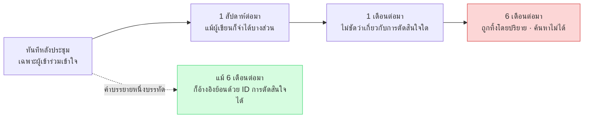
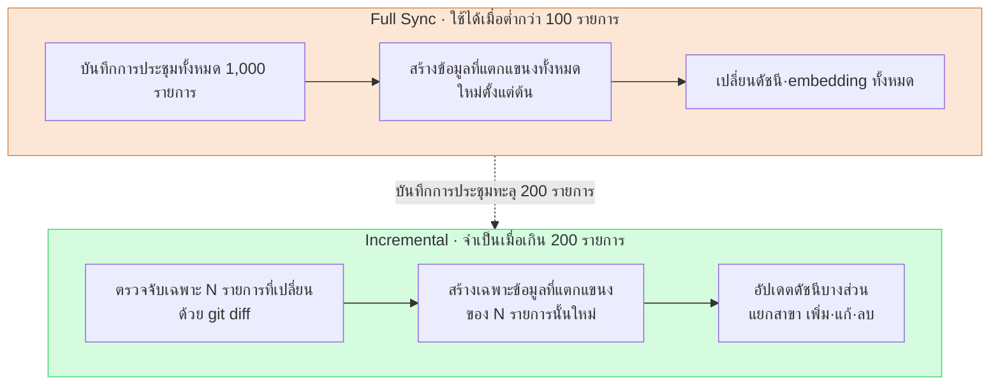

# 17.3 การจัดหมวดหมู่·คำบรรยายภาพ·การซิงค์การประชุม — สามแกนของบันทึกการประชุมที่กลายเป็นสินทรัพย์

> บันทึกการประชุมไม่ได้มีไว้เพื่อสะสม เป้าหมายคือการที่หกเดือนต่อมาก็ยังค้นหาเจอ นำไปสู่การตัดสินใจได้ และปรากฏในสถานะเดียวกันบนเครื่อง PC ทั้งสองเครื่อง

---

บ่ายวันอังคาร ผมนึกขึ้นได้ว่าในการประชุมเมื่อปีก่อนเราตกลงกันชัดเจนว่าจะลดความอิ่มสีของชุดตัวละครลงหนึ่งระดับ แต่กลับหาบันทึกการประชุมนั้นไม่เจอ พอเปิดโฟลเดอร์ดู ก็พบไฟล์อย่าง `meeting_0413.md`, `회의_수정본_final.md`, `IMG_2034.png` ราว 200 ไฟล์กองอยู่โดยเรียงตามวันที่เพียงอย่างเดียว ไม่มีหมวดหมู่ ไม่มีคำบรรยายภาพ ไม่มีการตั้งชื่อที่สม่ำเสมอ การตัดสินใจอยู่ที่ไหนสักแห่ง แต่เส้นทางที่จะไปถึงการตัดสินใจนั้นหายไปแล้ว

บันทึกการประชุมจะกลายเป็นสินทรัพย์ได้ ต้องมีสามสิ่งทำงานพร้อมกัน **การจัดหมวดหมู่** สร้างจุดเข้าค้นหาลำดับแรก **คำบรรยายภาพ** ทำให้ภาพครึ่งหนึ่งยังค้นหาได้ และ **การซิงค์** ตรึงต้นทุนการประมวลผลไว้ที่เฉพาะส่วนที่เปลี่ยนแปลงแม้จะเกิน 1,000 รายการก็ตาม หากขาดแม้เพียงหนึ่งในสามนี้ บันทึกการประชุมก็จะกลายเป็นกองที่ตายแล้ว ซึ่งยิ่งสะสมก็ยิ่งหนักขึ้นเท่านั้น

ใน §17.1·§17.2 เราได้วางกระแสที่แปลงบันทึกการประชุมให้เป็นไปป์ไลน์การสกัด — ตรวจรูปแบบด้วย `meeting_lint.py` ให้ `decision_parser.py` ดึงสี่ฟิลด์ของการตัดสินใจ (`decision` / `owner` / `rationale` / `follow_up`) ออกมา หากไม่มี owner ก็แจ้งเป็น `[MISSING]` รวบรวมไว้เป็น pending atom แล้วเลื่อนขั้นด้วย `promote.py` บทนี้จะกล่าวถึงสามมาตรฐานการดำเนินงานที่ค้ำให้ไปป์ไลน์นั้นไม่พังในระยะยาว

---

## 17.3.1 หมวดหมู่ — จุดเข้าค้นหาลำดับแรก

บันทึกการประชุมเมื่อเวลาผ่านไปก็จะมีจำนวนหลายร้อยหลายพันรายการ ข้อมูลที่ค้นหาไม่ได้ไม่ใช่สินทรัพย์ หมวดหมู่คือทางแยกแรกของการค้นหานั้น เหมือนกับการติดป้ายบนตู้เอกสารในออฟฟิศ ตู้ที่ไม่มีป้ายสุดท้ายก็จะไม่มีใครเปิด

โปรเจกต์ A (พัฒนา MMORPG) ที่ผู้เขียนดูแลอยู่ จัดหมวดหมู่ไว้ห้าหมวด หัวใจสำคัญคือการรักษาให้ **เล็กและตั้งฉากกัน (orthogonal)**

<svg viewBox="0 0 720 220" xmlns="http://www.w3.org/2000/svg" font-family="sans-serif" font-size="13">
  <rect x="10" y="10" width="130" height="190" rx="8" fill="#fce7d6" stroke="#d98a4a"/>
  <text x="75" y="34" text-anchor="middle" font-weight="bold">art</text>
  <text x="75" y="58" text-anchor="middle" font-size="11">ทิศทางภาพ·อาร์ต</text>
  <text x="75" y="78" text-anchor="middle" font-size="10" fill="#666">รีวิวคอนเซ็ปต์</text>
  <text x="75" y="94" text-anchor="middle" font-size="10" fill="#666">ตกลงโทนสภาพแวดล้อม</text>
  <text x="75" y="120" text-anchor="middle" font-size="10" fill="#a05a20">→ สัดส่วนคำบรรยายภาพ↑</text>

  <rect x="150" y="10" width="130" height="190" rx="8" fill="#d6e7fc" stroke="#4a7ad9"/>
  <text x="215" y="34" text-anchor="middle" font-weight="bold">battle</text>
  <text x="215" y="58" text-anchor="middle" font-size="11">การต่อสู้·การปรับสมดุล</text>
  <text x="215" y="78" text-anchor="middle" font-size="10" fill="#666">Cooldown·DPS</text>
  <text x="215" y="94" text-anchor="middle" font-size="10" fill="#666">เส้นโค้งดาเมจ</text>
  <text x="215" y="120" text-anchor="middle" font-size="10" fill="#2050a0">→ การสกัด atom↑</text>

  <rect x="290" y="10" width="130" height="190" rx="8" fill="#d6fce0" stroke="#4ad97a"/>
  <text x="355" y="34" text-anchor="middle" font-weight="bold">daily</text>
  <text x="355" y="58" text-anchor="middle" font-size="11">แชร์ความคืบหน้าประจำ</text>
  <text x="355" y="78" text-anchor="middle" font-size="10" fill="#666">สแตนด์อัป</text>
  <text x="355" y="94" text-anchor="middle" font-size="10" fill="#666">งานที่ต้องทำวันนี้</text>
  <text x="355" y="120" text-anchor="middle" font-size="10" fill="#207040">→ แทบไม่มีการตัดสินใจ</text>

  <rect x="430" y="10" width="130" height="190" rx="8" fill="#fcd6d6" stroke="#d94a4a"/>
  <text x="495" y="34" text-anchor="middle" font-weight="bold">issue</text>
  <text x="495" y="58" text-anchor="middle" font-size="11">รับมือปัญหาเร่งด่วน</text>
  <text x="495" y="78" text-anchor="middle" font-size="10" fill="#666">บิลด์ล้มเหลว</text>
  <text x="495" y="94" text-anchor="middle" font-size="10" fill="#666">เหตุก่อนปล่อย</text>
  <text x="495" y="120" text-anchor="middle" font-size="10" fill="#a02020">→ ต้องจัดการภายหลังเสมอ</text>

  <rect x="570" y="10" width="130" height="190" rx="8" fill="#ece6fc" stroke="#7a4ad9"/>
  <text x="635" y="34" text-anchor="middle" font-weight="bold">review</text>
  <text x="635" y="58" text-anchor="middle" font-size="11">ไมล์สโตน·QA</text>
  <text x="635" y="78" text-anchor="middle" font-size="10" fill="#666">ตรวจ MS</text>
  <text x="635" y="94" text-anchor="middle" font-size="10" fill="#666">ทบทวนรายไตรมาส</text>
  <text x="635" y="120" text-anchor="middle" font-size="10" fill="#502090">→ atom สรุป</text>

  <text x="360" y="172" text-anchor="middle" font-size="11" fill="#444">ห้าช่องไม่ทับซ้อนกัน — หนึ่งการประชุมอยู่ในช่องเดียวเป๊ะ</text>
  <text x="360" y="192" text-anchor="middle" font-size="11" fill="#444">ทันทีที่เพิ่มเป็นหกช่อง คำถาม "นี่ art หรือ battle?" จะติดขัดการประชุมทุกสัปดาห์</text>
</svg>

ห้าหมวดไม่ใช่คำตอบที่ถูกต้องสำหรับทุกทีม หากเป็นโปรเจกต์ที่มีระบบที่ไม่ใช่การต่อสู้เป็นแกนกลาง ก็จำเป็นต้องปรับ เช่น เปลี่ยน `battle` เป็น `system` หัวใจสำคัญไม่ใช่ตัวเลข แต่เป็นหลักการที่ว่าต้องรักษาให้ **การตัดสินใจเรื่องหมวดหมู่เล็กพอที่จะไม่ขัดขวางตัวการประชุมเอง**

### หนึ่งการประชุม หนึ่งหมวดหมู่

การที่การประชุมคาบเกี่ยวสองช่องเกิดขึ้นบ่อย หากกำลังรีวิวคอนเซ็ปต์ตัวละครแล้วเลยไปตกลงเรื่องโมชันการต่อสู้ด้วย จะเป็น art หรือ battle หลักการคือ **ยึดผลผลิตหลักเพียงอย่างเดียว** หากคอนเซ็ปต์คือผลผลิตหลักก็จัดเป็น art ส่วนโมชันการต่อสู้บันทึกเสริมไว้ในฟิลด์ `sub_topic`

```yaml
---
type: meeting_note
category: art
sub_topic: [character, battle_motion]
date: 2026-05-18
attendees: [teammate_a, teammate_b, teammate_c, 이민수]
related_atoms: [character_concept_kim, battle_motion_kim]
confidential: internal
---
```

`sub_topic` เป็นเพียงตัวกรองค้นหาลำดับที่สอง ไม่ได้ใช้ในการตัดสินใจเรื่องเส้นทาง (routing) การกำหนดเส้นทางทำงานด้วยค่าเดี่ยวของ `category` เสมอ หากหลักการค่าเดี่ยวนี้พังลง `promote.py` ของ §17.2 ก็จะไม่สามารถแยกสาขาว่าจะส่ง atom ไปยังโฟลเดอร์ใด และผลรวมของสถิติรายหมวดหมู่ก็จะคลาดเคลื่อน ความตั้งฉากไม่ใช่เรื่องความสวยงาม แต่เป็นเงื่อนไขเบื้องต้นของความสมบูรณ์ของไปป์ไลน์

### แต่ละหมวดหมู่ดำเนินงานต่างกัน — นั่นคือคุณค่าที่แท้จริงของการแยก

เหตุผลที่แท้จริงในการแบ่งห้าช่องไม่ใช่ป้ายค้นหา แต่เป็นเพราะแต่ละช่องมีวิธีดำเนินงานต่างกัน เมื่อแยกออกจึงออกแบบการดำเนินงานแบบต่างระดับได้อย่างเป็นธรรมชาติ

`art` มีภาพแนบจำนวนมาก จึงจำเป็นต้องมีมาตรฐานคำบรรยายภาพในหัวข้อถัดไป เนื่องจากการตัดสินใจเน้นด้านภาพ ในช่องการตัดสินใจจึงมีการอ้างอิงภาพอย่าง `` ใส่เข้ามา ส่วน `battle` การตัดสินใจเป็นตัวเลขและกฎ จึงมีอัตราการเลื่อนขั้น atom อัตโนมัติสูงที่สุด และเนื่องจากการตัดสินใจหนึ่งบรรทัดนำไปสู่การเปลี่ยนแปลงชีตข้อมูลทั้งชุด การมองเห็นขอบเขตผลกระทบ (แผนผังความสัมพันธ์ในส่วนที่ 11) จึงสำคัญ `daily` การที่แทบไม่มีการตัดสินใจคือเรื่องปกติ และเนื่องจากสะสมเร็ว จึงแยกเป็นโฟลเดอร์อัตโนมัติรายสัปดาห์ (`daily/2026-W21/`) `issue` บันทึกการประชุมมักกระจัดกระจาย จึงกำหนดให้การจัดการภายใน 24 ชั่วโมงหลังเป็นข้อบังคับ และสกัด atom ป้องกันการเกิดซ้ำไปยัง `issue_postmortem/` ส่วน `review` มีปริมาณยาว จึงเขียน atom สรุป 5–10 บรรทัดแยกไว้ต่างหากเพื่อให้ถูกอ้างอิงอัตโนมัติในการทบทวนไตรมาสถัดไป

การเพิ่มหมวดหมู่ใหม่ต้องทำอย่างรอบคอบมาก จะพิจารณาก็ต่อเมื่อผ่านครบทั้งสี่เงื่อนไขนี้ — เกิดขึ้นอย่างน้อย 5 ครั้งต่อไตรมาส วิธีดำเนินงานแตกต่างชัดเจนจากห้าหมวดเดิม จำเป็นต้องมีโฟลเดอร์เส้นทางแยกต่างหาก และยังคงเกิดอย่างน้อย 5 ครั้งแม้หนึ่งเดือนผ่านไป จากประสบการณ์การดำเนินงานของผู้เขียน ห้าหมวดยืนยงมากว่า 1 ปี และแม้ตอนที่นึกถึงตัวเลือกอย่าง `tech_review` หรือ `external` ขึ้นมา สุดท้ายก็ถูกดูดซับเข้าเป็น `sub_topic`

### ตัวจัดหมวดหมู่ด้วย AI ควรอยู่แค่บทบาทเสริม

หมวดหมู่นั้น ลำดับแรกคือให้คนกรอกโดยตรงตอนเขียน ใช้ตัวจัดหมวดหมู่ด้วย AI ช่วยเฉพาะบันทึกการประชุมที่ขาดหายไป เช่นเอกสารที่ได้รับมาจากภายนอก พจนานุกรมคำสำคัญจับได้ราว 90% ส่วนที่เหลือคือ `uncertain` ให้ LLM หรือคนตัดสิน

เมื่อมอบหมายให้ LLM พรอมต์ที่บังคับข้อจำกัดอย่างเข้มงวดจะให้ผลเสถียรกว่า ต่อไปนี้คือพรอมต์ฉบับเต็มที่ใช้งานจริง

```
ต่อไปนี้คือบันทึกการประชุม จงจัดเข้า 1 ใน 5 หมวดหมู่

หมวดหมู่:
- art: ทิศทางภาพ·อาร์ต
- battle: ระบบการต่อสู้·การปรับสมดุล
- daily: แชร์ความคืบหน้าประจำ
- issue: รับมือปัญหาเร่งด่วน
- review: รีวิวไมล์สโตน·QA

บันทึกการประชุม:
[ฉบับเต็มหรือ 500 ตัวอักษรแรก]

รูปแบบการตอบ: คำหมวดหมู่เพียงคำเดียว ห้ามใส่คำอธิบาย·เหตุผล·ความไม่แน่นอนใด ๆ
หากคำตอบไม่ใช่ 1 ใน 5 หมวดหมู่ จะถือว่าระบบล้มเหลว
```

เมื่อใส่บันทึกการประชุมเดียวกัน (ด้านล่างคือช่วงต้นของการประชุม art) เข้าไป ผลลัพธ์ดิบของ Claude เป็นดังนี้

> บันทึกการประชุมที่ป้อน:
> `รีวิวคอนเซ็ปต์ v3 ของตัวละคร K_007 (นักวิชาการ) มีความเห็นว่าความอิ่มของโทนสีชุดสูงเกินไป ตกลงลดลงหนึ่งระดับ และตกลงจะตรวจโทนของโมชันการต่อสู้ไปพร้อมกันในการประชุมครั้งหน้า`

> ผลลัพธ์ของ Claude:
> `art`

ออกมาเรียบร้อยเพียงคำเดียว แต่เมื่อใส่บันทึกการประชุม daily เข้าไปในพรอมต์เดียวกัน ก็เกิดเรื่องแบบนี้ขึ้น

> ป้อน: `วันนี้บิลด์พังตอนเช้ามืด สาเหตุดูเหมือนเป็นความขัดแย้งในการ merge ชีตข้อมูล จะแก้ด้วย hotfix ก่อนแล้วค่อยแก้อย่างเป็นทางการ`

> ผลลัพธ์ของ Claude:
> `issue`

ผิวเผินเป็นคำพูดที่ออกมาจากสแตนด์อัป daily แต่ Claude ดูเนื้อหาแล้วจัดเป็น `issue` **นี่คือเหตุผลที่ไม่ควรใช้ตัวจัดหมวดหมู่เป็นลำดับแรกเลย** คนจะตัดสินเชิงการดำเนินงานว่า "อันนี้เป็นเหตุบิลด์ที่จู่ ๆ โผล่มากลาง daily จึงควรแยกเป็นการประชุม issue ต่างหาก" ส่วน AI ดูแค่ข้อความแล้วแปะป้าย ป้ายอาจถูก แต่มันตัดสินไม่ได้ว่าจะแยกการประชุมหรือไม่ ดังนั้นคนจึงเป็นลำดับแรก ส่วน LLM อยู่แค่บทบาทเสริมส่วนที่ขาดหาย

ในการทบทวนรายไตรมาส เราจะนับจำนวนการประชุมรายหมวดหมู่เพื่อดูว่า "ใช้เวลาไปที่ไหน" การกระจายด้านล่างเป็นการประมาณของผู้เขียน (ยังไม่ได้ตรวจสอบ) จำนวนสัมบูรณ์เป็นเพียงตัวอย่าง มีเพียงความสัมพันธ์มากน้อยของสัดส่วนเท่านั้นที่ตรงกับความรู้สึกในการดำเนินงานจริง

| หมวดหมู่ | สัดส่วน (ประมาณ) | หมายเหตุ |
|---|---|---|
| `daily` | ราว 1/3 | ประจำทุกวัน แทบไม่มีการตัดสินใจ |
| `battle` | ราว 1/5 | TF การต่อสู้ สัปดาห์ละ 2 ครั้ง |
| `art` | ราว 1/7 | รีวิวอาร์ต + การประชุมภายนอก |
| `issue` | ต่ำ | เหตุบิลด์ ฯลฯ |
| `review` | ต่ำที่สุด | ไมล์สโตน·ทบทวนรายไตรมาส |
| อื่น ๆ | ราว 1/5 | 1:1, ภายนอก ฯลฯ ที่ไม่เข้าหมวดหมู่ |

หาก `issue` ถูกจับได้โดดเด่นในไตรมาสหนึ่ง การปรับปรุงเสถียรภาพของบิลด์·CI ก็จะกลายเป็นลำดับความสำคัญถัดไป หมวดหมู่ไม่ได้มีไว้แค่ค้นหา แต่ยังเป็นกระจกที่สะท้อนการจัดสรรเวลาขององค์กรด้วย

---

## 17.3.2 คำบรรยายภาพ — หนึ่งบรรทัดที่ทำให้ภาพครึ่งหนึ่งยังมีชีวิต

บันทึกการประชุม `art` มีเนื้อหาครึ่งหนึ่งเป็นภาพ และภาพที่ไม่มีคำบรรยายก็เหมือนกองรูปถ่ายที่กองบนโต๊ะ วันนั้นจำได้หมด แต่หนึ่งเดือนต่อมา มีแต่รูปที่เขียนบันทึกหนึ่งบรรทัดไว้ด้านหลังเท่านั้นที่ยังอยู่รอด



ในเมื่อภาพคือครึ่งหนึ่งของบันทึกการประชุม หากค้นหาไม่ได้ ก็เท่ากับสินทรัพย์ของบันทึกการประชุมหายไปครึ่งหนึ่ง สิ่งที่ทำให้ครึ่งนั้นมีชีวิตคือคำบรรยายหนึ่งบรรทัด

### องค์ประกอบสามอย่างของคำบรรยายภาพ

มาตรฐานคำบรรยายภาพของโปรเจกต์ A จบในสามบรรทัด

```markdown


**[ภาพที่ 1]** ตัวละคร K_007 (นักวิชาการ) คอนเซ็ปต์ v3 — ลดความอิ่มของโทนสีชุดลงหนึ่งระดับ
*การตัดสินใจ: D2 (ความอิ่มสีชุด -10%) | แอ็กชันถัดไป: งาน v4 (~MM-DD)*
```

องค์ประกอบสามอย่างต่างเปิดเส้นทางค้นหาที่ต่างกัน **หมายเลข + คำอธิบายหนึ่งบรรทัด** เปิดเส้นทางให้อ้างอิงในเนื้อหาว่า "ดูภาพที่ 1" **การอ้างอิง ID การตัดสินใจ (D2)** เปิดการอ้างอิงย้อนกลับว่า "ภาพที่เชื่อมกับการตัดสินใจนี้" และ **แอ็กชันถัดไป** ทิ้งเบาะแสของงานที่จะตามมา ทั้งสามบรรทัดเขียนได้ภายในหนึ่งนาที "แนบทันที" ไม่ได้หมายถึง "เขียนระหว่างประชุม" ระหว่างประชุมจัดการแค่สรุปการตัดสินใจ แล้วเติมคำบรรยายภาพภายใน 10 นาทีหลังจบจึงเป็นเรื่องที่ทำได้จริง

### ชื่อไฟล์และโฟลเดอร์คือจุดเข้าลำดับแรก

สิ่งที่สำคัญพอ ๆ กับคำบรรยายคือชื่อไฟล์ เพราะตัวโฟลเดอร์และชื่อไฟล์เองคือจุดเข้าค้นหาลำดับแรก

```
โฟลเดอร์บันทึกการประชุม/
├── 2026-05-18_art_review.md
└── images/
    └── 2026-05-18_art_review/
        ├── character_kim_concept_v3.png
        ├── env_palette_comparison.png
        └── reference_external_game_a.png
```

กฎคือ `<หัวข้อ>_<รายการ>_<เวอร์ชัน or หมายเหตุ>.<ext>` และห้ามใช้ภาษาเกาหลี·ช่องว่าง·อักขระพิเศษ (ป้องกันเหตุการเข้ารหัสพาธ) `IMG_2034.png` (สื่อความหมาย 0), `김캐릭터 v3.png` (ภาษาเกาหลี·ช่องว่าง), `final_final_v3_real.png` (เวอร์ชันไร้ความหมาย), `untitled.png` (เป็นตัวเลือกที่ควรทิ้ง) ล้วนเป็นแอนติแพตเทิร์นทั้งสิ้น ชื่อแบบนี้ไม่ควรฝากไว้กับเจตจำนงของคน แต่ควรเพิ่มกฎตรวจสอบใน `meeting_lint.py` เพื่อบังคับใช้ — เพียงเสริมการตรวจชื่อไฟล์หนึ่งบรรทัดลงในตัว lint ที่ทำให้การตรวจรูปแบบเป็นอัตโนมัติไว้ใน §17.2 ก็เพียงพอ

### แหล่งที่มาของเอกสารภายนอกและระดับ confidential

ในการประชุมมักมีการอ้างอิงเกม·อาร์ตจากภายนอกเป็นข้อมูลประกอบบ่อย ๆ หากไม่มีแหล่งที่มาก็เชื่อมตรงไปสู่เหตุละเมิดลิขสิทธิ์

```markdown


**[ภาพที่ 3]** ภาพอ้างอิง — refgame (Developer Y, 2024)
*เหตุผลในการอ้างอิง: เปรียบเทียบการจัดการความอิ่มสีของคอนเซ็ปต์ที่คล้ายกัน ไม่มีการนำมาใช้โดยตรง*
```

ระบุครบทั้งแหล่งที่มา (ชื่อเกม·บริษัทผู้พัฒนา·ปี)·เหตุผลในการอ้างอิง·มีการนำมาใช้โดยตรงหรือไม่ และเนื่องจากภาพมีความเสี่ยงรั่วไหลสูงกว่าข้อความ จึงติดระดับไว้ใน frontmatter

```yaml
confidential: internal   # internal / restricted / external_ok
images:
  - file: character_kim_concept_v3.png
    confidential: restricted
    reason: การออกแบบตัวละครที่ยังไม่เปิดเผย
```

`internal` หมายถึงแชร์ภายในบริษัท `restricted` หมายถึงเฉพาะ TF·ผู้รับผิดชอบที่เกี่ยวข้อง `external_ok` หมายถึงผ่านการอนุมัติให้แชร์กับการตลาด·ภายนอก เมื่อบิลด์บันทึกการประชุม ผลลัพธ์จะถูกแยกตามระดับ และภาพที่ไม่ใช่ `external_ok` จะถูกเบลอ (blur) อัตโนมัติในฉบับที่แชร์ภายนอก การแยกอัตโนมัตินี้ให้ผลโดยตรงคือทำให้เหตุการมาสก์ตอนแชร์ภายนอกเป็น 0 ในทางปฏิบัติ

### คำบรรยายภาพก็ให้ AI ร่างให้

การเขียนคำบรรยาย 50 อันด้วยมือสำหรับภาพ 50 ภาพเป็นภาระ จึงให้เนื้อหาและชื่อไฟล์กับ AI แล้วรับร่างมาทั้งชุด

```
ต่อไปนี้คือเนื้อหาบันทึกการประชุม + รายการไฟล์ภาพ

[เนื้อหาบันทึกการประชุม]
[ชื่อไฟล์ภาพ 10 ไฟล์]

จงเขียนร่าง caption สำหรับแต่ละภาพ

รูปแบบ:
- [ภาพที่ N] <คำอธิบาย> — <การตัดสินใจหลักหรือการเปลี่ยนแปลง>
- *การตัดสินใจ: D? | แอ็กชันถัดไป: ?*

ภาพที่หาหลักฐานจากเนื้อหาไม่ได้ ให้ระบุว่า "ไม่ทราบเนื้อหา — ต้องให้ผู้เขียนยืนยัน"
```

บรรทัดสุดท้ายตรงนี้คือหัวใจ เมื่อใส่บันทึกการประชุมเดียวกันเข้าไป Claude ใส่คำบรรยายให้ภาพที่มีหลักฐานในเนื้อหา แต่สำหรับ `reference_external_game_a.png` ตอบมาแบบนี้

> ผลลัพธ์ของ Claude (ตัดตอน):
> `[ภาพที่ 3] reference_external_game_a.png — ไม่ทราบเนื้อหา ต้องให้ผู้เขียนยืนยัน ในเนื้อหาไม่ได้ระบุเหตุผลในการอ้างอิงภาพอ้างอิงภายนอกนี้`

AI แจ้งว่าสิ่งที่มันไม่รู้ก็คือไม่รู้ ผู้เขียนรับสิ่งนี้มาแล้วเติมเหตุผลในการอ้างอิง หากบริบทจากเนื้อหาเพียงอย่างเดียวไม่พอ ก็เลือกเฉพาะภาพหลัก 5–10 ภาพส่งไปยังโมเดล Vision (เนื่องจากต้นทุนโทเค็นของภาพสูง จึงไม่รันทั้งหมด)

```python
# เลือกใช้เฉพาะภาพหลัก 5~10 ภาพ — ต้นทุนโทเค็นต่อภาพหนึ่งภาพสูง
response = client.messages.create(
    model="claude-opus-4-8",
    messages=[{
        "role": "user",
        "content": [
            {"type": "image", "source": {"type": "base64", "data": img_b64}},
            {"type": "text", "text": "อธิบายภาพนี้เป็นภาษาเกาหลีหนึ่งบรรทัด ห้ามคาดเดา เอาเฉพาะที่เห็น"},
        ],
    }],
)
```

ผู้เขียนนำหนึ่งบรรทัดนี้มาจัดให้อยู่ในรูปแบบคำบรรยายภาพ ไม่จำเป็นต้องรัน Vision กับทุกภาพ เพียงภาพหลัก 5–10 ภาพ ความเป็นไปได้ในการค้นหาก็เพิ่มขึ้นเพียงพอแล้ว

บันทึกการประชุมหนึ่งปีที่เขียนคำบรรยายภาพไว้ดี ก็กลายเป็นเอกสารวิชวลดีเวลอปเมนต์ได้ในตัวเอง สามารถติดตามการเปลี่ยนแปลงเชิงภาพของ `character_kim` v1 → v2 → v3 ด้วย ID การตัดสินใจ และหากกรองเฉพาะระดับ `external_ok` เอกสารรายงานภายนอกก็จะถูกคัดสรรโดยอัตโนมัติ และเมื่อรวบรวมภาพหลัก + คำบรรยายแยกตามสาขา ก็จะกลายเป็นเอกสารปฐมนิเทศ (onboarding) สำหรับสมาชิกทีมใหม่ หากแสดงการเปลี่ยนแปลงก่อน·หลังการนำคำบรรยายภาพมาใช้ด้วยการประมาณของผู้เขียน (ยังไม่ได้ตรวจสอบ) **ทิศทาง** เป็นดังนี้ — อัตราความสำเร็จในการค้นหาบันทึกการประชุมจาก 6 เดือนก่อนเพิ่มขึ้นมาก คำถามซ้ำว่า "ภาพนี้เคยเห็นที่ไหนนะ?" ลดลงมาก และเหตุการมาสก์ตอนแชร์ภายนอกลู่เข้าหา 0 ค่าสัมบูรณ์อาจต่างกันไปในแต่ละทีม แต่เพียงขั้นที่ 1·2 (มาตรฐานชื่อไฟล์ + รูปแบบคำบรรยาย) เท่านั้น ทิศทางนั้นก็ปรากฏชัดเจน

---

## 17.3.3 การซิงค์ — ไม่ใช่ทั้งหมด แต่เฉพาะส่วนที่เปลี่ยน

ตัวบันทึกการประชุมเองเป็นไฟล์ข้อความ จึงใช้ git ก็เพียงพอ เป้าหมายที่แท้จริงของการซิงค์คือ **ข้อมูลที่แตกแขนงมา** จากบันทึกการประชุม — pending atom ที่เป็นตัวเลือกใน §17.2, JIT manifest, สถิติหมวดหมู่, ดัชนีการตัดสินใจ (`decision_index.json`), ดัชนีคำบรรยายภาพ, ผลลัพธ์บิลด์แยกตามระดับ confidential และ LLM embedding สำหรับการค้นหาแบบเวกเตอร์ ข้อมูลเหล่านี้ทั้งหมดต้องตอบสนองต่อการเปลี่ยนแปลงของบันทึกการประชุม

ปัญหาคือเมื่อบันทึกการประชุมเกิน 1,000 รายการ ต้นทุนการประมวลผลทั้งหมดใหม่ทุกครั้งจะกินไปครึ่งหนึ่งของการดำเนินงาน เหมือนกับการหยุดสายการผลิตทั้งสายแล้วสร้างชิ้นส่วนทุกชิ้นใหม่ — ทั้งที่มีชิ้นส่วนเปลี่ยนไปเพียงชิ้นเดียวเท่านั้น



Full Sync มีการพัฒนาที่เรียบง่าย และความเสี่ยงที่สถานะไม่ตรงกันเป็น 0 จึงปลอดภัยกว่าเสียอีกในช่วงเริ่มต้น (ต่ำกว่า 100 รายการ) ไม่ได้หมายความว่า Full เป็นวิธีที่ไม่ดี เพียงแต่ต้นทุนที่แปรผันเชิงเส้นตามจำนวนบันทึกการประชุมจะกลายเป็นคอขวดตั้งแต่จุดที่เกิน 200 รายการ ณ จุดนั้นจึงเปลี่ยนไปใช้ Incremental

### ตรวจจับการเปลี่ยนแปลงด้วยเกณฑ์ git diff

ขั้นแรกของ Incremental คือการตัดสินอย่างแม่นยำว่า "ไฟล์ใดเปลี่ยนไป" mtime ของไฟล์เร็วก็จริง แต่แค่ `touch` ก็ถูกจับเป็นการเปลี่ยนแปลง ความแม่นยำจึงต่ำ แฮชของไฟล์ยึดเนื้อหาจึงแม่นยำ แต่อ่อนในการแยกแยะการเพิ่ม·การลบ คำแนะนำของผู้เขียนคือใช้เกณฑ์ **git diff** บันทึกแฮชคอมมิต ณ จุดที่ซิงค์ครั้งสุดท้ายไว้ แล้วประมวลผลเฉพาะไฟล์ที่เปลี่ยนหลังจากนั้น จับการเพิ่ม·แก้·ลบได้ครบถ้วนแม่นยำ ขณะที่ภาระการจัดการสถานะแยกต่างหากน้อยที่สุด

```python
# โครงของ incremental_sync.py
def get_changed_files(last_sync_commit):
    result = subprocess.run(
        ["git", "diff", "--name-only", last_sync_commit, "HEAD", "--", "meetings/"],
        capture_output=True, text=True
    )
    return result.stdout.strip().split("\n")

def sync():
    last_commit = read_state("last_sync_commit")
    for path in get_changed_files(last_commit):
        if not os.path.exists(path):
            handle_deletion(path)        # ลบ atom·ดัชนี·embedding ทั้งชุด
        elif is_new(path, last_commit):
            handle_creation(path)        # lint → สกัดการตัดสินใจ → pending atom → ดัชนี → embedding
        else:
            handle_modification(path)    # ลบล้างของที่แตกแขนงเดิมแล้วประมวลผลใหม่
    write_state("last_sync_commit", get_current_commit())
```

ตรงนี้ยังมีการแยกสาขาอีกหนึ่งจุดที่ทำให้ต้นทุนต่างกันมากที่สุด คือบันทึกการประชุมเปลี่ยนไปถึง **เนื้อหา** หรือเปลี่ยนเฉพาะ **frontmatter**

```python
def detect_change_scope(file_path, last_commit):
    diff = subprocess.run(
        ["git", "diff", last_commit, "HEAD", "--", file_path],
        capture_output=True, text=True
    ).stdout
    fm_lines, body_lines = split_diff_by_section(diff)
    return {"frontmatter_changed": bool(fm_lines), "body_changed": bool(body_lines)}

scope = detect_change_scope(path, last_commit)
if scope["body_changed"]:
    full_reprocess(path)          # รวมการสร้าง embedding ใหม่
elif scope["frontmatter_changed"]:
    metadata_only_update(path)    # สร้าง embedding ใหม่ 0
```

หากเปลี่ยนเพียงเมตาอย่าง `category` หรือ `confidential` ก็ไม่จำเป็นต้องสร้าง LLM embedding ใหม่ embedding มักเป็นก้อนต้นทุนที่ใหญ่ที่สุดของการซิงค์ การแยกสาขาเพียงครั้งเดียวนี้จึงลดต้นทุนลงได้มาก embedding ถูกแคชด้วยเกณฑ์ `content_hash` — หากแฮชของเนื้อหาเหมือนเดิม ก็นำ embedding ที่แคชไว้กลับมาใช้ตามเดิม และในการแก้ไขเฉพาะ frontmatter การเรียก embedding ก็เป็น 0

**ทิศทาง** ของความต่างของต้นทุนนั้นชัดเจน (ด้านล่างเป็นการประมาณของผู้เขียน ไม่ใช่ค่าสัมบูรณ์) ในการดำเนินงานที่มีการเปลี่ยนแปลงราว 50 รายการต่อสัปดาห์ ต้นทุน embedding ของ Incremental เมื่อเทียบกับ Full re-embed ทุกสัปดาห์ ลดลงเหลือระดับเศษหนึ่งส่วนหลายสิบ ยิ่งบันทึกการประชุมเพิ่มขึ้น ต้นทุนของ Full ก็ยิ่งโตขึ้นตามการสะสม ในทางกลับกัน ต้นทุนของ Incremental ผูกอยู่กับเฉพาะจำนวนการเปลี่ยนแปลงต่อสัปดาห์ จึงแทบราบเรียบ ไม่เกี่ยวกับการสะสม คุณสมบัติ "ไม่เกี่ยวกับการสะสม" นี้คือคุณค่าที่แท้จริงของ Incremental

### สองตาข่ายนิรภัย — Full re-sync ตามรอบ และ sync จาก PC เดียว

Incremental เร็วก็จริง แต่แบกความเสี่ยงของความไม่ตรงกันที่สะสมไว้ หากบั๊กเล็ก ๆ ทำให้ atom รายการหนึ่งหายไป การหายไปนั้นจะไม่ถูกแก้ด้วยตัวเองใน Incremental ครั้งถัดไป จึงต้องใส่การ์ดเรล — Incremental ทุกวัน, Partial Full ของช่วง 1 สัปดาห์ล่าสุด (ตรวจสอบ) ทุกสัปดาห์, **Full re-sync ทั้งหมดทุกเดือน** เพื่อตรวจความสอดคล้องของดัชนี·embedding หากพบความไม่ตรงกันในการตรวจรายเดือน ก็เสริมตรรกะตรวจจับการเปลี่ยนแปลง การตรวจเดือนละ 1 ครั้งนี้คือตาข่ายนิรภัยสุดท้ายของการดำเนินงานระยะยาว

ตรงนี้ยังมีการดำเนินงานแยก PC ทับซ้อนเข้ามาอีกชั้น ผู้เขียนจัดการบันทึกการประชุมจากสองที่คือ PC บริษัทและ PC ที่บ้าน หลักการคือ **ทำงาน sync จาก PC เครื่องเดียวเท่านั้น**

| กระแส | การจัดการ |
|---|---|
| PC บริษัท → git push | PC บริษัทรับผิดชอบงาน sync (สร้างข้อมูลที่แตกแขนงใหม่) |
| PC ที่บ้าน → git pull | อัปเดตเฉพาะ `last_sync_commit` ไม่ต้องประมวลผลใหม่ |
| ทั้งสองฝั่งเปลี่ยนแล้ว merge | คำนวณไฟล์ changed ใหม่โดยยึดผลลัพธ์ของ merge |

หาก sync พร้อมกันจากทั้งสองฝั่ง สถานะ `last_sync_commit` จะขัดแย้งกัน และความขัดแย้งนั้นจะทำให้ดัชนีคลาดเคลื่อนอย่างเงียบ ๆ กฎเรียบง่ายที่ตรึง PC เครื่องเดียวเป็นเจ้าภาพของ sync คือการป้องกันที่แน่นอนที่สุด

---

## 17.3.4 จุดที่สามแกนมาบรรจบในไปป์ไลน์เดียว

การจัดหมวดหมู่·คำบรรยายภาพ·การซิงค์ไม่ใช่มาตรฐานที่ต่างคนต่างทำ ทั้งสามถูกร้อยเป็นกระแสเดียวบนไปป์ไลน์การสกัดของ §17.2

เมื่อบันทึกการประชุมถูกเขียนขึ้น `category` กำหนดเส้นทาง (routing) ของ `promote.py` ID การตัดสินใจของคำบรรยายภาพเชื่อมกับสี่ฟิลด์ของการตัดสินใจที่ `decision_parser.py` ดึงออกมา และข้อมูลที่แตกแขนงทั้งหมดที่ถูกสร้างขึ้นเช่นนั้น Incremental sync ก็คัดเฉพาะส่วนที่เปลี่ยนมาอัปเดต จุดเริ่มต้นของการดำเนินงานในบทนี้คือ `decision_summary_not_clickup_mirror` (§17.1.2) การจัดหมวดหมู่เปิดเส้นทางให้หาการตัดสินใจ คำบรรยายภาพทิ้งหลักฐานเชิงภาพของการตัดสินใจไว้ และการซิงค์รักษาสินทรัพย์การตัดสินใจนั้นให้อยู่ในสถานะเดียวกันบน PC ทั้งสอง

ความอึดอัดในบ่ายวันอังคารนั้น — สถานะที่ตกลงกันชัดเจนแล้วแต่ไม่มีเส้นทางไปถึง — จะหายไปทันทีที่สามแกนนี้ทำงาน โฟลเดอร์ถูกบีบให้แคบลงด้วย `category: art` ไปถึงการตัดสินใจที่ถูกต้องด้วย `결정: D2` ในคำบรรยายภาพ และการซิงค์ก็แสดงบันทึกการประชุมนั้นในรูปแบบเดียวกันแม้ที่บ้าน

---

> **การประยุกต์นอกเกม** หลักการที่ว่าเอกสารต้องค้นหา·อ้างอิง·ซิงค์ได้จึงจะกลายเป็นสินทรัพย์ ไม่ใช่เรื่องของบันทึกการประชุมเกมเท่านั้น แต่เป็นโจทย์ร่วมของคนทำงานทุกคนที่จัดการกับเอกสาร สามแกนคือการจัดหมวดหมู่ (หมวดหมู่ที่เล็กและตั้งฉาก)·คำบรรยายภาพ (อธิบายภาพแนบหนึ่งบรรทัด)·การซิงค์ (เฉพาะส่วนที่เปลี่ยน ไม่ใช่ทั้งหมด) จะเปลี่ยนโดเมนไปก็ยังคงเดิม ตัวอย่างเช่น หากทีมขายสะสมเอกสารการประชุมลูกค้าหนึ่งปี ก็ตรึงหมวดหมู่ไว้ห้าช่องหรือน้อยกว่าอย่าง "เสนอใหม่·เจรจาสัญญา·สนับสนุนหลังการขาย" ติดหนึ่งบรรทัดอย่าง "[ภาพที่ 1] ใบเสนอราคาครั้งที่ 2 ของบริษัท A — ลดราคาต่อหน่วย 5%" กับภาพแคปเจอร์ใบเสนอราคาที่แนบทุกอัน และการซิงค์คลาวด์ก็เลือกจัดการเฉพาะไฟล์ที่เปลี่ยน เพียงเท่านี้ ครึ่งปีต่อมาคำถามว่า "ตอนนั้นทำไมถึงลดราคาให้นะ" ก็จะหาเจอได้ทันทีด้วยคำบรรยายหนึ่งบรรทัด

---

## 17.3.5 ลองทำดู

**setup**
1. นิยามหมวดหมู่การประชุมไว้ไม่เกิน 5 หมวด (ใช้ art / battle / daily / issue / review เป็นจุดเริ่มต้น แล้วแทน 1\~2 หมวดให้เข้ากับทีม)
2. เพิ่มสองการตรวจสอบลงใน `meeting_lint.py` — `category` เป็นหนึ่งในค่าที่นิยามไว้หรือไม่ และชื่อไฟล์ภาพตรงตามแพตเทิร์น `<หัวข้อ>_<รายการ>_<เวอร์ชัน>` (ไม่มีภาษาเกาหลี·ช่องว่าง) หรือไม่
3. เตรียมฟิลด์ `confidential` ใน frontmatter และไฟล์สถานะสำหรับบันทึก `last_sync_commit`

**prompt** (ช่วยจัดหมวดหมู่บันทึกการประชุมที่ขาดหาย)
```
ต่อไปนี้คือบันทึกการประชุม จงจัดเข้า 1 ใน 5 หมวดหมู่
[นิยามหมวดหมู่ 5 บรรทัด] / [บันทึกการประชุม 500 ตัวอักษรแรก]
รูปแบบการตอบ: คำหมวดหมู่เพียงคำเดียว ห้ามใส่คำอธิบาย·เหตุผล·ความไม่แน่นอนใด ๆ
หากคำตอบไม่ใช่ 1 ใน 5 หมวดหมู่ จะถือว่าระบบล้มเหลว
```

**verify**
1. ลองค้นหาดูด้วยตัวเองว่าบันทึกการประชุมจาก 6 เดือนก่อนรายการใดก็ได้ ค้นหาเจอด้วยหมวดหมู่ + ID การตัดสินใจของคำบรรยายภาพเท่านั้นหรือไม่
2. ตรวจสอบว่าจำนวนไฟล์ที่เปลี่ยนซึ่งจับได้ด้วย `git diff --name-only <last_sync_commit> HEAD` ตรงกับจำนวนบันทึกการประชุมที่แก้ไขจริงหรือไม่
3. อย่ารับผลการจัดหมวดหมู่ของ AI โดยไม่วิพากษ์ ให้คนดูเคส `uncertain` และ "การตัดสินใจที่เกิดขึ้นกลาง daily" อีกครั้ง

---

## 17.3.6 ฉบับย่อสำหรับคนเดียว

หากเป็นนักออกแบบเกมที่ทำงานคนเดียว ก็ลดทอนแบบนี้

- **การจัดหมวดหมู่**: เริ่มจากหมวดหมู่เพียง 2 หมวด — `decision` (การประชุมที่มีการตัดสินใจ) และ `log` (บันทึกความคืบหน้า) เก็บคำบรรยายภาพ·atom เฉพาะการประชุมที่มีการตัดสินใจ ส่วนที่เหลือกองไว้ในโฟลเดอร์ตามวันที่
- **คำบรรยายภาพ**: ข้ามระดับ confidential·ตัวช่วย Vision ทั้งหมด แล้วติดคำบรรยายสามองค์ประกอบ **เฉพาะภาพที่ผูกกับการตัดสินใจ** หนึ่งบรรทัดต่อภาพหนึ่งภาพก็เพียงพอ
- **การซิงค์**: ไม่จำเป็นต้องสร้างข้อมูลที่แตกแขนงไปจนถึง embedding มีเพียงไฟล์เดียวคือ `decision_index.json` (แมป ID การตัดสินใจ → พาธบันทึกการประชุม) แล้วอัปเดตเฉพาะบรรทัดนั้นตอนบันทึกการประชุม git ก็คือการซิงค์ในตัว และก่อนที่ปริมาณจะสะสมมากพอที่จะต้องแยก Full/Incremental การสร้างใหม่ทั้งหมดทุกครั้งก็เพียงพอ

หัวใจที่ไม่เปลี่ยนแม้ในขนาดคนเดียวมีเพียงหนึ่งเดียว — **การทิ้งเส้นทางที่จะไปถึงการตัดสินใจไว้** การจัดหมวดหมู่·คำบรรยายภาพ·การซิงค์เป็นเพียงสามเสาที่ค้ำเส้นทางนั้น จะตั้งให้บางลงแค่ไหนตามขนาดก็ได้ทั้งนั้น

---

### สรุปประเด็นสำคัญของบท
- หมวดหมู่ให้เล็กและตั้งฉาก ไม่เกิน 5 หมวด หนึ่งการประชุมกำหนดเส้นทางด้วย category เดียวเท่านั้น
- คำบรรยายภาพสามองค์ประกอบ (หมายเลข·ID การตัดสินใจ·แอ็กชันถัดไป) ทำให้ภาพครึ่งหนึ่งยังมีชีวิตแม้ 6 เดือนต่อมา
- การซิงค์ไม่ใช่ทั้งหมด แต่เฉพาะส่วนที่เปลี่ยนตาม git diff และปรับแก้ด้วย Full ทุกเดือน

### ตัวอย่างบทถัดไป
- 17.4 การทำให้บันทึกการประชุม·การติดตามการตัดสินใจด้วย AI เป็นอัตโนมัติ — การทำให้ทุกอย่างตั้งแต่การสกัดถึงการเลื่อนขั้นเป็นอัตโนมัติเต็มรูปแบบ
