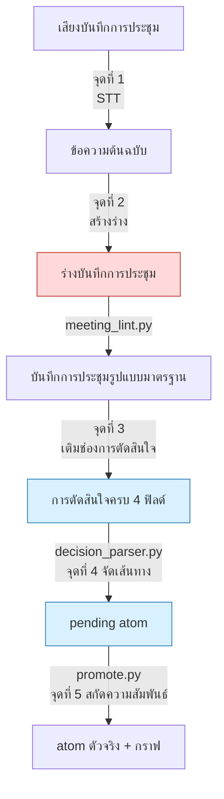
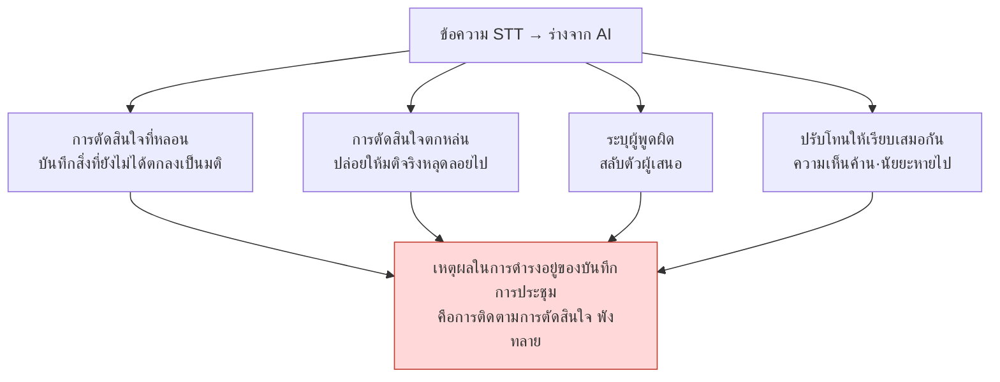

# 17.4 เปลี่ยนบันทึกการประชุมให้เป็นฐานข้อมูลการตัดสินใจ — 5 จุดที่ AI เข้าทำงานอัตโนมัติ

> มื้อกลางวันก่อนเดโมไมล์สโตนสามวัน นักออกแบบเกมคนหนึ่งวางถาดอาหารลงแล้วถามขึ้นมาว่า "เรื่องที่ตกลงว่าจะปรับโกลด์รางวัลเควสต์ขึ้นเป็น 1.5 เท่า อันนั้นเป็นมติจากในที่ประชุมจริงใช่ไหม ใส่ลงในชีตข้อมูลได้เลยไหม" คนข้างๆ ตอบกลับว่า "อันนั้นมันเป็นแค่ที่ใครสักคนเสนอว่าลองทำดูไหมไม่ใช่เหรอ" ไฟล์บันทึกเสียงความยาว 90 นาที กับเมโมสองหน้าที่มีคนพิมพ์ไว้สดๆ ด้วยคีย์บอร์ดนั้นมีอยู่จริงแน่นอน แต่บันทึกเหล่านั้นเก็บไว้แค่ว่า "พูดคุยเรื่องอะไรบ้าง" ไม่ได้เก็บว่า "ตัดสินใจอะไร ใครรับผิดชอบ และทำไมถึงตัดสินใจเช่นนั้น"

ตอนที่ผู้เขียนนำเอกสาร R&D ของบริษัท 17 ฉบับมาเรียงลำดับตามความเจ็บปวด สิ่งที่ครองสัดส่วนใหญ่ที่สุดคือแผนปรับปรุงบันทึกการประชุม ซึ่งเหนือความคาดหมาย มันไม่ใช่การปรับสมดุลการต่อสู้ ไม่ใช่ไปป์ไลน์ผลิตเนื้อหา จุดที่เจ็บที่สุดมีเพียงข้อเดียว นั่นคือการที่มติซึ่งตัดสินใจในที่ประชุมไม่ถูกส่งต่อไปสู่การลงมือทำ

ด้วยเหตุนี้ ผู้เขียนจึงออกแบบระบบบันทึกการประชุมขึ้นใหม่ให้เป็นฐานข้อมูลติดตามการตัดสินใจ แล้วลงมือดำเนินการเองตลอด 6 เดือนเพื่อตรวจสอบว่าควรใส่ AI เข้าไปตรงไหนของกระแสงานนี้ และตรงไหนไม่ควรใส่ บทนี้คือแผนที่ของ 5 จุดนั้น

---

## 17.4.1 5 จุดที่ AI สามารถเข้าทำงานอัตโนมัติได้

ตั้งแต่ไฟล์บันทึกเสียงไปจนถึงการอัปเดตกราฟการตัดสินใจ ตำแหน่งที่สามารถวางผู้ช่วย AI ลงไปได้ตลอดทั้งไปป์ไลน์บันทึกการประชุมมีอยู่พอดี 5 จุด เราไม่ได้ใส่เข้าไปพร้อมกันทั้ง 5 จุด เพราะแต่ละตำแหน่งมีระดับความสุกงอมและความเสี่ยงเชิงความคิดที่แตกต่างกัน



สีแดง (จุดที่ 2) คือตำแหน่งที่น่าดึงดูดที่สุดและอันตรายที่สุดในเวลาเดียวกัน ส่วนสีน้ำเงิน (จุดที่ 3 และ 4) คือตำแหน่งที่ปลอดภัยซึ่งนำมาใช้เป็นลำดับแรกสุด ตรงกลางไปป์ไลน์ที่เป็น `meeting_lint.py` → `decision_parser.py` → `promote.py` นั้นไม่ใช่ AI แต่เป็นสคริปต์เชิงกำหนด (deterministic) AI จะเข้าไปอยู่เฉพาะใน "ช่องว่างที่ต้องใช้การตัดสินใจ" ระหว่างโครงกระดูกเชิงกำหนดเหล่านี้เท่านั้น

หากสรุปลักษณะของแต่ละจุดเป็นบรรทัดเดียว จะได้ดังนี้

- **จุดที่ 1 (STT, Speech-to-Text, เสียง→ข้อความ)**: เสียง → ข้อความ ระดับความสุกงอมสูงสุด ความเสี่ยงต่ำสุด
- **จุดที่ 2 (สร้างร่าง)**: ข้อความ → ร่างบันทึกการประชุม น่าดึงดูดที่สุด เสี่ยงที่สุด
- **จุดที่ 3 (เติมช่องการตัดสินใจ)**: เติมเหตุผลและผลกระทบให้กับการตัดสินใจที่คนประกาศแล้ว ROI (Return on Investment, ผลตอบแทนเทียบกับการลงทุน) อันดับ 1
- **จุดที่ 4 (จัดเส้นทาง atom)**: แนะนำว่าควรส่งการตัดสินใจไปยังโฟลเดอร์ไหน
- **จุดที่ 5 (สกัดความสัมพันธ์)**: อนุมานความสัมพันธ์เชิงพึ่งพาระหว่าง atom โดยอัตโนมัติ เปราะบางต่อความไม่เป็นเชิงกำหนดมากที่สุด

---

## 17.4.2 โครงกระดูกเชิงกำหนด — สร้างช่องให้ AI แทรกเข้ามาก่อน

ก่อนจะพูดถึงการทำงานอัตโนมัติด้วย AI เราต้องดูโครงกระดูกของสคริปต์ที่ไม่ใช่ AI ก่อน เพราะหัวใจของการทำให้บันทึกการประชุมกลายเป็นฐานข้อมูลการตัดสินใจนั้นไม่ได้อยู่ที่ LLM แต่อยู่ที่สคริปต์ Python เล็กๆ สามตัว

บันทึกการประชุมรูปแบบมาตรฐานจะมีบล็อกการตัดสินใจอยู่ตอนท้าย แต่ละการตัดสินใจในบล็อกบังคับให้มีสี่ฟิลด์

```markdown
## Decisions

D1:
  decision: กำหนดคูลดาวน์รวมของการต่อสู้ (GCD) ให้เป็น 0.5 วินาทีเหมือนกันทั้งหมด
  owner: teammate_a
  rationale: ในการทดสอบการต่อสกิล 0.3 วินาทีมักทำให้อินพุตหลุดบ่อย (บันทึกการประชุม 14:22)
  follow_up: สะท้อน GCD 0.5 ลงในชีตออกแบบคอมโบ ภายใน 6/13
```

บล็อกนี้จะถูกอ่านโดย `decision_parser.py` การทำงานหลักนั้นเรียบง่าย — ถ้าหนึ่งในสี่ฟิลด์ว่างแม้แต่ช่องเดียว ก็จะแสดง `[MISSING]` เพื่อรายงาน โดยเฉพาะถ้าไม่มี `owner` การตัดสินใจนั้นจะเป็น "การตัดสินใจที่ไม่มีใครรับผิดชอบ" กล่าวคือเป็นการตัดสินใจที่จะไม่ถูกลงมือทำ จึงถูกขวางกั้นอย่างเข้มงวดที่สุด

```
$ python decision_parser.py 2026-06-06_combat-sync.md

D1: OK   (owner=teammate_a)
D2: [MISSING owner]  "พิจารณายกเว้น GCD สำหรับสกิลฟื้นฟู" — ไม่มี owner, บล็อกการเลื่อนขั้น
D3: [MISSING rationale]  ฟิลด์เหตุผลว่างเปล่า, เตือน
```

D2 ที่ถูกแสดง `[MISSING owner]` ไม่อาจไปได้แม้กระทั่งโฟลเดอร์ `pending` มันจะไม่ถูกนับเป็นการตัดสินใจจนกว่าคนจะเติม owner ลงไป นี่คือกลไกที่ขวางกั้นเชิงโครงสร้างไม่ให้เกิดสภาพ "ประชุมไปแล้วแต่ไม่มีอะไรขับเคลื่อน"

การตัดสินใจที่ผ่านแล้วจะถูก `promote.py` แปลงเป็น `pending atom` และเมื่อคนอนุมัติที่ด่านรีวิวสัปดาห์ละครั้ง ก็จะถูกเลื่อนขั้นเป็น atom ตัวจริง หลักการที่ใช้ในขั้นตอนนี้คือ atom `decision_summary_not_clickup_mirror` (§17.1.2) บอร์ดงานติดตาม "ว่าจะทำอะไร" ส่วนฐานข้อมูลการตัดสินใจติดตาม "ว่าทำไมถึงตัดสินใจเช่นนั้น" ถ้าผสมสองอย่างนี้เข้าด้วยกัน ทั้งสองอย่างจะพังลง

สคริปต์สามตัวนี้คือโครงกระดูก และ AI คือผู้ช่วยที่เติมช่องว่างของโครงกระดูกนี้ ถ้าลำดับกลับหัวกลับหาง — ถ้าให้ AI สร้างโครงกระดูก — อาการหลอน (hallucination) จะทำลายความน่าเชื่อถือของฐานข้อมูลการตัดสินใจลงทั้งหมด

---

## 17.4.3 ตำแหน่งที่อันตรายที่สุด — ทำไมจึงวางจุดที่ 2 ไว้เป็นลำดับสุดท้าย

จุดที่ 2 (สร้างร่างบันทึกการประชุมอัตโนมัติจากข้อความ STT) คือตำแหน่งที่ทุกทีมอยากทำเป็นอันดับแรกสุด เพราะภาพที่ว่า "แค่โยนไฟล์บันทึกเสียงเข้าไป ก็ได้บันทึกการประชุมออกมา" นั้นน่าดึงดูดเกินไป และก็เพราะความน่าดึงดูดนั้นเองที่ทำให้มันล้มเหลวอย่างแพงที่สุด

รูปแบบความล้มเหลวมีสี่อย่าง



ในบรรดานี้ ที่ร้ายแรงที่สุดคือการตัดสินใจที่หลอน ในที่ประชุมมีใครสักคนเพียงแค่เสนอความเห็นว่า "คูลดาวน์รวมเป็น 0.5 วินาทีน่าจะดีกว่าไหม" แต่ร่างจาก AI กลับเขียนลงไปว่า "ตกลงให้คูลดาวน์รวมเป็น 0.5 วินาที" สามสัปดาห์ต่อมา บรรทัดนี้ถูกสะท้อนลงในชีตข้อมูล การออกแบบคอมโบถูกซ้อนทับลงไปบนนั้น และเคส QA ถูกเขียนขึ้น การตัดสินใจที่ไม่เคยมีการตกลงกันถูกส่งต่อไปอย่างย้อนกลับไม่ได้

ด้วยเหตุนี้ จุดที่ 2 จึงมีหลักการเด็ดขาดบังคับใช้

- ร่างจาก AI **ต้องเสมอ** ผ่านการตรวจสอบของผู้ดำเนินการประชุม ไม่มีการ commit อัตโนมัติในทุกกรณี
- AI **ไม่เติม** ช่องการตัดสินใจ AI สรุปแค่วาระและคำพูด ส่วนการมีอยู่ของการตัดสินใจให้คนเป็นผู้ประกาศ
- ข้อความ STT ต้นฉบับให้ **เก็บถาวรแยกต่างหาก** จากบทสรุป ถ้าเหลือไว้แต่บทสรุป เมื่อถึงจุดที่เหตุผลพร่าเลือนลงไปก็จะไม่สามารถตรวจสอบต้นฉบับได้

ไม่ได้หมายความว่าจุดที่ 2 จะ "ไม่ทำไปตลอดกาล" หลังจากที่จุดที่ 3, 4 และ 1 เสถียรแล้ว และผู้ดำเนินการประชุมได้เรียนรู้ขีดจำกัดของผลลัพธ์ AI ด้วยตัวเองแล้ว คุณค่าของการนำจุดที่ 2 มาใช้ก็มีมากพอ เพียงแต่ว่า **ลำดับมันอยู่ท้ายสุด** เท่านั้นเอง

---

## 17.4.4 จุดที่ 3 — ทำไมการเติมช่องการตัดสินใจจึงเป็น ROI อันดับ 1

ตรงนี้คือตำแหน่งที่ให้ผลมากที่สุดในการดำเนินงาน 6 เดือน คนประกาศการมีอยู่ของการตัดสินใจ และ AI เติมฟิลด์ส่วนประกอบของการตัดสินใจนั้น จุดที่ต่างจากจุดที่ 2 อย่างเด็ดขาดคือ **คนตอกหมุดข้อเท็จจริงที่ว่ามีการตัดสินใจอยู่ลงไปก่อน**

สามสิ่งที่ถ้าให้คนเติมด้วยมือเองจะใช้เวลามากเกินไป AI จะร่างให้

- **rationale**: อ้างอิงคำพูดในเนื้อหาการประชุมที่เป็นเหตุผลของการตัดสินใจ
- **affected_atoms**: แนะนำตัวเลือกระบบ·ชีตข้อมูลที่ได้รับผลกระทบ
- **follow_up**: ตัวเลือกแอ็กชันต่อเนื่องซึ่งสืบเนื่องมาจากการตัดสินใจ

หัวใจอยู่ที่การที่พรอมต์ **บังคับให้อ้างอิงเหตุผลและห้ามอาการหลอนอย่างชัดเจน** ต่อไปนี้คือพรอมต์เติมช่องฉบับเต็มที่ใช้ดำเนินการจริง

### บันทึกเซสชันจริง (worked transcript) — การเติมช่องการตัดสินใจ

**พรอมต์ (คนป้อน):**

```
ดูเนื้อหาการประชุมด้านล่าง แล้วเติมเฉพาะสี่ช่องคือ
owner / rationale / affected_atoms / follow_up ของการตัดสินใจ D1 ("กำหนดคูลดาวน์รวมของการต่อสู้ให้เป็น 0.5 วินาทีเหมือนกัน") ที่ผู้ดำเนินการประชุมประกาศไว้
อย่าสร้างการตัดสินใจขึ้นมาใหม่ rationale ให้อ้างอิงคำพูดในเนื้อหาพร้อม timestamp ตามตรง
ช่องที่ไม่มีเหตุผลรองรับ อย่าเดา ให้เขียนว่า "ไม่มีเหตุผลรองรับ"
// (เจตนา: affected_atoms เอาเฉพาะระบบ·ชีตที่ถูกกล่าวถึงในเนื้อหา สูงสุด 3 รายการ)

[เนื้อหาการประชุม]
(14:18) teammate_a: ตอนนี้ GCD อยู่ที่ 0.3 วินาที พอกดสกิลรัวๆ อินพุตมันชอบหลุดอยู่เรื่อย
(14:22) teammate_b: เมื่อวานในการทดสอบคอมโบเองก็มีเคสที่ 0.3 วินาทีแล้วสกิลตัวที่สอง
        ไม่ออก ประมาณ 30 เปอร์เซ็นต์ ผมเก็บล็อกไว้แล้ว
(14:25) teammate_a: งั้นเพิ่มเป็น 0.5 วินาทีเลยครับ เดี๋ยวผมไปสะท้อนในชีตคอมโบเอง
(14:26) ผู้ดำเนินการประชุม: เอา 0.5 วินาที เป็นมติ
(14:31) teammate_c: ถ้าใช้ GCD กับสกิลฟื้นฟูด้วย เวลาฉุกเฉินจะใช้ไม่ได้ ตรงนั้นจะทำยังไง...
(14:33) ผู้ดำเนินการประชุม: อันนั้นไว้ดูแยกต่างหากคราวหน้า
```

**ผลลัพธ์จาก Claude (ดิบตามต้นฉบับ):**

```
1. owner: teammate_a
   เหตุผล: (14:25) "เดี๋ยวผมไปสะท้อนในชีตคอมโบเอง" — teammate_a
   ระบุว่าเป็นความรับผิดชอบของตนเอง

2. rationale:
   - (14:18) teammate_a: "GCD 0.3 วินาที พอกดสกิลรัวๆ อินพุตหลุด"
   - (14:22) teammate_b: "ในการทดสอบคอมโบ 0.3 วินาทีมีเคสสกิลตัวที่สองไม่ออก
     ประมาณ 30% เก็บล็อกไว้"
   → ปัญหาอินพุตหลุดที่ 0.3 วินาทีเป็นเหตุผลโดยตรงของการตัดสินใจ 0.5 วินาที

3. affected_atoms (ตัวเลือกจากการกล่าวถึงในเนื้อหา):
   - atoms/combat/global_cooldown
   - ชีตออกแบบคอมโบ (เนื้อหา 14:25 กล่าวถึง "ชีตคอมโบ")
   - atoms/combat/skill_recovery  ← แต่ที่ (14:31) การยกเว้น GCD ของสกิลฟื้นฟู
     ถูก "เลื่อนไปคราวหน้า" (14:33) ยังไม่แน่ใจว่าจะรวมไว้ในขอบเขตผลกระทบ
     ของการตัดสินใจนี้หรือไม่ เหตุผลอ่อน ต้องให้คนยืนยัน

4. follow_up:
   - teammate_a: สะท้อน GCD 0.5 วินาที ลงในชีตออกแบบคอมโบ
   - [วาระแยกต่างหาก] เรื่องการยกเว้น GCD ของสกิลฟื้นฟูอยู่นอกขอบเขตการตัดสินใจนี้
     แยกเป็นวาระของการประชุมครั้งถัดไป (คำพูดผู้ดำเนินการ 14:33)
```

**การตรวจสอบ/ปฏิเสธของคน:**

ผู้ดำเนินการประชุมตรวจสอบผลลัพธ์ owner และ rationale มีการอ้างอิงถูกต้องจึงรับมาใช้ตามนั้น ส่วนตัวเลือกตัวที่สาม `skill_recovery` ของ `affected_atoms` นั้น AI รายงานเองว่า "เหตุผลอ่อน ต้องให้คนยืนยัน" และด้วยดุลพินิจของผู้ดำเนินการประชุม จึงถูก **ตัดออก** จากขอบเขตผลกระทบของการตัดสินใจนี้ — การยกเว้นของสกิลฟื้นฟูเป็นเรื่องที่จะกลายเป็นการตัดสินใจแยกต่างหาก ไม่ใช่ผลกระทบของ D1 ครั้งนี้ ส่วนข้อเสนอ "แยกเป็นวาระต่างหาก" ของ follow_up ก็รับมาใช้แล้วลงทะเบียนเป็นวาระของการประชุมครั้งถัดไป

สิ่งสำคัญตรงนี้คือ AI ไม่ได้ดันรายการที่ไม่แน่ใจให้ผ่านด้วยอาการหลอน แต่ **รายงานความไม่แน่นอนด้วยตัวเอง** ข้อจำกัดของพรอมต์ที่ว่า "ห้ามเดา·ห้ามหลอน ถ้าไม่มีเหตุผลรองรับให้ระบุว่าไม่มีเหตุผลรองรับ" คือสิ่งที่สร้างผลลัพธ์อันซื่อตรงนี้ขึ้นมา ถ้าถอดข้อจำกัดออก AI จะใส่ `skill_recovery` ลงใน affected_atoms อย่างมั่นใจ และอาการหลอนนั้นก็จะถูกส่งต่อไปสู่กราฟ

บล็อกการตัดสินใจที่ตรวจสอบเสร็จแล้วจะผ่าน `decision_parser.py` ไปได้ — เพราะทั้งสี่ฟิลด์ถูกเติมครบ จึงไม่มี `[MISSING]` — และส่งต่อไปเป็น `pending atom`

---

## 17.4.5 จุดที่ 4 — การจัดเส้นทาง atom และจุดที่ 5 — การสกัดความสัมพันธ์

เมื่อ pending atom ที่ผ่านจุดที่ 3 จะถูกเลื่อนขั้นไปยังโฟลเดอร์ตัวจริง AI จะแนะนำว่าควรส่งไปยังโฟลเดอร์ไหน (จุดที่ 4)

```
ช่วยเลือกว่าควรใส่ atom นี้ ("กำหนดคูลดาวน์รวมของการต่อสู้เป็น 0.5 วินาทีเหมือนกัน / owner teammate_a")
ลงในโฟลเดอร์ไหนด้านล่าง โดยเรียงลำดับความสำคัญสูงสุด 3 รายการ อย่าเสนอให้สร้างโฟลเดอร์ใหม่
ให้เลือกเฉพาะภายในรายการนี้เท่านั้น
- atoms/combat/  atoms/character/  atoms/operations/  atoms/visual/
```

"ห้ามสร้างโฟลเดอร์ใหม่" คือข้อจำกัดหลัก ถ้าถอดอันนี้ออก AI จะเสนอโฟลเดอร์อย่าง `atoms/combat_timing/`, `atoms/gcd_rules/` ไม่รู้จบ ทำให้หมวดหมู่เพิ่มทวีคูณอย่างไร้ขีดจำกัด จนการค้นหาและการแทรกอัตโนมัติพังลง หลักการคือต้องรักษาหมวดหมู่ให้เล็กและตั้งฉากกัน (orthogonal) และคงที่ไม่เปลี่ยนแปลงนานกว่าหนึ่งปี AI เลือกได้เฉพาะภายในรายการปิดนั้นเท่านั้น

จุดที่ 5 (การสกัดความสัมพันธ์ระหว่าง atom) เป็นจุดที่นำมาใช้ช้าที่สุดและรอบคอบที่สุด เป็นตำแหน่งที่อนุมานความสัมพันธ์เชิงพึ่งพาระหว่าง atom ที่ถูกเลื่อนขั้นแล้ว

```
atom ใหม่ A: "สกิลฟื้นฟูได้รับการยกเว้นไม่ใช้คูลดาวน์รวม"
atom เดิม B: "กำหนดคูลดาวน์รวมเป็น 0.5 วินาทีเหมือนกัน"

ความสัมพันธ์ที่อนุมานได้:
  A.exception_of: [B]
  A.derives_from: [B]
  B.affects: [A]   ← กำหนดทิศย้อนกลับโดยอัตโนมัติ
```

ปัญหาคือการอนุมานนี้เผชิญหน้าโดยตรงกับความไม่เป็นเชิงกำหนดของ LLM อินพุตเดียวกันแต่เมื่อวานกับวันนี้ให้ความสัมพันธ์ต่างกัน กลไกบรรเทามีสามอย่าง — ตั้ง `temperature=0` และล็อก seed ในโมเดลที่ทำได้, ด่านตรวจสอบที่เสนอตัวเลือกแล้วให้คนอนุมัติ, และวิธีที่สกัดเฉพาะทิศทางเดียวก่อน แล้วทิศย้อนกลับให้สคริปต์ปรับชดเชยเชิงกำหนด เพราะถ้ายกทั้งสองทิศให้ LLM ทำ จะมีฝั่งใดฝั่งหนึ่งตกหล่นไป

---

## 17.4.6 ครั้งละ 1\~2 จุด — ลำดับการนำมาใช้คือกลไกความปลอดภัยในตัว

การเปิด 5 จุดพร้อมกันคือความล้มเหลวที่พบบ่อยที่สุดและแพงที่สุด ภาระการดำเนินงานมาถึงก่อนผลลัพธ์ จนทีมทิ้งทั้งระบบไปทั้งหมด ต่อไปนี้คือลำดับที่ทำตามจริง

<svg viewBox="0 0 720 240" xmlns="http://www.w3.org/2000/svg" font-family="sans-serif" font-size="13">
  <line x1="40" y1="40" x2="40" y2="210" stroke="#999" stroke-width="2"/>
  <!-- step 1 -->
  <circle cx="40" cy="50" r="7" fill="#2980b9"/>
  <text x="60" y="48" font-weight="bold">ขั้นที่ 1 · จุดที่ 3 เติมช่องการตัดสินใจ</text>
  <text x="60" y="66" fill="#666">1~2 เดือน · เริ่มจาก ROI อันดับ 1 ความเสี่ยงต่ำสุด</text>
  <!-- step 2 -->
  <circle cx="40" cy="95" r="7" fill="#2980b9"/>
  <text x="60" y="93" font-weight="bold">ขั้นที่ 2 · จุดที่ 4 แนะนำการจัดเส้นทาง atom</text>
  <text x="60" y="111" fill="#666">เพิ่มอีก 1 เดือน · บังคับรายการปิดของโฟลเดอร์ตัวเลือก</text>
  <!-- step 3 -->
  <circle cx="40" cy="140" r="7" fill="#27ae60"/>
  <text x="60" y="138" font-weight="bold">ขั้นที่ 3 · จุดที่ 1 STT</text>
  <text x="60" y="156" fill="#666">เมื่อโครงสร้างพื้นฐานแบบโฮสต์เอง (self-hosted) ลงตัว · เลี่ยง API ภายนอกด้วยเหตุผลด้านความปลอดภัย</text>
  <!-- step 4 -->
  <circle cx="40" cy="185" r="7" fill="#c0392b"/>
  <text x="60" y="183" font-weight="bold">ขั้นที่ 4 · จุดที่ 2 ร่างบันทึกการประชุม</text>
  <text x="60" y="201" fill="#666">หลัง 3 จุดข้างบนเสถียร, รอบคอบที่สุด · ห้าม commit อัตโนมัติเด็ดขาด</text>
  <!-- step 5 -->
  <circle cx="40" cy="225" r="7" fill="#8e44ad"/>
  <text x="60" y="223" font-weight="bold">ขั้นที่ 5 · จุดที่ 5 สกัดความสัมพันธ์</text>
</svg>

การวางจุดที่ 2 ไว้ช้าที่สุดคือหัวใจของลำดับนี้ ทำตำแหน่งที่อยากทำที่สุดเป็นอันดับสุดท้าย — แม้จะขัดกับสัญชาตญาณ แต่การจัดให้มือที่ชำนาญที่สุดไปอยู่ที่ด่านตรวจสอบที่อันตรายที่สุด คือหลักความปลอดภัยของสถานที่ทำงาน

ในแง่ต้นทุนเองลำดับนี้ก็สมเหตุสมผล ในเกณฑ์การประชุม 100 ครั้ง/เดือน จุดที่ 3 อยู่ที่ราว $5\~10 จุดที่ 4 อยู่ที่ระดับ $1\~2 (ประมาณการจากสภาพแวดล้อมการดำเนินงานของผู้เขียน ยังไม่ได้ตรวจสอบ) ดังนั้น **แค่เปิดสองจุดก็ต่ำกว่า $10 ต่อเดือน** สองตำแหน่งที่ให้ผลมากที่สุดคือสองตำแหน่งที่ถูกที่สุด

---

## 17.4.7 before / after — การประชุมเดียวกัน บันทึกการประชุมสองแบบ

ความแตกต่างเมื่อบันทึกการประชุมเดียวกันด้วยสองวิธีคือบทสรุปของทั้งบทนี้

**Before — บันทึกการประชุมแบบบรรยายอิสระ (ไม่มี AI หรือกรณีที่ยกจุดที่ 2 ให้ทำถึงช่องการตัดสินใจ):**

```markdown
## ประชุมซิงค์การต่อสู้ 2026-06-06

มีการพูดคุยเรื่อง GCD มีความเห็นว่า 0.3 วินาทีสั้นเกินไป
บอกว่าในการทดสอบคอมโบมีปัญหา มีการพูดถึง 0.5 วินาที
มีการกล่าวถึงการยกเว้นสกิลฟื้นฟูสั้นๆ ด้วย
บรรยากาศโดยรวมเป็นไปในทิศทาง 0.5 วินาที
```

สามสัปดาห์ต่อมา เมื่อเปิดบันทึกการประชุมนี้ขึ้นมาอีกครั้ง **ไม่มีใครกู้คืนได้** ว่า "บรรยากาศที่เป็นไปในทิศทาง 0.5 วินาที" นั้นเป็นมติหรือเป็นความเห็น ใครรับเอาไปสะท้อนในชีต การยกเว้นสกิลฟื้นฟูถูกตัดสินใจแล้วหรือถูกเลื่อนไป ไม่มีตัวผู้พูด ไม่มี owner และเหตุผลก็อยู่ตรงไหนสักแห่งในเนื้อหา ต้องกลับไปฟังบันทึกเสียงอีกครั้ง

**After — บันทึกการประชุมแบบช่องการตัดสินใจ + เติมด้วยจุดที่ 3:**

```markdown
## ประชุมซิงค์การต่อสู้ 2026-06-06

### สรุปวาระ (ผู้ช่วย AI)
- ปัญหาอินพุตหลุดของคูลดาวน์รวมของการต่อสู้ (GCD) ที่ 0.3 วินาที
- เรื่องการยกเว้น GCD ของสกิลฟื้นฟู (แยกเป็นวาระต่างหาก)

### Decisions  (คนประกาศ + AI เติม)
D1:
  decision: กำหนดคูลดาวน์รวมของการต่อสู้ให้เป็น 0.5 วินาทีเหมือนกันทั้งหมด
  owner: teammate_a
  rationale: |
    - (14:18) teammate_a: 0.3 วินาที พอกดสกิลรัวๆ อินพุตหลุด
    - (14:22) teammate_b: ทดสอบคอมโบ 0.3 วินาที สกิลตัวที่สองไม่ออก ~30%, มีล็อก
  follow_up: teammate_a — สะท้อน GCD 0.5 วินาที ลงในชีตออกแบบคอมโบ (ภายใน 6/13)
  affected_atoms: [atoms/combat/global_cooldown, ชีตออกแบบคอมโบ]

### วาระที่แยกออกมา
- การยกเว้น GCD ของสกิลฟื้นฟู → การประชุมครั้งถัดไป (มติผู้ดำเนินการ 14:33)
```

สามสัปดาห์ต่อมา บันทึกการประชุมนี้ถูก `decision_parser.py` อ่านและเชื่อมเข้ากับกราฟแล้ว และใครก็ตามที่ถามว่า "ทำไมถึง 0.5 วินาที" ก็สามารถตอบได้ทันทีด้วยคำอ้างอิงสองบรรทัดของ rationale เนื่องจาก owner ถูกระบุไว้ จึงติดตามได้ว่า follow_up ถูกลงมือทำหรือยัง และยังรักษาข้อเท็จจริงที่ว่าการยกเว้นสกิลฟื้นฟู **ไม่ใช่มติ แต่เป็นวาระที่ถูกเลื่อนไป** เอาไว้ด้วย

สิ่งที่สร้างความแตกต่างไม่ใช่ปริมาณงานของ AI แต่เป็น **โครงสร้างที่รักษาตำแหน่งที่คนประกาศการตัดสินใจเอาไว้ แล้วยกให้ AI ทำแค่การเติมเหตุผล** ในบันทึกการประชุม After ข้างต้น ถ้าลบย่อหน้าที่ AI เติมทั้งหมด (สรุปวาระ, การอ้างอิง rationale, ตัวเลือก affected_atoms) ออกไป สิ่งที่เหลือคือการตัดสินใจหนึ่งบรรทัดกับ owner เท่านั้น — ปริมาณข้อมูลของบันทึกการประชุมกว่าครึ่งหนึ่งมาจากการเติมของ AI แต่หัวใจอยู่ที่ว่าครึ่งหนึ่งนั้นทั้งหมดเป็นการอ้างอิงเหตุผลที่ผ่านการตรวจสอบโดยมนุษย์แล้ว

---

## สรุปประเด็นสำคัญของบท

- สร้างโครงกระดูกเชิงกำหนดของบันทึกการประชุม (meeting_lint → decision_parser → promote) ขึ้นก่อน แล้ว AI เติมแค่ช่องว่างในรอยต่อนั้น
- การมีอยู่ของการตัดสินใจให้คนประกาศ และ AI เติมแค่เหตุผล·owner·ผลกระทบ — การสร้างการตัดสินใจอัตโนมัติของจุดที่ 2 จะนำมาซึ่งอาการหลอนที่ย้อนกลับไม่ได้
- อย่าเปิด 5 จุดพร้อมกัน เริ่มจากจุดที่ 3 และ 4 ครั้งละ 1\~2 จุด และนำจุดที่ 2 ซึ่งน่าดึงดูดที่สุดมาใช้ช้าที่สุด

---

> **การประยุกต์นอกเกม** หลักการที่ว่า "การมีอยู่ของการตัดสินใจให้คนประกาศ และ AI เติมแค่เหตุผล·ผู้รับผิดชอบ·ผลกระทบ" ไม่ใช่เรื่องของเกม แต่เป็นเส้นความปลอดภัยที่ใช้ได้ตรงๆ กับคนทำงานทุกคนที่จัดระเบียบบันทึกเสียงด้วย AI เหตุผลที่ตำแหน่งซึ่งน่าดึงดูดที่สุด (สร้างบันทึกการประชุมอัตโนมัติจากบันทึกเสียงทั้งก้อน) เป็นตำแหน่งที่อันตรายที่สุด ก็เพราะอาการหลอนที่ AI แปลงความเห็นที่ว่า "0.5 วินาทีน่าจะดีกว่าไหม" ให้กลายเป็นการตัดสินใจที่ว่า "ตกลง 0.5 วินาที" ยกตัวอย่างเช่น เมื่อฝ่ายบุคคลจัดระเบียบบันทึกเสียงการประชุมประเมินผล ให้ผู้ดำเนินการประชุมตอกหมุดเฉพาะการตัดสินใจที่ว่า "ยืนยันเป็นเกรด B" ด้วยตัวเอง ส่วน AI ให้สั่งแค่ว่า "ช่วยอ้างอิงคำพูดที่เป็นเหตุผลของเกรดนี้จากบันทึกเสียง ถ้าไม่มีให้บอกว่าไม่มี" เท่านั้น ถ้าปล่อยให้ AI สร้างการตัดสินใจ การประเมินที่ไม่เคยมีการตกลงกันจะหลงเหลืออยู่ในประวัติบุคคลอย่างย้อนกลับไม่ได้

---

## ลองทำดู

**setup**
1. สร้างบล็อก `## Decisions` ในรูปแบบมาตรฐานของบันทึกการประชุม และบังคับให้แต่ละการตัดสินใจมี 4 ฟิลด์คือ `decision / owner / rationale / follow_up`
2. เขียน `decision_parser.py` — ถ้าหนึ่งในสี่ฟิลด์ว่างแม้แต่ช่องเดียวให้แสดง `[MISSING <ฟิลด์>]` และโดยเฉพาะถ้า `owner` ว่างให้ขวางกั้นการเลื่อนขั้น
3. กำหนดเป็นกฎไว้ให้ชัดเจน (`decision_summary_not_clickup_mirror`) ว่าบทสรุปการตัดสินใจไม่ใช่กระจกเงาของบอร์ดงาน แต่เป็นทรัพย์สินอิสระที่บรรจุ "ทำไม"

**prompt**
4. เขียนพรอมต์เติมช่องของจุดที่ 3 ข้อจำกัดที่ต้องใส่ให้ครบ: "ห้ามสร้างการตัดสินใจขึ้นมาใหม่ / อ้างอิงเหตุผลในเนื้อหาพร้อม timestamp / ถ้าไม่มีเหตุผลรองรับให้ระบุว่า 'ไม่มีเหตุผลรองรับ' / ห้ามเดา·ห้ามหลอน" โดยเรียกร้องสี่ช่องคือ rationale·owner·affected_atoms·follow_up
5. ในพรอมต์จัดเส้นทางของจุดที่ 4 ให้ใส่ "ห้ามสร้างโฟลเดอร์ใหม่ที่ไม่อยู่ในรายการ + รายการโฟลเดอร์แบบปิด"

**verify**
6. รันบล็อกการตัดสินใจที่เติมแล้วผ่าน `decision_parser.py` เพื่อยืนยันว่าไม่มี `[MISSING]`
7. ให้คนตรวจสอบรายการที่ถูกรายงานว่า "เหตุผลอ่อน" ในบรรดา affected_atoms ที่ AI เติม แล้วตัดออก/รับเข้าด้วยตัวเอง ไม่ทำ commit อัตโนมัติในทุกกรณี

**ฉบับย่อสำหรับคนเดียว**
ถ้าทำงานคนเดียวหรือไม่มีเวลาติดตั้งเครื่องมือ ก็แค่เขียนบล็อกการตัดสินใจสี่บรรทัด (`การตัดสินใจ / ผู้รับผิดชอบ / เหตุผล / แอ็กชันถัดไป`) ด้วยมือไว้ท้ายบันทึกการประชุม โดยไม่ต้องมีสคริปต์ก็ได้ แม้ owner จะเป็นตัวคุณเองก็เขียนชื่อลงไป ส่วน AI ให้สั่งแค่ว่า "ช่วยอ้างอิงเหตุผลของการตัดสินใจนี้จากเมโมการประชุม ถ้าไม่มีให้บอกว่าไม่มี" แม้จะไม่มีไปป์ไลน์ เพียงแค่สองอย่างคือ **ตำแหน่งที่ประกาศการตัดสินใจ กับพรอมต์ที่บังคับให้อ้างอิงเหตุผล** บันทึกการประชุมก็จะเริ่มกลายเป็นฐานข้อมูลการตัดสินใจ
