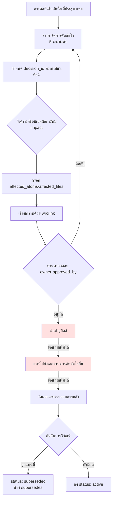

# 18.1 ระบบติดตามการตัดสินใจ

เหตุการณ์เกิดขึ้นกลางการประชุมรายไตรมาส ดีไซเนอร์ฝ่ายต่อสู้เสนอว่า "เรามากำหนด global cooldown ให้เป็น 0.5 วินาทีเหมือนกันทั้งหมดเถอะ" ทุกคนพยักหน้าเห็นด้วย แต่แล้วซีเนียร์ที่นั่งข้าง ๆ ก็ยกมือขึ้น "อันนี้มันขัดกับที่เราตัดสินใจไว้เป็น 0.3 วินาทีในไตรมาส 4 ปีที่แล้วไม่ใช่เหรอ ตอนนั้นทำไมถึงเลือก 0.3 วินาทีนะ" ห้องประชุมเงียบไปครู่หนึ่ง ไม่มีใครจำเหตุผลของการตัดสินใจครั้งนั้นได้เลย ค้นบันทึกการประชุมแล้วก็เจอแค่บรรทัดเดียวว่า "หารือใน TF ฝ่ายต่อสู้" สุดท้ายต้องใช้เวลา 30 นาทีไปกับการรื้อฟื้นการตัดสินใจของปีที่แล้ว และถึงอย่างนั้นก็ยังหาคำตอบไม่ได้ว่า "ทำไมถึงเป็น 0.3"

การตัดสินใจนั้นติดตามยากกว่าตัดสินใจ เมื่อมีการตัดสินใจสะสมหลายร้อยครั้งต่อปี สมองของคนเราก็ตามไม่ทันว่าการตัดสินใจไหนยังมีผล อันไหนถูกยกเลิกไปแล้ว และอันไหนวางอยู่บนสมมติฐานของอีกอันหนึ่ง บทนี้ว่าด้วยระบบที่เปลี่ยนการตัดสินใจให้กลายเป็น atom ที่ตรึงไว้เป็นสินทรัพย์ซึ่งติดตามได้ แก่นของมันเรียบง่าย คือบันทึกการตัดสินใจหนึ่งครั้งเป็นการ์ดที่มี `decision_id`·`owner`·`rationale` แล้วเชื่อมการ์ดเข้าด้วยกันด้วย wikilink เพื่อสร้างกราฟ จากนั้นใช้ grep ย้อนรอยว่าผลกระทบแผ่ขยายไปถึงไหน

## 18.1.1 การ์ดการตัดสินใจ: การตรึงเป็น atom

หน่วยที่เล็กที่สุดของการติดตามการตัดสินใจคือการ์ดการตัดสินใจ (decision card) ผู้เขียนนำการ์ดหนึ่งใบที่ใช้งานจริงในโปรเจกต์ A (การพัฒนา MMORPG) ซึ่งผู้เขียนดูแลอยู่มาให้ดูตามต้นฉบับ นี่คือการตัดสินใจกำหนด 0.5 วินาทีเหมือนกันทั้งหมดที่เกิดความขัดแย้งในการประชุมข้างต้นนั่นเอง

```yaml
---
decision_id: D2026_Q2_017
title: กำหนด global cooldown ฝ่ายต่อสู้ให้เป็น 0.5 วินาทีเหมือนกันทั้งหมด
type: system_change
status: active        # active / superseded / deprecated
created: 2026-04-18
owner: teammate_a      # ดีไซเนอร์ฝ่ายต่อสู้ ผู้เสนอและเจ้าของการตัดสินใจ
approved_by: 이민수    # Design Director
approval_meeting: 95_BattleTF_2026-04-18

scope:
  - combat_system
  - all_active_skills

content: |
  ใช้ global cooldown 0.5 วินาทีกับสกิลแอ็กทีฟฝ่ายต่อสู้ทั้งหมด
  สกิลฟื้นฟูเป็นข้อยกเว้น (การตัดสินใจแยกต่างหาก D2026_Q2_018)

rationale:
  - ปัญหาความอ่านง่ายของการป้อนคอมโบ (ฟีดแบ็กผู้ใช้สะสม)
  - ทิศทางที่ทำให้ความยาวเฉลี่ยของการต่อสู้ในซิมเพิ่มขึ้น
  - ทำให้เส้นโค้งการเรียนรู้ของผู้ใช้ใหม่ราบเรียบขึ้น

affected_atoms:
  - combat_global_cooldown_constant
  - combat_skill_cooldown_rule

affected_files:
  - CombatBalance.xlsx
  - CombatFormula_v3.md
  - UI/skill_cooldown_indicator

implementation:
  target_build: 2026-05-09
  impl_owner: teammate_b    # หัวหน้าทีมโค้ด
  qa_owner: teammate_c      # QA ซีเนียร์

related_decisions:
  - supersedes: D2025_Q4_034   # การตัดสินใจ 0.3 วินาทีครั้งก่อน
  - relates_to: D2026_Q2_018   # ข้อยกเว้นสกิลฟื้นฟู
---
```

สามช่องคือกระดูกสันหลัง `decision_id` ให้ที่อยู่ถาวรแก่การตัดสินใจ `owner` ตรึงไว้ว่า "ใครเป็นผู้รับผิดชอบการตัดสินใจนี้" ส่วน `rationale` ตอบคำถาม "ทำไมถึงทำแบบนั้นนะ" เมื่อผ่านไป 6 เดือน คำตอบของ "ทำไมถึงเป็น 0.3" ที่หาไม่เจอในที่ประชุม ก็คือเนื้อหาที่ควรจะอยู่ในช่อง `rationale` ของ `D2025_Q4_034` นั่นเอง ส่วนช่องที่เหลือ (`scope`·`affected_atoms`·`related_decisions`) คือสายไฟสำหรับการติดตามผลกระทบและการเชื่อมต่อกราฟ

ตรงนี้มีการออกแบบการตัดสินใจอย่างหนึ่งสอดแทรกอยู่ ถ้าบังคับให้กรอกครบทั้ง 12 ช่อง คนก็จะเลี่ยงการเขียนการ์ดเสียเอง จึงแบ่งเป็น 5 ช่องบังคับ (`decision_id`·`title`·`owner`·`status`·`rationale`) กับ 7 ช่องเลือกได้ แม้กรอกแค่ 5 ช่องทันทีหลังตัดสินใจในที่ประชุม การ์ดก็มีผลแล้ว ส่วนที่เหลือค่อยกรอกในขั้นตอนการพัฒนา

## 18.1.2 ภาพรวมทั้งหมดของการติดตามการตัดสินใจ

โครงของระบบติดตามอยู่ที่ว่าการ์ดหนึ่งใบเดินทางตามเส้นทางใดตั้งแต่เกิดจนถึงถูกยกเลิก ลองสังเกตว่าด่านที่ย้อนกลับไม่ได้อยู่ตรงไหน



ตั้งแต่การร่าง (B) ไปจนถึงด่านตรวจสอบ (G) ล้วนเป็นขั้นที่ย้อนกลับได้ ไม่ว่าจะแก้การ์ดหรือยกเลิกก็แทบไม่มีต้นทุน แต่หลังจากนำเข้าสู่บิลด์ (H) แล้วถือเป็นการย้อนกลับไม่ได้ในทางปฏิบัติ การเปลี่ยนแปลงที่ผู้ใช้สัมผัสไปแล้ว ต่อให้ย้อนคืนด้วย hotfix ก็ยังทิ้งร่องรอยไว้ในการรับรู้ของชุมชน และเมื่อการตัดสินใจที่ตามมาเริ่มสะสมตัวบนสมมติฐานของการตัดสินใจนี้ ต้นทุนการย้อนกลับก็จะพุ่งสูงแบบทวีคูณ ดังนั้นการตรวจสอบทั้งหมดของผู้ตัดสินใจต้องจบที่ด่าน G นี่คือโครงสร้างเดียวกันเป๊ะกับหลักการ "การอัดเสียงและการแคสติงเป็นขั้นที่ย้อนกลับไม่ได้" ที่กล่าวถึงในส่วนที่ 5

## 18.1.3 กราฟการตัดสินใจ: เชื่อมการ์ดเข้าด้วยกัน

เมื่อทำให้การ์ดเป็น atom เราก็เชื่อมการ์ดเข้าด้วยกันได้ `supersedes`·`relates_to` ใน `related_decisions` กลายเป็นเส้นเชื่อม (edge) ของกราฟ ความขัดแย้งในการประชุมข้างต้นที่จริงก็เป็นเสี้ยวหนึ่งของกราฟนี้

<svg viewBox="0 0 640 280" xmlns="http://www.w3.org/2000/svg" font-family="sans-serif" font-size="13">
  <defs>
    <marker id="arrow" markerWidth="10" markerHeight="10" refX="9" refY="3" orient="auto" markerUnits="strokeWidth">
      <path d="M0,0 L9,3 L0,6 Z" fill="#555"/>
    </marker>
  </defs>
  <!-- nodes -->
  <rect x="40" y="20" width="220" height="48" rx="6" fill="#eef2f8" stroke="#888"/>
  <text x="150" y="40" text-anchor="middle" fill="#333">D2025_Q4_034</text>
  <text x="150" y="58" text-anchor="middle" fill="#777" font-size="11">global cooldown 0.3 วินาที (deprecated)</text>

  <rect x="40" y="116" width="220" height="48" rx="6" fill="#dff0df" stroke="#5a5"/>
  <text x="150" y="136" text-anchor="middle" fill="#333">D2026_Q2_017</text>
  <text x="150" y="154" text-anchor="middle" fill="#777" font-size="11">global cooldown 0.5 วินาที (active)</text>

  <rect x="380" y="116" width="220" height="48" rx="6" fill="#dff0df" stroke="#5a5"/>
  <text x="490" y="136" text-anchor="middle" fill="#333">D2026_Q2_018</text>
  <text x="490" y="154" text-anchor="middle" fill="#777" font-size="11">ข้อยกเว้น cooldown สกิลฟื้นฟู (active)</text>

  <rect x="380" y="212" width="220" height="48" rx="6" fill="#fdf3df" stroke="#cb5"/>
  <text x="490" y="232" text-anchor="middle" fill="#333">D2026_Q2_025</text>
  <text x="490" y="250" text-anchor="middle" fill="#777" font-size="11">global cooldown แบบ PvP (active)</text>

  <!-- edges -->
  <line x1="150" y1="68" x2="150" y2="116" stroke="#555" marker-end="url(#arrow)"/>
  <text x="160" y="96" fill="#555" font-size="11">supersedes</text>

  <line x1="260" y1="140" x2="380" y2="140" stroke="#555" marker-end="url(#arrow)"/>
  <text x="285" y="132" fill="#555" font-size="11">relates_to</text>

  <line x1="490" y1="164" x2="490" y2="212" stroke="#555" marker-end="url(#arrow)"/>
  <text x="500" y="192" fill="#555" font-size="11">relates_to</text>
</svg>

ถ้ามีกราฟนี้ การประชุมคงจบใน 30 วินาที เมื่อเปิด `D2026_Q2_017` ก็จะเห็น `supersedes: D2025_Q4_034` แล้วคลิกที่ `rationale` ของการ์ดนั้นหนึ่งครั้ง "ทำไมถึงเป็น 0.3" ก็ปรากฏออกมาทันที กราฟคือประวัติการวิวัฒน์ของการตัดสินใจ และประวัติการวิวัฒน์ของการตัดสินใจก็คือประวัติศาสตร์ของเกมนั่นเอง แม้แต่สาขาที่แตกออกมาจากการตัดสินใจหลักอย่างแบบ PvP (`D2026_Q2_025`) ก็ติดตามได้ในพริบตา

## 18.1.4 ดึงขอบเขตผลกระทบออกมาโดยอัตโนมัติ — impact

ถ้าให้คนกรอก `affected_atoms`·`affected_files` ของการ์ดการตัดสินใจทีละช่องเอง ก็มีหลุด ในโปรเจกต์ A มีกระบวนการดึงขอบเขตผลกระทบชื่อ `impact` ซึ่งรับ atom การตัดสินใจเข้ามาแล้วไล่กราฟไปสามทิศทาง

- **เส้นเชื่อมขาเข้า (inbound edge)**: atom อื่น ๆ ที่อ้างอิงถึง atom นี้ (ใครพึ่งพิงเราบ้าง)
- **ลิงก์ `affects` ในออนโทโลยี**: ความสัมพันธ์ที่ประกาศไว้อย่างชัดเจนว่า "ส่งผลกระทบให้"
- **การอ้างย้อนกลับของ wikilink**: เอกสารทุกฉบับที่อ้างอิง `[[combat_global_cooldown_constant]]` ในเนื้อความ

ยูเนียน (union) ของทั้งสามเส้นทางคือขอบเขตผลกระทบที่แท้จริงของการตัดสินใจ นอกจากนี้ atom `portal_layer_change_impact_check` ยังตรวจสอบแยกต่างหากว่า "ไปแตะพอร์ทัลเลเยอร์ (เอกสารที่เปิดสู่ภายนอก·สเปก API) หรือไม่" ถ้าติดพอร์ทัลเลเยอร์ ระดับก็จะถูกยกขึ้นหนึ่งขั้น เพราะการแพร่ออกสู่ภายนอกย้อนกลับได้ในราคาที่แพงกว่า

## 18.1.5 บันทึกเซสชันจริง: จากบันทึกการประชุมสู่การ์ดการตัดสินใจ

ทฤษฎีมีแค่นี้ ผู้เขียนจะแสดงทั้งกระบวนการของการโยนบันทึกการประชุมก้อนหนึ่งให้ LLM จริง ๆ แล้วรับการ์ดการตัดสินใจกลับมา โดยใส่ทั้งพรอมต์ฉบับเต็มและผลลัพธ์ดิบไว้ตามต้นฉบับ จะไม่สรุปย่อ จุดที่ Claude สับสน จุดที่คนปฏิเสธ ไปจนถึงการสั่งซ้ำ จะแสดงให้เห็นทั้งหมด

### พรอมต์ครั้งที่ 1 (ฉบับเต็ม)

```
ช่วยแปลงบันทึกการประชุมด้านล่างเป็นการ์ดการตัดสินใจในรูป YAML สคีมาคือ
decision_id / title / type / status / owner / approved_by / scope /
content / rationale / affected_atoms / affected_files / related_decisions
owner คือผู้เสนอ approved_by คือผู้อนุมัติ affected_atoms กับ related_decisions
ให้เขียนเฉพาะสิ่งที่ปรากฏจริงในบันทึกการประชุมเท่านั้น อย่าเดา
// (เจตนา: decision_id คือ D{YYYY}_Q{n}_{seq} ถ้าไม่รู้ seq ให้ใส่ XXX)

[บันทึกการประชุม]
- ตกลงกำหนด global cooldown ฝ่ายต่อสู้ให้เป็น 0.5 วินาทีเหมือนกันทั้งหมด (teammate_a เสนอ)
  ตอนนี้แต่ละสกิลไม่เท่ากันเลย มีฟีดแบ็กสะสมว่าความอ่านง่ายของคอมโบแย่
- ที่ทำไว้ 0.3 วินาทีเมื่อปีก่อน มีคนทักว่าเร็วเกินไปจนคอมโบเละ
- สกิลฟื้นฟูถ้าใช้ 0.5 วินาทีจะรับมือสถานการณ์วิกฤตไม่ทัน ต้องจัดการเป็นข้อยกเว้น
- ผู้อำนวยการ (이민수) อนุมัติ teammate_b ทำการพัฒนา teammate_c ทำ QA
- target build คือวันที่ 9 พฤษภาคม
```

### ผลลัพธ์ครั้งที่ 1 ของ Claude (ดิบตามต้นฉบับ)

```yaml
---
decision_id: D2026_Q2_XXX
title: กำหนด global cooldown ฝ่ายต่อสู้ให้เป็น 0.5 วินาทีเหมือนกันทั้งหมด
type: system_change
status: active
owner: teammate_a
approved_by: 이민수
approval_meeting: 95_BattleTF
scope:
  - combat_system
  - all_skills          # ← ทั้งที่มีข้อยกเว้นสกิลฟื้นฟู แต่ดันใส่เป็น all_skills
content: |
  ใช้ global cooldown 0.5 วินาทีกับสกิลฝ่ายต่อสู้ทั้งหมด
rationale:
  - ฟีดแบ็กความอ่านง่ายของคอมโบสะสม
  - 0.3 วินาทีปีก่อนเร็วเกินไปจนคอมโบเละ
affected_atoms:
  - combat_global_cooldown      # ← ต่างจากชื่อ atom จริง เป็นการเดา
affected_files: []              # ← เว้นว่างไว้ ไม่ได้ระบุในบันทึกการประชุม
implementation:
  target_build: 2026-05-09
  impl_owner: teammate_b
  qa_owner: teammate_c
related_decisions:
  - supersedes: D2025_Q4_XXX    # การตัดสินใจ 0.3 วินาทีปีก่อน ไม่รู้ seq
  - relates_to: ข้อยกเว้นสกิลฟื้นฟู (ID ยังไม่ระบุ)  # ← กรอกเป็นข้อความบรรยาย ไม่ใช่ลิงก์
---
```

ถ้ามองอย่างซื่อตรง ผลลัพธ์นี้ได้ 60 คะแนน มีทั้งส่วนที่ทำดีและส่วนที่ผิดปนกัน

- **ทำดี**: แยก `owner`/`approved_by` ถูกต้อง `target_build`·ผู้พัฒนา·QA ถูกต้อง จับความสัมพันธ์ `supersedes` ได้
- **ผิด ①**: ใส่ `all_skills` ลงใน `scope` ทั้งที่ระบุข้อยกเว้นสกิลฟื้นฟูไว้แล้ว แต่กลับจับเป็นทั้งหมด
- **ผิด ②**: เดาแล้วใส่ `combat_global_cooldown` ลงใน `affected_atoms` ชื่อ atom จริงของโปรเจกต์คือ `combat_global_cooldown_constant` ขัดคำสั่งที่บอกว่า "อย่าเดา"
- **ผิด ③**: กรอกข้อยกเว้นสกิลฟื้นฟูใน `related_decisions` เป็นข้อความบรรยายแบบภาษาธรรมชาติ ไม่ใช่ลิงก์
- **ก้ำกึ่ง**: เว้น `affected_files: []` ไว้ว่าง เป็นการทำตามคำสั่งอย่างซื่อสัตย์ แต่เป็นไปไม่ได้ที่จะไม่มีไฟล์ที่ได้รับผลกระทบ

### การตรวจสอบและการปฏิเสธของคน

ผู้เขียนไม่รับการ์ดนี้มาตามที่เป็น แต่เขียน ①②③ เป็นเหตุผลปฏิเสธแล้วสั่งให้ทำซ้ำ แก่นของการปฏิเสธคือ **การเดาชื่อ atom** ถ้า atom ID ผิดแม้แต่ตัวเดียว grep·การอ้างย้อนกลับที่ตามมาก็จะคลาดเคลื่อนทั้งหมด ความแม่นยำของระบบติดตามผูกอยู่กับความแม่นยำของ atom ID

### พรอมต์ครั้งที่ 2 (สั่งซ้ำ ฉบับเต็ม)

```
ช่วยแก้สามจุด scope เนื่องจากสกิลฟื้นฟูเป็นข้อยกเว้น อย่าใช้ all_skills
แต่ใช้ all_active_skills แล้วเขียนข้อยกเว้นสกิลฟื้นฟูไว้ใน content ส่วน affected_atoms
สั่งไปแล้วว่าอย่าเดาแต่ดันเดา — ถ้าไม่รู้ชื่อจริงของ atom ให้ใส่ [확인 필요] ไว้
แล้วใส่คอมเมนต์ว่าต้องตรวจสอบอะไร ส่วนดัชนีเดี๋ยวฉันดูเอง related_decisions ให้ใส่
ข้อยกเว้นสกิลฟื้นฟูเป็น relates_to ของ D2026_Q2_018 และ supersedes เป็น D2025_Q4_034
affected_files ก็ให้เป็นแค่ตัวเลือก [확인 필요] เท่านั้น
```

### ผลลัพธ์ครั้งที่ 2 ของ Claude (ดิบ)

```yaml
affected_atoms:
  # [확인 필요] ด้านล่างเป็นตัวเลือก ต้องยืนยัน atom ID ที่ถูกต้องจากดัชนี
  - combat_global_cooldown_constant   # ค่าคงที่ของ global cooldown
  - combat_skill_cooldown_rule        # กฎ cooldown รายสกิล (รวมการจัดการข้อยกเว้น)
affected_files:
  # [확인 필요] ไม่มีในบันทึกการประชุม ตัวเลือกที่มักได้รับผลกระทบตามเกณฑ์ type=system_change:
  - CombatBalance.xlsx        # ชีตค่าตัวเลข cooldown
  - CombatFormula_v3.md       # เอกสารสูตรการต่อสู้
  - UI/skill_cooldown_indicator   # อินดิเคเตอร์ UI ของ cooldown
related_decisions:
  - supersedes: D2025_Q4_034
  - relates_to: D2026_Q2_018
scope:
  - combat_system
  - all_active_skills
content: |
  ใช้ global cooldown 0.5 วินาทีกับสกิลแอ็กทีฟฝ่ายต่อสู้ทั้งหมด
  สกิลฟื้นฟูเป็นข้อยกเว้น (การตัดสินใจแยกต่างหาก D2026_Q2_018)
```

ครั้งที่ 2 ซื่อตรงขึ้น แทนที่จะเดา atom แล้วฟันธง กลับติดธง `[확인 필요]` พร้อมแนบคอมเมนต์อธิบายเหตุผล ผู้เขียนเปิดดัชนี atom แล้วยืนยันว่าทั้งสองชื่อคือ `combat_global_cooldown_constant`·`combat_skill_cooldown_rule` มีอยู่จริง จึงปลดธงออก ตัวเลือก `affected_files` ทั้งสามก็ยืนยันหลังเทียบกับดัชนีเช่นกัน การ์ดสุดท้ายที่อยู่ตอนต้นบทนี้คือผลลัพธ์ที่ได้นั้น

บทเรียนของบันทึกเซสชันนี้มีเพียงข้อเดียว **LLM ทรงพลังในฐานะผู้ร่างการ์ดการตัดสินใจ แต่การยืนยันขั้นสุดท้ายของ atom ID และ decision ID ต้องให้คนเทียบกับดัชนี** AI ค้นหาตัวเลือก คนเป็นผู้เลือกใช้ ถ้าบทบาทของทั้งสองปนกัน ชื่อ atom ที่ผิดก็จะปนเปื้อนกราฟทั้งหมด

## 18.1.6 ย้อนรอยผลกระทบด้วย grep

เมื่อการ์ดและกราฟผูกกันด้วย atom ID คำถาม "การตัดสินใจนี้ส่งผลกระทบที่ไหนบ้าง" ก็ได้คำตอบด้วย grep เพียงบรรทัดเดียว เราจะไล่ย้อนการอ้างถึง atom หลัก `combat_global_cooldown_constant` ของการตัดสินใจ `D2026_Q2_017` ทั่วทั้งต้นฉบับ·ชีต·การ์ดการตัดสินใจ

```
rg "combat_global_cooldown_constant" --type md --type yaml -l
# → D2026_Q2_017.yaml          (ตัวการ์ดการตัดสินใจเอง)
#   D2026_Q2_025.yaml          (แบบ PvP — อ้างค่าคงที่นี้ซ้ำ)
#   CombatFormula_v3.md        (เอกสารสูตร)
#   95_BattleTF_2026-04-18.md  (ต้นฉบับบันทึกการประชุม)
```

ผลลัพธ์นี้ก็คือแผนที่ผลกระทบที่บอกว่า "ถ้าแก้ค่าคงที่นี้ จะกระเทือนสี่ที่" ข้อเท็จจริงที่ว่าการ์ดแบบ PvP อ้างค่าคงที่เดียวกันนั้น ความทรงจำของคนพลาดได้ง่าย แต่ grep ไม่พลาด เป็นไปได้เพราะ atom ID ถูกต้อง — ถ้า grep ด้วย `combat_global_cooldown` จากผลลัพธ์ครั้งที่ 1 จะไม่จับสักบรรทัดในสี่บรรทัดนี้เลย การจัดระดับ (§18.2)·เวิร์กโฟลว์ตลอดทั้งวงจร (§18.3)·การปรับเวิร์กโฟลว์ grep ให้แม่นยำขึ้น (§18.4) ล้วนตั้งอยู่บนความถูกต้องของ atom ID นี้

## 18.1.7 ความแตกต่างที่ระบบติดตามสร้างขึ้น

ผู้เขียนเปรียบเทียบก่อนและหลังนำระบบติดตามมาใช้ในโปรเจกต์ A ตัวเลขด้านล่างเป็นการประมาณของผู้เขียน (ยังไม่ได้ตรวจสอบ) ขอแนะนำให้อ่านในเชิงทิศทางและสัดส่วนมากกว่าค่าสัมบูรณ์

| รายการ | ไม่มีระบบ | มีระบบใช้งาน | ทิศทาง |
|---|---|---|---|
| หารือซ้ำ "เคยตัดสินใจไปแล้วหรือยัง?" | 8\~12 ครั้งต่อไตรมาส | 0\~2 ครั้งต่อไตรมาส | ลดลงมาก |
| การเข้าใจขอบเขตผลกระทบของการตัดสินใจ | 1\~2 วัน | ไม่กี่นาทีด้วย grep | สั้นลงมาก |
| การติดตามประวัติการวิวัฒน์ของการตัดสินใจ | พึ่งความทรงจำของซีเนียร์ | กราฟอัตโนมัติ | ขจัดการพึ่งคน |
| การเรียนรู้ประวัติการตัดสินใจของสมาชิกใหม่ | 1\~2 เดือน | 1\~2 สัปดาห์ | ผลใหญ่ที่สุด |

ผลที่ใหญ่ที่สุดอยู่ที่บรรทัดสุดท้าย สมาชิกใหม่ไล่ตามกราฟการตัดสินใจอ่านเองว่า "ทำไมเกมนี้ถึงเป็นรูปแบบนี้ในตอนนี้" แทนที่จะไปคอยเกาะถามซีเนียร์ การติดตามการตัดสินใจจึงกลายเป็นสินทรัพย์การเรียนรู้การตัดสินใจของบริษัทไปในตัว เพียงแต่ไตรมาสแรกที่ระบบเข้ามาย่อมมีภาระการเขียนการ์ดอยู่อย่างชัดเจน ทางที่ปลอดภัยคือเริ่มจากปักหลัก 5 ช่องบังคับก่อนแล้วค่อย ๆ ขยาย

## 18.1.8 จากอนุรักษนิยมสู่ก้าวหน้า — ระบบอัตโนมัติตั้งอยู่บนการแยกย่อยเป็น atom

การดำเนินงานที่ผ่านมาคือการประยุกต์แบบอนุรักษนิยม คนตัดสินใจในที่ประชุม เขียนการ์ด ระบุ atom ที่ได้รับผลกระทบ ส่วนระบบอัตโนมัติรับแค่การจัดทำดัชนี·การค้นหา·grep·การแสดงกราฟ คนรับผิดชอบการตัดสินใจหลัก ระบบอัตโนมัติรับการจัดเก็บและการค้นหา

ขั้นต่อไปคือทิศทางที่บันทึกเซสชันข้างต้นได้แสดงให้เห็น โดยให้ภาษาธรรมชาติในบันทึกการประชุมเป็นอินพุต แล้ว LLM กรอกร่างการ์ดการตัดสินใจทั้ง 12 ช่อง ค้นหาตัวเลือก atom ที่ได้รับผลกระทบไปตามกราฟ และแนะนำไปจนถึงระดับ งานที่เหลืออยู่ในมือคนแคบลงเหลือสองอย่างคือ "ตรวจสอบว่าการ์ดและชื่อ atom ที่ AI กรอกตรงกับดัชนีหรือไม่" กับ "การอนุมัติขั้นสุดท้าย" ภาระของการกรอกตั้งแต่ศูนย์จนครบ 12 ช่อง กับภาระของการยืนยันชื่อ atom จากร่างของ LLM กับดัชนีนั้นคุณภาพต่างกัน

การประยุกต์แบบก้าวหน้านี้จะลงหลักปักฐานได้ต้องมีสามโครง หนึ่ง **กราฟการตัดสินใจ** ที่ทุกการตัดสินใจถูกลงทะเบียนเป็น atom และเชื่อมกันด้วย wikilink บันทึกการประชุมหนึ่งก้อนเป็นอินพุตของระบบอัตโนมัติไม่ได้ — มันต้องถูกแยกย่อยเป็นหน่วยการตัดสินใจเสียก่อน สอง **ตัวจัดระดับ impact อัตโนมัติ** (§18.2) ที่คำนวณจำนวนสาขาผลกระทบ·ต้นทุนการย้อนกลับ·ขอบเขตผลกระทบต่อผู้ใช้บนกราฟ แล้วแนะนำระดับ สาม **การติดตามผลกระทบด้วย grep·LLM** (§18.4) ที่ทำงานอย่างแม่นยำด้วย atom ID และ wikilink

ตรงนี้สารที่ร้อยทะลุทั้งเล่มก็ปรากฏขึ้นอีกครั้ง การแยกย่อยการตัดสินใจเป็น atom·กราฟ·ระดับนั้น "ความสะดวกของการค้นหาและการอ้างย้อนกลับ" เป็นเพียงผิว แก่นแท้อยู่ที่ว่า **ในบันทึกการประชุมหนึ่งก้อนที่ยังไม่ถูกแยกย่อย ระบบวิเคราะห์ผลกระทบอัตโนมัติยังไม่อาจรู้ด้วยซ้ำว่าอะไรคือหน่วยของการตัดสินใจ** ข้อเสนอทั่วไปที่ว่าการแยกย่อยมีผิวเป็นการรวมภาษาการทำงานร่วมกันให้เป็นหนึ่งเดียว แต่มีแก่นแท้เป็นเงื่อนไขเบื้องต้นของระบบอัตโนมัติเชิงกระบวนการ (§6.6) ได้ปรากฏในแวดวงการตัดสินใจในรูปกราฟการตัดสินใจ·atom·ระดับ มันเป็นโครงเดียวกันกับ world BT (Behavior Tree, ต้นไม้พฤติกรรม)·quest cloud ในส่วนที่ 5 และการปรับสมดุลแบบก้าวหน้าในส่วนที่ 8 ในยุค 2010 ทฤษฎีก็เป็นไปได้แล้ว แต่การแยกย่อยบันทึกการประชุมเป็น atom การตัดสินใจโดยอัตโนมัตินั้นยังติดขัดอยู่ และตั้งแต่ปี 2023 เป็นต้นมา เมื่อ LLM เข้ามารับงานร่างของการแยกย่อยนั้น วิสัยทัศน์ส่วนใหญ่ที่เคยมีอยู่แค่บนกระดาษจึงเข้าสู่แดนของการเป็นจริงได้

## สรุปประเด็นสำคัญของบท

- ต้องตรึงการตัดสินใจเป็นการ์ดที่มี `decision_id`·`owner`·`rationale` ถึงจะตอบคำถาม "ทำไมถึงทำแบบนั้น" ได้เมื่อผ่านไป 6 เดือน
- ความถูกต้องของ atom ID คือเส้นชีวิตของการติดตาม — LLM รับงานร่างการ์ด คนรับงานยืนยันชื่อ atom
- การแยกย่อย Layer (กราฟการตัดสินใจ) มีการรวมภาษาการทำงานร่วมกันให้เป็นหนึ่งเดียวเป็นผิว และมีเงื่อนไขเบื้องต้นของการวิเคราะห์ผลกระทบอัตโนมัติเป็นแก่นแท้

> **การประยุกต์นอกเกม** การ์ดการตัดสินใจไม่ใช่แค่ของเกม แต่เป็นกลไกที่ทำให้ทุกองค์กรตอบคำถาม "ทำไมตอนนั้นถึงตัดสินใจแบบนั้น" ได้แม้ผ่านไป 6 เดือน การที่ทีมการตลาดเสียเวลา 30 นาทีเพราะหาในบันทึกการประชุมบรรทัดเดียวไม่เจอว่า "ไตรมาสที่แล้วตกลงพับช่องทางนี้ไป แต่เพราะอะไรนะ" จะหมดไปด้วยการ์ดสามช่องที่มี `decision_id`·`owner`·`rationale` เพียงใบเดียว ตัวอย่างเช่น เมื่อฝ่ายบุคคลกำหนดนโยบายอย่าง "ทำงานที่บ้านสัปดาห์ละ 2 วันเหมือนกันทั้งหมด" ถ้าเขียนผู้เสนอ·ผู้อนุมัติ·เหตุผล (ข้อมูลผลิตภาพ·แบบสำรวจพนักงาน) และ ID ของนโยบายเดิมที่ถูกแทนที่ลงในการ์ดใบนั้น เมื่อถึงเวลาทบทวนนโยบายในอีก 1 ปี เหตุผลของการตัดสินใจในอดีตก็จะยังคงมีชีวิตอยู่ตามเดิม

## ลองทำดู

**เส้นทางขั้นต่ำด้วยแชตบอตบนเว็บ (ไม่ต้องใช้เทอร์มินัล)** — แก่นของบทนี้ไม่ใช่ไดเรกทอรีการ์ดการตัดสินใจหรือ grep แต่คือแนวคิดที่ว่า "ตรึงที่อยู่ถาวร (`decision_id`)·ผู้รับผิดชอบ (`owner`)·เหตุผล (`rationale`) ให้แก่การตัดสินใจ แล้วก่อนตัดสินใจใหม่ ให้ค้นหาการตัดสินใจในอดีตก่อน" แนวคิดนั้นจำลองได้ด้วยแชตบอตบนเว็บ (ChatGPT หรือ Claude เวอร์ชันเว็บ) เพียงอย่างเดียวโดยไม่ต้องมี CLI·ดัชนี atom สามขั้นตอนด้านล่างคือสายหลัก
1. เขียนการตัดสินใจหนึ่งครั้งเป็นหนึ่งบรรทัด เอกสารทั่วไปหนึ่งใบชื่อ `decisions.md` ก็พอแล้ว ไม่ต้องใช้ YAML หรือสคริปต์
   ```
   - [D17] กำหนด global cooldown 0.5 วินาทีเหมือนกันทั้งหมด (owner: ฉัน, เหตุผล: ความอ่านง่ายของคอมโบ, แทนที่: D08)
   ```
2. เมื่อจะแปลงบันทึกการประชุมเป็นการ์ด ให้วางข้อความด้านล่างลงในแชตบอตบนเว็บ เป็นการยกข้อจำกัด 4 ข้อของพรอมต์ครั้งที่ 1 มาตรง ๆ
   ```
   ช่วยแปลงการตัดสินใจในบันทึกการประชุมด้านล่างเป็นตาราง ช่องคือ
   decision_id / title / owner / rationale / การตัดสินใจในอดีตที่ถูกแทนที่
   ถ้าระบุ owner ไม่ได้ให้ใส่ [MISSING] ถ้าไม่รู้ atom·ชื่อไฟล์ ให้ใส่ [확인 필요]
   และอย่าเดา
   // (เจตนา: decision_id คือ D{ปี}_{ลำดับ} ถ้าไม่รู้ลำดับให้ใส่ XXX)
   [เนื้อความบันทึกการประชุม]
   ```
3. ก่อนตัดสินใจใหม่ ให้ค้นหาใน `decisions.md` ด้วยการค้นในเอกสาร (Ctrl+F) ก่อน — คำถามหนึ่งข้อว่า "เคยตัดสินใจไปแล้วหรือยัง" ก็แก้ได้ด้วยวิธีนี้ นี่คือเวอร์ชันมือของการย้อนรอยด้วย grep ดัชนี atom·การ์ด YAML·เวิร์กโฟลว์ `rg` ค่อยนำมาใช้เมื่อการตัดสินใจสะสมเป็นหลายร้อยครั้งจนการค้นหาในเอกสารเดียวเริ่มหนักก็พอ

**setup** (เวอร์ชันโครงสร้างพื้นฐาน — หลังจากเส้นทางขั้นต่ำข้างต้นเริ่มคุ้นมือแล้ว) — สร้างไดเรกทอรีการ์ดการตัดสินใจและไฟล์ดัชนี

```
decisions/
  D2026_Q2_017.yaml
  _index.json        # การรวมยอด by_status / by_scope / by_quarter
```

**prompt** — เมื่อโยนวาระการตัดสินใจในบันทึกการประชุมให้ LLM ต้องใส่ข้อจำกัด 4 ข้อของพรอมต์ครั้งที่ 1 ข้างต้นเข้าไปด้วยเสมอ โดยเฉพาะให้ระบุชัดเจนว่า "อย่าเดาชื่อ atom แต่ให้ใส่ [확인 필요] ไว้"

**verify** — เทียบรายการ `affected_atoms` ของการ์ดที่ได้กับดัชนี atom เพื่อยืนยันชื่อจริงแล้วจึงปลดธงออก จากนั้นรัน `rg "<atom_id>" -l` ด้วย atom หลัก เพื่อตรวจสอบไขว้ว่าไฟล์ที่ได้รับผลกระทบตรงกับ `affected_files` ของการ์ดหรือไม่

### ฉบับย่อสำหรับคนเดียว

ถ้าใช้คนเดียวโดยไม่มีโครงสร้างพื้นฐานของทีม ให้ทิ้งการ์ด YAML ไปได้เลย เขียนการตัดสินใจหนึ่งครั้งเป็นมาร์กดาวน์หนึ่งบรรทัด

```
- [D17] กำหนด global cooldown 0.5 วินาทีเหมือนกันทั้งหมด (owner: ฉัน, เหตุผล: ความอ่านง่ายของคอมโบ, แทนที่: 0.3 วินาทีของ D08)
```

สะสมบรรทัดเหล่านี้ไว้ในไฟล์ `decisions.md` ไฟล์เดียว แล้วก่อนตัดสินใจใหม่ ให้ค้นหาการตัดสินใจในอดีตก่อนด้วย `rg "쿨다운" decisions.md` ไม่มีทั้งการ์ด กราฟ และเครื่องมือ แต่คำถามหนึ่งข้อว่า "เคยตัดสินใจไปแล้วหรือยัง" ก็แก้ได้ 90% ของระบบติดตามเริ่มต้นจากนิสัยหนึ่งบรรทัดนี้
