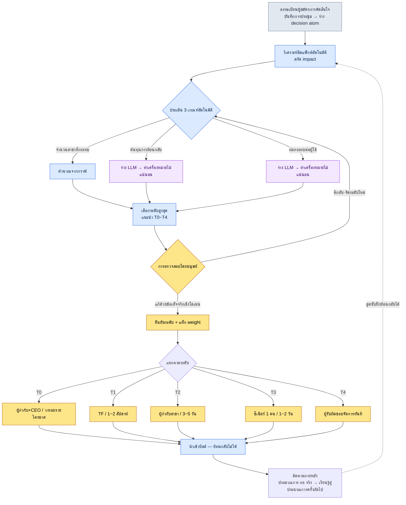
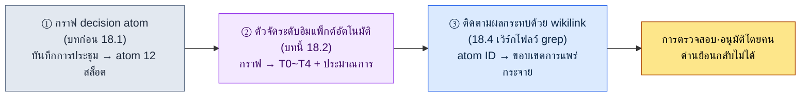

# 18.2 การแพร่กระจายอิมแพ็กต์และการจัดระดับ

ขณะที่กำลังจัดบันทึกการประชุมหลังประชุมเสร็จ มีการตัดสินใจบรรทัดเดียวเขียนอยู่ "รวม global cooldown (คูลดาวน์ทั้งเกม) เป็น 0.5 วินาที" ในที่ประชุมใช้เวลาตกลงกันไม่ถึง 30 วินาที ทุกคนพยักหน้าเห็นด้วย แล้วก็ข้ามไปยังวาระถัดไป

บรรทัดเดียวนั้นกินเวลาสองเดือนต่อมา สกิลในข้อมูลการต่อสู้ทั้ง 277 รายการได้รับผลกระทบทั้งหมด การแสดงผลเกจคูลดาวน์ใน UI ต้องวาดใหม่ และชีตปรับสมดุล (balance sheet) ถูกรื้อทำใหม่สองครั้ง ส่วนการตัดสินใจอีกอันที่เขียนอยู่ในบันทึกการประชุมฉบับเดียวกัน "แก้คำผิดในข้อความแนะนำของทูทอเรียล" เสร็จภายใน 5 นาที

การตัดสินใจสองอันบนบันทึกการประชุมเป็นบรรทัดเดียวเหมือนกัน จำนวนตัวอักษรก็พอ ๆ กัน แต่อันหนึ่งใช้ 5 นาที อีกอันใช้สองเดือน การทำให้ความต่างนี้มองเห็นได้ตั้งแต่วินาทีที่เขียนบันทึกการประชุม — นั่นคือการจัดระดับอิมแพ็กต์ ถ้าระดับมองไม่เห็น การตัดสินใจที่กินเวลาสองเดือนก็จะถูกฝังอยู่ในบรรทัดเดียวกับการตัดสินใจที่ใช้แค่ 5 นาที

บทนี้กล่าวถึงวิธีจัดระดับการแพร่กระจายของการตัดสินใจออกเป็นห้าระดับโดยอัตโนมัติ และวิธีติดตามว่าการแพร่กระจายนั้นลามไปถึงไหนบนกราฟ atom ของการตัดสินใจ เครื่องมือคือ decision atom และการสกัด `impact` ที่สั่งสมไว้ในบทก่อน รวมถึง atom ชื่อ `portal_layer_change_impact_check`

---

## สิ่งที่เกิดขึ้นเมื่อระดับมองไม่เห็น

ก่อนอื่นจะชี้ให้เห็นว่าสภาวะที่ไม่มีการจัดระดับมีหน้าตาอย่างไร เมื่อการตัดสินใจทั้งหมดถูกวางไว้บนบรรทัดเดียวกัน อุบัติเหตุสองแบบจะผลัดกันเกิดขึ้น

แบบหนึ่งคือ **การจัดการน้อยเกินไป (under-processing)** การตัดสินใจที่สั่นสะเทือนทั้งโปรเจกต์อย่างการรวม global cooldown ถูกปฏิบัติเหมือนเป็น "เรื่อง 5 นาที" จึงเข้าสู่บิลด์โดยไม่ผ่านการตรวจสอบ กว่าการแพร่กระจายจะปรากฏก็ผ่านไปสองเดือน และตอนนั้นต้นทุนการย้อนกลับก็สั่งสมสูงเป็นภูเขาไปแล้ว

อีกแบบคือ **การจัดการมากเกินไป (over-processing)** แค่แก้คำผิดหนึ่งคำก็เรียกประชุม TF และขออนุมัติจากผู้กำกับเกม (Game Director) วงรอบการตัดสินใจพองตัวขึ้น และเวลาที่ผู้กำกับควรใช้กับการตัดสินใจระดับ T0 จริง ๆ กลับถูกดูดไปกับการประชุมเรื่องคำผิด

อุบัติเหตุสองแบบดูเหมือนตรงข้ามกัน แต่มีรากเดียวกัน **น้ำหนักของการตัดสินใจมองไม่เห็น** เมื่อน้ำหนักมองไม่เห็น เราจึงทุ่มแรงให้กับเรื่องเบาและปล่อยเรื่องหนักให้หลุดมือ การจัดระดับคืองานติดป้ายน้ำหนักให้กับการตัดสินใจ และทันทีที่ป้ายติดลงไป วิธีจัดการก็จะแยกทางโดยอัตโนมัติ

---

## 18.2.1 อิมแพ็กต์ 5 ระดับ — ตั้งแต่ T0 ถึง T4

ในโปรเจกต์ A ของบริษัทพัฒนา MMORPG ที่ผู้เขียนดูแลอยู่ เราแบ่งอิมแพ็กต์ของการตัดสินใจออกเป็นห้าระดับ ยิ่งสูงยิ่งหนัก และต้องใช้คนและเวลามากขึ้นในการจัดการ

| ระดับ | นิยาม | ตัวอย่าง | ผู้ตัดสินใจ | วงรอบ |
|---|---|---|---|---|
| T0 | วิสัยทัศน์เกม / ระบบหลัก | การตัดสินใจมือถือมาก่อน, การเปลี่ยนกลไกหลัก | Game Director + CEO | รายไตรมาส |
| T1 | ระบบ / ข้ามหลายสาขา | การรวม global cooldown, การเพิ่มอาชีพใหม่ | ประธาน TF + ผู้กำกับ | 1–2 สัปดาห์ |
| T2 | เฉพาะสาขา / ระดับกลาง | การปรับค่าสกิลบางตัว, การเพิ่มคอมโพเนนต์ UI | ผู้กำกับสาขา | 3–5 วัน |
| T3 | รายการเดี่ยว / เล็ก | การแก้บทพูด NPC ตัวเดียว, การปรับสีเล็กน้อย | ซีเนียร์ 1 คน | 1–2 วัน |
| T4 | ทันที / ฮอตฟิกซ์ | การแก้บั๊ก, คำผิดในข้อความ | ผู้รับผิดชอบ | หน่วยชั่วโมง |

ดูแค่ตารางก็เรียบร้อยเหมือนตำราเรียน แต่ความยากในงานจริงไม่ใช่การท่องตาราง แต่คือ **การตัดสินว่าการตัดสินใจหนึ่งเรื่องที่อยู่ตรงหน้าจะใส่ลงในช่องไหน** เราต้องรู้ว่า "การรวม global cooldown" คือ T1 ตั้งแต่วินาทีที่เขียนบันทึกการประชุม ไม่ใช่หลังจากประชุมจบ ด้วยเหตุนี้ เกณฑ์ 3 ข้อในหัวข้อถัดไปจึงเป็นหัวใจ

---

## 18.2.2 เกณฑ์ 3 ข้อที่แบ่งระดับ

ระดับไม่ได้กำหนดด้วยความรู้สึก เราประเมินเกณฑ์สามข้อ แล้วเลือกระดับที่สูงที่สุดในนั้น

<svg viewBox="0 0 720 300" xmlns="http://www.w3.org/2000/svg" font-family="sans-serif" font-size="13">
  <rect x="0" y="0" width="720" height="300" fill="#fafafa" stroke="#ddd"/>
  <text x="20" y="30" font-size="15" font-weight="bold">เมทริกซ์ตัดสินระดับ — 3 เกณฑ์ × 5 ระดับ</text>
  <!-- header row -->
  <rect x="20" y="50" width="160" height="40" fill="#2c3e50"/>
  <text x="30" y="75" fill="#fff" font-weight="bold">เกณฑ์ \ ระดับ</text>
  <rect x="180" y="50" width="100" height="40" fill="#c0392b"/><text x="215" y="75" fill="#fff" font-weight="bold">T0</text>
  <rect x="280" y="50" width="100" height="40" fill="#e67e22"/><text x="315" y="75" fill="#fff" font-weight="bold">T1</text>
  <rect x="380" y="50" width="100" height="40" fill="#f1c40f"/><text x="415" y="75" font-weight="bold">T2</text>
  <rect x="480" y="50" width="100" height="40" fill="#2ecc71"/><text x="515" y="75" fill="#fff" font-weight="bold">T3</text>
  <rect x="580" y="50" width="120" height="40" fill="#95a5a6"/><text x="625" y="75" fill="#fff" font-weight="bold">T4</text>
  <!-- row 1: จำนวนสาขาที่กระทบ -->
  <rect x="20" y="90" width="160" height="60" fill="#ecf0f1" stroke="#bbb"/><text x="30" y="125">จำนวนสาขาที่กระทบ</text>
  <rect x="180" y="90" width="100" height="60" fill="#fff" stroke="#bbb"/><text x="220" y="125">5+</text>
  <rect x="280" y="90" width="100" height="60" fill="#fff" stroke="#bbb"/><text x="315" y="125">2~4</text>
  <rect x="380" y="90" width="100" height="60" fill="#fff" stroke="#bbb"/><text x="425" y="125">1</text>
  <rect x="480" y="90" width="100" height="60" fill="#fff" stroke="#bbb"/><text x="525" y="125">1</text>
  <rect x="580" y="90" width="120" height="60" fill="#fff" stroke="#bbb"/><text x="635" y="125">1</text>
  <!-- row 2: ต้นทุนการย้อนกลับ -->
  <rect x="20" y="150" width="160" height="60" fill="#ecf0f1" stroke="#bbb"/><text x="30" y="185">ต้นทุนการย้อนกลับ</text>
  <rect x="180" y="150" width="100" height="60" fill="#fff" stroke="#bbb"/><text x="200" y="185">สูงมาก</text>
  <rect x="280" y="150" width="100" height="60" fill="#fff" stroke="#bbb"/><text x="315" y="185">สูง</text>
  <rect x="380" y="150" width="100" height="60" fill="#fff" stroke="#bbb"/><text x="415" y="185">ปานกลาง</text>
  <rect x="480" y="150" width="100" height="60" fill="#fff" stroke="#bbb"/><text x="515" y="185">ต่ำ</text>
  <rect x="580" y="150" width="120" height="60" fill="#fff" stroke="#bbb"/><text x="600" y="185">ต่ำมาก</text>
  <!-- row 3: ขอบเขตที่กระทบผู้ใช้ -->
  <rect x="20" y="210" width="160" height="60" fill="#ecf0f1" stroke="#bbb"/><text x="30" y="245">ขอบเขตที่กระทบผู้ใช้</text>
  <rect x="180" y="210" width="100" height="60" fill="#fff" stroke="#bbb"/><text x="215" y="245">ทั้งหมด</text>
  <rect x="280" y="210" width="100" height="60" fill="#fff" stroke="#bbb"/><text x="320" y="245">สูง</text>
  <rect x="380" y="210" width="100" height="60" fill="#fff" stroke="#bbb"/><text x="415" y="245">ปานกลาง</text>
  <rect x="480" y="210" width="100" height="60" fill="#fff" stroke="#bbb"/><text x="515" y="245">ต่ำ</text>
  <rect x="580" y="210" width="120" height="60" fill="#fff" stroke="#bbb"/><text x="600" y="245">ต่ำมาก</text>
</svg>

ในบรรดาเกณฑ์สามข้อ **จำนวนสาขาที่กระทบ** สามารถนับได้อย่างเป็นกลไกจากกราฟ decision atom เพียงรวบรวมแท็กว่า atom ที่การตัดสินใจไปแตะนั้นสังกัดสาขาใด (การต่อสู้ · UI · ข้อมูล · เนื้อเรื่อง ฯลฯ) ก็จบ

ปัญหาอยู่ที่อีกสองข้อที่เหลือ **ต้นทุนการย้อนกลับ** และ **ขอบเขตที่กระทบผู้ใช้** ไม่สามารถแปลงเป็นตัวเลขบนกราฟได้ "ถ้าจะย้อนกลับการตัดสินใจนี้ในอีกสองเดือนต่อมาจะต้องใช้ต้นทุนเท่าไร" เป็นการตัดสินด้วยภาษาธรรมชาติ จุดนี้เองคือกำแพงสุดท้ายของการจัดระดับอิมแพ็กต์อัตโนมัติจนกระทั่งก่อนปี 2023 จำนวนสาขาที่กระทบนั้นทำให้อัตโนมัติได้แล้ว แต่ช่องการตัดสินด้วยภาษาธรรมชาติสองช่องว่างอยู่ สุดท้ายคนก็ต้องมาให้คะแนนใหม่ตั้งแต่ต้น เมื่อ LLM อ่านเนื้อหาของ decision atom และเติมร่างของสองช่องนี้ได้ กำแพงก็เตี้ยลง

ตรงนี้จะพูดอย่างตรงไปตรงมา สิ่งที่ LLM เติมคือ **ร่าง** ไม่ใช่คำตัดสินสุดท้าย ถึง LLM จะประเมินต้นทุนการย้อนกลับว่า "สูง" ผู้กำกับสาขาก็อาจตัดสินว่า "ด้วยโครงสร้างชีตของเรา อันนี้แค่ปานกลาง" ได้ การจัดระดับอัตโนมัติไม่ได้มาแทนที่การตัดสินของคน แต่ทำให้ **คนไม่ต้องเริ่มจากช่องว่างเปล่า ๆ**

---

## 18.2.3 บันทึกเซสชันจริง (worked transcript) — ให้ LLM จัดระดับการตัดสินใจหนึ่งเรื่อง

นี่คือกระบวนการจริงที่นำ decision atom หนึ่งเรื่องที่สร้างในบทก่อนใส่เข้า LLM ตรง ๆ แล้วให้จัดระดับ ผู้เขียนจะถ่ายทอดทั้งกระบวนการโดยไม่ย่อ รวมถึงการปฏิเสธและการขอใหม่ด้วย

### อินพุต — เนื้อหาต้นฉบับของ decision atom

```yaml
# decisions/D2026_Q2_017.md (atom ที่ลงทะเบียนในบทก่อน 18.1)
id: D2026_Q2_017
title: รวม global cooldown เป็น 0.5 วินาที
date: 2026-04-18
proposer: teammate_a
decider: อี มินซู    # Design Director (เหมือนกับ approved_by ใน 18.1)
context: เกณฑ์คูลดาวน์แตกต่างกันไปตามแต่ละอาชีพ ทำให้ทุกครั้งที่เพิ่มอาชีพใหม่
         ต้นทุนการคำนวณปรับสมดุลใหม่สั่งสมขึ้น จึงเสนอให้รวมเป็นเกณฑ์รวม 0.5 วินาที
affected_atoms: [combat_cooldown_rule, skill_table, ui_cooldown_gauge]
reversible: ?
status: proposed
```

### พรอมต์ฉบับเต็ม

```
ช่วยให้ระดับอิมแพ็กต์ของ decision atom ด้านล่างเป็นหนึ่งในระดับ T0~T4
ให้ดูเกณฑ์สามข้อ คือ จำนวนสาขาที่กระทบ / ต้นทุนการย้อนกลับ / ขอบเขตที่กระทบผู้ใช้ แยกกัน
แล้วเลือกระดับที่สูงที่สุดในนั้น ช่องที่ไม่มั่นใจให้เขียนว่า "ไม่แน่นอน"
และบอกว่าต้องให้คนมาดู
// (เจตนา: T0=สาขา 5+·ต้นทุนสูงมาก·ทั้งหมด, T1=2~4·สูง·สูง, T2=1·ปานกลาง, T3=1·ต่ำ, T4=1·ต่ำมาก)

[แนบเนื้อหาต้นฉบับของ atom]
```

### ผลลัพธ์ดิบจาก Claude (ไม่มีการแก้ไข)

```
ประเมินตามเกณฑ์ 3 ข้อ:

1. จำนวนสาขาที่กระทบ
   ดูจาก affected_atoms:
   - combat_cooldown_rule → สาขาการต่อสู้
   - skill_table → สาขาข้อมูล
   - ui_cooldown_gauge → สาขา UI
   สาขาที่ระบุไว้มี 3 สาขา
   อย่างไรก็ตาม จาก context ที่ว่า "ทุกครั้งที่เพิ่มอาชีพใหม่ต้องคำนวณปรับสมดุลใหม่"
   มีความเป็นไปได้สูงที่สาขาปรับสมดุลจะได้รับผลกระทบทางอ้อมด้วย
   ทางตรง 3 + ทางอ้อม 1 = มองเป็นช่วง 2~4 สาขาในทางปฏิบัติ → สัญญาณ T1

2. ต้นทุนการย้อนกลับ
   หากรวม global cooldown แล้วจะย้อนกลับ ก็ต้องแยกคูลดาวน์ของสกิลทุกตัว
   ใน skill_table กลับไปเป็นเกณฑ์รายอาชีพอีกครั้ง
   ไม่ทราบจำนวนแถวของ skill_table จึงไม่แน่นอนเรื่องต้นทุนที่แท้จริง แต่
   "รวม → กู้คืนการแยก" โดยทั่วไปมีต้นทุนสูง → สูง (สัญญาณ T1)
   ※ ช่องนี้ยืนยันไม่ได้ถ้าไม่ทราบขนาดของ skill_table จึงทำเครื่องหมายไม่แน่นอน

3. ขอบเขตที่กระทบผู้ใช้
   คูลดาวน์มีผลกับทุกสถานการณ์การต่อสู้ ดังนั้นผู้ใช้แทบทั้งหมด
   จะรู้สึกได้ → สูง (สัญญาณ T1)

ระดับที่เลือก: T1
เหตุผล: เกณฑ์ 3 ข้อชี้ไปที่ T1 ทั้งหมด ไม่ใช่ T0 —
เพราะยังไม่ถึงขั้น "เปลี่ยนกลไกหลัก" แต่เป็นการรวมพารามิเตอร์
ของกลไกเดิมให้เป็นหนึ่งเดียว

ต้องให้คนยืนยัน:
- ช่องต้นทุนการย้อนกลับ: ต้องตรวจสอบจำนวนแถวจริงของ skill_table
- สล็อต reversible ว่างเป็น "?" → การจัดระดับนี้มีเงื่อนไขว่าจะเติม
  reversible เป็น "ยาก"
```

### การตรวจสอบและปฏิเสธโดยคน

ตรงนี้ผู้เขียนไม่ได้รับมาทั้งดุ้น ข้อ 1 ของผลลัพธ์เป็นจุดที่ต้องลงมือ LLM มองสาขาปรับสมดุลเป็น "ผลกระทบทางอ้อม" แต่ในโครงสร้างจริงของโปรเจกต์ A การรวม global cooldown รื้อชีตปรับสมดุล **โดยตรง** — เพราะตัวสูตรคำนวณการปรับสมดุลของอาชีพใหม่รับค่าคูลดาวน์เป็นอินพุต ดังนั้นการปรับสมดุลจึงไม่ใช่ทางอ้อม แต่เป็นสาขาที่ 4 โดยตรง จำนวนสาขาที่กระทบคือ 4 สาขา ถึงอย่างนั้นระดับที่เลือกเป็น T1 ก็ไม่เปลี่ยน

อีกอย่างหนึ่ง เครื่องหมาย "ไม่แน่นอน" ในช่องต้นทุนการย้อนกลับนั้นแม่นยำ `skill_table` มีสกิลจริง 277 แถว และถ้าจะย้อนการรวมกลับก็ต้องแยกคูลดาวน์ของทั้ง 277 แถวใหม่ ต้นทุนจึงไม่ใช่ "สูง" แต่ใกล้เคียง "สูงมาก" ถึงอย่างนั้น แค่ช่องหนึ่งเลื่อนขึ้นก็ไม่ได้ทำให้ระดับที่เลือกขยับไปเป็น T0 — เพราะจำนวนสาขาที่กระทบและผลกระทบต่อผู้ใช้อยู่ในช่วง T1 ระดับที่สูงที่สุดจึงยังคงเป็น T1

### การขอใหม่

```
แก้นะ ช่วยเพิ่ม balance_sheet ลงใน affected_atoms ด้วย (เพราะสูตรปรับสมดุล
รับค่าคูลดาวน์เป็นอินพุต จึงเป็นผลกระทบโดยตรง) แบบนั้นก็จะมี 4 สาขาที่กระทบ
และ skill_table มี 277 แถว ช่วยนำเรื่องนี้มาเติม reversible แล้วยืนยันระดับสุดท้ายให้ที
```

```
นำมาแก้ไขแล้ว

สาขาที่กระทบ: การต่อสู้ · ข้อมูล · UI · ปรับสมดุล = 4 สาขา
ต้นทุนการย้อนกลับ: สูงมาก (ต้องแยก skill_table ทั้ง 277 แถวใหม่)
ผลกระทบต่อผู้ใช้: สูง

reversible: ยาก (ใกล้เคียงย้อนกลับไม่ได้ในทางปฏิบัติ — การแยก 277 แถวใหม่
ต้องการบิลด์ 1~2 ครั้ง + การตรวจสอบปรับสมดุลใหม่หลายรอบ)

ระดับสุดท้าย: T1
ข้อควรระวัง: หากดูเฉพาะช่องต้นทุนการย้อนกลับช่องเดียวจะเป็นสัญญาณ T0 แต่
สาขาที่กระทบ 4 สาขา · ผลกระทบต่อผู้ใช้ "สูง" อยู่ในช่วง T1
เนื่องจากเกณฑ์ 2 ใน 3 ข้อชี้ไปที่ T1 ดังนั้น T1 จึงถูกต้อง
อย่างไรก็ตาม ขอแนะนำให้ทำเครื่องหมายการตัดสินใจนี้ว่าเป็น
"ฝั่งหนักของ T1" — เพราะต้นทุนการย้อนกลับอยู่ในระดับ T0
```

ประโยคสุดท้ายรอบคอบยิ่งกว่าคน ข้อเสนอที่ว่าให้ติดป้ายว่าระดับเป็น T1 ก็จริงแต่ต้นทุนการย้อนกลับอยู่ระดับ T0 ในฐานะ "ฝั่งหนักของ T1" — นี่เป็นการตัดสินที่ไม่มีในพรอมต์แรก ผู้เขียนรับไว้ การตัดสินใจนี้ได้ถูกติดแท็ก `weight: heavy` เพิ่ม และยกลำดับความสำคัญในการติดตามภายหลังให้สูงขึ้น

หัวใจที่บันทึกเซสชันนี้แสดงให้เห็นมีเพียงหนึ่งเดียว **LLM สร้างร่างของการจัดระดับและเหตุผล ส่วนคนแก้ไขด้วยข้อเท็จจริงเชิงโดเมน (ปรับสมดุลเป็นผลกระทบโดยตรง, 277 แถว)** อย่างใดอย่างหนึ่งเพียงลำพังไม่พอ ถ้าให้คนทำคนเดียวก็เริ่มจากช่องว่างเปล่าและช้า ถ้าให้ LLM ทำคนเดียวก็เขียนว่า "สูง" ทั้งที่ไม่รู้ว่ามี 277 แถว

---

## 18.2.4 โค้ดที่ติดตามการแพร่กระจายอิมแพ็กต์โดยอัตโนมัติ

เมื่อระดับถูกกำหนดแล้ว ถัดไปคือ "ลามไปถึงไหน" เรานำการสกัด `impact` จากบทก่อน — อินบาวด์เอดจ์ (inbound edge), ความสัมพันธ์ `affects` ของออนโทโลยี, การอ้างถึงย้อนกลับของ wikilink — มาใช้กับ decision atom

```python
# impact_propagation.py — ติดตามขอบเขตการแพร่กระจายของ decision atom

def trace_impact(decision):
    # ชั้นที่ 1: atom·ไฟล์ ที่การตัดสินใจไปแตะโดยตรง
    direct = decision.affected_atoms + decision.affected_files

    # ชั้นที่ 2: atom ที่อ้างถึง atom ชั้น 1 ย้อนกลับด้วย wikilink (อินบาวด์เอดจ์ของ impact)
    secondary = []
    for atom in direct:
        secondary.extend(find_inbound_refs(atom))   # การอ้างย้อนกลับ [[atom]]
        secondary.extend(find_affects_edges(atom))   # affects ของออนโทโลยี

    secondary = dedup(secondary) - set(direct)

    return {
        "direct": direct,
        "secondary": secondary,
        "affected_fields": determine_fields(direct + secondary),
        "estimated_hours": estimate_hours(direct, secondary),
    }
```

หัวใจคือ `find_inbound_refs` — ฟังก์ชันที่รวบรวมลูกศร **ขาเข้า** ที่ชี้มายัง atom นั้นด้วย `[[...]]` จากกราฟ atom สิ่งที่การตัดสินใจไปแตะเอง (ลูกศรขาออก) เขียนอยู่ใน atom อยู่แล้ว แต่ว่าใครพึ่งพา atom นั้นบ้าง (ลูกศรขาเข้า) ต้องสแกนกราฟทั้งหมดย้อนกลับจึงจะมองเห็น การแพร่กระจายที่กินเวลาสองเดือนนั้นแทบทุกครั้งซ่อนอยู่ฝั่ง **อินบาวด์เอดจ์** นี้

จะบันทึกผลของการรันการติดตามนี้กับ D2026_Q2_017 อย่างตรงไปตรงมา direct คือ atom 4 ตัวที่ยืนยันไว้ข้างต้น ส่วน secondary คือ atom ที่อ้างถึง `skill_table` ย้อนกลับ — ข้อความคำอธิบายสกิล, การแม็ปไอคอนสกิล, ทรีสกิลรายอาชีพ ฯลฯ — ทยอยตามมาเป็นพรวน **ตัวเลขแตกต่างกันไปตามช่วงเวลา จึงไม่ฟันธง** ข้อเท็จจริงที่การติดตามจับให้คือ "ทิศทาง" ที่ว่า "secondary เป็นหลายสิบเท่าของ direct" ส่วนจำนวน atom ที่แม่นยำขึ้นอยู่กับสถานะของกราฟ แค่ทิศทางก็เพียงพอ — ถ้า secondary ใหญ่กว่า direct ราวหนึ่งหลัก นั่นคือสัญญาณ T1 และหมายความว่าเป็นเป้าหมายของการติดตามภายหลัง

---

## 18.2.5 จะแทรกการจัดระดับเข้าตรงไหน — mermaid

การจัดระดับไม่ใช่ขั้นตอนที่แยกเป็นอิสระ แต่ถูกตรึงเป็นด่านอยู่กลางสายการตัดสินใจ เมื่อผู้สมัครที่จะกลายเป็นการตัดสินใจถูกลงทะเบียน การวิเคราะห์อัตโนมัติจะแนะนำระดับ และต่อเมื่อคนตรวจสอบ·ปรับแก้แล้วเท่านั้นจึงจะส่งต่อไปยังการประชุมตัดสินใจ



ในสายนี้ **ขั้นตอนย้อนกลับไม่ได้มีเพียงหนึ่งเดียว คือการนำเข้าบิลด์ (I)** ก่อนหน้านั้นย้อนกลับได้ทั้งหมด — ถึงจะแนะนำระดับผิดคนก็ตีกลับได้ และแท็ก weight ก็ถอดได้ มันจะกลายเป็นย้อนกลับไม่ได้ก็ต่อเมื่อเข้าบิลด์แล้วและแพร่กระจายไปยังเอกสารอื่นแล้วเท่านั้น ด้วยเหตุนี้ ด่าน (การตรวจสอบโดยมนุษย์ที่ F) จึงอยู่ก่อนบิลด์ คนจะขวางไว้หนึ่งครั้งก่อนข้ามเส้นย้อนกลับไม่ได้

เส้นประสุดท้าย — ลูกศรที่การติดตามภายหลัง (J) ย้อนกลับไปยังการวิเคราะห์อัตโนมัติ (B) ของการตัดสินใจครั้งถัดไป — ทำให้ระบบนี้กลายเป็นวงรอบการเรียนรู้ ข้อมูลที่วัดได้จริงจากขั้นตอนย้อนกลับไม่ได้ (เช่น เวลา QA ยาวกว่าที่ประมาณการ) ถูกดูดซับเข้าสู่ขั้นตอนย้อนกลับได้ของการตัดสินใจครั้งถัดไป

---

## 18.2.6 การติดตามภายหลัง — เปลี่ยนช่องว่างระหว่างประมาณการกับจริงเป็นการเรียนรู้

หลังจากการตัดสินใจเข้าบิลด์ไป 1 สัปดาห์ \~ 1 เดือน เรานำประมาณการกับของจริงมาเทียบกัน นี่คือแบบฟอร์มติดตามภายหลังของ D2026_Q2_017

```
ติดตามภายหลังการตัดสินใจ D2026_Q2_017  (ตัวอย่างแบบฟอร์ม · ตัวเลขเป็นอินพุตสมมติ)
─────────────────────────────────
เวลาทำงาน (ประมาณการ → จริง)
  โค้ด:    16h → 22h  (+38%)
  ข้อมูล:    8h →  6h  (-25%)
  UI:       4h →  4h  (=)
  QA:       8h → 12h  (+50%)
  total:   36h → 44h  (+22%)

atom ที่กระทบ (ประมาณการ → จริง)
  direct:    4 →  4   (แม่นยำ)
  secondary: ประมาณการหลายสิบ → จริงหลายสิบ  (ทิศทางตรงกัน ไม่เปิดเผยตัวเลขที่แม่นยำ)

อุบัติเหตุที่เกิด: 0 ครั้ง
รูปแบบความคลาดเคลื่อน: QA เกินประมาณการทุกครั้ง (ครั้งนี้ +50%)
นำไปใช้กับการตัดสินใจครั้งถัดไป: บวกมาร์จิน +20% ให้ประมาณการ QA เป็นค่าตั้งต้น
```

บล็อกข้างต้นเป็นตัวอย่างแบบฟอร์มที่แสดงให้เห็นว่าการติดตามภายหลัง **มีหน้าตาอย่างไร** ค่าเวลา·เปอร์เซ็นต์ไม่ใช่ข้อมูลโปรเจกต์จริง แต่เป็นอินพุตสมมติที่กรอกลงในแบบฟอร์ม ดังนั้นในโปรเจกต์ของคุณเองก็เปลี่ยนเป็นตัวเลขของคุณเองกรอกลงไป — ตามคำสัญญาของหนังสือเล่มนี้เป๊ะ ๆ เราแสดงโครงสร้างให้ดู ส่วนตัวเลขคุณเป็นผู้วัดเอง สิ่งที่เป็นของจริงไม่ขึ้นกับแบบฟอร์มมีอยู่หนึ่งเดียว **"ทิศทาง" ของความคลาดเคลื่อนที่ว่า "QA เกินประมาณการทุกครั้ง"** และขั้นตอนป้อนทิศทางนั้นกลับเข้าสู่การตัดสินใจครั้งถัดไป จึงเกิดเป็นใบสั่งยาที่ว่าให้บวกมาร์จิน QA (เช่น +20%) เข้าไปตั้งแต่ต้นในประมาณการครั้งถัดไป

คุณค่าของการติดตามภายหลังไม่ได้อยู่ที่การทายตัวเลขให้แม่น แต่อยู่ที่การป้อนทิศทางของความคลาดเคลื่อนกลับเข้าไป ยิ่งประมาณการแม่นยำขึ้น ความเชื่อมั่นในการจัดระดับก็ยิ่งสูงขึ้น และเมื่อความเชื่อมั่นสูงขึ้น การมอบหมายงานก็เป็นไปได้

---

## 18.2.7 รูปแบบอุบัติเหตุและใบสั่งยาตามแต่ละระดับ

อุบัติเหตุที่เกิดซ้ำในแต่ละระดับต่างกัน ใบสั่งยาก็ต่างกัน

| ระดับ | รูปแบบอุบัติเหตุ | ใบสั่งยา |
|---|---|---|
| T0 | วิสัยทัศน์คลุมเครือ → สับสนตลอดทั้งไตรมาส | บังคับให้ระบุวิสัยทัศน์หนึ่งบรรทัดในตัวคำตัดสินใจ |
| T1 | ขัดแย้งข้ามสาขา → กำหนดการล่าช้า | ให้ตัวแทนทุกสาขาที่กระทบเข้าร่วม TF |
| T2 | มองข้ามผลกระทบต่อระบบข้างเคียง → การตัดสินใจตามมาพุ่ง | ติดตาม secondary บังคับ |
| T3 | การตัดสินใจเล็ก ๆ สั่งสม → ความสอดคล้องเสียหาย | ตรวจ T3 รวมกันในการทบทวนรายไตรมาส |
| T4 | ตรวจสอบไม่พอ → ต้องฮอตฟิกซ์ซ้ำ | ฮอตฟิกซ์ก็ให้รีวิวอย่างน้อย 1 คน |

ใบสั่งยาในตารางนี้ล้วนถูกดำเนินการด้วยเครื่องมือที่ปรากฏในหัวข้อก่อน ๆ "ติดตาม secondary บังคับ" ของ T2 คือ `find_inbound_refs` ใน §18.2.4 และ "ให้ตัวแทนทุกสาขาที่กระทบเข้าร่วม" ของ T1 นั้น ใครต้องเข้ามาถูกกำหนดด้วย `affected_fields` ที่ §18.2.4 จับได้

อุบัติเหตุที่แพงที่สุดไม่มีอยู่ที่ไหนในตารางเลย **คือการที่ระดับเองผิด** ถ้าซีเนียร์ตัดสิน T0 คนเดียววิสัยทัศน์จะเสียหาย ถ้าผู้กำกับลงไปจัดการ T4 เองก็จะเกิดคอขวด เมื่อระดับผิด ใบสั่งยาทั้งหมดที่อยู่ใต้ระดับนั้นก็ทำงานผิดที่ ด้วยเหตุนี้ ด่านการตรวจสอบโดยมนุษย์ใน §18.2.3 จึงไม่ใช่แค่พิธีการ

---

## 18.2.8 การวัดผล — ประสิทธิผลของการดำเนินการจัดระดับ

จะเปรียบเทียบก่อนและหลังการนำการจัดระดับมาใช้ในโปรเจกต์ A ในบรรดาค่าด้านล่าง ค่าสัมบูรณ์เป็นตัวอย่างที่ปรุงแต่งขึ้น ส่วน **ทิศทาง (เครื่องหมายมากกว่า/น้อยกว่า) เป็นแนวโน้มจริง**

| รายการ | ไม่มีการจัดระดับ | มีการดำเนินการจัดระดับ |
|---|---|---|
| วงรอบการตัดสินใจ | ทั้งหมดเท่ากันที่ 1\~2 สัปดาห์ | แยกย่อยตั้งแต่ T0 รายไตรมาส \~ T4 หน่วยชั่วโมง |
| การตัดสินใจที่จัดการผิด | จำนวนมากต่อไตรมาส | จำนวนน้อยต่อไตรมาส |
| ภาระการตัดสินใจรายสัปดาห์ของผู้กำกับ | สูง (ทุกการตัดสินใจไปที่ผู้กำกับ) | ต่ำ (มอบหมาย T2\~T4) |
| วงรอบฮอตฟิกซ์ | 1\~2 วัน | 4\~24 ชั่วโมง |
| การวิเคราะห์การตัดสินใจในการทบทวนรายไตรมาส | จัดกลุ่มยาก | รวมเป็นสถิติตามแต่ละระดับ |

เหตุผลที่เขียนตารางเป็นทิศทางแทนตัวเลขที่ฟันธง อธิบายได้ด้วยรายการที่ 3 เพียงรายการเดียว **การกู้คืนเวลาของผู้กำกับคือประสิทธิผลที่ใหญ่ที่สุดของการจัดระดับ** เมื่อไม่มีระดับ การตัดสินใจทุกอย่างตั้งแต่คำผิดไปจนถึงวิสัยทัศน์จะกระจุกไปที่ผู้กำกับเพียงคนเดียว เมื่อมีระดับ T2 ลงไปจะแยกไปยังผู้กำกับสาขา·ซีเนียร์·ผู้รับผิดชอบ และผู้กำกับก็โฟกัสที่ T0·T1 การที่การมอบหมายงานเป็นไปได้ก็คือการที่ผู้กำกับกู้เวลาที่จะใช้กับการตัดสินใจที่หนักจริง ๆ กลับคืนมานั่นเอง

---

## 18.2.9 ที่ทางของบทนี้ในโครงร่างการประยุกต์เชิงก้าวหน้า

ในบทก่อนเราสร้างกราฟ decision atom และในบทนี้เราวางตัวจัดระดับอัตโนมัติลงบนกราฟนั้น ทั้งสองไม่ใช่เครื่องมือที่ทำงานแยกกัน แต่เป็นที่ทางที่ต่อเนื่องกันในโครงร่างเดียว



สามองค์ประกอบต่ออนุกรมกัน กราฟสร้างอินพุต (①) ตัวจัดระดับให้น้ำหนัก (②) และการติดตามผลกระทบกางขอบเขตการแพร่กระจายออก (③) บทนี้คือที่ทางตรงกลาง

สามองค์ประกอบล้วนเข้าสู่แดนที่ทำได้จริงหลังจาก LLM พัฒนาขึ้นเท่านั้น กำแพงที่ถูกแก้ช้าที่สุดคือสองช่องของการประเมินด้วยภาษาธรรมชาติใน ② — ต้นทุนการย้อนกลับและขอบเขตที่กระทบผู้ใช้ ("กำแพงสุดท้าย" ใน §18.2.2) — และเมื่อ LLM เติมร่างของช่องนั้นได้ ①→②→③ จึงเริ่มหมุนเป็นอนุกรมได้

การจัดเรียงของย้อนกลับได้·ย้อนกลับไม่ได้ก็เกี่ยวพันกับโครงร่างนี้ ตามแผนภาพการไหลใน §18.2.5 เส้นย้อนกลับไม่ได้มีเพียงการนำเข้าบิลด์อันเดียว และตัวการนำเข้าบิลด์เองย้อนกลับไม่ได้ก็จริง แต่ผลที่วัดได้จริงของมันจะย้อนกลับมาเป็นการเรียนรู้แบบย้อนกลับได้ที่ทำให้การตัดสินใจครั้งถัดไปแม่นยำขึ้น

---

## 18.2.10 ความล้มเหลวที่พบบ่อย

| รูปแบบ | ใบสั่งยา |
|---|---|
| จัดการทุกการตัดสินใจด้วยวงรอบเดียวกัน | แยกวงรอบตามแต่ละระดับ |
| ต่างคนต่างตัดสินเองโดยไม่มีการจัดระดับ | ด่านจัดระดับด้วย 3 เกณฑ์ |
| เพิกเฉยต่อระดับ (ซีเนียร์ตัดสิน T0) | บังคับตารางผู้ตัดสินใจ |
| ละเว้นการประเมินผลกระทบล่วงหน้า | ตั้งการวิเคราะห์อัตโนมัติเป็นด่านก่อนการประชุมตัดสินใจ |
| ยืนยันช่องภาษาธรรมชาติตามผลลัพธ์ LLM ทั้งดุ้น | ให้คนแก้ด้วยข้อเท็จจริงเชิงโดเมน |
| ปิดการตัดสินใจโดยไม่ติดตามภายหลัง | เทียบประมาณการ vs จริง ภายใน 1 สัปดาห์ \~ 1 เดือน |
| ไม่นำความคลาดเคลื่อนของประมาณการไปใช้กับการตัดสินใจครั้งถัดไป | นำทิศทางความคลาดเคลื่อนไปปรับมาร์จินของประมาณการครั้งถัดไป |

---

> **การประยุกต์นอกเกม** ระดับอิมแพ็กต์คือป้ายที่ทำให้เห็นล่วงหน้าว่า "คำขอบรรทัดเดียวเป็นเรื่อง 5 นาทีหรือเรื่องสองเดือน" จึงใช้ได้ในที่ทำงานทุกแห่งที่การตัดสินใจหลั่งไหลเข้ามา ถ้าการแก้ข้อความในวิกิบริษัทหนึ่งบรรทัดกับ "การเปลี่ยนนโยบายวันลาทั้งบริษัท" เข้ามาเป็น 'วาระ 1 เรื่อง' เหมือนกัน และวิ่งผ่านสายอนุมัติเดียวกัน เรื่องเบาก็จะถูกจัดการมากเกินไปและเรื่องหนักก็จะหลุดไปโดยไม่ผ่านการตรวจสอบ ตัวอย่างเช่น เวลารับคำขอจากทีมปฏิบัติการ หากติด T0\~T4 ด้วยสามเกณฑ์ คือ จำนวนแผนกที่กระทบ · ต้นทุนการย้อนกลับ · ขอบเขตที่กระทบลูกค้า สิ่งที่ผู้รับผิดชอบจัดการได้ทันทีกับสิ่งที่ต้องให้หัวหน้าทีมอนุมัติก็จะแยกออกจากกันโดยอัตโนมัติ และเวลาของผู้บริหารก็จะถูกกู้คืนไปสู่การตัดสินใจที่หนักจริง ๆ

## ลองทำดู — จัดระดับการตัดสินใจหนึ่งเรื่อง

**setup.** เตรียม decision atom หนึ่งเรื่องที่สร้างในบทก่อน สล็อต `affected_atoms` ต้องถูกเติมไว้ ถ้าว่างอยู่จะนับจำนวนสาขาที่กระทบไม่ได้

**prompt.** ใช้พรอมต์ฉบับเต็มใน §18.2.3 ตามนั้น อย่าตกหล่นสามบรรทัดหลัก — (1) ประเมินแต่ละเกณฑ์ใน 3 เกณฑ์, (2) เลือกระดับที่สูงที่สุด, (3) ช่องที่ไม่มั่นใจให้ทำเครื่องหมาย "ไม่แน่นอน" และขอให้คนยืนยัน ถ้าไม่มีบรรทัดที่สาม LLM จะฟันธงแม้กระทั่งสิ่งที่มันไม่รู้

**verify.** เมื่อได้ผลลัพธ์ LLM มาให้ตรวจสองอย่างด้วยตัวเอง หนึ่ง ต่อให้ LLM นับจำนวนสาขาที่กระทบแล้ว ก็ให้นับใหม่เองโดยตรงจากกราฟ atom — มันอาจจับผลกระทบทางอ้อมเป็นทางตรงหรือมองข้ามไปก็ได้ (กรณีปรับสมดุลในบันทึกเซสชัน) สอง ช่องที่ติดเครื่องหมาย "ไม่แน่นอน" ให้เติมด้วยข้อเท็จจริงเชิงโดเมน (ขนาดจริงอย่าง skill_table 277 แถว) ต่อเมื่อตรวจสองอย่างเสร็จแล้วเท่านั้นจึงยืนยันระดับและส่งต่อไปยังด่านบิลด์

## ฉบับย่อสำหรับคนเดียว

ถ้าเป็นโปรเจกต์ที่ทำคนเดียวโดยไม่มีทั้งทีมและ TF ห้าระดับก็มากเกินไป ลดเหลือสามระดับ

- **หนัก**: การตัดสินใจที่เปลี่ยนทิศทางของเกมหรือเปลี่ยนหลายระบบ นอนหนึ่งคืนแล้วตื่นมาดูใหม่ ห้ามตัดสินใจกะทันหัน
- **ปานกลาง**: การตัดสินใจที่ปิดอยู่ภายในระบบเดียว จัดการตรงนั้นแต่บันทึกเป็น decision atom หนึ่งบรรทัด
- **ทันที**: คำผิด·บั๊ก แก้เดี๋ยวนั้นเลย จะละเว้นการบันทึกก็ได้

เครื่องมือก็เริ่มได้โดยไม่ต้องมีโค้ดสักบรรทัด เวลาจดการตัดสินใจ แค่ติดแท็ก `[หนัก]` `[ปานกลาง]` `[ทันที]` ไว้ข้างหน้า แค่นั้นก็ทำให้เราหยุดอีกครั้งหนึ่งหน้าการตัดสินใจที่ติดแท็ก "หนัก" — แก่นของการจัดระดับสุดท้ายก็คือนิสัยการหยุดหน้าการตัดสินใจที่หนัก และระบบอัตโนมัติก็เป็นเพียงกลไกที่ทำให้การหยุดนั้นทำงานได้แม้ในระดับทีม

---

### สรุปประเด็นสำคัญของบท
- การตัดสินใจบรรทัดเดียวเหมือนกันก็แยกเป็น 5 นาทีกับสองเดือนตามระดับอิมแพ็กต์ และถ้าระดับมองไม่เห็น การจัดการน้อยเกินไป·มากเกินไปจะผลัดกันเกิด
- ในเกณฑ์ 3 ข้อ สองช่องภาษาธรรมชาติ (ต้นทุนการย้อนกลับ·ผลกระทบต่อผู้ใช้) เคยเป็นกำแพงสุดท้ายของการทำให้อัตโนมัติ และเตี้ยลงเมื่อ LLM เติมร่าง
- ประสิทธิผลที่ใหญ่ที่สุดของการจัดระดับคือการกู้คืนเวลาของผู้กำกับ และทำให้การมอบหมายงานเป็นไปได้
