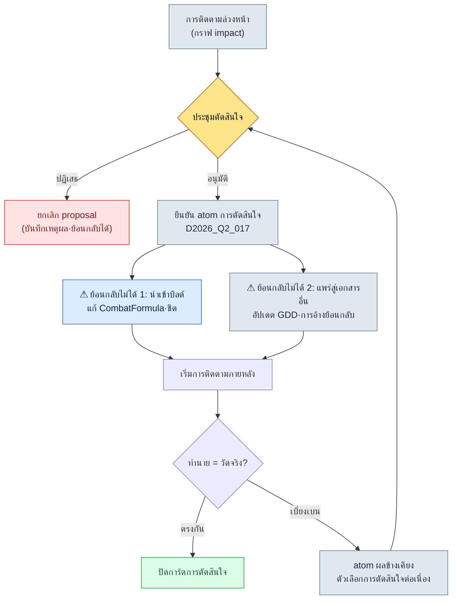

# 18.3 เวิร์กโฟลว์ติดตามผลกระทบก่อน-หลังการตัดสินใจ

สามสัปดาห์หลังเปิดตัว เป็นวงทบทวนที่เราย้อนหาสาเหตุว่าเหตุใดสมดุล PvP ถึงพังทลาย เมื่อไล่ย้อนขึ้นไปบนไวต์บอร์ดจนสุด จุดเริ่มต้นที่พบคือการตัดสินใจเพียงครั้งเดียวเมื่อเดือนก่อน "ปรับ Cooldown รวม (global cooldown) จาก 0.3 เป็น 0.5" เป็นข้อเสนอที่สมเหตุสมผล เราได้รับฟีดแบ็กว่ามองไม่เห็นคอมโบ จึงตกลงกันได้ภายในสองชั่วโมง แต่การเปลี่ยนแปลงนั้นกลับดันอัตราการรอดของอาชีพแทงก์ขึ้นไปมากกว่าที่คาดถึง 14% และนั่นทำให้ PvP พังลง ไม่มีใครพูดได้ในวงตัดสินใจว่าการตัดสินใจนี้จะลามไปถึงแทงก์ การตัดสินใจเองไม่ได้ผิด สาเหตุของอุบัติเหตุคือการที่เราไม่ได้มองเห็น **ก่อนตัดสินใจ** ว่ามันจะลามไปไกลถึงไหน

การติดตามผลกระทบต้องเกิดขึ้นในสองจุด คือมองว่ามันจะลามไปถึงไหน **ก่อนกดยืนยัน** การตัดสินใจ (pre) และตรวจสอบว่ามันลามไปแค่ตรงนั้นจริงหรือไม่ **หลังจากนำการตัดสินใจไปใช้แล้ว** (post) บทนี้จะมัดการติดตามสองอย่างนั้นเข้าเป็นเวิร์กโฟลว์เดียว

---

## 18.3.1 การติดตามล่วงหน้าและการติดตามภายหลังคือการอ่านกราฟเดียวกันสองรอบ

หัวใจของการวิเคราะห์ผลกระทบของการตัดสินใจนั้นเรียบง่ายอย่างคาดไม่ถึง คือมอง atom ของการตัดสินใจหนึ่งตัวเป็นโหนด แล้วอ่าน **เอดจ์ที่เข้ามา** และ **เอดจ์ที่ออกไป** จากโหนดนั้น การติดตามล่วงหน้าถามว่า "ถ้าเปลี่ยนการตัดสินใจนี้ ตรงไหนจะได้รับผลกระทบ" (เอาต์บาวด์ + การอ้างย้อนกลับ) ส่วนการติดตามภายหลังถามว่า "ผลกระทบนั้นเกิดขึ้นตามที่ตั้งใจไว้จริงหรือไม่" (วัดเอดจ์เดียวกันเทียบกับค่าที่วัดได้)

ในโปรเจกต์ A ของผู้เขียน เราเก็บการตัดสินใจไว้เป็น atom ในโฟลเดอร์ `decisions/` ปัจจุบันสะสมไว้ 26 ตัว และแต่ละ atom ถือข้อมูลวันที่ ผู้เกี่ยวข้อง เหตุผล และขอบเขตผลกระทบ ไว้ในฟรอนต์แมตเตอร์ เครื่องมือที่สกัดขอบเขตผลกระทบคือ `impact` และ atom ที่บังคับกฎการสกัดนั้นในระดับการตัดสินใจคือ `portal_layer_change_impact_check` สามสิ่งนี้คือสินทรัพย์จริงของการติดตามทั้งล่วงหน้าและภายหลัง

<svg viewBox="0 0 720 300" xmlns="http://www.w3.org/2000/svg" font-family="sans-serif" font-size="13">
  <rect x="0" y="0" width="720" height="300" fill="#fbfbfd"/>
  <!-- center decision node -->
  <rect x="300" y="120" width="120" height="60" rx="8" fill="#2b6cb0" stroke="#1a4971"/>
  <text x="360" y="146" text-anchor="middle" fill="#fff" font-weight="bold">atom การตัดสินใจ</text>
  <text x="360" y="164" text-anchor="middle" fill="#cfe2f3" font-size="11">D2026_Q2_017</text>
  <!-- inbound (left) -->
  <rect x="40" y="40" width="150" height="38" rx="6" fill="#e6f0fa" stroke="#2b6cb0"/>
  <text x="115" y="64" text-anchor="middle" fill="#1a4971">เหตุผล: ฟีดแบ็กผู้ใช้</text>
  <rect x="40" y="130" width="150" height="38" rx="6" fill="#e6f0fa" stroke="#2b6cb0"/>
  <text x="115" y="154" text-anchor="middle" fill="#1a4971">การตัดสินใจระดับบน D_011</text>
  <rect x="40" y="220" width="150" height="38" rx="6" fill="#e6f0fa" stroke="#2b6cb0"/>
  <text x="115" y="244" text-anchor="middle" fill="#1a4971">อ้างย้อนกลับ: ลิงก์ GDD</text>
  <!-- outbound (right) -->
  <rect x="540" y="40" width="150" height="38" rx="6" fill="#fdeee6" stroke="#c05621"/>
  <text x="615" y="64" text-anchor="middle" fill="#7b3d12">CombatFormula.md</text>
  <rect x="540" y="130" width="150" height="38" rx="6" fill="#fdeee6" stroke="#c05621"/>
  <text x="615" y="154" text-anchor="middle" fill="#7b3d12">ชีต CombatBalance</text>
  <rect x="540" y="220" width="150" height="38" rx="6" fill="#fdeee6" stroke="#c05621"/>
  <text x="615" y="244" text-anchor="middle" fill="#7b3d12">การแสดงคอมโบบน UI</text>
  <!-- inbound arrows -->
  <line x1="190" y1="59" x2="300" y2="135" stroke="#2b6cb0" stroke-width="1.5" marker-end="url(#a)"/>
  <line x1="190" y1="149" x2="300" y2="150" stroke="#2b6cb0" stroke-width="1.5" marker-end="url(#a)"/>
  <line x1="190" y1="239" x2="300" y2="165" stroke="#2b6cb0" stroke-width="1.5" marker-end="url(#a)"/>
  <!-- outbound arrows -->
  <line x1="420" y1="135" x2="540" y2="59" stroke="#c05621" stroke-width="1.5" marker-end="url(#b)"/>
  <line x1="420" y1="150" x2="540" y2="149" stroke="#c05621" stroke-width="1.5" marker-end="url(#b)"/>
  <line x1="420" y1="165" x2="540" y2="239" stroke="#c05621" stroke-width="1.5" marker-end="url(#b)"/>
  <text x="115" y="22" text-anchor="middle" fill="#1a4971" font-weight="bold" font-size="12">อินบาวด์ (ทำไมถึงตัดสินใจนี้)</text>
  <text x="615" y="22" text-anchor="middle" fill="#7b3d12" font-weight="bold" font-size="12">เอาต์บาวด์ (ลามไปที่ไหน)</text>
  <defs>
    <marker id="a" markerWidth="8" markerHeight="8" refX="6" refY="3" orient="auto"><path d="M0,0 L6,3 L0,6 Z" fill="#2b6cb0"/></marker>
    <marker id="b" markerWidth="8" markerHeight="8" refX="6" refY="3" orient="auto"><path d="M0,0 L6,3 L0,6 Z" fill="#c05621"/></marker>
  </defs>
</svg>

การติดตามล่วงหน้าอ่านด้านขวา (เอาต์บาวด์) เพื่อทำนายว่า "จะลามมาถึงตรงนี้" ส่วนการติดตามภายหลังนำค่าที่วัดได้จริงของโหนดด้านขวามาเทียบกับการทำนาย เป็นการอ่านกราฟเดียวกันสองรอบด้วยจุดประสงค์ที่ต่างกัน

---

## 18.3.2 การติดตามล่วงหน้า — อ่านกราฟก่อนกดยืนยันการตัดสินใจ

จากตรงนี้ไปเป็นเซสชันจริง ผู้เขียนจะไม่สรุปย่อ แต่จะนำพรอมต์ฉบับเต็ม ผลลัพธ์ดิบของ Claude และวิธีที่คนปฏิเสธมันแล้วร้องขอใหม่ มาแสดงไว้ตามจริง

`impact` เป็นไปป์ไลน์เล็ก ๆ ที่รับ ID ของ atom การตัดสินใจ แล้วดึงกราฟผลกระทบออกมา มันรวมเอดจ์อินบาวด์ (เหตุผลของการตัดสินใจนี้) เอดจ์เอาต์บาวด์ (ไฟล์ที่การตัดสินใจนี้จะแก้ไข) ความสัมพันธ์ `affects` ในออนโทโลยี และการอ้างย้อนกลับด้วยวิกิลิงก์ (เอกสารอื่นที่ชี้มาที่การตัดสินใจนี้ด้วย `[[D2026_Q2_017]]`) เข้าด้วยกันเพื่อสร้างรายการผลกระทบที่เป็นไปได้

### พรอมต์ (ฉบับเต็ม)

```
ช่วยประเมินผลกระทบล่วงหน้าในขั้น proposal ของ decisions/D2026_Q2_017.md ให้หน่อย
- ไฟล์ที่การตัดสินใจนี้จะแก้ไข (เอาต์บาวด์)
- เอกสารที่อ้างย้อนกลับมาที่การตัดสินใจนี้ด้วย [[D2026_Q2_017]] (วิกิลิงก์อินบาวด์)
- ระบบที่เชื่อมโยงด้วยความสัมพันธ์ affects ในออนโทโลยี
รวมสามอย่างนี้เข้าด้วยกันเพื่อออกรายการผลกระทบที่เป็นไปได้ และในแต่ละรายการ
ให้แยกว่าเป็นรายการที่ต้องให้ฉันยืนยัน (T1) หรือเป็นรายการที่ยืนยันได้เองโดยอัตโนมัติ
อย่าเดาเติมเอง ถ้าไม่มีไฟล์ที่เป็นหลักฐาน
ให้ระบุว่า 'ไม่มีหลักฐาน'
```

### ผลลัพธ์ดิบของ Claude

> ผมอ่าน `decisions/D2026_Q2_017.md` แล้ว นี่คือกราฟผลกระทบที่สกัดจากฟรอนต์แมตเตอร์
>
> **เอาต์บาวด์ (การตัดสินใจนี้แก้ไขโดยตรง)**
> - `data/CombatFormula.md` — ฟิลด์ `global_cooldown` (ระบุไว้ใน atom)
> - `sheets/CombatBalance` — แถวข้อยกเว้นของสกิลฟื้นฟู (ระบุไว้ใน atom)
> - `ui/ComboIndicator` — ประมาณการจาก `affected_teams: [ui]` ของ atom **แต่ไม่มีไฟล์ที่เจาะจงใน atom → ไม่มีหลักฐาน (ประมาณการ)**
>
> **วิกิลิงก์อินบาวด์ (อ้างย้อนกลับมาที่การตัดสินใจนี้)**
> - ผลของ `grep` ค้นด้วย `[[D2026_Q2_017]]` แต่ในดัชนีปัจจุบัน **มีการอ้างย้อนกลับ 0 รายการ** ดูเหมือนว่าเนื่องจากเป็นการตัดสินใจใหม่ จึงยังไม่มีใครอ้างถึง
>
> **ความสัมพันธ์ affects ในออนโทโลยี**
> - มีความสัมพันธ์ `CombatFormula → affects → TankSurvival` อยู่ในออนโทโลยี
> - ดังนั้นการตัดสินใจนี้ส่งผลทางอ้อมต่อตัวชี้วัด `TankSurvival` ผลกระทบที่ประมาณการได้ +12%

ตรงนี้คนหยุด บรรทัดสุดท้าย "ผลกระทบที่ประมาณการได้ +12%" คือปัญหา

### การตรวจสอบ·ปฏิเสธของคน

> ปฏิเสธ "ผลกระทบที่ประมาณการได้ +12%" เป็นตัวเลขที่ออกมาจากไหน ทั้งใน atom และในออนโทโลยีก็ไม่มีค่านั้นนี่ ถ้าเป็นค่าที่นายกุขึ้นเองก็เอาออกไป ให้รายงานแค่ข้อเท็จจริงว่าความสัมพันธ์ affects **มีอยู่** ก็พอ ส่วนขนาดของผลกระทบต้องรันซิมถึงจะออกมา แล้วรายการ ui ที่ประมาณการไว้ ในเมื่อนายจัดเป็น 'ไม่มีหลักฐาน' แล้ว ทำไมถึงยกขึ้นมาในรายการเป็น T1 ล่ะ

### การตอบสนองต่อคำขอใหม่ของ Claude

> ที่ชี้มาถูกต้อง ผมขอแก้ไขสองจุด
>
> 1. **ถอน "+12%" ออก** ไม่มีหลักฐานของค่านั้นทั้งใน atom และในออนโทโลยี เป็นค่าที่ผมสร้างขึ้นเอง ผมขอรายงานแค่ **ความสัมพันธ์ว่ามีผลกระทบ** ต่อ `TankSurvival` ส่วนขนาดต้องเติมด้วยผลจากซิม (Layer 2) ค่าปัจจุบันคือ `ยังไม่ได้วัด`
> 2. **จัดประเภทรายการ ui ใหม่** เนื่องจากหาไฟล์ที่เจาะจงไม่เจอ ผมจึงควรลดมันลงจากรายการ จากที่เป็น T1 (ต้องยืนยัน) ไปเป็น `หลักฐานไม่เพียงพอ — ต้องให้คนระบุไฟล์` ตารางที่แก้ไขแล้วเป็นดังนี้

| ผลกระทบที่เป็นไปได้ | ประเภทเอดจ์ | หลักฐาน | การจัดประเภท |
|---|---|---|---|
| `CombatFormula.md` global_cooldown | เอาต์บาวด์ | atom ระบุไว้ | ยืนยันอัตโนมัติ |
| แถวข้อยกเว้นฟื้นฟู `CombatBalance` | เอาต์บาวด์ | atom ระบุไว้ | ยืนยันอัตโนมัติ |
| ตัวชี้วัด `TankSurvival` | affects | ความสัมพันธ์ในออนโทโลยี | มีผลกระทบ / ยังไม่ได้วัดขนาด |
| การแสดงคอมโบบน ui (ไม่ทราบไฟล์) | ประมาณการ | ไม่มีหลักฐาน | ต้องให้คนระบุไฟล์ |
| การอ้างย้อนกลับอินบาวด์ | วิกิลิงก์ | grep 0 รายการ | ไม่เกี่ยวข้อง |

ตารางนี้คือผลผลิตของการติดตามล่วงหน้า หัวใจอยู่ที่บรรทัด `TankSurvival` ผลกระทบที่ทำให้ PvP พังตามที่เล่าในช่วงเปิดบทนั้น ในการติดตามล่วงหน้าได้ปรากฏขึ้นมาแล้วในรูป **"มีผลกระทบ / ยังไม่ได้วัดขนาด"** หากในวงประชุมได้เห็นสิ่งนี้ ก็คงกลายเป็น "งั้นมาวัดขนาดด้วยซิมแล้วค่อยตัดสินใจ" หากปล่อยให้ AI กุค่า +12% ขึ้นมา กลับยิ่งอันตรายกว่า เพราะความแม่นยำปลอม ๆ ทำให้คนข้ามการตรวจสอบไป

---

## 18.3.3 การตัดสินใจและขั้นที่ย้อนกลับไม่ได้

เมื่อการติดตามล่วงหน้าจบ ก็ตัดสินใจในที่ประชุม ในวินาทีที่การตัดสินใจถูกยืนยันเป็น atom **ขั้นที่ย้อนกลับไม่ได้** สองอย่างก็เริ่มต้นขึ้น



เหตุผลที่มันย้อนกลับไม่ได้นั้นเรียบง่าย ค่าที่ถูกนำเข้าบิลด์แล้วผู้ใช้ได้เล่นไปแล้ว ส่วนเนื้อหาที่แพร่ไปยังเอกสารอื่นก็ถูกเพื่อนร่วมทีมใช้เป็นหลักฐานเริ่มงานถัดไปไปแล้ว ดังนั้น **ก่อน** สองขั้นนี้ atom `portal_layer_change_impact_check` จึงคอยทำหน้าที่เป็นเกตขวางอยู่ กฎของ atom นี้สรุปได้ในบรรทัดเดียว "หากการตัดสินใจมีการเปลี่ยนแปลงข้าม Layer (data → สูตร → UI) อยู่ด้วย คนต้องอนุมัติรายการผลกระทบที่เป็นไปได้หนึ่งครั้งก่อนนำไปใช้" ถ้ามีแต่รายการที่ยืนยันอัตโนมัติก็ผ่าน แต่ถ้ามี 'ต้องให้คนระบุไฟล์' แม้แต่รายการเดียวก็จะถูกขวาง ในหัวข้อ 18.3.2 รายการ ui กลายเป็นเหตุให้ถูกขวาง

---

## 18.3.4 การติดตามภายหลัง — แปะค่าที่วัดจริงลงบนกราฟเดียวกัน

หลังนำเข้าบิลด์ไป 1 สัปดาห์ถึง 1 เดือน เราจะรันการติดตามภายหลัง เป็นงานแปะ **ค่าที่วัดได้จริง** ลงในแต่ละบรรทัดของตารางผลกระทบที่การติดตามล่วงหน้าสร้างไว้

### พรอมต์ (ฉบับเต็ม)

```
ติดตามภายหลัง D2026_Q2_017 ช่วยแปะค่าที่วัดจริงลงในแต่ละผลกระทบที่เป็นไปได้
ของตารางการติดตามล่วงหน้า (18.3.2) ให้หน่อย
แหล่งค่าที่วัดจริง:
- git diff ของชีต CombatBalance (สำหรับยืนยันการนำเข้า)
- ล็อกซิม 1000 ครั้ง sim_2026q2_017.json
- KPI export 1 สัปดาห์หลังเปิดตัว kpi_w1.csv
ออกค่าความต่างระหว่างค่าที่ตั้งใจกับค่าที่วัดจริง และรวบเฉพาะบรรทัด
ที่หลุดจากช่วงคลาดเคลื่อน 10% ออกมาต่างหาก
ข้อมูลที่ไม่มีให้ระบุว่า 'ยังไม่ได้เก็บ'
```

### ผลลัพธ์ดิบของ Claude

> ผมรวมค่าที่วัดจริงเข้ากับตารางการติดตามล่วงหน้าแล้ว

| ผลกระทบที่เป็นไปได้ | ตั้งใจ | วัดจริง | ต่าง | การตัดสิน |
|---|---|---|---|---|
| global_cooldown 0.3→0.5 | นำเข้า | ยืนยัน git diff | — | นำเข้าแล้ว |
| แถวข้อยกเว้นฟื้นฟู | นำเข้า | ยืนยันชีต | — | นำเข้าแล้ว |
| เวลาการต่อสู้ | +15% | +14.2% | -0.8%p | อยู่ในช่วง |
| TankSurvival | (ยังไม่ได้วัด) | +44% | ไม่มีฐานเทียบ | **ตัดสินไม่ได้** |
| อัตราชนะ PvP 5:5 | +15%p | +29%p | +14%p | **เบี่ยงเบน** |
| ความอ่านง่ายของคอมโบบน ui | ปรับปรุง | ผู้ใช้พึงพอใจ 65% | — | ตรงกัน |

> บรรทัดที่หลุดจากช่วงคลาดเคลื่อน (±10%): **อัตราชนะ PvP +29%p (ตั้งใจ +15%p)** ส่วน `TankSurvival` เนื่องจากไม่ได้วัดขนาดไว้ล่วงหน้าจึงไม่มีค่าที่ตั้งใจ ทำให้ตัดสินไม่ได้
>
> เมื่อเชื่อมสองบรรทัดเข้าด้วยกัน `TankSurvival +44%` ดูจะเป็นสาเหตุของการเบี่ยงเบนของอัตราชนะ PvP การที่ในการติดตามล่วงหน้าปล่อย `TankSurvival` ไว้ในสภาพ "ยังไม่ได้วัดขนาด" คือสิ่งที่บอกเหตุการเบี่ยงเบนครั้งนี้ไว้ล่วงหน้าแล้ว

### การตรวจสอบของคน

> ถูกต้อง การที่ไม่ได้วัด `TankSurvival` ด้วยซิมคือต้นตอของอุบัติเหตุ สร้าง atom การตัดสินใจต่อเนื่องขึ้นมา เป็นแผนปรับ dmg ของกลุ่มอาชีพแทงก์เพื่อดึงอัตราชนะ PvP กลับเข้าช่วงที่ตั้งใจ

### การตอบสนองต่อคำขอใหม่ของ Claude

> ผมสร้างร่าง `decisions/D2026_Q2_025.md` แล้ว ได้ใส่ `[[D2026_Q2_017]]` ไว้ในอินบาวด์ เพื่อระบุด้วยการอ้างย้อนกลับว่าการตัดสินใจครั้งนี้คือ **การปรับแก้ผลข้างเคียง** ของหมายเลข 17 ตอนนี้ถ้าค้น atom หมายเลข 17 ด้วย `impact` อีกครั้ง จะพบการอ้างย้อนกลับอินบาวด์ 1 รายการ (หมายเลข 25) — ที่ตำแหน่งซึ่งเคยเป็น 0 รายการในหัวข้อ 18.3.2

ตรงนี้กราฟปิดลง โหนดที่ในการติดตามล่วงหน้าเป็น "มีผลกระทบ / ยังไม่ได้วัดขนาด" ได้รับการยืนยันว่าเบี่ยงเบนในการติดตามภายหลัง และการตัดสินใจต่อเนื่องก็เข้ามาเป็นการอ้างย้อนกลับที่ชี้มาที่โหนดนั้น วงจรทั้งวงของการตัดสินใจได้หมุนครบรอบบนกราฟเดียวกัน

---

## 18.3.5 คำสั่งจริงที่ใช้รันการติดตาม — เวิร์กโฟลว์ grep

การสกัดการอ้างย้อนกลับอินบาวด์ของ `impact` ไม่ใช่เครื่องมือหวือหวาอะไร แต่เป็น `grep` บรรทัดเดียว มันค้นหาวิกิลิงก์ที่ชี้มาที่ atom การตัดสินใจจากในเอกสารทั้งหมด

```bash
# เอกสารทั้งหมดที่อ้างย้อนกลับมาที่ D2026_Q2_017 (วิกิลิงก์อินบาวด์)
grep -rln "\[\[D2026_Q2_017\]\]" decisions/ manuscript/ gdd/

# เอาต์บาวด์ของ atom การตัดสินใจ — สกัด affected_files จากฟรอนต์แมตเตอร์
grep -A20 "affected_files:" decisions/D2026_Q2_017.md

# การติดตามภายหลัง: เฉพาะบรรทัดที่เบี่ยงเบนจากค่าที่ตั้งใจ (คอลัมน์การตัดสิน)
grep -E "이탈|판정 불가" tracking/D2026_Q2_017_post.md
```

สามบรรทัดก็ทำให้โครงของการติดตามทั้งล่วงหน้าและภายหลังหมุนได้ LLM อยู่ในตำแหน่งของการ **อ่านและตีความ** ผลลัพธ์นี้ ไม่ใช่ทำหน้าที่ค้นหาแทน grep ให้ข้อเท็จจริง (ไฟล์ใดบ้างที่ชี้มาที่การตัดสินใจนี้) LLM ร้อยข้อเท็จจริงเหล่านั้นเข้าเป็นตารางผลกระทบที่เป็นไปได้ และคนรับผิดชอบขนาดและการตัดสินของผลกระทบ การแยกส่วนแบบนี้คือเหตุผลที่ "อย่ากุ +12% ขึ้นมา" ใช้ได้ผลใน §18.3.2

---

## 18.3.6 การวัดผล — เมื่อมัดการติดตามก่อน-หลังเข้าด้วยกัน

นี่คือค่าที่เปรียบเทียบก่อน-หลังการทำให้วงจรการตัดสินใจเป็นมาตรฐานในโปรเจกต์ A ของผู้เขียน ค่าเวลาสัมบูรณ์เป็น **การประมาณของผู้เขียน (ยังไม่ได้ตรวจสอบ)** ซึ่งขึ้นกับขนาดทีม (ขนาดกลาง 10\~50 คน) ส่วนอัตราส่วนและทิศทางเป็นสิ่งที่สังเกตได้จากการดำเนินงานจริง

| รายการ | แยกการติดตามก่อน-หลัง | รวมการติดตามก่อน-หลัง |
|---|---|---|
| สัดส่วนการตัดสินใจที่รันการติดตามภายหลังจริง | ราว 30% | 90% ขึ้นไป |
| ผลกระทบที่ปรากฏล่วงหน้าแต่กลายเป็นอุบัติเหตุภายหลัง | พบบ่อย | แทบไม่มี (มีเกตล่วงหน้า) |
| อัตราการเชื่อมผลข้างเคียง → การตัดสินใจต่อเนื่อง | ต่ำ (ส่งต่อด้วยปากเปล่า) | กลายเป็นตัวเลือกอัตโนมัติด้วยการอ้างย้อนกลับ |
| ความครบถ้วนของการอ้างย้อนกลับอินบาวด์ของกราฟการตัดสินใจ | กระจัดกระจาย | ลูปปิด |

หัวใจมีอย่างเดียว เมื่อการติดตามล่วงหน้าและการติดตามภายหลังใช้ **ตารางผลกระทบที่เป็นไปได้เดียวกันร่วมกัน** ช่องโหว่ที่ปล่อยไว้เป็น "ยังไม่ได้วัดขนาด" ล่วงหน้า จะถูกยืนยันภายหลังตรงตำแหน่งนั้นพอดี หากแยกกันอยู่ สิ่งที่เห็นล่วงหน้ากับสิ่งที่วัดภายหลังจะอยู่คนละรูปแบบ ทำให้เทียบกันไม่ได้ และนั่นคือเหตุที่อัตราการติดตามค้างอยู่ที่ 30% อย่างไรก็ตาม หากตั้งเป้าความครบถ้วนของการอ้างย้อนกลับไว้ที่ 100% ตั้งแต่แรก ก็จะมีแต่ภาระการดำเนินงานที่เพิ่มขึ้น สิ่งที่สมจริงคือเริ่มจากการสร้างนิสัยเขียน `affected_files` ลงใน atom การตัดสินใจ แล้วแทรก grep การอ้างย้อนกลับเข้าไปในรอบการทบทวน เพื่อขยายผลทีละน้อย

---

## 18.3.7 ความล้มเหลวที่พบบ่อย

| รูปแบบ | วิธีจัดการ |
|---|---|
| เห็นผลกระทบล่วงหน้าแต่ตัดสินใจโดยไม่วัดขนาด | บรรทัด "ยังไม่ได้วัดขนาด" ให้พักการตัดสินใจไว้จนกว่าจะรันซิม |
| LLM กุค่าผลกระทบขึ้นมา | ถ้าไม่มีไฟล์หลักฐานให้ระบุ 'ไม่มีหลักฐาน' ขนาดให้ได้จากซิมเท่านั้น |
| การติดตามภายหลังเป็นคนละรูปแบบกับตารางล่วงหน้า | เพิ่มแค่คอลัมน์ค่าที่วัดจริงลงในตารางผลกระทบเดียวกัน |
| ส่งต่อผลข้างเคียงด้วยปากเปล่า | บังคับ atom การตัดสินใจต่อเนื่อง + วิกิลิงก์การอ้างย้อนกลับ |
| นำการเปลี่ยนแปลงข้าม Layer ไปใช้โดยไม่ผ่านเกต | บังคับให้ผ่าน `portal_layer_change_impact_check` |

---

### สรุปประเด็นสำคัญของบท
- การติดตามก่อน-หลังคือเวิร์กโฟลว์เดียวที่อ่านกราฟการตัดสินใจสองรอบ
- ผลกระทบที่วัดขนาดไม่ได้ต้องแสดงไว้เป็น 'ยังไม่ได้วัด' จึงจะไม่กลายเป็นอุบัติเหตุ
- LLM ตีความผลกระทบ ส่วนค่าตัวเลขเป็นความรับผิดชอบของซิมและ grep

---

> **การประยุกต์นอกเกม** การอ่านสองรอบ — มองว่า "ลามไปถึงไหน" ก่อนกดยืนยันการตัดสินใจ (ล่วงหน้า) และตรวจสอบว่า "ลามไปแค่ตรงนั้นจริงหรือไม่" หลังนำไปใช้ (ภายหลัง) — ไม่ใช่เรื่องของเกม แต่เป็นการทำงานพื้นฐานของการบริหารการเปลี่ยนแปลงทุกอย่าง เมื่อบริษัทจะเปลี่ยนนโยบายราคา หากแสดงแผนกที่ได้รับผลกระทบ (ฝ่ายขาย·CS·บัญชี) เป็นตารางผลกระทบที่เป็นไปได้ไว้ล่วงหน้า แล้วปล่อย "ขนาดยังไม่ได้วัดจนกว่าจะรันซิม" ไว้ ก็จะป้องกันอุบัติเหตุแบบ "ทำไมฝ่ายบัญชีถึงไม่รู้เรื่องนี้" หลังเปิดตัวได้ล่วงหน้า ยกตัวอย่างเช่น ก่อนนำระดับสมาชิกใหม่มาใช้ หากทำช่องตัวชี้วัดภายหลัง เช่น ปริมาณคำถาม CS·อัตราการเลิกใช้ ไว้เป็นช่องว่างในตารางล่วงหน้า แล้วเมื่อผ่านไปหนึ่งเดือนค่อยเติมค่าที่วัดจริงลงในช่องนั้น ก็จะเทียบความต่างระหว่างค่าที่ตั้งใจกับค่าจริงได้ทันทีในตารางเดียวกัน

## ลองทำดู

**setup** — สร้างโฟลเดอร์การตัดสินใจและโฟลเดอร์การติดตาม
```bash
mkdir decisions tracking
# ระบุ affected_files, affected_teams เป็นฟรอนต์แมตเตอร์ใน atom การตัดสินใจ 1 ตัว
```

**prompt** — เชื่อมการติดตามล่วงหน้ากับการติดตามภายหลังด้วยตารางเดียวกัน
```
ประเมินผลกระทบล่วงหน้าของ decisions/<ID>.md: รวมเอาต์บาวด์ (ไฟล์ที่จะแก้)·
วิกิลิงก์อินบาวด์·affects ในออนโทโลยี เข้าด้วยกันเพื่อสร้างตารางผลกระทบที่เป็นไปได้
รายการที่ไม่มีหลักฐานให้ระบุ 'ไม่มีหลักฐาน' ขนาดให้ระบุ 'ยังไม่ได้วัด' อย่ากุค่าขึ้นมา

(หลังนำเข้าบิลด์)
แปะแค่คอลัมน์ค่าที่วัดจริงลงในตารางเดียวกัน แล้วรวบเฉพาะบรรทัดที่หลุดจากช่วง
คลาดเคลื่อน 10% เทียบกับค่าที่ตั้งใจ
บรรทัดที่เบี่ยงเบนให้ทำเป็นร่าง atom การตัดสินใจต่อเนื่อง แล้วใส่การอ้างย้อนกลับ [[<ID>]]
```

**verify** — ตรวจด้วย grep ว่ากราฟปิดแล้วหรือยัง
```bash
grep -rln "\[\[<ID>\]\]" decisions/   # ถ้าพบการอ้างย้อนกลับของการตัดสินใจต่อเนื่อง แปลว่าลูปปิด
grep -E "이탈|미측정" tracking/<ID>_post.md   # ตรวจช่องโหว่ที่เหลือ
```

## ฉบับย่อสำหรับคนเดียว

หากคุณเป็นนักพัฒนาเกมรายเดียวที่ทำงานคนเดียว จะตัดการประชุม·ผู้รับผิดชอบ·กำหนดเวลาออกทั้งหมดก็ได้ เมื่อเขียนการตัดสินใจหนึ่งบรรทัดลงในมาร์กดาวน์ `decisions/` ให้เติมแค่ **สองช่องเท่านั้น** คือ `affected_files:` (ไฟล์ที่การตัดสินใจนี้จะแตะ) และ `expected:` (การเปลี่ยนแปลงที่ตั้งใจ) หลังบิลด์แล้วให้เปิดไฟล์เหล่านั้นดูด้วยตาว่าเป็นไปตามที่ตั้งใจหรือไม่ ถ้ามีอะไรคลาดเคลื่อนก็เพิ่มอีกหนึ่งบรรทัด `actual:` ลงในไฟล์เดียวกัน เครื่องมือใช้แค่ `grep -rln "[[รหัสการตัดสินใจ]]"` ตัวเดียวก็พอ หนึ่งช่องล่วงหน้า หนึ่งช่องภายหลัง — นี่คือรูปแบบขั้นต่ำที่สุดของการติดตามก่อน-หลัง
