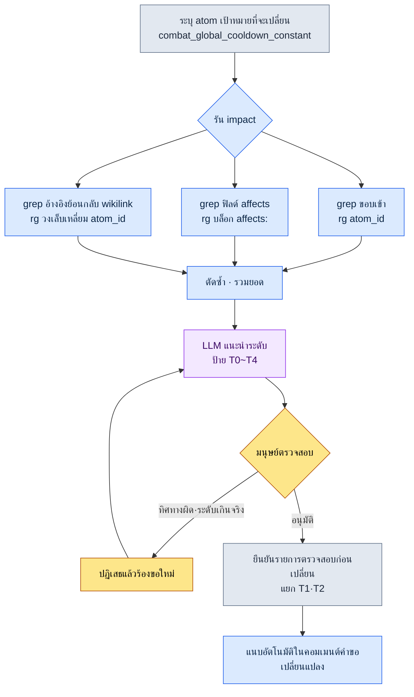

# 18.4 เวิร์กโฟลว์ grep วัดผลกระทบของเอกสาร — ดึงขอบเขตผลกระทบออกมาด้วย impact

วันจันทร์ เวลา 10 โมงเช้า สมาชิกทีม A ผู้ดูแลระบบการต่อสู้โยนคำถามหนึ่งบรรทัดลงในแชตภายในทีมว่า "ลดคูลดาวน์ส่วนกลางจาก 0.5 วินาทีลงมาเป็น 0.4 วินาทีได้ไหมครับ" มันคืองานเปลี่ยนตัวเลขเพียงตัวเดียว อย่างน้อยก็ดูเผินๆ ผมอ่านบรรทัดนั้นแล้วมือก็หยุดนิ่ง เพราะในหัวนึกไม่ออกว่ามีเอกสารกี่ฉบับที่ป้อนตัวเลขนี้ไว้ มี atom ของการปรับสมดุลสกิลกี่ตัวที่ออกแบบขึ้นโดยถือค่าคงที่นี้เป็นเงื่อนไขตั้งต้น และถ้าเปลี่ยนมันแล้วสูตรในชีตไหนบ้างจะพัง การคิดว่านึกออกแล้วต่างหากที่เป็นอุบัติเหตุ ความจริงเบื้องหลังเหตุการณ์ "ไม่เห็นเอกสารฉบับนั้น" ที่ระเบิดออกมา 8 ถึง 12 ครั้งต่อไตรมาส ก็คือความเข้าใจผิดเช่นนี้นี่เอง

ผมจึงตัดสินใจว่าจะไม่ท่องจำคำตอบ แต่จะพิมพ์เพียงบรรทัดเดียวแทน

```
impact combat_global_cooldown_constant
```

บทนี้จะดูกันแบบดิบๆ ว่าบรรทัดเดียวนั้นคายอะไรออกมา และจะแสดงให้เห็นว่าการดึงขอบเขตผลกระทบไม่ใช่คำพูดเชิงนามธรรม แต่เป็นการกระทำที่เป็นรูปธรรม คือการใช้ grep กวาดรวบสามสาย ได้แก่ ขอบเข้า (inbound edge), ออนโทโลยี affects, และการอ้างอิงย้อนกลับของ wikilink

---

## 18.4.1 ขอบเขตผลกระทบเข้ามาได้สามสาย

คำถามที่ว่า "ถ้าเปลี่ยน atom นี้แล้วอะไรจะได้รับผลกระทบบ้าง" แท้จริงแล้วคือคำถามสามข้อ ถ้านำทั้งสามมาปนกันคำตอบก็ขุ่นมัว แต่ถ้าแยกทั้งสามออกจากกัน ก็จะลงตัวเป็น grep สายละหนึ่งบรรทัด

หนึ่ง **ขอบเข้า (inbound edge)** — ใครชี้มาที่ฉัน เมื่อ atom A อ้างอิง atom B นั่นคือขอบในทิศ A→B สิ่งที่เป็นอันตรายเวลาเปลี่ยน B คือเหล่า A ที่ชี้มาที่ B นั่นคือลูกศรที่พุ่งเข้าหา B จึงต้องดูขอบเข้า (มีใครมองมาที่ฉัน) ไม่ใช่ขอบออก (ฉันมองใคร) คลื่นกระแทกของการเปลี่ยนแปลงจะย้อนทวนขึ้นไปตามลูกศร

สอง **ออนโทโลยี affects** — เชิงความหมายแล้วมันส่งผลต่ออะไร นี่คือฟิลด์ `affects:` ที่ระบุไว้ใน frontmatter ของ atom แม้ชื่อจะไม่ปรากฏโดยตรง แต่เป็นการเชื่อมโยงเชิงความหมายที่ผู้ออกแบบได้ประกาศไว้ว่า "สิ่งนี้ส่งผลต่อสิ่งนั้น" มันคือสิ่งที่มนุษย์ป้อนไว้ล่วงหน้าเพื่อแก้ปัญหานามแฝงและคำพ้องความหมายที่ grep จับไม่ได้

สาม **การอ้างอิงย้อนกลับของ wikilink** — เอกสารที่ลิงก์มาที่ฉันอย่างชัดเจนในรูปแบบ `[[atom_id]]` มีความน่าเชื่อถือสูงที่สุด เพราะไม่ใช่การบังเอิญตรงกันของคำ แต่เป็นลิงก์ที่ผู้เขียนตั้งใจวางไว้

หากมองความสัมพันธ์ของทั้งสามสายเป็นแผนภาพ ก็เป็นดังนี้

<svg viewBox="0 0 640 300" xmlns="http://www.w3.org/2000/svg" font-family="sans-serif" font-size="13">
  <rect x="250" y="125" width="140" height="50" rx="8" fill="#2d3142" />
  <text x="320" y="148" fill="#ffffff" text-anchor="middle" font-weight="bold">combat_global</text>
  <text x="320" y="165" fill="#ffffff" text-anchor="middle" font-weight="bold">_cooldown_constant</text>

  <rect x="20" y="20" width="170" height="44" rx="6" fill="#e8eaf0" stroke="#5b6178" />
  <text x="105" y="40" text-anchor="middle" font-weight="bold">ขอบเข้า</text>
  <text x="105" y="56" text-anchor="middle" font-size="11">ใครอ้างอิงมาที่ฉัน</text>

  <rect x="20" y="128" width="170" height="44" rx="6" fill="#e8eaf0" stroke="#5b6178" />
  <text x="105" y="148" text-anchor="middle" font-weight="bold">ออนโทโลยี affects</text>
  <text x="105" y="164" text-anchor="middle" font-size="11">การประกาศฟิลด์ affects:</text>

  <rect x="20" y="236" width="170" height="44" rx="6" fill="#e8eaf0" stroke="#5b6178" />
  <text x="105" y="256" text-anchor="middle" font-weight="bold">อ้างอิงย้อนกลับ wikilink</text>
  <text x="105" y="272" text-anchor="middle" font-size="11">ลิงก์ระบุ [[atom_id]]</text>

  <line x1="190" y1="42" x2="252" y2="135" stroke="#5b6178" stroke-width="2" marker-end="url(#arr)" />
  <line x1="190" y1="150" x2="248" y2="150" stroke="#5b6178" stroke-width="2" marker-end="url(#arr)" />
  <line x1="190" y1="258" x2="252" y2="165" stroke="#5b6178" stroke-width="2" marker-end="url(#arr)" />

  <rect x="450" y="125" width="170" height="50" rx="8" fill="#3d5a3d" />
  <text x="535" y="148" fill="#ffffff" text-anchor="middle" font-weight="bold">รายการขอบเขตผลกระทบ</text>
  <text x="535" y="165" fill="#ffffff" text-anchor="middle" font-size="11">ตัดซ้ำ · ติดป้ายระดับ</text>
  <line x1="390" y1="150" x2="448" y2="150" stroke="#3d5a3d" stroke-width="2.5" marker-end="url(#arr2)" />

  <defs>
    <marker id="arr" markerWidth="8" markerHeight="8" refX="6" refY="3" orient="auto"><path d="M0,0 L6,3 L0,6 Z" fill="#5b6178"/></marker>
    <marker id="arr2" markerWidth="8" markerHeight="8" refX="6" refY="3" orient="auto"><path d="M0,0 L6,3 L0,6 Z" fill="#3d5a3d"/></marker>
  </defs>
</svg>

สิ่งที่มัดสามสายเข้าไว้ในเครื่องมือเดียวคือ `impact` ในหัวข้อถัดไป เราจะดูผลลัพธ์ที่เครื่องมือนี้คายออกมาจริงทั้งก้อน

---

## 18.4.2 บันทึกเซสชันจริง (worked transcript) — รัน impact หนึ่งรอบ

แทนที่จะอธิบายด้วยคำพูด ผมจะติดตามไปทีละขั้นตั้งแต่ต้นจนจบของหนึ่งรอบจริง โดยรวมทั้งพรอมต์ฉบับเต็ม ผลลัพธ์ดิบของเครื่องมือ (ไม่ขัดเกลา) ส่วนที่ผมตรวจสอบและปฏิเสธ ไปจนถึงการร้องขอใหม่ทั้งหมด

### พรอมต์ (ฉบับเต็ม)

ผมขอให้ Claude รันเวิร์กโฟลว์ `impact` ตัวเวิร์กโฟลว์เองคือเชลล์ที่เรียก ripgrep แต่การตีความผลลัพธ์และการแนะนำระดับนั้นเป็นหน้าที่ของ Claude

```
ช่วยรันเวิร์กโฟลว์ impact กับ combat_global_cooldown_constant ให้หน่อย
ดึงสามสาย (ขอบเข้า / affects / อ้างอิงย้อนกลับ wikilink) ด้วย grep แยกกัน
แล้วรวมรายการซ้ำเข้าด้วยกัน จากนั้นติดคำแนะนำระดับผลกระทบให้แต่ละเป้าหมายที่ได้รับผลกระทบ
เนื้อหาที่จะเปลี่ยนคือ "คูลดาวน์ส่วนกลาง 0.5 วินาที → 0.4 วินาที"
```

### ผลลัพธ์ดิบของ Claude (คงไว้ตามเดิม ไม่ย่อ)

```
จะดำเนินการสามสายตามลำดับ

[1/3] ขอบเข้า — ตำแหน่งที่อ้างอิง atom นี้
$ rg -n "combat_global_cooldown_constant" --type md docs/ atoms/

atoms/combat/combat_skill_cooldown_rule.md:34:  base: combat_global_cooldown_constant
atoms/combat/combat_gcd_ui_feedback.md:12:  depends_on: combat_global_cooldown_constant
docs/spec/combat_v3.md:42:  อ้างอิงคูลดาวน์ส่วนกลาง (combat_global_cooldown_constant) เป็นเกณฑ์
docs/spec/skill_design.md:18:  คูลดาวน์ออกแบบเป็นทวีคูณของ combat_global_cooldown_constant
docs/balance/refgame_comparison.md:77:  refgame คือ 0.5 วินาที combat_global_cooldown_constant ของเราก็เท่ากัน

→ พบการอ้างอิงโดยตรง 5 รายการ

[2/3] ออนโทโลยี affects — จุดที่ระบุ atom นี้ไว้ในฟิลด์ affects
$ rg -n "^\s*-?\s*combat_global_cooldown_constant" -B3 atoms/ | rg -B3 "affects:"

atoms/combat/combat_dps_curve.md:
  affects:
    - combat_global_cooldown_constant   ← (ระวัง: ต้องตรวจสอบทิศทาง)

→ 1 รายการ แต่นี่คือกรณีที่ dps_curve ประกาศว่า "ส่งผลกระทบ"
  ซึ่งทิศทางอาจกลับกัน ต้องให้มนุษย์ตรวจสอบ — ดูรายการตรวจสอบด้านล่าง

[3/3] อ้างอิงย้อนกลับ wikilink — ลิงก์รูปแบบ [[...]]
$ rg -n "\[\[combat_global_cooldown_constant" --type md

docs/spec/combat_v3.md:42:  ...[[combat_global_cooldown_constant]]...
atoms/combat/combat_skill_cooldown_rule.md:34: ...[[combat_global_cooldown_constant]]...

→ 2 รายการ ทั้งคู่เป็นตำแหน่งที่จับได้แล้วใน [1/3] (ซ้ำ)

[รวมยอด — เป้าหมายผลกระทบเฉพาะหลังตัดซ้ำ]
1. atoms/combat/combat_skill_cooldown_rule.md   (ขอบเข้า+wikilink)
2. atoms/combat/combat_gcd_ui_feedback.md       (ขอบเข้า)
3. docs/spec/combat_v3.md                        (ขอบเข้า+wikilink)
4. docs/spec/skill_design.md                     (ขอบเข้า)
5. docs/balance/refgame_comparison.md            (ขอบเข้า)
6. atoms/combat/combat_dps_curve.md              (affects — ทิศทางยังไม่ยืนยัน)

[คำแนะนำระดับ — ตามเกณฑ์ผลกระทบ 5 ระดับใน 18.2]
1. combat_skill_cooldown_rule    → T1 (คูลดาวน์ของทุกสกิลเป็นทวีคูณของค่าคงที่นี้)
2. combat_gcd_ui_feedback        → T2 (จังหวะ UI feedback ต้องปรับแก้เชิงภาพ)
3. combat_v3.md                  → T3 (อัปเดตตัวเลขในเอกสารสเปก)
4. skill_design.md               → T3 (อัปเดตตัวเลขในเอกสารออกแบบ)
5. refgame_comparison.md         → T2 (ตารางเปรียบเทียบเบนช์มาร์ก ต้องคำนวณช่องว่างเทียบ refgame ใหม่)
6. combat_dps_curve.md           → ยังไม่ระบุ (ระบุระดับหลังตรวจสอบทิศทาง)
```

### การตรวจสอบ / ปฏิเสธโดยมนุษย์

จุดที่ผมหยุดมีสองแห่ง

ปฏิเสธ 1 — **ทิศทางของ affects** การที่ `combat_dps_curve.md` เขียนค่าคงที่ของเราไว้ในฟิลด์ `affects:` คือการประกาศว่า dps_curve *ส่งผลกระทบ* ต่อค่าคงที่นี้ แต่ตอนนี้สิ่งที่เรากำลังเปลี่ยนคือฝั่งค่าคงที่ นั่นคือทิศทางของลูกศรกลับกัน ไม่ใช่ dps_curve เปลี่ยนค่าคงที่ แต่เมื่อค่าคงที่เปลี่ยน เงื่อนไขตั้งต้นในการคำนวณของ dps_curve ต่างหากที่สั่นคลอน การที่ Claude ระงับไว้อย่างตรงไปตรงมาว่า "ต้องตรวจสอบทิศทาง" นั้นถูกต้อง ผมจึง **คงรายการนี้ไว้เป็นเป้าหมายผลกระทบ** แต่จัดประเภทใหม่ไม่ใช่เป็น affects หากเป็น "การพึ่งพาเชิงความหมายในทิศทางย้อนกลับ" และยืนยันเป็น T2

ปฏิเสธ 2 — **การมองตารางเปรียบเทียบ refgame เป็น T2** นั้นประเมินเกินจริง `refgame_comparison.md` เป็นเพียงตารางเปรียบเทียบตัวเลขล้วนๆ กับเกมภายนอก เมื่อตัวเลขของเราเปลี่ยน ก็แค่แก้ช่องเดียวในตารางจาก 0.5→0.4 ก็จบ และไม่มีระบบใดใช้ตารางนี้เป็นอินพุต จึงลดระดับลงเป็น T3 (อัปเดตตัวเลขในเอกสาร)

### การร้องขอใหม่

```
ช่วยแก้สองจุดแล้วจัดตารางผลกระทบใหม่ให้หน่อย
1) combat_dps_curve.md คงเป็นเป้าหมายผลกระทบ เปลี่ยนป้ายเป็น "การพึ่งพาเชิงความหมายในทิศทางย้อนกลับ"
   ยืนยันระดับ T2
2) refgame_comparison.md ลดระดับ T2 → T3 (ไม่มีระบบใดใช้เป็นอินพุต แก้ตารางช่องเดียว)
แล้วรวมเฉพาะ T1·T2 แยกเป็นรายการ "ต้องตรวจสอบก่อนเปลี่ยน" ให้ด้วย
```

ผลลัพธ์สุดท้ายที่ Claude จัดมามีดังนี้

```
[ต้องตรวจสอบก่อนเปลี่ยน — T1·T2]
T1  combat_skill_cooldown_rule.md   คูลดาวน์ของทุกสกิลเป็นทวีคูณของค่าคงที่นี้
T2  combat_gcd_ui_feedback.md       ปรับจังหวะ UI feedback ใหม่
T2  combat_dps_curve.md             การพึ่งพาเชิงความหมายในทิศทางย้อนกลับ — ตรวจสอบเงื่อนไขตั้งต้นของเส้นโค้ง DPS ใหม่

[อัปเดตตัวเลขในเอกสารเท่านั้น — T3]
T3  combat_v3.md / skill_design.md / refgame_comparison.md
```

เป้าหมายผลกระทบ 6 รายการที่ตอนแรก "นึกไม่ออก" ในหัว กลายเป็นรายการที่ถูกจัดลำดับความสำคัญด้วย grep หนึ่งรอบและการตัดสินของมนุษย์สองครั้ง นี่คือเนื้อแท้ของการดึงขอบเขตผลกระทบ เครื่องมือกวาดรวบผู้ต้องสงสัยทั้งหมด แล้วมนุษย์จับทิศทางและระดับ

---

## 18.4.3 ไปป์ไลน์การดึง — อะไรเป็นอัตโนมัติ อะไรเป็นของมนุษย์

หากนำหนึ่งรอบในหัวข้อก่อนหน้ามาทำให้เป็นกระแสทั่วไป ก็เป็นดังนี้ หัวใจอยู่ที่ว่าขั้นตอนอัตโนมัติกับขั้นตอนของมนุษย์แยกกันตรงไหน



ส่วนที่เป็นอัตโนมัติคือ grep สามสายกับการรวมยอด และ *ร่าง* ของการระบุระดับ ส่วนที่เป็นของมนุษย์มีเพียงหนึ่งเดียวคือ **การตัดสินขั้นสุดท้ายเรื่องทิศทางและระดับ** ทั้ง affects ทิศทางย้อนกลับและการลดระดับ refgame ที่เห็นในรอบก่อนหน้าก็เกิดขึ้น ณ ตำแหน่งนี้พอดี ถ้าเชื่อเครื่องมือ 100% ก็จะเกิดอุบัติเหตุสองแบบ คือถอด affects ทิศทางย้อนกลับออกจากเป้าหมายผลกระทบ หรือปกป้องตารางเปรียบเทียบเกินเหตุจนต้องวนรีวิวที่ไม่จำเป็นทุกครั้ง การวางเส้นแบ่งระหว่างอัตโนมัติกับมนุษย์ไว้ที่จุดเดียวนี้คือเจตนาในการออกแบบเวิร์กโฟลว์

---

## 18.4.4 เอกสารอ้างอิงรูปแบบ grep สามสาย

ผมจะเขียนรูปแบบ ripgrep ที่ภายในของ impact เรียกใช้ลงไปตามจริง นี่คือเนื้อแท้ของเครื่องมือ — ไม่ใช่โครงสร้างพื้นฐานหรูหรา แต่เป็นนิพจน์ปรกติที่ผ่านการตรวจสอบแล้วสามบรรทัด

ขอบเข้า คือทุกตำแหน่งที่ atom ID ปรากฏในเนื้อหาเอกสาร กวาดได้กว้างที่สุด

```bash
rg -n "combat_global_cooldown_constant" --type md docs/ atoms/
```

ฟิลด์ affects ดูเฉพาะกรณีที่ atom ID อยู่ภายในบล็อก `affects:` ใช้ `-B3` ดึง 3 บรรทัดก่อนหน้ามาด้วย เพื่อให้มนุษย์ดูด้วยตาว่านั่นเป็นบล็อก affects หรือเป็นฟิลด์อื่น

```bash
rg -n "combat_global_cooldown_constant" -B3 atoms/ | rg -B3 "affects:"
```

อ้างอิงย้อนกลับ wikilink เฉพาะลิงก์ที่ระบุชัดและล้อมด้วยวงเล็บเหลี่ยมสองชั้น มีความน่าเชื่อถือสูงสุดจึงเป็นเป้าหมายที่ตรวจสอบก่อน

```bash
rg -n "\[\[combat_global_cooldown_constant" --type md atoms/ docs/
```

ทั้งสามรูปแบบมีความน่าเชื่อถือกับค่าความครบถ้วน (recall) แปรผกผันกันพอดี wikilink แม่นยำเกือบ 100% แต่ถ้าผู้เขียนไม่วางลิงก์ก็จับไม่ได้ ขอบเข้ากวาดได้หมดแต่มีการบังเอิญตรงกันของคำ (noise) ปนมา affects จับความหมายได้แต่ทิศทางสับสน ต้องรวมทั้งสามจึงจะอุดรูรั่ว ถ้าใช้เพียงอย่างเดียวก็จะมีจุดที่รั่วเสมอ

---

## 18.4.5 การมัดกับการ์ดการตัดสินใจ — portal_layer_change_impact_check

การดึงขอบเขตผลกระทบเป็นขั้นตอนหนึ่งของวงรอบการตัดสินใจ (§18.3) ในวินาทีที่การ์ดการตัดสินใจถูกลงทะเบียน impact จะรันโดยรับสล็อต `affected_atoms` ของการ์ดนั้นเป็นอินพุต atom ที่ตรวจสอบการเชื่อมต่อนี้คือ `portal_layer_change_impact_check`

บทบาทของ atom นี้คือ "กันไม่ให้ข้ามการตรวจสอบผลกระทบ เมื่อเป็นการเปลี่ยนแปลงที่ตัดข้าม Layer" การเปลี่ยนค่าคงที่ของคูลดาวน์เป็นเพียงตัวเลขหนึ่งตัวใน L1 (ระบบ) แต่ผลกระทบของมันลามไปถึง L3 (สูตรในชีตข้อมูล) และ L4 (รายการ QA ของบิลด์) portal_layer_change_impact_check จะตัดสินว่าการเปลี่ยนแปลงข้ามขอบเขต Layer หรือไม่ และถ้าข้ามก็จะบังคับให้รัน impact

```yaml
---
name: portal_layer_change_impact_check
type: gate
description: การเปลี่ยนแปลงที่ข้ามขอบเขต Layer ห้ามนำเข้าบิลด์ก่อนผ่านการตรวจสอบผลกระทบ
trigger:
  - เมื่อลงทะเบียนการ์ดการตัดสินใจ affected_atoms ไม่ว่าง
  - layer ของ atom ที่เปลี่ยน != layer ของ atom ที่ได้รับผลกระทบ
action:
  - รัน impact (grep สามสาย)
  - ถ้ามีเป้าหมายผลกระทบ T1·T2 ให้บล็อกการ merge ก่อนติ๊ก "ตรวจสอบเสร็จ"
---
```

ในกรณีคูลดาวน์ สิ่งที่เกตนี้จับได้ไม่ใช่ `combat_skill_cooldown_rule` (L1) แต่เป็นชีต CombatBalance (L3) ที่ใช้ rule นั้นเป็นอินพุต คอลัมน์ทวีคูณคูลดาวน์ของชีตเขียนสูตรขึ้นโดยถือค่าคงที่เป็นเงื่อนไขตั้งต้น grep กวาด atom จากเอกสาร และเกตก็ผลักดันว่า "นี่ข้าม Layer แล้ว ไปดูถึงชีตด้วย" ถ้าทั้งสองไม่ถูกมัดเข้าด้วยกัน ก็จะเกิดการตกหล่นแบบฉบับที่เอกสารถูกอัปเดตแล้วแต่ชีตยังคงค้างอยู่บนเงื่อนไขตั้งต้นเดิม

---

## 18.4.6 การวัดผล — สิ่งที่เวิร์กโฟลว์เรียกคืนกลับมา

นี่คือความเปลี่ยนแปลงที่สังเกตได้จากการดำเนินงานโปรเจกต์ A ของผู้เขียน ตัวเลขเวลาเป็นการประมาณของผู้เขียน (ยังไม่ได้ตรวจสอบ) ส่วนจำนวนอุบัติเหตุการตกหล่นเป็นค่าที่นับจริงในการทบทวนรายไตรมาส

| รายการ | ไม่มีเวิร์กโฟลว์ | ดำเนินงานด้วย impact |
|---|---|---|
| เวลาที่ใช้เข้าใจ atom ที่ได้รับผลกระทบ | พึ่งความจำ (ไม่ครบ) | 1\~2 นาที (grep ทั้งหมด) |
| อุบัติเหตุการตกหล่นจากการเปลี่ยนแปลง | 8\~12 ครั้งต่อไตรมาส (นับจริง) | 1\~2 ครั้งต่อไตรมาส (นับจริง) |
| การแนบผลกระทบในคำขอเปลี่ยนแปลง | มนุษย์ทำเป็นครั้งคราว | เกตบังคับ |
| สมาชิกทีมใหม่เข้าใจผลกระทบ | หลายวัน (บอกปากเปล่าทีละราย) | 30 นาที (เครื่องมือ + การ์ด) |
| ต้นทุนโครงสร้างพื้นฐาน | พิจารณานำกราฟ DB เข้ามา | ripgrep + เชลล์เท่านั้น |

บรรทัดสุดท้ายคือบทสรุปของทั้งบทนี้ โปรเจกต์ A เคยพิจารณากราฟ DB และดัชนีการค้นหา แต่สุดท้ายก็มาลงตัวที่ ripgrep กับเชลล์เล็กๆ เครื่องมือวัดที่แม่นยำย่อมแม่นกว่าสายวัดก็จริง แต่เครื่องมือที่หยิบมาใช้ทุกวันจะค่อยๆ ลู่เข้าหาฝั่งสายวัดที่ไม่เสียและไม่ต้องมีโครงสร้างพื้นฐาน การที่อุบัติเหตุการตกหล่นลดจาก 8\~12 ครั้งเหลือ 1\~2 ครั้ง ไม่ใช่เพราะเครื่องมือประณีตขึ้น แต่เพราะมันรันได้ครบทุกครั้งโดยไม่ตกหล่น

---

## 18.4.7 ข้อจำกัด — สิ่งที่ grep จับไม่ได้

แม้จะมัดทั้งสามสายเข้าด้วยกัน ก็ยังมีจุดที่รั่ว การรู้แล้วใช้กับการไม่รู้แล้วเชื่อนั้นต่างกัน

นามแฝงและคำย่อ ถ้าเนื้อหาเขียนแค่ว่า "GCD (Global Cooldown, คูลดาวน์ส่วนกลาง)" ก็จะไม่ติด grep ของ `combat_global_cooldown_constant` การชดเชยคือขยายคำค้นด้วยนิพจน์ปรกติ — `(combat_global_cooldown_constant|GCD|전역\s?쿨다운)` จัดการพจนานุกรมคำย่อของทีมแยกต่างหาก แล้วสังเคราะห์รวมเข้าด้วยกันอัตโนมัติเวลาค้นหา

พื้นที่ที่ย้อนกลับไม่ได้ grep เป็นเครื่องมือของขั้นที่ย้อนกลับได้ ก่อนนำเข้าบิลด์ ผลกระทบระหว่างเอกสาร atom และชีตล้วนมองเห็นได้ด้วย grep แต่ปฏิกิริยาหลังจากบิลด์ออกไปและผู้เล่นสัมผัสคูลดาวน์ 0.4 วินาที — เสียงบ่นในคอมมูนิตี้ ความเปลี่ยนแปลงของเทมโปที่สัมผัสได้ — ไม่ใช่เป้าหมายของ grep หลักการจึงเรียบง่าย **การตรวจสอบด้วย grep ทั้งหมดต้องจบก่อนนำเข้าบิลด์** เมื่อข้ามไปสู่ขั้นที่ย้อนกลับไม่ได้ สิ่งที่ grep บอกได้ก็จะลดลงอย่างรวดเร็ว

ตำแหน่งของการตรวจสอบโดย LLM เช่นเดียวกับที่มนุษย์จับทิศทาง affects และระดับในรอบก่อนหน้า ถ้าเสียบ LLM เข้าไปในการตัดสินความเหมาะสมของผู้ต้องสงสัยจาก grep ก็จะกรอง noise ออกได้ แต่ LLM เองก็ไม่ใช่ 100% การอนุมัติขั้นสุดท้ายจึงเป็นของมนุษย์ ในโครงสร้างที่เครื่องมือ·LLM·มนุษย์กรองทีละขั้น ความแม่นยำจะไปถึงระดับที่ดำเนินงานได้ ถ้าตัดออกแม้เพียงขั้นเดียว อุบัติเหตุชนิดที่ขั้นนั้นเคยจับพลาดก็จะกลับเข้ามาอีก

---

> **การประยุกต์นอกเกม** นิสัยที่กวาด "ถ้าเปลี่ยนรายการนี้แล้วตรงไหนจะสั่นคลอน" ด้วยการค้นหาทั้งหมดแทนความจำ ให้ผลแบบเดียวกันกับพนักงานออฟฟิศคนใดก็ตามที่ทำงานด้วยเอกสารและสเปรดชีต เวลาแก้ข้อสัญญาข้อหนึ่ง ถ้าพยายามนึกในหัวว่ามีสัญญา อีเมลแจ้ง และ FAQ ลูกค้ากี่แห่งที่ระบุหมายเลขข้อนั้นไว้ ก็จะตกหล่นอย่างแน่นอน แต่ถ้า grep ทั้งโฟลเดอร์ด้วยคีย์เวิร์ดให้ครบทั้งหมด แล้วให้มนุษย์จัดประเภทเป็น "ต้องแก้ / แค่ทำเครื่องหมาย / ไม่เกี่ยว" การตกหล่นก็จะหายไป ตัวอย่างเช่น เวลาผู้รับผิดชอบบัญชีเปลี่ยนรหัสบัญชีหนึ่ง ถ้าค้นหาชีตปิดบัญชี เทมเพลตรายงาน และมาโครที่อ้างอิงรหัสนั้นให้ครบทั้งหมด แล้วทำเป็นรายการตรวจสอบก่อนเปลี่ยน ก็จะป้องกันอุบัติเหตุปิดงบรายไตรมาสแบบ "ไม่เห็นชีตนั้นชีตเดียว" ได้อย่างเป็นโครงสร้าง

## 18.4.8 ลองทำดู

### setup

ถ้าเอกสารและ atom ถูกจัดการเป็นข้อความธรรมดา (.md) และติดตั้ง ripgrep (`rg`) ไว้แล้ว ก็พร้อมเรียบร้อย ถ้ามีกฎการตั้งชื่อ atom ID (สเนกเคส, ID เฉพาะ) ความแม่นยำของ grep ก็จะสูงขึ้นมาก

```bash
# ตรวจสอบ: atom ID หนึ่งตัวปรากฏในเอกสารทั้งหมดกี่ครั้ง
rg -c "combat_global_cooldown_constant" docs/ atoms/
```

### prompt

ให้ atom เป้าหมายที่จะเปลี่ยนและเนื้อหาที่จะเปลี่ยน แล้วร้องขอการดึงสามสาย + คำแนะนำระดับ

```
ช่วยรัน impact กับ <atom_id> ให้หน่อย
ดึงสามสาย ขอบเข้า / affects / อ้างอิงย้อนกลับ wikilink ด้วย grep แยกกัน
แล้วรวมรายการซ้ำ จากนั้นแนะนำระดับผลกระทบ 18.2 (T0~T4)
เนื้อหาที่จะเปลี่ยน: <จากอะไรเป็นอะไร>
แยกเฉพาะ T1·T2 เป็นรายการ "ตรวจสอบก่อนเปลี่ยน" ให้ด้วย
```

### verify

อย่าเชื่อผลลัพธ์ของเครื่องมือทั้งดุ้น ให้ตรวจสองอย่างด้วยมือ

1. **ทิศทางของ affects** — ดูว่ารายการที่จับได้ด้วย affects เป็น "ฝั่งที่ฉันส่งผลกระทบ" หรือ "ฝั่งที่ฉันได้รับผลกระทบ" ถ้าทิศทางกลับกัน ให้แก้ป้าย
2. **ระดับเกิน/ต่ำเกินจริง** — ถ้าตารางหรือเอกสารที่ใช้เปรียบเทียบถูกยกขึ้นเป็น T1·T2 ให้ถามว่า "มีระบบใดใช้เอกสารนี้เป็นอินพุตไหม" ถ้าไม่มี ให้ลดลงเป็น T3

หลังตรวจสอบแล้ว เพียงแนบรายการ T1·T2 ในคอมเมนต์คำขอเปลี่ยนแปลง หนึ่งรอบก็ปิดลง

### ฉบับย่อสำหรับคนเดียว

ถ้าเป็นงานส่วนตัวที่ไม่มีทั้งเครื่องมือและกราฟ atom ก็สามารถให้ผลแบบเดียวกันได้ด้วยคำสั่งหนึ่งบรรทัดและโน้ตหนึ่งช่อง

```bash
# ค้นหาทั้งโฟลเดอร์ทั้งหมดด้วยชื่อแนวคิดที่จะเปลี่ยน
rg -n "전역쿨다운|GCD|global_cooldown" .
```

นำผลการค้นหาแปะลงในแผ่นจดไว้ตามนั้น แล้วเขียนด้วยมือข้างแต่ละบรรทัดว่าเป็นหนึ่งในสามคือ "ต้องแก้ / แค่ตาราง / ไม่เกี่ยว" นี่คือ impact ฉบับคนเดียว หัวใจไม่ได้อยู่ที่ความประณีตของเครื่องมือ แต่อยู่ที่ตัวกระบวนการเองคือ "กวาดให้ครบทั้งหมดโดยไม่พึ่งความจำ แล้วให้มนุษย์จัดประเภท" ถ้ามีกระบวนการ การตกหล่นก็ลดลง ถ้าไม่มี ความอึดอัดเช้าวันจันทร์นั้นก็จะวนซ้ำทุกครั้ง

---

### สรุปประเด็นสำคัญของบท
- ขอบเขตผลกระทบมีสามสายคือ ขอบเข้า·affects·อ้างอิงย้อนกลับ wikilink และ impact กวาดทั้งสามให้ครบทั้งหมด
- อัตโนมัติทำถึงการรวมยอด grep และร่างระดับ ส่วนมนุษย์รับผิดชอบเพียงจุดเดียวคือการตัดสินทิศทาง affects และระดับ
- grep เป็นสายวัดของขั้นที่ย้อนกลับได้ จึงต้องตรวจสอบให้จบก่อนนำเข้าบิลด์ และมันคงทนกว่ากราฟ DB

### ตัวอย่างบทถัดไป
- 19.1 การดำเนินงานของทีมลีด — การติดตามการตัดสินใจ·ผลกระทบหมุนไปในระดับทีมอย่างไร
