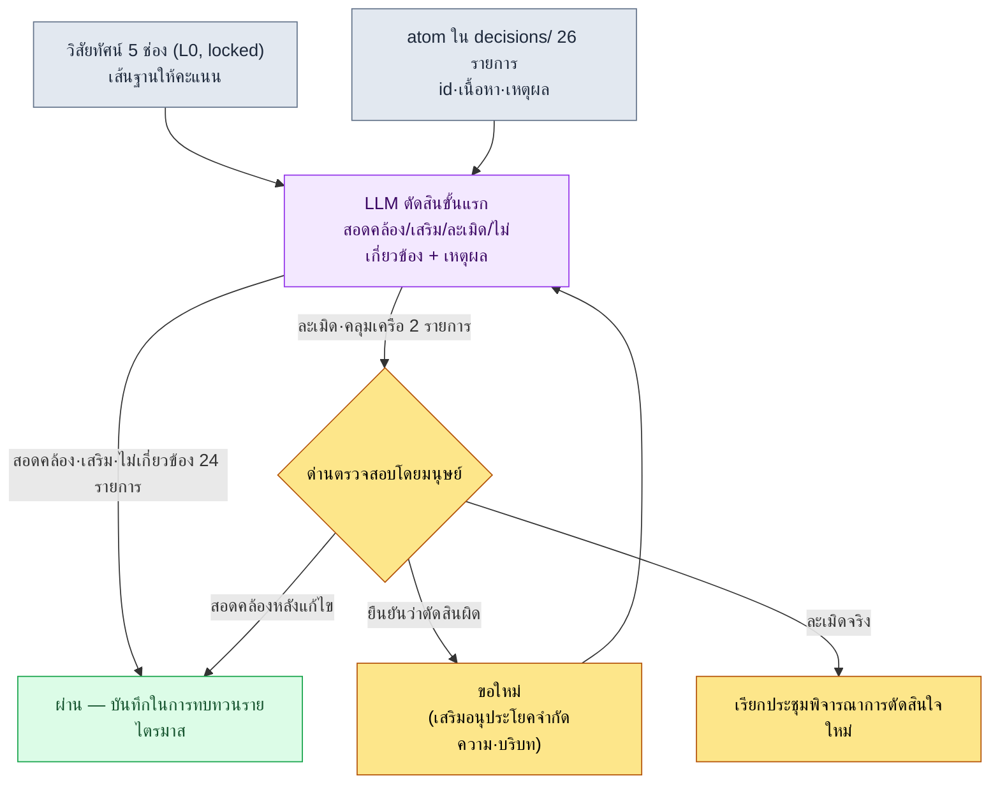

# 19.1 เปลี่ยนวิสัยทัศน์ให้เป็นเกณฑ์ให้คะแนนการตัดสินใจ — ลองส่ง decisions/ ทั้ง 26 รายการให้ LLM ตรวจ

> ผู้อ่านหลัก: Design Director (ผู้อำนวยการฝ่ายออกแบบ) และ Lead นักออกแบบเกม ที่นำทีมขนาดกลาง (10–50 คน)
> ฉบับย่อสำหรับนักพัฒนาคนเดียว/งานอดิเรก: §19.1.8 「ถ้าทำคนเดียวก็เท่านี้พอ」

แม้แต่ในทีมที่เขียนเอกสารวิสัยทัศน์ไว้อย่างดีเพียงหน้าเดียว ก็ยังเจอปัญหาเดิมซ้ำ ๆ วิสัยทัศน์ถูกแขวนไว้บนผนัง แต่กลับไม่มีใครตรวจว่าการตัดสินใจที่สะสมขึ้นทุกสัปดาห์นั้นสอดคล้องกับวิสัยทัศน์หรือไม่ ตอนทบทวนรายไตรมาสก็หยิบมาดูทีหนึ่ง แต่ ณ จุดนั้นมีการตัดสินใจอีกราวสามรายการซ้อนทับอยู่บนการตัดสินใจที่หลุดออกนอกแนวไปแล้ว การจะให้วิสัยทัศน์เป็น "จุดอ้างอิงเวลาเกิดข้อพิพาท" ได้ สิ่งที่สำคัญกว่าการเขียนคือ **การลองเทียบการตัดสินใจแต่ละครั้งกับวิสัยทัศน์** และงานเทียบนั้น ถ้าให้คนทำด้วยมือก็น่าเบื่อและตกหล่นง่าย — เป็นงานที่เหมาะจะส่งต่อให้ AI อย่างยิ่ง

บทนี้ผูกสองเรื่องเข้าด้วยกัน ส่วนแรกคือเวิร์กโฟลว์ที่นำวิสัยทัศน์ซึ่งเขียนเสร็จแล้วมาหมุนเป็นเกณฑ์ให้คะแนนการตัดสินใจ — รอบการทำงานหนึ่งรอบที่นำ atom การตัดสินใจจริงในโปรเจกต์ของผู้เขียนจำนวน 26 รายการมาส่งให้ LLM ตรวจ ให้ตัดสินว่า "ละเมิดช่องของวิสัยทัศน์" หรือไม่ แล้วในจำนวนนั้นมีหนึ่งรายการที่ตัดสินผิด ซึ่งมนุษย์เป็นผู้จับได้ ส่วนหลังคือคำถามว่าเกณฑ์ให้คะแนนนี้ครอบคลุมการตัดสินใจของใครได้บ้าง นั่นคือเรื่อง **การมอบหมายอำนาจ (delegation)** ทฤษฎีภาวะผู้นำทั่วไป (ทำไมวิสัยทัศน์จึงสำคัญ ทำไมการมอบหมายจึงเป็นเครื่องมือในการเติบโต) มีอยู่ในหนังสือเล่มอื่นอย่างเพียงพอแล้ว บทนี้จึงโฟกัสเฉพาะ *จุดที่นำหลักการเหล่านั้นมาหมุนเป็นเวิร์กโฟลว์ AI* เท่านั้น

---

## 19.1.1 วิสัยทัศน์ · โรดแมป · ตารางเวลา — เพียงชี้ให้เห็นว่าทำไมสามชั้นนี้จึงต่างกันแล้วผ่านไป

ต้องเริ่มจากการทำความเข้าใจประโยคที่ว่าวิสัยทัศน์เป็นตัวกรองการตัดสินใจก่อน วิสัยทัศน์ โรดแมป และตารางเวลา ไม่ใช่สิ่งเดียวกัน หน่วยของเวลาและความถี่ในการเปลี่ยนแปลงต่างกัน และเมื่อความต่างนั้นพังทลาย แรงกดดันด้านตารางเวลาก็จะสั่นคลอนวิสัยทัศน์

| ชั้น | ระยะเวลา | ความถี่ในการเปลี่ยน | ความหมายของการเทียบกับวิสัยทัศน์ |
|---|---|---|---|
| วิสัยทัศน์ | 5–10 ปี | แทบไม่มี | เส้นฐานที่การตัดสินใจต้องสอดคล้องด้วย |
| โรดแมป | 1–3 ปี | รายไตรมาส | ชั้นกลางที่แปลวิสัยทัศน์ให้เป็นตารางเวลา |
| ตารางเวลา | 1–3 เดือน | รายสัปดาห์ | ไม่นำมาเทียบกับวิสัยทัศน์โดยตรง |

ประเด็นสำคัญคือ **สิ่งที่นำการตัดสินใจไปเทียบด้วยคือวิสัยทัศน์ (ชั้นที่เปลี่ยนน้อยที่สุด)** ไม่ใช่ว่าพอตารางเวลาตึงก็เปลี่ยนวิสัยทัศน์ แต่เมื่อตารางเวลาขัดกับวิสัยทัศน์ ก็ไปปรับที่ฝั่งตารางเวลา ลำดับชั้นนี้ต้องชัดเจน การตรวจอัตโนมัติในหัวข้อถัดไปจึงจะมีความหมาย เพราะถ้าเส้นฐานของการตรวจสั่นไหวทุกสัปดาห์ การตรวจเองก็ไร้ความหมาย

วิสัยทัศน์จบในหน้าเดียวด้วย 5 ช่อง เอกสารวิสัยทัศน์ของโปรเจกต์ผู้เขียนมีโครงดังนี้ เนื่องจากช่องเหล่านี้จะกลายเป็นเกณฑ์ให้คะแนนของการตรวจด้วย LLM ใน §19.1.3 จึงควรดูรูปแบบไว้ก่อน

```markdown
---
title: วิสัยทัศน์โปรเจกต์ A v2
layer: L0
locked: true   # ต้องได้ข้อตกลงร่วมจาก Game Director + CEO หากจะเปลี่ยน
---

## ช่อง 1. สิ่งที่เราสร้าง
MMORPG ที่เน้นมือถือเป็นหลัก ในจักรวาลแฟนตาซีเกาหลี

## ช่อง 2. เพื่อใคร
ผู้ใช้วัย 30–50 ปี เล่นบนมือถือเป็นหลัก ชอบเนื้อเรื่องที่จริงจังลึกซึ้ง

## ช่อง 3. ทำไม (ความแตกต่าง)
- เนื้อเรื่องลึกด้วยการเล่าเรื่องหลายชั้น (เน้นความลึก ไม่ใช่ผลิตปริมาณ)
- ให้บริการพร้อมกันทั้งเอเชียตะวันออกเฉียงใต้ + เกาหลี

## ช่อง 4. อย่างไร (คุณค่า)
- เคารพเวลาของผู้ใช้ (ลดเนื้อหาสิ้นเปลืองให้น้อยที่สุด)
- ตัดสินใจโดยสมดุลระหว่างข้อมูล + คน
- ข้อตกลงร่วมของทีมมาก่อนความเร็วในการตัดสินใจ

## ช่อง 5. อะไรที่ไม่ใช่
- ไม่ใช่โมเดลการจ่ายเงินแบบ F2P ที่เร่งเร้ารุนแรง
- ไม่ใช่เกมที่เน้น PvP
- ไม่ใช่เกมที่บังคับเข้าเล่นทุกวันวันละ N ชั่วโมง
```

ช่อง 5 ("อะไรที่ไม่ใช่") เป็นช่องที่ทำงานหนักที่สุดในการตรวจ เพราะการละเมิดมักไม่ได้เกิดจาก "สิ่งที่ตกลงว่าจะทำ" แต่เกิดจากการแอบทำ "สิ่งที่ตกลงว่าจะไม่ทำ"

---

## 19.1.2 การตัดสินใจถูกสะสมไว้เป็น atom อยู่แล้ว

จะนำวิสัยทัศน์ไปเทียบกับอะไร ทีมของผู้เขียนตรึงการตัดสินใจสำคัญทุกครั้งไว้เป็น atom หนึ่งแผ่นในโฟลเดอร์ `decisions/` เป็นบันทึกข้อเท็จจริงที่ระบุวันที่ · ผู้เกี่ยวข้อง · เหตุผลไว้ชัดเจน ปัจจุบันสะสมไว้ 26 รายการ อินพุตของการตรวจคือ 26 รายการนี้ — ไม่ได้สร้างขึ้นใหม่ แต่นำสิ่งที่มีอยู่แล้วไปเทียบ

รูปแบบจริงของ atom การตัดสินใจหนึ่งแผ่นเป็นดังนี้ (ทำให้ไม่ระบุตัวตน)

```markdown
---
type: decision
id: D0019
date: 2026-05-12
deciders: [Game Director, Data Director]
tier: T1
---
# refgame_selective_adoption_for_mobile
นำข้อมูลการต่อสู้บางส่วนของ MMORPG อ้างอิงมาใช้กับบิลด์มือถือแบบเลือกสรร
เหตุผล: มีจังหวะการต่อสู้ที่ผ่านการตรวจสอบบนมือถือ 6 นิ้วแล้ว และหากออกแบบ
ใหม่ตั้งแต่ศูนย์ ตารางอัลฟาจะเลื่อนออกไปหนึ่งไตรมาส อย่างไรก็ตาม จะไม่นำ
โครงสร้างชักจูงการจ่ายเงิน·การเข้าเล่นมาใช้
```

ในจำนวน 26 รายการ ขอคัดตัวแทนสองสามรายการที่จะใช้เป็นอินพุตของการตรวจ (ชื่อ atom จริง, §A.3.3)

| atom id | ชื่อ atom (ทำให้ไม่ระบุตัวตน) | tier | ใจความหนึ่งบรรทัด |
|---|---|---|---|
| D0007 | `claude_role_transition_phase2` | T1 | ยกระดับ Claude จากผู้ช่วยเชิงรับ → พาร์ตเนอร์เชิงรุก |
| D0014 | `dataset_scope_alpha_split` | T2 | กำหนดเกณฑ์การแบ่งชุดข้อมูลอัลฟา |
| D0019 | `refgame_selective_adoption_for_mobile` | T1 | นำข้อมูลการต่อสู้ของเกมอ้างอิงมาใช้แบบเลือกสรร |
| D0021 | `procedural_capability_frontier_5stage` | T1 | นิยามความสามารถการสร้างแบบโพรซีเดอรัล 5 ขั้น |
| D0023 | `class_keyword_world_only` | T2 | จำกัดคีย์เวิร์ดคลาสให้อยู่ภายในจักรวาลของเกม |

ตารางนี้คืออินพุตข้อมูลของพรอมต์ในหัวข้อถัดไป หัวใจอยู่ที่การส่งทั้ง 26 รายการเข้าตรวจในคราวเดียว เพราะถ้าตอนทบทวน คนต้องเทียบ 26 รายการกับวิสัยทัศน์ทีละรายการด้วยมือ จะใช้เวลาครึ่งวัน และตั้งแต่ช่วงกลางสมาธิจะเริ่มหลุด ทำให้พลาดการละเมิด เราจึงส่งงานเทียบขั้นแรกที่น่าเบื่อนั้นให้ LLM

---

## 19.1.3 [บันทึกเซสชันจริง (worked transcript)] ลองส่งการตัดสินใจ 26 รายการไปเทียบกับวิสัยทัศน์

มาดูรอบการทำงานหนึ่งรอบจนจบจริง ๆ พรอมต์อินพุตคัดลอกไปใช้ได้ทันที และผลลัพธ์เป็นการเรียบเรียงใหม่จากเซสชันจริง

### ขั้นที่ 1 — พรอมต์: มอบวิสัยทัศน์ให้เป็นเกณฑ์ให้คะแนน และบังคับรูปแบบการตัดสิน

```
ลองนำ atom การตัดสินใจ 26 รายการมาเทียบกับวิสัยทัศน์ 5 ช่องด้านล่างทีละรายการ
แล้วตัดสินว่าแต่ละการตัดสินใจ สอดคล้อง/เสริม/ละเมิด/ไม่เกี่ยวข้อง กับวิสัยทัศน์
ถ้าเป็นละเมิดหรือไม่เกี่ยวข้อง ให้ระบุเหตุผลหนึ่งบรรทัดว่าขัดกับช่องใดและทำไม
(โดยเฉพาะให้ดูช่อง 5 "อะไรที่ไม่ใช่" ให้ดี ๆ) ถ้ารายการใดคลุมเครือ ให้ทำเครื่องหมาย
'คลุมเครือ' แล้วส่งต่อให้ฉัน ถ้าสอดคล้องไม่ต้องระบุเหตุผลก็ได้
ให้ออกมาเป็นตารางเท่านั้น (id | การตัดสิน | ช่องที่ขัด | เหตุผล | คลุมเครือ) ตัดบทสรุปรวมออก

[วิสัยทัศน์ 5 ช่อง — วางข้อความเต็มจาก §19.1.1]
[atom การตัดสินใจ 26 รายการ — id·เนื้อหา·เหตุผล]
```

ครึ่งหนึ่งของพรอมต์คือ "การบังคับรูปแบบการตัดสิน" ถ้าให้อิสระ LLM จะกลบทั้ง 26 รายการเป็น "โดยรวมแล้วสอดคล้อง" หมด หัวใจของพรอมต์นี้คือการใส่ **ป้ายการตัดสิน 4 ระดับ ภาระต้องระบุเหตุผลเฉพาะกรณีละเมิด·ไม่เกี่ยวข้อง และทางออก "ถ้าคลุมเครือให้ส่งต่อให้คน"** เข้าไป การเรียกชื่อช่อง 5 อย่างชัดเจนในประโยคเหตุผลก็เป็นความตั้งใจ — เพราะการละเมิดเกิดจาก "สิ่งที่ตกลงว่าจะไม่ทำ"

### ขั้นที่ 2 — ผลลัพธ์ของ Claude (เรียบเรียงใหม่, ตัดมาบางส่วน)

```
| id    | การตัดสิน | ช่องที่ขัด | เหตุผล                                  | คลุมเครือ |
|-------|-----------|-----------|----------------------------------------|-----------|
| D0007 | ไม่เกี่ยวข้อง | —     | การตัดสินใจเรื่องการใช้งาน Claude แกนประเมินต่างจากวิสัยทัศน์เกม |     |
| D0014 | ไม่เกี่ยวข้อง | —     | การแบ่งชุดข้อมูล เป็นการตัดสินใจเรื่องโครงสร้างภายใน |     |
| D0019 | ละเมิด    | ช่อง 5    | นำข้อมูลการต่อสู้ของเกมอ้างอิงมาใช้ → อาจขัดกับ | ★         |
|       |           |           | "ไม่ใช่โมเดลการจ่ายเงินแบบ F2P เร่งเร้ารุนแรง" |           |
| D0021 | สอดคล้อง  | ช่อง 3    |                                        |           |
| D0023 | สอดคล้อง  | ช่อง 1    |                                        |           |
| ...   |           |           |                                        |           |

(จาก 26 รายการ: สอดคล้อง 18 · เสริม 3 · ไม่เกี่ยวข้อง 3 · ละเมิด 2)
รายการที่ขอให้ตัดสินเรื่องละเมิด/คลุมเครือ: D0019, D0026 — ต้องให้คนตรวจสอบ
```

ส่วนที่มีคุณค่าที่สุดในผลลัพธ์ไม่ใช่ตาราง แต่เป็น **บรรทัดล่างสุด ซึ่งระบุการละเมิด 2 รายการและเครื่องหมายคลุมเครือ** LLM กรอง 24 รายการจาก 26 ออกไปโดยอัตโนมัติ แล้วยกขึ้นมาเพียง 2 รายการที่คนต้องดู การเทียบที่กินเวลาครึ่งวันถูกย่อเหลือการตรวจสอบ 2 รายการ แต่หนึ่งใน 2 รายการนั้นเป็นการตัดสินที่ผิด

### ขั้นที่ 3 — การตรวจสอบและการปฏิเสธ (ตำแหน่งของมนุษย์)

คนกลับมาอ่านคำตัดสินของ D0019 (`refgame_selective_adoption_for_mobile`) อีกครั้ง LLM เห็นคำว่า "นำข้อมูลการต่อสู้ของเกมอ้างอิงมาใช้" แล้วตัดสินว่าขัดกับ "ไม่ใช่โมเดลการจ่ายเงินแบบ F2P เร่งเร้ารุนแรง" ในช่อง 5 ผิวเผินคำดูเข้าท่า — เพราะเกมอ้างอิงนั้นขึ้นชื่อเรื่องการจ่ายเงินแบบก้าวร้าว

แต่ถ้าอ่านเนื้อหาของ atom จนจบ จะมีประโยคสุดท้ายอยู่ **"อย่างไรก็ตาม จะไม่นำโครงสร้างชักจูงการจ่ายเงิน·การเข้าเล่นมาใช้"** การตัดสินใจนี้นำมาเฉพาะข้อมูลจังหวะการต่อสู้ และกีดกันโครงสร้างการจ่ายเงินไว้อย่างชัดเจน เป็นการตัดสินใจที่กลับรักษาช่อง 5 ไว้ด้วยซ้ำ LLM ไม่สามารถสะท้อนประโยคจำกัดความสุดท้ายของเนื้อหา atom ลงในน้ำหนักการตัดสินได้ แล้วถูกคำที่บอกแหล่งที่มาอย่าง "เกมอ้างอิง" ลากไปจัดเป็นการละเมิด นี่ไม่ใช่การละเมิดช่อง 5 แต่เป็น **การสอดคล้อง**

เหตุผลที่เกิดการตัดสินผิดเช่นนี้ชัดเจน LLM มอง *แหล่งที่มา* ของการตัดสินใจ (เอามาจากเกมไหน) กับ *เนื้อหา* ของการตัดสินใจ (เอาอะไรมาและทิ้งอะไรไป) ด้วยน้ำหนักเท่ากัน ส่วนคนรู้ว่าอนุประโยคจำกัดความที่ว่า "อย่างไรก็ตาม จะไม่ทำ \~" คือหัวใจของการตัดสินใจ ดังนั้นคนจึงปฏิเสธและขอใหม่

```
ช่วยดู D0019 อีกครั้ง ประโยคสุดท้ายของเนื้อหา "อย่างไรก็ตาม จะไม่นำโครงสร้างชักจูง
การจ่ายเงิน·การเข้าเล่นมาใช้" คือหัวใจ ช่วยแยกสิ่งที่นำมาใช้ (ข้อมูลจังหวะการต่อสู้)
กับสิ่งที่กีดกัน (โครงสร้างการจ่ายเงิน·การเข้าเล่น) แล้วตัดสินใหม่ว่าแต่ละอย่างขัดกับช่องใด
```

LLM ตอบกลับอีกครั้งว่า "สิ่งที่นำมาใช้ (ข้อมูลการต่อสู้) สอดคล้องกับช่อง 1·2 สิ่งที่กีดกัน (โครงสร้างการจ่ายเงิน) สนับสนุนช่อง 5 อย่างชัดเจน คำตัดสินรวม: สอดคล้อง คำตัดสินละเมิดก่อนหน้านี้เป็นความผิดพลาดจากการตอบสนองเกินต่อคำที่บอกแหล่งที่มา" การโต้ตอบไปกลับเพียงครั้งเดียวนี้ทำให้ D0019 ถูกแก้จากละเมิดเป็นสอดคล้อง รายการที่ต้องตรวจสอบจริง ๆ ที่เหลืออยู่คือ D0026 เพียงหนึ่งรายการ

รอบการทำงานนี้คือหัวใจของบทนี้ **LLM ย่อ 26 รายการให้เหลือ 2 รายการก็จริง แต่หนึ่งใน 2 รายการนั้นอาจตัดสินผิดได้** การตรวจอัตโนมัติไม่ได้เป็นเครื่องมือที่ขจัดการตรวจสอบของคน แต่เป็นเครื่องมือที่ทำให้คนจดจ่อกับ 2 รายการแทนที่จะเป็น 26 รายการ ถ้าคนไม่อ่าน 2 รายการนั้นจนจบ การตัดสินใจที่ปกติดีก็จะถูกยกขึ้นที่ประชุมในฐานะ "การละเมิดวิสัยทัศน์" แล้วก่อข้อพิพาทผิด ๆ ขึ้นมา

---

## 19.1.4 มองภาพรวมของขั้นตอนการตรวจในพริบตา

ถ้าเก็บรอบการทำงานข้างต้นไว้เป็นภาพ ทุกไตรมาสหลังจากนั้นก็จะเดินตามขั้นตอนเดิมซ้ำได้ ประเด็นสำคัญคือคำตัดสินของ LLM ไม่ได้พลิกการตัดสินใจโดยอัตโนมัติ มันยกขึ้นด่านตรวจของคนเฉพาะกรณีละเมิด·คลุมเครือเท่านั้น ส่วนการยกเลิก·แก้ไข·อนุมัติ คนเป็นผู้ทำ



จุดที่มือมนุษย์แตะมีเพียงสองแห่ง คือจุดที่ป้อนวิสัยทัศน์และการตัดสินใจเข้าไปอย่างสะอาด (บนสุด) และจุดที่อ่านรายการส่วนน้อยที่ LLM ยกขึ้นมาในฐานะละเมิด·คลุมเครือจนจบแล้วตัดสิน (ด่านตรงกลาง) ส่วนการเทียบ 26 รายการที่น่าเบื่อระหว่างนั้น LLM เป็นผู้หมุน นี่เป็นการออกแบบแบบเดียวกับที่ตัวสร้าง city ใน §6.2 ซึ่ง lint ไม่ได้ยกเลิกการละเมิดโดยอัตโนมัติ แต่ยก alert ขึ้นไปที่ด่านนักเขียนเท่านั้น — เครื่องคัดผู้ต้องสงสัยออกมา ส่วนจะฆ่าหรือจะเก็บไว้ คนเป็นผู้ตัดสิน

---

## 19.1.5 การตรวจวิสัยทัศน์ครอบคลุมการตัดสินใจของใครได้บ้าง — การมอบหมายอำนาจ

ถึงตรงนี้มีคำถามตามมาอย่างเป็นธรรมชาติ การตัดสินใจ 26 รายการนั้น Game Director ตัดสินเองทั้งหมดหรือ ถ้าเป็นเช่นนั้นไม่ดี ถ้า Lead ตัดสินใจทุกอย่างเอง ก็จะกลายเป็นคอขวด แต่ถ้ามอบหมายไปหมด วิสัยทัศน์ก็จะอ่อนลง การตรวจวิสัยทัศน์ยังเป็นตาข่ายนิรภัยที่มีไว้เพื่อ **กรองแม้กระทั่งการตัดสินใจที่มอบหมายออกไป ด้วยเกณฑ์ให้คะแนนเดียวกัน** อีกด้วย

การตัดสินใจมีระดับชั้น และระดับชั้นก็คืออำนาจ นี่คือเมทริกซ์อำนาจของทีมผู้เขียน

| ระดับ | ผู้ตัดสิน | ผู้ตรวจสอบ | แจ้งให้ทราบ | อยู่ในขอบเขตตรวจวิสัยทัศน์? |
|---|---|---|---|---|
| T0 วิสัยทัศน์·แกนหลัก | Game Director + CEO | หัวหน้าทีมทุกคน | ทั้งทีม | ตัววิสัยทัศน์เอง (เส้นฐานการตรวจ) |
| T1 ระบบ·ข้ามสาขา | ประธาน TF + Game Director | สมาชิก TF | ทีมสาขา | ✅ จำเป็น |
| T2 สาขา·ระดับกลาง | Director ของสาขา | ซีเนียร์ | ทีมสาขา | ✅ จำเป็น |
| T3 ครั้งเดียว·เล็ก | ซีเนียร์ | ผู้รับผิดชอบ | ผู้เกี่ยวข้องโดยตรง | ตรวจแบบสุ่มตัวอย่าง |
| T4 ทันที·hotfix | ผู้รับผิดชอบ | ซีเนียร์ (หลังเหตุการณ์) | Game Director (หลังเหตุการณ์) | ยกเว้นจากการตรวจ |

26 รายการใน `decisions/` ส่วนใหญ่เป็น T1·T2 — เป็นการตัดสินใจที่มอบหมายออกไป Game Director ไม่ได้ดู T2 ทุกรายการเอง แต่การตรวจวิสัยทัศน์ (§19.1.3) นำการตัดสินใจ T1·T2 ที่มอบหมายไปมาเทียบกับวิสัยทัศน์ทุกไตรมาส **ตาข่ายนิรภัยของการมอบหมายก็คือการตรวจวิสัยทัศน์** นั่นเอง T0 ไม่ใช่ขอบเขตการตรวจ แต่เป็นเส้นฐานของการตรวจ ส่วน hotfix T4 มีปริมาณมากและแทบไม่ส่งผลต่อวิสัยทัศน์ จึงยกเว้น

ตัวการมอบหมายเองก็ไม่ได้ทำเต็มที่ในคราวเดียว แต่ค่อย ๆ ทำเป็น 4 ขั้น

| ขั้น | อำนาจ | ความสัมพันธ์กับการตรวจด้วย LLM |
|---|---|---|
| 1. ส่งต่อข้อมูล | "ทำแบบนี้" | ผู้มอบหมายเป็นผู้ตัดสินใจ ไม่ต้องตรวจ |
| 2. ให้คำแนะนำ + รายงานการตัดสินใจ | "พิจารณา X แล้วตัดสินใจ" | เวลารายงานก็ดูการเทียบกับวิสัยทัศน์ไปด้วย |
| 3. รายงานหลังเหตุการณ์ | "ตัดสินใจแล้วแจ้งผล" | ตรึงเป็น atom → รวมเข้าในการตรวจรายไตรมาส |
| 4. ตัดสินใจอย่างอิสระ | ไม่มีภาระต้องรายงาน (ในขอบเขตของระดับชั้น) | แค่เหลือ atom ไว้ การตรวจก็ครอบคลุมในภายหลัง |

การตัดสินใจอย่างอิสระในขั้นที่ 4 มีความเสี่ยงที่จะขัดกับวิสัยทัศน์มากที่สุด และความเสี่ยงนั้นเองที่การตรวจใน §19.1.3 จับได้ในภายหลัง แม้แต่การตัดสินใจ T2 ที่ตัดสินอย่างอิสระ ขอเพียงตรึงเป็น atom ก็จะถูกดึงเข้าตรวจรายไตรมาสโดยอัตโนมัติ เหตุผลที่อิสระของการมอบหมายและความสอดคล้องของวิสัยทัศน์ไม่ขัดกันอยู่ตรงนี้ — ตัดสินใจได้อย่างอิสระ แต่การตัดสินใจถูกเก็บไว้เป็น atom และ atom ถูกนำไปเทียบกับวิสัยทัศน์ทุกไตรมาส

---

## 19.1.6 วิธีจัดการตัวเลขอย่างซื่อตรง

บทเรื่องวิสัยทัศน์·การมอบหมายมีแรงล่อใจสูงที่จะใส่ตารางอย่าง "หลังนำวิสัยทัศน์มาใช้ เวลาประชุมลดจาก 90 นาทีเหลือ 45 นาที" หรือ "หลังมอบหมาย ภาระการตัดสินใจของ Director ลดจาก 30 รายการต่อสัปดาห์เหลือ 5 รายการ" ตัวเลขเช่นนั้นถ้าไม่ได้ตรวจสอบจะบั่นทอนความน่าเชื่อถือของหนังสือ ตัวเลขในบทนี้จึงจัดการได้เพียงหนึ่งในสามแบบเท่านั้น

หนึ่ง **สิ่งที่นับได้ ให้เขียนตามการวัดจริง** atom ใน `decisions/` ปัจจุบันมี 26 รายการ (ตามการวัดจริง ณ พฤษภาคม 2026) จำนวนรายการที่ถูกยกขึ้นด่านตรวจของคนจากคำตัดสินขั้นแรกของ LLM และจำนวนรายการที่ถูกแก้เพราะตัดสินผิด เป็นค่าจากการวัดจริงที่นับได้จากบันทึกเซสชัน การที่ใน worked transcript ข้างต้น คำตัดสินละเมิด 2 รายการมี 1 รายการ (D0019) ที่ตัดสินผิด ก็เป็นผลจริงจากเซสชันจริง

สอง **ผลลัพธ์ พูดเพียงเป็นทิศทางเท่านั้น** ประโยค "การเทียบครึ่งวันถูกย่อเหลือการตรวจสอบไม่กี่รายการ" เป็นทิศทางของโครงสร้าง ไม่ใช่เวลาสัมบูรณ์ เวลาที่ประหยัดได้แน่นอนนั้นเปลี่ยนไปตามจำนวนการตัดสินใจ·ขนาดทีม·ความยาวเนื้อหา atom จึงควรอ่านในแง่ความต่างของโครงสร้างระหว่าง "ทำ 26 รายการด้วยมือ" กับ "LLM ขั้นแรก + ด่านตรวจของคน" ตัวชี้วัดผลลัพธ์อย่างเวลาประชุม·คะแนนแรงจูงใจ ไม่ได้ถูกกำหนดด้วยวิสัยทัศน์เพียงอย่างเดียว จึงไม่ฟันธงความเป็นเหตุเป็นผล

สาม **สัญญาเฉพาะสิ่งที่วัดได้** สิ่งที่เวิร์กโฟลว์นี้วัดได้จริงคือ — จำนวนการตัดสินใจที่ส่งเข้าตรวจวิสัยทัศน์ต่อไตรมาส จำนวนรายการที่ผ่านด่านตรวจของคน อัตราการตัดสินผิด (สัดส่วนที่คนแก้เป็นสอดคล้องจากที่ LLM ตัดสินว่าละเมิด) จำนวนรายการที่ตกหล่นจากการตรึง atom (การตัดสินใจที่มอบหมายไปแต่ไม่มี atom จึงหลุดจากการตรวจ) ทั้งสี่อย่างนี้พูดเป็นตัวเลขในที่ประชุมได้ ไม่ใช่ "ความรู้สึก" โดยเฉพาะ **อัตราการตัดสินผิด** พิสูจน์ทุกไตรมาสด้วยตัวเลขถึงเหตุผลที่ไม่ควรเชื่อคำตัดสินของ LLM ทั้งดุ้น

---

## 19.1.7 ความล้มเหลวที่พบบ่อย

| รูปแบบ | ทำไมจึงล้มเหลว | วิธีแก้ |
|---|---|---|
| เขียนวิสัยทัศน์อย่างเดียวแต่ไม่นำไปเทียบกับการตัดสินใจ | วิสัยทัศน์เหลือเป็นของประดับผนัง การตัดสินใจเป็นไปตามอำเภอใจ | §19.1.3 ที่นำ atom 26 รายการไปเทียบกับวิสัยทัศน์ทุกไตรมาส |
| ยกคำตัดสินละเมิดของ LLM ขึ้นที่ประชุมตามนั้นเลย | การตัดสินผิด (อย่าง D0019) ก่อข้อพิพาทผิด ๆ | กรณีละเมิด·คลุมเครือ ให้คนอ่านเนื้อหา atom จนจบ |
| ไม่เก็บการตัดสินใจไว้เป็น atom | การตัดสินใจที่มอบหมายไปหลุดจากการตรวจทั้งดุ้น | กำหนดให้ตรึง atom เป็นภาระในการรายงานหลังเหตุการณ์ (การมอบหมายขั้น 3) |
| ตรวจไปจนถึง hotfix T4 ทั้งหมด | ปริมาณเพิ่มอย่างเดียว แต่แทบไม่ส่งผลต่อวิสัยทัศน์ | จำกัดขอบเขตการตรวจไว้ที่ T1·T2 |
| มอบหมายโดยข้ามขั้น 1→4 | การตัดสินใจอย่างอิสระสะสมโดยขัดกับวิสัยทัศน์ | มอบหมายแบบเป็นขั้น + ครอบคลุมในภายหลังด้วยการตรวจรายไตรมาส |

รายการที่สามเป็นรายการที่พลาดบ่อยที่สุด ยิ่งทีมที่หมุนเองได้อย่างอิสระ ยิ่งตกลงการตัดสินใจกันด้วยปากเปล่าและไม่เหลือ atom ไว้ เมื่อเป็นเช่นนั้นการตรวจใน §19.1.3 จะเห็นเฉพาะการตัดสินใจที่ตรึงไว้ การตัดสินใจที่ตัดสินอย่างอิสระที่สุดจึงหลุดเป็นจุดบอดของการตรวจ อิสระของการมอบหมายจะปลอดภัยก็ต่อเมื่อมีการตรึง atom เป็นเงื่อนไขเท่านั้น

---

> **การประยุกต์นอกเกม** การลองเทียบวิสัยทัศน์กับการตัดสินใจทุกครั้ง และการมอบหมายอำนาจ ไม่ใช่การบ้านของทีมเกมเท่านั้น แต่เป็นงานของผู้บริหารทุกคน หากตรึงพันธกิจของแผนกไว้เป็น 5 ช่องในหน้าเดียว ("สิ่งที่เราทำ / เพื่อใคร / ทำไม / อย่างไร / อะไรที่ไม่ใช่") ก็สามารถนำการตัดสินใจเชิงปฏิบัติที่สะสมขึ้นทุกสัปดาห์ มาเทียบกับพันธกิจนั้นด้วย LLM เป็นการเทียบขั้นแรกไตรมาสละครั้งได้ว่าหลุดออกนอกแนวหรือไม่ — โดยเฉพาะการละเมิดที่แอบทำ "สิ่งที่ตกลงว่าจะไม่ทำ" จะถูกจับได้ดี ยกตัวอย่าง หากนำการตัดสินใจที่หัวหน้าทีมมอบหมายไป มาเทียบกับพันธกิจของแผนกทุกไตรมาส ก็จะเป็นตาข่ายนิรภัยที่จับได้ในภายหลังว่าการตัดสินใจที่ตัดสินอย่างอิสระนั้นเบี่ยงออกนอกทิศทางหรือไม่ อย่างไรก็ตาม รายการที่ LLM ยกขึ้นมาว่า "ละเมิด" อย่าเพิ่งยกขึ้นที่ประชุมตามนั้นเลย ในจำนวนนั้นอาจมีหนึ่งรายการที่ตัดสินผิด คนจึงต้องอ่านจนจบ

## 19.1.8 ลองทำดู — ก้าวหนึ่งที่ทำได้วันนี้

> **ถ้าทำคนเดียวก็เท่านี้พอ**: ไม่ต้องมีโฟลเดอร์ atom การตัดสินใจก็ได้ ลองเขียนวิสัยทัศน์ของโปรเจกต์ตัวเอง (หรือเกมงานอดิเรก) ออกมาเป็น 5 ช่องตาม §19.1.1 ในหน้าเดียว จากนั้นจดการตัดสินใจล่าสุด 5–10 รายการเป็นโน้ตบรรทัดละรายการ แล้วคัดลอกพรอมต์จาก §19.1.3 มาวางลองส่งให้ LLM สักครั้ง ถ้ามีคำตัดสิน 'ละเมิด' ออกมาแม้แต่รายการเดียว ให้กลับไปอ่านโน้ตของการตัดสินใจนั้นจนจบ แล้วลองโต้แย้งด้วยตัวเองว่า LLM ถูกหรือไม่ แล้วคุณจะรู้สึกได้ด้วยตัวเองว่าการตรวจวิสัยทัศน์เป็นการรวมการตัดสินแบบใด และทำไมจึงไม่ควรเชื่อคำตัดสินของ LLM ทั้งดุ้น

ถ้าเป็นทีม ให้เริ่มด้วยก้าวต่อไปนี้ เริ่มจากการตรึงวิสัยทัศน์ไว้เป็น 5 ช่องหน้าเดียว (L0, locked) แล้วตรึงการตัดสินใจ T1·T2 ที่ตัดสินในไตรมาสล่าสุดไว้เป็น atom หนึ่งแผ่นต่อหนึ่งรายการในโฟลเดอร์ `decisions/` แค่ atom สะสมได้ 10 รายการก็ลองหมุนพรอมต์ §19.1.3 ได้ครั้งหนึ่ง และถ้าในรอบแรกนั้นจับการตัดสินใจที่มอบหมายไปแล้วขัดกับวิสัยทัศน์ได้สักหนึ่งรายการ คุณค่าของเวิร์กโฟลว์นี้ก็จะเห็นได้ทันที

---

### สรุปประเด็นสำคัญของบท
- วิสัยทัศน์ สิ่งที่สำคัญกว่าการเขียนคือการนำไปเทียบกับการตัดสินใจ — นำ decisions/ 26 รายการไปเทียบกับวิสัยทัศน์ 5 ช่องทุกไตรมาส
- LLM ย่อ 26 รายการให้เหลือไม่กี่รายการก็จริง แต่ในจำนวนนั้นหนึ่งรายการอาจตัดสินผิดได้ (D0019)
- ถ้าเหลือการตัดสินใจ T1·T2 ที่มอบหมายไปไว้เป็น atom การตรวจวิสัยทัศน์ก็จะกลายเป็นตาข่ายนิรภัยหลังเหตุการณ์ของการมอบหมาย

### ตัวอย่างบทถัดไป
- 19.2 การจัดการความขัดแย้ง·วัฒนธรรมทีม + ภาวะผู้นำในที่ประชุม — เมื่ออำนาจถูกแบ่ง ความขัดแย้งก็เกิดขึ้น วิธีรองรับการจำแนกความขัดแย้งและการดำเนินการประชุมด้วย AI
