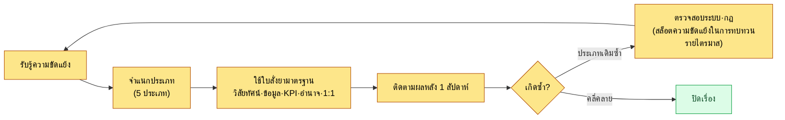
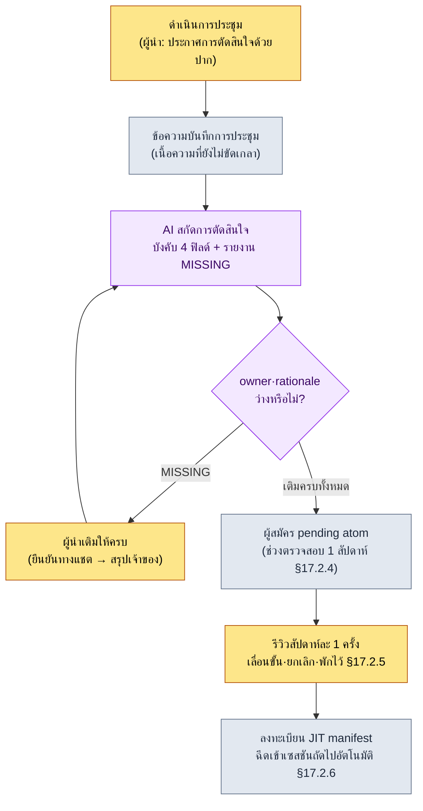

# 19.2 จำแนกความขัดแย้งและไม่ปล่อยให้การตัดสินใจในที่ประชุมหลุดหาย — AI ช่วยเรื่องภาวะผู้นำในการประชุม

> ผู้อ่านหลัก: ผู้อำนวยการ·หัวหน้าทีมที่ต้องตัดสินใจในที่ประชุมมากกว่า 50 ครั้งต่อไตรมาส (ทีมขนาดกลาง 10–50 คน)
> ฉบับย่อสำหรับผู้อ่านที่ทำงานคนเดียว/เป็นงานอดิเรก: §19.2.8 「ถ้าทำคนเดียวก็แค่นี้พอ」

ผมเคยนำการประชุม 90 นาทีมาได้อย่างราบรื่น แต่อีกหนึ่งสัปดาห์ต่อมาวาระเดิมกลับขึ้นมาอยู่บนโต๊ะประชุมอีกครั้ง เราตัดสินใจไปแล้วแน่ ๆ แต่ไม่มีที่ไหนบันทึกไว้เลยว่าใครรับผิดชอบอะไร ในบันทึกการประชุมเหลือไว้แค่ "หารือเรื่อง global cooldown" ส่วน "ตกลงที่ 0.5 วินาที ผู้รับผิดชอบคือทีมงาน A" ระเหยหายไปจากหัวของคนที่อยู่ในห้องนั้นภายในหนึ่งสัปดาห์ จุดที่การประชุมของผู้นำพังลงนั้นส่วนใหญ่ไม่ใช่ระหว่างประชุม แต่เป็น **ช่วงรอยต่อสั้น ๆ ทันทีหลังประชุมจบ ก่อนที่การตัดสินใจจะแข็งตัวเป็นบันทึก**

บทนี้กล่าวถึงงานของหัวหน้าทีมสองก้อนใหญ่ ครึ่งแรกคือ **วิธีส่งความขัดแย้งไปยังใบสั่งยามาตรฐานตามประเภท แทนที่จะแก้จากศูนย์ทุกครั้ง** และครึ่งหลังคือกระดูกสันหลังของบทนี้ — **บันทึกเซสชันจริง (worked transcript) ที่ให้ AI สกัดการตัดสินใจที่เกิดในที่ประชุม แต่บังคับให้ไม่ปล่อยผ่านเมื่อเจ้าของหรือเหตุผลว่างเปล่า** ทฤษฎีภาวะผู้นำทั่วไป (การนำเสนอวิสัยทัศน์·การรับฟัง·ความเห็นอกเห็นใจ) มีในหนังสือเล่มอื่นเพียงพอแล้ว บทนี้จึงโฟกัสเฉพาะที่ *การนำทฤษฎีทั่วไปนั้นไปหมุนเป็น AI workflow เพื่อป้องกันการตัดสินใจหลุดหาย* เท่านั้น

---

## 19.2.1 ความขัดแย้งไม่ได้มีเป้าหมายให้เป็นศูนย์ แต่เป็นสิ่งที่ต้องจำแนก

ความเข้าใจที่ว่าทีมที่มีความขัดแย้งเป็นศูนย์คือทีมที่แข็งแรงนั้นเป็นความเข้าใจผิด หากทีมขนาดกลาง (10–50 คน) ต้องตัดสินใจมากกว่า 50 ครั้งต่อไตรมาส แล้วกลับไม่เห็นแรงเสียดทานเลยแม้แต่ครั้งเดียว นั่นไม่ใช่ว่าไม่มีความขัดแย้ง แต่เป็นความขัดแย้งที่จมลงไปใต้ผิวน้ำ และความขัดแย้งที่จมอยู่นั้นอันตรายกว่า

สิ่งที่ผู้นำต้องทำไม่ใช่การกำจัดความขัดแย้ง แต่คือ **การจำแนกประเภทให้เร็วแล้วส่งไปยังใบสั่งยามาตรฐาน** หากความขัดแย้งแบบเดียวกันถูกแก้ด้วยวิธีต่างกันทุกครั้ง เวลาที่ใช้ในการแก้ก็จะสะสมใหม่จากศูนย์ทุกครั้ง

| ประเภทความขัดแย้ง | แก่นของการปะทะ | ใบสั่งยามาตรฐาน |
|---|---|---|
| ความขัดแย้งเชิงคุณค่า | ตีความวิสัยทัศน์ต่างกัน (รายได้ vs เวลาของผู้ใช้) | อ้างอิงสล็อตวิสัยทัศน์ |
| ความขัดแย้งเชิงข้อเท็จจริง | ตีความข้อมูลเดียวกันต่างกัน | ตรวจสอบข้อมูล (รายงานเมตาเกม) |
| ความขัดแย้งเชิงลำดับความสำคัญ | "สายงานของฉันสำคัญกว่า" | เปรียบเทียบระดับอิมแพกต์·ผลกระทบต่อ KPI |
| ความขัดแย้งเชิงอำนาจ | "นี่คือการตัดสินใจของฉัน" | ทบทวนเมทริกซ์อำนาจอีกครั้ง |
| ความขัดแย้งส่วนบุคคล | ความสัมพันธ์·สไตล์การสื่อสาร | 1:1, แยกข้อเท็จจริง/อารมณ์ (อยู่นอกระบบ) |

สี่ประเภทแรกมีใบสั่งยาที่เป็น **การอ้างอิงระบบ** หากวิสัยทัศน์·ข้อมูล·KPI·เมทริกซ์อำนาจถูกเขียนเป็นลายลักษณ์อักษรไว้ น้ำหนักของการตัดสินใจจะย้ายจากปากของคนไปทางระบบ ทำให้การถกเถียงสั้นลง มีเพียงความขัดแย้งส่วนบุคคลประเภทที่ห้าเท่านั้นที่อยู่นอกระบบ — การพูดคุยแบบ 1:1 และการแยกข้อเท็จจริงกับอารมณ์ นอกจากเวลาและความจริงใจแล้ว เครื่องมืออื่นแทบไม่ทำงาน อย่างไรก็ตาม "แก้ด้วยระบบไม่ได้" ไม่ใช่ข้ออ้างให้ผู้นำปล่อยมือ ความยากของจุดนี้คือ ในที่สุดแล้วพื้นที่ที่ระบบแก้ไม่ได้ก็ยังเป็นงานของผู้นำอยู่ดี

การจำแนกไม่ได้แก้จากต้นทุกครั้ง แต่หมุนเป็นกระแสเดียว



แก่นอยู่ที่จุดแยกทางขวา หากความขัดแย้งประเภทเดียวกันเกิดซ้ำ นั่นไม่ใช่ปัญหาของคน แต่เป็นปัญหาของระบบ ในตอนนั้นแทนที่จะไกล่เกลี่ยคน เราจะไปปรับกฎอย่างวิสัยทัศน์·เมทริกซ์อำนาจ สิ่งนี้กลายเป็นอินพุตของสล็อตความขัดแย้งในการทบทวนรายไตรมาสที่จะกล่าวถึงใน §19.2.7

---

## 19.2.2 ที่ประชุมคือที่ที่สร้างการตัดสินใจ และการตัดสินใจต้องไม่หลุดหาย

เช่นเดียวกับที่ใบสั่งยาของความขัดแย้งทั้งสี่ประเภทล้วนเป็น "การอ้างอิงระบบ" ที่ประชุมก็เป็น **กลไกที่สร้างการตัดสินใจและทำให้การตัดสินใจนั้นแข็งตัวเป็นบันทึก** ในที่สุด หลักห้าข้อที่ผู้นำต้องรักษาในที่ประชุมนั้นผูกพันกันอยู่ ขาดข้อใดข้อหนึ่งไป ข้อที่เหลือก็จะสั่นคลอนตามไปด้วย

1. แชร์วาระล่วงหน้า 24 ชั่วโมงก่อนประชุม (หากมารวมตัวกันโดยไม่เตรียมตัว การประชุมจะไหลไปเป็นเวทีถกเถียง)
2. บังคับกำหนดเวลาให้แต่ละวาระ (แชร์ข้อมูล 5 นาที·ตัดสินใจ 15–20 นาที·ถกเถียง 30–45 นาที เกินเวลาให้ยกยอด)
3. ระบุ "การตัดสินใจของวันนี้" ตอนจบประชุม (หากจบโดยไม่มีการตัดสินใจ การประชุมครั้งหน้าจะเปิดวาระเดิมขึ้นมาอีก)
4. สร้างบันทึกการประชุมทันทีที่จบ (หากตกลงว่าให้คนมาจัดทีหลัง มันจะระเหยหาย)
5. ติดตามเจ้าของ·เหตุผล·แอ็กชันต่อเนื่องของทุกการตัดสินใจ (แอ็กชันที่ไม่มีการติดตามจะหายไปก่อนสัปดาห์ถัดไป)

ในห้าข้อนี้ ข้อ 3·4·5 ที่พังลงคืออุบัติเหตุที่เล่าไว้ตอนต้น เราตัดสินใจด้วยปาก (บรรลุข้อ 3 บางส่วน) แต่ไม่แข็งตัวเป็นบันทึก (ข้อ 4 ล้มเหลว) และไม่ได้ใส่เจ้าของลงไป (ข้อ 5 ล้มเหลว) จึงทำให้อีกหนึ่งสัปดาห์ต่อมาวาระเดิมขึ้นมาอีกครั้ง

ปัญหาคือ หากฝากข้อ 3·4·5 ไว้กับเจตจำนงของคน มันจะพังก่อนเป็นอันดับแรกในสัปดาห์ที่ยุ่ง พอประชุมจบ ผู้นำก็วิ่งไปยังการประชุมถัดไปแล้ว เราจึงย้ายหลักสามข้อนี้ **ไปยังไปป์ไลน์ที่มี AI ช่วย** นั่นคือการสกัดการตัดสินใจจากข้อความบันทึกการประชุมโดยอัตโนมัติ แต่ถ้าเจ้าของหรือเหตุผลว่างเปล่า ก็ไม่ให้ปล่อยผ่าน ไปป์ไลน์นี้เป็นการมองกระแส ประชุม→บันทึกการประชุม→สกัด atom (§17.2) ที่สร้างไว้ในส่วนที่ 17 อีกครั้งหนึ่งจากมุมมองของผู้นำ

---

## 19.2.3 [บันทึกเซสชันจริง] สกัดการตัดสินใจจากบันทึกการประชุม แต่ถ้าไม่มีเจ้าของก็กั้นไว้

ผมจะแสดงให้เห็นจนจบว่าจริง ๆ แล้วหมุนหนึ่งรอบอย่างไร เวทีคือทันทีหลังการประชุมของ TF การต่อสู้ในโปรเจกต์ของผู้เขียน (MMORPG ที่เน้นมือถือเป็นหลัก ต่อไปนี้เรียกว่า "โปรเจกต์ A") พรอมต์อินพุตคัดลอกไปใช้ได้เลยตามนั้น ส่วนผลลัพธ์เป็นการเรียบเรียงใหม่จากเซสชันจริง

### ขั้นที่ 1 — อินพุต: โยนเนื้อความบันทึกการประชุมที่ยังไม่ได้ขัดเกลาเข้าไปตามนั้น

อย่าจัดบันทึกการประชุมให้สวยงาม คำพูดปนกันอยู่ และบรรทัดที่กำกวมว่าเป็นการตัดสินใจหรือไม่ก็ปล่อยไว้ตามเดิม ข้อความดิบ ๆ แบบนี้แหละคืออินพุต การจัดระเบียบเป็นงานของ AI ไม่ใช่งานที่คนต้องทำก่อน

```text
[เนื้อความบันทึกการประชุม TF การต่อสู้ 2026-06-05 — คัดเฉพาะส่วน, ยังไม่ขัดเกลา]

ทีมงาน A: เรื่องไป global cooldown ที่ 0.5 วินาที ผลซิมูเลชันเสถียรดีครับ
ทีมงาน B: ถ้ามัดสกิลฟื้นฟูไว้ที่ 0.5 วินาทีด้วย รู้สึกว่าวงจรการฟื้นฟูจะพังนะ
ทีมงาน A: อันนั้นแยกออกมาเถอะครับ ให้การฟื้นฟูเป็นข้อยกเว้นของ global cooldown
อีมินซู: ดีครับ รวม global cooldown เป็น 0.5 วินาที ส่วนการฟื้นฟูเป็นข้อยกเว้น
        คุณ A ช่วยดูคอลัมน์ cooldown ในชีตข้อมูลรวดเดียวให้ทีครับ
ทีมงาน C: กฎลำดับความสำคัญของการเล็งเป้า ขอดูเพิ่มแล้วค่อยตัดสินสัปดาห์หน้า...
ทีมงาน B: ปุ่มสลับย่อมินิแมป น่าจะต้องดูร่วมกับทีม UI นะครับ ขอพักไว้ก่อน
อีมินซู: ครับ อันนั้นยกไปประชุมครั้งหน้า
```

ในนี้มีการตัดสินใจสองเรื่อง (global cooldown 0.5 วินาที, การฟื้นฟูเป็นข้อยกเว้น) กับเรื่องที่พักไว้สองเรื่อง (การเล็งเป้า, มินิแมป) ปนกันอยู่ ถ้าคนคัดด้วยตาเปล่า ก็จะพลาดทีละเรื่อง นั่นแหละคืออุบัติเหตุที่เล่าไว้ตอนต้น

### ขั้นที่ 2 — พรอมต์: ให้สกัดแต่ห้ามปล่อยเจ้าของ·เหตุผลให้เป็นช่องว่าง

```text
จากบันทึกการประชุมที่แนบมา ช่วยดึงเฉพาะ "การตัดสินใจ" ออกมา การถกเถียง·การพักไว้·การแชร์ข้อมูลไม่ใช่การตัดสินใจ
ทุกการตัดสินใจให้เติมสี่ช่อง decision (หนึ่งประโยค) / owner / rationale / follow_up แต่
ถ้าหา owner หรือ rationale จากเนื้อความไม่เจอ อย่าเดา
ให้เขียนว่า "[MISSING — ยังไม่ได้สรุปในที่ประชุม]" เรื่องที่พักไว้·ยกไปประชุมครั้งหน้าให้แยกเป็น deferred
บรรทัดที่กำกวมว่าเป็นการตัดสินใจหรือไม่ให้แยกเป็น ambiguous แล้วส่งคืนให้ฉัน ผลลัพธ์ให้
มีแค่สามบล็อก decisions / deferred / ambiguous เท่านั้น
```

จุดที่ต้องสังเกตคือ ครึ่งหนึ่งของพรอมต์นี้คือ "การบังคับช่องว่าง" หากให้อิสระแก่ AI มันจะกุ owner ขึ้นมาให้ดูน่าเชื่อ หรือยกเรื่องที่พักไว้ให้กลายเป็นการตัดสินใจ การวางทางออกที่ว่า **"ถ้าหาไม่เจอ อย่าเดา ให้รายงานว่า [MISSING]"** ไว้คือแก่นของ workflow นี้ การตัดสินใจจะมีค่าก็ต่อเมื่อคนประกาศอย่างชัดเจน (หลักการใน §17.6.3) และ AI ทำได้แค่ถึงขั้น *เผยให้เห็น* ว่าตรงนั้นว่างเปล่าเท่านั้น

### ขั้นที่ 3 — ผลลัพธ์ของ Claude (เรียบเรียงใหม่จากเซสชันจริง)

```text
decisions:
  - decision: รวม global cooldown ของการต่อสู้ให้เป็น 0.5 วินาที
    owner: ทีมงาน A ("คุณ A ช่วยดูคอลัมน์ cooldown ในชีตข้อมูลรวดเดียวให้ทีครับ" — อีมินซู)
    rationale: "เรื่องไป global cooldown ที่ 0.5 วินาที ผลซิมูเลชันเสถียรดีครับ" (ทีมงาน A)
    follow_up: ตรวจสอบคอลัมน์ cooldown รวดเดียว

  - decision: ยกเว้นสกิลฟื้นฟูออกจากการใช้ global cooldown
    owner: [MISSING — ยังไม่ได้สรุปในที่ประชุม]
    rationale: "ถ้ามัดการฟื้นฟูไว้ที่ 0.5 วินาทีด้วย รู้สึกว่าวงจรการฟื้นฟูจะพัง" (ทีมงาน B)
    follow_up: นำการจัดการข้อยกเว้น cooldown ของสกิลฟื้นฟูไปลงในข้อมูล

deferred:
  - กฎลำดับความสำคัญของการเล็งเป้า (ทีมงาน C, ตรวจสอบเพิ่มสัปดาห์หน้า)
  - ปุ่มสลับย่อมินิแมป (ต้องหารือกับทีม UI, พักไว้)

ambiguous: (ไม่มี)
```

ส่วนที่มีค่าที่สุดในผลลัพธ์ไม่ใช่ตารางที่เรียบร้อยของการตัดสินใจเรื่องแรก แต่เป็น **`owner: [MISSING]` ของการตัดสินใจเรื่องที่สอง** เรื่องการยกเว้นการฟื้นฟูถูกตัดสินใจไปแล้วแน่ ๆ แต่ไม่มีที่ไหนในบันทึกการประชุมเขียนไว้ว่า "ใครจะนำไปลงในข้อมูล" AI ไม่ได้อุดช่องโหว่นั้นด้วยการเดา แต่รายงานอย่างซื่อตรง พรอมต์ที่ดีคือพรอมต์ที่ทำให้ AI พูดได้ว่า "ตรงนี้ว่างเปล่าครับ"

### ขั้นที่ 4 — การตรวจสอบและการปฏิเสธ (จุดที่เป็นของผู้นำ)

ห้ามรับผลลัพธ์นี้มาตามนั้น การที่ `[MISSING]` ขึ้นมาหมายความว่า **ที่ประชุมจบการตัดสินใจไปเพียงครึ่งเดียว** สิ่งที่ผู้นำต้องทำ ณ ตรงนี้ไม่ใช่การไปแก้ผลลัพธ์ของ AI แต่คือการตัดสินใจในส่วนที่ขาดไปจากที่ประชุมให้ครบ

ผู้เขียนได้ถามทีมงาน A หนึ่งบรรทัดทางแชตภายในทีม ณ จุดนี้ว่า "เรื่องนำข้อยกเว้นการฟื้นฟูไปลงในข้อมูล คุณ A ดูด้วยกันใช่ไหมครับ" A ตอบว่า "ครับ" หนึ่งบรรทัดนี้สรุปเจ้าของที่ขาดหายไป จากนั้นจึงร้องขอใหม่

```text
owner ของการตัดสินใจเรื่องที่สอง (ข้อยกเว้นการฟื้นฟู) สรุปเป็นทีมงาน A แล้ว (ยืนยันกับเจ้าตัวทางแชตภายในทีม)
ช่วยนำไปปรับแล้วให้ decisions ใหม่ และแปลงการตัดสินใจสองเรื่องเป็นรูปแบบ
ผู้สมัคร pending atom ให้ด้วย
// (เจตนา: รวม status: pending, source_meeting, owner, related_atoms — รูปแบบ §17.2.4)
```

AI แปลงการตัดสินใจสองเรื่องที่ owner ถูกเติมแล้วเป็นผู้สมัคร pending atom สองรายการแล้วตอบกลับมา ผู้สมัครเหล่านี้ไม่ได้กลายเป็นการตัดสินใจอย่างเป็นทางการในทันที แต่จะผ่าน **ช่วงตรวจสอบ 1 สัปดาห์ในสถานะ pending** (§17.2.4) เพราะสิ่งที่ตกลงในที่ประชุมบางครั้งก็ถูกพลิกหลังจากใช้งานจริงไปหนึ่งสัปดาห์ เท่ากับให้เวลาหมึกได้แห้ง หนึ่งรอบของ อินพุต → สกัด → รายงาน MISSING → คนเติมการตัดสินใจให้ครบ → ร้องขอใหม่ ปิดลงตรงนี้

หนึ่งรอบนี้ป้องกันอุบัติเหตุที่เล่าไว้ตอนต้นได้อย่างเป็นโครงสร้าง เมื่อการตัดสินใจเสร็จไปเพียงครึ่งเดียว ความจริงนั้นถูกเผยให้เห็น **ณ ที่นั้นทันทีหลังประชุม** ไม่ใช่อีกหนึ่งสัปดาห์หลังประชุมจบ

---

## 19.2.4 ไปป์ไลน์ทั้งหมด — มือของคนอยู่แค่สองจุด

หากวางบันทึกเซสชันจริงข้างต้นทับลงบนไปป์ไลน์บันทึกการประชุมของส่วนที่ 17 ภาพรวมทั้งหมดเป็นแบบนี้ จุดที่มือของผู้นำสัมผัสมีแค่สองจุด คือจุดที่ *ประกาศ* การตัดสินใจในที่ประชุม (ส่วนหน้าสุด) และจุดที่ *เติม* `[MISSING]` ที่ AI รายงาน (ตรงกลาง) ส่วนการสกัด·การแปลง·การลงทะเบียนระหว่างนั้นเป็นแบบอัตโนมัติ



ในไปป์ไลน์นี้ สิ่งที่ AI **ไม่ทำ** สำคัญกว่า AI ไม่สร้างการตัดสินใจ ไม่กุเจ้าของขึ้นมา ไม่ยกเรื่องที่พักไว้ให้กลายเป็นการตัดสินใจ สิ่งที่ AI ทำคือคัดผู้สมัครการตัดสินใจออกมาจากบันทึกการประชุม และทำได้ถึงขั้น *เผย* ช่องว่างให้เห็นเท่านั้น การประกาศการตัดสินใจและการเติมช่องว่างเป็นงานของคน นี่คือการประยุกต์ใช้หลักการ "สล็อตการตัดสินใจห้าม AI สร้างอัตโนมัติ" ที่กล่าวไว้ใน §17.6.3 จากมุมมองของผู้นำ — เพราะเมื่อการตัดสินใจแพร่กระจายไปยังเอกสาร·เซสชัน·บิลด์อื่น มันจะทิ้งร่องรอยที่ย้อนกลับไม่ได้ไว้ เราจึงรักษาจุดที่คนประกาศอย่างชัดเจนไว้ ณ ด่านทางเข้า

---

## 19.2.5 การบังคับ [MISSING] ค้ำจุนวัฒนธรรมการตัดสินใจอย่างเท่าเทียม

ใน atom ที่แชร์ร่วมกันในทีมบน PC ของบริษัท มี atom เชิงแนวคิดชื่อ `team_equal_decision_culture` เป็นการตรึงคำศัพท์ที่ถูกอ้างอิงซ้ำ ๆ ในการทบทวนเป็นกฎ ใช้คำเดียวเพื่อชี้ถึงวัฒนธรรมทีมที่ว่า "การตัดสินใจทำด้วยเหตุผล ไม่ใช่ด้วยตำแหน่ง" เป็นวัฒนธรรมที่ไม่ใช่ผู้อำนวยการกดว่า "ฉันตัดสินใจแล้ว จบ" แต่เป็นการทิ้งไว้ว่าใคร·เพราะอะไรในทุกการตัดสินใจ เพื่อทำให้ **ใครก็ตามสามารถย้อนกลับมาทบทวนการตัดสินใจนั้นจากเหตุผลได้ในภายหลัง**

การบังคับ `[MISSING]` ใน §19.2.3 คือการหนุนหลังทางเทคนิคของวัฒนธรรมนี้พอดี การไม่ปล่อยให้เจ้าของและเหตุผลผ่านไปเป็นช่องว่าง หมายความว่าอำนาจของการตัดสินใจวางอยู่บน "เพราะออกมาจากคำพูดในเนื้อความตรงไหน" ไม่ใช่ "เพราะผู้อำนวยการพูด" หากการอ้างอิงเหตุผลว่างเปล่า การตัดสินใจก็จะถูกกั้น ดังนั้นการตัดสินใจที่กดด้วยตำแหน่งจึงกลายเป็น atom ไม่ได้อย่างเป็นโครงสร้าง

วัฒนธรรมนี้เชื่อมต่อเป็นเส้นเดียวกับใบสั่งยาของความขัดแย้งใน §19.2.1 ด้วย การแก้ความขัดแย้งเชิงคุณค่าด้วยการอ้างอิงวิสัยทัศน์, ความขัดแย้งเชิงข้อเท็จจริงด้วยข้อมูล, ความขัดแย้งเชิงอำนาจด้วยเมทริกซ์ ล้วนเป็นหลักการเดียวกันคือ **แก้ด้วยเหตุผลที่ถูกบันทึกไว้ แทนปากของคน** วัฒนธรรมการตัดสินใจอย่างเท่าเทียมคือดินสำหรับใบสั่งยาของความขัดแย้ง และการบังคับ `[MISSING]` คือเครื่องมือที่คอยพรวนดินนั้นทุกครั้งไม่ให้แข็งตัวในระดับหน่วยการประชุม

ตรงนี้มีอีกแกนหนึ่งของวัฒนธรรมทีมซ้อนอยู่ นั่นคือเส้นแบ่งระหว่างเปิดเผยกับปิด บันทึกการประชุม·การ์ดการตัดสินใจ·ข้อมูล KPI·รายงานอุบัติเหตุ วางไว้ในพื้นที่เปิดเผย ส่วนการสนทนา 1:1·การประเมินบุคลากร·เงินเดือน·เรื่องส่วนตัว วางไว้ในพื้นที่ปิด สิ่งที่ไปป์ไลน์สกัดการตัดสินใจจัดการล้วนอยู่ในพื้นที่เปิดเผย เหตุผลที่ความขัดแย้งส่วนบุคคล (ประเภทที่ห้าใน §19.2.1) อยู่นอกระบบก็เช่นกัน — เพราะมันเป็นพื้นที่ปิด เราจึงไม่ตรึงเป็น atom

---

## 19.2.6 วิธีจัดการตัวเลขอย่างซื่อตรง

บทเกี่ยวกับภาวะผู้นำมีสิ่งล่อใจสูงที่อยากใส่ตารางแบบ "พอนำไปป์ไลน์การประชุมมาใช้ เวลาประชุมก็ลดลงครึ่งหนึ่ง" ตัวเลขแบบนั้นถ้าไม่ผ่านการตรวจสอบจะลดทอนความน่าเชื่อถือของหนังสือ หลักการของหนังสือเล่มนี้คือหนึ่งในสามข้อ

ข้อแรก **สัญญาเป็นตัวชี้วัดเฉพาะสิ่งที่วัดได้** สิ่งที่ไปป์ไลน์การประชุมนับได้จริงคือสิ่งเหล่านี้ — จำนวนครั้งที่ขาด `owner`·`rationale` ต่อการตัดสินใจ (เป้าหมาย 0), สัดส่วนของการตัดสินใจที่สกัดจากบันทึกการประชุมแล้วเลื่อนขั้นเป็น pending atom, จำนวนครั้งของการประชุมซ้ำในแบบ "เรื่องนี้ไม่ได้ตัดสินใจไปแล้วเหรอ?" สามอย่างนี้พูดในที่ประชุมด้วยตัวเลขได้ ไม่ใช่ด้วย "ความรู้สึก"

ข้อสอง **การประมาณของผู้เขียนให้เขียนว่าเป็นการประมาณ** การที่เวลาที่ใช้ในการสกัดการตัดสินใจทันทีหลังประชุมคือ "จัดบันทึกการประชุมด้วยมือ 20–30 นาที → ร่างของ AI + เติมให้ครบ ภายใน 5 นาที" นั้นเป็นการประมาณของผู้เขียนที่อิงจากประสบการณ์ และเป็นสมมติฐานที่ยังไม่ได้ตรวจสอบ อย่าท่องจำค่าสัมบูรณ์ แต่ให้อ่านจาก *ความต่างเชิงโครงสร้าง* ("คนคัดเองตั้งแต่ต้น" vs "AI สกัด + เติมเฉพาะช่องว่าง") ก็พอ เวลาที่ประหยัดได้จริงจะต่างกันไปตามขนาดการประชุม·จำนวนการตัดสินใจ

ข้อสาม **อย่าฟันธงเหตุปัจจัย** อย่าตอกตะปูว่า "การประชุมซ้ำลดลง" เป็นเพราะไปป์ไลน์นี้ทั้งหมด ความเป็นผู้ใหญ่ของทีม·ขั้นตอนของโปรเจกต์ก็มีส่วนร่วมด้วย พูดแค่ทิศทาง (เมื่อการตัดสินใจที่หลุดหายถูกเผยให้เห็นทันทีหลังประชุม มันจะทำงานไปในทางที่การประชุมซ้ำลดลง) ก็พอ อย่ากุตัวคูณขึ้นมา

---

## 19.2.7 สล็อตความขัดแย้ง·การตัดสินใจในการทบทวนรายไตรมาส

ใบสั่งยาของความขัดแย้งและไปป์ไลน์การตัดสินใจจะหมุนรอบตรวจสอบหนึ่งรอบในการทบทวนรายไตรมาส โดยวาง "สล็อตความขัดแย้ง" และ "สล็อตการตัดสินใจที่หลุดหาย" ไว้ในการทบทวน

```text
การทบทวนรายไตรมาส Q2 2026 — สล็อตความขัดแย้ง·การตัดสินใจ
─────────────────────────────────
[ความขัดแย้ง] 3 เรื่องหลักของไตรมาสนี้
1. global cooldown (ความขัดแย้งเชิงคุณค่า) → ปิดเรื่องด้วยการอ้างอิงวิสัยทัศน์
   สิ่งที่เรียนรู้: ยืนยันอีกครั้งว่าวิสัยทัศน์ 5 สล็อตทำงานเป็นเกณฑ์การตัดสินใจ
2. ลำดับความสำคัญของดันเจี้ยนใหม่ (ความขัดแย้งเชิงลำดับความสำคัญ) → เปรียบเทียบผลกระทบต่อ KPI
   สิ่งที่เรียนรู้: ไม่มีตารางลำดับความสำคัญ จึงต้องเปรียบเทียบสด ๆ ทุกครั้ง → นำตารางมาใช้ไตรมาสหน้า
3. อำนาจในการออกแบบตัวละคร (ความขัดแย้งเชิงอำนาจ) → ทบทวนเมทริกซ์อำนาจอีกครั้ง
   สิ่งที่เรียนรู้: ต้องเพิ่มหัวข้อแบ่งงาน 'ภาพ vs ฟังก์ชัน' ลงในเมทริกซ์

[การตัดสินใจที่หลุดหาย] เรื่องที่เกิด [MISSING] ในไตรมาสนี้
- การตัดสินใจข้อยกเว้นการฟื้นฟูไม่ได้ระบุ owner (2026-06-05) → เติมให้ครบทางแชตภายในทีม
  สิ่งที่เรียนรู้: เพิ่มการเรียกชื่อ owner ทันทีตอนประกาศการตัดสินใจในการประชุม TF ลงในเช็กลิสต์การดำเนินงาน
```

ทั้งความขัดแย้งและการตัดสินใจที่หลุดหายล้วนเป็นอินพุตของการทบทวน หากความขัดแย้งประเภทเดียวกันเกิดซ้ำ ก็ปรับระบบ (ตารางวิสัยทัศน์·อำนาจ) และหาก `[MISSING]` ขึ้นบ่อยในรูปแบบเดียวกัน ก็ปรับวิธีดำเนินการประชุม "การตรวจสอบระบบ·กฎ" ที่แยกไปทางขวาในผังการไหลของ §19.2.1 จะเป็นรูปธรรมขึ้นตรงนี้

---

> **การประยุกต์นอกเกม** อุบัติเหตุของการประชุมที่ว่า "ตัดสินใจไปแล้วแน่ ๆ แต่อีกหนึ่งสัปดาห์ต่อมาวาระเดิมขึ้นมาอีก" นั้นไม่เลือกประเภทธุรกิจ หากไม่ขัดเกลาเนื้อความบันทึกการประชุมแล้วใส่เข้า LLM ตามนั้นเพื่อสกัดเฉพาะการตัดสินใจ แต่ถ้าเจ้าของหรือเหตุผลว่างเปล่าก็ไม่เติมด้วยการเดา ให้รายงานเป็น `[MISSING]` แทน ความจริงที่ว่าการตัดสินใจเสร็จไปเพียงครึ่งเดียวก็จะถูกเผยให้เห็น ณ ที่นั้นทันทีหลังประชุม ยกตัวอย่างเช่น ในการประชุมรายสัปดาห์ของฝ่ายขาย หาก "บัญชีนี้ตกลงให้ A รับผิดชอบ" ผ่านไปเพียงด้วยปากโดยไม่ถูกบันทึก สัปดาห์ถัดไปมันจะลอยอยู่ในอากาศ แต่ถ้าการสกัดของ AI ขึ้น `owner: [MISSING]` ก็จะสรุปเจ้าของได้ด้วยแชตหนึ่งบรรทัด ณ ที่นั้น ลดการประชุมซ้ำไปได้หนึ่งครั้ง การแบ่งงานที่ให้คนเป็นผู้ประกาศการตัดสินใจและเติมช่องว่าง ส่วน AI เป็นผู้สกัดคือแก่นสำคัญ

## 19.2.8 ลองทำดู — หนึ่งก้าวที่ทำได้วันนี้

> **ถ้าทำคนเดียวก็แค่นี้พอ**: ไม่ต้องมีทีมหรือไปป์ไลน์บันทึกการประชุมก็ได้ ลองนำบันทึกของการประชุมที่คุณเข้าร่วมล่าสุด (จะเป็นการเรียนกลุ่ม·ชมรม·การหารือโปรเจกต์คนเดียวก็ได้) มาวางลงในพรอมต์ของ §19.2.3 ตามนั้นแล้วหมุนสักครั้ง หากมีการตัดสินใจที่ AI ขึ้น `owner: [MISSING]` แม้แต่เรื่องเดียว นั่นแหละคือวาระที่ทีมของคุณ (หรือตัวคุณเอง) จะหยิบขึ้นมาอีกในอีกหนึ่งสัปดาห์ เพียงเติมช่องว่างนั้นตอนนี้ การประชุมซ้ำหนึ่งครั้งก็หายไป

หากเป็นทีม ให้เริ่มด้วยหนึ่งก้าวถัดไปนี้ นำบันทึกการประชุมครั้งถัดไปใส่ลงในพรอมต์สกัดของ §19.2.3 ตามนั้นโดยไม่ขัดเกลา และรักษาไว้เพียงกฎข้อ 2 (การบังคับ `[MISSING]`) ส่วน pending atom·การลงทะเบียน JIT (§17.2) ค่อยทำทีหลัง แม้มีเพียงหนึ่งบรรทัดของการบังคับช่องว่าง คุณก็จับการหลุดหายที่แพงที่สุดอย่าง "คิดว่าตัดสินใจแล้วแต่ไม่ได้เขียนไว้" ได้ทันทีหลังประชุม

---

## 19.2.9 ความล้มเหลวที่พบบ่อย

| รูปแบบ | ทำไมจึงล้มเหลว | ใบสั่งยา |
|---|---|---|
| แก้ความขัดแย้งทุกเรื่องด้วยวิธีเดียวกัน | ไม่มีประเภทไหนถูกแก้จนจบ | จำแนก 5 ประเภท → ใบสั่งยาตามประเภท (§19.2.1) |
| พอใจกับทีมที่มีความขัดแย้งเป็นศูนย์ | ความขัดแย้งจมลงใต้ผิวน้ำ (อันตรายกว่า) | ความขัดแย้งคือสัญญาณสุขภาพ, สล็อตการทบทวนรายไตรมาส |
| ตัดสินใจด้วยปากอย่างเดียวแต่ไม่เขียนไว้ | อีกหนึ่งสัปดาห์ต่อมาวาระเดิมประชุมซ้ำ | AI สกัด + ตรึง pending เป็นกฎ (§19.2.3) |
| AI เติมเจ้าของด้วยการเดา | เจ้าของที่ผิดแข็งตัวเป็น atom | บังคับ `[MISSING]`, ห้ามเดา (§19.2.2) |
| AI สร้างการตัดสินใจอัตโนมัติ | อำนาจของการตัดสินใจหลุดออกจากเหตุผล | การประกาศการตัดสินใจเป็นของคน, AI แค่เสริม (§17.6.3) |
| ยกเรื่องที่พักไว้ให้กลายเป็นการตัดสินใจ | วาระที่ยังไม่สรุปแพร่กระจายแบบย้อนกลับไม่ได้ | แยกออกเป็นบล็อก deferred (§19.2.3) |

เรื่องที่สามกับเรื่องที่สี่มักผูกกันแล้วระเบิดบ่อยที่สุด ทีมที่ไม่เขียนการตัดสินใจมักโยนให้ AI ทั้งก้อนว่า "จัดการให้ที" และ AI ก็กุเจ้าของขึ้นมาอย่างน่ารัก พอเจ้าของที่ถูกกุนั้นแข็งตัวเป็น atom อีกหนึ่งสัปดาห์ต่อมาก็เกิดความขัดแย้งที่แพงกว่าอย่าง "ผมไม่เคยตกลงว่าจะรับผิดชอบนะครับ" การบังคับ `[MISSING]` ป้องกันสองความล้มเหลวนั้นได้ด้วยบรรทัดเดียว

---

### สรุปประเด็นสำคัญของบท

- ความขัดแย้งไม่ได้มีเป้าหมายให้เป็นศูนย์ แต่เป็นสิ่งที่ต้องจำแนก 5 ประเภท และสี่ประเภทแก้ด้วยการอ้างอิงระบบ
- ให้ AI สกัดการตัดสินใจในที่ประชุม แต่ถ้าเจ้าของ·เหตุผลว่างเปล่าก็กั้นไว้ด้วย `[MISSING]`
- การประกาศการตัดสินใจและการเติมช่องว่างเป็นของคน ส่วนการสกัด·การแปลง·การลงทะเบียนเป็นของ AI

### ตัวอย่างบทถัดไป

- 19.3 กลยุทธ์การนำ AI เข้ามาใช้·การสื่อสารกับระดับบน — ลำดับการนำ AI เข้าสู่ทีม และวิธีแปลงข้อมูลการตัดสินใจชุดเดียวกันให้เหมาะกับผู้ฟังระดับบน
