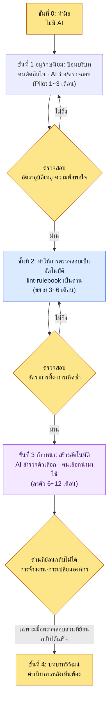
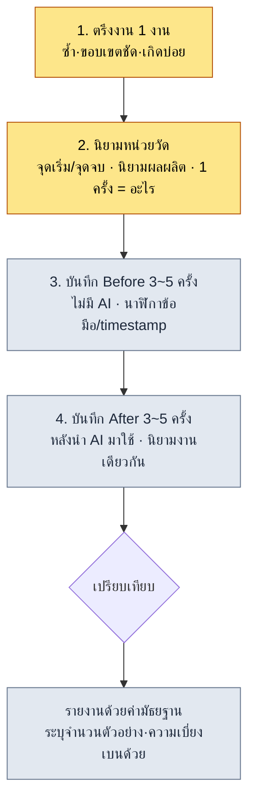
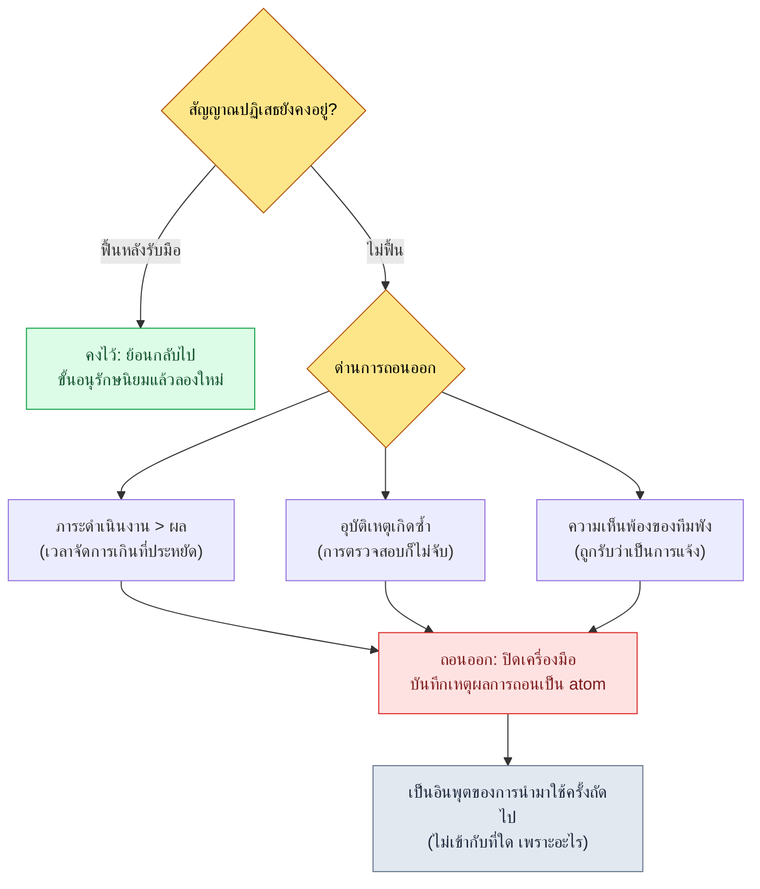

# 19.3 กลยุทธ์การนำ AI มาใช้และการโน้มน้าวผู้บริหาร — จากแบบอนุรักษนิยมสู่แบบก้าวหน้า, ROI ที่ไม่ปรุงแต่ง

> ผู้อ่านหลัก: ลีดที่ต้องตัดสินใจว่าจะนำ AI มาใช้ในทีมหรือไม่ และต้องอธิบายต้นทุนนั้นต่อผู้บริหาร (ทีมขนาดกลาง 10\~50 คน)
> ฉบับย่อสำหรับผู้อ่านคนเดียว/งานอดิเรก: §19.3.12 「ถ้าทำคนเดียวก็แค่เท่านี้」

ผู้เขียนเคยถูกถามในห้อง CEO ว่า "ค่าเครื่องมือ AI เสียไปเดือนละเท่าไร แล้วมันดีขึ้นตรงไหน" ตอนนั้นในมือถือสไลด์อยู่แผ่นเดียว บนนั้นเขียนว่า "เพิ่มผลิตภาพ 3\~5 เท่า" CEO ถามกลับว่า "เลข 3\~5 เท่านั้นมาจากไหน" ผมตอบไม่ได้ เพราะตัวเลขนั้นคือสิ่งที่ผมยกค่าเฉลี่ยจากบล็อกที่เห็นมาจากที่ไหนสักแห่ง ไม่ใช่ค่าที่เราวัดได้ในทีมของเรา

หลังจากวันนั้น ผู้เขียนตัดตัวเลขปรุงแต่งออกจากรายงานการนำ AI มาใช้ทั้งหมด แทนที่ด้วยสิ่งที่ระบบทิ้งไว้จริง ๆ — มี atom สะสมกี่ตัว มีสกิลทำงานกี่ตัว ในล็อกอินพุตแบบไหนเรียกบริบทแบบไหนเข้ามา — แล้วเริ่มรายงานสิ่งเหล่านั้นตามที่เป็นจริง บทนี้พูดถึงสองเรื่อง เรื่องแรกคือกรอบการตัดสินใจที่แบ่งการนำ AI มาใช้ออกเป็นขั้นตอน **จากแบบอนุรักษนิยม (คนตัดสินใจ AI ตรวจสอบ) สู่แบบก้าวหน้า (AI สร้างตัวเลือก คนเลือกนำมาใช้)** เรื่องที่สองคือวิธีอธิบาย ROI ของการนำมาใช้ต่อผู้บริหาร **ด้วยล็อกที่วัดได้จริงในระบบของผมเอง ไม่ใช่ค่าเฉลี่ยจากบล็อก** ทฤษฎีภาวะผู้นำทั่วไปมีในหนังสือเล่มอื่นเพียงพอแล้ว บทนี้จึงโฟกัสเฉพาะที่ *การใช้ AI ช่วยตัดสินใจเรื่องการนำ AI มาใช้เอง และดึงหลักฐานนั้นขึ้นมาจากล็อกของระบบ* เท่านั้น

---

## 19.3.1 การนำมาใช้ไม่ใช่สวิตช์เปิด-ปิด แต่เป็นขั้นตอน

ถ้ามองการนำ AI มาใช้เป็นสองทางว่า "ใช้หรือไม่ใช้" ก็จะติดกระดุมเม็ดแรกผิดตั้งแต่ต้น ถ้าเปิดเครื่องมือห้าตัวพร้อมกัน ภาระการดำเนินงานจะมาถึงก่อนผลลัพธ์ และถ้ากลัวจนไม่เปิดอะไรเลยก็จะไม่ได้เริ่มเสียที การนำมาใช้คือ **การตัดสินใจแบบเป็นขั้นตอน ที่เริ่มจากจุดที่ความเสี่ยงต่ำ แล้วค่อยขยายสิทธิ์เมื่อผ่านการตรวจสอบแล้ว**

เกณฑ์ที่ร้อยเรียงทั้งเล่มนี้ก็นำมาใช้ที่นี่เช่นเดิม **การประยุกต์แบบอนุรักษนิยม** ที่คนตัดสินใจและ AI ทำหน้าที่ตรวจสอบเท่านั้น กับ **การประยุกต์แบบก้าวหน้า** ที่ AI สำรวจตัวเลือกและคนเลือกนำมาใช้ การนำมาใช้ก็เดินตามลำดับนี้ เริ่มจากการป้อนบริบท (อนุรักษนิยม) แล้วเมื่อการตรวจสอบสะสมมากพอจึงข้ามไปสู่การสร้างอัตโนมัติ (ก้าวหน้า) ถ้ากระโดดย้อนลำดับ — เปิดการสร้างอัตโนมัติก่อนโดยไม่มีการตรวจสอบ — อุบัติเหตุจะสะสมและทีมจะเรียกร้องให้ปิดเครื่องมือ



หัวใจอยู่ที่ด่าน (gate) ระหว่างแต่ละขั้น การจะข้ามไปขั้นถัดไปได้ ค่าที่วัดได้ในขั้นก่อน (อัตราอุบัติเหตุ·อัตราการทิ้ง·ความพึงพอใจ) ต้องผ่านเกณฑ์ โดยเฉพาะขั้นที่ 4 ขั้นสุดท้าย (บทบาทวิวัฒน์) นั้น **ย้อนกลับไม่ได้** เพราะเป็นขั้นที่หน้าที่ของคนเปลี่ยนและแผนการจ้างงานขยับ จึงไม่ไปแตะต้องก่อนที่การตรวจสอบในขั้นที่ย้อนกลับได้ข้างหน้าจะจบ โครงสร้างด่านนี้แหละที่กันไม่ให้กระโดดข้ามไปสู่การประยุกต์แบบก้าวหน้าทีเดียวเพราะถูกบรรยากาศ "ได้ยินว่า AI ดีนะ" ดันไป

---

## 19.3.2 [บันทึกเซสชันจริง (worked transcript)] ดึง ROI สำหรับโน้มน้าวผู้บริหารขึ้นมาจากล็อกของระบบ

สมมติว่าตัดสินใจนำมาใช้แล้ว ด่านถัดไปคือผู้บริหารที่อนุมัติต้นทุนนั้น ตรงนี้สิ่งที่ลีดทำพลาดมากที่สุดคือการใส่ตัวเลขที่ไม่มีแหล่งที่มาอย่าง "ผลิตภาพ N เท่า" ลงในสไลด์ ตัวเลขนั้นจะพังลงตั้งแต่คำถามแรก

แทนที่จะทำเช่นนั้น ทำอย่างนี้ สั่ง AI ให้ **นับสินทรัพย์ที่ระบบของผมทิ้งไว้จริง ๆ แล้วเรียบเรียงเป็นสไลด์ ROI (Return on Investment, ผลตอบแทนเทียบกับการลงทุน) แต่อย่าสร้างตัวเลขที่ไม่มีแหล่งที่มาขึ้นมาเด็ดขาด** ด้านล่างคือการถ่ายทอดรอบหนึ่งจากอินพุตไปจนถึงการทิ้งและการสร้างใหม่ตั้งแต่ต้นจนจบ พรอมต์อินพุตคัดลอกไปใช้ได้เลย ส่วนเอาต์พุตเป็นการเรียบเรียงเซสชันจริงขึ้นมาใหม่

### ขั้นที่ 1 — อินพุต: โยนสินทรัพย์ที่วัดได้จริงซึ่งระบบทิ้งไว้ลงไปตามที่เป็น

ก่อนอื่น รวบรวมตัวเลขที่มีอยู่ในระบบแล้วและไม่จำเป็นต้องกุขึ้น อินเวนทอรีหน่วยความจำทีมในพีซีบริษัทและล็อก JIT ในพีซีส่วนตัว คืออินพุตหลัก

```yaml
# ai_adoption_inventory.yaml — สินทรัพย์ที่วัดได้จริงหลังนำมาใช้ 1 ปี (อ้างอิง book_appendix_A)
team_atoms:                         # workspace/team_memory/atoms/
  rules: 244
  concepts: 19
  decisions: 26
  feedback: 11
  rnd: 4
  total: 304
skills:                             # workspace/skills/
  wrapper: 44
  meta: 4
  total: 48
jit_manifest:
  hot_atoms_injected: 221           # score>=20 OR manual_weight>=4
  external_export_atoms: 207        # md เดี่ยวสำหรับป้อนเข้า GPT/Gemini
operating_cost_usd_month: "ต้องวัดจริง"  # ช่องว่าง — อย่ากุขึ้น
hot_atom_example:
  - view_html_filename_convention: 356.53   # _scores_latest.json
  - xlsm_svn_update_before_edit: 349.26
  - claude_role_transition_phase2: 341.03   # decision atom
```

ใน yaml นี้ไม่มีของปลอม 304·48·221·207 คือค่าที่นับจากอินเวนทอรีหน่วยความจำทีม และคะแนนอย่าง 356.53 คือค่าจริงที่บันทึกไว้ใน `_scores_latest.json` (ผลผลิตของ `atom_score.py`) ส่วนช่องต้นทุนการดำเนินงานนั้นเว้นว่างไว้โดยตั้งใจ — นั่นเป็นค่าที่ต้องรับมาจากฝ่ายบัญชีแล้วเติม ไม่ใช่ค่าที่ AI ควรประมาณ

### ขั้นที่ 2 — พรอมต์: ห้ามสร้างตัวเลขที่ไม่มีแหล่งที่มา

```
ช่วยทำสไลด์ ROI หนึ่งหน้าสำหรับผู้บริหาร จาก ai_adoption_inventory.yaml ที่แนบมา
(สินทรัพย์ที่วัดได้จริงหลังนำมาใช้ 1 ปี) ใช้เฉพาะตัวเลขที่มีใน yaml และอย่าสร้าง
อัตราส่วน·ตัวคูณ·จำนวนเงินที่ไม่มีอยู่ขึ้นมาเด็ดขาด อย่าใช้ถ้อยคำอย่าง "ผลิตภาพ N เท่า"
แต่ให้ใช้ข้อเท็จจริงที่นับได้ (จำนวน atom, จำนวนสกิล, จำนวนครั้งการป้อน JIT) ส่วน
operating_cost เป็นช่องว่าง อย่าเติมเป็นตัวเลข ให้เว้นเป็น "[ต้องให้ฝ่ายบัญชียืนยัน]"
และทิ้งไว้เป็นคำถามให้อนุมัติ ข้ออ้างที่หาหลักฐานมายืนยันไม่ได้ ให้แยกออกมาทำเครื่องหมาย
ส่งกลับมาให้ผม เรียงตามที่ CEO สนใจ (อะไรลดลงเทียบกับต้นทุน) เอาต์พุตเป็นหนึ่งหน้า:
สรุป 1 บรรทัด → ตารางสินทรัพย์ที่วัดได้จริง → คำถามให้อนุมัติ
```

สังเกตว่าครึ่งหนึ่งของพรอมต์คือ "ห้ามกุตัวเลข" LLM มีแนวโน้มสูงที่จะเติมช่องว่างด้วยตัวเลขที่ดูน่าเชื่อ **ใช้เฉพาะตัวเลขที่มีใน yaml · ช่องว่างให้คงเป็นช่องว่าง · ไม่มีหลักฐานให้แจ้ง** สามตะปูนี้คือกระดูกสันหลังของพรอมต์นี้

### ขั้นที่ 3 — ผลลัพธ์ดิบของ Claude (เรียบเรียงใหม่, คัดบางส่วน — รวมความล้มเหลว)

```markdown
# สรุป ROI การนำ AI มาใช้ 1 ปี (หนึ่งหน้า)

> หนึ่งบรรทัด: ตลอด 1 ปีของการนำมาใช้ ความรู้ที่ใช้ร่วมกันในทีมถูกแปลงเป็นสินทรัพย์
> เป็น atom 304 ตัว·สกิลอัตโนมัติ 48 ตัว และในจำนวนนั้น 221 ตัวเข้าสู่ขั้นการดำเนินงาน
> ที่ถูกป้อนอัตโนมัติตามอินพุต

## สินทรัพย์ที่วัดได้จริงและประเมินได้
| รายการ | ค่า | ความหมาย |
|---|---|---|
| atom ที่ใช้ร่วมกันในทีม | 304 ตัว | กฎ·การตัดสินใจป้องกันการเกิดซ้ำถูกตรึงเป็นเอกสาร |
| สกิลอัตโนมัติ | 48 ตัว | งานซ้ำ ๆ ถูกตรึงเป็น wrapper โค้ด |
| atom ที่ป้อน JIT อัตโนมัติ | 221 ตัว | กฎที่ตรงกับบริบทอินพุตถูกเรียกอัตโนมัติ |
| การส่งออกไป AI ภายนอก | 207 ตัว | ปลูกถ่ายบริบทเดียวกันไปยัง GPT/Gemini ได้ |

## ผลเทียบกับต้นทุน
- การนำมาใช้ทำให้ **ผลิตภาพของทีมเพิ่มขึ้น 4.2 เท่า**
- เวลาในการเขียนเอกสาร **ลดลง 68%**
- ต้นทุนการดำเนินงานอยู่ที่ราว $4,500 ต่อเดือน

## คำถามให้อนุมัติ
- ขออนุมัติงบประมาณเครื่องมือสำหรับไตรมาสถัดไป
```

ในเอาต์พุต **ตารางสะอาดดี แต่หัวข้อ "ผลเทียบกับต้นทุน" ถูกปนเปื้อนทั้งยวง** "4.2 เท่า", "ลด 68%", "$4,500 ต่อเดือน" เป็นตัวเลขที่ไม่มีใน yaml ละเมิดกฎ 1·2·3 ทั้งหมด โดยเฉพาะช่องต้นทุนการดำเนินงานที่ระบุชัดให้เว้นว่าง ก็ถูกเติมเป็น `$4,500` AI เดินตามรูปแบบทั่วไปที่ว่า "ถ้าเป็นสไลด์ ROI ก็ต้องมีตัวเลขแบบนี้" แล้วกุค่าในช่องว่างขึ้นมา นี่คือโหมดความล้มเหลวที่อันตรายที่สุดของ LLM รูปแบบสมบูรณ์แบบจนถ้าผู้ตรวจสอบเผลอ มันก็ไปถึง CEO ตามนั้นเลย

### ขั้นที่ 4 — การตรวจสอบและการปฏิเสธ (ที่ของคน)

ถ้ารับเอาต์พุตนี้มาตามที่เป็น ความล้มเหลวในห้อง CEO วันนั้นก็จะวนซ้ำ พอเรียกร้องแหล่งที่มาของสามบรรทัดในหัวข้อ "ผลเทียบกับต้นทุน" ทั้งสามก็ไม่มีแหล่งที่มา ปฏิเสธและขอใหม่

```
สามบรรทัดในหัวข้อ "ผลเทียบกับต้นทุน" (4.2 เท่า·68%·$4,500) เป็นของกุที่ไม่มีใน yaml ลบทิ้ง
แทนที่นั้น ให้เขียนผลใหม่ด้วยข้อเท็จจริงที่นับได้เท่านั้น — เช่น "กฎป้องกันการเกิดซ้ำ 304 ข้อ
ถูกเก็บไว้เป็นเอกสาร (จำนวนเป็นข้อเท็จจริง อัตราการสกัดยังไม่ได้วัด)" แบบนี้ ส่วนต้นทุนการดำเนินงาน
ให้เว้นเป็น [ต้องให้ฝ่ายบัญชียืนยัน] แล้วใส่คำถาม 3 ข้อที่ CEO ควรถามลงในช่องนั้นแทน
```

AI ตอบกลับมาอีกครั้ง ลบหัวข้อ "ผลเทียบกับต้นทุน" ออก แล้วใส่ย่อหน้าที่ **แยกข้อเท็จจริงที่วัดได้ออกจากรายการที่ยังไม่ได้วัด** ลงไปแทน

```markdown
## ผล — สิ่งที่วัดแล้วกับสิ่งที่ยังไม่ได้วัด
**วัดแล้ว (ข้อเท็จจริง):**
- กฎป้องกันการเกิดซ้ำ 304 ข้อถูกตรึงเป็น atom → สกัดการเกิดซ้ำของความผิดพลาดเดิมในระดับเอกสาร
- งานซ้ำ 48 ประเภทถูกตรึงเป็นสกิล → การทำซ้ำด้วยมือถูกแทนที่ด้วยการเรียกใช้ 1 ครั้ง

**ยังไม่ได้วัด (รายงานตามจริงว่ายังไม่ได้วัด):**
- อัตราการประหยัดเวลาทำงาน — ต้องเทียบ timestamp ของงานเดียวกันก่อน-หลัง
- การเปลี่ยนแปลงของอัตราอุบัติเหตุ — ไม่ได้บันทึกเส้นฐาน (baseline) ก่อนนำมาใช้

## คำถามให้อนุมัติ (ต้องให้ CEO ตัดสินใจ)
1. จะตั้งเพดาน (cap) ต้นทุนการดำเนินงานต่อเดือนของแต่ละเครื่องมือไว้เท่าไร? [ฝ่ายบัญชีกรอก]
2. จะรันไพล็อต 1 งานเพื่อวัดการประหยัดเวลาในด้านใด?
3. บทบาทวิวัฒน์ (ขั้นที่ 4) จะเชื่อมโยงกับแผนการจ้างงานไตรมาสถัดไปหรือไม่?
```

เวอร์ชันนี้ผ่าน เหตุผลที่เมื่อนำขึ้นเสนอ CEO แล้วไม่มีคำถามว่า "ตัวเลขนั้นมาจากไหน" นั้นง่ายมาก **เพราะทุกบรรทัดนับได้ หรือเขียนไว้ว่านับไม่ได้** หนึ่งรอบของ อินพุต → ร่างสไลด์ → ตรวจจับของกุ → ปฏิเสธ → สร้างใหม่ ปิดลงตรงนี้ หนึ่งรอบนี้คือเกณฑ์ Show ของรายงานการนำ AI มาใช้ ประโยค "เรียบเรียง ROI ด้วย AI แล้ว" นั้นว่างเปล่า ถ้าไม่ได้เห็นว่าอะไรถูกตรวจจับและคนฆ่าอะไรทิ้ง

---

## 19.3.3 ทำไม atom·สกิล·ล็อก จึงเป็นหน่วยวัด ROI ที่ซื่อสัตย์

ความต่างระหว่างตัวเลขที่รอดในเซสชันข้างบน (304·48·221) กับตัวเลขที่ตายไป ("4.2 เท่า") คือ **นับได้หรือไม่** ระบบทิ้งสินทรัพย์ที่นับได้ไว้เพียงแค่จากการดำเนินงานเท่านั้น

- **atom 304 ตัว** คือจำนวนครั้งที่บทเรียนซึ่งเกิดซ้ำในการทบทวนถูกตรึงเป็นเอกสาร นับไฟล์ก็ออกมา
- **สกิล 48 ตัว** คือจำนวนครั้งที่งานซ้ำถูกตรึงเป็น wrapper โค้ด นับไดเรกทอรีก็ออกมา
- **ล็อก JIT** คือบันทึก timestamp ว่าอินพุตแบบไหนเรียกบริบทแบบไหน กุขึ้นไม่ได้

ถ้ายกล็อกการป้อน JIT ในพีซีส่วนตัว (`~/.claude/hooks/_injection_log.txt`) มาอ้างหนึ่งบรรทัดตามที่เป็น ก็จะได้แบบนี้

```
2026-05-24T11:18:17+09:00 | hits: book_writing_project feedback |
  prompt_head: 1) ก่อนอื่นน้ำเสียงเปลี่ยนไปมากเมื่อเทียบกับบทนำตอนต้น...
```

หนึ่งบรรทัดนี้แสดงให้เห็นข้อเท็จจริงว่า พอยกเรื่อง "น้ำเสียงของหนังสือ" ขึ้นมา atom สองตัวคือ `book_writing_project` และ `feedback` ก็ถูกดึงเข้าบริบทอัตโนมัติ ส่วน `inject_atom.py` ในพีซีบริษัทก็ทำงานด้วยรูปแบบเดียวกัน — เมื่ออินพุตเข้าคู่กับ regex ใน `_jit_manifest.json` เนื้อหาของ atom นั้นจะถูก prepend สิ่งที่บอกผู้บริหารได้ว่า "นี่คือสิ่งที่เราซื้อมา" คือล็อกแบบนี้ ไม่ใช่ตัวคูณ

---

## 19.3.4 จัดเฟรม (framing) สินทรัพย์เดียวกันให้ต่างกันตามผู้ฟัง

atom 304 ตัวเดียวกัน ก็ต้องไปถึง CEO·PD·Game Director ด้วยประโยคที่ต่างกัน เพราะสิ่งที่ผู้ฟังแต่ละคนสนใจต่างกัน ถ้าส่งรายงานฉบับเดียวกันไปตามเดิมสามครั้ง ก็จะไม่ถึงผู้ฟังคนใดเลย

| ผู้ฟัง | ความสนใจ | การจัดเฟรมสินทรัพย์เดียวกัน (atom 304) |
|---|---|---|
| CEO·CFO | ต้นทุน·กลยุทธ์ | "กฎป้องกันการเกิดซ้ำ 304 ข้อกลายเป็นสินทรัพย์ — ป้องกันความรู้สูญหายเมื่อคนลาออก" |
| PD | กำหนดการ·ทรัพยากร·ความเสี่ยง | "งานซ้ำ 48 ประเภททำเป็นอัตโนมัติ — บัฟเฟอร์กำลังประมวลผลเมื่อกำหนดการกดดัน" |
| Game Director | คุณภาพ·ความคืบหน้า | "verification gate ทำงานในระดับ atom — ติดตามอุบัติเหตุแยกตามด้านได้" |

สำหรับ CEO ให้บังคับใช้หนึ่งหน้า ภาคผนวกยาวได้ แต่ตัวเนื้อความที่เกินหนึ่งหน้าเมื่อใด ข้อสมมติ "ผู้ฟังที่ไม่มีเวลา" ก็พังเมื่อนั้น และคำขอการตัดสินใจให้ระบุชัดเป็นห้าช่อง **อะไร·ทำไม·ผลกระทบ·ทางเลือก·กำหนดเวลา** ถ้าไม่เข้าไปในรูปแบบที่ CEO ตัดสินใจได้ภายใน 5 นาที การตัดสินใจจะล่าช้า และการตัดสินใจที่ล่าช้าก็จะกลับมากระทบการจัดสรรทรัพยากรอีก

```
[คำขอการตัดสินใจ — 5 ช่อง]
- อะไร: อนุมัติงบเครื่องมือ AI ขั้นที่ 2 (ขยาย), ตั้ง cap ต่อเดือน [ฝ่ายบัญชียืนยัน]
- ทำไม: ในไพล็อตขั้นที่ 1 ตรวจสอบแล้วว่า atom 304·สกิล 48 กลายเป็นสินทรัพย์ (§19.3.2)
- ผลกระทบ: ได้บัฟเฟอร์กำลังประมวลผล vs ต้นทุนการดำเนินงานเพิ่ม (ควบคุมด้วยเพดาน)
- ทางเลือก: คงขั้นที่ 1 แล้วสังเกตเพิ่มอีก 1 ไตรมาส / ขยายบางส่วน (แค่ 2 เครื่องมือ)
- กำหนดเวลาตัดสินใจ: ก่อนจัดทำงบประมาณไตรมาสถัดไป
```

ตัวเลขต้องแนบการตีความเสมอ ถ้าโยน "การป้อน JIT 221 ครั้ง" เฉย ๆ ภาระการตีความก็ตกไปที่ CEO ต้องเขียนว่า "การป้อน JIT 221 ครั้ง (กฎที่ตรงกับบริบทอินพุตถูกเรียกอัตโนมัติ ทำให้แม้แต่สมาชิกใหม่ก็ทำงานบนกฎเดียวกัน)" คุณค่าของข้อมูลชุดเดียวกันจึงเป็นสองเท่า

ตัวรายงานหลักทำให้เป็นอัตโนมัติได้ แต่ **เฉพาะคำขอการตัดสินใจให้คนเขียนเอง** เพราะส่วนนั้นการตัดสินใจของผู้อำนวยการเชื่อมโยงตรงกับความรับผิดชอบต่อผลลัพธ์ การที่ใน §19.3.2 สั่ง AI แค่ว่า "ทิ้งไว้เป็นคำถามให้อนุมัติ" แล้วให้คนเป็นผู้สรุปถ้อยคำคำขอสุดท้าย คือการแยกส่วนนี้

---

## 19.3.5 ขั้นสุดท้ายของการนำมาใช้คืองานของคน

ขั้นที่ 1\~3 (ป้อนบริบท → ทำให้การตรวจสอบเป็นอัตโนมัติ → สร้างอัตโนมัติ) อยู่ในขอบเขตของเทคนิคและการดำเนินงาน จึงผ่านด่านด้วยค่าที่วัดได้ แต่ขั้นที่ 4 **บทบาทวิวัฒน์** แก้ด้วยการวัดไม่ได้ เป็นการตัดสินใจที่ย้อนกลับไม่ได้ ซึ่งเกี่ยวพันกับหน้าที่·อัตลักษณ์·การจ้างงานของคน

เมื่อ AI ดูดซับการผลิตจำนวนมาก ที่ของคนก็ย้ายจากการผลิตจำนวนมากไปสู่การตัดสินใจ·การตีความ·การตรวจสอบ ถ้าไม่วาดการย้ายนี้ไว้ล่วงหน้า การนำมาใช้ก็จะถูกรับรู้ว่าเป็น "การแย่งงานของฉัน" และความเห็นพ้องก็พังลง

| สายงาน | Before (ผลิตจำนวนมาก) | After (ตัดสินใจ·ตีความ·ตรวจสอบ) |
|---|---|---|
| นักออกแบบเนื้อหา | เขียนเมือง·NPC ด้วยมือเอง | ออกแบบเมตาดาตา + ตัดสินทิ้ง/นำมาใช้ (§6.2) |
| นักออกแบบ UX | จัดวาง HUD ด้วยมือ | ออกแบบ rulebook + ตัดสินกรณีคลุมเครือ (§14.1) |
| QA | ตรวจสอบด้วยมือ | ออกแบบด่าน + ดำเนินงาน lint |
| ผู้ปรับสมดุล (balancer) | คำนวณด้วยมือ | ตีความผลซิม + ตัดสินใจ |

การที่ตารางนี้จะเป็นคำสัญญาไม่ใช่คำขู่ ขั้นที่ 4 ต้องถูกตรึงเป็น decision atom ในหน่วยความจำทีมของพีซีบริษัท ในความเป็นจริง การตัดสินใจนำมาใช้จะถูกบันทึกพร้อมวันที่·หลักฐาน เช่น `decisions/claude_role_transition_phase2` (2026-04-29, ยกระดับ Claude จาก passive trainee เป็น active partner) ถ้าการตัดสินใจเหลือไว้เพียงด้วยปากเปล่า ไตรมาสถัดไปก็จะกลายเป็น "ไม่เคยตกลงกันแบบนั้น" และที่ฐานของความเห็นพ้องนี้มี atom `concepts/team_equal_decision_culture` (วัฒนธรรมการตัดสินใจอย่างเท่าเทียมในทีม) อยู่ — คำสัญญาของทีมว่าจะจัดการการนำมาใช้ในรูปของความเห็นพ้อง ไม่ใช่การแจ้งฝ่ายเดียว ต้องถูกตรึงไว้เป็นถ้อยคำ ขั้นที่ 4 จึงจะเป็นความเห็นพ้องไม่ใช่การแจ้ง

> ถ้ามองคุณค่าของระบบอัตโนมัติเพียงในแง่ "ประหยัดเวลา" ก็จะไหลไปสู่ข้อสรุปว่าต้องตัดคนออกในขั้นที่ 4 จึงวาง atom `concepts/automation_signal_value_over_time_savings` (คุณค่าของระบบอัตโนมัติ = ไม่ใช่การประหยัดเวลา แต่คือการเปิดเผยสัญญาณ) ไว้ในหน่วยความจำทีม สิ่งที่ระบบอัตโนมัติแก้ไม่ใช่เวลาของคน แต่คือสัญญาณที่คนต้องดู ถ้อยคำเดียวนี้พลิกน้ำเสียงของรายงานการนำมาใช้จาก "การลดกำลังคน" ไปเป็น "บทบาทวิวัฒน์"

---

## 19.3.6 ควบคุมต้นทุนด้วยเพดาน วัดผลด้วยรายไตรมาส

ต้นทุน LLM ตอนเริ่มนำมาใช้นั้นต่ำ แต่พอเครื่องมือเพิ่มก็จะสะสมมากขึ้น จึงตั้งเพดาน (cap) ต่อเดือนของแต่ละเครื่องมือไว้ก่อน แล้ววางกระบวนการแจ้งเตือน·ทบทวนเมื่อเกิน จำนวนเงินต่อเดือนที่เจาะจงจะต่างกันมากตามขนาดทีม·โมเดล·ปริมาณการเรียกใช้ จึงไม่ใส่ค่าสัมบูรณ์ลงในหนังสือเล่มนี้ — นั่นเป็นช่องว่างที่ต้องรับมาจากฝ่ายบัญชีแล้วเติม อย่างที่เห็นใน §19.3.2 เวลารายงาน สิ่งสำคัญไม่ใช่จำนวนเงิน แต่คือข้อเท็จจริงว่ามี **โครงสร้างที่ตั้งเพดานไว้ และการเกินถูกรายงาน**

การวัดผลให้บังคับเป็นรายไตรมาส สัญญาเป็น KPI เฉพาะสิ่งที่วัดได้เท่านั้น

| วัดได้ (สัญญา) | วิธีวัด |
|---|---|
| จำนวนสะสมของ atom·สกิล | นับไดเรกทอรี |
| จำนวนครั้งการป้อน JIT | จำนวนบรรทัดใน `_injection_log.txt` |
| อัตราการทิ้ง (ด่านผลิตจำนวนมาก) | นับการตรวจสอบ (วิธีของ §6.2.6) |
| การประหยัดเวลาทำงาน | เทียบ timestamp ของงานเดียวกันก่อน-หลัง (บันทึกเส้นฐานก่อน) |

บรรทัดสุดท้ายคือหัวใจ การจะรายงานการประหยัดเวลาอย่างซื่อสัตย์ ต้อง **วัดเส้นฐานไว้ก่อนนำมาใช้** เหตุผลที่แท้จริงที่ "4.2 เท่า" พังในห้อง CEO วันนั้น คือไม่มีเส้นฐาน เพราะไม่ได้วัดเวลาของงานเดียวกันก่อนนำมาใช้ จึงไม่มีหลักฐานจะพูดว่าหลังนำมาใช้เวลาลดลง การวัดเริ่มต้นก่อนนำมาใช้ ไม่ใช่หลังนำมาใช้

---

## 19.3.7 เรซิพีการวัดเส้นฐาน — วัดอะไร วัดอย่างไร

คำว่า "วัดเส้นฐานก่อน" นั้นถูกต้องแต่เป็นนามธรรม การที่ผู้อนุมัติจะวัดในสภาพแวดล้อมของตนเองโดยตรงได้ ขั้นตอนต้องจับต้องได้ ตรงนี้ขอตอกตะปูข้อหนึ่งไว้ก่อน หนังสือเล่มนี้ไม่ได้ให้ค่าการประหยัดอย่าง "นำมาใช้แล้วเร็วขึ้น N เท่า" **ตัวเลขคุณต้องวัดเองในสภาพแวดล้อมของคุณ** หัวข้อนี้คือเรซิพีของการออกแบบการวัดนั้น และหัวข้อถัดไป (§19.3.8) คือตัวอย่างที่วัดงานเพียงหนึ่งงานในสภาพแวดล้อมของผู้เขียน แต่แม้แต่ค่านั้นก็ผูกไว้ว่า "ประมาณ·ยังไม่ได้ตรวจสอบ"

### 4 ขั้นของการวัด



สิ่งที่แต่ละช่องของเรซิพีถามมีดังนี้

1. **ตรึงงานหนึ่งงาน** ถ้ากว้างอย่าง "งานออกแบบโดยรวม" ก็วัดไม่ได้ ให้แคบลงเหลืองานเดียวที่ *ทำซ้ำ มีจุดเริ่มและจุดจบชัดเจน และเกิดหลายครั้งต่อสัปดาห์* เช่น "เขียนเอกสารสคีมาของชีตข้อมูล 1 แผ่น 1 ฉบับ", "จัดบันทึกการประชุม 1 ฉบับ", "จัดประเภทรายงานบั๊ก 1 รายการ"
2. **นิยามหน่วยวัด** เขียนว่า "1 ครั้ง" คืออะไร จุดเริ่ม (ขณะเปิดไฟล์) และจุดจบ (ขณะผ่านการตรวจสอบ) คืออะไร ถ้านิยามนี้พร่ามัว before กับ after ก็จะไปวัดคนละงาน และการเปรียบเทียบก็พังลง
3. **บันทึก Before 3\~5 ครั้ง** ทำตามปกติโดยไม่มี AI แล้วจดเวลาที่ใช้ ถ้าวัดแค่ครั้งเดียว สภาพร่างกายของวันนั้นก็จะกลายเป็นตัวเลขเลย จึงวัดอย่างน้อย 3 ครั้ง ถ้าทำได้ 5 ครั้ง แล้วใช้ค่ามัธยฐาน
4. **บันทึก After ด้วยนิยามเดียวกัน 3\~5 ครั้ง** วัดงานเดียวกันด้วยนิยามจุดเริ่ม·จุดจบเดียวกันหลังนำ AI มาใช้ ถ้าเปลี่ยนนิยามงานกลางคัน ให้ทิ้งการวัดนั้น

สุดท้ายเวลารายงาน ให้เขียน **ค่ามัธยฐาน** กับ **จำนวนตัวอย่าง·ความเบี่ยงเบน** ไปด้วย ไม่ใช่ค่าเฉลี่ย หนึ่งบรรทัดที่เขียนว่า "วัด 3 ครั้ง อิงค่ามัธยฐาน" จะช่วยให้ตัวเลขของคุณรอดในจุดเดียวกับที่ "4.2 เท่า" พังลง การไม่ปิดบังข้อเท็จจริงว่าตัวอย่างน้อย คือหัวใจของการรายงานอย่างซื่อสัตย์

> การวัดเองก็เป็นงาน ถ้าจะวัดทุกงานก็จะเหนื่อยกับการวัดจนไม่ได้วัดอะไรเลย การเลือก **แค่งานเดียว** มาวัด คือจุดเริ่มต้นของ ลองทำดู ใน §19.3.12

---

## 19.3.8 ตัวอย่างการวัดงานเดียวในสภาพแวดล้อมของผู้เขียน (ประมาณ·ยังไม่ได้ตรวจสอบ)

> **คำเตือน — ตัวเลขทั้งหมดในหัวข้อนี้เป็นค่าประมาณ ไม่ใช่การวัดแบบควบคุม** ตัวอย่างน้อย เงื่อนไขงานไม่ได้เหมือนกันทุกครั้ง และมีส่วนที่ปรับเส้นฐานด้วยการนึกย้อนภายหลัง ดังนั้นค่าด้านล่างเป็นเพียง *ตัวอย่างโครงสร้าง* ที่แสดงว่า "ตารางแบบนี้หน้าตาเป็นอย่างไร" เท่านั้น **ห้ามนำไปอ้างเป็นหลักฐานการประหยัดของทีมคุณ** คุณต้องวัดในสภาพแวดล้อมของคุณเองด้วยเรซิพีของ §19.3.7

งานที่ผู้เขียนเลือกคือ "เขียนเอกสารสคีมาของชีตข้อมูล 1 แผ่น 1 ฉบับ" (งานเดียวกับที่สกิล `schema-doc` ทำอัตโนมัติ) เพื่อให้เห็นเพียงว่าโครงสร้าง before/after เกิดขึ้นอย่างไร ตารางที่เติมด้วยค่าประมาณเป็นดังนี้

| รายการ | ค่า | ความน่าเชื่อถือ |
|---|---|---|
| นิยามงาน | ชีต 1 แผ่น ($สคีมา) → เอกสารสคีมามาร์กดาวน์ 1 ฉบับ จนผ่านการตรวจสอบ | นิยามแน่นอนแล้ว |
| เวลา Before (ประมาณ) | ราว 40 นาที/ฉบับ (อิงการนึกย้อน ไม่ได้บันทึก) | **ต่ำ — ประมาณ** |
| เวลา After (ประมาณ) | ราว 10 นาที/ฉบับ (เรียกสกิล + ตรวจสอบ บันทึกบางส่วน) | **ต่ำ — ประมาณ** |
| จำนวนตัวอย่าง | before ไม่ได้บันทึก / after ราว 3 ฉบับ | **ไม่เพียงพอ** |
| ข้อสรุป | เพียงทิศทาง: ดูเหมือนลดลง **ยืนยันตัวคูณ·% ไม่ได้** | เพียงทิศทาง |

ส่วนที่ซื่อสัตย์ในตารางนี้ไม่ใช่ค่า แต่คือ **ช่องความน่าเชื่อถือ** ตัวเลข "ราว 40 นาที → ราว 10 นาที" ดูน่าเชื่อ แต่เพราะเขียนข้อเท็จจริงว่า before อิงการนึกย้อน·ไม่ได้บันทึก ไว้ในบรรทัดเดียวกัน ตารางนี้จึงตรงข้ามกับ "สไลด์ 4.2 เท่า" โดยสิ้นเชิง ถ้าจะนำตารางนี้ขึ้นเสนอ CEO บรรทัดข้อสรุปต้องมีเพียงหนึ่งเดียว **"ทิศทางดูเหมือนไปทางลดลง แต่ไม่มีตัวอย่างที่จะยืนยัน จึงจะวัดให้ถูกต้องด้วยไพล็อต 1 งาน"** นี่คือภาพของการนำท่าทีที่การปฏิเสธใน §19.3.2 สอนไว้มาใช้กับการวัด — สิ่งที่ไม่รู้ก็เขียนว่าไม่รู้

ตรงนี้การจัดการต้นทุนการดำเนินงานของ §19.3.2 ดำเนินต่อมาตามเดิม ในตัวอย่างนี้ก็เว้น `operating_cost` ว่างไว้ เพราะราคาต่อโทเค็น·ปริมาณการเรียกใช้·การเลือกโมเดล ต่างกันทุกเดือน และนั่นไม่ใช่ค่าที่ผู้เขียนจะประมาณ แต่คือค่าที่ฝ่ายบัญชีจะยืนยัน **การเว้นช่องว่างให้เป็นช่องว่าง ซื่อสัตย์กว่าการเติมช่องว่างให้ดูน่าเชื่อ**

```yaml
# single_task_measure.example.yaml — ตัวอย่างโครงสร้าง (ค่าเป็นแบบประมาณ·ยังไม่ได้ตรวจสอบ)
task: "เขียนเอกสารสคีมา 1 ฉบับ (งานเป้าหมายของ schema-doc)"
before_minutes_est: 40        # อิงการนึกย้อน ไม่ได้บันทึก → ความน่าเชื่อถือต่ำ
after_minutes_est: 10         # บันทึกบางส่วน ตัวอย่างราว 3 ฉบับ → ความน่าเชื่อถือต่ำ
sample_before: null           # ไม่ได้วัด (ซื่อสัตย์ด้วย null)
sample_after: 3
operating_cost_usd_month: null  # ช่องว่างของฝ่ายบัญชี — อย่ากุขึ้น
conclusion: "เพียงทิศทาง: ดูเหมือนลดลง ยืนยันตัวคูณ/% ไม่ได้ ขอวัดซ้ำด้วยไพล็อต"
```

`sample_before: null` และ `operating_cost_usd_month: null` คือมโนธรรมของตัวอย่างนี้ แรงกระตุ้นที่อยากเปลี่ยน null เป็นตัวเลข — นั่นคือแรงกระตุ้นเดียวกับที่ AI เติมช่องว่างเป็น `$4,500` ใน §19.3.2 และไม่ว่าคนหรือ AI ก็ต้องปฏิเสธเหมือนกัน

---

## 19.3.9 เวิร์กชีตการวัด ROI สำหรับผู้อนุมัติ

ด้านล่างคือเวิร์กชีตที่ผู้อนุมัติ (หรือลีดที่รับหน้าที่วัด) **เติมเองในสภาพแวดล้อมของตน** แล้วนำขึ้นเสนอผู้บริหาร หนังสือเล่มนี้ไม่เติมช่องว่างให้ — เพราะขณะที่เติม มันจะกลายเป็นของกุของผู้เขียน ไม่ใช่การวัดในสภาพแวดล้อมของคุณ การนำไปทั้งที่ยังว่างแล้ววัดเอง คือวิธีใช้ตารางนี้

| ช่อง | เขียนอะไร | ใครเติม | ตัวอย่าง (เพื่อโครงสร้าง ไม่ใช่ค่า) |
|---|---|---|---|
| งานที่วัด | งาน 1 งานที่ซ้ำ·ขอบเขตชัด | ลีด | "เขียนเอกสารสคีมา 1 ฉบับ" |
| นิยาม 1 ครั้ง | จุดเริ่ม / จุดจบ | ลีด | "เปิดไฟล์ / ผ่านการตรวจสอบ" |
| ค่ามัธยฐาน Before | วัดไม่มี AI 3\~5 ครั้ง | ผู้วัด | ______ นาที (ตัวอย่าง __ ครั้ง) |
| ค่ามัธยฐาน After | วัดหลังนำ AI มาใช้ 3\~5 ครั้ง | ผู้วัด | ______ นาที (ตัวอย่าง __ ครั้ง) |
| ตีความความต่าง | ไม่ใช่ตัวคูณ แต่ "ทิศทาง + จำนวนตัวอย่าง" | ลีด | "ทิศทางลดลง ระบุชัดว่าตัวอย่างไม่พอ" |
| operating_cost / เดือน | รวมโทเค็น·ค่าสมาชิก·โครงสร้างพื้นฐาน | **ฝ่ายบัญชี** | **[ต้องให้ฝ่ายบัญชียืนยัน — เว้นว่าง]** |
| รายการที่ยังไม่ได้วัด | ระบุสิ่งที่วัดไม่ได้อย่างซื่อสัตย์ | ลีด | "การเปลี่ยนของอัตราอุบัติเหตุ — ไม่มีเส้นฐาน" |
| คำขออนุมัติ | อะไร·ทำไม·ผลกระทบ·ทางเลือก·กำหนดเวลา | ผู้อำนวยการ (คน) | 5 ช่องของ §19.3.4 |

กฎของเวิร์กชีตนี้มีเพียงสามข้อ ข้อแรก **ช่องตัวเลขให้เว้นว่างก่อนวัด** ข้อสอง **`operating_cost` ให้เว้นว่างจนกว่าฝ่ายบัญชีจะเติม ไม่มีใครเติมด้วยการประมาณ** ข้อสาม **เฉพาะช่องคำขออนุมัติเท่านั้นที่คนเขียนเอง** (§19.3.4) ถ้าเติมตารางนี้แล้วนำไปเสนอ ในห้อง CEO ก็จะไม่มีคำถามว่า "ตัวเลขนั้นมาจากไหน" เพราะทุกตัวเลขคือสิ่งที่คุณวัดเอง หรือเหลือว่างไว้พร้อมบอกว่า "ยังไม่ได้วัด"

> อย่าสั่งให้ AI เติมเวิร์กชีตนี้ AI จะเติมช่องว่างด้วยตัวเลขที่ดูน่าเชื่อเหมือนใน §19.3.2 ที่ของ AI มีถึงแค่ **การรับผลการวัดมาเรียบเรียงเป็นประโยคสไลด์** เท่านั้น ไม่ใช่ที่สำหรับสร้างค่าการวัด

---

## 19.3.10 ความล้มเหลวในการรับเครื่องมือมาใช้และการถอนออก — เมื่อสมาชิกทีมปฏิเสธเครื่องมือ

ที่ผ่านมาพูดถึงกรณีที่การนำมาใช้ไหลลื่น แต่สิ่งที่ PD กลัวที่สุดไม่ใช่ต้นทุนหรือความปลอดภัย แต่คือ **แรงเสียดทานในการรับมาใช้** — การที่สมาชิกทีมปฏิเสธเครื่องมือ หรือลงไว้แล้วเงียบ ๆ เลิกใช้ หัวข้อนี้สรุปสัญญาณและการรับมือต่อแรงเสียดทานนั้นด้วยกรณีตัวอย่างที่ใช้ชื่อสมมติและทำให้เป็นกรณีทั่วไป ไม่มีตัวเลข เพราะสิ่งที่ PD ต้องตัดสินไม่ใช่ "การปฏิเสธจะเกิดหรือไม่" แต่คือ "จะจับสัญญาณการปฏิเสธแบบไหนเมื่อใดและจัดการอย่างไร"

ก่อนอื่นมีข้อตั้งที่ต้องตอกไว้ **การปฏิเสธไม่ใช่ความล้มเหลว แต่เป็นสัญญาณ** การที่เครื่องมือถูกปฏิเสธหมายความว่าเครื่องมือไม่เข้ากับที่ตรงนั้น หรือวิธีนำมาใช้เป็นการแจ้ง หรือข้ามขั้นการตรวจสอบไป ถ้ารับสัญญาณเป็นข้อมูลไม่ใช่อุบัติเหตุ แม้แต่การถอนออกก็กลายเป็นสินทรัพย์ของการนำมาใช้ครั้งถัดไป (กรณีทั้งหมดในหัวข้อนี้ตั้งอยู่บนข้อสมมติว่าจะถูกบันทึกไว้เหมือน decision atom ของ §19.3.5)

### 19.3.10.1 สามสัญญาณของการปฏิเสธและการรับมือ

| สัญญาณการปฏิเสธ (สังเกตได้) | เหตุผลผิวเผิน | สาเหตุที่แท้จริง (กรณีชื่อสมมติ) | การรับมือ |
|---|---|---|---|
| ลงเครื่องมือไว้แต่ล็อกไม่มีการเรียกใช้ | "ยุ่งจนไม่ได้ลองใช้" | สมาชิก A: ถูกบังคับไว้ในที่ที่ไม่เข้ากับกระแสงานของตน | ปลดการบังคับ แล้วย้ายที่ไปยังงานซ้ำ 1 งานที่เขาทำบ่อย |
| ได้ผลลัพธ์มาแล้วก็ทำใหม่ด้วยมือ | "ไม่เชื่อใจเอาต์พุต AI" | สมาชิก B: เปิดการประยุกต์แบบก้าวหน้าก่อนโดยไม่ตรวจสอบเบื้องต้นจนเจออุบัติเหตุครั้งหนึ่ง | ย้อนกลับไปขั้นอนุรักษนิยม (คนตัดสินใจ·AI ตรวจสอบ) สร้างความเชื่อใจขึ้นใหม่ |
| เงียบหรือหลีกเลี่ยงเมื่อพูดเรื่องเครื่องมือ | (ไม่พูด) | สมาชิก C: บทบาทวิวัฒน์มาในรูปการแจ้ง รับว่าเป็น "แย่งงานฉัน" | วาดตารางบทบาท Before/After (§19.3.5) ร่วมกันแบบ 1:1 เปลี่ยนเป็นความเห็นพ้อง |

จุดร่วมของสามสัญญาณคือ **ปรากฏในพฤติกรรมก่อนคำพูด** สมาชิกที่เงียบโดยมีล็อกการเรียกใช้เป็น 0 อันตรายกว่าสมาชิกที่พูดว่า "ไม่ค่อยดี" จึงดูการรับมาใช้จากสัญญาณที่สังเกตได้อย่างล็อก JIT·จำนวนการเรียกใช้ (§19.3.3) ไม่ใช่จากการประเมินของคน การหาที่ซึ่งล็อกไม่มีการเรียกใช้ คือทางที่จับการปฏิเสธได้เร็วที่สุด

### 19.3.10.2 เมื่อต้องหยุด — ด่านการถอนออก

ถ้ารับมือแล้วสัญญาณยังไม่คลี่คลาย ให้ถอนเครื่องมือออก การถอนออกไม่ใช่ความพ่ายแพ้ แต่คือการทำงานปกติของด่านใน §19.3.1 ด่านจับได้ว่าไม่ถึงเกณฑ์ จึงไม่ส่งต่อไปขั้นถัดไป การตัดสินถอนออกให้ดูสามข้อต่อไปนี้



สิ่งที่ต้องเหลือไว้แน่นอนเมื่อถอนออกคือ **การบันทึกเหตุผลการถอน** ถ้าไม่ตรึง "ปิดเครื่องมือ X ที่ตรงไหน เพราะอะไร" เป็น decision atom ไตรมาสถัดไปก็จะลงเครื่องมือเดิมในที่เดิมอีก แล้วการปฏิเสธเดิมก็เกิดซ้ำ การถอนออกไม่ใช่การกระทำที่ปิด แต่คือการกระทำที่บันทึก

### 19.3.10.3 แรงเสียดทานที่ PD ลดได้ล่วงหน้า

การรับมือที่ดีที่สุดคือการลดแรงเสียดทานก่อนที่การปฏิเสธจะเกิด ถ้าสาวกลับไปยังสาเหตุที่แท้จริงของกรณีข้างต้น ก็จะรวมไปที่ปัญหาของวิธีนำมาใช้

| สาเหตุของแรงเสียดทาน | การป้องกัน |
|---|---|
| บังคับเครื่องมือหลายตัวให้ทุกคนทีเดียว | เริ่มจากไพล็อตเครื่องมือ 1 ตัวด้วยอาสาสมัคร 1\~2 คน (§19.3.1) |
| เปิดการประยุกต์แบบก้าวหน้าก่อนโดยไม่ตรวจสอบ | ตรึงลำดับอนุรักษนิยม→ก้าวหน้า สร้างความเชื่อใจก่อน |
| ส่งบทบาทวิวัฒน์มาในรูปการแจ้ง | เห็นพ้อง 1:1 + atom วัฒนธรรมการตัดสินใจอย่างเท่าเทียม (§19.3.5) |
| ตรวจการรับมาใช้เหมือนเช็กชื่อบังคับ | สังเกตเงียบ ๆ ด้วยล็อกการเรียกใช้ ย้ายที่ที่ไม่ได้ใช้ให้ |

หัวใจคือมองการรับมาใช้เป็น **การจัดที่ให้พอดี ไม่ใช่คำสั่ง** ถ้าเครื่องมือเข้าไปอยู่ในที่ของงานซ้ำจริงของสมาชิกพอดี ก็ไม่มีเหตุให้ปฏิเสธ และถ้าฝืนยัดเข้าไปในที่ที่ไม่เข้ากัน เครื่องมือดีแค่ไหนล็อกก็จะเป็น 0 หลักฐานที่ PD จะตัดสินแรงเสียดทานการรับมาใช้ ไม่ใช่ความตั้งใจของสมาชิก แต่คือ "เครื่องมือถูกวางให้เข้ากับที่ของงานเขาหรือไม่"

> เวิร์กชีตที่เติมช่องว่างประมาณกำลังคน·ค่าดำเนินงานในการนำมาใช้แยกตามขนาด อยู่ในภาคผนวก L (เวิร์กชีต TCO·การออนบอร์ดสำหรับการนำทีมมาใช้) ต่างหาก หลังจากลดแรงเสียดทานในการรับมาใช้ลงแล้ว ก็ทำให้การนำมาใช้นั้นกลายเป็นเอกสารอนุมัติว่ากินกำลังคน·ต้นทุนเท่าไรในระดับทีม ด้วยภาคผนวก L

---

## 19.3.11 ความล้มเหลวที่พบบ่อย

| รูปแบบ | ทำไมจึงล้มเหลว | วิธีแก้ |
|---|---|---|
| สไลด์ "ผลิตภาพ N เท่า" | พังเพราะไม่มีแหล่งที่มาในคำถามแรก | แทนด้วยสินทรัพย์ที่นับได้ (atom·สกิล·ล็อก) (§19.3.3) |
| นำเครื่องมือ 5 ตัวมาใช้ทีเดียว | ภาระดำเนินงานมาถึงก่อนผล | ด่านแบบขั้นอนุรักษนิยม→ก้าวหน้า (§19.3.1) |
| รายงานทั้งที่ AI เติมช่องว่างให้ | ตัวเลขกุรูปแบบสมบูรณ์จนผ่านการตรวจสอบ | พรอมต์ "ไม่มีหลักฐานให้แจ้ง" + การปฏิเสธ (§19.3.2) |
| ส่งรายงานฉบับเดียวกันให้ทุกผู้ฟัง | ไม่ถึงผู้ฟังคนใด | จัดเฟรมตามผู้ฟัง (§19.3.4) |
| แจ้งบทบาทวิวัฒน์ฝ่ายเดียว | การนำมาใช้ถูกรับว่าคุกคามอัตลักษณ์ | ตรึง decision atom + วัฒนธรรมการตัดสินใจอย่างเท่าเทียม (§19.3.5) |
| เริ่มวัดหลังนำมาใช้ | ไม่มีเส้นฐานจึงพิสูจน์การประหยัดไม่ได้ | บันทึกเส้นฐานก่อนนำมาใช้ (§19.3.6·§19.3.7) |
| รายงานค่าประมาณเป็นการยืนยัน | ปิดบังตัวอย่างที่น้อยจนพังในคำถามแรก | ระบุช่องความน่าเชื่อถือ·จำนวนตัวอย่าง รายงานเพียงทิศทาง (§19.3.8) |
| เติมช่องว่างของเวิร์กชีตด้วยการประมาณ | ของกุ operating_cost ทำลายความเชื่อถือในการอนุมัติ | คงเว้นว่างจนกว่าฝ่ายบัญชียืนยัน (§19.3.9) |

ข้อที่สามอันตรายที่สุด ตัวเลขกุไม่มีรอยให้เห็นว่าผิด เพราะรูปแบบสมบูรณ์แบบ ถ้าผู้ตรวจสอบเผลอเพียงครั้งเดียว มันก็ไปถึงห้อง CEO ตามนั้น การปฏิเสธหนึ่งครั้งของ §19.3.2 สกัดอุบัติเหตุนั้นได้

---

> **การประยุกต์นอกเกม** คำถามของผู้บริหารที่ว่า "จ่ายค่าเครื่องมือ AI เดือนละเท่าไร แล้วดีขึ้นตรงไหน" พุ่งเข้ามาเหมือนกันในทุกแผนก และตัวเลขที่ไม่มีแหล่งที่มาอย่าง "ผลิตภาพ N เท่า" จะพังตั้งแต่คำถามแรก ผลควรรายงานด้วยสิ่งที่นับได้ซึ่งระบบทิ้งไว้จริง — จำนวนงานที่ทำเป็นอัตโนมัติ จำนวนเอกสารมาตรฐาน จำนวนการเรียกใช้ที่ปรากฏในล็อก — ไม่ใช่ตัวคูณที่ปรุงแต่ง และรายการที่วัดไม่ได้ก็เขียนอย่างซื่อสัตย์ว่า "ยังไม่ได้วัด" แบบนี้จะผ่านการอนุมัติได้ดีกว่า เช่น เมื่อแผนกบัญชีนำเครื่องมืออัตโนมัติมาใช้ ต้องวัดเวลาที่ใช้ของงานเดียวกันก่อนนำมาใช้ไว้เป็นเส้นฐานก่อน (นี่คือหัวใจ) แล้วเทียบกับหลังนำมาใช้ จึงจะพิสูจน์การประหยัดได้ ตัวการนำมาใช้เองก็อย่าเปิดทั้งหมดทีเดียว แต่ตรวจสอบในที่ที่ความเสี่ยงต่ำแล้วขยายเป็นขั้น ๆ ภาระดำเนินงานจึงจะไม่มาถึงก่อนผล

## 19.3.12 ลองทำดู — หนึ่งขั้นที่ทำได้วันนี้

> **ถ้าทำคนเดียวก็แค่เท่านี้**: ไม่ต้องมีระบบหน่วยความจำทีมก็ได้ ลองเลือกงาน 1 งานที่คุณทำด้วย AI เมื่อเร็ว ๆ นี้ แล้วสั่ง AI ว่า "ช่วยเรียบเรียงผลของงานนี้ แต่อย่าสร้างตัวเลขที่ไม่มีในข้อเท็จจริงที่ฉันให้เด็ดขาด สิ่งที่วัดไม่ได้ให้เขียนว่า 'ยังไม่ได้วัด'" จากนั้นหาบรรทัดที่มีตัวเลขไม่มีแหล่งที่มาในเอาต์พุตสักหนึ่งบรรทัด แล้วโต้กลับว่า "ตัวเลขนี้มาจากไหน ตอบไม่ได้ก็ลบทิ้ง" แล้วคุณจะเข้าใจกับตัวว่า AI กุช่องว่างขึ้นมาอย่างไร และจะปฏิเสธของกุนั้นอย่างไร นี่คือฉบับย่อของ §19.3.2

ถ้าเป็นทีม ให้เริ่มด้วยขั้นต่อไปนี้หนึ่งขั้น เลือกงาน AI ที่กำลังรันอยู่ตอนนี้ **เพียงหนึ่งงาน** แล้วบันทึกเส้นฐานก่อนนำมาใช้ (เวลาที่ใช้ปัจจุบันของงานเดียวกัน, ค่ามัธยฐาน 3\~5 ครั้ง) ก่อนด้วยเรซิพี 4 ขั้นของ §19.3.7 จากนั้นพิมพ์เวิร์กชีตของ §19.3.9 ออกมาทั้งที่ยังว่าง แล้วส่งคำถามหนึ่งบรรทัดไปยังฝ่ายบัญชีเรื่อง `operating_cost` แล้วเว้นว่างไว้ และรันแค่ขั้นที่ 1 (ป้อนบริบท) เป็นไพล็อต 1\~3 เดือน แล้วนับว่า atom·สกิลสะสมกี่ตัว การได้สินทรัพย์ที่นับได้หนึ่งบรรทัดและเส้นฐานหนึ่งบรรทัดมาก่อน แทนการเปิดเครื่องมือ 5 ตัวทีเดียว คือจุดเริ่มต้นที่แท้จริงของการโน้มน้าวผู้บริหาร

> **ถ้าทำคนเดียวการวัดก็เบา ๆ ได้**: ไม่ใช่ทั้งเวิร์กชีต แต่ลองวัดเพียงสองช่อง — Before หนึ่งครั้ง, After หนึ่งครั้ง — เท่านั้น แล้วข้างค่านั้นต้องเขียนว่า "ตัวอย่าง 1 ครั้ง, ประมาณ" แน่นอน นิสัยการทำเครื่องหมายค่าที่วัดครั้งเดียวว่าเป็นค่าประมาณนั้น จะกลายเป็นกล้ามเนื้อที่ภายหลังสกัด "4.2 เท่า" ในการวัดระดับทีม

---

## 19.3.13 สรุปส่วนที่ 19

ส่วนที่ 19 พูดถึงสามด้านของลีด

| บท | หัวใจ |
|---|---|
| 19.1 | วิสัยทัศน์·โรดแมป และการมอบหมายอำนาจ — ระดับของการตัดสินใจและขอบเขตการมอบหมาย |
| 19.2 | ความขัดแย้ง·วัฒนธรรมทีม และการดำเนินการประชุม — ที่ซึ่งสร้างความเห็นพ้อง |
| 19.3 | กลยุทธ์การนำ AI มาใช้และการโน้มน้าวผู้บริหาร — การนำมาใช้แบบเป็นขั้น + ROI ที่วัดจริง |

หนึ่งบรรทัดที่ร้อยเรียงสามบทคือ งานของลีดไม่ใช่ "การตัดสินใจ" แต่คือ "การสร้างโครงสร้างที่การตัดสินใจถูกวัดและถูกเห็นพ้อง" การนำ AI มาใช้ก็ไม่ใช่ข้อยกเว้น เมื่อเดินจากแบบอนุรักษนิยมสู่แบบก้าวหน้าเป็นขั้น ๆ และดึงผลขึ้นมาจากล็อกของระบบโดยไม่ปรุงแต่ง การนำมาใช้ก็กลายเป็นสินทรัพย์ ไม่ใช่บรรยากาศ

ส่วนถัดไป (ส่วนที่ 20) ว่าด้วยการที่ด้านลีดนี้ถูกนำไปสร้างเป็นจริงด้วยเครื่องมือ·โครงสร้างพื้นฐานอย่างไร atom 304·สกิล 48·ล็อก JIT ที่ใช้เป็นหน่วยของ ROI ใน 19.3 จะเข้าไปสู่ภายในของระบบที่ดำเนินงานสิ่งเหล่านั้นในส่วนที่ 20

---

### สรุปประเด็นสำคัญของบท
- การนำมาใช้ไม่ใช่สวิตช์ แต่เป็นขั้นตอน — จากอนุรักษนิยม (ตรวจสอบ) สู่ก้าวหน้า (สร้าง) เดินผ่านด่านทีละด่าน
- ROI ไม่ปรุงแต่ง — รายงานด้วย atom·สกิล·ล็อก ที่นับได้ ไม่ใช่ตัวคูณ
- เมื่อ AI กุช่องว่างขึ้นมา ก็ปฏิเสธ — อันตรายกว่าเพราะรูปแบบสมบูรณ์แบบ

### ตัวอย่างบทถัดไป
- 20.1 บันทึกการดำเนินงานระบบ atom — การสร้างเครื่องมือ·โครงสร้างพื้นฐานของด้านลีดให้เป็นจริง
