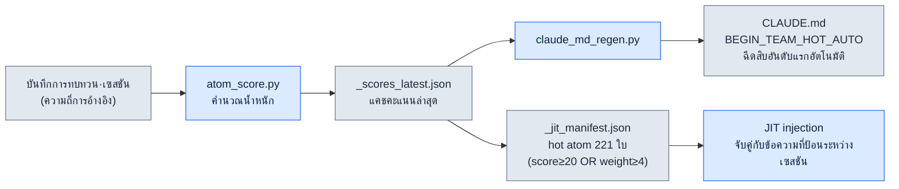
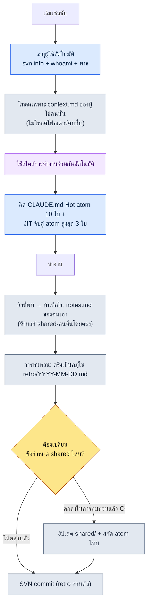

# 20.1 DD (Design Director, ผู้อำนวยการฝ่ายออกแบบ) คนเดียวบริหารหน่วยความจำการทำงานร่วมกันของห้าคน — ระบบ team_memory

> ในบทนี้ 'DD' หมายถึง Design Director (ผู้อำนวยการฝ่ายออกแบบ)

> ผู้อ่านกลุ่มหลัก: ผู้อำนวยการหรือหัวหน้าทีมในทีมขนาดเล็กที่ต้องแบกบริบทการทำงานร่วมกันไว้คนเดียว (ทีมขนาดกลาง 10–50 คน)
> ฉบับย่อสำหรับผู้อ่านที่ทำงานคนเดียว/เป็นงานอดิเรก: §20.1.7 「ถ้าทำคนเดียว เอาแค่นี้พอ」

เช้าวันจันทร์ ในห้องประชุมเดียวกัน ผมเคยอธิบายการตัดสินใจเรื่องเดียวกันให้คนสามคนฟังถึงสามครั้ง คนหนึ่งผมบอกว่า "Cooldown ต้อง SVN update ก่อนแก้ไฟล์ xlsm" สองชั่วโมงต่อมาอีกคนหนึ่งเขียนทับไฟล์เดียวกันโดยไม่ได้ update จนเกิดความขัดแย้ง และช่วงบ่ายก็มีอีกคนถามเรื่องเดียวกัน ทั้งสามคนเป็นคนดีทั้งนั้น ปัญหาไม่ได้อยู่ที่พวกเขา แต่อยู่ที่การตัดสินใจนั้นอยู่ในหัวผมเพียงคนเดียว การที่ผู้อำนวยการคนหนึ่งในทีมขนาดกลางจะหมุนบริบทการทำงานร่วมกันของอีกสี่คน — ใครรู้กฎข้อไหน ใครมักทำพลาดเรื่องอะไร และการตัดสินใจไหนถูกสรุปไปแล้ว — ให้สม่ำเสมอด้วยความจำของมนุษย์นั้นเป็นไปไม่ได้ ผ่านไปแค่เดือนเดียว คำว่า "เรื่องนี้เราเคยตัดสินใจไปแล้วไม่ใช่หรือ?" ก็กินเวลาประชุมไปครึ่งหนึ่ง

บทนี้ว่าด้วยระบบที่ยุติปัญหานั้น สินทรัพย์หลักมีสองอย่าง อย่างแรกคือ **decision card (การ์ดการตัดสินใจ) 304 ใบ**(atom) ที่ทั้งทีมใช้ร่วมกัน อย่างที่สองคือ **team_memory ของห้าคน** ที่วางทับอยู่บนนั้น — เป็นที่เก็บบริบทแยกตามผู้ใช้ แบ่งเป็นตัวผม (leeminsoo) กับสมาชิกทีม A·B·C (นามสมมติ) และโฟลเดอร์ shared ตอนเริ่มเซสชัน Claude จะระบุด้วยตัวเองว่า "ตอนนี้ใครนั่งอยู่หน้าคีย์บอร์ด" แล้วเลือกสวมเฉพาะสไตล์การทำงานร่วมกันของคนนั้น เรื่องทั่วไปของหน่วยความจำการทำงานร่วมกันมีอยู่ในหนังสือเล่มอื่นแล้ว บทนี้จะโฟกัสเฉพาะ *จุดที่ AI แตกแขนงและฉีดหน่วยความจำนั้นเข้ามาโดยอัตโนมัติ* เท่านั้น

ตัวเลขทั้งหมดในบทนี้เป็นค่าที่วัดจริง ณ เวลาที่สำรวจรายการ (atom) เดือนพฤษภาคม 2026

---

## 20.1.1 ถ้าการตัดสินใจอยู่ในหัว ทีมก็จะทำผิดซ้ำเดิม

หนังสือที่แก้ปัญหาหน่วยความจำการทำงานร่วมกันด้วย "วิกิที่ใช้ร่วมกัน" มีอยู่มาก ก็คือสร้างหน้าการตัดสินใจไว้ใน Notion แล้วทุกคนเข้ามาดูด้วยกัน พูดถูก แต่วิกิทำสองอย่างไม่ได้ มันจะถูกเห็นก็ต่อเมื่อมีคนป้อนเข้าไปเท่านั้น และจะถูกอ่านก็ต่อเมื่อมีคนไปค้นหาเท่านั้น กลางวงประชุมไม่มีใครลุกไปถามว่า "เรื่องนี้เขียนไว้ในวิกิหรือเปล่า?"

ดังนั้นเราจึงตรึงการตัดสินใจให้เป็น **ไฟล์ระดับอะตอมที่ค้นหา อ้างอิง และฉีดเข้ามาโดยอัตโนมัติได้** เราเรียกสิ่งนี้ว่า atom atom หนึ่งใบ คือการตัดสินใจหนึ่งเรื่อง ชื่อไฟล์คือตัวระบุในตัวเอง จึงค้นเจอด้วย `rg` ได้ frontmatter เป็นมาตรฐาน สคริปต์จึงประมวลผลได้ และเนื้อหาสั้นจึงใส่เข้าบริบทได้ทั้งก้อน ใต้ `workspace/team_memory/atoms/` ในพีซีของบริษัทมี atom แบบนี้สะสมอยู่ 304 ใบ

| โฟลเดอร์ | จำนวน | ลักษณะ |
|---|---|---|
| `rules/` | 304 | กฎป้องกันการเกิดซ้ำ (xlsm·SVN·เอกสาร·สกิล ฯลฯ) |
| `concepts/` | 19 | คำศัพท์โดเมนที่ปรากฏซ้ำในการทบทวน |
| `decisions/` | 26 | การตัดสินใจที่ระบุวันที่·ผู้เกี่ยวข้อง·เหตุผลชัดเจน |
| `feedback/` | 11 | ลูปแก้ไขการทำงานร่วมกัน (ความผิดพลาด → บทเรียน) |
| `rnd/` | 4 | ข้อสังเกตที่ยังไม่ยืนยัน ซึ่งอาจใช้ไม่ได้เมื่อมีการแพตช์เครื่องมือ |

รวมเป็น 304 ใบ ห้าโฟลเดอร์นี้คือ "ความจำระยะยาว" ของทีม ประเด็นสำคัญคือชื่อโฟลเดอร์เป็นตัวบอกระดับความน่าเชื่อถือของ atom ในตัวเอง `rules/` คือกฎที่ผ่านการพิสูจน์จากการเกิดซ้ำหลายครั้ง ส่วน `rnd/` คือข้อสังเกตชั่วคราวที่อาจถูกทิ้งเมื่อเวอร์ชัน UE เปลี่ยน ภายในหน่วยความจำเดียวกัน "สิ่งที่ยืนยันแล้ว" กับ "สมมติฐาน" ก็ถูกแยกด้วยโฟลเดอร์ จึงป้องกันเหตุที่สมาชิกใหม่เข้าใจผิดว่าวิธีเลี่ยงใน `rnd/` เป็นกฎถาวรได้อย่างเป็นโครงสร้าง

> นิยาม 5 คุณสมบัติของ atom (หลักหนึ่งการตัดสินใจ·การตั้งชื่อแบบชัดเจน·frontmatter มาตรฐาน·ระบุความสัมพันธ์·ตามรอยได้) กล่าวไว้แล้วในส่วนที่ 5 บทนี้ไม่ได้พูดถึงนิยาม แต่พูดถึง *จุดที่ห้าคนร่วมกันบริหาร 304 ใบ*

---

## 20.1.2 Hot atom — การตัดสินใจที่ใช้บ่อยจะลอยขึ้นมาเองด้านบน

จะให้อ่านครบทั้ง 304 ใบทุกเซสชันคงไม่ได้ ดังนั้นจึงให้คะแนน **score**(น้ำหนัก) กับ atom แต่ละใบ แล้วแสดงเฉพาะใบที่คะแนนสูงโดยอัตโนมัติ `atom_score.py` คำนวณคะแนนจากความถี่การใช้·น้ำหนักที่กำหนดเอง·ความใหม่ ด้านล่างคือ score ที่วัดจริงของสิบอันดับแรกตามเกณฑ์การวัดเดือนพฤษภาคม 2026

| score | atom | บังคับอะไร |
|---|---|---|
| 356.53 | `view_html_filename_convention` | ข้อกำหนดการตั้งชื่อ View_*.html (Phase/Status → Domain → Topic) |
| 349.26 | `xlsm_svn_update_before_edit` | SVN update ก่อนแก้ xlsm + รักษาแถวเดิมไว้ |
| 341.03 | `claude_role_transition_phase2` | ยกระดับ Claude จาก passive trainee → active partner (การตัดสินใจ) |
| 340.26 | `skill_audit_score` | วัดความถี่การใช้สกิลจากบันทึก SVN |
| 329.26 | `docs_is_source_of_truth` | ให้ workspace/docs เป็นฉบับจริง |
| 326.84 | `claudeskills_naming_separation` | แยกชื่อ ClaudeSkills ออกจากสกิลตัวละครในเกม |
| 324.36 | `draft_doc_body_verify_before_skip` | ห้าม skip ด้วยตำแหน่งเพียงอย่างเดียว ต้อง grep เนื้อหาแล้วประเมิน |
| 309.43 | `json_over_schema_doc_as_source_of_truth` | ผลลัพธ์ JSON จริงเป็นฉบับจริงเหนือเอกสาร schema |
| 294.93 | `integrity_check_clickup_notify` | เมื่อตรวจสอบความสอดคล้องล้มเหลว ให้แจ้ง ClickUp ทันที |
| 293.26 | `data_entry_schema_first` | ลำดับการป้อนข้อมูล ($schema → Enum → proto) |

เห็นเหตุที่ผมอธิบายไปสามครั้งในตอนต้นหรือไม่ — "SVN update ก่อนแก้ xlsm" นั่นคือ `xlsm_svn_update_before_edit` ซึ่งมี score 349.26 อยู่อันดับ 2 ของทั้งหมด การที่คะแนนสูงหมายความว่ามันถูกอ้างอิงบ่อยในระดับนั้น และเป็นกฎที่คนมักทำผิดในระดับเดียวกัน ผมไม่ต้องพูดด้วยปากซ้ำสามครั้งอีกต่อไป สิบอันดับ score แรกถูกฉีดเข้าพื้นที่ `<!-- BEGIN_TEAM_HOT_AUTO -->` ของ `CLAUDE.md` โดยอัตโนมัติ จึงปรากฏบนหน้าจอแรกไม่ว่าใครจะเปิดเซสชันจากโฟลเดอร์ไหนก็ตาม

ถ้าหยุดแค่นี้ก็เป็นเพียง "การปักหมุดกฎที่ดูบ่อย" ความแตกต่างที่แท้จริงคือ score ไม่ได้มาจากมือคน แต่มาจากการที่ **ระบบวัดตัวมันเอง** แล้วให้คะแนน



ลูปนี้ปิดวงในตัวเอง ยิ่ง atom ถูกอ้างอิงบ่อยในการทบทวน score ก็ยิ่งสูง พอ score สูง มันก็ยิ่งปรากฏชัดทั้งบนหัว CLAUDE.md และใน JIT manifest พอปรากฏชัดก็ยิ่งถูกอ้างอิงอีก เป็นโครงสร้างที่การตัดสินใจซึ่งใช้บ่อยจะลอยขึ้นด้านบน *ด้วยตัวมันเอง* ในทางกลับกัน atom ที่ไม่ถูกอ้างอิงเลยตลอด 6 เดือนจะมี score จมลงและค่อย ๆ หายไปจากสายตาเอง คนไม่ต้องมานั่งตัดสินว่า "อันนี้ไม่ใช้แล้ว เอาลงเถอะ"

---

## 20.1.3 การฉีด JIT — ข้อความที่ป้อนหนึ่งบรรทัดดึงการตัดสินใจที่เกี่ยวข้องมา 3 ใบ

score กำหนด "สิ่งที่เห็นเสมอ" ส่วนการฉีด JIT (Just-In-Time) ดึง "สิ่งที่ตรงกับคำที่เพิ่งพูด" เข้ามา ขณะที่ผู้ใช้ป้อนพรอมต์ hook จะเทียบข้อความนั้นกับ regex ใน atom manifest แล้วแทรก atom ที่เกี่ยวข้องเข้าไปในบริบท

ตรรกะหลักของ hook นี้ทำตามรูปแบบของ `inject_atom.py` ในพีซีของบริษัทตรง ๆ ด้านล่างคือส่วนหลักจริงของ `inject_memory.py` ซึ่งเขียนใหม่ด้วยรูปแบบเดียวกันสำหรับพีซีส่วนตัว — เรียงตาม score จากมากไปน้อย → จับคู่ regex → สูงสุด 3 ใบ → truncate ที่ 6000 ตัวอักษร และไม่ว่าจะเกิดอะไรขึ้นก็ exit 0

```python
# จัดเรียงตาม score จากมากไปน้อยแล้วจับคู่
atoms_sorted = sorted(atoms, key=lambda a: a.get("score", 0), reverse=True)

matches = []
for atom in atoms_sorted:
    if len(matches) >= max_matches:          # max_matches = 3
        break
    try:
        if re.search(atom["regex"], prompt, re.IGNORECASE):
            matches.append(atom)
    except re.error:
        continue                              # regex ที่ผิดพลาดให้ข้ามแล้วทำต่อ

if not matches:
    emit_empty()                              # ถ้าไม่มีการจับคู่ ให้ตอบว่าง (ปกติ)
    return

chunks = []
for atom in matches:
    body = atom_path.read_text(encoding="utf-8")
    if len(body) > max_body:                  # max_body = 6000
        body = body[:max_body] + "\n\n[...truncated]\n"
    chunks.append(f"\n\n=== [JIT Inject] {name} (score {score}) ===\n\n{body}\n...")
```

ประเด็นสำคัญคือการออกแบบนี้อนุรักษ์นิยม ถ้าไม่มีการจับคู่ ก็ตอบว่างแล้วจบ (ปกติ) ถ้า regex เสีย ก็ข้ามเฉพาะ atom ใบนั้นแล้วหมุนต่อ ถ้าเนื้อหาเกิน 6000 ตัวอักษร ก็ตัด และ hook ทั้งก้อนจะจบด้วย `exit 0` ไม่ว่าจะเกิดข้อยกเว้นใด — แม้การฉีดหน่วยความจำจะล้มเหลว ขั้นตอนการทำงานของผู้ใช้ก็จะไม่หยุดชะงักเด็ดขาด "ถ้ามีก็ช่วย ถ้าไม่มีหรือเสียก็ถอยออกไปเงียบ ๆ" คือหลักข้อที่ 1 ของระบบนี้

---

## 20.1.4 [บันทึกเซสชันจริง (worked transcript)] พอเปิดเซสชัน Claude จะหาให้ได้ก่อนว่า "คุณคือใคร"

ถึงตรงนี้ถ้าเป็น atom (ความจำระยะยาว) ต่อไปนี้คือ team_memory ของห้าคน (ความจำระยะสั้น·การทำงานร่วมกันแยกตามคน) เราจะตามรอยจุดเริ่มต้นของเซสชันจริงหนึ่งครั้งจนจบในรูปแบบ ป้อน → ทำงาน → ผลลัพธ์ เวทีคือพีซีของบริษัท สถานการณ์คือสมาชิกทีม C (นามสมมติ, โฟลเดอร์ `팀원 C/`) เปิดโฟลเดอร์งานของโปรเจกต์ A ที่โต๊ะตัวเอง

### ขั้นที่ 1 — ป้อน: พรอมต์แรกธรรมดา ๆ หนึ่งบรรทัด

สมาชิกทีม C เริ่มงานแบบไม่มีอะไรพิเศษ

```text
มาทบทวนต่อจากร่างระบบ targeting ที่ตกลงกันเมื่อวานกัน
```

ไม่ได้เขียนสักคำว่าตัวเองเป็นใคร ต้องทำตามกฎข้อไหน ไม่จำเป็นต้องเขียน

### ขั้นที่ 2 — ทำงาน: Claude ระบุผู้ใช้โดยอัตโนมัติ

ตามขั้นตอน "การระบุอัตโนมัติเมื่อเริ่มเซสชัน" ใน `CLAUDE.md` ก่อนที่ Claude จะสร้างคำตอบ มันจะหาให้ได้ก่อนว่าใครอยู่หน้าคีย์บอร์ด คำสั่งที่รันมีสามคำสั่ง

```bash
svn info --show-item last-changed-author   # author ของคอมมิตล่าสุดในสำเนางาน SVN
whoami                                      # บัญชีล็อกอินของ OS
# และพาธงานปัจจุบัน (พีซีเครื่องไหน โฟลเดอร์ผู้ใช้ของใคร)
```

สัญญาณทั้งสามถูกเทียบกับการแมปใน `team_memory/users.md` แล้วยืนยันว่าเป็น `팀원 C` จากนั้น Claude จะโหลด **เฉพาะโฟลเดอร์ของผู้ใช้คนนั้นใบเดียว**

```text
team_memory/
├── atoms/                       ← ใช้ร่วมกัน (304 ใบ, score อันดับต้นอยู่ใน CLAUDE.md แล้ว)
├── leeminsoo/    context.md     ← (ไม่โหลด — ไม่ใช่ผม)
├── teammate_a/   context.md     ← (ไม่โหลด)
├── teammate_b/   context.md     ← (ไม่โหลด)
├── teammate_c/   context.md     ← ★ โหลดเฉพาะอันนี้
│                 notes.md       ← ★ สำหรับบันทึกสิ่งที่ตนเองค้นพบ
│                 retro/
└── shared/       conventions.md  commit_rules.md  ...  ← อ้างอิงข้อกำหนดเท่านั้น ห้ามแก้ไข
```

### ขั้นที่ 3 — ผลลัพธ์: สไตล์การทำงานร่วมกันของคนนั้นถูกสวมเข้าโดยอัตโนมัติ

สไตล์การทำงานร่วมกันที่อยู่ใน `팀원 C/context.md` จะถูกใช้กับเซสชันนี้เท่านั้น คำตอบของ Claude จึงเริ่มต้นแบบนี้

```text
ระบุได้ว่าเป็นคุณ팀원 C (svn author: teammate_c / ตรวจสอบพาธแล้ว)
โหลดสไตล์การทำงานร่วมกันจาก teammate_c/context.md เสร็จแล้ว

จะทบทวนต่อจากงานเมื่อวาน (Draft_Targeting_System_v0.1.md)
decision card ที่เกี่ยวข้องซึ่งถูกฉีดเข้ามา (JIT, 3 ใบ):
  - docs_is_source_of_truth (329.26)
  - draft_doc_body_verify_before_skip (324.36) — ห้าม skip ด้วยตำแหน่งเพียงอย่างเดียว ต้อง grep เนื้อหาแล้วประเมิน
  - decision_summary_not_clickup_mirror

จะตรวจสอบเนื้อหาด้วย grep ก่อนแล้วจึงเริ่มทบทวน สิ่งที่พบระหว่างทบทวน
จะบันทึกไว้ใน teammate_c/notes.md เท่านั้น และจะไม่แก้ไข shared/ โดยตรง
```

### ขั้นที่ 4 — การตรวจสอบและการยืนยันขอบเขตโดยมนุษย์

ตรงนี้สิ่งที่ผม (ในฐานะผู้อำนวยการ หรือในฐานะสมาชิกทีม C เอง) ตรวจสอบมีสองอย่าง การระบุถูกต้องหรือไม่ และมันรักษาขอบเขตหรือไม่ ในข้อเสนอถัดไปของ Claude เราจับการละเมิดขอบเขตได้หนึ่งครั้ง

```text
[ข้อเสนอของ Claude]
จากการทบทวนพบความขัดแย้งของกฎการตั้งชื่อ จะให้แก้ไขหัวข้อคำศัพท์ targeting
ใน shared/conventions.md เลยไหม?

[การปฏิเสธของมนุษย์]
ไม่ shared/ จะแก้ไขได้หลังจากตกลงกันในการทบทวนเท่านั้น ตอนนี้ให้บันทึกไว้ใน
teammate_c/notes.md แค่ว่า "shared/conventions.md คำศัพท์ targeting ขัดแย้ง — วาระการทบทวน" เท่านั้น

[ผลลัพธ์หลัง Claude ขอใหม่]
เข้าใจแล้ว ยกเลิกการแก้ไข shared/ โดยตรง
บันทึกไว้ใน teammate_c/notes.md เป็นวาระการทบทวนแล้ว:
  - 2026-06-06 conventions.md คำศัพท์ targeting 'lock-on' vs 'target-lock' ขัดแย้ง
    → ต้องตกลงกันในการทบทวนทีมครั้งถัดไป (พักการแก้ไข shared)
```

นี่คือกลไกความปลอดภัยของการบริหารห้าคน ผู้ใช้แต่ละคนเขียนได้ **เฉพาะใน notes.md ของตัวเอง** เท่านั้น แตะโฟลเดอร์ของคนอื่นและ shared โดยตรงไม่ได้ shared จะเปลี่ยนได้หลังจากตกลงกันในการทบทวนเท่านั้น ดังนั้นถึงสี่คนจะทำงานบนหน่วยความจำเดียวกัน ก็ไม่เขียนทับบริบทของกันและกัน สิ่งที่ค้นพบจะรวมไว้ในโน้ตส่วนตัวก่อน แล้วต้องผ่านด่านที่ชื่อว่าการทบทวนเท่านั้นจึงจะถูกยกระดับขึ้นเป็นข้อกำหนดที่ทีมใช้ร่วมกัน

---

## 20.1.5 ภาพรวมทั้งหมดของการบริหารห้าคนในหน้าเดียว

เราจะดูเส้นทางทั้งหมดที่เซสชันหนึ่งหมุนไปในหน้าเดียว เป็นหนึ่งรอบที่เริ่มจากการระบุตัวตน และจบที่การตรึงเป็นกฎในการทบทวน



จุดแยกที่มุมขวาล่างคือหัวใจของระบบนี้ สิ่งที่บุคคลค้นพบจะไหลไปยัง notes ส่วนตัว ส่วนข้อกำหนด·atom ใหม่ที่กระทบทั้งทีมจะขึ้นไปยัง shared ก็ต่อเมื่อผ่านด่านการทบทวนแล้วเท่านั้น เหตุผลที่คนเดียวหมุนงานของห้าคนได้โดยไม่เกิดความขัดแย้งอยู่ที่ด่านเดียวนี้ และขั้นสุดท้ายต้องเป็น SVN commit เสมอ — เพราะสิ่งที่ค้นพบแต่ไม่ได้ตรึงเป็นกฎ จะกลับเข้าไปอยู่ในหัวอีกครั้งในเซสชันถัดไป

---

## 20.1.6 ความล้มเหลวที่พบบ่อยและวิธีแก้

นี่คือกับระเบิดที่เหยียบจริงระหว่างหมุน team_memory ของห้าคน

| ความล้มเหลว | อาการ | วิธีแก้ |
|---|---|---|
| ระบุล้มเหลว | svn author เป็นบัญชีร่วม จึงระบุผู้ใช้ไม่ได้ | แมปสัญญาณหลายอย่าง (พาธ·บัญชี) ใน `users.md` ถ้าระบุไม่ได้ให้ถาม |
| แก้ shared โดยพลการ | Claude แก้ข้อกำหนดร่วมด้วยความหวังดี | atom "shared แก้ได้หลังตกลงในการทบทวนเท่านั้น" + รูปแบบการปฏิเสธใน worked transcript |
| ไม่ commit notes | สิ่งที่พบเหลือแค่ในเครื่องแล้วระเหยไปในเซสชันถัดไป | บังคับ SVN commit ตอนจบการทบทวน (`feedback-svn-zero-red`) |
| Hot atom ค้าง | score หยุดนิ่ง กฎเก่าถูกปักไว้บนสุด | รัน `atom_score.py` เป็นรอบ → อัปเดต `_scores_latest.json` |
| เข้าใจ rnd ผิดเป็นกฎ | สมาชิกใหม่ใช้วิธีเลี่ยงชั่วคราวเหมือนกฎถาวร | แยกโฟลเดอร์ `rnd/` + ระบุเงื่อนไขการใช้ไม่ได้ใน frontmatter |

ความล้มเหลวที่แพงที่สุดตรงนี้คือบรรทัดที่สอง "แก้ shared โดยพลการ" AI มีสัญชาตญาณอยากช่วยอย่างแรงกล้า พอพบความขัดแย้งก็จะลงมือแก้ทันที การปฏิเสธใน worked transcript ของ §20.1.4 ต้องถูกตรึงเป็น atom ไม่ใช่แค่การแก้ครั้งเดียว จึงจะขีดเส้นเดิมในเซสชันของผู้ใช้คนอื่นในครั้งถัดไปได้

---

## 20.1.7 ถ้าทำคนเดียว เอาแค่นี้พอ

ถึงไม่มีทีม 80% ของโครงสร้างนี้คนเดียวก็ใช้ได้ตรง ๆ แค่ลดผู้ใช้ห้าคนให้เหลือโฟลเดอร์เดียวก็พอ

- **โฟลเดอร์ atom แค่สองอันพอ** แยกแค่ `rules/`(ยืนยันแล้ว) กับ `rnd/`(สมมติฐาน) แค่ตรึงกฎที่ทำผิดบ่อย 5–10 ข้อให้เป็น atom คำว่า "เคยตัดสินใจไปแล้วไม่ใช่หรือ?" ก็หายไป
- **JIT เริ่มได้โดยไม่ต้องมี score** เขียนแค่ regex ใน manifest แล้วตั้ง score ให้เท่ากันทั้งหมด แค่ฉีด atom ที่จับคู่ได้ 3 ใบก็เห็นผลแล้ว
- **notes เป็นไฟล์เดียว** ไม่ต้องแตกตามผู้ใช้ ใช้ `notes.md` ไฟล์เดียว ขอแค่รักษาด่านการทบทวนไว้ — โน้ตด้นสดให้ลงใน notes ส่วนกฎที่ยืนยันแล้วให้ผ่านการทบทวนแล้วขึ้นไปยัง `rules/`

แก่นคือ "การย้ายการตัดสินใจจากในหัวไปเป็นไฟล์" และไม่ว่าจะห้าคนหรือคนเดียว การทำนั้นก็เหมือนกัน

---

### ลองทำดู — หนึ่งขั้นที่ทำได้วันนี้

ลองตรึงกฎที่ทำผิดบ่อยหนึ่งข้อให้เป็น atom แล้วทำให้มันถูกฉีดเข้ามาอัตโนมัติด้วย JIT ดู

1. **setup** — สร้างโฟลเดอร์ `atoms/rules/` แล้วเขียนกฎที่อธิบายซ้ำบ่อยที่สุด 1 ข้อเป็นไฟล์ เช่น `atoms/rules/xlsm_svn_update_before_edit.md`
2. **prompt** — เขียนสามบรรทัด「เมื่อไหร่·อะไร·ทำไม」ลงในเนื้อหาของ atom นั้น ("ต้อง SVN update ก่อนแก้ xlsm เสมอ — ถ้าไม่ทำจะเขียนทับแถวของคนอื่น")
3. **verify** — เพิ่ม `{"name":..., "regex":"xlsm|쿨타임", "score":100, "path":...}` ลงใน JIT manifest แล้วป้อน "쿨타임 수정" ลงในพรอมต์ ตรวจดูว่า atom นั้นถูกบันทึกเป็น hit ใน `_injection_log.txt` หรือไม่

ถ้าถูกบันทึก กฎนั้นก็อยู่ในระบบแล้ว ไม่ใช่อยู่ในหัวคุณอีกต่อไป

---

### สรุปประเด็นสำคัญของบท

- ย้ายการตัดสินใจจากในหัวไปเป็นไฟล์ atom
- score·JIT ทำให้การตัดสินใจที่ใช้บ่อยลอยขึ้นมาเอง
- shared จะเปลี่ยนได้ก็ต่อเมื่อผ่านด่านการทบทวนเท่านั้น

### ตัวอย่างบทถัดไป

- 20.2 หน่วยความจำแยกตามสมาชิกทีม — แยกช่องผู้ใช้กับช่องที่ใช้ร่วมกันด้วยเครื่องมือ เพื่อกันเหตุที่ค่าทดลองแปลงร่างกลายเป็นการตัดสินใจ
