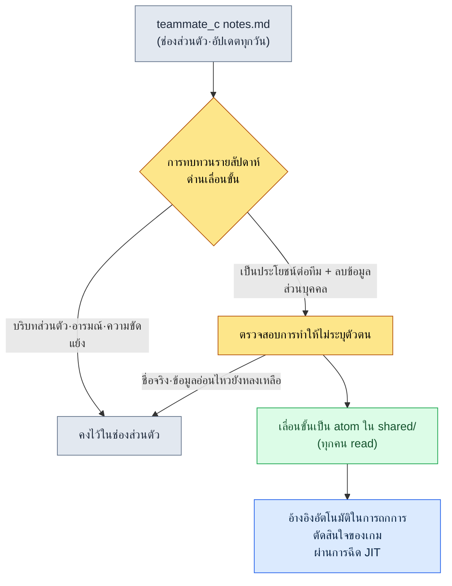

# 20.2 หน่วยความจำแยกตามสมาชิกทีม — การแยกช่องของผู้ใช้ออกจากช่องที่ใช้ร่วมกัน

ราวเที่ยงวันพุธ สมาชิกทีม B ส่งข้อความมาทางแชตภายในทีม "ค่า Cooldown ของการต่อสู้ที่ผู้อำนวยการกำหนดไว้ที่ 0.8 วินาทีเมื่อสัปดาห์ที่แล้ว แต่ในโน้ตของผมเขียนไว้ว่า 0.6 วินาที อันไหนถูกครับ?" ผมชะงักไปครู่หนึ่ง 0.8 วินาทีคือการตัดสินใจร่วมกัน ส่วน 0.6 วินาทีคือค่าที่สมาชิกทีม B ลองรันไว้ชั่วคราวในบิลด์ทดสอบของตัวเอง ทั้งสองค่าถูกเขียนไว้ใน "หน่วยความจำ" เหมือนกัน ปัญหาคือทั้งสองค่ามันปนกันอยู่ในช่องเดียวกัน สมาชิกทีม B เข้าใจผิดว่าค่าทดลองของตัวเองคือการตัดสินใจของบริษัท และเกือบจะอัปเดตชีตข้อมูลด้วยค่าที่ผิด

เหตุนี้ไม่ได้เกิดเพราะหน่วยความจำไม่มีข้อมูล ตรงกันข้าม มันเกิดเพราะข้อมูลสะสมไว้ดีเกินไป แต่ไม่มีเส้นแบ่งว่าช่องไหนคือช่องที่ใช้ร่วมกันและช่องไหนคือช่องส่วนตัว ถ้าใน §20.1 ผมปูจุดขายว่าคนห้าคนมองเห็นข้อเท็จจริงเดียวกัน (shared atom) บทนี้ก็เป็นด้านตรงข้าม — เรื่องที่ว่า **คนห้าคนต่างมีช่องของตัวเองแยกกัน** เป็นตู้เก็บเอกสารตู้เดียวกัน แต่ช่องมีสองชนิด และถ้าไม่บังคับสองชนิดนั้นด้วยเครื่องมือ เหตุการณ์ 0.6 วินาทีข้างต้นจะต้องเกิดขึ้นแน่นอน

---

## 20.2.1 ตู้เก็บเอกสารที่มีห้าช่อง

`team_memory/` ของโปรเจกต์ A แบ่งเป็นช่องของคนห้าคน ได้แก่ ตัวผมเอง (leeminsoo) สมาชิกทีม A สมาชิกทีม B สมาชิกทีม C และ `shared` สี่ช่องแรกคือช่องส่วนตัวแยกตามผู้ใช้ ส่วนช่องสุดท้ายคือช่องที่ใช้ร่วมกันซึ่งทุกคนเปิดได้

<svg viewBox="0 0 720 250" xmlns="http://www.w3.org/2000/svg" font-family="sans-serif" font-size="13">
  <rect x="10" y="10" width="700" height="230" fill="#fafafa" stroke="#ccc" rx="6"/>
  <text x="30" y="38" font-weight="bold" font-size="15">team_memory/  (ตู้ 1 ตู้)</text>
  <!-- 개인 칸 4 -->
  <g>
    <rect x="30" y="60" width="150" height="160" fill="#eef4ff" stroke="#5a7fbf" rx="4"/>
    <text x="105" y="84" text-anchor="middle" font-weight="bold">leeminsoo/</text>
    <text x="105" y="106" text-anchor="middle" font-size="11" fill="#555">ผู้อำนวยการ (ตัวผมเอง)</text>
    <line x1="42" y1="118" x2="168" y2="118" stroke="#cdd" />
    <text x="105" y="140" text-anchor="middle" font-size="11">context.md</text>
    <text x="105" y="160" text-anchor="middle" font-size="11">notes.md</text>
    <text x="105" y="180" text-anchor="middle" font-size="11">+ กลยุทธ์/การประเมิน</text>
    <text x="105" y="205" text-anchor="middle" font-size="10" fill="#a33">ระดับป้องกันสูงสุด</text>
  </g>
  <g>
    <rect x="195" y="60" width="120" height="160" fill="#eef4ff" stroke="#5a7fbf" rx="4"/>
    <text x="255" y="84" text-anchor="middle" font-weight="bold">สมาชิกทีม A/</text>
    <line x1="207" y1="118" x2="303" y2="118" stroke="#cdd" />
    <text x="255" y="140" text-anchor="middle" font-size="11">context.md</text>
    <text x="255" y="160" text-anchor="middle" font-size="11">notes.md</text>
  </g>
  <g>
    <rect x="330" y="60" width="120" height="160" fill="#eef4ff" stroke="#5a7fbf" rx="4"/>
    <text x="390" y="84" text-anchor="middle" font-weight="bold">สมาชิกทีม B/</text>
    <line x1="342" y1="118" x2="438" y2="118" stroke="#cdd" />
    <text x="390" y="140" text-anchor="middle" font-size="11">context.md</text>
    <text x="390" y="160" text-anchor="middle" font-size="11">notes.md</text>
  </g>
  <g>
    <rect x="465" y="60" width="120" height="160" fill="#eef4ff" stroke="#5a7fbf" rx="4"/>
    <text x="525" y="84" text-anchor="middle" font-weight="bold">สมาชิกทีม C/</text>
    <line x1="477" y1="118" x2="573" y2="118" stroke="#cdd" />
    <text x="525" y="140" text-anchor="middle" font-size="11">context.md</text>
    <text x="525" y="160" text-anchor="middle" font-size="11">notes.md</text>
  </g>
  <!-- 공유 칸 -->
  <g>
    <rect x="600" y="60" width="90" height="160" fill="#fff2e0" stroke="#c98a3a" rx="4"/>
    <text x="645" y="84" text-anchor="middle" font-weight="bold">shared/</text>
    <line x1="612" y1="118" x2="678" y2="118" stroke="#e3c">  </line>
    <text x="645" y="142" text-anchor="middle" font-size="11">atom</text>
    <text x="645" y="162" text-anchor="middle" font-size="11">(ใช้ร่วมกัน)</text>
    <text x="645" y="205" text-anchor="middle" font-size="10" fill="#a33">ทุกคน read</text>
  </g>
</svg>

ช่องส่วนตัวสี่ช่องผมระบายด้วยสีน้ำเงิน ส่วนช่องที่ใช้ร่วมกันหนึ่งช่องระบายด้วยสีส้ม เหตุที่สีต่างกันก็เพราะกฎการเข้าถึงต่างกัน ช่องสีน้ำเงินเปิดได้เฉพาะเจ้าของและผู้อำนวยการ ส่วนช่องสีส้มเปิดได้ทุกคน เหตุการณ์ 0.6 วินาทีเกิดขึ้นเพราะสมาชิกทีม B นำค่าทดลองที่ควรเขียนลงในช่องสีน้ำเงินของตัวเอง ไปเรียกรวม ๆ ว่า "หน่วยความจำ" โดยไม่แยกสี แล้วปฏิบัติต่อมันเหมือนเป็นการตัดสินใจร่วมกัน หากแบ่งช่องในเชิงกายภาพ — กล่าวคือแบ่งไดเรกทอรี — อย่างน้อยก็มีเบาะแสให้แยกแยะสองสิ่งนี้ได้จากที่ว่าเขียนลงไว้ตรงไหน

ประเด็นสำคัญตรงนี้ไม่ใช่ที่ว่ามีโฟลเดอร์สองโฟลเดอร์ แต่อยู่ที่ว่า **กฎติดตามมาพร้อมกับแต่ละช่อง** สิ่งที่อยู่ใน `shared/` คือการตัดสินใจของบริษัทและใคร ๆ ก็อ่านได้ สิ่งที่อยู่ใน `สมาชิกทีม B/` คือบริบทการทำงานของคนคนนั้น และมีแค่เจ้าตัวกับผมที่อ่านได้ แม้จะเป็น 0.6 วินาทีเหมือนกัน แต่มันอยู่ในช่องไหนก็เป็นตัวกำหนดว่ามันคือ "กำลังทดลอง" หรือ "ตัดสินใจแล้ว"

---

## 20.2.2 ในช่องของคนหนึ่งคนมีไฟล์สองไฟล์

เมื่อเปิดช่องของผู้ใช้แต่ละคน จะเห็นไฟล์สองไฟล์ คือ `context.md` และ `notes.md` ชื่อเรียบง่ายแต่บทบาทตรงกันข้าม

`context.md` เขียนว่า **ตอนนี้คนคนนั้นคือใคร** บทบาท ระบบที่รับผิดชอบ งานที่กำลังดำเนินอยู่ และสไตล์การทำงาน ค่อนข้างเสถียร และเป็นไฟล์ที่ผมในฐานะผู้อำนวยการเปิดดูห้านาทีก่อนการพูดคุยแบบ 1:1 เมื่อเปิด `context.md` ของสมาชิกทีม A จะเห็นข้อความทำนองว่า "รับผิดชอบระบบการต่อสู้ ปัจจุบันกำลังปรับสมดุล Cooldown ของสกิล เป็นคนที่ขอหลักฐานเชิงข้อมูลก่อนเสมอ" ถ้าเข้าไปคุย 1:1 โดยไม่ดูสิ่งนี้ ก็จะเสียสิบนาทีแรกไปกับคำถาม "ช่วงนี้ทำอะไรอยู่บ้าง?"

`notes.md` เขียนว่า **ตอนนี้คนคนนั้นกำลังเจออะไรอยู่** ค่าทดลองของแต่ละวัน จุดที่ติดขัด การตัดสินใจเล็ก ๆ บันทึกความผิดพลาด และโน้ตการหารือกับสมาชิกคนอื่น มันมีความผันผวนสูงและถูกอัปเดตบ่อย 0.6 วินาทีของสมาชิกทีม B เดิมทีควรเข้ามาอยู่ตรงนี้ เช่น "ทดสอบที่ 0.6 วินาที เร็วเกินจนอินพุตถูกดันตกหล่น — ตัดสินใจทำตามค่าร่วม 0.8 วินาที"

เหตุที่แยกสองไฟล์นี้ก็เพราะรอบการอัปเดตต่างกัน `context.md` แก้ไขปีละไตรมาสครั้งหนึ่งก็พอ แต่ `notes.md` สะสมขึ้นทุกวัน ถ้าปนกันไว้ ข้อมูลที่เสถียรจะถูกกลบด้วยสัญญาณรบกวนรายวัน หากทำงานคนเดียว การแยกแบบนี้อาจดูเกินจำเป็น — กรณีนั้นใช้แค่ `notes.md` ไฟล์เดียว แล้วเก็บ `context.md` ไว้ในหัวก็ได้ แต่แม้คนจะเพิ่มเป็นแค่สองคน การที่อ่าน `context.md` ของอีกฝ่ายได้ภายในห้านาทีเพื่อเตรียมการคุย 1:1 ก็สร้างความต่างได้มาก

---

## 20.2.3 ด่านที่การทบทวนเลื่อนขึ้นสู่ shared

แบ่งช่องส่วนตัวกับช่องที่ใช้ร่วมกันแล้วก็ยังไม่จบ สิ่งที่ยุ่งยากที่สุดคือ **เนื้อหาบางอย่างในช่องส่วนตัวต้องเลื่อนขึ้นไปสู่ช่องที่ใช้ร่วมกัน** สมมติว่าสมาชิกทีม C เขียนความผิดพลาดที่ว่า "ถ้าลำดับ enum คลาดเคลื่อนตอน import ชีตข้อมูล มันจะพังแบบเงียบ ๆ ที่ runtime" ลงใน `notes.md` ของตัวเอง นี่คือบันทึกส่วนตัวของคนคนนั้น แต่ถ้าทั้งทีมรู้ก็จะป้องกันความผิดพลาดเดียวกันได้ ทว่าจะแชร์ `notes.md` ส่วนตัวทั้งหมดก็ไม่ได้ — ในนั้นปนเปด้วยสไตล์การทำงาน อารมณ์ตอนติดขัด และความขัดแย้งกับสมาชิกคนอื่น

ดังนั้นระหว่างส่วนตัว → ใช้ร่วมกัน จึงต้องมี **ด่าน** การทบทวนคือด่านนั้น เมื่อเขียนการทบทวน ก็กรองครั้งหนึ่งว่า "ในสิ่งที่ฉันเจอสัปดาห์นี้ มีอะไรบ้างที่ทีมควรรู้" แล้วเลื่อนขั้นเฉพาะสิ่งที่กรองได้ให้เป็น atom ใน `shared/` ลำดับเป็นดังนี้

เกณฑ์การตัดสินของด่านมีสองข้อ **ข้อแรก เป็นประโยชน์ต่อทีมหรือไม่** ไม่ใช่รสนิยมส่วนตัวหรือสภาพร่างกายในวันนั้น ข้อสอง **ข้อมูลส่วนบุคคลถูกลบออกหรือไม่** ไม่ใช่ "สมาชิกทีม C ทำผิดที่ enum อีกแล้ว" แต่เหลือไว้แค่ข้อเท็จจริงว่า "เพิ่มการตรวจสอบลำดับ enum ตอน import ชีตข้อมูลกันเถอะ" เฉพาะสิ่งที่ผ่านสองด่านนี้เท่านั้นที่ไปสู่ `shared/` สิ่งที่ผ่านไม่ได้ก็คงไว้ในช่องส่วนตัวตามเดิม

หากไม่มีด่านนี้ ก็จะพังในทางใดทางหนึ่งจากสองทาง ถ้าด่านหลวมเกินไป ข้อมูลส่วนบุคคลจะรั่วไปสู่ช่องที่ใช้ร่วมกัน เกิดเหตุที่ตรงข้ามกับ 0.6 วินาที — คือโน้ตส่วนตัวถูกเปิดเผยต่อทุกคน ถ้าไม่มีด่านเลย บทเรียน enum ของสมาชิกทีม C ก็จะถูกขังอยู่ในช่องของคนคนนั้น และสมาชิกทีม A ก็จะทำผิดเหมือนกันซ้ำ การใช้การทบทวนเป็นด่านทำให้แยกงานสองอย่างที่ตรงข้ามกันโดยสิ้นเชิง — "การรั่วไหลของข้อมูลส่วนบุคคล" กับ "การแปลงเป็นสินทรัพย์การเรียนรู้" — ออกจากกันได้ในการกระทำเดียว

พรอมต์การเลื่อนขั้นที่ผมใช้จริงนั้นสั้น หลังการทบทวนเสร็จ ผมโยนคำสั่งแบบนี้ลงไป

> "เลือกเฉพาะรายการใน notes.md ของฉันสัปดาห์นี้ที่เป็นประโยชน์ต่อทั้งทีม ในแต่ละรายการให้ตัดชื่อคนและสถานการณ์ความล้มเหลวที่เฉพาะเจาะจงออก แล้วเขียนใหม่เป็นประโยคที่เป็นตัวเลือก atom ซึ่งเหลือไว้เพียง 'อะไรและทำอย่างไร' ส่วนโน้ตอารมณ์ส่วนตัว สไตล์ และความขัดแย้งให้คัดออกจากรายการตัวเลือก พร้อมระบุเหตุผลที่คัดออกเป็นหนึ่งบรรทัด"

ประโยคสุดท้าย — ที่ให้ระบุเหตุผลในการคัดออก — สำคัญ เมื่อ AI แสดงให้เห็นว่ามันไม่ได้เลื่อนขั้นอะไรขึ้นไปบ้าง คนก็สามารถตรวจสอบได้ว่าด่านเข้มงวดเกินไปจนกั้นบทเรียนที่แท้จริงไปด้วยหรือเปล่า

---

## 20.2.4 บันทึกเซสชันจริง (worked transcript) — ช่วงเวลาที่ด่านเลื่อนขั้นถูกปฏิเสธ

ด่านไม่ได้ทำงานเรียบร้อยสะอาดเสมอไป ในความเป็นจริง AI ทำได้ไม่ตรงในครั้งเดียว คนปฏิเสธ แล้วสั่งใหม่ การไป-กลับเช่นนี้เกิดขึ้นจริง ผมขอยกการไป-กลับจริงในตอนที่พยายามเลื่อน `notes.md` หนึ่งสัปดาห์ของสมาชิกทีม B ขึ้นสู่ shared มาให้ดูตามที่เกิดขึ้น

**[พรอมต์ — รอบที่ 1]**

> "ด้านล่างคือ notes.md ของสมาชิกทีม B สัปดาห์นี้ เลือกเฉพาะรายการที่เป็นประโยชน์ต่อทั้งทีมเป็นตัวเลือก shared atom ตัดชื่อคนและสถานการณ์ความล้มเหลวที่เฉพาะเจาะจงออก แล้วเหลือไว้เพียง 'อะไรและทำอย่างไร'
> ---
> - อังคาร/ทดสอบ Cooldown 0.6 วินาที อินพุตถูกดันตกหล่น ทำตามการตัดสินใจร่วม 0.8 วินาที
> - พุธ/enum สกิลที่สมาชิกทีม A เขียนชนกับ import ของผม จะพูดกับสมาชิกทีม A ตรง ๆ ก็กระไรอยู่ เลยส่งผ่านผู้อำนวยการแทน
> - พฤหัส/เว็บพอร์ทัล View_skill_table.html พอรีเฟรชแล้วฟิลเตอร์รีเซ็ต น่ารำคาญ
> - ศุกร์/สภาพไม่ค่อยดี ลาครึ่งวันบ่าย"

**[ผลลัพธ์ดิบของ Claude — รอบที่ 1]**

> ผมได้สกัด 4 รายการต่อไปนี้เป็นตัวเลือก shared atom
> 1. Cooldown ของการต่อสู้ทำให้อินพุตถูกดันตกหล่นที่ 0.6 วินาที จึงยึด 0.8 วินาทีเป็นเกณฑ์
> 2. enum สกิลที่สมาชิกทีม A เขียนชนกับ import จึงจำเป็นต้องแชร์ล่วงหน้าเมื่อมีการเปลี่ยน enum
> 3. View_skill_table.html รีเซ็ตสถานะฟิลเตอร์เมื่อรีเฟรช จึงจำเป็นต้องมีฟังก์ชันเก็บสถานะไว้
> 4. (คัดออก) ลาครึ่งวันบ่ายวันศุกร์ — พิจารณาว่าเป็นกำหนดการส่วนตัวจึงคัดออก

ตรงนี้ผม **ปฏิเสธข้อ 2** "ที่สมาชิกทีม A เขียน" ยังคงอยู่ตามเดิม ตัดชื่อคนออกแล้วก็จริง แต่ก็ยังระบุได้ว่า "ใครเขียน enum" อีกทั้ง *บริบทความขัดแย้งส่วนตัว* ที่ว่า "จะพูดตรง ๆ ก็กระไรอยู่ เลยส่งผ่านผู้อำนวยการ" ยังแปลงร่างมาเป็นรายการข้อเท็จจริง นี่ไม่ใช่สินทรัพย์การเรียนรู้ แต่เป็นประเด็นความสัมพันธ์ที่ควรจัดการแยกใน 1:1 หากเลื่อนขึ้น shared ไปตามนั้น สมาชิกทีม A จะเห็นบันทึกความขัดแย้งที่ระบุชื่อตัวเองอย่างชัดเจนในช่องที่ใช้ร่วมกัน

**[การตรวจสอบ/ปฏิเสธโดยมนุษย์ → ขอใหม่]**

> "ข้อ 2 ปฏิเสธ การชนกันของ enum มีค่าควรเก็บไว้เป็นข้อเท็จจริง แต่ข้อมูลที่ว่าคนเฉพาะรายเป็นคนเขียน และเส้นทางการสื่อสาร (พูดผ่านใคร) เป็นพื้นที่ความสัมพันธ์ส่วนบุคคล ตัดสองอย่างนั้นออก แล้วเขียนใหม่ให้เหลือเพียง 'ขั้นตอนที่ป้องกันการชนกันของข้อมูล' เท่านั้น และข้อ 3 บั๊กเว็บพอร์ทัลไม่ใช่ atom แต่เป็นรายการที่ควรไปยัง issue tracker ของพอร์ทัล จึงให้คัดออกจากตัวเลือกพร้อมระบุเหตุผล"

**[ผลลัพธ์ดิบของ Claude — รอบที่ 2]**

> แก้ไขแล้ว
> 2. (แก้ไข) เมื่อจะเปลี่ยน enum ของสกิล ให้แชร์ล่วงหน้ากับผู้ทำงานคนอื่นที่ import ชีตข้อมูล การเปลี่ยนลำดับ·ค่าของ enum อาจพังแบบเงียบ ๆ ที่ฝั่ง import ได้
> 3. (คัดออก) View_skill_table.html ฟิลเตอร์รีเซ็ต — เป็นบั๊กของเครื่องมือ เหมาะกับรายการ issue ของพอร์ทัลมากกว่า shared atom จึงคัดออกจากตัวเลือก
> ตัวเลือกเลื่อนขึ้น shared สุดท้าย: ข้อ 1 (Cooldown 0.8 วินาที), ข้อ 2 (แชร์การเปลี่ยน enum ล่วงหน้า) รวม 2 รายการ

รอบที่ 2 ผมให้ผ่าน ในข้อ 2 ทั้งตัวคนและเส้นทางการสื่อสารหายไป เหลือไว้เพียงขั้นตอน เริ่มต้นด้วย 4 รายการ มี 2 รายการเลื่อนขึ้น shared, 1 รายการคงอยู่ในช่องส่วนตัว (ลาครึ่งวัน) และ 1 รายการแยกไปเป็น issue ของพอร์ทัล (บั๊กฟิลเตอร์) นี่คือภาพของด่านที่ทำงานจริง — ไม่ได้สำเร็จในครั้งเดียว คนปฏิเสธหนึ่งครั้ง และมีบันทึกหลงเหลือว่าอะไรหายไปเพราะอะไร พอสรุปแล้วดูสะอาดเรียบร้อย แต่ถ้าดูแค่บทสรุปที่สะอาด ข้อเท็จจริงที่ว่าข้อ 2 เกือบจะถูกเลื่อนขึ้นไปพร้อมชื่อคนตั้งแต่แรกก็จะถูกลบทิ้งไป ความเสี่ยงนั้นคือเหตุผลของการมีอยู่ของด่านนี้

---

## 20.2.5 การฉีด JIT — ช่องไหนจะถูกกางออกคือตัวอินเทอร์เฟซในตัว

แม้จะแบ่งช่องและตั้งด่านแล้ว ถ้าทุกครั้งที่สนทนาต้องมากางช่องด้วยมือก็ทำให้การดำเนินงานหนัก ดังนั้นชิ้นส่วนสุดท้ายคือ **ช่องที่เข้ากับบริบทการสนทนาถูกกางออกอัตโนมัติ** บนเครื่อง PC ของผมเอง สิ่งนี้ทำโดยฮุก UserPromptSubmit (`inject_memory.py`) มันจะเลือกเฉพาะช่องที่ตรงกับประโยคอินพุตแล้วฉีดเข้าสู่บริบท

กฎเรียบง่าย ถ้าถกการตัดสินใจของเกม atom ใน `shared/` ก็จะถูกกางออก ถ้าเตรียมการคุย 1:1 กับสมาชิกทีมคนหนึ่ง `context.md` ของคนคนนั้น + `shared` ก็จะถูกกางออกพร้อมกัน ถ้าเขียนการทบทวนรายไตรมาส หน่วยความจำของโปรเจกต์ + ช่องของผู้อำนวยการเองก็จะถูกกางออก ถ้าเขียนรายงานต่อภายนอก ช่องของผู้อำนวยการ + บางส่วนของ shared ก็จะถูกกางออก ช่องไหนจะถูกกางออกก็คืออินเทอร์เฟซของหน่วยความจำในตัว

ตรงนี้การแบ่งช่องออกฤทธิ์อีกครั้ง ตอนเตรียม 1:1 ช่องส่วนตัวของสมาชิกทีม B จะถูกกางออก แต่ช่องส่วนตัวของสมาชิกทีม C ไม่ถูกกาง — เพราะไม่เกี่ยวกับการสนทนาในตอนนี้ ถ้าไม่แบ่งช่อง ทุกครั้งก็จะถูกกางออกทั้งหมดแล้วถูกกลบในสัญญาณรบกวน และที่แย่กว่านั้นคือในวง 1:1 โน้ตส่วนตัวของคนที่ไม่เกี่ยวข้องจะถูกลากออกมา การแยกจึงเป็นทั้งความปลอดภัยและความแม่นยำของการฉีดไปพร้อมกัน

---

## 20.2.6 ข้อมูลเดียวกัน หลาย PC — จุดที่กันเหตุการณ์การซิงค์

แม้โครงสร้างช่องจะลงตัว ก็ยังเหลือกับดักสุดท้ายอยู่หนึ่งอย่าง ผมสลับไปมาระหว่าง PC ที่บ้านกับ PC ที่ทำงาน และหน่วยความจำซิงค์ผ่านโฟลเดอร์คลาวด์ ตรงนี้ถ้า PC สองเครื่องแก้ช่องเดียวกันพร้อมกันก็จะเกิดการชนกัน ถ้าฝ่ายหนึ่งเขียนทับอีกฝ่ายทั้งยวง `notes.md` ของวันนั้นก็จะหายไป

วิธีรับมือต่างกันไปตามแต่ละช่อง `notes.md` ส่วนตัวที่อัปเดตบ่อยควรเก็บไว้ในที่เก็บที่ merge ได้อย่าง git แล้วรวมทั้งสองฝ่ายเข้าด้วยกันเมื่อเกิดการชน ส่วน `context.md` ที่เสถียรหรือ atom ใน `shared/` มีความถี่การอัปเดตต่ำ จึงใช้การล็อกหรือการสำรองข้อมูลรายวันก็เพียงพอ ประเด็นสำคัญคือการตัด "พฤติกรรมที่การซิงค์เขียนทับฝ่ายหนึ่ง" ออกจากค่าตั้งต้น การที่ช่องส่วนตัวถูกปนเข้าโฟลเดอร์ที่ใช้ร่วมกันแล้วซิงค์ไปเพราะตั้งสิทธิ์โฟลเดอร์ผิด — นั่นคือเหตุการณ์ที่เงียบที่สุดและร้ายแรงที่สุด หากระบุไว้ชัดว่าแต่ละช่องสังกัดพื้นที่ซิงค์ใด ก็จะกันเหตุการณ์ "ปะปน" ในตระกูลเดียวกับเหตุการณ์ 0.6 วินาทีได้ตั้งแต่ทางเข้า

---

## ลองทำดู

**setup**
1. สร้างโฟลเดอร์แยกตามคนไว้ใต้ `team_memory/` ตัวเองหนึ่ง + สมาชิกทีมแต่ละคน และ `shared/` อีกหนึ่ง ชื่อโฟลเดอร์ใช้นามแฝง (leeminsoo, สมาชิกทีม A …)
2. ในแต่ละโฟลเดอร์ส่วนตัว วางไฟล์สองไฟล์ คือ `context.md` (เสถียร — บทบาท·หน้าที่·สไตล์) และ `notes.md` (ผันผวน — การทดลอง·ความผิดพลาด·การตัดสินใจรายวัน)
3. ระบุสิทธิ์โฟลเดอร์ให้ `shared/` มีสิทธิ์ read สำหรับทุกคน ส่วนโฟลเดอร์ส่วนตัวมีสิทธิ์ read สำหรับเจ้าตัว + ผู้อำนวยการ

**prompt** (ทันทีหลังการทบทวนรายสัปดาห์ ด่านเลื่อนขั้นส่วนตัว → shared) — ใช้พรอมต์การเลื่อนขั้นใน §20.2.3 ตามเดิม (ตัดชื่อคน·สถานการณ์ความล้มเหลวออก + เหลือเพียง 'อะไรและทำอย่างไร' + ระบุเหตุผลที่คัดออก)

**verify**
1. อ่านด้วยตัวเองว่าในประโยคตัวเลือกที่ออกมา มีชื่อคน·เส้นทางการสื่อสาร·การพรรณนาอารมณ์หลงเหลืออยู่หรือไม่ ถ้ามีแม้แต่อย่างเดียวก็ปฏิเสธ แล้วขอใหม่ด้วย "ตัดข้อมูลนั้นออกแล้วเหลือเพียงขั้นตอน"
2. ย้ายเฉพาะตัวเลือกที่ผ่านไปเป็น atom ใน `shared/` ส่วนรายการที่ตัดออกก็คงไว้ในช่องส่วนตัวตามเดิม
3. ตรวจสอบสิทธิ์โฟลเดอร์ซิงค์ — ดูว่าช่องส่วนตัวไม่ได้เข้าไปอยู่ในเส้นทางโฟลเดอร์ที่ใช้ร่วมกัน

**ฉบับย่อสำหรับคนเดียว**
ถ้าอยู่คนเดียว ห้าโฟลเดอร์ก็เกินไป ใช้ `notes.md` ไฟล์เดียวเขียนทุกวัน และเก็บ `context.md` ไว้ในหัว แต่กระนั้นก็ยังคงด่านไว้ — สัปดาห์ละครั้งให้กรองโน้ตของตัวเองด้วย "เลือกเฉพาะหนึ่งบรรทัดจาก notes นี้ที่มีค่าควรกลับมาดูอีกในครั้งหน้า" ก็จะแยกโน้ตที่ผันผวนออกจากบทเรียนที่แปลงเป็นสินทรัพย์แล้วได้ เมื่อคนเพิ่มเป็นสองคนเมื่อไหร่ ค่อยแบ่งช่องตอนนั้นก็ได้

---

### สรุปประเด็นสำคัญของบท

- ตู้หน่วยความจำแบ่งเป็นช่องส่วนตัวแยกตามผู้ใช้และช่องที่ใช้ร่วมกันซึ่งทุกคนเปิดได้ และหากไม่บังคับสองช่องที่สีต่างกันนั้นด้วยเครื่องมือ ค่าทดลองก็จะแปลงร่างเป็นการตัดสินใจ
- บนเส้นทางที่เลื่อนบทเรียนจากช่องส่วนตัวขึ้นสู่ส่วนที่ใช้ร่วมกัน มีด่านที่ชื่อว่าการทบทวน ซึ่งแยกการแปลงเป็นสินทรัพย์การเรียนรู้ออกจากการรั่วไหลของข้อมูลส่วนบุคคลได้ในการกระทำเดียว
- การฉีด JIT กางเฉพาะช่องที่เข้ากับบริบทการสนทนา ทำให้การแบ่งช่องทำงานเป็นทั้งความปลอดภัยและความแม่นยำของการฉีดไปพร้อมกัน

### ตัวอย่างบทถัดไป

- 20.3 การสร้างเว็บพอร์ทัล — อินเทอร์เฟซรวมที่เข้าถึงเครื่องมือและช่องที่กระจัดกระจายได้ในหน้าจอเดียว
