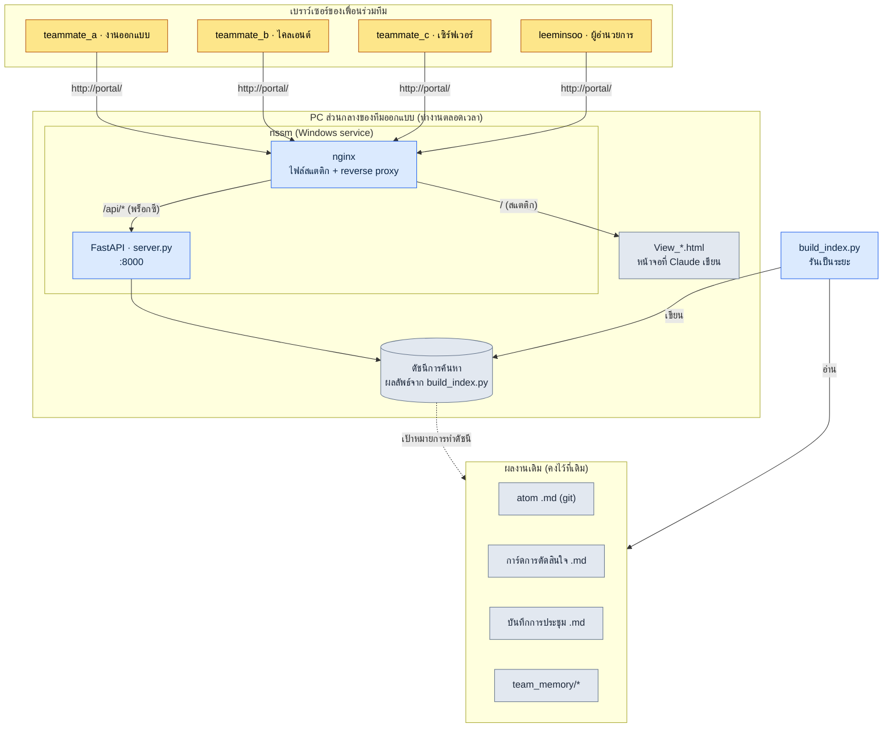

# 20.3 พอร์ทัลงานออกแบบ — ประตูที่ทีมเดินเข้ามาผ่านเบราว์เซอร์

บ่ายแก่ ๆ ของวันพฤหัสบดี ก่อนจะอัปโหลดบิลด์ไม่นาน เพื่อนร่วมทีม B ซึ่งเป็นโปรแกรมเมอร์ฝั่งไคลเอนต์โพสต์ข้อความลงในแชตภายในทีมว่า "ค่าคงที่ของ global cooldown ที่ตกลงกันในทีมเฉพาะกิจด้านการต่อสู้เมื่อสัปดาห์ก่อนคือ 0.8 วินาทีใช่ไหมครับ มันเขียนไว้ในเอกสารตรงไหน" ห้านาทีต่อมา เพื่อนร่วมทีม A ซึ่งเป็นนักออกแบบเกมตอบว่า "น่าจะอยู่ในบันทึกการประชุมที่ไหนสักแห่ง… กำลังหาอยู่" อีกเจ็ดนาทีต่อมา "อยู่ในโฟลเดอร์ไหนของ git นะ"

การโต้ตอบไปมา 12 นาทีนี้ไม่ได้เกิดเพราะไม่มีข้อมูล ข้อมูลมีอยู่แน่นอน มันถูกบันทึกไว้ทั้งในไฟล์ atom ในบันทึกการประชุม และในการ์ดการตัดสินใจ เพียงแต่ทั้งสามอย่างอยู่คนละลิ้นชัก และวิธีเปิดแต่ละลิ้นชักก็ต่างกัน ปัญหาไม่ได้อยู่ที่ลิ้นชัก แต่อยู่ที่มือจับที่ใช้เปิดลิ้นชัก

บทนี้คือเรื่องราวของการรวมมือจับเหล่านั้นให้เหลือเพียงอันเดียว ไม่ใช่การพัฒนาฟูลสแตกขึ้นมาเอง แต่เป็นการคลุมเว็บบาง ๆ หนึ่งชั้นทับบนผลงานออกแบบที่กองอยู่ในโฟลเดอร์อยู่แล้ว เพื่อให้เพื่อนร่วมทีมพิมพ์เพียงคำว่า `portal` ลงในช่องที่อยู่ของเบราว์เซอร์ก็เข้ามาได้ เครื่องมือหลักมีเพียงสามอย่างเท่านั้น ได้แก่ FastAPI ที่ใช้ Python รัน search API ขึ้นมา, nginx ที่ตั้งไว้ด้านหน้า และ nssm ที่คอยให้บริการทำงานอยู่ตลอดเวลาที่เครื่องเปิดอยู่โดยที่คนไม่ต้องคอยเปิดเอง

---

## 20.3.1 ผลงานที่กระจัดกระจาย ประตูทางเข้าที่เป็นหนึ่งเดียว

ผลงานออกแบบนั้นกระจัดกระจายโดยธรรมชาติ ไม่ใช่เพราะตั้งใจให้มันกระจาย แต่เพราะผลงานแต่ละชิ้นไปตกอยู่ในที่ที่เป็นธรรมชาติที่สุดสำหรับมัน atom ไปอยู่ในรูปมาร์กดาวน์ของ repository บน git, กำหนดการไปอยู่ในเครื่องมือจัดการงาน, บทสนทนาแบบเรียลไทม์ไปอยู่ในแชต และ KPI ไปอยู่ในแดชบอร์ดแยกต่างหาก การที่แต่ละอย่างอยู่ในที่ของมันนั้นถูกต้องแล้ว ปัญหาคือคนต้องเก็บแผนที่ของที่เหล่านั้นไว้ในหัวตัวเอง

สำหรับพนักงานใหม่ แผนที่นี้เองคือกำแพงกั้นการเข้าถึง การจะหา "ค่า global cooldown" ได้นั้นต้อง (1) ตัดสินใจว่ามันเป็นการ์ดการตัดสินใจ เป็น atom หรือเป็นบันทึกการประชุม (2) เปิดเครื่องมือที่เกี่ยวข้องนั้นขึ้นมา และ (3) ค้นซ้ำด้วยไวยากรณ์การค้นหาของเครื่องมือนั้น ทั้งสามขั้นตอนล้วนเป็นความรู้ฝังลึกที่มาจากประสบการณ์ทำงาน

แนวคิดของพอร์ทัลนั้นเรียบง่าย ผลงานยังคงวางไว้ในที่เดิม แต่วางดัชนีสำหรับการค้นหาทับไว้หนึ่งชั้น แล้วเปิดดัชนีนั้นให้เข้าถึงผ่านเบราว์เซอร์ แทนที่จะมีโต๊ะเจ็ดตัว ก็มีโต๊ะตัวเดียวที่มีลิ้นชักเจ็ดช่อง ลิ้นชักยังคงเหมือนเดิม แต่คนนั่งเพียงครั้งเดียว

ต่อไปนี้คือโครงสร้างของพอร์ทัลที่ผู้เขียนใช้งานจริงในโปรเจกต์ A มันทำงานอยู่ในสถานะเปิดตลอดเวลาบนเครื่อง PC ส่วนกลางของทีมออกแบบเพียงเครื่องเดียว โดยไม่ต้องมีอุปกรณ์เซิร์ฟเวอร์แยกต่างหาก



ในภาพ ส่วนล่างที่ถูกจัดกลุ่มด้วยสีเทาคือผลงานที่มีอยู่ก่อนแล้ว ส่วนที่พอร์ทัลเพิ่มเข้ามาใหม่คือสามชั้นบาง ๆ ด้านบน — ดัชนี, FastAPI และ nginx — เท่านั้น เป็นโครงสร้างที่เปิดประตูทางเข้าใหม่โดยไม่แตะต้องผลงานเลย

---

## 20.3.2 สี่ชิ้นส่วน: build_index.py · server.py · nginx · nssm

ตัวตนที่แท้จริงของพอร์ทัลจบลงด้วยไฟล์เล็ก ๆ ห้าไฟล์ เมื่อดูทีละชิ้น แต่ละชิ้นทำหน้าที่เพียงอย่างเดียวเท่านั้น

**build_index.py — แปลงผลงานให้อยู่ในรูปที่ค้นหาได้** สแกนทั่ว repository บน git อ่าน atom, การ์ดการตัดสินใจ, บันทึกการประชุม และมาร์กดาวน์ทั้งหมดใต้ `team_memory/` แล้วดึงหัวข้อ เนื้อหา และแท็กออกมารวมเป็นไฟล์ดัชนีไฟล์เดียว สิ่งที่สคริปต์นี้ทำมีเพียง "การทำให้ไฟล์ที่กระจัดกระจายแบนราบลงเป็นเรกคอร์ดบรรทัดเดียว" เท่านั้น เพราะไม่ได้แตะตัวไฟล์ต้นฉบับ ต่อให้ดัชนีเสีย ต้นฉบับก็ปลอดภัย หากรันใหม่เป็นระยะ ๆ (เช่น ทุก 30 นาที หรือผ่าน git commit hook) สถานะก็จะเป็นปัจจุบันอยู่เสมอ

**server.py — รัน search API ด้วย FastAPI** โหลดดัชนีขึ้นหน่วยความจำไว้ แล้วเมื่อมีคำขอ `/api/search?q=...` เข้ามา ก็คืนเรกคอร์ดที่ตรงกันกลับไปเป็น JSON โค้ดไม่เกินหนึ่งหน้าจอ

```python
# server.py (ตัดตอน — โครงของ search endpoint)
from fastapi import FastAPI
import json, pathlib

app = FastAPI()
INDEX = json.loads(pathlib.Path("index.json").read_text(encoding="utf-8"))

@app.get("/api/search")
def search(q: str):
    q = q.strip().lower()
    hits = [r for r in INDEX
            if q in r["title"].lower() or q in r["body"].lower()]
    # จัดกลุ่มตามชนิดแล้วคืนค่า → atom / การตัดสินใจ / บันทึกการประชุม / หน่วยความจำ
    by_kind = {}
    for r in hits:
        by_kind.setdefault(r["kind"], []).append(
            {"id": r["id"], "title": r["title"], "path": r["path"]})
    return {"query": q, "count": len(hits), "results": by_kind}
```

อัลกอริทึมการค้นหาตั้งใจเริ่มต้นด้วยการจับคู่สตริงย่อย (substring matching) แบบเรียบง่าย เมื่อทีมมีขนาดกลาง (10\~50 คน) และเอกสารมีหลักพันชิ้น ความเรียบง่ายนี้กลับช่วยลดต้นทุนการบำรุงรักษา การวิเคราะห์รูปคำ (morphological analysis) หรือการค้นหาแบบเวกเตอร์นั้น ค่อยเพิ่มเข้ามาทีหลังตอนที่มีเสียงบ่นว่า "การค้นหาอ่อน" เกิดขึ้นจริงก็ยังไม่สาย

**nginx — เสิร์ฟหน้าจอสแตติกและพร็อกซีไปยัง API** เสิร์ฟไฟล์ `View_*.html` (หน้าจอค้นหา, หน้าจอผลลัพธ์, หน้าจอแดชบอร์ด) ที่ขอให้ Claude สร้างให้แบบสแตติก แล้วส่งต่อเฉพาะคำขอที่เข้ามาทาง `/api/` ไปยัง FastAPI (:8000) ด้านหลัง ในมุมของเพื่อนร่วมทีม ทั้งหน้าจอและการค้นหาเกิดขึ้นที่ที่อยู่ `http://portal/` เดียวกันทั้งหมด เพราะ Claude เป็นคนวาดหน้าจอขึ้นมาเป็น HTML โดยตรง เวลานักออกแบบต้องการหน้าจอใหม่ ก็แค่ขอว่า "ช่วยทำหน้าจอที่รวมเฉพาะการ์ดการตัดสินใจไว้ดูให้หน่อย" แล้วรับ `View_decisions.html` มาวางลงในโฟลเดอร์ก็จบ การไม่มี frontend build pipeline เป็นข้อได้เปรียบที่ชัดเจนสำหรับทีมขนาดกลาง

**nssm — ทำให้พอร์ทัลยังมีชีวิตอยู่แม้คนไม่เปิด** ข้อกำหนดหลักของพอร์ทัลคือ "ต่อให้ผมไม่อยู่ที่โต๊ะ เพื่อนร่วมทีมก็ต้องค้นหาได้" ถ้ารัน server.py จากเทอร์มินัล มันจะตายทันทีที่ปิดเทอร์มินัลนั้น และจะหายไปเมื่อรีบูตเครื่อง nssm (Non-Sucking Service Manager) ลงทะเบียนกระบวนการ Python นี้เป็น Windows service เพื่อให้มันฟื้นขึ้นมาเองอัตโนมัติเมื่อบูตเครื่อง และฟื้นคืนชีพเองอัตโนมัติเมื่อกระบวนการตาย การลงทะเบียนทำเพียงครั้งเดียวก็พอ

```powershell
# ลงทะเบียน FastAPI เป็น Windows service ด้วย nssm (ครั้งเดียว)
nssm install Portal "C:\Python\python.exe" "C:\portal\portal_run.py"
nssm set Portal AppDirectory "C:\portal"
nssm start Portal
```

ในที่นี้ `portal_run.py` คือ launcher ความยาวห้าบรรทัด มีเพียงบรรทัดเดียวที่รัน server.py ด้วย uvicorn และโครงขั้นต่ำที่คอยกันไม่ให้บริการตายเท่านั้น คำสั่งที่คนต้องจำมีเพียง `nssm start` คำสั่งเดียว และต่อให้เป็นคำสั่งนั้น เมื่อลงทะเบียนครั้งเดียวแล้วก็ไม่ต้องพิมพ์อีก

การแบ่งหน้าที่ของสี่ชิ้นส่วนนี้เมื่อมองในภาพรวมเป็นดังนี้

<svg xmlns="http://www.w3.org/2000/svg" viewBox="0 0 720 250" font-family="sans-serif" font-size="13">
  <rect x="0" y="0" width="720" height="250" fill="#fbfbfd"/>
  <!-- columns -->
  <g>
    <rect x="20" y="40" width="150" height="170" rx="8" fill="#eef4ff" stroke="#5b8def"/>
    <text x="95" y="65" text-anchor="middle" font-weight="bold" fill="#244">build_index.py</text>
    <text x="95" y="92" text-anchor="middle" fill="#345">ผลงาน → ดัชนี</text>
    <text x="95" y="112" text-anchor="middle" fill="#345">แบนราบ·ใส่แท็ก</text>
    <text x="95" y="148" text-anchor="middle" fill="#789" font-size="11">ไม่แก้ต้นฉบับ</text>
    <text x="95" y="168" text-anchor="middle" fill="#789" font-size="11">รันซ้ำเป็นระยะ</text>
  </g>
  <g>
    <rect x="200" y="40" width="150" height="170" rx="8" fill="#eafaf0" stroke="#3aa76d"/>
    <text x="275" y="65" text-anchor="middle" font-weight="bold" fill="#244">server.py</text>
    <text x="275" y="92" text-anchor="middle" fill="#345">FastAPI :8000</text>
    <text x="275" y="112" text-anchor="middle" fill="#345">/api/search</text>
    <text x="275" y="148" text-anchor="middle" fill="#789" font-size="11">จัดกลุ่มตามชนิด</text>
    <text x="275" y="168" text-anchor="middle" fill="#789" font-size="11">คืนค่า JSON</text>
  </g>
  <g>
    <rect x="380" y="40" width="150" height="170" rx="8" fill="#fff5e9" stroke="#e08a3c"/>
    <text x="455" y="65" text-anchor="middle" font-weight="bold" fill="#244">nginx</text>
    <text x="455" y="92" text-anchor="middle" fill="#345">เสิร์ฟ View_*.html</text>
    <text x="455" y="112" text-anchor="middle" fill="#345">พร็อกซี /api/</text>
    <text x="455" y="148" text-anchor="middle" fill="#789" font-size="11">ที่อยู่เดียว</text>
    <text x="455" y="168" text-anchor="middle" fill="#789" font-size="11">ไม่มี build pipe</text>
  </g>
  <g>
    <rect x="560" y="40" width="150" height="170" rx="8" fill="#f6eefe" stroke="#8a5be0"/>
    <text x="635" y="65" text-anchor="middle" font-weight="bold" fill="#244">nssm</text>
    <text x="635" y="92" text-anchor="middle" fill="#345">Windows service</text>
    <text x="635" y="112" text-anchor="middle" fill="#345">บูตแล้วรันเอง</text>
    <text x="635" y="148" text-anchor="middle" fill="#789" font-size="11">ตายแล้วฟื้น</text>
    <text x="635" y="168" text-anchor="middle" fill="#789" font-size="11">รับประกันทำงานตลอด</text>
  </g>
  <text x="360" y="232" text-anchor="middle" fill="#456" font-size="12">การไหลของข้อมูล: ผลงาน → ดัชนี → API → หน้าจอ → เบราว์เซอร์ (จากซ้ายไปขวา)</text>
</svg>

---

## 20.3.3 หนึ่งฉากที่ทีมค้นหาจริง

ลำพังการอธิบายชิ้นส่วนอย่างเดียวคงทำให้สัมผัสคุณค่าของพอร์ทัลได้ยาก ลองโยนคำถามที่เคยกินเวลา 12 นาทีก่อนหน้านี้กลับเข้าไปใหม่บนพอร์ทัลกัน ต่อไปนี้คือการคัดลอกพรอมต์ที่ผู้เขียนโยนให้ Claude ตอนสร้างหน้าจอค้นหา ผลลัพธ์ที่ได้รับ และกระบวนการตรวจสอบ ทั้งหมดมาแบบไม่บีบอัด

พรอมต์ของผู้เขียน:

> ช่วยทำหน้า HTML หน้าเดียวที่ fetch `index.json` มาแล้วค้นหาให้หน่อย เมื่อพิมพ์คีย์เวิร์ดลงในช่องอินพุต ให้เรียก `/api/search?q=` แล้วแสดงผลลัพธ์โดยแบ่งเป็นสี่กลุ่มคือ atom / การ์ดการตัดสินใจ / บันทึกการประชุม / หน่วยความจำ ในรูปแบบการ์ด เมื่อคลิกที่ผลลัพธ์แต่ละอันให้พาไปยังพาธต้นฉบับ (`path`) อย่าใช้เฟรมเวิร์ก CSS·JS ภายนอก ให้รวมเป็นไฟล์เดียว ชื่อไฟล์ `View_search.html`

ผลลัพธ์ดิบของ Claude (ตัดตอน, แบบที่ได้รับมาจริง):

```html
<!-- View_search.html -->
<input id="q" placeholder="atom หรือคีย์เวิร์ด">
<div id="out"></div>
<script>
document.getElementById('q').addEventListener('keydown', async e => {
  if (e.key !== 'Enter') return;
  const r = await fetch('/api/search?q=' + encodeURIComponent(e.target.value));
  const d = await r.json();
  const order = ['atom','decision','meeting','memory'];
  const label = {atom:'atom', decision:'การ์ดการตัดสินใจ',
                 meeting:'บันทึกการประชุม', memory:'หน่วยความจำ'};
  out.innerHTML = order.filter(k => d.results[k]).map(k =>
    `<h3>${label[k]} (${d.results[k].length})</h3>` +
    d.results[k].map(x =>
      `<a href="${x.path}">${x.title}</a>`).join('<br>')
  ).join('') || 'ไม่พบผลลัพธ์';
});
</script>
```

ผลลัพธ์นี้ยังไม่ใช่ของสำเร็จรูป ผู้เขียนไม่ได้รับมาตามนั้น แต่ปฏิเสธสองจุด

จุดแรก ส่วนที่ใช้ `out` เหมือนตัวแปร global โดยไม่ผ่าน `getElementById` เป็นโค้ดเสี่ยงที่อาศัยความเคยชินของเบราว์เซอร์ — มันไม่ทำงานในบางสภาพแวดล้อม จุดที่สอง เพราะ `path` เป็นพาธภายในของ git การใส่ลงใน `href` ตรง ๆ จะทำให้เบราว์เซอร์เปิดไฟล์ไม่ได้ ต้องแก้ให้พอร์ทัลกำหนดเส้นทาง (route) พาธนั้นกลับเข้าหน้าจอของตัวเองด้วยการผ่าน `/view?path=`

คำขอใหม่ของผู้เขียน:

> ช่วยแก้สองอย่าง (1) ให้รับ `out` อย่างชัดเจนด้วย `document.getElementById` (2) ลิงก์ผลลัพธ์อย่าพาไปที่พาธต้นฉบับตรง ๆ แต่ให้ผ่าน viewer endpoint `/view?path=` ส่วน viewer ผมจะเพิ่มที่ server.py เอง ฝั่งฟรอนต์แค่เปลี่ยนลิงก์ก็พอ

การโต้ตอบไปมานี้คือหัวใจสำคัญ ผลลัพธ์แรกของ Claude ถูกอยู่ 80% แต่อีก 20% ที่เหลือเป็นข้อบกพร่องที่จับได้ก็ต่อเมื่อคนต้องรู้บริบทว่า "พอร์ทัลนี้คลุมอยู่ทับผลงานบน git" การตรวจสอบยังคงเป็นหน้าที่ของคน

พอรันค้นหาหนึ่งครั้ง หน้าจอของเพื่อนร่วมทีมจะแสดงผลลัพธ์ที่ถูกจัดกลุ่มไว้แบบนี้

| กลุ่ม | ผลการค้นหาด้วยคำว่า "global cooldown" |
|---|---|
| atom | `combat_global_cooldown_constant` |
| การ์ดการตัดสินใจ | `D2026_Q2_017` (ยืนยันที่ 0.8 วินาที) |
| บันทึกการประชุม | `95_BattleTF` ครั้งที่ 2 |
| หน่วยความจำ | บันทึก 1:1 ของเพื่อนร่วมทีม B จำนวน 1 รายการ |

การโต้ตอบไปมา 12 นาทีในบ่ายวันพฤหัสบดี ลดลงเหลือ 20 วินาทีของการพิมพ์คำเดียวลงในช่องค้นหา และที่สำคัญกว่านั้นคือ 20 วินาทีนี้กลายเป็นงานที่เพื่อนร่วมทีม B จัดการคนเดียวได้จบ ทำให้ไม่ต้องไปใช้เวลา 12 นาทีของเพื่อนร่วมทีม A เลย

---

## 20.3.4 ต้นทุนกับผลลัพธ์ — สร้างถึงระดับไหนจึงคุ้มค่า

วิธีสร้างพอร์ทัลแบ่งใหญ่ ๆ ได้สามทาง คือพัฒนาฟูลสแตกขึ้นมาเองตั้งแต่ต้น, นำเครื่องมือรวมศูนย์จากภายนอกอย่าง Notion·Coda เข้ามาใช้ หรือคลุมระบบอัตโนมัติบาง ๆ ทับเครื่องมือพื้นฐานอย่างที่ทำอยู่นี้ ผู้เขียนเลือกทางที่สาม และเหตุผลของการเลือกนั้นอยู่ที่ขนาดของทีมที่เป็นทีมขนาดกลาง

การพัฒนาฟูลสแตกเองมีอิสระสูงที่สุด แต่ภาระในการต้องคอยบำรุงรักษาเว็บนั้นต่อไปหลังสร้างเสร็จมาถึงก่อนผลลัพธ์ งานปฏิบัติการอย่างการยืนยันตัวตน การดีพลอย และการ migrate ฐานข้อมูล จะตกมาอยู่ที่ทีมออกแบบ เครื่องมือรวมศูนย์จากภายนอกนั้นรวดเร็ว แต่มีค่าสมาชิกรายเดือนตามมา และเหนือสิ่งอื่นใดยังมีต้นทุนการย้ายข้อมูลที่ต้องโอนผลงานมาร์กดาวน์ที่กองอยู่ใน git ไปเป็นรูปแบบของเครื่องมือนั้นใหม่ ในทางกลับกัน การผสมผสาน FastAPI+nginx+nssm คงผลงานไว้ที่เดิมแล้วคลุมดัชนีทับเพียงชั้นเดียว จึงใช้เวลาไม่กี่วันก็เริ่มทำงานได้ และการบำรุงรักษาก็จบลงเพียงระดับการแก้ build_index.py เป็นครั้งคราว

ต่อไปนี้คือความเปลี่ยนแปลงที่ผู้เขียนสัมผัสได้ก่อนและหลังนำพอร์ทัลมาใช้ในโปรเจกต์ A ตัวเลขในตารางไม่ใช่การวัดอย่างแม่นยำ แต่เป็นการประมาณของผู้เขียน (ยังไม่ได้ตรวจสอบ) ควรอ่านที่ทิศทางและสัดส่วนมากกว่าค่าสัมบูรณ์

| รายการ | ไม่มีพอร์ทัล | มีพอร์ทัลใช้งาน | ทิศทาง |
|---|---|---|---|
| เวลาที่ใช้ค้นข้อมูล 1 ครั้ง | หลายนาที | น้อยกว่า 1 นาที | สั้นลงมาก |
| ความถี่ของคำถาม "อันนี้อยู่ตรงไหน" | บ่อย | นาน ๆ ครั้ง | ลดลง |
| สมาชิกใหม่ปรับตัวกับเครื่องมือ | ราวสองสัปดาห์ | ไม่กี่วัน | สั้นลง |
| อัตราการลงบันทึกการประชุม·การ์ดการตัดสินใจ | ราวครึ่งหนึ่ง | ส่วนใหญ่ | สูงขึ้น |

บรรทัดสุดท้ายคือสิ่งที่เป็นแก่นที่สุด เมื่อหาข้อมูลได้ง่ายขึ้น ไม่ใช่แค่การค้นหาเร็วขึ้นเท่านั้น แต่แรงจูงใจในการทิ้งบันทึกข้อมูลไว้ก็สูงขึ้นด้วย ความเย้ยหยันที่ว่า "จะเขียนบันทึกการประชุมที่ยังไงก็หาไม่เจอไปทำไม" เปลี่ยนเป็น "เขียนเพราะเขียนแล้วค้นหาเจอ" พอร์ทัลเป็นเครื่องมือค้นหาและขณะเดียวกันก็เป็นกลไกจูงใจให้บันทึก วงจรดี ๆ นี้สร้างคุณค่าที่มากกว่าการรวมเครื่องมือหนึ่งหรือสองอย่างเข้าด้วยกัน

แต่สมดุลนี้ขึ้นอยู่กับขนาดของทีม เมื่อทีมเกิน 50 คนและผลงานพอกขึ้นเป็นหลักหมื่นชิ้น ข้อจำกัดของการค้นหาแบบสตริงย่อยและข้อจำกัดของการเสิร์ฟด้วย PC เครื่องเดียวจะปรากฏขึ้นพร้อมกัน ณ จุดนั้น การพัฒนาฟูลสแตกเองหรือการนำ search engine เข้ามาใช้ก็มีเหตุผลรองรับ โครงสร้างนี้ในตอนนี้คือ "คำตอบที่เหมาะกับทีมขนาดกลาง" ไม่ใช่คำตอบที่ถูกต้องสำหรับทุกขนาด

---

## 20.3.5 ลองทำดู

**setup** เลือกเครื่อง PC ส่วนกลางของทีมออกแบบ (หรือเครื่องที่เปิดทิ้งไว้ตลอด) มาหนึ่งเครื่อง ติดตั้ง Python, nginx และ nssm ตรวจสอบตำแหน่งของโฟลเดอร์ผลงานที่จะทำดัชนี (atom·การ์ดการตัดสินใจ·บันทึกการประชุม·team_memory)

**prompt** ขอจาก Claude สามอย่างตามลำดับ

> (1) "ช่วยทำ build_index.py ที่อ่านมาร์กดาวน์ในโฟลเดอร์นี้ ดึงหัวข้อ·เนื้อหา·แท็ก·ชนิด ออกมาแล้วทิ้งเป็น `index.json` ให้หน่อย ส่วนชนิดให้แยกแยะด้วยกฎของพาธ"
> (2) "ช่วยทำ FastAPI server.py ที่โหลด index.json นั้นขึ้นหน่วยความจำแล้วค้นหาผ่าน `/api/search?q=` ให้หน่อย ผลลัพธ์ให้จัดกลุ่มตามชนิดแล้วคืนค่า"
> (3) "ช่วยทำ HTML หน้าเดียว (View_search.html) ที่ fetch index.json มาค้นหา ให้รวมเป็นไฟล์เดียวโดยไม่ใช้เฟรมเวิร์กภายนอก"

**verify** ตรวจสอบสามอย่างด้วยตัวเอง (1) หลังรัน build_index.py แล้วดูว่าจำนวนผลงานเข้าไปใน index.json ครบถูกต้องไหม — ดูว่าไม่มีโฟลเดอร์ไหนตกหล่น (2) รัน server.py ขึ้นมาแล้วเรียก `/api/search?q=คีย์เวิร์ดทดสอบ` จากเบราว์เซอร์โดยตรง เพื่อดูว่า JSON ออกมาแบบจัดกลุ่มแล้วหรือไม่ (3) อ่านโค้ดหน้าจอที่ Claude สร้างให้ แล้วจับว่าพาธของลิงก์ไม่ได้เปิดเผยพาธภายในของ git ตรง ๆ และไม่มีโค้ดที่อาศัยตัวแปร global — ข้อบกพร่องสองอย่างที่เห็นในหัวข้อก่อนหน้าจะถูกกรองออกตรงนี้เอง สุดท้าย หลังลงทะเบียนบริการด้วย nssm แล้วให้รีบูตเครื่อง PC เพื่อยืนยันว่าพอร์ทัลยังมีชีวิตอยู่แม้คนไม่ได้เปิดอะไรเลย

## 20.3.6 ฉบับย่อสำหรับคนเดียว

ต่อให้ไม่มีทีม โครงสร้างนี้ก็ยังมีประโยชน์ตามเดิม เพราะคนที่ทำงานคนเดียวก็มีผลงานที่กระจัดกระจายเช่นกัน ใน setup ให้ใช้ PC ของตัวเองแทน PC ส่วนกลาง และจะข้ามการลงทะเบียน nssm ก็ได้ (รันด้วย `python portal_run.py` เฉพาะตอนที่ต้องใช้) prompt ให้รับทั้งสามอย่างคือ build_index.py, server.py และ View_search.html เหมือนเดิม แต่ตัดส่วน team_memory ออก แล้วทำดัชนีเฉพาะ atom·การตัดสินใจ·บันทึกการประชุม verify เพียงตรวจจำนวนใน index.json กับค้นหาหนึ่งครั้งก็เพียงพอ แก่นยังคงเหมือนเดิม — คงผลงานไว้ที่เดิม แล้วเปิดเพียงประตูทางเข้าการค้นหาขึ้นใหม่หนึ่งบาน

---

### สรุปประเด็นสำคัญของบท

- คงผลงานไว้ที่เดิมแล้วคลุมดัชนีทับเพียงชั้นเดียว เพื่อรวมประตูทางเข้าการค้นหาให้เป็นหนึ่งเดียว
- เพียงสามชิ้นส่วนคือ FastAPI·nginx·nssm พอร์ทัลของทีมขนาดกลางก็เริ่มทำงานได้ในไม่กี่วัน
- เมื่อการค้นหาง่ายขึ้น แรงจูงใจในการทิ้งบันทึกไว้ก็สูงขึ้นตามไปด้วย

### ตัวอย่างบทถัดไป

- 20.4 การจัดการโปรเจกต์ด้วย MCP — เชื่อมเครื่องมือที่บริษัทใช้อยู่แล้วเข้ากับ LLM·พอร์ทัล
