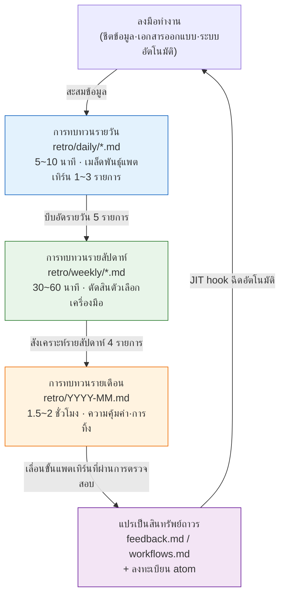

# ส่วนที่ 21 · บทที่ 1 การทบทวนคือจุดเริ่มต้นของทุกสิ่ง

เย็นวันศุกร์ 6 โมง 40 นาที ขณะที่กำลังจะปิดโน้ตบุ๊กเพื่อเลิกงาน งานที่ทำในวันนั้นกลับให้ความรู้สึกคุ้นเคยอยู่ลึก ๆ ผมเพิ่งไล่หาและแก้การอ้างอิง enum ที่เสียในชีตข้อมูล ทั้งที่สัปดาห์ที่แล้วก็แก้สิ่งเดียวกันนี้ชัด ๆ สัปดาห์ก่อนหน้านั้นก็ด้วย ทุกครั้งผมพิมพ์พรอมต์เดิมซ้ำใหม่ และทุกครั้งก็ตรวจสอบรายการเดิมในผลลัพธ์ของ Claude ผมรู้ตัวว่านี่เป็นครั้งที่สามตอนที่กำลังจะปิดโน้ตบุ๊กพอดี

ความรู้สึกที่ว่า "คุ้นเคยอยู่ลึก ๆ" นี้คือช่วงเวลาที่สำคัญที่สุดในหนังสือทั้งเล่ม หากปล่อยความรู้สึกนี้ผ่านเลยไป สัปดาห์หน้าก็จะทำงานเดิมซ้ำเป็นครั้งที่สี่ แต่หากคว้าความรู้สึกนี้ไว้แล้วจดเป็นบรรทัดเดียว บรรทัดนั้นจะกลายเป็น skill ในสัปดาห์ถัดไป และ skill นั้นจะกลายเป็น atom ที่ถูกฉีดเข้ามาโดยอัตโนมัติในอีกหนึ่งเดือนถัดมา ที่ที่เราคว้ามันไว้ก็คือการทบทวนนั่นเอง

ส่วนอื่น ๆ ในหนังสือเล่มนี้กล่าวถึง "มีเครื่องมือแบบนี้อยู่" และ "มีแพตเทิร์นแบบนี้อยู่" แต่บทนี้กล่าวถึงว่าเครื่องมือและแพตเทิร์นทั้งหมดนั้นถือกำเนิดมาจากที่ใด คำสั่งสแลช (slash command) ใหม่ถูกสร้างขึ้นที่ไหน atom ใหม่ถูกตรึงเป็นกฎอย่างไร และเครื่องมือที่ไม่ได้ใช้แม้แต่ครั้งเดียวในหนึ่งเดือนถูกใครคัดออก คำตอบล้วนรวมอยู่ที่จุดเดียวกันเสมอ นั่นคือการทบทวน

---

## 1.1 เปลี่ยนความคุ้นเคยให้เป็นบรรทัดเดียว — บันทึกเซสชันจริง (worked transcript)

การทบทวนไม่ใช่พิธีกรรมที่ยิ่งใหญ่อะไร ลองเปิดไฟล์การทบทวนรายวันไฟล์หนึ่งของผู้เขียนดูตามตรง พาธจริงคือ `retro/daily/YYYY-MM-DD.md` และเมื่อผ่านไปหนึ่งเดือน ไฟล์เหล่านี้จะถูกบีบอัดเป็นรายสัปดาห์ (`retro/weekly/YYYY-Www.md`) แล้วบีบอัดต่อเป็นรายเดือน (`retro/YYYY-MM.md`) อีกที กฎต่าง ๆ ระบุไว้ใน `retro/README.md`

กระบวนการที่ผู้เขียนใช้จริงไม่ใช่การนั่งเขียนไฟล์การทบทวนด้วยมือเอง แต่คือการโยน log งานของวันนั้นให้ AI แล้วให้มันดึงแพตเทิร์นออกมา ด้านล่างนี้คือการเรียบเรียงใหม่ (reconstruction) ของการโต้ตอบไปกลับจริงในเย็นวันศุกร์วันหนึ่ง ผมจะใส่พรอมต์ฉบับเต็มก่อน แล้วจึงใส่ผลลัพธ์ดิบ (raw output) ของ Claude มาทั้งหมดโดยไม่สรุปย่อ — รวมถึงส่วนที่มันตอบพลาดด้วย

**[พรอมต์ — มนุษย์เป็นผู้ป้อน]**

> ช่วยสรุปงานที่ทำวันนี้เป็นการทบทวนให้หน่อย สิ่งที่ทำวันนี้: ① แก้การอ้างอิง enum ที่เสียในชีตข้อมูลตัวละคร (คอลัมน์ grade ไม่ตรงกับชีต enum) ② ปรับโทนบทพูดของ NPC ให้เป็นอันหนึ่งอันเดียวกัน ③ รัน relation-map ใหม่อีกครั้ง
> ในจำนวนนี้ ถ้ามี **งานที่ทำซ้ำตั้งแต่ 2 ครั้งขึ้นไปในสัปดาห์นี้** ให้ทำเครื่องหมายไว้ และถ้ามี **ตัวเลือกที่น่าจะทำเป็นเครื่องมือได้** ให้แยกออกมาต่างหาก ถ้าไม่มีก็บอกว่าไม่มี อย่าฝืนสร้างขึ้นมา

**[ผลลัพธ์ดิบของ Claude — ไม่สรุปย่อ ไม่ดัดแปลง]**

> นี่คือการทบทวนงานของวันนี้ครับ
>
> **ตรวจพบแพตเทิร์นที่ทำซ้ำ**
> - ① การแก้การอ้างอิง enum ที่เสีย → รายการนี้ปรากฏเหมือนกันในการทบทวนของวันอังคารในสัปดาห์นี้ด้วย ขอทำเครื่องหมายว่า **ทำซ้ำตั้งแต่ 2 ครั้งขึ้นไป**
> - ② การปรับโทนบทพูดของ NPC ให้เป็นอันหนึ่งอันเดียวกัน → ปรากฏครั้งแรกในสัปดาห์นี้ ไม่ใช่การทำซ้ำ
> - ③ การรัน relation-map ใหม่ → คุณใช้ skill ชื่อ relation-map-gen อยู่แล้ว ดังนั้นงานนี้เป็นงานที่ทำเป็นเครื่องมือเสร็จเรียบร้อยแล้ว ไม่ใช่ตัวเลือกเพิ่มเติม
>
> **ตัวเลือกเครื่องมือ**
> - การตรวจสอบการอ้างอิง enum **น่าจะทำเป็น skill ได้** ในรูปแบบที่นำค่าคอลัมน์ของชีตข้อมูลมาเทียบกับชีต enum แล้วรายงานจุดที่ไม่ตรงกัน
> - แต่เนื่องจากผมไม่ทราบโครงสร้างที่แน่ชัดของชีตทั้งสอง จึงยากที่จะมั่นใจว่านี่เป็นแพตเทิร์นที่ทำซ้ำได้จริงหรือไม่ จำเป็นต้องตรวจสอบว่าการเสียที่แก้ในวันอังคารกับการเสียในวันนี้เป็น **การเสียชนิดเดียวกัน** หรือไม่ ถ้าเสียที่คอลัมน์เดียวกันด้วยเหตุผลเดียวกัน ก็เป็นตัวเลือก skill ที่หนักแน่นมาก แต่ถ้าทุกครั้งเสียที่คอลัมน์ต่างกันด้วยเหตุผลต่างกัน ก็ยากที่จะรวบเป็น skill เดียว

ย่อหน้าสุดท้ายตรงนี้คือหัวใจสำคัญ AI ไม่ได้ฟันธงว่า "มาสร้าง skill กันเถอะ" แต่ **ย้อนถามให้มนุษย์ตรวจสอบว่าเป็นการเสียชนิดเดียวกันหรือไม่** นี่คือเหตุผลที่ทำไมการทบทวนจึงไม่ใช่สิ่งที่ทำได้อัตโนมัติ

**[การตรวจสอบโดยมนุษย์ — รับข้อเสนอจาก AI แต่กรองด้วย]**

ผู้เขียนเปิดการทบทวนของวันอังคารขึ้นมาเทียบ การเสียในวันอังคารคือคอลัมน์ `grade` การเสียในวันนี้ก็คอลัมน์ `grade` เช่นกัน เป็น **ชนิดเดียวกัน** ข้อเสนอตัวเลือกของ AI ผ่านการตรวจสอบ ผมจึงจดบรรทัดหนึ่งไว้ในการทบทวนรายวัน

> งานที่ทำซ้ำ: การตรวจสอบการอ้างอิง enum-grade (อังคาร·ศุกร์ 2 ครั้ง) → **ตัวเลือก skill** ตัดสินการเลื่อนขั้นในการทบทวนรายสัปดาห์ครั้งหน้า

บรรทัดเดียวนี้คือทั้งหมด ใช้เวลาไม่ถึง 5 นาที และบรรทัดเดียวนี้คือก้าวแรกของลูป self-improving หาก AI เสนอตัวเลือก ③ ที่มันชี้ว่า "ทำเป็นเครื่องมือเสร็จแล้ว" ขึ้นมาด้วย อีกหนึ่งเดือนถัดมาก็จะมีเครื่องมือซ้ำซ้อนที่ไม่ได้ใช้ลอยเพิ่มขึ้นมาอีกหนึ่งตัว ผลจากการที่ทั้งการกรองของ AI และการกรองของมนุษย์ทำงานทั้งคู่ จึงเหลือเพียงตัวเลือกที่แท้จริงเพียงหนึ่งเดียว

---

## 1.2 เหตุผลที่การทบทวนคือจุดเริ่มต้น

งานใดที่ทำซ้ำ เครื่องมือใดที่ถูกใช้บ่อย atom ใดที่ยังขาด — สิ่งเหล่านี้มองไม่เห็นจากการทำงานเพียงครั้งเดียว ในบันทึกเซสชันข้างต้น การเสีย enum ผุดขึ้นมาเป็นตัวเลือกได้ก็เพราะนำ "วันอังคารกับวันนี้" มาซ้อนทับกันดู ไม่ใช่เพราะ "วันนี้" เพียงวันเดียว ต้องนำร่องรอยที่สะสมมา 1 สัปดาห์·1 เดือน·1 ไตรมาส มาซ้อนทับกัน แพตเทิร์นจึงจะผุดขึ้น การทบทวนคือเวลาที่สร้างการซ้อนทับนั้นขึ้นมาอย่างจงใจ

แพตเทิร์นที่ค้นพบในการทบทวนแยกออกเป็นสองทาง

- แพตเทิร์นที่ทำซ้ำ + ผลลัพธ์ที่มีคุณค่า → ตรึงเป็นกฎด้วยเครื่องมือ (skill·atom·hook)
- แพตเทิร์นที่ทำซ้ำแต่ไม่มีคุณค่า → ทิ้งหรือทำให้ง่ายขึ้น

การตัดสินใจแยกทางนี้ทำไม่ได้ระหว่างกลางงาน เพราะมันจะตัดกระแสการทำงานให้ขาด ในขณะที่กำลังแก้การเสีย enum อยู่นั้น ไม่มีเวลาพอที่จะมานั่งคิดว่า "นี่ครั้งที่สามแล้วหรือเปล่า" เวลาทบทวนที่แยกออกมาต่างหากคือที่สำหรับการตัดสินใจนั้น

หลังจากสร้างเครื่องมือขึ้นมาแล้ว มันให้คุณค่าจริงหรือไม่ ก็วัดที่จุดเดียวกันนี้ เครื่องมือที่ใช้เดือนละครั้งกับเครื่องมือที่ช่วยลดเวลาลงได้หนึ่งชั่วโมงมีคุณค่าต่างกัน ทั้งการวัดและการตัดสินใจทิ้งล้วนทำในการทบทวน หากไม่มีการทบทวน เครื่องมือก็จะมีแต่สะสมเพิ่มขึ้นโดยไม่ถูกจัดระเบียบ เมื่อผ่านไปหลายปี เครื่องมือที่ไม่ได้ใช้หลายสิบตัวจะกลายเป็นอุปสรรคต่อการค้นหาและการใช้งาน

หากเปรียบกับลิ้นชัก การทบทวนก็คือเวลาที่เราเทลิ้นชักโต๊ะทำงานออกให้ว่างเป็นระยะ ๆ หากปากกาที่ใช้ทุกวันกับกระดาษโน้ตที่ไม่เคยหยิบออกมาเลยตลอดทั้งปีปะปนกันอยู่ในช่องเดียวกัน ทุกครั้งที่หาปากกาก็จะเสียเวลาเพิ่มขึ้นอีกไม่กี่วินาที เครื่องมือก็เป็นเช่นเดียวกัน

---

## 1.3 กระแสการบีบอัดของการทบทวนรายวัน·รายสัปดาห์·รายเดือน

การทบทวนของผู้เขียนหมุนอยู่บนสามชั้น รายวันรวบรวมเมล็ดพันธุ์ของแพตเทิร์น รายสัปดาห์มัดเมล็ดพันธุ์เข้าด้วยกันแล้วบีบอัดเป็นตัวเลือกเครื่องมือ และรายเดือนประเมินความคุ้มค่าทางเศรษฐกิจของเครื่องมือเพื่อตรึงเป็นสินทรัพย์หรือทิ้งไป แต่ละชั้นรับผลลัพธ์ของชั้นล่างมาเป็นอินพุต

ลูกศรสุดท้ายคือสิ่งที่ปิดลูป แพตเทิร์นที่ถูกแปรเป็นสินทรัพย์ถาวรจะถูกฉีดเข้าสู่งานครั้งถัดไปโดยอัตโนมัติผ่าน JIT (Just-In-Time) hook ในสภาพแวดล้อมของผู้เขียน มี hook ชื่อ `inject_memory.py` ที่จะเลือก atom ที่เกี่ยวข้องใส่เข้ามาทุกครั้งที่รับอินพุตจากผู้ใช้ เมื่อการตรวจสอบ enum-grade ถูกตรึงเป็น atom แล้ว ครั้งต่อไปเมื่อป้อนอินพุตประเภท "การตรวจสอบชีตข้อมูล" atom นั้นก็จะตามมาเอง มนุษย์ไม่จำเป็นต้องคอยจำว่า "อ้อ มีกฎตรวจสอบนั้นอยู่นี่นา" ในทุกครั้งอีกต่อไป

หากตัดการทบทวนออกไป จะเหลือแต่ลูกศรที่วิ่งจากบนลงล่าง และลูกศรสุดท้ายที่ส่งสินทรัพย์กลับคืนสู่งานจะขาดไป ลูปจะไม่ปิด ความหมายของคำว่า self-improving ก็คือการที่ลูปนี้กำลังหมุนอยู่นั่นเอง เครื่องมือปรับปรุงตัวเครื่องมือเอง และ atom เพิ่ม atom ขึ้นเอง พลังขับเคลื่อนของมันคือเวลาทบทวนหนึ่งชั่วโมงที่มนุษย์แยกออกมาต่างหาก

---

## 1.4 ห้าสิ่งที่ถือกำเนิดจากการทบทวน

จากความรู้สึกของผู้เขียนที่หมุนการทบทวนในโปรเจกต์ MMORPG โปรเจกต์หนึ่งมาราวครึ่งปี ในการทบทวนหนึ่งครั้งจะมีผลผลิตห้าประเภทต่อไปนี้ถือกำเนิดขึ้น ความถี่ด้านล่างนี้ไม่ใช่สถิติที่แม่นยำ แต่เป็นความรู้สึกจากการใช้งานจริงของผู้เขียน (การประมาณของผู้เขียน · ยังไม่ได้ตรวจสอบ) และการทบทวนแต่ละครั้งก็ไม่ได้สร้างทั้งห้าประเภทเสมอไป แต่หากมองในระดับไตรมาส ทั้งห้าก็จะปรากฏออกมาอย่างละหนึ่งครั้ง

เมื่อขยายความทั้งห้าประเภทออกมาก็เป็นดังนี้ หากในสัปดาห์นี้ตัดสินใจแบบเดียวกันซ้ำตั้งแต่ 2 ครั้งขึ้นไป นั่นคือ **ตัวเลือก atom ใหม่** หากป้อนแพตเทิร์นพรอมต์แบบเดียวกันซ้ำหลายครั้งในหนึ่งสัปดาห์ นั่นคือ **ตัวเลือก skill ใหม่** (การตรวจสอบ enum-grade ในหัวข้อก่อนหน้าก็เป็นกรณีนี้) หากในบรรดา skill ที่ใช้ในสัปดาห์นี้มีตัวที่ให้ผลลัพธ์ไม่น่าพอใจ นั่นคือ **การปรับปรุง skill เดิม** — ปรับพรอมต์·เพิ่มการตรวจสอบ·ทำให้อินพุตเป็นมาตรฐาน ในบรรดา atom ที่สร้างขึ้นเมื่อไตรมาสที่แล้ว ตัวที่ไม่เคยจับคู่ (match) เลยตลอดหนึ่งเดือนคือ **ตัวเลือกที่จะทิ้ง** หากไม่ใช้ก็มีแต่จะกินโทเค็นเปล่า ๆ และสุดท้าย **การประเมินความคุ้มค่าทางเศรษฐกิจ** คือการเทียบความถี่การใช้งานกับแรงมือที่ประหยัดได้ของเครื่องมือแต่ละตัว เพื่อตัดสินว่าจะคงไว้·ปรับปรุง·หรือทิ้ง

ทั้งห้านี้ถูกจัดวางบนหน้าจอเดียวอย่างไร เมื่อดูเป็นเมทริกซ์ก็เป็นดังนี้ แกนนอนคือ "ทำซ้ำหรือไม่" แกนตั้งคือ "มีคุณค่าหรือไม่"

<svg viewBox="0 0 520 320" xmlns="http://www.w3.org/2000/svg" font-family="sans-serif" font-size="13">
  <rect x="0" y="0" width="520" height="320" fill="#ffffff"/>
  <!-- axes -->
  <line x1="90" y1="40" x2="90" y2="280" stroke="#333" stroke-width="1.5"/>
  <line x1="90" y1="280" x2="500" y2="280" stroke="#333" stroke-width="1.5"/>
  <text x="295" y="305" text-anchor="middle" fill="#333">ความถี่การทำซ้ำ  →  สูง</text>
  <text x="30" y="160" text-anchor="middle" fill="#333" transform="rotate(-90 30 160)">คุณค่าของผลลัพธ์  →  สูง</text>
  <!-- quadrants -->
  <rect x="92" y="42" width="200" height="118" fill="#fdecea"/>
  <rect x="294" y="42" width="204" height="118" fill="#e8f5e9"/>
  <rect x="92" y="162" width="200" height="116" fill="#f5f5f5"/>
  <rect x="294" y="162" width="204" height="116" fill="#fff8e1"/>
  <!-- labels -->
  <text x="192" y="95" text-anchor="middle" fill="#b71c1c" font-weight="bold">คุณค่าสูง·ทำซ้ำต่ำ</text>
  <text x="192" y="118" text-anchor="middle" fill="#444">→ ปล่อยไว้ตามเดิม (พักการทำเป็นเครื่องมือ)</text>
  <text x="396" y="80" text-anchor="middle" fill="#1b5e20" font-weight="bold">คุณค่าสูง·ทำซ้ำสูง</text>
  <text x="396" y="103" text-anchor="middle" fill="#444">→ ตัวเลือก skill ใหม่ / atom ใหม่</text>
  <text x="396" y="126" text-anchor="middle" fill="#444">(การตรวจสอบ enum-grade อยู่ตรงนี้)</text>
  <text x="192" y="215" text-anchor="middle" fill="#666" font-weight="bold">คุณค่าต่ำ·ทำซ้ำต่ำ</text>
  <text x="192" y="238" text-anchor="middle" fill="#444">→ มองข้าม</text>
  <text x="396" y="215" text-anchor="middle" fill="#e65100" font-weight="bold">คุณค่าต่ำ·ทำซ้ำสูง</text>
  <text x="396" y="238" text-anchor="middle" fill="#444">→ ตัวเลือกที่จะทิ้ง / ทำให้ง่ายขึ้น</text>
</svg>

สิ่งที่การทบทวนทำในที่สุดก็คือการโปรยงานต่าง ๆ ของสัปดาห์นั้นลงบนสี่ช่องนี้ สิ่งที่ตกลงมุมขวาบนจะกลายเป็นเครื่องมือ และสิ่งที่ตกมุมขวาล่างจะถูกคัดออก การจำแนกนี้คือวิธีการทำงานจริงของ self-improving

---

## 1.5 ที่ที่ถูกตรึงเป็น atom

ตัวเลือกการตรวจสอบ enum-grade จากหัวข้อก่อนหน้าถูกเลื่อนขั้นเป็น skill แล้วจากนั้นถูกตรึงเป็น atom อีกที ลองตามกระบวนการนี้ไปจนจบ atom คือรูปแบบที่แพตเทิร์นซึ่งถูกค้นพบอย่างหยาบ ๆ ในการทบทวนได้กลายเป็นสินทรัพย์ถาวรหลังผ่านการตรวจสอบแล้ว

ในเมโมรีของผู้เขียนมี atom ที่ถูกตรึงเป็นกฎเช่นนั้นอยู่แล้วหลายตัว หนึ่งในนั้นคือ `retro_atom_natural_invitation` ตามชื่อของมัน นี่คือ atom ที่บรรจุหลักการว่า "ในการทบทวน atom ปรากฏขึ้นในฐานะคำเชิญชวนที่เป็นธรรมชาติ ไม่ใช่คำสั่ง" ตัว atom นี้เองก็เป็นเมตาแพตเทิร์นที่ค้นพบจากการหมุนการทบทวนซ้ำหลายครั้ง — หลังจากที่ได้ประสบหลายครั้งว่า หากระหว่างการทบทวนเรากดดันบังคับตัวเองให้ตรึงเป็นกฎอย่างหมกมุ่นว่า "อันนี้ต้องเก็บไว้เป็น atom นะ" การทบทวนกลับจะกลายเป็นเพียงพิธีการ มันจึงตกผลึกเป็นบรรทัดเดียวนี้ในที่สุด

การตรึงเป็นกฎให้ผลจริงหรือไม่นั้นถูกจัดการด้วยคะแนนด้วยเช่นกัน ในสภาพแวดล้อมของผู้เขียนมีสคริปต์ชื่อ `atom_score.py` ที่ให้คะแนนว่าแต่ละ atom ถูกจับคู่และถูกใช้จริงมากน้อยเพียงใด ผลลัพธ์จะถูกบันทึกไว้ใน `_scores_latest.json` และ atom ที่มีคะแนนเกินระดับหนึ่งจะถูกฉีดเข้าสู่ `CLAUDE.md` โดยอัตโนมัติ กล่าวคือ atom ที่ถูกใช้บ่อยยิ่งจะยิ่งปรากฏต่อหน้าบ่อยขึ้น ส่วน atom ที่ไม่ถูกใช้จะถูกหักคะแนนและไหลไปสู่การเป็นตัวเลือกที่จะทิ้ง วงจรการให้คะแนน-การฉีดนี้คือส่วนที่ทำให้สี่ช่องในหัวข้อ §1.4 เป็นอัตโนมัติ

ตรงนี้มีสิ่งหนึ่งที่ต้องชี้ให้ตรงไปตรงมา คะแนนนี้ไม่ได้แปลงเป็นตัวชี้วัดเชิงปริมาณอย่าง "ประหยัดไปได้ 30 ชั่วโมงต่อเดือน" ในทันที เวลาที่ atom ประหยัดได้นั้นวัดได้ยาก ดังนั้นแทนที่จะฟันธง ROI (Return on Investment, ผลตอบแทนเทียบกับการลงทุน) ออกมาเป็นตัวเลข การพูดเพียงในแง่ของทิศทางและสัดส่วนว่า "atom ที่ถูกใช้บ่อยจะมีคะแนนสูง และ atom ที่คะแนนสูงจะถูกฉีดบ่อยขึ้นจึงช่วยลดแรงมือ" นั้นตรงไปตรงมากว่า — เป็นทิศทาง ไม่ใช่ตัวคูณ

---

## 1.6 สิ่งที่เกิดขึ้น ณ ที่ที่ไม่มีการทบทวน

ภาพที่พบเห็นได้บ่อยของทีมที่ไม่ได้แยกเวลาทบทวนไว้เป็นดังนี้

- ประชุมเรื่องเดิมซ้ำทุกไตรมาส ("เรื่องนี้เมื่อก่อนก็เคยได้ข้อสรุปไปแล้วนี่นา…")
- atom·skill อยู่แต่ในหัวของคนคนเดียว เมื่อคนคนนั้นจากไป มันก็หายไปด้วย
- เครื่องมือมีแต่สะสมเพิ่ม เครื่องมือที่ไม่ได้ใช้กลายเป็นอุปสรรคต่อการค้นหาและการใช้งาน
- แม้นักออกแบบเกมคนใหม่จะเข้ามา แต่เพราะเอกสารสำหรับเรียนรู้กระจัดกระจาย จึงต้องลองผิดลองถูกแบบเดิมตั้งแต่ต้นใหม่อีกครั้ง

ภาพเหล่านี้จะหายไปเกือบหมดด้วยการทบทวนเพียงหนึ่งชั่วโมง หากนึกถึงเย็นวันศุกร์ในหัวข้อ §1.1 มันเป็นเพียงความต่างระหว่างการจด "คุ้นเคยอยู่ลึก ๆ" เป็นบรรทัดเดียว กับการปล่อยมันผ่านเลยไปเท่านั้น การจดใช้เวลา 5 นาที แต่เวลาที่สูญไปเพราะไม่จดจะสะสมในการทำซ้ำครั้งที่สี่·ครั้งที่ห้า เป็นแบบฉบับของการไม่ลงเวลาเล็กน้อยแล้วต้องสูญเสียเวลาก้อนใหญ่กว่าไป

แน่นอนว่าไม่จำเป็นต้องตั้งระบบการทบทวนที่ยิ่งใหญ่ขึ้นมาตั้งแต่แรก ในทีมขนาดใหญ่ การเริ่มจากการทบทวนรายวัน 5 นาทีอาจรู้สึกอึดอัดน่ารำคาญ แต่หากวางระบบสามชั้นแบบรายวัน·รายสัปดาห์·รายเดือนลงไปทีเดียวตั้งแต่ต้น ก็ง่ายที่จะทำตามแค่รูปแบบจนพลาดเนื้อแท้ไป ลำดับที่ปลอดภัยคือให้คนที่ได้สัมผัสคุณค่าของการทบทวนด้วยตัวเองในขั้นที่เล็กที่สุดเป็นผู้ยกระดับขึ้นสู่ขั้นถัดไป

เครื่องมือ·atom·แพตเทิร์นทุกอย่างที่พบในหนังสือเล่มนี้ ในที่สุดแล้วล้วนถือกำเนิดจากการทบทวนของใครบางคน จะกล่าวว่าหนังสือเล่มนี้เองคือผลผลิตจากการทบทวนที่ผู้เขียนสั่งสมมาตลอดครึ่งปีก็ไม่เกินจริงเลย คำพูดที่ว่าการทบทวนคือจุดเริ่มต้นนั้นไม่ใช่การเปรียบเปรย แต่ชี้ไปยังข้อเท็จจริงที่ว่าสารบัญของหนังสือเล่มนี้เองก็มาจากการทบทวน

---

> **การประยุกต์นอกเกม** การทบทวนที่คว้าความรู้สึกว่า "คุ้นเคยอยู่ลึก ๆ — เรื่องนี้สัปดาห์ที่แล้วก็ทำไปนี่นา" ไว้เป็นบรรทัดเดียวนั้น ไม่ใช่แค่ในการพัฒนาเกม แต่เป็นทางเข้าสู่การพัฒนาตนเองในที่ทำงานทุกแห่งที่มีงานซ้ำ ๆ เมื่อปิดวัน ลองจดเพียงบรรทัดเดียวว่า "วันนี้มีงานอะไรที่ทำด้วยมือซ้ำสองรอบ" แล้วในวันศุกร์ลองนำห้าบรรทัดของสัปดาห์นั้นมาซ้อนทับกันดู แพตเทิร์นที่แต่ละวันซ่อนไว้ก็จะเผยออกมาในระดับสัปดาห์ ตัวอย่างเช่น หากเจ้าหน้าที่ธุรการคว้าได้จากการทบทวนว่า "พิมพ์อีเมลฟอร์มแบบเดิมซ้ำใหม่ทุกสัปดาห์" บรรทัดนั้นก็จะกลายเป็นเทมเพลตอีเมลในสัปดาห์ถัดไป และกลายเป็นกฎการส่งอัตโนมัติในอีกหนึ่งเดือน หัวใจไม่ได้อยู่ที่ความประณีตของเครื่องมือ แต่อยู่ที่ตัวการกระทำที่นำร่องรอยมาซ้อนทับกันดูเอง และอยู่ที่การให้ AI ดึงตัวเลือกออกมาแต่กรองด้วยตะแกรงว่า "อย่าฝืนสร้าง และตัดสิ่งที่ทำเป็นอัตโนมัติไปแล้วออก"

## 1.7 ลองทำดู

นี่คือเวอร์ชันที่เล็กที่สุดสำหรับการนำลูปการทบทวนมาใช้เป็นครั้งแรก สามารถเริ่มได้โดยแทบไม่ต้องติดตั้งเครื่องมือใด ๆ

**setup**

1. สร้างโฟลเดอร์ `retro/daily/` ขึ้นมาหนึ่งโฟลเดอร์ในโฟลเดอร์งาน
2. เปิดไฟล์เปล่า `retro/daily/2026-06-06.md` ด้วยวันที่ของวันนี้ ไม่ต้องเตรียมอะไรมากไปกว่านั้น

**prompt**

ทุกวันเมื่อทำงานเสร็จ ให้ส่ง log งานของวันนั้นให้ AI แล้วถามดังนี้

> สิ่งที่ทำวันนี้คือ [งาน 1·2·3] ในจำนวนนี้ ถ้ามี **งานที่ทำซ้ำตั้งแต่ 2 ครั้งขึ้นไปในสัปดาห์นี้** ให้ทำเครื่องหมายไว้ และถ้ามี **แพตเทิร์นที่ทำซ้ำซึ่งน่าจะทำเป็นเครื่องมือ (skill) ได้** ให้แยกออกมาต่างหาก งานที่ทำเป็นเครื่องมือเสร็จแล้วให้ตัดออกจากตัวเลือก ถ้าไม่มีก็บอกว่าไม่มี อย่าฝืนสร้างขึ้นมา

สองประโยคสุดท้าย ("ตัดสิ่งที่ทำเป็นเครื่องมือแล้วออก", "อย่าฝืนสร้าง") คือตะแกรงกรอง หากไม่มีสิ่งนี้ AI จะผลิตตัวเลือกที่ดูน่าเชื่อออกมามากเกินทุกครั้ง จนอีกหนึ่งเดือนถัดมาเครื่องมือที่ไม่ได้ใช้ก็พอกพูนขึ้น

**verify**

1. **เทียบด้วยตัวเองหนึ่งกรณี** ว่ารายการที่ทำซ้ำซึ่ง AI ชี้มานั้นเป็นการทำซ้ำชนิดเดียวกันจริงหรือไม่ (เหมือนการเทียบคอลัมน์ `grade` ของวันอังคาร·วันศุกร์ก่อนหน้านี้) ถ้าเป็นชนิดเดียวกันก็ยืนยันเป็นตัวเลือก ถ้าต่างกันก็ทิ้ง
2. จดตัวเลือกที่ยืนยันแล้วลงในการทบทวนรายวันเป็นบรรทัดเดียว: `ทำซ้ำ: [งาน] (N ครั้ง) → ตัวเลือก skill ตัดสินในการทบทวนรายสัปดาห์`
3. หนึ่งสัปดาห์ถัดมา ส่งการทบทวนรายวันทั้งห้ารายการให้ AI อีกครั้งแล้วบอกว่า "ช่วยคัดตัวเลือกที่จะเลื่อนขั้นเป็น skill ออกมาให้หน่อย" ตอนนี้ให้สร้างเป็นเครื่องมือเฉพาะตัวเลือกที่รอดมาตั้งแต่ 2 ครั้งขึ้นไปเท่านั้น

**ฉบับย่อสำหรับคนเดียว**

หากเริ่มคนเดียวโดยไม่มีทั้งทีมและเครื่องมือแยกต่างหาก ให้ลดเหลือเพียงเท่านี้

- ไม่ต้องสร้างโฟลเดอร์ด้วยซ้ำ จดเพียงบรรทัดเดียวต่อวันลงในแอปจดโน้ต
- ทุกวันจดเพียงประโยคเดียว: "งานหนึ่งงานที่วันนี้รู้สึกคุ้นเคยอยู่ลึก ๆ" ถ้าไม่มีก็เว้นว่างไว้
- วันศุกร์มองห้าบรรทัดของสัปดาห์นั้นในคราวเดียว หากมีประโยคเดียวกันปรากฏตั้งแต่ 2 ครั้งขึ้นไป ก็สร้างเฉพาะสิ่งนั้นสิ่งเดียวเป็นเครื่องมือในสัปดาห์ถัดไป

หัวใจไม่ได้อยู่ที่ความประณีตของเครื่องมือ แต่อยู่ที่ **การกระทำที่นำมาซ้อนทับกันดู** หนึ่งวันซ่อนแพตเทิร์น หนึ่งสัปดาห์เผยแพตเทิร์น 5 นาทีที่คว้าการเผยนั้นไว้คือทางเข้าสู่ลูปการพัฒนาตนเอง

---

### สรุปประเด็นสำคัญของบท
- การทบทวนคือทางเข้าสู่ลูปการพัฒนาตนเอง ที่คว้าการทำซ้ำไว้เป็นบรรทัดเดียวแล้วตรึงเป็นกฎด้วยเครื่องมือ
- รายวันกรองเมล็ดพันธุ์ รายสัปดาห์กรองตัวเลือก รายเดือนกรองความคุ้มค่าทางเศรษฐกิจ เพื่อสร้างสินทรัพย์ขึ้นมา
- ผลลัพธ์พูดในแง่ทิศทาง ไม่ใช่ตัวคูณ — atom ที่ถูกใช้บ่อยจะถูกฉีดบ่อยขึ้น
