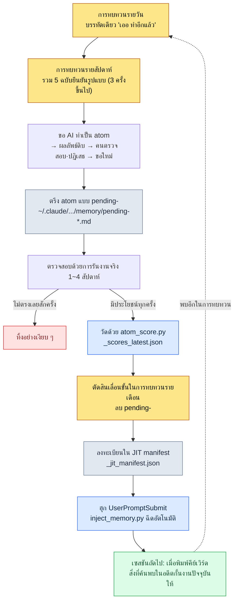

# ส่วนที่ 21 · บทที่ 2 ระบบการทบทวนกับการเลื่อนขั้น atom — เปลี่ยนสิ่งที่ค้นพบให้เป็นทรัพย์สินถาวร

เช้าวันจันทร์ ผมกำลังจะเริ่มต้นสัปดาห์ด้วยการเปิดบันทึกการทบทวนรายวันของสัปดาห์ก่อนทั้งห้าฉบับไว้บนหน้าจอเดียว ในบันทึกของวันอังคารเขียนไว้ว่า "ลืมตรวจสอบความถูกต้องก่อนจะ export ชีตข้อมูล" บันทึกของวันพฤหัสบดีก็มีประโยคที่แทบจะเหมือนกัน และในเช้าวันจันทร์นั้นเอง ผมก็กำลังทำสิ่งเดียวกันอีกครั้ง ผมเอาชีตที่ FK พังขึ้นบิลด์ฝั่งไคลเอนต์/เซิร์ฟเวอร์ตรง ๆ แล้วต้องถอนออกมาใหม่ นี่เป็นครั้งที่สามแล้ว

ช่วงเวลานี้แหละคือหัวใจของระบบการทบทวน ความจริงที่ว่าเรากำลังทำสิ่งเดียวกันเป็นครั้งที่สามนั้น มองไม่เห็นเลยในขณะที่เรากำลังทำมันอยู่ เพราะมือเคลื่อนไหวอย่างคุ้นเคย และสมองกระซิบว่า "นี่ก็งานที่ฉันทำเป็นประจำอยู่แล้วนี่" การทำซ้ำจะมองเห็นได้ก็ต่อเมื่อรวบรวมร่องรอยไว้แล้วมองย้อนกลับไปจากด้านหลังเท่านั้น การทบทวนคืออุปกรณ์ที่รวบรวมร่องรอยเหล่านั้น ส่วนการเลื่อนขั้น atom คืออุปกรณ์ที่ตรึงการทำซ้ำซึ่งค้นพบจากตรงนั้นให้เป็นกฎตายตัว เพื่อไม่ให้ต้องทำด้วยมืออีกต่อไป

บทนี้จะติดตามจนถึงที่สุดว่าอุปกรณ์ทั้งสองนี้ทำงานประสานกันอย่างไร และบันทึกการทบทวนรายวันจริงหนึ่งฉบับเปลี่ยนไปเป็น atom หนึ่งบรรทัดใน JIT manifest ได้อย่างไร

---

## 21.2.1 สิ่งที่ค้นพบเกิดจากกองร่องรอยเท่านั้น

ก่อนอื่นมีข้อตั้งต้นที่ต้องชี้ให้ชัด การทำซ้ำไม่สามารถรับรู้ได้แบบเรียลไทม์

หนึ่งวันของนักออกแบบเกมคือการตัดสินใจที่ต่อเนื่องกัน จะกำหนดคอลัมน์หนึ่งของชีตข้อมูลให้เป็น enum แบบไหน จะกำหนดคูลดาวน์ของสกิลเป็นหน่วยวินาทีหรือหน่วยเฟรม จะบันทึกข้อตกลงคลุมเครือที่ได้จากที่ประชุมไว้ตรงไหนของเอกสาร การตัดสินใจแต่ละครั้งเล็กเกินกว่าจะตกค้างอยู่ในความทรงจำ แต่ถ้าเรากำลังตัดสินใจเรื่องเดียวกันสามครั้งในหนึ่งสัปดาห์ นั่นก็ไม่ใช่การตัดสินใจอีกต่อไปแล้ว แต่เป็นกฎ ทั้งที่เป็นกฎ แต่ถ้ายังต้องตัดสินใจใหม่ทุกครั้ง นั่นคือความสิ้นเปลือง

ปัญหาคือความสิ้นเปลืองนี้มองไม่เห็น เราจึงทิ้งร่องรอยเอาไว้ ทุกวันใช้เวลา 5 นาที เขียนสิ่งที่ทำในวันนี้และสิ่งที่ทำซ้ำตั้งแต่สองครั้งขึ้นไปลงไปอย่างละบรรทัด เมื่อผ่านไปหนึ่งสัปดาห์ ร่องรอยห้าฉบับก็สะสมขึ้น แล้วถึงตอนนั้นเองที่เราจะมองเห็นว่า "เอ๊ะ เรื่องนี้เขียนไว้สามครั้งนี่"

นี่คือจุดที่แยกการทบทวนออกจากการเขียนไดอารี่ธรรมดา ไดอารี่เขียนความรู้สึก ส่วนการทบทวนเขียนร่องรอยเพื่อสกัดรูปแบบออกมา ดังนั้นการทบทวนจึงต้องมีรูปแบบตายตัว ถ้ารูปแบบต่างกันทุกครั้ง เราจะวางห้าฉบับเรียงกันเพื่อเปรียบเทียบไม่ได้ และเมื่อเปรียบเทียบไม่ได้ ก็มองไม่เห็นรูปแบบ

---

## 21.2.2 สามรอบไม่ใช่หน่วยของเวลา แต่เป็นหน่วยของบทบาท

เหตุที่แบ่งการทบทวนออกเป็นสามรอบ คือรายวัน รายสัปดาห์ รายเดือน ไม่ใช่เพราะเวลาผ่านไป แต่เพราะสิ่งที่แต่ละรอบทำนั้นต่างกันโดยพื้นฐาน

<svg viewBox="0 0 720 300" xmlns="http://www.w3.org/2000/svg" font-family="sans-serif">
  <rect x="0" y="0" width="720" height="300" fill="#fbfbfd"/>
  <!-- Daily -->
  <rect x="30" y="40" width="190" height="220" rx="10" fill="#eaf2fb" stroke="#3b6fb0" stroke-width="1.5"/>
  <text x="125" y="70" text-anchor="middle" font-size="17" font-weight="bold" fill="#1f3d63">รายวัน · 5~10 นาที</text>
  <text x="125" y="100" text-anchor="middle" font-size="13" fill="#33475b">บทบาท: ตรึงร่องรอย</text>
  <line x1="50" y1="115" x2="200" y2="115" stroke="#c2d4e8" stroke-width="1"/>
  <text x="125" y="142" text-anchor="middle" font-size="12" fill="#4a5b6b">สิ่งที่ทำวันนี้</text>
  <text x="125" y="166" text-anchor="middle" font-size="12" fill="#4a5b6b">การตัดสินใจที่ทำซ้ำ</text>
  <text x="125" y="190" text-anchor="middle" font-size="12" fill="#4a5b6b">เครื่องมือที่ไม่ได้ใช้</text>
  <text x="125" y="214" text-anchor="middle" font-size="12" fill="#4a5b6b">ส่งต่อไปเซสชันถัดไป</text>
  <text x="125" y="244" text-anchor="middle" font-size="11" font-style="italic" fill="#7a8a99">ผลผลิต: 5 ฉบับ/สัปดาห์</text>
  <!-- arrow 1 -->
  <polygon points="225,150 255,135 255,165" fill="#9bb3cc"/>
  <!-- Weekly -->
  <rect x="265" y="40" width="190" height="220" rx="10" fill="#eef6ee" stroke="#3f8a4f" stroke-width="1.5"/>
  <text x="360" y="70" text-anchor="middle" font-size="17" font-weight="bold" fill="#1f4a2a">รายสัปดาห์ · 30~60 นาที</text>
  <text x="360" y="100" text-anchor="middle" font-size="13" fill="#33475b">บทบาท: สกัดรูปแบบ</text>
  <line x1="285" y1="115" x2="435" y2="115" stroke="#c8e0c8" stroke-width="1"/>
  <text x="360" y="142" text-anchor="middle" font-size="12" fill="#4a5b6b">รวมรายวัน 5 ฉบับมาดู</text>
  <text x="360" y="166" text-anchor="middle" font-size="12" fill="#4a5b6b">ทำซ้ำ 3 ครั้งขึ้นไป → ผู้สมัคร</text>
  <text x="360" y="190" text-anchor="middle" font-size="12" fill="#4a5b6b">ตรึง atom แบบ pending-</text>
  <text x="360" y="244" text-anchor="middle" font-size="11" font-style="italic" fill="#7a8a99">ผลผลิต: ผู้สมัคร 1~3 รายการ</text>
  <!-- arrow 2 -->
  <polygon points="460,150 490,135 490,165" fill="#9bb3cc"/>
  <!-- Monthly -->
  <rect x="500" y="40" width="190" height="220" rx="10" fill="#fbf2ea" stroke="#b07b3b" stroke-width="1.5"/>
  <text x="595" y="70" text-anchor="middle" font-size="17" font-weight="bold" fill="#634021">รายเดือน · 1.5~2 ชม.</text>
  <text x="595" y="100" text-anchor="middle" font-size="13" fill="#33475b">บทบาท: ความคุ้มค่า·เลื่อนขั้น</text>
  <line x1="520" y1="115" x2="670" y2="115" stroke="#e8d4c2" stroke-width="1"/>
  <text x="595" y="142" text-anchor="middle" font-size="12" fill="#4a5b6b">ประเมินความคุ้มค่าเครื่องมือ</text>
  <text x="595" y="166" text-anchor="middle" font-size="12" fill="#4a5b6b">ตัดสินเลื่อนขั้น / ทิ้ง</text>
  <text x="595" y="190" text-anchor="middle" font-size="12" fill="#4a5b6b">แผนรายไตรมาส</text>
  <text x="595" y="244" text-anchor="middle" font-size="11" font-style="italic" fill="#7a8a99">ผลผลิต: atom อย่างเป็นทางการ</text>
</svg>

รายวันคือการตรึงร่องรอย ไม่ตัดสินอะไร แค่เขียนลงไปเฉย ๆ รายสัปดาห์คือการรวมร่องรอยห้าฉบับมาดูรูปแบบ ตรงนี้เองที่การตัดสินว่า "นี่คือการทำซ้ำ" เข้ามาเป็นครั้งแรก รายเดือนคือการมองดูเครื่องมือทั้งหมดที่สะสมไว้แล้วประเมินความคุ้มค่า ตัดสินว่าจะเก็บอะไรไว้และทิ้งอะไร

หากขาดรอบใดไปรอบหนึ่ง ที่เหลือก็พังทั้งหมด ถ้าทำแต่รายสัปดาห์โดยไม่มีรายวัน เราจะจำเรื่องของสัปดาห์ก่อนไม่ได้ ร่องรอยจึงว่างเปล่า ถ้าทำแต่รายเดือนโดยไม่มีรายสัปดาห์ เราจะต้องมาดูรายวันทั้งเดือนในคราวเดียว ซึ่งการเปรียบเทียบ 22 ฉบับในที่เดียวกันนั้นแทบเป็นไปไม่ได้ มองไม่เห็นรูปแบบ มีแต่ความล้าสะสม

การเปรียบกับสถานที่ทำงานเข้ากันได้ดี รายวันคือ 5 นาทีที่จัดโต๊ะทำงานในทุกเย็น รายสัปดาห์คือ 30 นาทีในช่วงสุดสัปดาห์ที่จัดลิ้นชักหนึ่งช่องใหม่ รายเดือนคือสองชั่วโมงในแต่ละไตรมาสที่สำรวจเส้นทางการเดินทั้งหมดของสถานที่ทำงาน ถ้าไม่จัดโต๊ะทุกวัน สุดสัปดาห์ก็จัดลิ้นชักไม่ได้ และถ้าลิ้นชักยุ่งเหยิง ต่อให้ดูเส้นทางการเดินก็หาคำตอบไม่ได้

---

## 21.2.3 การทบทวนรายวัน — การตรึงที่จบใน 5 นาที

จริง ๆ แล้วไฟล์การทบทวนรายวันที่ผมใช้จะสะสมตามวันที่ในพาธทำนอง `retro/daily/2026-05-30.md` ส่วนเทมเพลตนั้นคำสั่งสแลช `/retro` จะวางให้โดยอัตโนมัติ

```markdown
# การทบทวนรายวัน 2026-05-30

## สิ่งที่ทำวันนี้ (3~5 บรรทัด)
- เพิ่ม enum 12 ชนิดในชีตข้อมูลสกิลใหม่ + จัดเรียงคอลัมน์คูลดาวน์ใหม่
- ปรับสมดุลรอบแรกในการจำลอง (ปรับน้ำหนัก drop table)
- อัปเดตบิลด์ export ข้อมูลทั้งฝั่งไคลเอนต์/เซิร์ฟเวอร์พร้อมกัน

## การค้นพบการทำซ้ำ (ถ้ามี)
- ลืมตรวจสอบความถูกต้องก่อนบิลด์ export ข้อมูลอีกแล้ว → บิลด์ทั้งที่ FK พัง → ครั้งที่ 3
- รันการจำลองปรับสมดุลโดยไม่ตรึง seed ทำซ้ำไม่ได้ (ครั้งที่สอง)

## ผู้สมัครให้ทิ้ง
- เครื่องมือที่ไม่ได้ใช้แม้แต่ครั้งเดียวในวันนี้: (บันทึกไว้สำหรับวัดยอดสะสมรายเดือนเท่านั้น)

## ส่งต่อไปเซสชันถัดไป
- อุด FK ที่พังสองรายการ (การอ้างอิงสกิล→เอฟเฟกต์) ให้เรียบร้อยก่อน แล้วค่อยบิลด์ใหม่
- ผู้สมัคร: พิจารณาตั้งตัวเลือกตรึง seed ของการจำลองเป็นค่าเริ่มต้น
```

ใช้เวลา 5 นาทีก็เต็ม เพราะรูปแบบตายตัวอยู่แล้ว จึงไม่ต้องมานั่งคิดใหม่ทุกครั้งว่า "จะเขียนอะไรดี" เมื่อช่องถูกกำหนดไว้แล้ว แค่เติมช่องให้เต็มก็พอ

จุดชี้ขาดตรงนี้คือช่อง "การค้นพบการทำซ้ำ" ช่องนี้จะว่างไว้ก็ได้ วันส่วนใหญ่ก็ว่างเปล่า แต่ถ้าวันนี้รู้สึกตัวขึ้นมาว่าทำสิ่งเดียวกันสองครั้ง ก็เขียนลงไปหนึ่งบรรทัด ประโยค "ลืมตรวจสอบความถูกต้องก่อนบิลด์ export ข้อมูลอีกแล้ว → ครั้งที่ 3" ในตัวอย่างข้างบนนั่นแหละ บรรทัดเดียวนี้จะถูกรวมเป็นรูปแบบในการทบทวนรายสัปดาห์ไม่กี่วันต่อมา แล้วถูกตรึงเป็น atom หรือ skill อีกหลายสัปดาห์ถัดไป

การจับภาพอัตโนมัติช่วยลดงานมือของคน เมื่อ git commit log, ประวัติการเปลี่ยน atom และ skill usage log ถูกรวมเข้าในการทบทวนรายวันโดยอัตโนมัติ ครึ่งหนึ่งของช่อง "สิ่งที่ทำวันนี้" ก็ถูกเติมไว้เรียบร้อยแล้ว คนแค่เพิ่มสิ่งที่ git log มองไม่เห็น — ความรู้สึกตัวว่า "เออ ทำอีกแล้ว" — เข้าไปก็พอ

ช่องสุดท้าย "ส่งต่อไปเซสชันถัดไป" คือโน้ตที่ส่งถึงตัวเราในวันพรุ่งนี้ ถ้ามีช่องนี้ การโหลดบริบทตอนเริ่มเซสชันใหม่จะจบภายใน 1\~2 นาที ถ้าไม่มี ก็ต้องเสียเวลามากขึ้นในการค้นว่า "เมื่อวานทำอะไรค้างไว้นะ" จริง ๆ แล้วใน MEMORY.md ของผมมีรายการ "สิ่งที่ต้องเช็กก่อนในเซสชันถัดไป" แยกไว้ต่างหาก นี่ก็คือเวอร์ชันบนของการส่งต่อรายวันที่สะสมขึ้นมานั่นเอง

---

## 21.2.4 การทบทวนรายสัปดาห์ — ที่ที่รูปแบบเผยตัวออกมาเป็นครั้งแรก

การทบทวนรายสัปดาห์เริ่มต้นด้วยการวางรายวันห้าฉบับขึ้นมาบนหน้าจอเดียว ไฟล์จะสะสมในพาธทำนอง `retro/weekly/2026-W21.md`

```markdown
# การทบทวนรายสัปดาห์ 2026-W22 (25/5~31/5)

## สรุปสิ่งที่ทำในสัปดาห์นี้
- อัปเดตชีตข้อมูลสกิล/การปรับสมดุล, จำลอง drop table 2 ครั้ง
- บิลด์ export ข้อมูล 4 ครั้ง (ในจำนวนนั้น 2 ครั้งบิลด์ทั้งที่ FK·enum พัง)

## การค้นพบรูปแบบ
- ในรายวัน 3 รายการมี "ลืมตรวจสอบความถูกต้องก่อน export" ซ้ำ → ผู้สมัคร atom
- ในรายวัน 2 รายการมี "ไม่ตรึง seed ของการจำลองปรับสมดุล" ซ้ำ → พิจารณาค่าเริ่มต้นของการจำลอง

## ผู้สมัคร atom
- pending-data-check-before-export (กฎที่บังคับให้ตรวจสอบความถูกต้องก่อนบิลด์ export)

## ผู้สมัคร skill
- (ไม่มี — สัปดาห์นี้ใช้ atom ก็เพียงพอ)

## ตรวจสอบเครื่องมือที่มีอยู่
- ไม่ได้ใช้: relation-map-gen (สัปดาห์นี้ 0 ครั้ง)
- ใช้มากที่สุด: check (ตรวจความถูกต้องแบบ cascade), excel-reader, /retro

## แผนสัปดาห์หน้า
- รัน pending-data-check-before-export ต่ออีก 1 สัปดาห์แล้วค่อยตัดสินเลื่อนขั้น
```

ตรงนี้เองที่การตัดสินเข้ามาเป็นครั้งแรก "ในรายวัน 3 รายการมีการลืมตรวจสอบก่อน export ซ้ำ" เป็นข้อเท็จจริงเชิงคณิตศาสตร์ แต่ "นี่มีค่าพอที่จะตรึงเป็น atom" คือการตัดสิน เหตุที่ใช้การทำซ้ำ 3 ครั้งเป็นเส้นมาตรฐานนั้นเรียบง่าย ครั้งเดียวคือบังเอิญ สองครั้งก็อาจบังเอิญ สามครั้งคือรูปแบบ

เมื่อตัดสินใจได้ก็ตรึงทันที แต่ไม่ใช่ atom อย่างเป็นทางการ เป็น atom ชั่วคราวที่ติดคำนำหน้า `pending-` ไว้ มันจะถูกวางลงในโฟลเดอร์หน่วยความจำของโปรเจกต์ผมแบบนี้

```
~/.claude/projects/<project>/memory/
  pending-data-check-before-export.md
```

คำนำหน้า `pending-` คือเครื่องหมายที่บอกว่า "เรื่องนี้ยังอยู่ระหว่างตรวจสอบ" เหตุที่เครื่องหมายนี้สำคัญ คือถ้าเอาสัญชาตญาณที่ยังไม่ผ่านการตรวจสอบมาทำเป็นกฎของทั้งทีมทันที จะมีสองอย่างพังลง อย่างหนึ่งคือความเชื่อใจ — ถ้ากฎที่ไม่ผ่านการตรวจสอบผิดอยู่บ่อย ๆ คนก็จะเลิกเชื่อตัวกฎเอง อีกอย่างคือการสะสม — ถ้าไม่มีด่านตรวจสอบ สัญชาตญาณก็จะสะสมขึ้นตรง ๆ จนหน่วยความจำกลายเป็นถังขยะ

ดังนั้น `pending-` จึงถูกนำมารันทดลองในงานจริง ตั้งแต่หนึ่งสัปดาห์ ยาวไปจนถึงหนึ่งเดือน ถ้ามันมีประโยชน์จริงทุกครั้งก็จะอยู่รอด ถ้าไม่เคยตรงเลยสักครั้งก็จะถูกลบไปอย่างเงียบ ๆ

---

## 21.2.5 การทบทวนรายเดือน — วัดสุขภาพของเครื่องมือแล้วเลือกสิ่งที่จะเก็บไว้

การทบทวนรายเดือนคือที่ที่กางยอดสะสมตลอดทั้งเดือนออกมา แล้วตรวจสภาวะสุขภาพของเครื่องมือทั้งหมด ไฟล์จะสะสมเป็นหน่วยรายเดือนทำนอง `retro/2026-05.md`

```markdown
# การทบทวนรายเดือน 2026-05

## ยอดสะสมเดือนนี้
- การทบทวนรายวัน: 22 รายการ, การทบทวนรายสัปดาห์: 4 รายการ
- atom ใหม่: 4 รายการ (data-check-before-export, sim-seed-pinning และอื่น ๆ)
- skill ใหม่: 1 รายการ (เสริมตัวเลือกของ relation-map-gen)
- atom ที่ทิ้ง: 1 รายการ

## ประเมินความคุ้มค่าของเครื่องมือ
- จำนวนครั้งที่ใช้ต่อเดือนของแต่ละ skill + ความรู้สึกประหยัด (เชิงคุณภาพ)
- skill ที่ใช้ต่ำกว่าเดือนละ 1 ครั้ง → ผู้สมัครให้ทิ้ง
- เครื่องมือที่มีค่ามากที่สุด: check (ตรวจความถูกต้องแบบ cascade), excel-reader, /retro

## การกระจายของ atom
- ยอดสะสมตาม prefix (data: X, sim: Y, meeting: Z ...)
- ผู้สมัครให้ทิ้ง: atom ที่ทั้งเดือน match 0 ครั้ง

## แผนรายไตรมาส
- นำมาใช้เดือนหน้า: impact (ติดตามระดับผลกระทบ), อัปเดต schema-doc อัตโนมัติ

## เอกสารสำหรับเขียนหนังสือ (ถ้ามี)
- ในเดือนนี้สิ่งที่ควรอ้างอิงในหนังสือ: บันทึกเซสชันจริงของการเลื่อนขั้น atom 1 รายการ
```

หัวใจของรายเดือนคือการประเมินความคุ้มค่า เครื่องมือตอนสร้างดูมีค่าไปหมด แต่พอผ่านไปหนึ่งเดือน ครึ่งหนึ่งก็ไม่ได้หยิบมาใช้ การคัดแยกสิ่งนั้นใช้ห้าเกณฑ์วัด

เกณฑ์การประเมินมีห้าข้อ คือ ความถี่ในการใช้, การประหยัดเวลา, ภาระทางการรับรู้, ต้นทุนการบำรุงรักษา และความสามารถในการทดแทน ความถี่ในการใช้ถ้าตั้งแต่เดือนละ 1 ครั้งขึ้นไปก็เก็บไว้ก่อน ถ้าต่ำกว่านั้นก็ส่งไปเป็นผู้สมัครให้ทิ้ง การประหยัดเวลานั้นเอาความรู้สึกประหยัดต่อครั้งคูณกับความถี่ — ตรงนี้จะไม่ฟันธงตัวเลขเป็นหน่วยนาที การตัดสินเชิงคุณภาพในระดับ "รู้สึกประหยัดทีละไม่กี่นาที และใช้เดือนละสิบครั้งจึงสะสมมาก" คือความซื่อสัตย์ ภาระทางการรับรู้นั้น ถ้าจำนวนคำสั่งสแลชที่ต้องจำเกินสิบสองคำสั่ง ก็ถือเป็นสัญญาณให้จัดระเบียบ จำนวนคำสั่งที่คนแบกไว้ในหัวได้นั้นมีขีดจำกัด ต้นทุนการบำรุงรักษานั้นดูว่าเป็นเครื่องมือที่ต้องแก้ไปด้วยเมื่อชีตข้อมูลเปลี่ยนหรือไม่ ความสามารถในการทดแทนนั้นดูว่ามีวิธีที่ง่ายกว่าเกิดขึ้นมาใหม่หรือไม่

รวมห้าเกณฑ์เข้าด้วยกันแล้วตัดสินว่าจะเก็บ ทิ้ง หรือแก้ ภายในหนึ่งชั่วโมงก็สามารถไล่ดูเครื่องมือได้สามสิบถึงห้าสิบรายการ เพียงแต่ในช่วงเริ่มต้นหนึ่งถึงสองเดือนแรก เครื่องมือยังน้อยจึงประเมินไม่ถึงหนึ่งชั่วโมง ในช่วงนั้นใช้เวลาไปกับการจุดประกายเครื่องมือใหม่มากกว่าการประเมินจึงจะถูกต้อง การประเมินความคุ้มค่าคือกลไกความปลอดภัยที่จะทำงานเต็มที่ก็ต่อเมื่อเครื่องมือสะสมมากพอแล้ว

---

## 21.2.6 บันทึกเซสชันจริง: จากบรรทัดเดียวในรายวันสู่ atom หนึ่งบรรทัดใน JIT manifest

จากตรงนี้ไปคือกระดูกสันหลังของบทนี้ เราจะติดตามตั้งแต่จุดทบทวนไปจนถึงที่สุด ว่าเศษชิ้นส่วนที่กระจัดกระจายออกมาข้างบนนั้นเริ่มต้นจากบรรทัดเดียวจริง ๆ แล้วไปสู่การถูกฉีดเข้าทุกเซสชันโดยอัตโนมัติได้อย่างไร ผมจะคงช่วงเวลาที่ผมปฏิเสธ และช่วงเวลาที่ AI ตอบแบบคลุมเครือ ไว้ตามเดิม

**ขั้นที่ 1 — รู้สึกตัวในรายวัน** ขณะเขียนการทบทวนรายวันของวันที่ 30 พฤษภาคม ผมเขียนหนึ่งบรรทัดลงในช่อง "การค้นพบการทำซ้ำ"

```
- ลืมตรวจสอบความถูกต้องก่อนบิลด์ export ข้อมูลอีกแล้ว → บิลด์ทั้งที่ FK พัง → ครั้งที่ 3
```

ตอนนั้นยังไม่ได้สร้างเครื่องมืออะไรเลย แค่ทิ้งร่องรอยไว้เฉย ๆ

**ขั้นที่ 2 — ยืนยันรูปแบบในรายสัปดาห์แล้วขอให้ AI ทำเป็น atom** ไม่กี่วันต่อมา ตอนกางรายวันห้าฉบับในการทบทวนรายสัปดาห์ ก็พบบรรทัดเดียวกันอยู่สามที่ ผมจึงโยนพรอมต์ฉบับเต็มให้ Claude แบบนี้

> ในการทบทวนรายวัน 3 รายการของสัปดาห์นี้ "ลืมตรวจสอบความถูกต้องด้วยมือก่อนบิลด์ export ข้อมูล" เกิดซ้ำ ผมอยากทำเรื่องนี้เป็น pending atom ช่วยร่างเนื้อหา atom ให้หน่อย รูปแบบให้เป็นแบบเดียวกับ atom อื่น ๆ ในหน่วยความจำของเรา คือ frontmatter (name, status, trigger) กับกฎหนึ่งย่อหน้า

ผลลัพธ์ดิบของ Claude เป็นแบบนี้ (คงไว้ตามเดิมโดยไม่สรุปย่อ)

> ```markdown
> ---
> name: data-check-before-export
> status: pending
> trigger: ["데이터", "export", "빌드 전", "정합성"]
> ---
> ก่อนจะบิลด์ export ชีตข้อมูลเกมไปยังฝั่งไคลเอนต์/เซิร์ฟเวอร์ ต้องรันการตรวจสอบ
> ความถูกต้อง (check cascade) ก่อนเสมอ เพื่อยืนยันว่าการละเมิด FK·enum·การอ้างอิง
> เป็น 0 รายการ แล้วจึงค่อย export ถ้าพบการละเมิด ให้หยุด export และแจ้งรายละเอียด
> ความล้มเหลวไปยังผู้รับผิดชอบผ่านการแจ้งเตือน ClickUp
> ```
>
> บันทึก atom นี้เป็น `pending-data-check-before-export.md` ก็ได้ครับ เพียงแต่ในคีย์เวิร์ด trigger คำว่า "데이터" กว้างเกินไป อาจ match กับสถานการณ์ที่ไม่เกี่ยวกับ export ได้ด้วย (การเปิดดูชีตข้อมูล, การประชุมข้อมูล ฯลฯ) ขอแนะนำให้เอาออก

**ขั้นที่ 3 — การตรวจสอบของคนและการปฏิเสธบางส่วน** การที่ AI สงสัย trigger หนึ่งตัวด้วยตัวเองนั้นเป็นข้อชี้ที่ถูกต้อง แต่ผมไปไกลกว่านั้นอีกก้าวหนึ่ง ผมไม่ชอบที่เนื้อหาของกฎผูก "การตรวจสอบความถูกต้อง" กับ "การแจ้งเตือน ClickUp เมื่อล้มเหลว" ไว้ด้วยกันทั้งคู่ การแจ้งเตือนความล้มเหลวเป็น atom แยกอีกตัวซึ่ง `integrity_check_clickup_notify` รับผิดชอบอยู่แล้ว ถ้าผูกสองความรับผิดชอบไว้ใน atom เดียว เวลาที่อยากแก้แค่กฎการแจ้งเตือนทีหลัง ก็จะต้องไปแตะกฎการตรวจสอบไปด้วย ผมจึงปฏิเสธแล้วขอใหม่

> โอเค "데이터" trigger เอาออกได้ และการแจ้งเตือน ClickUp เมื่อล้มเหลวนั้น integrity_check_clickup_notify ทำอยู่แล้ว ก็เอาออกจาก atom นี้ ให้ atom นี้รับผิดชอบแค่การตรวจสอบความถูกต้องก่อน export อย่างเดียว ช่วยบีบให้แคบลง

หลังขอใหม่ เนื้อหาที่ Claude บีบให้แคบลงเป็นแบบนี้

> ```markdown
> ---
> name: data-check-before-export
> status: pending
> trigger: ["데이터 빌드", "export", "빌드 전 검증"]
> ---
> ก่อนจะบิลด์ export ชีตข้อมูลเกมไปยังฝั่งไคลเอนต์/เซิร์ฟเวอร์ ให้รันการตรวจสอบ
> ความถูกต้อง (check cascade) ก่อน สิ่งที่ตรวจ: ความสมบูรณ์ของการอ้างอิง FK, ความถูกต้องของค่า enum,
> ความถูกต้องของการอ้างอิงระหว่างตาราง ยืนยันการละเมิด 0 รายการแล้วจึงค่อย export การแจ้งเตือนเมื่อล้มเหลว
> เป็นความรับผิดชอบของ integrity_check_clickup_notify และกฎนี้ไม่เข้าไปเกี่ยวข้อง
> ```

นี่คือเวอร์ชันที่ผมยอมรับ รับผิดชอบแค่อย่างเดียว และ trigger ก็ถูกบีบให้แคบลงเฉพาะบริบทของ export ผมบันทึกไฟล์นี้เป็น `pending-data-check-before-export.md` หัวใจตรงนี้คือผมไม่ได้ใช้ผลลัพธ์แรกของ AI ตรง ๆ AI จัดรูปแบบให้ และสงสัย trigger หนึ่งตัวให้ก็จริง แต่การตัดสินเชิงออกแบบว่า "บีบความรับผิดชอบให้เหลืออย่างเดียว" นั้นคนเป็นคนทำ

**ขั้นที่ 4 — ตรวจสอบด้วยการรัน 1 สัปดาห์** ตลอดสัปดาห์ถัดมา ทุกครั้งที่บิลด์ export ข้อมูล pending atom ตัวนี้ก็ผุดขึ้นมา และจับ enum พังได้จริงสองครั้งก่อนบิลด์ ไม่เคยมีครั้งที่ไม่ตรงเลย จึงมีคุณสมบัติที่จะอยู่รอด

**ขั้นที่ 5 — ตัดสินเลื่อนขั้นและวัด score ในรายเดือน** ในการทบทวนรายเดือน ผมยก pending atom ตัวนี้ขึ้นเป็นผู้สมัครเลื่อนขั้น การเลื่อนขั้นหรือไม่ตัดสินด้วยการวัด ไม่ใช่สัญชาตญาณ ในสภาพแวดล้อมของผมมีสคริปต์ที่ให้คะแนนความถี่ในการ match และความมีประโยชน์ของ atom

```bash
python ~/.claude/scripts/atom_score.py
# → ~/.claude/projects/<project>/memory/_scores_latest.json 갱신
```

สคริปต์นี้รวบรวมว่าในช่วงที่ผ่านมาแต่ละ atom match กับ trigger กี่ครั้ง และตอนนั้นถูกอ้างอิงในงานจริงหรือไม่ แล้วทิ้งลงใน `_scores_latest.json` atom ที่คะแนนเกินเกณฑ์ที่กำหนดจะถูกเชื่อมให้ฉีดเข้า CLAUDE.md โดยอัตโนมัติ `pending-data-check-before-export` ตามผลวัดจริงในเดือนพฤษภาคม 2026 match ทุกครั้งที่บิลด์ export ตลอดหนึ่งสัปดาห์ คะแนนจึงเพียงพอ ยืนยันเลื่อนขั้น

**ขั้นที่ 6 — ลบ `pending-` ลงทะเบียนใน JIT manifest** หลังถอดคำนำหน้าออกแล้วเปลี่ยนเป็น atom อย่างเป็นทางการ ผมก็เพิ่มหนึ่งบรรทัดลงใน JIT manifest

```
~/.claude/projects/<project>/memory/_jit_manifest.json
```

manifest นี้ถูกอ่านโดยฮุก UserPromptSubmit (`~/.claude/hooks/inject_memory.py`) ในทุกอินพุต ถ้าในอินพุตมี "데이터 빌드" หรือ "export" อยู่ เนื้อหา atom ตัวนี้ก็จะแทรกเข้าบริบทโดยอัตโนมัติ

**ขั้นที่ 7 — ลูปปิด** ในวินาทีที่ผมพิมพ์ "데이터 export 빌드 돌려줘" เพื่อจะบิลด์ครั้งถัดไป ทั้งที่ผมยังไม่ได้สั่งอะไรเลย Claude ก็พูดขึ้นก่อน

> ให้รันการตรวจสอบความถูกต้อง (check cascade) ก่อน export ดีไหมครับ ผมจะตรวจความถูกต้องของการอ้างอิง FK·ค่า enum·การอ้างอิงตาราง ยืนยันการละเมิด 0 รายการแล้วจึงค่อย export

บรรทัด "เออ ทำอีกแล้ว" ที่ผมเขียนในการทบทวนรายวันเมื่อ 3 สัปดาห์ก่อน กลับมาเป็นกฎที่คอยกั้นงานในตอนนี้ให้เองโดยที่ผมไม่ต้องบอก การตรวจสอบที่เคยทำด้วยมือ ไม่ต้องทำด้วยมืออีกต่อไป การที่ลูปปิดลงนั้นหมายถึงฉากนี้นี่เอง

---

## 21.2.7 จากการค้นพบสู่การฉีดอัตโนมัติ ภาพรวมทั้งหมดของลูปการเลื่อนขั้น

ถ้าบีบบันทึกเซสชันจริงข้างบนให้เป็นผังการไหลหนึ่งภาพ ก็จะได้แบบนี้ การค้นพบเกิดในรายวัน การตรวจสอบทำโดยช่วงเวลาการรัน การเลื่อนขั้นกำหนดโดยการวัด และการทำให้เป็นทรัพย์สินปิดท้ายโดย manifest



เส้นประเส้นสุดท้ายคือทั้งหมดของภาพนี้ atom ที่ถูกฉีดอัตโนมัติก็เผยการทำซ้ำใหม่อีก แล้วมันก็เข้าสู่การทบทวนอีกครั้งเพื่อให้กำเนิด atom ถัดไป ทุกครั้งที่หมุนครบหนึ่งรอบ งานที่ต้องทำด้วยมือก็ลดลงทีละหนึ่ง เมื่อลูปนี้สะสมตั้งแต่ครึ่งปีถึงหนึ่งปี การทบทวนก็จะไม่ใช่ไดอารี่อีกต่อไป แต่กลายเป็นสมองของระบบการทำงาน

---

## 21.2.8 ทำให้การทบทวนเรียกหา atom ขึ้นมาอย่างเป็นธรรมชาติ

ห่วงโซ่ที่เปราะที่สุดในลูปการเลื่อนขั้นคือขั้นที่ 1 คือช่วงเวลาที่เขียน "เออ ทำอีกแล้ว" ลงไปนั้น เวลายุ่ง คนจะปล่อยช่องการทบทวนว่างไว้แล้วข้ามไป แล้วร่องรอยก็ไม่เหลือ เมื่อไม่มีร่องรอยก็มองไม่เห็นรูปแบบในรายสัปดาห์ เมื่อไม่มีรูปแบบ atom ก็ไม่เกิด ปากทางเข้าของลูปก็ตัน

ดังนั้นในสภาพแวดล้อมของผมจึงมี atom หนึ่งตัวชื่อ `retro_atom_natural_invitation` เป็นกฎที่บอกว่าตอนเขียนการทบทวน อย่าบังคับการจุดประกาย atom เป็นหน้าที่ ให้ทิ้งไว้เป็นคำเชิญที่เป็นธรรมชาติ กล่าวคือไม่ใช่ "วันนี้ต้องดึงผู้สมัคร atom หนึ่งตัวออกมาให้ได้" แต่ให้วางช่อง "การค้นพบการทำซ้ำ" ในเทมเพลตการทบทวนเป็นช่องที่ปล่อยว่างได้ แต่ถ้ามีอะไรพอจะเขียนได้สักบรรทัด ก็ชักจูงให้เขียนลงไปอย่างเบา ๆ ถ้าทำเป็นหน้าที่บังคับ ก็จะฝืนสร้างรูปแบบปลอม ๆ ขึ้นมา ถ้าทิ้งไว้เป็นคำเชิญ ก็จะมีแต่การทำซ้ำของจริงเท่านั้นที่ติดเข้ามาอย่างเป็นธรรมชาติ

ความต่างเฉียดเส้นนี้แหละที่ชี้ขาดความยั่งยืนของลูป การทบทวนที่ถูกบังคับเป็นหน้าที่จะไม่ผ่านสองสัปดาห์ และจะถูกเติมด้วยคำโกหกตามแบบฟอร์ม การทบทวนแบบคำเชิญในวันที่ไม่มีอะไรจะเขียนก็ปล่อยช่องว่างไว้ จึงไม่มีภาระ และเพราะอย่างนั้นจึงอยู่ได้นาน ต้องอยู่ได้นานร่องรอยจึงสะสม ร่องรอยสะสมจึงมองเห็นรูปแบบ

atom ตัวนี้เองก็เกิดมาจากการทบทวน ผมรันการทบทวนแบบบังคับเป็นหน้าที่ แล้วพบในรายวันว่าช่องถูกเติมด้วยของปลอมภายในไม่กี่วัน และการค้นพบนั้นผ่านรายสัปดาห์แล้วเลื่อนขั้นมาเป็นกฎข้อนี้ กลายเป็นว่ากฎที่ปรับปรุงการทบทวนก็ออกมาจากการทบทวนเอง

---

## 21.2.9 จุดที่มักพังบ่อย ๆ

พอหมุนลูปไปก็จะพังที่จุดเดิม ๆ ซ้ำ ๆ

การข้ามการทบทวนคือสิ่งที่พบบ่อยที่สุด อ้างว่ายุ่งแล้วข้ามไปสามวัน ร่องรอยของสามวันนั้นก็หายไปตลอดกาล วิธีกั้นนั้นเรียบง่าย — ช่องอื่นปล่อยว่างได้หมด แต่ "สิ่งที่ทำวันนี้" หนึ่งบรรทัดต้องเขียน ไม่ใช่ 5 นาที จะเป็น 1 นาทีร่องรอยก็ยังเหลือ

การจัดรูปแบบใหม่ทุกครั้งก็อันตราย ถ้าเขียนแบบอิสระ ก็วางห้าฉบับเรียงกันเปรียบเทียบไม่ได้ เมื่อเปรียบเทียบไม่ได้ งานของรายสัปดาห์อย่างการสกัดรูปแบบเองก็เป็นไปไม่ได้ ดังนั้น `/retro` จึงวางเทมเพลตให้แบบบังคับ

การไม่ทิ้งของก็เป็นกับดัก ถ้าเอาแต่เพิ่ม atom และ skill โดยไม่ทิ้ง ภาระทางการรับรู้ก็สะสม นับจากวินาทีที่คำสั่งสแลชเกินสิบสองคำสั่ง สมองก็จำเครื่องมือไม่ได้หมด การประเมินความคุ้มค่าของรายเดือนคือกลไกเดียวที่กั้นการสะสมนี้

การข้ามด่านเลื่อนขั้นก็อันตราย ถ้าเอาสัญชาตญาณมาทำเป็น atom อย่างเป็นทางการทันที กฎที่ไม่ผ่านการตรวจสอบก็สะสม ด่านที่ผ่าน `pending-` แล้วเลื่อนขั้นด้วยการวัดต้องมีอยู่ระหว่างการค้นพบกับการทำให้เป็นทรัพย์สินอย่างแน่นอน

สุดท้าย การไม่ทำการทบทวนเพราะเป็นงานคนเดียวจึงไม่มีการแบ่งปันกับทีมนั้นเป็นความเข้าใจผิด บันทึกเซสชันจริงทั้งหมดข้างบนเป็นตัวอย่างที่หมุนในสภาพแวดล้อมคนเดียว เพียงแค่ขั้นตอนการ merge แบ่งปันกับทีมหายไปเท่านั้น ลูปการค้นพบ→pending→วัด→เลื่อนขั้น→ฉีด JIT ก็ยังหมุนตามเดิมได้แม้อยู่คนเดียว ในทางกลับกัน ในสภาพแวดล้อมคนเดียว ลูปนี้ทำหน้าที่เป็นผู้ตรวจสอบจากภายนอกเพียงรายเดียว

---

> **การประยุกต์นอกเกม** ลูปการเลื่อนขั้นที่บรรทัดเดียวในรายวันผ่านการตรวจสอบจนกลายเป็นกฎถาวร คือกระบวนการที่ทำให้ "บทเรียนที่เคยเรียนรู้แล้วไม่ต้องทำด้วยมืออีก" โดยไม่เกี่ยวกับสายงาน หัวใจคือด่านที่ไม่ตรึงสิ่งที่ค้นพบเป็นกฎของทีมทันที แต่รัน `pending` ทดลองหนึ่งสัปดาห์ แล้วทำให้เป็นทางการก็ต่อเมื่อมีประโยชน์จริงทุกครั้ง — เพราะถ้าเอาสัญชาตญาณที่ไม่ผ่านการตรวจสอบมาทำเป็นกฎทันที คนก็จะเลิกเชื่อตัวกฎเอง เช่น ทีมปฏิบัติการตั้ง "ดูยอดรวมตัวเลขอีกครั้งว่าถูกต้องก่อนส่งรายงาน" ไว้เป็นเช็กลิสต์ชั่วคราว แล้วลองรันหนึ่งสัปดาห์ พอจับข้อผิดพลาดได้จริงสักสองครั้งก็ยกขึ้นเป็นขั้นตอนมาตรฐานอย่างเป็นทางการ การตัดสินเชิงออกแบบที่บีบให้รับผิดชอบแค่อย่างเดียว (ไม่ผูกการตรวจหลายอย่างไว้ในบรรทัดเดียว) ก็จะตามมาเองโดยธรรมชาติ

## ลองทำดู

**setup** วางโฟลเดอร์การทบทวนและเทมเพลต

```bash
mkdir -p ~/.claude/projects/<your-project>/memory/retro/daily
mkdir -p ~/.claude/projects/<your-project>/memory/retro/weekly
# 일간 템플릿 파일 하나를 retro/_template_daily.md 로 저장
```

**prompt** หลังสะสมการทบทวนรายวันได้หนึ่งสัปดาห์ ในที่ของการทบทวนรายสัปดาห์ ให้โยนแบบนี้ให้ Claude

> ผมจะแปะการทบทวนรายวัน 5 ฉบับของสัปดาห์นี้ให้ ช่วยหางาน·การตัดสินที่ทำซ้ำตั้งแต่ 3 ครั้งขึ้นไป แล้วจัดเป็นผู้สมัคร atom ให้หน่อย แต่ละผู้สมัครให้เป็น frontmatter (name, status: pending, อาร์เรย์ของคีย์เวิร์ด trigger) กับกฎหนึ่งย่อหน้า ถ้า trigger กว้างเกินไปก็เสนอแบบบีบให้แคบ และถ้า atom หนึ่งตัวรับสองความรับผิดชอบก็เสนอแบบแยกออกจากกัน

**verify** อย่าใช้ผู้สมัครที่ได้รับมาตรง ๆ แต่ให้ตรวจสอบสามอย่าง (1) atom หนึ่งตัวรับผิดชอบแค่อย่างเดียวหรือไม่ — ถ้าสองความรับผิดชอบให้ปฏิเสธและขอแยก (2) คีย์เวิร์ด trigger match เฉพาะบริบทของงานนั้นหรือไม่ — ถ้ากว้างเกินไปให้ปฏิเสธ (3) ทำซ้ำ 3 ครั้งจริงหรือไม่ หรือเป็นความบังเอิญ 2 ครั้ง — ถ้าบังเอิญก็อย่าแม้แต่จะสร้าง pending เฉพาะสิ่งที่ผ่านสามการตรวจสอบเท่านั้นที่ติด `pending-` แล้วบันทึกไว้ และหลังรันหนึ่งสัปดาห์ ทำให้เป็นทางการก็ต่อเมื่อมีประโยชน์ทุกครั้ง

---

## 21.2.10 ฉบับย่อสำหรับคนเดียว

ถ้าไม่มีทั้งทีม ทั้งฮุก JIT และสคริปต์ score ก็ยังเลียนแบบลูปทั้งหมดได้ด้วยไฟล์หน้าเดียวต่อไปนี้

สร้างไฟล์ `retro.md` หนึ่งไฟล์แล้ววางแค่สามช่อง

```markdown
## 오늘 (1줄)
- 

## 또 했네 (있으면 1줄)
- 

## 박제 후보 (또 했네가 3번 쌓이면 이리로)
- [ ] (규칙 한 문장) — 검증: ___회 유용
```

ทุกวันเติมแค่สองช่องบน ถ้าใน "เออ ทำอีกแล้ว" มีบรรทัดเดียวกันสะสมสามครั้ง ก็ย้ายไปช่องที่สามแล้วเขียนเป็นกฎหนึ่งประโยค นับจำนวนครั้งที่กฎนั้นมีประโยชน์จริงตลอดสัปดาห์ถัดมาแล้วเขียนลงในช่อง ถ้าตั้งแต่สามครั้งขึ้นไปก็ย้ายประโยคนั้นไปไว้ในหน่วยความจำของโปรเจกต์ (CLAUDE.md) อย่างเป็นทางการ แม้ไม่มีฮุก JIT กฎที่ขึ้นไปอยู่ใน CLAUDE.md ก็จะตามมาในเซสชันถัดไปเสมอ เพียงเท่านั้นก็เป็นรูปแบบขั้นต่ำของลูปที่ "สิ่งที่ค้นพบในอดีตช่วยงานปัจจุบัน" สมบูรณ์แล้ว

หัวใจไม่ได้อยู่ที่ความหรูหราของเครื่องมือ แต่อยู่ที่การมีอยู่ของด่าน ขอแค่มีด่าน "เออ ทำอีกแล้ว 3 ครั้ง → ตรึง → มีประโยชน์ 3 ครั้ง → ทำเป็นถาวร" ด้วยไฟล์หน้าเดียวลูป self-improving ก็หมุนได้

---

### สรุปประเด็นสำคัญของบท
- การทำซ้ำมองไม่เห็นในระหว่างทำงาน เห็นได้ก็ต่อเมื่อรวบรวมร่องรอยแล้วมองย้อนจากด้านหลังเท่านั้น
- ถ้าไม่มีด่าน pending และการวัด การทบทวนก็จบลงแค่การจุดประกาย ไม่กลายเป็นทรัพย์สิน
- เมื่อบรรทัดเดียวในรายวันปิดลงเป็นหนึ่งบรรทัดใน JIT manifest อดีตก็ช่วยปัจจุบัน

### ตัวอย่างบทถัดไป
- บทที่ 3 การปิดลูป self-improving — ช่วงเวลาที่การทบทวน·atom·JIT รวมเป็นระบบเดียวกัน
