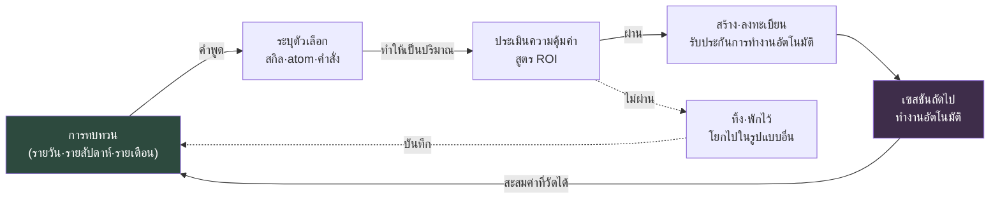

# ส่วนที่ 21 · บทที่ 3 ปิดลูป self-improving

> วงจรที่เริ่มต้นจากการทบทวนได้กลับมาสู่การทบทวนอีกครั้งหรือไม่ ถ้ามันไม่ปิด สิ่งนั้นก็เป็นเพียงบันทึก ไม่ใช่ระบบ

---

ผมเปิดดูการทบทวนของหกเดือนก่อน "คำศัพท์ยังไม่เป็นมาตรฐานเดียวกัน" "หาเอกสารยาก" "ถูกถามคำถามเดิมซ้ำอีก" จากนั้นผมเปิดดูการทบทวนที่เขียนไว้เมื่อเช้านี้ "คำศัพท์ยังไม่เป็นมาตรฐานเดียวกัน" "หาเอกสารยาก" "ถูกถามคำถามเดิมซ้ำอีก"

เหมือนกันแม้กระทั่งตัวอักษร ไม่ใช่ว่าไม่ได้ทบทวน ตลอดหกเดือนนั้นผมทบทวนอย่างขยันขันแข็ง หน้า Notion ทยอยทับถมกันขึ้นมา และในเวิร์กช็อปรายไตรมาส กระดาษโน้ตก็ปกคลุมไวต์บอร์ดไปทั่ว แต่เนื้อหาที่เขียนไว้กลับวนอยู่ที่เดิม ไม่ใช่ว่าการทบทวนไม่ทำงาน แต่ลูปต่างหากที่ไม่ปิด

บทนี้คือบทสุดท้ายของหนังสือ ดังนั้นสิ่งที่กล่าวถึงก็เป็นคำถามสุดท้ายเช่นกัน เครื่องมือทั้งหมดที่สร้างไว้ก่อนหน้านี้ — ตัวสร้างเมืองในส่วนที่ 6, atom สำหรับการตรวจสอบบนมือถือในส่วนที่ 14, มาตรฐานต้นทุนในส่วนที่ 22 — สิ่งเหล่านี้จะไม่เป็นของใช้ครั้งเดียวแล้วจบ แต่จะกลายเป็นระบบที่เติบโตด้วยตัวเองได้นั้น ต้องมีอะไรเพิ่มอีก คำตอบมีหนึ่งเดียว วงจรปิดที่คำพูดซึ่งออกมาจากการทบทวนทำงานโดยอัตโนมัติตั้งแต่เซสชันถัดไป และการทำงานนั้นถูกวัดผลแล้ววนกลับมาสู่การทบทวนอีกครั้ง กลไกที่ปิดวงจรนี้ก็คือลูป self-improving

---

## 21.3.1 ตัวตนของลูปที่ไม่ปิด

คำพูดออกมาจากการทบทวน "ประชุมเยอะเกินไป" เป็นคำพูดที่ดี แต่คำพูดนั้นถูกทิ้งไว้เป็นหนึ่งบรรทัดบนหน้า Notion สัปดาห์ถัดมาประชุมก็ยังเยอะเหมือนเดิม และในการทบทวนครั้งถัดไปบรรทัดเดิมก็ถูกเขียนซ้ำอีก เพราะระหว่างคำพูดกับการปรับปรุงมีความทรงจำของคนคั่นอยู่ คนเรานั้นลืม ดังนั้นมันจึงขาดตอน

จะเรียกว่า self-improving ได้นั้น คำพูดจากการทบทวนต้องเชื่อมต่อไปสู่การกระทำอัตโนมัติของเซสชันถัดไปโดยไม่ผ่านความทรงจำของคน เงื่อนไขที่ทำให้สิ่งนี้สำเร็จมีอยู่สี่ข้อ

ข้อแรก คำพูดจากการทบทวนต้องถูกแปลงเป็นรูปแบบที่นำไปปฏิบัติได้ทันที ไม่ใช่ความตั้งใจที่เป็นนามธรรม แต่ตกผลึกออกมาเป็นอย่างใดอย่างหนึ่งในบรรดาสกิล atom รายการ manifest หรือคำสั่งสแลช ข้อสอง ต้องทำงานโดยอัตโนมัติตั้งแต่เซสชันถัดไปโดยที่คนไม่ต้องจำ ข้อสาม ในการทบทวนครั้งถัดไปต้องวัดได้จริงว่ามันเปลี่ยนอะไรไปบ้าง ข้อสี่ ผลการวัดนั้นต้องวนกลับไปเป็นข้อมูลขาเข้าของการปรับปรุงครั้งถัดไป

เมื่อทั้งสี่ข้อนี้เชื่อมต่อกันโดยอัตโนมัติ ลูปจึงปิด หากเติมช่องว่างแม้เพียงขั้นเดียวด้วย "สัปดาห์หน้าฉันจะจำไว้แล้วเอามาใช้" ลูปก็จะเปิดออกอีกครั้งตรงจุดนั้นทันที และในการทบทวนครั้งถัดไปคำพูดเดิมก็จะถูกเขียนซ้ำอีก

หากมองด้วยการเปรียบเทียบกับลิ้นชัก มันเป็นเช่นนี้ ถ้าการทบทวนจบลงเพียงบันทึกว่า "ปากกาด้ามนี้ไม่ได้ใช้แล้ว เอาออกเถอะ" สัปดาห์ถัดมาปากกาด้ามนั้นก็ยังอยู่ที่เดิม ไม่ใช่บันทึก แต่ต้องลงมือหยิบออกไปจริง มันจึงจะปิด และต้องกลับมาตรวจอีกครั้งในไตรมาสถัดไป ปากกาที่ไม่ได้ใช้จึงจะไม่ทับถมกันที่เดิมอีก บันทึกคือคำพูด การลงมือคือการทำงานอัตโนมัติ และการตรวจในไตรมาสถัดไปคือการวัดผล ถ้าขาดข้อใดข้อหนึ่งในสามนี้ ลิ้นชักก็จะกลับมารกอีก

---

## 21.3.2 รูปแบบปิดของลูป

หากวาดกระแสทั้งหมดออกมา มันจะกลายเป็นวงจรปิด ทั้งจุดเริ่มและจุดจบล้วนเป็นการทบทวน



ลูกศรวนหนึ่งรอบแล้วเข้าสู่การทบทวนอีกครั้ง การปิดวงนี้คือหัวใจสำคัญ ผลลัพธ์ของแต่ละขั้นกลายเป็นข้อมูลขาเข้าของขั้นถัดไป และค่าที่วัดได้ในขั้นสุดท้ายก็กลับไปเป็นข้อมูลขาเข้าของการทบทวนครั้งแรกอีก หากมีความทรงจำของคนคั่นอยู่ตรงกลาง ลูกศรนั้นก็จะขาด และวงจรก็จะแตก

ลองดูลูกศรเส้นประที่ตัวเลือกซึ่ง ROI ไม่ผ่านถูกโยกไปทิ้งหรือพักไว้ ก็ยังกลับมาสู่การทบทวนในที่สุด การตัดสินว่า "สิ่งนี้ไม่คุ้มค่าที่จะสร้าง" นั้นเองกลายเป็นบันทึกของการทบทวนครั้งถัดไป และเมื่อตัวเลือกเดียวกันถูกเสนอขึ้นมาอีก มันก็เป็นเหตุผลให้คัดออกได้อย่างรวดเร็ว การทิ้งก็อยู่ในลูปเช่นกัน

คำพูดที่เชื่อมต่อจากการทบทวนไปสู่ self-improving นั้นมีรูปแบบที่กำหนดไว้ห้ารูปแบบ (กล่าวถึงไว้แล้วใน §21.1.4) สกิลที่จะสร้าง สกิลที่จะปรับปรุง atom ที่จะสร้าง atom ที่จะปรับปรุง และการประเมินความคุ้มค่าใหม่ หากใส่ห้าข้อนี้ไว้เป็นช่อง (slot) ในเทมเพลตการทบทวนเอง คำพูดก็จะไม่ตกหล่น

```markdown
## การทบทวน (รายวัน) — 2026-06-06

### 1. งานวันนี้
- (สรุปงาน)

### 2. คำพูด self-improving (5 ช่อง)
- สกิลที่จะสร้าง: <ถ้าว่างให้ใส่ "ไม่มี">
- สกิลที่จะปรับปรุง: <>
- atom ที่จะสร้าง: <>
- atom ที่จะปรับปรุง: <>
- ประเมินความคุ้มค่าใหม่: <>

### 3. สิ่งที่จะวัดในการทบทวนครั้งถัดไป
- <>
```

ช่องจะว่างก็ได้ ข้อเท็จจริงที่ว่าช่องว่างนั้นเองคือบันทึกว่า "วันนี้ไม่มีการปรับปรุงใหม่" เพียงแต่หากทั้งห้าช่องว่างเปล่าติดต่อกันหลายวัน นั่นไม่ใช่ว่าไม่มีเรื่องให้ปรับปรุง แต่เป็นสัญญาณว่าการทบทวนกำลังแข็งตัวเป็นเพียงพิธีกรรม เมื่อนั้นให้โยนคำถามกระตุ้นเข้าไป "สัปดาห์นี้มีงานอะไรที่ทำด้วยมือซ้ำสองครั้ง"

คำพูดออกมาในสภาพคลุมเครือ "บันทึกการประชุมยาวเกินไป" จะปั้นให้เป็นตัวเลือกได้ต้องทำให้เป็นปริมาณด้วยผลลัพธ์หนึ่งชิ้น "บันทึกการประชุมยาวเกินไป" ถูกแปลงเป็นเครื่องมือหนึ่งชิ้นคือสกิล `meeting_summary` ซึ่งรับบันทึกการประชุมแล้วสกัดเฉพาะการตัดสินใจกับรายการสิ่งที่ต้องทำ "คำศัพท์สับสน" ถูกแปลงเป็น atom `glossary_lookup` ที่บรรจุคำศัพท์เฉพาะโดเมน 30 คำ ส่วน "ถูกถามคำถามเดิมทุกครั้ง" ถูกแปลงเป็นคำสั่งสแลช `/onboarding` ที่ทำให้การแนะนำวันแรกของพนักงานใหม่เป็นอัตโนมัติ และ "การซิงค์ตกหล่นบ่อย" ก็ตกผลึกเป็นการปรับ manifest และเพิ่ม JIT atom

ตัวเลือกต้องถูกนิยามเป็น "ผลลัพธ์ชิ้นใดชิ้นหนึ่ง" จึงจะไปสู่ขั้นถัดไปได้ "ปรับปรุงโดยรวม" ไม่ใช่ตัวเลือก คำพูดที่แปลงเป็นผลลัพธ์หนึ่งชิ้นไม่ได้ ก็เอาขึ้นแท่นประเมิน ROI ไม่ได้ และเมื่อเอาขึ้นไม่ได้ มันก็หยุดอยู่ตรงนั้น

---

## 21.3.3 ROI เป็นเรื่องของจำนวนหลัก

มีตัวเลือกแล้วก็ไม่ได้สร้างทุกอันไป ก่อนสร้างต้องวัดผลตอบแทนเทียบกับการลงทุนเสียก่อน สูตรนั้นเรียบง่าย

<svg viewBox="0 0 720 150" xmlns="http://www.w3.org/2000/svg" font-family="sans-serif">
  <rect x="0" y="0" width="720" height="150" fill="#1e1e28"/>
  <text x="360" y="38" fill="#9fe0b0" font-size="17" text-anchor="middle" font-weight="bold">สูตร ROI</text>
  <line x1="180" y1="85" x2="540" y2="85" stroke="#666" stroke-width="2"/>
  <text x="360" y="72" fill="#e6e6e6" font-size="16" text-anchor="middle">เวลาที่ประหยัด × ความถี่การทำงาน × ระยะเวลาใช้งาน</text>
  <text x="360" y="115" fill="#e6e6e6" font-size="16" text-anchor="middle">เวลาที่ใช้สร้าง + ภาระการดูแลรักษา</text>
  <text x="150" y="92" fill="#c89bf0" font-size="22" text-anchor="middle">ROI =</text>
</svg>

แต่ละรายการมีหน่วยและเส้นผ่านของมัน เวลาที่ประหยัดคือเวลาของคนที่ลดลงต่อการทำงานหนึ่งครั้ง คิดเป็นหน่วยนาที ความถี่การทำงานคือจำนวนครั้งโดยประมาณต่อสัปดาห์ ถ้าตั้งแต่สัปดาห์ละ 1 ครั้งขึ้นไปก็ผ่าน ระยะเวลาใช้งานคือจำนวนสัปดาห์โดยประมาณจนกว่าจะถูกทิ้ง เครื่องมือที่อยู่ไม่ถึง 4 สัปดาห์ก็มีเหตุผลให้สร้างน้อย เวลาที่ใช้สร้างคือเวลาที่ใช้ในการสร้างครั้งแรกและตรวจสอบ ส่วนการดูแลรักษาคือเวลาที่ใช้ตรวจสอบและแก้ไขรายเดือน

ตัวเศษคือเวลาที่ประหยัดสะสม ตัวส่วนคือต้นทุนสะสม ตัดสินจากค่าที่ออกมา

| ค่า ROI | การตัดสิน |
|---|---|
| 10 ขึ้นไป | สร้างทันที |
| 3\~10 | สร้างภายในหนึ่งสัปดาห์ |
| 1\~3 | พักไว้ในสถานะ pending ประเมินใหม่อีกหนึ่งเดือนถัดมา |
| ต่ำกว่า 1 | ทิ้งในรูปแบบนี้ พิจารณาวิธีอื่น |

การที่ ROI ต่ำกว่า 1 ไม่ได้หมายความว่า "ไอเดียนี้ไร้ประโยชน์" แต่หมายความว่า "ไม่ควรสร้างในรูปแบบนี้" ให้ตรวจดูก่อนว่าจะแทนที่ด้วย atom ที่เบากว่าเพียงบรรทัดเดียวได้หรือไม่ จะแก้ด้วย Wrapper ที่เปลี่ยนเพียงจุดเข้าใช้งานของเครื่องมือเดิมได้หรือไม่ การลดงานที่ต้องทำเป็นสกิลหนักลงมาเป็น atom บรรทัดเดียว ทำให้ตัวส่วนหดลงเหลือหนึ่งในสิบจน ROI ฟื้นขึ้นมาเป็นกรณีที่พบบ่อย

ลองใส่ตัวเลขจริงเข้าไปสักตัว ผมจะลองคำนวณ ROI ของระบบฉีด JIT atom ที่ติดตั้งบนพีซีส่วนตัวเมื่อวันที่ 23 พฤษภาคม 2026 — โครงสร้างพื้นฐานที่ฮุก UserPromptSubmit ดูข้อมูลที่ผู้ใช้ป้อนแล้วฉีดชิ้นส่วนความจำ (atom) ที่เกี่ยวข้องโดยอัตโนมัติ

```
เวลาที่ประหยัด:  ราว 3~5 นาทีต่อหนึ่งเซสชัน (ตัดเวลาที่เคยต้องหา atom ที่เกี่ยวข้องด้วยมือแล้วเรียกใช้)
ความถี่การทำงาน:  15~25 เซสชันต่อสัปดาห์ (อิงตามพีซีส่วนตัว)
ระยะเวลาใช้งาน:  คาดว่า 1 ปีขึ้นไป (เป็นโครงสร้างพื้นฐานจึงมีโอกาสถูกทิ้งต่ำ)
เวลาที่ใช้สร้าง:  4 ชั่วโมง (hook + manifest + ตรวจสอบ atom)
การดูแลรักษา:   0.5 ชั่วโมงต่อเดือน (เพิ่ม·แก้ไข atom)

ROI = (4 นาที × 20 ครั้ง/สัปดาห์ × 52 สัปดาห์) / (4 ชั่วโมง × 60 นาที + 0.5 ชั่วโมง × 12 เดือน × 60 นาที)
    = 4,160 นาที / (240 นาที + 360 นาที)
    = 4,160 นาที / 600 นาที
    ≈ 6.9  →  อยู่ในช่วง "สร้างทันที" การตัดสินถูกหนุนด้วยสูตร
```

ตรงนี้มีส่วนที่ต้องซื่อตรง ตัวเลขข้างต้น — 3\~5 นาทีต่อเซสชัน, 15\~25 เซสชันต่อสัปดาห์ — ไม่ใช่การวัดอย่างแม่นยำ แต่เป็นการประมาณที่อิงประสบการณ์การใช้งานของผู้เขียน ไม่ใช่ค่าที่จับเวลาด้วยนาฬิกาจับเวลา ดังนั้น ROI 6.9 ก็ไม่ใช่ค่าที่เชื่อได้ถึงทศนิยม

แต่ก็ไม่เป็นไร เพราะสูตร ROI เป็นเครื่องมือที่ดูจำนวนหลัก ไม่ใช่ความแม่นยำ ถ้าผลออกมาแถวๆ 7 ก็สร้าง ถ้าแถวๆ 0.3 ก็คิดใหม่ การแบ่งระหว่างสองค่านี้ไม่จำเป็นต้องใช้ทศนิยม สิ่งสำคัญคือแม้กระทั่งตอนตัดสินใจว่าจะไม่สร้าง เหตุผลก็ต้องออกมาจากสูตร ไม่ใช่จากสัญชาตญาณในหัว ไม่สร้างเพราะจำนวนหลักไม่ตรงกัน — เมื่อหนึ่งบรรทัดนี้ถูกทิ้งไว้ในการทบทวน พอตัวเลือกเดิมถูกเสนอขึ้นมาอีก ก็ไม่ต้องมาครุ่นคิดซ้ำ

---

## 21.3.4 สร้างเสร็จแล้วยังไม่จบ — การลงทะเบียนและตรวจสอบการทำงาน

เมื่อตัวเลือกผ่านก็สร้าง แต่การสร้างเป็นเพียงครึ่งหนึ่ง อีกครึ่งหนึ่งคือการลงทะเบียนให้มันทำงานโดยอัตโนมัติตั้งแต่เซสชันถัดไป หากการลงทะเบียนนี้ตกหล่น เครื่องมือก็จะถูกสร้างขึ้นแต่ทิ้งไว้ในจุดที่ไม่มีมือใครเอื้อมถึง และลูปก็ขาดตอนตรงนั้น

แต่ละชนิดของผลลัพธ์มีที่ลงทะเบียนต่างกัน สกิลส่วนกลางให้ใส่ไว้ที่ `~/.claude/skills/` และสร้าง atom คู่มือที่บรรจุวิธีใช้ไว้คู่กัน สกิลของโปรเจกต์ให้วางไว้ที่ `.claude/skills/` ของโปรเจกต์นั้น atom ใหม่ให้วางไว้ในโฟลเดอร์ที่เหมาะสม เพิ่มหนึ่งบรรทัดลงในดัชนี MEMORY.md และลงทะเบียนทริกเกอร์ใน JIT manifest — ต้องทำทั้งสามอย่างนี้ การฉีดอัตโนมัติจึงจะอยู่รอด คำสั่งสแลชให้ไว้ที่ `~/.claude/commands/` ส่วน Wrapper ให้เปลี่ยนจุดเข้าใช้งานของเครื่องมือเดิมแล้วแนบ atom คู่มือ

หากตกหล่นการลงทะเบียน ในการทบทวนครั้งถัดไปคำพูด "สร้างไว้แล้วทำไมไม่ได้ใช้" ก็จะออกมาอีก นั่นไม่ใช่คำพูดปรับปรุงใหม่ แต่เป็นรายงานบั๊ก เท่ากับการมาพบการลงทะเบียนที่ตัวเองตกหล่นอีกครั้งในการทบทวน

แม้ลงทะเบียนเสร็จแล้วก็ยังเหลืออีกหนึ่งขั้น คือการเปิดเซสชันใหม่แล้วยืนยันว่ามันทำงานจริงด้วยทริกเกอร์ที่ตั้งใจไว้หรือไม่

```
1. เริ่มเซสชันใหม่
2. ป้อนทริกเกอร์ (เช่น "สุขภาพครอบครัวเป็นอย่างไร")
3. ตรวจสอบล็อก JIT → atom ที่ตั้งใจถูกฉีดเข้ามาจริงหรือไม่
   (~/.claude/hooks/_injection_log.txt)
4. ถ้าไม่ขึ้น → ขยาย regex ทริกเกอร์ใน manifest
   หรือเพิ่มเส้นทางการเรียกใช้แบบแมนวล
```

หากการตรวจสอบนี้ตกหล่น เหตุการณ์ "นึกว่ามีอยู่ แต่พอถึงเวลาที่ต้องใช้กลับไม่ขึ้น" ก็จะเกิดซ้ำ การลงทะเบียนกับการทำงานเป็นคนละเรื่อง การลงทะเบียนคือการวางไฟล์ไว้ การทำงานคือการที่ทริกเกอร์ทำงานได้จริง หาก regex ทริกเกอร์ผิดไปเพียงตัวอักษรเดียว ต่อให้ลงทะเบียนแล้วมันก็จะไม่ขึ้นตลอดกาล

---

## 21.3.5 การวัดผล — ลูกศรที่กลับสู่การทบทวน

หลังจากปล่อยให้เครื่องมือที่สร้างทำงานราว 1 สัปดาห์ถึง 1 เดือนแล้วก็วัดผล การวัดนี้คือลูกศรเส้นสุดท้ายของลูป นั่นคือลูกศรที่กลับเข้าสู่การทบทวนอีกครั้ง

จำนวนครั้งการทำงานจริงนับจากล็อก JIT หรือล็อกการเรียกใช้คำสั่ง เวลาที่ประหยัดจริงให้บันทึกไว้ในการทบทวนในรูปแบบ "งานที่เมื่อก่อนต้องใช้ N นาที จบในเวลา M นาที" ผลข้างเคียง — การทำงานผิดพลาด การปนเปื้อนคอนเท็กซ์โดยไม่จำเป็น — ก็ดูไปพร้อมกัน แล้ววาง ROI ที่ประมาณไว้ตอนแรกเทียบเคียงกับ ROI ที่วัดได้จริง

ถ้า ROI ที่ประมาณไว้เป็น 6 แต่ ROI ที่วัดได้จริงเป็น 0.8 ก็ทิ้งอย่างไม่ปรานี เพราะความสะอาดของระบบสำคัญกว่าศักดิ์ศรีของคนที่สร้าง หากเครื่องมือที่ไม่ได้ใช้สะสมอยู่ใน manifest สัญญาณรบกวนนั้นจะกัดกินความแม่นยำของการทบทวนครั้งถัดไป

เพียงแต่ก่อนกดปุ่มทิ้ง ให้ตรวจสอบสักครั้ง regex ทริกเกอร์อาจแคบเกินไปจนไม่ทำงานเลยก็ได้ หรืออาจถูกลืมไปเฉยๆ เพราะไม่มีเส้นทางการเรียกใช้แบบแมนวลก็ได้ ให้แยกแยะก่อนว่าเป็นเครื่องมือที่ไม่มีค่าจริงๆ หรือเป็นเครื่องมือที่ดีแต่เส้นทางการทำงานถูกปิดกั้น ถ้าเป็นอย่างแรกก็ทิ้ง ถ้าเป็นอย่างหลังก็เปิดเส้นทางให้

การทิ้งก็ถูกตัดสินในการทบทวนเช่นกัน การตัดสินว่า "จะทิ้งเครื่องมือนี้" นั้นเองคือผลลัพธ์ของ self-improving วงจรที่สร้างอย่างเดียวโดยไม่ล้างออก คือวงจรที่เพิ่มขึ้นทางเดียว และระบบที่เพิ่มขึ้นทางเดียวสุดท้ายก็ถูกน้ำหนักของตัวเองทับ

---

## 21.3.6 เครื่องหมายของลูปที่ปิดแล้ว

ลูปปิดแล้วหรือไม่นั้นรู้ได้จากสัญญาณสี่อย่าง

ข้อแรก คำพูดเดิมไม่ถูกพูดซ้ำ หากรายการที่เขียนในการทบทวนครั้งหนึ่งถูกเขียนเป็นครั้งที่สอง ก็หมายความว่าการระบุตัวเลือกหรือการสร้างในรอบแรกล้มเหลวที่ตรงไหนสักแห่ง "คำศัพท์ยังไม่เป็นมาตรฐานเดียวกัน" ที่กล่าวตอนต้นบทซึ่งถูกพูดซ้ำมาหกเดือน — นั่นคือหลักฐานชัดเจนที่สุดของลูปที่เปิดอยู่

ข้อสอง จำนวน manifest และ atom ไม่ได้เพิ่มขึ้นทางเดียวเสมอ มีการทิ้งเกิดขึ้น การถูกจัดระเบียบราว 10\~20% ต่อไตรมาสคือวงจรที่แข็งแรง ระบบที่ไม่เคยลดลงสักครั้ง ก็เหมือนลิ้นชักที่ไม่เคยถูกทำความสะอาดสักครั้ง

ข้อสาม เวลาในการทบทวนลดลง หากระบบเดินดี เวลาที่ใช้นึก "เมื่อวานทำอะไรนะ" ก็จะหายไป และเติมห้าช่องคำพูดให้เต็มก็ใช้เวลา 5 นาทีก็พอ

ข้อสี่ พนักงานใหม่สามารถเข้าร่วมการทบทวนได้ภายใน 1 สัปดาห์ จะเป็นไปได้เมื่อรูปแบบการทบทวนถูกทำให้เป็นมาตรฐาน และ atom กับสกิลถูกทำให้มองเห็นได้

จุดที่ลูปขาดตอนนั้นกำหนดไว้แล้วทุกครั้ง หากรวบรวมโหมดความล้มเหลวไว้ คราวหน้าเมื่อเห็นอาการเดียวกัน ก็หยิบใบสั่งยามาใช้ได้ทันที

| จุดที่ขาด | อาการ | ใบสั่งยา |
|---|---|---|
| ไม่มีคำพูด | 5 ช่องว่างเปล่าทุกครั้ง | เพิ่มคำถามกระตุ้น "มีงานอะไรที่ทำด้วยมือซ้ำสองครั้ง" |
| ไม่ตกผลึกเป็นตัวเลือก | คลุมเครือแบบ "ปรับปรุงโดยรวม" | บังคับให้ทำเป็นปริมาณด้วยผลลัพธ์หนึ่งชิ้น |
| ข้ามการประเมิน ROI | สร้างไปก่อนเลย | ทำสูตร ROI เป็นเทมเพลต 5 นาที |
| สร้างแล้วแต่ไม่ขึ้น | ลงทะเบียนตกหล่น | บังคับใช้เช็กลิสต์การลงทะเบียน |
| ขึ้นแต่ไม่ใช้ | ไม่มีทริกเกอร์·ตั้งค่าผิด | ขยาย regex + ให้เส้นทางแมนวลพร้อมกัน |
| ไม่วัดผล | ไม่มีช่องวัดผลในการทบทวน | เพิ่มช่อง "สิ่งที่จะวัดในการทบทวนครั้งถัดไป" |

โหมดความล้มเหลวแต่ละอย่างถูกพูดออกมาในการทบทวน และคำพูดนั้นก็กลายเป็นข้อมูลขาเข้าของ self-improving อีกครั้ง แม้กระทั่งงานซ่อมลูปก็เกิดขึ้นภายในลูป นี่คือเมตาลูป

---

## 21.3.7 ประโยคสุดท้ายของหนังสือ

หนังสือเล่มนี้ยาว เริ่มต้นจากสถาปัตยกรรมข้อมูล สร้างเครื่องมือที่สร้างเมืองขึ้นมา ออกแบบระบบการต่อสู้ ทำให้การตรวจสอบบนมือถือเป็นอัตโนมัติ ทำให้ต้นทุนเป็นมาตรฐาน และดึง atom ขึ้นมาจากการทบทวน เครื่องมือของทุกบทเหล่านั้นมารวมตัวกันในที่เดียวเพื่อตอบคำถามหนึ่ง คือบทสุดท้ายนี้ สิ่งที่สร้างขึ้นเติบโตด้วยตัวเองหรือไม่

ในที่สุด self-improving ก็ย่อลงเหลือเพียงประโยคเดียว

> สิ่งที่ตัดสินใจในการทบทวนทำงานโดยอัตโนมัติตั้งแต่เซสชันถัดไป และการทำงานนั้นถูกวัดผลแล้ววนกลับมาสู่การทบทวนอีกครั้ง

หากไม่ทำงานโดยอัตโนมัติ การทบทวนก็เป็นไดอารี ไดอารีที่เขียนดีนั้นปลอบประโลมใจได้ แต่เปลี่ยนระบบไม่ได้ หากทำงานโดยอัตโนมัติ การทบทวนก็กลายเป็นสมองของระบบ คำพูดของทุกวันเปลี่ยนการกระทำของทุกวัน และผลของการกระทำนั้นก็ทำให้คำพูดครั้งถัดไปแม่นยำยิ่งขึ้น

ทุกสาขาที่กล่าวถึงในหนังสือเล่มนี้ — การออกแบบข้อมูล ระบบ การต่อสู้ มือถือ ต้นทุน และการแยกย่อย Layer ซึ่งเป็นเงื่อนไขตั้งต้นของการสร้างแบบโพรซีเดอรัลและระบบอัตโนมัติ — ล้วนวิวัฒน์อยู่บนลูป self-improving นี้ทั้งสิ้น เครื่องมือเก่าลง โมเดลเปลี่ยนไป โปรเจกต์จบลง แต่ตราบใดที่ลูปยังปิดอยู่ ระบบก็ดีขึ้นกว่าเมื่อวานอีกนิดในวันนี้ นั่นคือสิ่งหนึ่งที่หนังสือเล่มนี้ทิ้งไว้เป็นสิ่งสุดท้าย ไม่ใช่วิธีสร้างเครื่องมือ แต่เป็นวิธีทำให้เครื่องมือเติบโตด้วยตัวเอง

ขอให้การทบทวนครั้งถัดไปของคุณ เป็นการหมุนรอบแรกของลูปนั้น

---

### สรุปประเด็นสำคัญของบท
- ลูปจะเปิดออกอีกครั้งตรงจุดนั้นทันที หากปล่อยช่องใดช่องหนึ่งในบรรดาคำพูด→ตัวเลือก→ROI→การสร้าง→การทำงานอัตโนมัติ→การวัดผลให้ขึ้นกับความทรงจำของคน
- ROI เป็นเครื่องมือที่ดูจำนวนหลักไม่ใช่ความแม่นยำ และเหตุผลของการตัดสินใจไม่สร้างก็ต้องออกมาจากสูตรเช่นกัน
- การทิ้งก็เป็นผลลัพธ์ของ self-improving — วงจรที่ไม่ล้างออกจะถูกน้ำหนักของตัวเองทับ

---

> **การประยุกต์นอกเกม** หาก "คำศัพท์ยังไม่เป็นมาตรฐานเดียวกัน / หาเอกสารยาก" ถูกเขียนในการทบทวนเหมือนกันแม้กระทั่งตัวอักษรมาหกเดือนแล้ว นั่นไม่ใช่ว่าไม่ได้ทบทวน แต่เป็นเพราะลูปไม่ปิด — เพราะมีความทรงจำของคนคั่นอยู่ระหว่างคำพูดกับการปรับปรุง ไม่ว่าแผนกใด เงื่อนไขของลูปที่ปิดก็เหมือนกัน คำพูดต้องตกผลึกเป็นผลลัพธ์หนึ่งชิ้นที่นำไปปฏิบัติได้ทันที (เทมเพลต·เช็กลิสต์·กฎอัตโนมัติ) ต้องทำงานต่อไปได้แม้คนไม่ต้องจำ และผลของมันต้องถูกวัดแล้ววนกลับมาอีกครั้ง ตัวอย่างเช่น คำพูด "ประชุมยาวเกินไป" ถูกแปลงเป็น "เครื่องมือหนึ่งชิ้นที่รับบันทึกการประชุมแล้วสกัดเฉพาะการตัดสินใจกับสิ่งที่ต้องทำ" และก่อนสร้างก็ดูเพียงจำนวนหลักด้วย (เวลาที่ประหยัด × ความถี่การทำงาน × ระยะเวลาใช้งาน) ÷ (เวลาที่ใช้สร้าง·ดูแล) เพื่อตัดสินว่าจะสร้างทันทีหรือพักไว้ แม้กระทั่งการตัดสินใจว่าจะไม่สร้าง เหตุผลก็ต้องออกมาจากสูตรไม่ใช่สัญชาตญาณ พอตัวเลือกเดิมถูกเสนอขึ้นมาอีกจึงจะไม่ต้องครุ่นคิดซ้ำ

## ลองทำดู

### setup
1. ใส่ช่อง self-improving 5 ช่อง และช่อง "สิ่งที่จะวัดในการทบทวนครั้งถัดไป" ลงในเทมเพลตการทบทวน
2. ตรึงสูตร ROI หนึ่งบรรทัดและตารางช่วงการตัดสิน (10↑ สร้างทันที / 3\~10 หนึ่งสัปดาห์ / 1\~3 พักไว้ / 1↓ ทิ้ง) ไว้ที่ส่วนบนของไฟล์การทบทวน
3. จัดทำเช็กลิสต์การลงทะเบียน (ตำแหน่งลงทะเบียนแยกตามสกิล·atom·คำสั่ง·Wrapper) ไว้ล่วงหน้า

### prompt
```
ช่วยเติมช่อง self-improving 5 ช่องของการทบทวนวันนี้
แต่ละคำพูดให้ทำเป็นปริมาณด้วย "ผลลัพธ์หนึ่งชิ้น" และแต่ละตัวเลือกให้ประมาณ ROI
ด้วย (นาทีที่ประหยัด × การทำงานต่อสัปดาห์ × สัปดาห์ที่ใช้งาน) / (นาทีที่ใช้สร้าง + นาทีดูแลรักษา)
แล้วแนบช่วงการตัดสิน (ทันที/หนึ่งสัปดาห์/พักไว้/ทิ้ง) ให้ด้วย
ตัวเลขที่ประมาณให้ระบุเหตุผลหนึ่งบรรทัด และถ้าไม่ใช่การวัดอย่างแม่นยำให้ระบุว่า "ประมาณ"
```

### verify
1. หลังจากสร้างตัวเลือกที่ผ่านแล้ว ให้เปิดเซสชันใหม่แล้วป้อนด้วยทริกเกอร์ที่ตั้งใจไว้
2. ตรวจสอบล็อกการทำงาน — atom·คำสั่งที่ตั้งใจขึ้นมาจริงหรือไม่
3. หลังจาก 1 สัปดาห์\~1 เดือน ในการทบทวนให้เปรียบเทียบ ROI ที่วัดได้จริงกับ ROI ที่ประมาณ และถ้าต่ำกว่า 0.8 ให้แยกแยะว่าเส้นทางถูกปิดกั้นหรือไม่ก่อนตัดสินใจทิ้ง

### ฉบับย่อสำหรับคนเดียว
ไม่มีทีมก็ได้ ถ้าอยู่คนเดียวก็ย่อแบบนี้ ในตอนปลายวัน บันทึกหนึ่งบรรทัด — "วันนี้มีงานอะไรที่ทำด้วยมือซ้ำสองครั้ง" แล้วเปลี่ยนหนึ่งบรรทัดนั้นในวันรุ่งขึ้นให้เป็นอัตโนมัติหนึ่งบรรทัด (atom·นามแฝง·สนิปเพ็ต) หลังจากหนึ่งสัปดาห์ก็ดูเพียงว่าหนึ่งบรรทัดนั้นถูกใช้จริงหรือไม่ ถ้าถูกใช้ก็เก็บไว้ ถ้าไม่ถูกใช้ก็ลบทิ้ง คำพูดหนึ่งบรรทัด → อัตโนมัติหนึ่งบรรทัด → การวัดผลหนึ่งบรรทัด หน่วยที่เล็กที่สุดของลูปคือสามบรรทัดนี้
