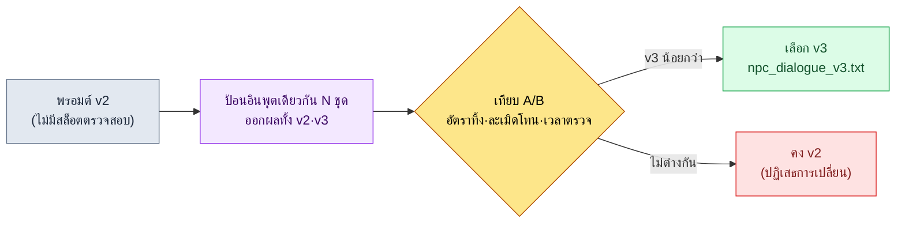

# 22.1 วิศวกรรมพรอมต์ — ใบสั่งงานหนึ่งหน้าของนักออกแบบเกม

> ผู้อ่านกลุ่มแรก: นักออกแบบเกม (Game Designer) ที่ดึง LLM มาใช้ในงานจริง (ทีมขนาดกลาง 10–50 คน)
> ฉบับย่อสำหรับผู้อ่านคนเดียว/มือสมัครเล่น: §22.1.7 「ถ้าทำคนเดียว แค่นี้ก็พอ」

เคยพิมพ์ว่า "ช่วยสร้างบทพูดของ NPC ตัวนี้ 5 บรรทัด" เพียงเพื่อจะได้บทพูด NPC สามบรรทัด สิ่งที่ได้กลับมาคือบทพูดห้าบรรทัดที่เอาไปแปะกับเกมแฟนตาซีเกมไหนก็ไม่เคอะเขิน — และเพราะอย่างนั้นมันจึงไม่เข้ากับเกมของเราที่ตรงไหนเลย โทนของมันว่างเปล่า มันไม่รู้ว่า NPC ตัวนี้เป็นใคร และมันไม่เชื่อมต่อกับบทพูดข้างเคียง แต่ละบรรทัดถูกต้องตามไวยากรณ์ไม่มีที่ติ ปัญหาคือการรับห้าบรรทัดนั้นมาตรวจสอบใช้เวลามากกว่าการที่ผมเขียนเองตั้งแต่ต้นเสียอีก

บทนี้ว่าด้วยวิธีเปลี่ยนคำสั่งบรรทัดเดียวนั้นให้กลายเป็น **ใบสั่งงานหนึ่งหน้า** ทฤษฎีพรอมต์โดยทั่วไปมีอยู่เพียงพอแล้วในหนังสือเล่มอื่น ที่นี่ผมจะแสดงสี่สิ่งที่นักออกแบบเกมต้องถือไว้ในมือเมื่อนั่งลงต่อหน้า LLM — บริบท รูปแบบผลลัพธ์ การกันอาการหลอน และการขอตรวจสอบ — ไม่ใช่ในรูปท่อนนามธรรม แต่ผ่าน **พรอมต์ npc_dialogue หนึ่งหน้าที่รันจริง** ผมจะตามไปจนจบหนึ่งรอบว่าใส่อะไรลงในพรอมต์นั้น ได้อะไรออกมา และปฏิเสธอะไรไป

---

## 22.1.1 พรอมต์คือใบสั่งงาน — หลักสี่ข้ออยู่ครบในหน้าเดียว

ใบสั่งงานที่ดีไม่ใช่ใบสั่งงานที่สั้น เหมือนเวลามอบงานให้คนใหม่แล้วบอกว่า "ทำให้ดี ๆ หน่อยนะ" ก็จะได้ผลลัพธ์ที่ต่างกันทุกครั้ง การบอก LLM ว่า "ช่วยสร้างบทพูดให้หน่อย" ก็จะได้ค่าเฉลี่ยของเกม RPG ทั่วไปทุกครั้ง โมเดลเดียวกันแต่ถ้าใบสั่งงานต่างกัน ผลลัพธ์ก็แตกต่าง — การที่คุณภาพผลลัพธ์ต่างกันหลายเท่าเป็นความเชื่อทั่วไปในวงการ และหนังสือเล่มนี้จะไม่สัญญาตัวคูณนั้นเป็นตัวเลข แต่ทิศทางนั้นชัดเจน พรอมต์ที่ใส่บริบทและข้อจำกัดลงไปจะให้ผลลัพธ์ที่มีภาระการตรวจสอบน้อยกว่าคำสั่งบรรทัดเดียวเปล่า ๆ

สี่สิ่งที่พรอมต์ของนักออกแบบเกมต้องตอบสนองพร้อมกันมีดังนี้

| หลักการ | นิยามหนึ่งบรรทัด | ถ้าไม่ทำตาม |
|---|---|---|
| ① บริบท | ให้สิ่งที่จะใช้อ้างอิงเพื่อตอบ (วิสัยทัศน์·voice·บทพูดข้างเคียง) | ได้ค่าเฉลี่ยแฟนตาซีทั่วไป |
| ② รูปแบบผลลัพธ์ | ตรึงจำนวน·ความยาว·ป้ายกำกับ·สิ่งต้องห้ามไว้แน่น | การตรวจสอบบานปลายเป็นการตีความเรียงความอิสระ |
| ③ การกันอาการหลอน | ระบุชัดว่า "ห้ามสร้างนอกเหนือจากข้อมูลที่ให้มา" | กุการตั้งค่าที่ไม่มีอยู่ขึ้นมา |
| ④ การขอตรวจสอบ | ให้ตัวมันเองแสดงว่าผลลัพธ์ตรงตามเกณฑ์ใด | ไม่มีหลักฐานให้ผ่านด่านตรวจสอบ |

ถ้าท่องสี่บรรทัดนี้แยกกัน มักจะตกหล่นไปหนึ่งหรือสองข้อเสมอ ดังนั้นวิธีของบทนี้คือ **วางหลักทั้งสี่ข้อเป็นสล็อตไว้ในพรอมต์หน้าเดียว** ถ้าสล็อตว่างก็จะเห็นได้ทันทีว่าตกหลักข้อนั้นไป หัวข้อถัดไปจะดูพรอมต์หน้านั้นทั้งหน้า

---

## 22.1.2 [บันทึกเซสชันจริง (worked transcript)] พรอมต์ npc_dialogue หนึ่งหน้า

ผมจะคัดลอก `prompts/narrative/npc_dialogue_v3.txt` ที่ใช้งานจริงในโปรเจกต์ของผู้เขียน (MMORPG ที่เน้นมือถือเป็นหลัก ต่อไปจะเรียกว่า "โปรเจกต์ A") มาตามเดิม โดยทำให้เป็นนิรนาม ชื่อเมือง·ชื่อ NPC และชื่อเฉพาะของบริษัทถูกแทนที่สำหรับหนังสือ และผลลัพธ์เป็นการเรียบเรียงใหม่จากเซสชันจริง พรอมต์ที่ป้อนเข้าอยู่ในรูปแบบที่คัดลอกไปใช้ได้ทันที

### ขั้นที่ 1 — ป้อนบริบท: เริ่มจากบอกว่า NPC ตัวนี้เป็นใคร

ก่อนอื่นเติมข้อมูลที่พรอมต์จะอ้างอิงลงในสล็อต ทั้งสามไม่ใช่การเขียนขึ้นใหม่ แต่ดึงออกมาจากสินทรัพย์ที่มีอยู่แล้ว

```yaml
# อินพุตสล็อต (แปะไว้เหนือเนื้อหาพรอมต์)
L0_วิสัยทัศน์:        # การแคช — ไม่ส่งซ้ำทุกครั้งที่เรียก
  world_premise:  "สหพันธ์นครรัฐของเหล่านักปราชญ์ที่ผนึกพลังเวทกำลังเย็นลง"
  tone_manifesto: "ระงับความรู้สึกอ่อนไหว ตัวละครไม่อธิบายอารมณ์ แต่เผยออกมาผ่านการกระทำ·วัตถุ"
voice_profile:    # ตัวตนของ NPC ตัวนี้ (5 รายการ)
  id: npc_doren_vale
  ช่วงอายุ: "วัย 50"
  นิสัยการพูด: "พูดด้วยตัวเลขเท่านั้น แทบไม่ใช้คำคุณศัพท์"
  ความรู้โลกในเกม: "บันทึกแรงสั่นสะเทือนละเอียดของเส้นผนึกมา 30 ปี ไม่รู้สถานการณ์ภายนอกกิลด์นักปราชญ์"
  สิ่งต้องห้าม:  "ห้ามใช้คำศัพท์เชิงไสยศาสตร์ เช่น คำพยากรณ์·โชคชะตา·เทพเจ้า (โทนเมืองคือ scholarly_strict)"
  ความสัมพันธ์:  "ปฏิบัติต่อผู้เล่นในฐานะ 'ตัวแปรภายนอกที่เป็นวัตถุสังเกตการณ์' ทั้งความระแวงและความเป็นมิตรต่างก็อ่อน"
บทพูดข้างเคียง:        # บริบทก่อนหน้า — บรรทัดที่ออกมาแล้วในซีนเดียวกัน
  - (ผู้เล่น) "ไฟบนหอระฆังติดอยู่ทั้งคืนเลย เกิดอะไรขึ้นหรือ"
```

ตรงนี้ 5 รายการของ `voice_profile` คือหัวใจของหลักการ ① อายุ·นิสัยการพูด·ขอบเขตความรู้·สิ่งต้องห้าม·ความสัมพันธ์ — ห้าข้อนี้ทำให้ "โดเรน เวล" แตกต่างจาก NPC ตัวอื่น โดยเฉพาะ **ขอบเขตของความรู้โลกในเกม** (ไม่รู้สถานการณ์ภายนอกกิลด์) คืองานเตรียมการล่วงหน้าของหลักการ ③ การกันอาการหลอน ต้องระบุสิ่งที่มันไม่รู้ไว้ AI จึงจะไม่ออกไปนอกขอบเขตนั้น

### ขั้นที่ 2 — เนื้อหาพรอมต์: ตรึงรูปแบบ·อาการหลอน·การตรวจสอบไว้แน่นในหน้าเดียว

```
[L0 컨텍스트] world_premise + tone_manifesto                    (แคชไว้)
[voice_profile] npc_doren_vale 5 รายการ (yaml ด้านบน)
[인접 대사] คำถามก่อนหน้าของผู้เล่น 1 บรรทัด

ดูข้อมูลข้างต้นแล้วเขียนบทพูดที่ doren_vale ตอบคำถามของผู้เล่นให้หน่อย

[출력 형식 — 원칙 ②] พอดี 3 บรรทัด หนึ่งบรรทัดต่อหนึ่งประโยค แต่ละบรรทัดไม่เกิน 40 ตัวอักษร ท้ายบรรทัดติดป้ายอารมณ์หนึ่งในสาม (เฉยเมย|ระแวง|เย้ยหยัน) ตัดคำอธิบายอื่น·เครื่องหมายคำพูดออก

[환각 차단 — 원칙 ③] เขียนเฉพาะสิ่งที่มีอยู่ในข้อมูลข้างต้น อย่ากุข้อเท็จจริงเกี่ยวกับผนึก·หอระฆังขึ้นมาใหม่ ถ้าต้องการสิ่งที่ไม่มีในข้อมูล ให้เขียนบรรทัดนั้นว่า '[ไม่มีข้อมูล: ต้องการอะไร]' ห้ามใช้คำศัพท์อย่างคำพยากรณ์·โชคชะตา·เทพเจ้า

[검증 요청 — 원칙 ④] ใต้บทพูด ให้เขียนว่าแต่ละข้อใน voice_profile ทั้ง 5 ข้อ ตรงตาม/ละเมิด บรรทัดละข้อ และบรรทัดที่ไม่มั่นใจให้ติด ★ พร้อมเหตุผลหนึ่งบรรทัด
```

ขอให้สังเกตว่าหลักทั้งสี่ข้ออยู่ครบในหน้าเดียวนี้ สล็อตด้านบนคือ ① บล็อก `[출력 형식]` คือ ② บล็อก `[환각 차단]` คือ ③ และบล็อก `[검증 요청]` คือ ④ มากกว่าครึ่งหนึ่งของพรอมต์ไม่ใช่ "เขียนอะไร" แต่เป็นข้อจำกัดว่า "เขียนอย่างไร อะไรที่ต้องไม่เขียน และตรวจสอบตัวเองอย่างไร" เพราะถ้าให้อิสระก็จะได้ค่าเฉลี่ย งานจึงคือการตัดทอนอิสระลง

### ขั้นที่ 3 — ผลลัพธ์ของ Claude (เรียบเรียงใหม่จากเซสชันจริง, ดิบ)

```
เส้นผนึกกำลังเย็นลง 12.4 เมื่อวานคือ 12.1 (เฉยเมย)
ไม่ใช่เรื่องดี แต่งานของข้าคือการบันทึกเท่านั้น (เย้ยหยัน)
เหตุใดเจ้าจึงถาม ไม่ใช่สิ่งที่ข้าสังเกตการณ์ (ระแวง)

[검증 — voice_profile 5 ข้อ]
- ช่วงอายุ (วัย 50): ตรงตาม น้ำเสียงสำรวมของนักปราชญ์สูงวัย
- นิสัยการพูด (ตัวเลขเท่านั้น): ตรงตาม บรรทัดที่ 1 มีตัวเลข 2 ตัว แต่บรรทัดที่ 2·3 ไม่มีตัวเลข ★
- ความรู้โลกในเกม (ไม่รู้ภายนอกกิลด์): ตรงตาม ไม่มีการพูดถึงสถานการณ์ภายนอก
- สิ่งต้องห้าม (ห้ามไสยศาสตร์): ตรงตาม คำว่าคำพยากรณ์·โชคชะตา·เทพเจ้า 0 ครั้ง
- ความสัมพันธ์ (ปฏิบัติเป็นตัวแปรภายนอก): ตรงตาม บรรทัดที่ 3 ผลักผู้เล่นออกไปนอกขอบเขตการสังเกตการณ์

★ ข้อควรระวัง: ถ้าตีความรายการนิสัยการพูดว่า 'พูดด้วยตัวเลขเท่านั้น' อย่างเคร่งครัด
   บรรทัดที่ 2·3 อาจถือว่าละเมิด การจะบังคับให้ทุกบรรทัดมีตัวเลขหรือไม่ ต้องอาศัยวิจารณญาณของคน
```

ส่วนที่มีค่าที่สุดในผลลัพธ์นี้ไม่ใช่บทพูดสามบรรทัด แต่เป็น **★ หนึ่งบรรทัดที่อยู่ล่างสุด** AI รายงานจุดที่กำกวมในผลลัพธ์ของตัวเองด้วยตัวเอง แล้วส่งต่อให้คน พรอมต์ที่ดีทำให้ AI สามารถพูดได้ว่า "ส่วนนี้ผมไม่มั่นใจ" — เป็นผลโดยตรงของการใส่หลักการ ④

### ขั้นที่ 4 — การตรวจสอบและการปฏิเสธ (ที่ของคน)

เราไม่รับผลลัพธ์มาดื้อ ๆ คนเป็นผู้ตัดสิน ★ ที่ AI ยกขึ้นมา ในเซสชันนี้มีอยู่หนึ่งบรรทัดที่สะดุดจริง ๆ

คำว่า *"ดี"* ในบรรทัดที่ 2 "ไม่ใช่เรื่องดี" ขัดกับนิสัยการพูดใน voice_profile ("แทบไม่ใช้คำคุณศัพท์") นั่นคือจุดที่ AI รายงานด้วย ★ โดเรน เวล เป็นตัวละครที่พูดด้วยตัวเลขแทนคำคุณศัพท์เชิงตัดสินคุณค่า แต่ "ไม่ใช่เรื่องดี" ไหลไปเป็นน้ำเสียงของ NPC คนแก่ทั่วไป เป็นบรรทัดที่ทำให้โทนพร่ามัว

จึงขอใหม่

```
บรรทัดที่ 2 "ไม่ใช่เรื่องดี" ใช้คำคุณศัพท์ ('ดี') จึงละเมิดนิสัยการพูดใน voice_profile
เขียนเฉพาะบรรทัดนี้ใหม่ด้วยตัวเลขหรือคำศัพท์เชิงสังเกตการณ์ บรรทัดที่ 1·3 คงไว้
กฎรูปแบบ·อาการหลอน·การตรวจสอบ ใช้ตามเดิม
```

AI ตอบบรรทัดที่ 2 ใหม่เป็น **"เมื่อสามปีก่อนคือ 9.0 นี่คือคำตอบ (เฉยเมย)"** เผยวิกฤตผ่านการเปลี่ยนแปลงของตัวเลขโดยไม่ใช้คำคุณศัพท์ และผ่าน voice_profile ทั้ง 5 ข้ออีกครั้ง ปิดจบในการไป-กลับเพียงครั้งเดียว เมื่อเทียบระหว่างการเขียนบทพูดสามบรรทัดที่ปรับโทนด้วยมือตั้งแต่ต้น กับ พรอมต์หนึ่งหน้าที่เติมสล็อต + ตรวจ ★ + ไป-กลับ 1 ครั้ง — ข้อสรุปของเซสชันนี้คือ อย่างหลังมีภาระการตรวจสอบน้อยกว่า (อิงประสบการณ์ของผู้เขียน เวลาสัมบูรณ์ขึ้นกับความยากของโทน NPC จึงควรอ่านเป็นทิศทาง)

---

## 22.1.3 โครงสร้าง 4 ชั้น — จะวางพรอมต์หนึ่งหน้าซ้อนกันอย่างไร

ถ้าบันทึกไว้เป็นหน้าเดียวว่าทำไมพรอมต์ข้างต้นจึงซ้อนกันตามลำดับนั้น จากพรอมต์ครั้งถัดไปก็จะสร้างได้เหมือนเติมช่องว่างในสล็อต บริบทซ้อนจากล่างขึ้นบน เริ่มจากของหนัก (แทบไม่เปลี่ยน) ไปหาของเบา (เปลี่ยนทุกครั้ง) ชั้นที่ไม่เปลี่ยนจะถูกแคชเพื่อประหยัดต้นทุน (§22.1.5)

<svg viewBox="0 0 560 360" xmlns="http://www.w3.org/2000/svg" role="img" aria-label="โครงสร้าง 4 ชั้นของพรอมต์นักออกแบบเกม">
  <rect x="0" y="0" width="560" height="360" fill="#0f1117"/>
  <!-- L0 -->
  <rect x="40" y="40" width="480" height="56" rx="6" fill="#1e3a5f" stroke="#3b82f6" stroke-width="1.5"/>
  <text x="56" y="64" fill="#bfdbfe" font-family="sans-serif" font-size="14" font-weight="bold">L0  วิสัยทัศน์ · โทน (world_premise · tone_manifesto)</text>
  <text x="56" y="84" fill="#93c5fd" font-family="sans-serif" font-size="11">แทบไม่เปลี่ยน → แคช รากฐานของหลักการ ① บริบท</text>
  <!-- L1 -->
  <rect x="40" y="106" width="480" height="56" rx="6" fill="#14532d" stroke="#22c55e" stroke-width="1.5"/>
  <text x="56" y="130" fill="#bbf7d0" font-family="sans-serif" font-size="14" font-weight="bold">L1  voice_profile · กฎการตั้งชื่อ · lore ของภูมิภาค</text>
  <text x="56" y="150" fill="#86efac" font-family="sans-serif" font-size="11">5 รายการที่แยก NPC นี้ + ระบุขอบเขตที่ไม่รู้ → งานเตรียมการของหลักการ ③</text>
  <!-- L2 -->
  <rect x="40" y="172" width="480" height="56" rx="6" fill="#854d0e" stroke="#f59e0b" stroke-width="1.5"/>
  <text x="56" y="196" fill="#fde68a" font-family="sans-serif" font-size="14" font-weight="bold">L2  บทพูดข้างเคียง · forbidden_names</text>
  <text x="56" y="216" fill="#fcd34d" font-family="sans-serif" font-size="11">บรรทัดก่อนหน้าในซีน·ชื่อต้องห้ามซ้ำ → ให้เชื่อมกับบทพูดข้างเคียง</text>
  <!-- L3 -->
  <rect x="40" y="238" width="480" height="82" rx="6" fill="#7f1d1d" stroke="#ef4444" stroke-width="1.5"/>
  <text x="56" y="262" fill="#fecaca" font-family="sans-serif" font-size="14" font-weight="bold">L3  คำสั่งงาน (เปลี่ยนทุกครั้ง)</text>
  <text x="56" y="282" fill="#fca5a5" font-family="sans-serif" font-size="11">[รูปแบบผลลัพธ์]②  ·  [กันอาการหลอน]③  ·  [ขอตรวจสอบ]④</text>
  <text x="56" y="302" fill="#fca5a5" font-family="sans-serif" font-size="11">"พอดี 3 บรรทัด · 40 ตัวอักษร · ป้าย (อารมณ์) · ห้ามนอกข้อมูล · ตรวจตัวเอง 5 ข้อ"</text>
  <!-- 화살표 라벨 -->
  <text x="280" y="350" fill="#9ca3af" font-family="sans-serif" font-size="11" text-anchor="middle">ซ้อนจากล่าง (หนัก·แคช) → ขึ้นบน (เบา·เปลี่ยนทุกครั้ง)</text>
</svg>

หน้าเดียวใน §22.1.2 คือภาพนี้ทุกประการ L0·L1 ดึงมาจากข้อมูลแล้วแปะลงสล็อต (รากฐานของหลักการ ①·③) และ L3 ใส่สามบล็อกคือรูปแบบ·อาการหลอน·การตรวจสอบ (หลักการ ②·③·④) เมื่อรับบทพูด NPC ตัวถัดไป สิ่งที่เปลี่ยนคือ voice_profile ใน L1 และบทพูดข้างเคียงใน L2 เท่านั้น โครง L0 และ L3 นำกลับมาใช้ซ้ำ — ด้วยเหตุนี้พรอมต์จึงกลายเป็น "ไลบรารี"

---

## 22.1.4 พรอมต์ในฐานะสินทรัพย์ — ไลบรารีและการจัดการเวอร์ชัน

พรอมต์ npc_dialogue ข้างต้นไม่ใช่ของที่ใช้ครั้งเดียวแล้วทิ้ง แต่เก็บไว้ในไฟล์แยกตามสาขา·ตามงาน แล้วเรียกใช้แทนการเขียนใหม่ทุกครั้ง โฟลเดอร์พรอมต์ของโปรเจกต์ A หน้าตาแบบนี้

```
prompts/
├── narrative/
│   ├── npc_dialogue_v3.txt        # ← §22.1.2 คือไฟล์นี้
│   ├── quest_synopsis_v2.txt
│   └── consistency_check_v1.txt
├── balance/
│   ├── change_proposal_v2.txt
│   └── outlier_analysis_v1.txt
├── content/
│   ├── city_npc_batch_v2.txt
│   └── side_quest_v3.txt
└── meta/
    ├── meeting_summary_v2.txt
    └── decision_card_v1.txt
```

`_v3` ที่ท้ายชื่อไฟล์คือหัวใจ พรอมต์ไม่ใช่ของที่สร้างครั้งเดียวแล้วจบ แต่เป็น **สินทรัพย์ที่ใกล้เคียงกับการตัดสินใจ** ดังนั้นทุกครั้งที่เปลี่ยน จึงวัดการเปลี่ยนแปลงของผลลัพธ์แล้วยกเวอร์ชันขึ้น เส้นทางที่ npc_dialogue มาถึง v3 ก็เป็นเช่นนั้น



การเปลี่ยนแปลงจริงที่ยกจาก v2 เป็น v3 คือบล็อก `[검증 요청]` ใน §22.1.2 ใน v2 ไม่มีสล็อตให้ AI ตรวจสอบผลลัพธ์ของตัวเองทีละรายการแล้วติด ★ พอใส่บล็อกนั้นเข้าไป AI ก็เริ่มรายงานบรรทัดที่กำกวมก่อนเหมือนในขั้นที่ 4 ของ §22.1.2 และภาระที่คนต้องอ่านทั้งหมดตั้งแต่ต้นเพื่อจับก็ลดลง เราไม่ยกเวอร์ชันด้วย "รู้สึกว่าดีขึ้น" โดยไม่วัด แต่จะวางผลลัพธ์ v2·v3 เคียงกันด้วยชุดอินพุตเดียวกัน แล้วตรวจว่าจำนวนการละเมิดโทนและเวลาตรวจสอบลดลงจริงหรือไม่ก่อนจึงเลือกใช้

ผลที่ใหญ่ที่สุดที่ไลบรารีให้คือสมาชิกใหม่ วันแรกที่เข้าทำงาน ถ้าเรียก npc_dialogue_v3.txt ก็จะได้ใช้โครงสร้างสล็อต 4 ชั้นที่รุ่นพี่ปรับมาแล้วหลายสิบรอบตั้งแต่เริ่มต้น ก่อนจะซึมซับ "วิธีเขียนพรอมต์ให้ดี" ด้วยตัวเอง เขาก็มีพรอมต์หนึ่งหน้าที่เขียนมาดีแล้วอยู่ในมือ

---

## 22.1.5 วิธีจัดการต้นทุนอย่างซื่อตรง — การแคชและ cap

เมื่อพรอมต์ยาวขึ้น ต้นทุนโทเค็นก็ตามมา บทนี้จะไม่เขียนตัวคูณที่ยังไม่ผ่านการตรวจสอบอย่าง "ทำให้เป็นมาตรฐานแล้วต้นทุน ×2 หายไป" แต่จะพูดเฉพาะสิ่งที่วัดได้จริงเท่านั้น

กลไกเชิงโครงสร้างที่จัดการต้นทุนมีอยู่สองอย่าง อย่างแรก **เหตุผลที่ §22.1.3 วาง L0·L1 ไว้ด้านล่างก็คือการแคช** ถ้าแคชชั้นวิสัยทัศน์·โทนที่แทบไม่เปลี่ยนไว้ ก็จะไม่ส่งและไม่คิดเงินชั้นนั้นซ้ำในทุกการเรียก เมื่อสร้างบทพูด NPC 100 ครั้ง ความต่างระหว่างการส่ง L0 ซ้ำ 100 ครั้งกับการแคชเพียงครั้งเดียวจะถ่างออกเรื่อย ๆ เมื่อจำนวนการเรียกสะสมขึ้น อย่างที่สอง **ตั้ง cap โทเค็นต่อการเรียก** เพื่อไม่ยัดงานมากเกินไปลงในพรอมต์เดียว

สิ่งสำคัญตรงนี้คือ ที่ที่ต้นทุนถูกวัดมีอยู่จริง ในระบบ atom ของโปรเจกต์ A มี `_economy_log/` (ล็อกความคุ้มค่าเชิงโทเค็น·เวลา) และ `_roi_report.md` (รายงาน ROI (Return on Investment, ผลตอบแทนต่อการลงทุน)) ดำรงอยู่ในฐานะเมตาข้อมูลของการดำเนินงาน ผลของการทำพรอมต์ให้เป็นมาตรฐานคือการติดตามด้วยค่าที่วัดจริงจากล็อกนี้ ไม่ใช่การเขียนตัวเลขที่ดูน่าเชื่อลงในตารางของเนื้อหาแล้วอ้าง หลักการของหนังสือเล่มนี้มีอยู่สามข้อ

- **มาตรฐานสาธารณะ ให้อ้างอิงตามเดิม** (บทนี้มีรายการเช่นนี้น้อย — รูปแบบพรอมต์มีตัวเลขที่ได้รับการรับรองน้อย)
- **การประมาณของผู้เขียน เขียนว่าเป็นการประมาณ** ทิศทางที่ว่า "ภาระการตรวจสอบลดลง" เป็นการประมาณอิงประสบการณ์ และไม่สัญญาตัวคูณสัมบูรณ์
- **เฉพาะสิ่งที่วัดได้เท่านั้น จึงสัญญาเป็น KPI** สิ่งที่ถูกวัดจริงในการดำเนินงานพรอมต์คือ จำนวนการละเมิดโทน·อัตราการทิ้ง·โทเค็นต่อการเรียก (ก่อน-หลังใช้แคช)·เวลาตรวจสอบ ทั้งสี่นี้ออกมาเป็นตัวเลขใน `_economy_log`

---

## 22.1.6 ความล้มเหลวที่พบบ่อย

| รูปแบบ | ทำไมจึงล้มเหลว | วิธีรักษา |
|---|---|---|
| คำสั่งบรรทัดเดียว "ช่วยสร้างบทพูด 5 บรรทัด" | บริบท 0 → ค่าเฉลี่ย RPG ทั่วไป | พรอมต์สล็อต 4 ชั้นของ §22.1.2 |
| ไม่เขียน 'ขอบเขตที่ไม่รู้' ลงใน voice_profile | AI กุการตั้งค่านอกข้อมูลขึ้นมา | ระบุข้อจำกัดในสล็อตความรู้โลกในเกม (หลักการ ③) |
| รับแค่ผลลัพธ์โดยไม่มีสล็อตตรวจสอบ | คนต้องอ่านทั้งหมดตั้งแต่ต้น | ตรวจตัวเอง + ★ ด้วยบล็อก `[검증 요청]` (หลักการ ④) |
| เขียนพรอมต์ใหม่ทุกครั้ง | ปั้นโนว์ฮาวเดิมจากศูนย์ซ้ำ ๆ | ไลบรารี `prompts/` + เวอร์ชัน |
| เลือกใช้การเปลี่ยนพรอมต์ด้วยความรู้สึก | ตรวจไม่ได้ว่าดีขึ้นหรือไม่ | วัด A/B ด้วยอินพุตเดียวกันก่อนยกเวอร์ชัน |
| ส่งบริบทยาวซ้ำทุกการเรียก | ต้นทุนโทเค็นสะสมตามจำนวนการเรียก | แคช L0·L1 + cap ต่อการเรียก |

ข้อที่หกถูกพบช้าที่สุด ต้นทุนไม่เจ็บเมื่อเรียกครั้งเดียว แต่เผยออกมาใน `_economy_log` หลังจากการผลิตจำนวนมากสะสมขึ้น

---

> **การประยุกต์นอกเกม** การที่คำสั่งบรรทัดเดียวเรียกผลลัพธ์ค่าเฉลี่ยที่ "เอาไปแปะที่ไหนก็ไม่เคอะเขิน และเพราะอย่างนั้นจึงไม่เข้ากับงานของผม" ขึ้นมานั้น ไม่ใช่ปัญหาเฉพาะของบทพูดในเกม พรอมต์คือใบสั่งงานที่มอบงานให้คนใหม่ ดังนั้นถ้าวางสี่สิ่ง — จะใช้อะไรอ้างอิงเพื่อตอบ (บริบท)·จำนวน·ความยาว·สิ่งต้องห้าม (รูปแบบผลลัพธ์)·"อย่ากุสิ่งนอกข้อมูลขึ้นมา" (การกันอาการหลอน)·"แสดงด้วยตัวเองว่าตรงตามเกณฑ์ใด" (การขอตรวจสอบ) — ไว้ในหน้าเดียว ก็จะได้ผลลัพธ์ที่มีภาระการตรวจสอบน้อย ตัวอย่างเช่น เมื่อเจ้าหน้าที่ฝ่ายบุคคลรับร่างประกาศรับสมัครงาน ถ้าระบุชัดว่า "ให้เขียนเฉพาะรายการที่มีอยู่ในข้อมูลข้อกำหนดของตำแหน่ง ส่วนสวัสดิการ·เงินเดือนที่ไม่มีในข้อมูล อย่ากุขึ้นมา แต่ให้ใส่ว่า [ต้องยืนยัน]" ก็จะกันอุบัติเหตุที่เงื่อนไขซึ่งถูกกุขึ้นอย่างน่าเชื่อรั่วไหลเข้าไปในประกาศได้ ถ้าเก็บใบสั่งงานหนึ่งหน้าของงานที่ทำบ่อยไว้เป็นไฟล์ นั่นก็จะกลายเป็นเส้นเริ่มต้นของเพื่อนร่วมงานทันที

## 22.1.7 ลองทำดู — หนึ่งขั้นที่ทำได้วันนี้

> **ถ้าทำคนเดียว แค่นี้ก็พอ**: ไม่ต้องมีทั้งไลบรารีและการแคช เลือก NPC หนึ่งตัวจากเกมของคุณ (หรือเกมที่คุณชอบ) แล้วเขียน 5 รายการของ voice_profile ในขั้นที่ 1 ของ §22.1.2 (อายุ·นิสัยการพูด·ขอบเขตที่รู้·สิ่งต้องห้าม·ความสัมพันธ์) ด้วยมือ จากนั้นแปะเนื้อหาพรอมต์ในขั้นที่ 2 ตามเดิมแล้วลองรันหนึ่งครั้ง ลองเลือกบรรทัดที่ขัดกับ voice_profile หนึ่งบรรทัดจากสามบรรทัดที่ได้มาด้วยตัวเอง แล้วแย้งกลับว่า "บรรทัดนี้ละเมิดรายการนิสัยการพูด เขียนเฉพาะบรรทัดนั้นใหม่" คุณก็จะเข้าใจด้วยตัวเองว่าทั้งสี่สล็อตของพรอมต์แต่ละอันทำหน้าที่อะไร

ถ้าทำเป็นทีม ให้เริ่มจากหนึ่งขั้นถัดไปนี้ เลือกงานที่ทำบ่อยหนึ่งอย่าง (เช่น บทพูด NPC) แล้ววางพรอมต์หนึ่งหน้ารูปแบบ §22.1.2 ลงเป็นไฟล์ใน `prompts/narrative/` เริ่มจากตรวจว่าใส่สี่บล็อก (สล็อต·รูปแบบ·อาการหลอน·การตรวจสอบ) ครบแล้วหรือไม่ ไฟล์เดียวนั้นก็จะกลายเป็นเส้นเริ่มต้นของสมาชิกใหม่ในทีมทันที การจัดการเวอร์ชันและการแคชค่อยมาทีหลัง

**เส้นทางขั้นต่ำผ่านแชตบอตเว็บ (โดยไม่ต้องใช้เทอร์มินัล)** — หลักสี่ข้อของบทนี้ทำงานได้เหมือนเดิมด้วยช่องป้อนของแชตบอตเว็บ (ChatGPT หรือ Claude เว็บ) ช่องเดียว โดยไม่ต้องมีไฟล์·ไลบรารี·การแคช เพราะวิศวกรรมพรอมต์ไม่ใช่เรื่องของเครื่องมือ แต่เป็นเรื่องของ "ใส่อะไรลงในหน้าเดียว" สองขั้นด้านล่างคือเส้นทางหลัก
1. เลือกงานของคุณหนึ่งงาน แล้วเขียนห้ารายการในขั้นที่ 1 ของ §22.1.2 (อายุ·นิสัยการพูด·ขอบเขตที่รู้·สิ่งต้องห้าม·ความสัมพันธ์ ถ้าเป็นนอกเกมให้อ่านเปลี่ยนเป็น 'เป้าหมาย·น้ำเสียง·ขอบเขตหลักฐาน·สิ่งต้องห้าม·ความสัมพันธ์') ด้วยมือ ไม่ต้องมีทั้ง YAML และไฟล์ เขียนเป็นข้อความลงในช่องป้อนของแชตบอตก็ได้
2. ใต้นั้นให้แปะเนื้อหาพรอมต์ในขั้นที่ 2 ของ §22.1.2 ตามเดิม โดยตรวจเพียงว่าใส่สี่บล็อกครบหรือไม่ — `[출력 형식]` (จำนวน·ความยาว·ป้าย·สิ่งต้องห้าม)·`[환각 차단]` ("อย่ากุสิ่งนอกข้อมูลขึ้นมา ถ้าจำเป็นให้ใส่ [ไม่มีข้อมูล]")·`[검증 요청]` ("เขียนตรงตาม/ละเมิดทีละรายการ ถ้าไม่มั่นใจให้ติด ★") หลังจากรันแล้ว คนตัดสินเฉพาะบรรทัดที่ติด ★ แล้วแย้งกลับหนึ่งครั้งก็ปิดจบหนึ่งรอบ ไลบรารี·เวอร์ชัน·การแคชค่อยนำมาใช้เมื่อต้องใช้พรอมต์เดิมซ้ำ ๆ จึงค่อยเริ่ม

---

## 22.1.8 ตัวอย่างบทถัดไป

22.2 จะว่าด้วยอาการหลอนและความปลอดภัย ถ้าหลักการ ③ ของบทนี้ (สล็อตการกันอาการหลอน) คือแนวป้องกันด่านแรกภายในพรอมต์หนึ่งหน้า 22.2 จะดูแนวป้องกันหลายชั้นที่จับอาการหลอนซึ่งทะลุแนวป้องกันนั้นออกมาในระดับการดำเนินงาน

---

### สรุปประเด็นสำคัญของบท
- พรอมต์คือใบสั่งงาน — วางหลักสี่ข้อลงในสล็อตหน้าเดียว
- npc_dialogue หนึ่งหน้า: บริบท·รูปแบบ·การกันอาการหลอน·การตรวจสอบเป็น 4 ชั้น
- ต้นทุน·ผลลัพธ์ใช้ค่าที่วัดจริงจาก `_economy_log` ไม่ใช้ตัวคูณที่ปรุงแต่ง

### ตัวอย่างบทถัดไป
- 22.2 ความปลอดภัยของ AI·อาการหลอน (hallucination) — แนวป้องกันหลายชั้นของอาการหลอนที่ทะลุพรอมต์ออกมา
