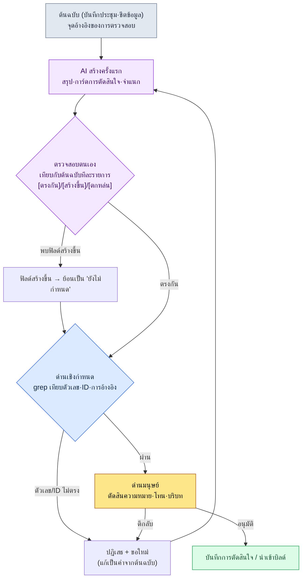

# 22.2 เพื่อนร่วมงานที่พูดเท็จอย่างมั่นใจ — สกัดอาการหลอนด้วย verification gate

> ผู้อ่านหลัก: นักออกแบบเกม (Game Designer) ที่ใช้ AI ผลิตเอกสาร ข้อมูล และบันทึกการตัดสินใจจำนวนมาก (ทีมขนาดกลาง 10–50 คน)
> ฉบับย่อสำหรับผู้อ่านที่ทำคนเดียว/เป็นงานอดิเรก: §22.2.7 「ถ้าทำคนเดียว เท่านี้ก็พอ」

เรื่องนี้เกิดในวันที่ผู้เขียนให้ AI สรุปบันทึกการประชุม 17 ฉบับแล้วจัดเป็นการ์ดการตัดสินใจ (decision card) ผลลัพธ์ออกมาเรียบร้อย ทั้ง ID ของการตัดสินใจ วันที่ประชุมที่อ้างอิง ไปจนถึงเหตุผลบรรทัดเดียว ฟอร์แมตสมบูรณ์ไร้ที่ติ ในการ์ดใบหนึ่งเขียนว่า "ที่ประชุม Combat TF วันที่ 2026-04-18 มีมติยืนยันนโยบายคูลดาวน์" ปัญหาคือวันนั้นไม่มีการประชุม Combat TF เลย AI กลับเอาวาระและวันที่ของการประชุมอื่นมาปะปนกัน แล้วกุการ์ดที่ดูน่าเชื่อขึ้นมาหนึ่งใบ และเพราะฟอร์แมตสมบูรณ์ การ์ดใบนั้นจึงเกือบหลุดเข้าไปอยู่ในบันทึกการตัดสินใจของทีมโดยตรง

นี่คืออาการหลอน (hallucination) ของ LLM ยิ่งไม่รู้ มันยิ่งตอบอย่างมั่นใจ ถ้าเทียบกับคน ก็เหมือนเพื่อนร่วมงานที่ในที่ประชุมพูดหนักแน่นว่า "อ๋อ เรื่องนั้นตัดสินกันไปแล้วแบบนั้น" แต่พอตรวจดูจริงกลับไม่เคยมีมติเช่นนั้น คำพูดประโยคเดียวนั้น เมื่อไหลเข้าไปอยู่ในชีตข้อมูล คำตอบ CS หรือสินทรัพย์ atom ก็กลายเป็นอุบัติเหตุ บทนี้ไม่ได้พูดถึงวิธีปิดปากเพื่อนร่วมงานคนนั้น — เพราะมันเป็นไปไม่ได้ — แต่พูดถึงวิธีตั้ง **verification gate (ด่านที่มนุษย์หรือเครื่องตรวจสอบผลลัพธ์) ที่คำพูดของมันต้องผ่านก่อนเสมอ** ทฤษฎีทั่วไปเรื่องอาการหลอนมีอยู่มากในหนังสือเล่มอื่นแล้ว บทนี้จึงโฟกัสเฉพาะ *จุดที่สกัดมันด้วยเวิร์กโฟลว์ AI* เท่านั้น

---

## 22.2.1 อาการหลอนไม่มีทางเป็นศูนย์ — จึงต้อง 'ตั้งด่าน'

ไม่มีพรอมต์ใดที่ทำให้อาการหลอนเป็นศูนย์ได้ โมเดลที่ใหญ่ขึ้นและพรอมต์ที่ดีขึ้นช่วยลดความถี่ลงได้ แต่ไม่ถึงศูนย์ จุดตั้งต้นของการดำเนินงานจึงไม่ใช่ "กำจัดอาการหลอน" แต่ต้องเป็น "ตั้งด่านดักก่อนที่อาการหลอนจะแตะการตัดสินใจหรือข้อมูล"

หลักการแกนกลางของด่านมีเพียงข้อเดียว **สิ่งที่ LLM กุขึ้นได้ (การอ้างอิง·ตัวเลข·ID) ให้ตรวจสอบจากที่อื่นที่ไม่ใช่ LLM** แหล่งตรวจสอบมีอยู่หนึ่งในสามอย่าง คือ โค้ด (เชิงกำหนด) เอกสารต้นฉบับ (grep) หรือสายตาของมนุษย์ การถาม LLM ซ้ำว่า "ช่วยตรวจดูหน่อยว่าถูกไหม" ก็เป็นขั้นหนึ่งของด่านได้ แต่เป็นเพียงตัวช่วย ไม่ใช่ผู้ตัดสินขั้นสุดท้าย

ตรงนี้ขอสรุปจุดที่นักออกแบบเกมสับสนบ่อยที่สุดก่อน พื้นที่ที่อาการหลอนเกิดง่ายกับพื้นที่ที่เกิดยากนั้นแตกต่างกันอย่างชัดเจน

| งาน | ความเสี่ยงหลอน | ทำไม | ด่าน |
|---|---|---|---|
| การคำนวณตัวเลข (รางวัล·ความน่าจะเป็น) | สูงมาก | LLM ประมาณการคิดเลข | คำนวณด้วยโค้ด ห้าม LLM ทำ |
| การอ้างอิง (การประชุม·ID การตัดสินใจ) | สูง | กุแหล่งที่ไม่มีให้ดูน่าเชื่อ | grep เทียบกับต้นฉบับ |
| การจำแนกประเภท (แท็ก·หมวดหมู่) | ปานกลาง | สับสนป้ายกำกับ | เทียบแบบเชิงกำหนดได้ |
| การสรุป·การอนุมาน | ปานกลาง | เพิ่มหรือลดรายการที่ไม่มี | ตรวจสอบตนเอง + ด่านมนุษย์ |
| การสร้างสรรค์ (flavor text) | ต่ำ | ไม่มีคำตอบถูก แนวคิด 'หลอน' จึงอ่อน | ด่านตรวจสอบโทน |

บรรทัดแรกคือใบสั่งยาที่ง่ายที่สุด **อย่าให้ LLM ทำตัวเลข** ส่งต่อให้เครื่องมือเชิงกำหนดเหมือนที่ปล่อยให้เครื่องคิดเลขทำการคูณ บรรทัดที่สอง (การอ้างอิง) คือกระดูกสันหลังของบทนี้ ในงานที่ *มีต้นฉบับอยู่แล้วแต่ให้ LLM เรียบเรียงใหม่* อย่างการสรุปบันทึกการประชุมหรือการ์ดการตัดสินใจ อาการหลอนอันตรายที่สุดและจับได้ดีที่สุด เพราะเมื่อมีต้นฉบับ ก็เทียบได้

---

## 22.2.2 [บันทึกเซสชันจริง (worked transcript)] จับอาการหลอนของบทสรุปบันทึกการประชุมด้วยการตรวจสอบตนเอง

ถ้าเขียนแค่ลอย ๆ ว่า "ตรวจสอบ" ก็ไม่รู้ว่าจะทำอะไรอย่างไร เราจะดูหนึ่งรอบเต็มตั้งแต่ป้อนข้อมูลจนถึงการขอใหม่ — สรุปบันทึกการประชุมหนึ่งฉบับ แล้วจับอาการหลอนในบทสรุปนั้น พรอมต์ด้านล่างคัดลอกไปใช้ได้ตามนั้นเลย ส่วนผลลัพธ์คือการเรียบเรียงใหม่จากเซสชันจริง

### ขั้นที่ 1 — ป้อนข้อมูล: โยนบันทึกการประชุมต้นฉบับเข้าไปตามจริง

ก่อนอื่นต้องมีต้นฉบับที่จะสรุป นี่คือจุดอ้างอิงของการตรวจสอบ ถ้าปล่อยให้ LLM สรุปจาก "ความจำ" โดยไม่มีต้นฉบับ ก็จะไม่เหลืออะไรให้เทียบ

```markdown
# บันทึกการประชุม — 2026-04-15 ทบทวนสมดุลการต่อสู้

ผู้เข้าร่วม: อี มินซู, สมาชิกทีม A, สมาชิกทีม B
วาระ:
1. คูลดาวน์สกิลกระจายพื้นที่ — มีความเห็นว่า 8 วินาทีตอนนี้สั้นเกินไป พิจารณาปรับขึ้นเป็น 12 วินาที
   ข้อสรุป: ตัดสินเบื้องต้นเป็น 12 วินาที จะยืนยันหลังตรวจ telemetry ในบิลด์ถัดไป
2. HP เปลี่ยนเฟสบอส — เสนอลดจาก 50% เป็น 30%
   ข้อสรุป: พักไว้ก่อน ชนกับกำหนดการกำกับอาร์ต ยกไปถกใหม่สัปดาห์หน้า
3. ระยะเวลาสถานะผิดปกติใหม่ 'แช่แข็ง' — ถกกันแล้วแต่ยังไม่กำหนดตัวเลข
```

### ขั้นที่ 2 — พรอมต์สรุปครั้งแรก

```
สรุปบันทึกการประชุมที่แนบมาเป็นการ์ดการตัดสินใจ

กฎ:
1) แต่ละวาระทำเป็นการ์ด 1 ใบ รูปแบบ: [วาระ | ข้อสรุป | สถานะ(ยืนยัน/เบื้องต้น/พักไว้) | เหตุผล]
2) ห้ามสร้างข้อมูลที่ไม่มีในบันทึกการประชุม ห้ามเดาตัวเลข·วันที่·ผู้เข้าร่วม
3) วาระที่ยังไม่ได้ข้อสรุป ให้ใส่สถานะเป็น 'ยังไม่กำหนด' และห้ามแต่งข้อสรุปขึ้นเอง

รูปแบบผลลัพธ์: ตารางเท่านั้น ห้ามอธิบายเพิ่ม
```

### ขั้นที่ 3 — ผลลัพธ์ครั้งแรกของ Claude (เรียบเรียงใหม่, คัดมาบางส่วน)

```
| วาระ              | ข้อสรุป                | สถานะ   | เหตุผล                              |
|------------------|------------------------|---------|-------------------------------------|
| คูลดาวน์สกิลกระจาย | 8 วิ → 12 วิ            | เบื้องต้น | ยืนยันหลังตรวจ telemetry           |
| เปลี่ยนเฟสบอส      | 50% → 30% พักไว้         | พักไว้   | ชนกับกำหนดการกำกับอาร์ต            |
| ระยะเวลาแช่แข็ง    | ตัดสินเป็น 3 วิ          | ยืนยัน  | ใช้เกณฑ์มาตรฐานระยะเวลาสถานะผิดปกติ |
```

ลองดูการ์ดใบที่สาม ต้นฉบับเขียนไว้แค่ว่า "ระยะเวลาแช่แข็งถกกันแล้วแต่ยังไม่กำหนดตัวเลข" แต่ผลลัพธ์กลับเขียนว่า **"ตัดสินเป็น 3 วิ / ยืนยัน / ใช้เกณฑ์มาตรฐาน"** ทั้งสามรายการล้วนเป็นข้อมูลที่ไม่มีในบันทึกการประชุม LLM เอาความรู้ทั่วไปที่ว่า "ถ้าเป็นสถานะผิดปกติก็คงประมาณไม่กี่วินาที" มาเติมในช่องว่าง เพราะฟอร์แมตสมบูรณ์ มองผ่าน ๆ จึงจับไม่ได้

### ขั้นที่ 4 — ขอตรวจสอบตนเองซ้ำ (แกนกลางของด่าน)

ตรงนี้เราจะไม่รับผลลัพธ์ตามนั้น แต่ **บังคับให้ตรวจสอบตนเองโดยเทียบกับต้นฉบับทีละบรรทัด** นี่คือไม้เด็ดแกนกลางของบทนี้

```
นำการ์ดการตัดสินใจ 3 ใบที่เพิ่งสร้าง มาเทียบกับบันทึกการประชุมต้นฉบับที่แนบมาทีละรายการ

สำหรับทุกฟิลด์ของแต่ละการ์ด (ข้อสรุป·สถานะ·เหตุผล·ตัวเลข):
- เป็นเนื้อหาที่เขียนไว้โดยตรงในต้นฉบับหรือไม่ → [ตรงกัน]
- เป็นเนื้อหาที่ไม่มีในต้นฉบับแต่เธอเพิ่มเข้ามาหรือไม่ → ทำเครื่องหมาย [สร้างขึ้น] และระบุว่าไม่มีแหล่งที่มา
- มีรายการที่อยู่ในต้นฉบับแต่หายไปจากการ์ดหรือไม่ → รายงานเป็น [ตกหล่น]

ฟิลด์ [สร้างขึ้น] ที่ไม่มีหลักฐานในต้นฉบับ ให้ย้อนกลับเป็น 'ยังไม่กำหนด' ทั้งหมด
```

### ขั้นที่ 5 — ผลการตรวจสอบตนเองของ Claude (เรียบเรียงใหม่, ผลลัพธ์ดิบตามจริง)

```
ผลการเทียบ:

การ์ด 1 (คูลดาวน์สกิลกระจาย)
- ข้อสรุป "8 วิ→12 วิ": [ตรงกัน] วาระ 1 "ปรับขึ้นเป็น 12 วินาที"
- สถานะ "เบื้องต้น": [ตรงกัน] "ตัดสินเบื้องต้น"
- เหตุผล "ยืนยันหลังตรวจ telemetry": [ตรงกัน]

การ์ด 2 (เปลี่ยนเฟสบอส)
- ข้อสรุป "50%→30% พักไว้": [ตรงกัน]
- สถานะ "พักไว้": [ตรงกัน] "พักไว้ ถกใหม่สัปดาห์หน้า"
- เหตุผล "ชนกับกำหนดการกำกับอาร์ต": [ตรงกัน]
- [ตกหล่น] เงื่อนไข "ถกใหม่สัปดาห์หน้า" ในต้นฉบับหายไปจากการ์ด ควรเพิ่มในเหตุผล

การ์ด 3 (ระยะเวลาแช่แข็ง)
- ข้อสรุป "ตัดสินเป็น 3 วิ": [สร้างขึ้น] — ต้นฉบับคือ "ยังไม่กำหนดตัวเลข" 3 วินาทีเป็นค่าที่ฉันเพิ่มเข้ามาเอง
- สถานะ "ยืนยัน": [สร้างขึ้น] — ต้นฉบับไม่ได้ลงข้อสรุป
- เหตุผล "ใช้เกณฑ์มาตรฐานระยะเวลาสถานะผิดปกติ": [สร้างขึ้น] — ต้นฉบับไม่ได้เอ่ยถึงเกณฑ์เช่นนั้น
  → ตามกฎ ขอย้อนการ์ด 3 กลับเป็นดังนี้:
  | ระยะเวลาแช่แข็ง | (ยังไม่กำหนดตัวเลข) | ยังไม่กำหนด | ถกในที่ประชุมแล้วแต่ยังไม่ได้ข้อสรุป |
```

ผลลัพธ์นี้คือส่วนที่มีค่าที่สุดในบทนี้ AI เทียบผลลัพธ์ของตัวเองกับต้นฉบับ แล้ว **สารภาพว่า "3 วินาทีเป็นค่าที่ฉันเพิ่มเข้ามาเอง"** และย้อนการ์ด 3 กลับเป็น 'ยังไม่กำหนด' ตามกฎ พร้อมกันนั้นยังจับการตกหล่นในการ์ด 2 (เงื่อนไข "ถกใหม่สัปดาห์หน้า") ที่แม้แต่คนยังพลาด ได้ด้วย อาการหลอน (เติมสิ่งที่ไม่มี) กับการตกหล่น (ตัดสิ่งที่มีออก) เป็นด้านสองด้านของเหรียญเดียวกัน การเทียบครั้งเดียวจึงจับได้ทั้งคู่

แต่ก็มีข้อควรระวังที่ชัดเจน การตรวจสอบตนเองนี้ **ไม่ใช่ยาครอบจักรวาล** ถ้า LLM อ่านต้นฉบับผิด ก็อาจให้ผลการเทียบที่ผิดอย่างมั่นใจได้เช่นกัน ดังนั้นการตรวจสอบตนเองจึงเป็น *ขั้นแรก* ของด่าน และถ้าต้นฉบับสั้น คนก็มา grep รองรับอีกชั้นหนึ่ง การสร้างขึ้นชัด ๆ อย่างการ์ด 3 การตรวจสอบตนเองจับได้เกือบหมด แต่การตีความเบี่ยงและการบิดเบือนความหมายเล็ก ๆ น้อย ๆ สุดท้ายต้องให้ด่านมนุษย์เป็นผู้ปิดท้าย

---

## 22.2.3 verification gate — แผนผังการไหลในหนึ่งภาพ

หากนำรอบข้างต้นมาทำให้เป็นภาพรวม ด่านที่ผลลัพธ์ AI ต้องผ่านก่อนจะแตะการตัดสินใจหรือข้อมูล จะเป็นดังด้านล่าง จุดที่มือมนุษย์เข้าไปแตะมีเพียงสองที่ คือต้นทางสุดที่ป้อนต้นฉบับเข้าไปอย่างสะอาด และปลายทางสุดที่ตัดสินสิ่งที่ด่านอัตโนมัติจับไม่ได้



เหตุที่ด่านมีสามชั้น เพราะแต่ละชั้นจับคนละอย่าง การตรวจสอบตนเองให้ LLM เทียบเองว่า *เติมสิ่งที่ไม่มีหรือไม่* ด่านเชิงกำหนดใช้โค้ดจับว่า *ตัวเลข·ID ตรงกับต้นฉบับระดับตัวอักษรหรือไม่* และด่านมนุษย์จับว่า *ถูกก็ถูกอยู่ แต่บริบทเพี้ยนไปหรือไม่* ถ้าเปิดเพียงชั้นเดียว อุบัติเหตุก็จะรั่วตรงตำแหน่งที่อีกสองชั้นเคยกั้นไว้ ใน §22.2.2 "3 วินาที" ของการ์ด 3 ถูกจับที่ชั้นแรก (ตรวจสอบตนเอง) การตกหล่นของการ์ด 2 ก็ถูกจับที่ชั้นแรก และถ้าการตรวจสอบตนเองอ่าน "12 วินาที" ผิดเป็น "21 วินาที" ก็จะถูกจับที่ชั้นสอง (grep)

---

## 22.2.4 ด่านล้มเหลวได้แต่ต้องไม่ขวางการไหล — การออกแบบ hook ให้ปลอดภัย

เมื่อนำ verification gate ไปใส่ในไปป์ไลน์อัตโนมัติ มีอุบัติเหตุหนึ่งที่มือใหม่สร้างขึ้นบ่อยที่สุด คือทำให้ **เมื่อด่านเองพังแล้วงานทั้งหมดหยุด** ถ้า grep ตายเพราะข้อผิดพลาดการเข้ารหัส หรือไฟล์ manifest เสีย โค้ดที่ตั้งใจจะช่วยตรวจสอบกลับขวางงานของผู้ใช้ไปทั้งดุ้น จากนั้นภายในหนึ่งถึงสองสัปดาห์ทีมก็จะบอกว่า "ปิดการตรวจสอบนั้นเถอะ"

ขอยกวิธีที่ JIT atom injection hook (`inject_memory.py`) ซึ่งใช้งานจริงอยู่ในหนังสือเล่มนี้จัดการปัญหานี้มาตามนั้นเลย hook นี้แทรกตัวเข้ามาทุกครั้งที่ผู้ใช้พิมพ์พรอมต์ เพื่อฉีดหน่วยความจำที่เกี่ยวข้องเข้าไป พูดอีกอย่างคือเป็น *ด่านที่เปิดอยู่ตลอดเวลา* ในความเห็นหลักการออกแบบมีบรรทัดหนึ่งระบุไว้ชัด

```python
설계 원칙:
- 항상 exit 0 (실패해도 사용자 흐름 방해 금지)
- 매칭 안 되면 빈 응답 (정상)
```

และหลักการนี้ถูกนำไปใช้อย่างสอดคล้องตลอดทั้งโค้ด ไม่ว่าการแยกวิเคราะห์ stdin จะล้มเหลว manifest JSON จะเสีย หรือการอ่านเนื้อหา atom จะล้มเหลว — ทั้งหมดจะตกไปที่ `emit_empty()` และ `exit 0`

```python
def emit_empty() -> None:
    sys.exit(0)

def main() -> None:
    try:
        ...
        payload = json.loads(raw)
    except Exception:
        emit_empty()        # 입력이 깨져도 조용히 통과
        return
    ...
    try:
        manifest = json.loads(MANIFEST_PATH.read_text(encoding="utf-8"))
    except Exception:
        emit_empty()        # 매니페스트가 깨져도 작업은 안 막음
        return

if __name__ == "__main__":
    try:
        main()
    except Exception:
        emit_empty()        # 어떤 예외든 마지막 그물
```

แกนของการออกแบบคือการ **แยกความล้มเหลวของด่านออกจากความล้มเหลวของเนื้อหา** การที่ hook ฉีดหน่วยความจำล้มเหลว ในมุมของผู้ใช้ก็เป็นเพียง "เซสชันธรรมดาที่ไม่มีหน่วยความจำติดมา" เท่านั้น ไม่ใช่อุบัติเหตุที่งานถูกขวาง verification gate ก็ต้องเป็นเช่นเดียวกัน ถ้าด่าน grep รันไม่ได้เพราะปัญหาการเข้ารหัส แทนที่จะ *ปล่อยการ์ดนั้นผ่าน* ก็ทำเครื่องหมายว่า "ตรวจสอบอัตโนมัติล้มเหลว — ส่งไปด่านมนุษย์" แล้วส่งต่อไปยังชั้นมนุษย์ ผลลัพธ์ที่ยังไม่ตรวจสอบต้องไม่ถูกอนุมัติอัตโนมัติเพียงเพราะด่านตาย และในขณะเดียวกันไปป์ไลน์ทั้งหมดก็ต้องไม่หยุดเพียงเพราะด่านตาย ค่าเริ่มต้นที่ปลอดภัยซึ่งสนองทั้งสองเงื่อนไขคือ "ส่งต่อให้มนุษย์อย่างเงียบ ๆ" และ `except: emit_empty()` ใน `inject_memory.py` ก็คือการนำแพตเทิร์นนั้นไปทำให้เป็นจริงในรูปแบบที่เล็กที่สุด

---

## 22.2.5 วิธีจัดการกับอัตราอาการหลอนอย่างซื่อตรง

มันยั่วใจมากที่จะใส่ตารางทำนอง "ลดอัตราอาการหลอนจาก 89% เหลือ 3%" ลงในบทนี้ ตัวเลขแบบนั้นถ้าไม่ระบุวิธีวัด ก็ลดทอนความน่าเชื่อถือของหนังสือ หลักการของหนังสือเล่มนี้มีอยู่หนึ่งในสามอย่าง

หนึ่ง **พูดเป็นตัวเลขเฉพาะสิ่งที่วัดได้** ถ้าจะสัญญาเรื่องอัตราอาการหลอน ต้องนิยามตัวส่วนและตัวเศษ ตัวส่วนคือ "จำนวนการ์ดการตัดสินใจที่ตรวจสอบ" ตัวเศษคือ "จำนวนการ์ดที่เทียบกับต้นฉบับแล้วเจอ [สร้างขึ้น]/[ตกหล่น] อย่างน้อย 1 รายการ" ถ้าไม่มีนิยามนี้ "อัตราอาการหลอน 5%" ก็กลวง วิธีที่ผู้เขียนนับไว้จริงตอนตรวจสอบบทสรุปบันทึกการประชุมในช่วงเริ่มนำมาใช้ก็คือวิธีนี้ และเพราะตัวอย่างมีจำนวนน้อย จึงไม่ใช่พารามิเตอร์ที่แม่นยำ แต่เป็น *ค่าบอกทิศทาง*

สอง **การเปรียบเทียบระหว่างโมเดลให้พูดแค่ทิศทาง** ทิศทางที่ว่า "โมเดลใหญ่หลอนน้อยกว่าโมเดลเล็ก" สังเกตได้อย่างเสถียร แต่ตัวเลขสัมบูรณ์อย่าง "Opus 3%, โอเพน 7B 20%" แกว่งมากตามงาน·พรอมต์·โดเมน หนังสือเล่มนี้จึงไม่อ้างค่าสัมบูรณ์ เอาเฉพาะทิศทาง (โมเดลยิ่งใหญ่ยิ่งหลอนน้อย แต่แลกกับค่าใช้จ่าย) ไปเท่านั้น

สาม **มาตรฐานที่เปิดเผยให้อ้างอิงตามนั้น** ในบทนี้แทบไม่มีตัวเลขมาตรฐานที่จะต้องกุขึ้นเลย แต่ค่าตั้งค่าอย่าง temperature เป็นข้อเท็จจริงที่เปิดเผยในเอกสาร API ของโมเดล งานตรวจสอบ·วิเคราะห์ตั้ง temperature ต่ำ (ใกล้เชิงกำหนด) ส่วนงานสร้างสรรค์ตั้งสูง — นี่ไม่ใช่การประมาณ แต่เป็นนิยามของพฤติกรรม API

ดังนั้น ตัวชี้วัดที่วัดได้ซึ่งบทนี้สัญญาจริง ๆ มีสามอย่าง — จำนวนการตรวจพบ [สร้างขึ้น] (จำนวนอาการหลอนที่การตรวจสอบตนเองจับได้) จำนวนการปฏิเสธของด่าน grep (จำนวนตัวเลข·ID ที่ไม่ตรง) และจำนวนการตีกลับของด่านมนุษย์ ทั้งสามนี้นับจากล็อกได้ทุกไตรมาส และในที่ประชุมก็พูดเป็นตัวเลขได้ ไม่ใช่ "ความรู้สึก"

---

## 22.2.6 ความล้มเหลวที่พบบ่อย

| แพตเทิร์น | ทำไมจึงล้มเหลว | ใบสั่งยา |
|---|---|---|
| รับบทสรุป AI โดยดูแค่ฟอร์แมต | อาการหลอนจับยากที่สุดเมื่อฟอร์แมตสมบูรณ์ | ตรวจสอบตนเองเทียบต้นฉบับ (§22.2.2 ขั้นที่ 4) |
| สรุปจากความจำ LLM โดยไม่มีต้นฉบับ | ไม่มีจุดอ้างอิงให้เทียบ จึงตรวจสอบไม่ได้ | ใส่ต้นฉบับเข้าไปในอินพุตก่อน |
| มอบการคำนวณตัวเลขให้ LLM | การคิดเลขถูกประมาณ จึงต่างกันทุกครั้ง | คำนวณด้วยเครื่องมือเชิงกำหนด (§22.2.1) |
| ด่านพังแล้วงานทั้งหมดหยุด | ทีมจะปิดด่านทิ้ง | exit 0 + ส่งต่อชั้นมนุษย์ (§22.2.4) |
| ด่านตายแล้วอนุมัติผลลัพธ์ที่ยังไม่ตรวจสอบอัตโนมัติ | อาการหลอนผ่านไปตรง ๆ | ด่านล้มเหลว = ทำเครื่องหมาย 'ยังไม่ตรวจสอบ' |
| เชื่อการตรวจสอบตนเองเป็นคำตัดสินสุดท้าย | ถ้า LLM อ่านต้นฉบับผิด ก็ตัดสินผิดอย่างมั่นใจ | ต้นฉบับสั้นใช้ grep โดยคนควบคู่ |

---

> **การประยุกต์นอกเกม** "เพื่อนร่วมงานที่พูดเท็จอย่างมั่นใจ" — AI ที่กุวันที่ประชุมหรือการตัดสินใจที่ไม่มีจริงด้วยฟอร์แมตที่สมบูรณ์ — อันตรายในแบบเดียวกันไม่ใช่แค่กับการ์ดการตัดสินใจของเกม แต่กับการสรุปเอกสารทุกชนิด เพราะอาการหลอนจับยากที่สุดเมื่อฟอร์แมตสมบูรณ์ ในงานที่มีต้นฉบับ (สรุปบันทึกการประชุม·คัดสัญญา·เรียบเรียงรายงาน) อย่ารับผลลัพธ์ตามนั้น แต่หัวใจคือบังคับการตรวจสอบตนเองว่า "เทียบกับต้นฉบับทีละรายการ แล้วเนื้อหาที่เธอเพิ่มเข้ามาให้ทำเครื่องหมาย [สร้างขึ้น]" ตัวอย่างเช่น ให้ผู้ช่วยฝ่ายกฎหมายสรุปสัญญาแล้วเทียบจำนวนเงิน·วันที่·เลขข้อกับต้นฉบับระดับตัวอักษร AI ก็จะสารภาพว่า "ตัวเลขค่าปรับนี้เป็นค่าที่ฉันเพิ่มเข้ามาเอง" และย้อนช่องว่างกลับเป็น 'ยังไม่กำหนด' ส่วนการคำนวณตัวเลขอย่ามอบให้ AI เลย ให้ส่งต่อเครื่องคิดเลข·สูตร และออกแบบให้เครื่องมือตรวจสอบอัตโนมัติแม้ล้มเหลวก็ไม่ขวางงาน แต่ส่งต่อเป็น "ยังไม่ตรวจสอบ — ให้คนยืนยัน"

## 22.2.7 ลองทำดู — หนึ่งขั้นที่ทำได้วันนี้

> **ถ้าทำคนเดียว เท่านี้ก็พอ**: ไม่ต้องใช้ทั้งโค้ดและ hook ลองเอาเอกสารสั้น ๆ ที่คุณมี (โน้ตประชุม·แพตช์โน้ต·เอกสารออกแบบหนึ่งหน้า) สักฉบับให้ AI สรุป แล้วแปะพรอมต์ตรวจสอบตนเองในขั้นที่ 4 ของ §22.2.2 ลงไปตามนั้นเลย แค่บรรทัดเดียวว่า "เทียบกับต้นฉบับทีละรายการ แล้วเนื้อหาที่เธอเพิ่มเข้ามาให้ทำเครื่องหมาย [สร้างขึ้น]" AI ก็จะเริ่มแจ้งอาการหลอนของตัวเองด้วยตัวเอง พอได้รับคำสารภาพ [สร้างขึ้น] สักครั้ง เหตุผลที่ไม่ควรเชื่อบทสรุปของ AI ตรง ๆ ก็จะซึมเข้าตัวคุณ

ถ้าเป็นทีม ให้เริ่มจากขั้นต่อไปนี้ ตรึงขั้นตอนตรวจสอบตนเองให้เป็น *พรอมต์พื้นฐาน* ของการ์ดการตัดสินใจ·บทสรุปที่ AI สร้าง (§22.2.2) จากนั้นเลือกเฉพาะฟิลด์ที่ต้องตรงกับต้นฉบับระดับตัวอักษร อย่างตัวเลข·ID การตัดสินใจ·วันที่ มาทำการเทียบ grep ด้วยโค้ด ตอนนี้โค้ดตรวจสอบนั้นต้องออกแบบให้ **แม้ล้มเหลวก็ไม่ขวางงาน** (exit 0 + ทำเครื่องหมาย 'ยังไม่ตรวจสอบ') เหมือน `inject_memory.py` (§22.2.4) แค่มีสองชั้นคือการตรวจสอบตนเองกับ grep ก็สกัดอุบัติเหตุที่พบบ่อยที่สุด — อาการหลอนที่ฟอร์แมตสมบูรณ์รั่วเข้าไปในบันทึกการตัดสินใจ — ได้ก่อนแล้ว

---

### สรุปประเด็นสำคัญของบท
- อาการหลอนไม่มีทางเป็นศูนย์ จึงสกัดด้วย verification gate ก่อนแตะการตัดสินใจ
- เทียบกับต้นฉบับทีละรายการ แล้ว AI จะแจ้งอาการหลอนของตัวเองด้วยตัวเอง
- ออกแบบโค้ดตรวจสอบให้แม้ล้มเหลวก็ไม่ขวางการไหล (exit 0)

### ตัวอย่างบทถัดไป
- 22.3 การจัดการค่าใช้จ่าย AI — บริหารโทเค็น·แคชชิง·cap ของแต่ละโมเดลด้วยล็อกจริง
