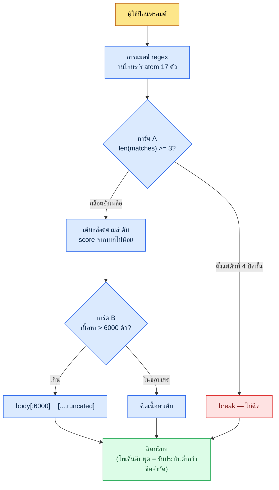

# 22.3 การจัดการต้นทุน AI — ปกป้องงบโทเค็นด้วยโค้ด

> ผู้อ่านหลัก: ผู้นำทีมออกแบบที่นำเครื่องมือ AI เข้ามาใช้ในทีมและรับผิดชอบเรื่องต้นทุน (ทีมขนาดกลาง 10–50 คน)
> ฉบับย่อสำหรับผู้อ่านคนเดียว/งานอดิเรก: §22.3.9 「ถ้าทำคนเดียว เท่านี้ก็พอ」

ถ้าบทที่ว่าด้วยต้นทุนยกตัวเลขต้นทุนปลอมขึ้นมา นั่นก็ขัดแย้งกับตัวเองในตัวเองอยู่แล้ว ด้วยเหตุนี้บทนี้จึงไม่สร้างตารางสวยงามที่บอกว่า "ทีมเราประหยัดได้เดือนละเท่าไหร่" แต่ใช้ตัวเลขเพียงสองชนิดเท่านั้น ชนิดแรกคือ **ราคาโทเค็นที่เปิดเผยต่อสาธารณะ** (ค่าบริการต่อ 1M โทเค็นของแต่ละโมเดล) ที่ใครก็ตรวจสอบได้ อีกชนิดหนึ่งคือ **ค่าคงที่ที่ถูกตรึงไว้** ในโค้ด hook ที่ผู้เขียนรันใช้งานเองโดยตรง (`max_atom_body = 6000`, `max_matches = 3`) ทั้งสองชนิดไม่ใช่สิ่งที่กุขึ้น แต่เป็นสิ่งที่อ้างอิงมา

สิ่งที่น่ากลัวเกี่ยวกับต้นทุน AI ไม่ใช่เพราะจำนวนเงินมันมาก แต่เพราะ **มันมองไม่เห็น** เดือนแรกที่นำมาใช้ การเรียก (call) ยังน้อย ใบเรียกเก็บเงินจึงเล็ก จากนั้นเมื่อบริบทยาวขึ้นและการเรียกถี่ขึ้น ใบเรียกเก็บเงินของไตรมาสใดไตรมาสหนึ่งก็เปลี่ยนหลักไปเลย ถ้าจะพูดข้อสรุปของบทนี้ก่อน ก็คือ — ต้นทุนไม่ได้ควบคุมด้วยคำมั่นว่า "ใช้อย่างประหยัดเถอะ" แต่ควบคุมด้วย **โค้ดที่บังคับตัดโทเค็นในทุกการเรียก** สิ่งที่ปิดกั้นไว้ไม่ใช่เจตจำนงของคน แต่เป็น wrapper และ truncate

---

## 22.3.1 ต้นทุน LLM แทบจะเป็นรายการเดียวคือ 'โทเค็นอินพุต'

รายการต้นทุนมีสี่อย่างคือ อินพุต เอาต์พุต แคชฮิต และแคชไรต์ แต่สิ่งที่ครอบงำใบเรียกเก็บเงินในการทำงานจริงคือ **โทเค็นอินพุต** เหตุผลนั้นง่ายมาก เพราะงานเกือบทั้งหมดที่ใช้ AI ในการออกแบบเกมมีรูปแบบ "ใส่บริบทยาว ๆ เข้าไปแล้วรับคำตอบสั้น ๆ" เมื่อยัดเอกสารวิสัยทัศน์ L0, ไลบรารี atom, เนื้อหาเมืองข้างเคียง และส่วนที่ตัดมาจากชีตข้อมูลเข้าไปทั้งหมด อินพุตก็เป็นหลายหมื่นโทเค็น แต่เอาต์พุตเป็นตารางหนึ่งแผ่นจึงเป็นเพียงไม่กี่ร้อยโทเค็น

ด้วยเหตุนี้ลำดับความสำคัญอันดับหนึ่งของการควบคุมต้นทุนจึงไม่ใช่ "ลดเอาต์พุตเถอะ" แต่กลายเป็น **"จะตัดโทเค็นอินพุตที่ตรงไหน"** บรรทัดเดียวนี้ลากบทที่เหลือทั้งหมดไปข้างหน้า

ขอตรึงราคาต่อโมเดลที่เปิดเผยต่อสาธารณะไว้ก่อน ด้านล่างคือค่าบริการต่อ 1M (หนึ่งล้าน) โทเค็นที่ Anthropic เปิดเผย ซึ่งเป็น **สแนปช็อตที่อ้างอิงราคาสาธารณะของเจเนอเรชันในช่วงเขียนหนังสือเล่มนี้** (เกรดล่าสุดในขณะนั้นของ Opus·Sonnet·Haiku) **มาอย่างตรงตัว** (อ้างอิงราคาสาธารณะอย่างเป็นทางการ — เนื่องจากเปลี่ยนแปลงตามเจเนอเรชันและช่วงเวลาของโมเดล จึงต้องตรวจสอบตารางราคาปัจจุบันก่อนนำไปใช้ทุกครั้ง) ตามหลักการที่ภาคผนวก K สรุปไว้ สิ่งที่ไม่เปลี่ยนแปลงในที่นี้ไม่ใช่ **ค่าสัมบูรณ์ของราคา แต่เป็นอัตราส่วนราคาระหว่างเกรดทั้งสาม** ดังนั้นจึงดูตารางด้านล่างไม่ใช่เพื่อเป็น "ใบเรียกเก็บเงินของวันนี้" แต่เพื่ออ่านโครงสร้างที่ว่า "ยิ่งลดเกรดลง ราคาก็ยิ่งตกลงทีละหลัก"

| โมเดล | อินพุต 1M โทเค็น | เอาต์พุต 1M โทเค็น | หมายเหตุ |
|---|---|---|---|
| Claude Opus | $15 | $75 | การให้เหตุผลระดับสูงสุด (ราคาสาธารณะ) |
| Claude Sonnet | $3 | $15 | ระดับกลาง — ราคาอินพุตเป็น 1/5 ของ Opus |
| Claude Haiku | $0.80 | $4 | น้ำหนักเบา — ราคาอินพุตประมาณ 1/19 ของ Opus |
| แคชฮิต (read) | ประมาณ 1/10 ของราคาอินพุตมาตรฐาน | — | เมื่อใช้อินพุตที่แคชไว้ซ้ำ (นโยบายแคชสาธารณะ) |

ประเด็นสำคัญคือสองบรรทัดสุดท้าย **ถ้ารันงานเดียวกันด้วย Haiku แทน Opus ราคาต่อโทเค็นอินพุตจะเป็นประมาณ 1/19** และ **ถ้าใส่บริบทเดียวกันลงในแคช ราคาอินพุตของส่วนนั้นจะเป็นประมาณ 1/10** สองแกนใหญ่ของการลดต้นทุนออกมาจากตรงนี้ — การเลือกโมเดลให้เหมาะสมและการแคช ทั้งสองอย่างไม่ใช่โครงสร้างแบบ "ใช้ให้น้อยลง" แต่เป็น "ทำงานเดียวกันด้วยราคาต่อหน่วยที่ถูกกว่า"

> การประหยัดไม่ได้มาจากเจตจำนง แต่มาจากส่วนต่างของราคา การลด Opus เป็น Haiku ลดได้ประมาณ 19 เท่า การใส่แคชลดได้ประมาณ 10 เท่าโดยอัตโนมัติ

---

## 22.3.2 ต้นทุนอินพุตที่ใหญ่ที่สุดคือ 'บริบทที่ถูกฉีดเข้าไปในทุกการเรียก'

มีต้นทุนที่สะสมเงียบ ๆ ยิ่งกว่าราคาต่องานแต่ละชิ้น นั่นคือ **บริบทที่ถูกแนบเข้าไปโดยอัตโนมัติในทุกการเรียก** ในเครื่อง PC ส่วนตัวของผู้เขียนมี hook ที่ทำงานเพื่อเสียบหน่วยความจำที่เกี่ยวข้อง (atom) เข้าไปโดยอัตโนมัติทุกครั้งที่ผู้ใช้พิมพ์พรอมต์ (UserPromptSubmit hook, `inject_memory.py`) นี่เป็นฟีเจอร์อำนวยความสะดวก แต่ในขณะเดียวกันก็เป็น **ผู้ต้องสงสัยอันดับหนึ่งของการรั่วไหลของต้นทุน** ด้วยเช่นกัน เพราะเนื้อหา atom ยาว ๆ จะเข้าไปอยู่ในบริบททุกอินพุต ถ้าปล่อยไว้โดยไม่ควบคุม โทเค็นอินพุตจะพองขึ้นในทุกการเรียก

ด้วยเหตุนี้ใน hook นี้จึงมีกลไกป้องกันที่ตัดต้นทุนถูกตรึงไว้ซ้อนกันสามชั้น ไม่ใช่ทฤษฎีนามธรรม แต่เป็นค่าคงที่ในโค้ดจริง

```python
# inject_memory.py — UserPromptSubmit hook (โค้ดที่รันใช้งานจริง, ตัดตอนมา)
# หลักการออกแบบ (ข้อความต้นฉบับใน docstring):
#   - exit 0 เสมอ (แม้ล้มเหลวก็ห้ามรบกวนการทำงานของผู้ใช้)
#   - ฉีด atom สูงสุด 3 ตัวตามลำดับ score จากมากไปน้อย
#   - truncate เมื่อเนื้อหา atom เกิน 6000 ตัวอักษร

# (1) อ่านค่าคงที่ของงบจาก config ใน manifest
max_matches = cfg.get("max_matches", 3)      # จำนวน atom สูงสุดต่อหนึ่งการเรียก
max_body    = cfg.get("max_atom_body", 6000) # ขีดจำกัดเนื้อหาต่อ atom 1 ตัว (ตัวอักษร)

# (2) เรียงตาม score จากมากไปน้อย — เติมสล็อตราคาแพงตามลำดับคุณค่า
atoms_sorted = sorted(atoms, key=lambda a: a.get("score", 0), reverse=True)

matches = []
for atom in atoms_sorted:
    if len(matches) >= max_matches:   # (การ์ด A) ตัดที่สูงสุด 3 ตัว
        break
    if re.search(atom["regex"], prompt, re.IGNORECASE):
        matches.append(atom)

# (3) เมื่อฉีดเนื้อหา ตัดที่ 6000 ตัวอักษร
for atom in matches:
    body = atom_path.read_text(encoding="utf-8")
    if len(body) > max_body:          # (การ์ด B) truncate
        body = body[:max_body] + "\n\n[...truncated]\n"
```

ในนี้มีการ์ดป้องกันต้นทุนครบทั้งสามชั้น

- **การ์ด A — ขีดจำกัดจำนวน (`max_matches = 3`)**: แม้จะมี atom ที่แมตช์กับอินพุต 10 ตัว ก็แนบสูงสุดได้เพียง 3 ตัว โค้ดจะปิดกั้นอุบัติเหตุที่ไลบรารี 17 atom ทั้งชุดเข้าไปในทุกการเรียก
- **การ์ด B — ขีดจำกัดความยาว (`max_atom_body = 6000`)**: แม้เนื้อหา atom จะมี 12,000 ตัวอักษร ก็ตัดที่ 6,000 ตัวอักษร เป็นไปไม่ได้ในเชิงโครงสร้างที่ atom การทบทวนยาว ๆ ตัวเดียวจะทำให้ต้นทุนการเรียกพองเป็นสองเท่า
- **การ์ด C — ลำดับความสำคัญด้วย score**: เติมสล็อต 3 ตัวตามลำดับ score จากสูงไปต่ำ กล่าวคือ "atom ที่มีคุณค่าต่ำ" จะไม่สามารถยึดครองโทเค็นอินพุตราคาแพงได้

ค่าคงที่สามตัวนี้คือ **ขีดจำกัดของโทเค็นอินพุตต่อการเรียก** นั่นเอง หากประเมินคร่าว ๆ atom หนึ่งตัว 6,000 ตัวอักษรในภาษาเกาหลีก็ราว ๆ ขนาดไม่กี่พันโทเค็น (จำนวนโทเค็นที่แน่นอนแตกต่างกันตามตัวตัดคำ (tokenizer) และภาษา จึงควรอ่านเป็นโครงสร้างที่ว่า "มีขีดจำกัดกำกับอยู่" มากกว่าค่าสัมบูรณ์) 3 ตัว × 6,000 ตัวอักษร คืองบการฉีดต่อหนึ่งการเรียก เกินกว่านั้นโค้ดจะตัดทิ้ง คนไม่ต้องคอยใช้ตามองเองว่า "มี atom แนบมาเยอะเกินไปแล้ว"

---

## 22.3.3 [บันทึกเซสชันจริง (worked transcript)] truncate 6000 ตัวอักษรเพียงบรรทัดเดียวปิดกั้นต้นทุนอย่างไร

ถ้าพูดด้วยปากเปล่าว่า "truncate ปิดกั้นต้นทุน" มันก็เลื่อนลอย ในความเป็นจริงตอนสร้างค่าคงที่นี้ ผู้เขียนรันหนึ่งรอบกับ AI ไปจนจบ ด้านล่างคือการจำลองเซสชันนั้นอย่างซื่อตรง พรอมต์อินพุตคัดลอกไปใช้ได้ตามนั้น ส่วนเอาต์พุตเป็นการเรียบเรียงใหม่จากเซสชันจริง

### ขั้นที่ 1 — อินพุต: โยนสถานการณ์ปัญหาออกไปตามจริง

ทันทีหลังจากเริ่มรัน hook ครั้งแรก ใน `_injection_log.txt` มีบันทึกที่เนื้อหา atom ถูกฉีดเข้าไปทั้งก้อนในหนึ่งการเรียก ถ้า atom ยาว ๆ (การทบทวน·บริบทสุขภาพ ฯลฯ) เข้าไปแบบเต็มขนาดในทุกการเรียก ยิ่งเป็นงานที่ใช้บ่อย โทเค็นอินพุตก็ยิ่งสะสม ผู้เขียนจึงถาม AI ว่าจะตัดที่ตรงไหน

### ขั้นที่ 2 — พรอมต์: บังคับขีดจำกัดและรูปแบบ

```
มี hook (inject_memory.py) ที่ฉีด atom เข้าไปในบริบทโดยอัตโนมัติทุกการเรียก
ผมอยากกำหนดขีดจำกัด truncate เพื่อปิดกั้นต้นทุนโทเค็นอินพุต ช่วยเสนอ
ขีดจำกัดจำนวนตัวอักษรของเนื้อหาต่อ atom 1 ตัว กับขีดจำกัดจำนวน atom ที่จะฉีด
ต่อหนึ่งการเรียกให้หน่อย ถ้าสั้นเกินไปแก่นจะถูกตัด ถ้ายาวเกินไปโทเค็นจะรั่ว
ช่วยชี้ trade-off นั้นมาด้วย และสิ่งที่ไม่มั่นใจให้ทำเครื่องหมายแยกไว้ให้คน
ตัดสิน (เจตนา: ตั้งใจให้ค่าขีดจำกัดถูกแยกออกไปเป็น config) ทำเป็นตาราง:
รายการ | ค่าที่เสนอ | เหตุผล | ระดับความมั่นใจ
```

ขอให้สังเกตว่าครึ่งหนึ่งของพรอมต์คือ "การบังคับขีดจำกัดและรูปแบบ" ถ้าปล่อย AI ให้อิสระกับคำถามที่เกี่ยวกับต้นทุน จะได้คำตอบที่ไร้ความรับผิดชอบอย่าง "แล้วแต่สถานการณ์" แก่นของพรอมต์นี้คือ **การบังคับให้ระบุค่าเป็นรูปธรรม ให้ระบุ trade-off อย่างชัดเจน และใส่ทางออกที่บอกให้แจ้งหากไม่มั่นใจ**

### ขั้นที่ 3 — เอาต์พุตของ Claude (เรียบเรียงใหม่, ตัดตอนมา)

```
| รายการ         | ค่าที่เสนอ | เหตุผล                                        | ความมั่นใจ |
|----------------|----------|-----------------------------------------------|-----------|
| max_atom_body  | 6000 ตัว | 'แก่น+เหตุผล' ของ atom เกาหลี 1 ตัว ส่วนใหญ่อยู่ | กลาง      |
|                |          | ในราว 4,000–6,000 ตัว ถ้า 6000 ตัว ส่วนหัวเนื้อหา|           |
|                |          | (ใจความ·กฎ) แทบจะถูกเก็บไว้ ตัดเฉพาะส่วนหาง     |           |
|                |          | (รายการตัวอย่าง)                              |           |
| max_matches    | 3        | หัวข้อที่อินพุตหนึ่งรายการแมตช์อย่างแรงพร้อมกัน  | สูง       |
|                |          | มักมี 1–3 ตัว ตั้งแต่ 4 ตัวขึ้นไปเป็นสัญญาณว่า  |           |
|                |          | regex กว้างเกินไป                             |           |
| ตำแหน่งแยก config | _jit_manifest.json > config | ปรับระหว่างรันได้โดยไม่ต้องดีพลอยโค้ดใหม่ | สูง |
| เครื่องหมาย truncate | ติด [...truncated] ที่ส่วนหาง | ให้โมเดล·คนรับรู้ว่าถูกตัด | กลาง |
| จุดที่ไม่มั่นใจ  | ว่า 6000 เป็นค่าที่แม่นยำหรือไม่ | การแปลงตัว→โทเค็นไม่แน่นอน | ★ต่ำ |
|                | (ตัว→โทเค็นแปลงไม่แน่นอน)  | เพราะต่างกันตามภาษา·โมเดล หน่วยตัวจึงเป็นค่าประมาณ |     |
```

สิ่งที่มีคุณค่าที่สุดในเอาต์พุตไม่ใช่ตาราง แต่เป็น **บรรทัด ★ ล่างสุด** AI แจ้งด้วยตัวเองว่า "ไม่รู้ว่า 6000 เป็นค่าที่เหมาะที่สุดอย่างแม่นยำหรือไม่ การแปลงตัว→โทเค็นไม่แน่นอน" พรอมต์ที่ดีทำให้ AI พูดออกมาว่าไม่รู้

### ขั้นที่ 4 — การตรวจสอบและการปฏิเสธ (ที่ของคน)

ผู้เขียนไม่รับเอาต์พุตนี้มาตามนั้น AI เสนอ 6000 ตัวอักษรว่าเป็น "เส้นที่แก่นยังถูกเก็บไว้" แต่ต้องตรวจสอบเองโดยตรงว่าเมื่อตัดที่ 6000 ตัวอักษรจริงแล้วอะไรถูกตัด ผู้เขียนจึงเลือก atom ที่ยาวที่สุด (บริบทสุขภาพ, ฉบับสะสมการทบทวน) แล้วใช้ตามองจุด 6000 ตัวอักษร

ผลการตรวจสอบพบหนึ่งกรณีที่ติดขัด **จุด 6000 ตัวอักษรตัดแถวตารางตรงกลางเนื้อหาขาด** ทำให้บรรทัดอย่าง `| 비타민D | 1000IU |` ถูกตัดครึ่งกลาง ความหมายยังถูกเก็บไว้ แต่รู้สึกขัดใจที่แถวตารางที่ถูกตัดเข้าไปหาโมเดลเป็นมาร์กดาวน์ที่พัง ผู้เขียนจึงร้องขอใหม่

### ขั้นที่ 5 — การร้องขอใหม่

```
ตอนตัดที่ 6000 ตัวอักษร มีกรณีที่กลางแถวของตารางมาร์กดาวน์ขาด
จะดีกว่าไหมถ้าใส่การชดเชยให้สแนปตำแหน่งตัดไปที่ขอบขึ้นบรรทัดใหม่ก่อนหน้า?
เนื่องจากการอิมพลิเมนต์ต้องไม่ซับซ้อนกว่าผล truncate ช่วยตัดสินไปจนถึงว่า
จะทำหรือไม่ทำ โดยชั่งคุณค่าเทียบกับต้นทุน
```

AI ตอบมาดังนี้ — "การสแนปขอบบรรทัดทำได้ด้วย `body[:max_body].rsplit('\n', 1)[0]` เพียงบรรทัดเดียว แต่ **เนื่องจากวัตถุประสงค์ของ truncate คือขีดจำกัดโทเค็น ไม่ใช่ความสมบูรณ์ของตาราง** แถวตารางที่พังหนึ่งบรรทัดจึงส่งผลต่อต้นทุน·การทำงานน้อยมาก ปัจจุบันเพียงเครื่องหมาย `[...truncated]` ก็ทำให้โมเดลรับรู้ว่า 'ถูกตัดที่นี่' แล้ว จึง **แนะนำว่าไม่ควรทำ** การสแนปบรรทัด ถ้าจะทำจริง การชดเชยหนึ่งบรรทัดก็เพียงพอ"

คำตอบนี้ถูกต้อง ถ้าโลภเอาความสมบูรณ์ของตารางเข้าไปในโค้ดควบคุมต้นทุนด้วย โค้ดการ์ดเองจะอ้วนขึ้น **โค้ดที่รันใช้งานปัจจุบันยังคงการตัดแบบเรียบง่าย `body[:max_body] + "[...truncated]"` ไว้** เป็นรอบที่ปิดด้วยการไป-กลับครั้งเดียว ที่คนตรวจสอบข้อเสนอแรกของ AI (6000 ตัวอักษร) และ AI กดความโลภที่จะชดเชยเกินจำเป็นกลับลงไปอีกครั้ง

---

## 22.3.4 โครงสร้างของการ์ดต้นทุน — เห็นในภาพเดียว

ค่าคงที่ที่กำหนดในเซสชันข้างต้นตัดโทเค็นอินพุตในการเรียกจริงอย่างไร ขอบันทึกการไหลทั้งหมดไว้เป็นแผนผัง



ประเด็นสำคัญของภาพนี้คือ **ไม่ว่าผู้ใช้จะป้อนอะไร โทเค็นที่ฉีดต่อการเรียกก็มีเพดานกำกับอยู่** เพดานคือ `3 × 6000 ตัวอักษร` (+เครื่องหมาย) เกินกว่านั้นโค้ดจะตัดทิ้งโดยไม่มีเงื่อนไข ต้นทุนไม่พึ่งพาความสามารถในการยับยั้งชั่งใจของผู้ใช้ การ์ด A·B ทำงานเชิงกลไกในทุกการเรียก

ปรัชญาเดียวกันนี้ทำซ้ำในระดับเครื่องมือด้วย ระบบของบริษัทผู้เขียนมีนโยบายที่ **ตรึง wrapper สกิลที่ปรากฏในสล็อตทั่วโลกไว้ที่ 12 ตัวพอดี** (atom `skill_listing_budget_wrapper_only_policy`) เมื่อเริ่มเซสชัน ถ้าจำนวน wrapper ทั่วโลก `*` ไม่ใช่ 12 สคริปต์จัดระเบียบจะรันโดยอัตโนมัติ ในนามคือ "การจัดสล็อต" แต่แก่นแท้คือ **การปกป้องงบโทเค็นตอนเริ่มเซสชัน** — เป็นการมัดต้นทุนของการที่รายการสกิลขึ้นไปอยู่ในบริบทไว้ที่ปริมาณ 12 ตัว ขีดจำกัดการฉีด atom 3 ตัว กับขีดจำกัดการปรากฏของสกิล 12 ตัว เป็นการประยุกต์ที่ต่างกันของแนวคิดเดียวกัน

---

## 22.3.5 การจัดสรรโมเดลตามงาน — 80% ทำด้วยราคาที่ถูกกว่า

ถ้าการ์ดปิดกั้นโทเค็นต่อการเรียก การเลือกโมเดลก็เป็นตัวกำหนดราคาต่อหน่วยของโทเค็นนั้น ในตาราง §22.3.1 ราคาอินพุตเป็น Opus:Sonnet:Haiku ≈ 19:4:1 ดังนั้นการรันทุกงานด้วย Opus จึงเท่ากับการจ่ายราคาต่อหน่วยแพงกว่า 19 เท่าไปถึงงานง่าย ๆ อย่างการจัดประเภท·การแทนที่

จัดสรรราคาต่อหน่วยตามความซับซ้อนของงาน

| ประเภทงาน | โมเดลที่แนะนำ | เหตุผล |
|---|---|---|
| งานเชื่อมโยงตรวจสอบ·กฎหมายโดยตรง, การวิเคราะห์การตัดสินใจ | Opus | งานที่อุบัติเหตุใหญ่หากผิด — ไม่ตระหนี่ราคาต่อหน่วย |
| รายงาน·สรุป·การประมวลภาษาธรรมชาติ | Sonnet | ต้องการคุณภาพแต่ไม่จำเป็นถึงการให้เหตุผลระดับสูงสุด |
| การจัดประเภท·แท็ก·สกัดคีย์เวิร์ด | Haiku | แพตเทิร์นง่าย — ราคาต่อหน่วยประมาณ 1/19 ของ Opus ก็เพียงพอ |
| การแมป·แทนที่อย่างง่าย | Haiku หรือเชิงกำหนด (deterministic) | หลายกรณีไม่จำเป็นต้องใช้แม้แต่ LLM |

จากประสบการณ์ งานส่วนใหญ่ Sonnet·Haiku ก็เพียงพอ **โมเดลราคาแพงใช้เฉพาะกับ "งานที่ถ้าผิดจะแพง" เท่านั้น** อย่างไรก็ตามมีกับดักหนึ่งอย่าง — ถ้าลดเป็นโมเดลที่ถูกเกินไป อาการหลอน (hallucination) จะเพิ่มขึ้นจนต้นทุนการตรวจสอบกลืนกินยอดที่ประหยัดได้ (เชื่อมโยงโดยตรงกับ §22.2 อาการหลอน·ความปลอดภัยในบทก่อน) ดังนั้นการจัดสรรโมเดลจึงไม่ใช่ "ถูกไว้ก่อนไม่ว่ายังไง" แต่เป็นการแยก "งานที่ผิดก็ถูกก็ทำให้ถูก งานที่ถ้าผิดจะแพงก็ทำให้แพง"

บรรทัดสุดท้าย "การแมป·แทนที่อย่างง่าย → เชิงกำหนด" หลายครั้งเป็นการประหยัดที่ใหญ่ที่สุด งานที่คำตอบกำหนดไว้เป็นหนึ่งเดียวอย่างการแทนที่ชื่อ การแมปตามกฎที่กำหนดไว้แล้ว ไม่จำเป็นต้องเรียก LLM **การเรียกที่ถูกที่สุดคือการทำให้การเรียกเองเป็น 0**

---

## 22.3.6 การแคช — อินพุตเดียวกันด้วยราคา 1/10

แม้จะปิดกั้นโทเค็นต่อการเรียก (การ์ด) และลดราคาต่อหน่วย (การจัดสรรโมเดล) **ถ้าส่งบริบทเดียวกันใหม่ทุกการเรียก** ต้นทุนก็รั่ว อินพุตยาว ๆ ที่แทบไม่เปลี่ยนอย่างเอกสารวิสัยทัศน์ L0, ไลบรารี atom, สไตล์ไกด์ของสาขา ให้แคชไว้ เมื่อแคชฮิต ส่วนอินพุตนั้นจะถูกเรียกเก็บที่ประมาณ 1/10 ของราคามาตรฐาน (ตาราง §22.3.1)

```python
# บริบทที่ไม่เปลี่ยนแปลงให้ทำเครื่องหมายด้วย cache_control — เมื่อแคชฮิตประมาณ 1/10
messages = [
    {"role": "system", "content": SYSTEM_PROMPT},
    {"role": "user", "content": [
        {"type": "text", "text": L0_VISION,    "cache_control": {"type": "ephemeral"}},
        {"type": "text", "text": ATOM_LIBRARY, "cache_control": {"type": "ephemeral"}},
        {"type": "text", "text": SPECIFIC_TASK},  # เฉพาะส่วนที่เปลี่ยนทุกครั้งอยู่นอกแคช
    ]},
]
```

ประเด็นสำคัญคือ **การแยกส่วนที่เปลี่ยนกับส่วนที่ไม่เปลี่ยน** เนื่องจากแคชต้องให้ส่วนหน้าของอินพุตเหมือนกันจึงจะฮิต ให้วางบริบทคงที่ (L0·atom) ไว้ข้างหน้า และวางคำสั่งงานที่เปลี่ยนทุกครั้งไว้ข้างหลัง

จะใส่อะไรลงแคชแบ่งด้วยความถี่ของการเปลี่ยนแปลง

| บริบท | การแคช | เหตุผล |
|---|---|---|
| วิสัยทัศน์ L0 (แทบไม่เปลี่ยน) | เหมาะสม | เปลี่ยนแค่ในหน่วยไม่กี่วัน–ไม่กี่สัปดาห์ |
| ไลบรารี atom | เหมาะสม | อัปเดตเฉพาะตอนทบทวน |
| สไตล์ไกด์ของสาขา | เหมาะสม | เปลี่ยนในหน่วยไตรมาส |
| บันทึกการประชุมล่าสุด | ไม่เหมาะสม | เปลี่ยนทุกวัน — อัตราแคชฮิตต่ำ |
| อินพุตของผู้ใช้ | ไม่เหมาะสม | เฉพาะเจาะจงต่อทุกการเรียก |

TTL ของแคชถ้าสั้นก็อยู่ในหน่วยไม่กี่นาที จึงมีผลมากที่สุดใน **งานที่ทุบบริบทเดียวกันต่อเนื่องกัน** (เช่นการผลิตเมือง 30 แห่งที่ใช้ L0 เดียวกันซ้ำ 30 ครั้ง) สำหรับคำถามครั้งเดียวจบ จะมีแต่ต้นทุนการเขียนแคชโดยไม่เกิดฮิต อาจขาดทุนเสียด้วยซ้ำ — ด้วยเหตุนี้จึงประยุกต์ใช้แบบคัดเลือกเฉพาะกับ "งานที่ใช้บริบทเดียวกันบ่อย·ต่อเนื่อง" เท่านั้น

---

## 22.3.7 วิธีจัดการตัวเลขอย่างซื่อสัตย์

บทที่ว่าด้วยต้นทุนเป็นที่ที่ล่อใจมากที่สุดที่จะใส่ตารางอย่าง "ลดจากเดือนละ $5,000 เหลือ $1,000" ยอดประหยัดสัมบูรณ์แบบนั้นแตกต่างกันสุดขั้วตามขนาดทีม·ปริมาณงาน พอกุขึ้นมาเมื่อใด บทที่ว่าด้วยต้นทุนก็กลายเป็นการขัดแย้งกับตัวเองที่โกหกเรื่องต้นทุน บทนี้ใช้ตัวเลขเพียงสามชนิด

ชนิดแรก **อ้างอิงราคาสาธารณะมาตามนั้น** Opus $15 / Sonnet $3 / Haiku $0.80 (อินพุต 1M โทเค็น) ของ §22.3.1 และแคชฮิตประมาณ 1/10 เป็นค่าบริการที่ Anthropic เปิดเผย อัตราส่วนราคาอินพุต 19:4:1 และการแคชประหยัดได้ประมาณ 10 เท่าเป็นค่าที่ออกมาจากการคำนวณบนราคาสาธารณะนี้ — ไม่ใช่การประมาณ แต่เป็นการคำนวณ

ชนิดที่สอง **ค่าคงที่ในโค้ดอ้างอิงโค้ด** `max_atom_body = 6000`, `max_matches = 3` เป็นค่าที่บันทึกไว้จริงใน `inject_memory.py` และ `_jit_manifest.json` ไม่ใช่การเปรียบเปรย แต่เป็นไฟล์จริง

ชนิดที่สาม **สิ่งที่ไม่รู้ก็เขียนว่าไม่รู้** "6000 ตัวอักษรเป็นกี่โทเค็น" แตกต่างกันตามตัวตัดคำ·ภาษา·โมเดล หน่วยตัวจึงเป็นค่าประมาณ ใน §22.3.3 AI ก็แจ้งจุดนี้ด้วยเครื่องหมาย ★ ด้วยเหตุนี้จึงไม่มีตารางแปลงค่าอย่าง "6000 ตัวอักษร = N โทเค็น = ประหยัด $X" อยู่ที่ใดในบทนี้ แทนที่จะใช้ยอดประหยัดสัมบูรณ์ พูดด้วย **ทิศทางและอัตราส่วน** (19 เท่า·10 เท่า) เท่านั้น

> ตัวเลขต้นทุนในบทนี้เป็นราคาสาธารณะ (ตารางราคา Anthropic) หรือเป็นค่าคงที่ที่ตรึงในโค้ด (`inject_memory.py`·`_jit_manifest.json`) หรือเป็นค่าประมาณที่ระบุชัดเจนว่า "ไม่รู้"

---

## 22.3.8 ความล้มเหลวที่พบบ่อย

| แพตเทิร์น | ทำไมจึงล้มเหลว | วิธีแก้ |
|---|---|---|
| ใช้โมเดลระดับสูงสุดกับทุกงาน | จ่ายราคาแพงกว่าประมาณ 19 เท่าไปถึงการจัดประเภท·แทนที่ | จัดสรรโมเดลตามงาน (§22.3.5) |
| ส่งบริบทเดียวกันซ้ำทุกการเรียก | ทิ้งแคชฮิต 1/10 ไป | แคชบริบทคงที่ (§22.3.6) |
| ไม่มีขีดจำกัดในการฉีดอัตโนมัติ | ฉีดไลบรารี atom ทั้งก้อนในทุกการเรียก | การ์ดจำนวน·ความยาว (§22.3.2) |
| จัดการต้นทุนด้วยคำมั่นว่า "ใช้อย่างประหยัด" | ความสามารถในการยับยั้งของคนหยุดการพุ่งทะยานไม่ได้ | ตรึงขีดจำกัดไว้ในโค้ด |
| เรียก LLM ไปถึงเรื่องที่ทำด้วยเชิงกำหนดได้ | การเรียกที่ถูกที่สุดคือ 'ไม่เรียก' | แยกการแมป·แทนที่ออกไปทำด้วยโค้ด |

ข้อที่สี่คือแก่น ถ้าฝากการควบคุมต้นทุนไว้กับเจตจำนงของคน มันจะรั่วแน่นอน เจตจำนงเป็นสิ่งที่พังเป็นอย่างแรกตอนยุ่ง และต้นทุนก็เพิ่มเร็วที่สุดตอนยุ่ง ด้วยเหตุนี้การควบคุมจึงต้องเป็น **ค่าคงที่ในโค้ด** อย่าง `max_matches = 3`

---

> **การประยุกต์นอกเกม** สิ่งที่น่ากลัวเกี่ยวกับต้นทุน AI ไม่ใช่เพราะจำนวนเงินมันมาก แต่เพราะมันมองไม่เห็น และเรื่องนี้เหมือนกันไม่ว่าจะเป็นทีมเกมหรือทีมการตลาด ต้นทุนไม่ได้จับด้วยคำมั่นว่า "ใช้อย่างประหยัด" แต่จับด้วยโครงสร้าง หนึ่ง จัดสรรราคาต่อหน่วยของโมเดลให้เข้ากับระดับความยากของงาน — ถ้ารันแม้แต่การจัดประเภท·แท็กง่าย ๆ ด้วยโมเดลระดับสูงสุด ก็เท่ากับจ่ายราคาแพงกว่าหลายเท่าสำหรับงานเดียวกัน และการแมป·แทนที่อย่างง่ายนั้น การไม่เรียกเลย (จัดการด้วยกฎ·สูตร) คือการเรียกที่ถูกที่สุด สอง อินพุตยาว ๆ ที่แทบไม่เปลี่ยน (แนะนำบริษัท·เอกสารนโยบาย·อภิธานศัพท์) ให้แคชไว้เพื่อลดต้นทุนการส่งซ้ำ ตัวอย่างเช่น งานจัดประเภทคำถามของลูกค้าใช้โมเดลน้ำหนักเบาก็เพียงพอ และมอบเฉพาะการตรวจสอบสัญญาที่ซับซ้อนให้โมเดลระดับสูง ก็แบ่งราคาต่อหน่วยได้พร้อมรักษาคุณภาพ ถ้ามีจุดที่บริบทยาว ๆ ถูกแนบเข้ามาโดยอัตโนมัติ การกำหนด "ขีดจำกัดจำนวน·ความยาวที่แนบมาในครั้งเดียว" ไว้ จะปิดกั้นในเชิงโครงสร้างซึ่งอุบัติเหตุที่อยู่ดี ๆ ใบเรียกเก็บเงินเปลี่ยนหลักไป

## 22.3.9 ลองทำดู — หนึ่งขั้นที่ทำได้วันนี้

> **ถ้าทำคนเดียว เท่านี้ก็พอ**: ไม่มี hook ไม่มี manifest ก็ได้ ในเครื่องมือ AI ที่คุณใช้บ่อย ลองลดโมเดลของงานถัดไปหนึ่งชิ้นลงหนึ่งขั้น (งานสรุปที่เคยทำด้วย Opus ลงเป็น Sonnet, การจัดประเภทด้วย Sonnet ลงเป็น Haiku) ถ้าคุณภาพเอาต์พุตเพียงพอ งานนั้นก็ถูกตรึงไว้ที่ราคาที่ถูกกว่าอย่างถาวร แค่ถาม "งานนี้จำเป็นต้องใช้โมเดลระดับสูงสุดจริงหรือ" เพียงครั้งเดียวต่องาน ครึ่งหนึ่งของการประหยัดก็ออกมาจากตรงนั้น

ถ้าเป็นทีม ขอให้เริ่มด้วยขั้นถัดไปหนึ่งขั้นนี้ หาจุดที่ฉีดบริบทโดยอัตโนมัติ (hook·system prompt·RAG) มาหนึ่งจุด แล้วใส่การ์ดสองตัวของ §22.3.2 (ขีดจำกัดจำนวนการฉีด 1 ตัว, ขีดจำกัดความยาวเนื้อหา 1 ตัว) ลงไปเป็นโค้ดที่ตรงนั้น ถ้าแยกขีดจำกัดออกไปเป็น config อย่าง `inject_memory.py` ก็ปรับแค่ตัวเลขได้ระหว่างรันโดยไม่ต้องดีพลอยโค้ดใหม่ การ์ดสองบรรทัดปิดกั้นในเชิงโครงสร้างซึ่งอุบัติเหตุที่ "อยู่ดี ๆ ใบเรียกเก็บเงินเปลี่ยนหลักไป"

ถ้าสรุปเป็น setup → prompt → verify — **setup**: ใส่ค่าคงที่ขีดจำกัดจำนวน·ความยาวที่จุดฉีดอัตโนมัติ แล้วแยกออกไปเป็น config **prompt**: ขอให้ AI เสนอค่าขีดจำกัดด้วยรูปแบบ §22.3.3 โดยบังคับ trade-off และระดับความมั่นใจ **verify**: เลือกอินพุตที่ยาวที่สุด แล้วตรวจสอบด้วยตาเองโดยตรงว่าที่จุดขีดจำกัดอะไรถูกตัด

---

### สรุปประเด็นสำคัญของบท
- โทเค็นอินพุตเป็นต้นทุนส่วนใหญ่ — ลำดับความสำคัญอันดับหนึ่งของการควบคุมคือ "จะตัดอินพุตที่ตรงไหน"
- การประหยัดไม่ได้ทำด้วยเจตจำนง แต่ทำด้วยค่าคงที่ในโค้ด (`max_matches=3`·truncate 6000 ตัวอักษร)
- ใช้ส่วนต่างของราคา — การจัดสรรโมเดลประมาณ 19 เท่า, การแคชประมาณ 10 เท่า

### ตัวอย่างบทถัดไป
- 22.4 ลิขสิทธิ์·ใบอนุญาตและจริยธรรม — การปฏิบัติงานอย่างปลอดภัยด้านกฎหมาย·ฉันทามติของการใช้เครื่องมือ AI
