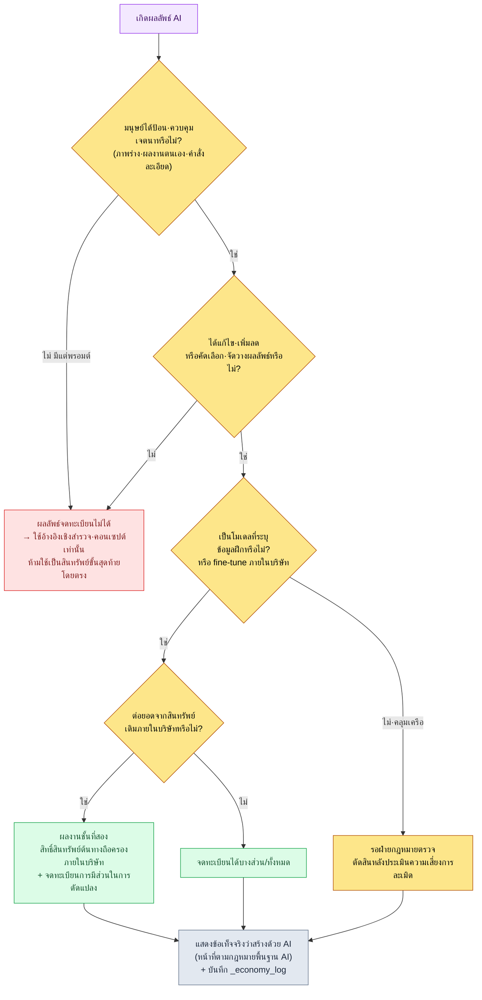

# 22.4 ลิขสิทธิ์และจริยธรรม — ปิดเรื่องสิทธิ์ การแสดงที่มา และการตกลงร่วมของผลงานด้วยกระบวนการเดียว

> ผู้อ่านหลัก: ผู้กำกับเกม·ลีดที่รับผิดชอบการนำ AI เข้ามาใช้ (ทีมขนาดกลาง 10–50 คน)
> ฉบับย่อสำหรับผู้อ่านที่ทำคนเดียว/งานอดิเรก: §22.4.9 「ถ้าทำคนเดียวก็แค่เท่านี้」

สองเดือนก่อนเปิดตัว เคยมีครั้งหนึ่งที่การประชุมหยุดชะงักเพราะภาพประกอบเมืองหนึ่งภาพที่คอนเซปต์อาร์ติสต์สร้างขึ้น มีคนถามว่า "อันนี้สร้างด้วย AI ใช่ไหม แล้วลิขสิทธิ์เป็นของเราหรือเปล่า หรือว่าจดทะเบียนไม่ได้เลย?" ไม่มีใครตอบได้ ความเห็นที่ออกมาในที่ประชุมนั้นมีอยู่สามแนวทาง "AI สร้างขึ้นมา ก็ไม่ใช่ของเรา" "เราจ่ายเงินรันมันเอง มันก็เป็นของเรา" "ยังไม่มีกฎหมาย ก็ใช้ไปเลย" ทั้งสามอย่างผิดหมด และคำถามนี้ก็ไม่ใช่แค่ประเด็นทางกฎหมายเท่านั้น บทบาทของอาร์ติสต์ที่สร้างภาพประกอบนั้นคืออะไร และทีมตกลงร่วมกันเรื่องการใช้ AI อย่างไร ทุกอย่างถูกแขวนไว้พร้อมกันในที่ประชุมนั้น

บทนี้ไม่ได้แยกพูดลิขสิทธิ์กับจริยธรรมออกจากกัน เพราะในงานจริงสองสิ่งนี้คือด้านหน้ากับด้านหลังของคำถามเดียวกัน "สิทธิ์ของผลงานชิ้นนี้เป็นของใคร" (ลิขสิทธิ์) ย่อกลับไปสู่ "มนุษย์เข้าไปมีส่วนกับผลงานชิ้นนี้มากแค่ไหน" (จริยธรรม·บทบาท) ทันที เงื่อนไขการจดทะเบียนที่คณะกรรมการลิขสิทธิ์เกาหลีตรึงไว้ในปี 2025 อยู่ตรงจุดนั้นพอดี ดังนั้นแกนกลางของบทนี้จึงเป็นบันทึกเซสชันจริง (worked transcript) ชิ้นเดียว — ติดตามตั้งแต่อินพุตไปจนถึงการตัดสินใจ ว่าตัดสินความเป็นไปได้ในการจดทะเบียนลิขสิทธิ์ของคอนเซปต์อาร์ต AI หนึ่งภาพจริง ๆ อย่างไร และคำตัดสินนั้นนำไปสู่การตกลงร่วมเรื่องบทบาทของทีมอย่างไร

> **บันทึกการใช้งานจริงของผู้เขียน**
> atom `design_intent_vs_automation_boundary` และไฟล์ `_economy_log`·`_roi_report.md` ที่อ้างถึงในบทนี้ เป็นการนำสินทรัพย์ด้านการกำกับดูแล (governance) ที่ผู้เขียนใช้งานจริงในบริษัทมาทำให้ไม่ระบุตัวตน ชื่อ atom และชื่อไฟล์ล็อกถูกถ่ายทอดตามชื่อที่ใช้งานจริง (เพื่อปกป้องทรัพย์สินทางปัญญา ได้แทนที่เฉพาะชื่อเฉพาะของบริษัท·โปรเจกต์เท่านั้น) ผลลัพธ์ในบันทึกเซสชันจริงเป็นการเรียบเรียงใหม่จากเซสชันการตัดสินจริง

---

## 22.4.1 อำนาจในการตัดสินไม่ได้มาจาก 'ความรู้สึก' แต่มาจากแนวทางที่เปิดเผยต่อสาธารณะ

หนังสือหลายเล่มเขียนเรื่องลิขสิทธิ์ AI ไว้แค่ว่า "ยังไม่มีกฎหมาย เลยคลุมเครือ" ถูกแค่ครึ่งเดียว ในเดือนมิถุนายน 2025 กระทรวงวัฒนธรรม กีฬา และการท่องเที่ยว กับคณะกรรมการลิขสิทธิ์เกาหลี ได้ประกาศ「คู่มือการจดทะเบียนลิขสิทธิ์ของผลงานที่ใช้ Generative AI」ทำให้อย่างน้อยในเกาหลี เส้นแบ่งว่าจดทะเบียนได้หรือไม่ก็ชัดเจนขึ้น ไม่จำเป็นต้องกุขึ้นมาเอง

ใจความสำคัญของคู่มือย่อลงเหลือประโยคเดียว **เงื่อนไขของการจดทะเบียนลิขสิทธิ์คือ 'การมีส่วนสร้างสรรค์ของมนุษย์'** จากตรงนี้แบ่งออกเป็นสองชนิด

| ประเภท | นิยาม | การจดทะเบียน |
|---|---|---|
| ผลงาน GAI | ผลลัพธ์ที่ AI สร้างขึ้นโดยไม่มีการมีส่วนสร้างสรรค์ของมนุษย์ | ไม่ได้ |
| ผลงานที่ใช้ GAI | ส่วนที่มีการมีส่วนสร้างสรรค์ของมนุษย์ ในผลงานที่มนุษย์ใช้ AI เป็นเครื่องมือสร้างขึ้น | ได้ |

และคู่มือได้เสนอสามเส้นทางที่จะได้รับการยอมรับว่าเป็น 'ผลงานที่ใช้ GAI' ① กรณีที่นำผลงานของผู้ใช้เองใส่เป็นพรอมต์ จนความสร้างสรรค์นั้นปรากฏในผลลัพธ์ ② กรณีที่งานเพิ่มเติมในการแก้ไข·เพิ่มลดผลลัพธ์มีความสร้างสรรค์ ③ กรณีที่การคัดเลือก·จัดวาง·ประกอบผลลัพธ์มีความสร้างสรรค์ สองแกนในการตัดสินคือ **'ความสามารถในการควบคุม' และ 'ความสามารถในการคาดการณ์'** ผู้สร้างสรรค์ต้องกำหนดสิ่งที่ตนต้องการแสดงออกได้อย่างชัดเจน และดึงผลลัพธ์ออกมาตามเจตนานั้นได้ จึงจะได้รับการยอมรับว่ามีความสร้างสรรค์

ตรงนี้คือจุดชี้ขาด "ความสามารถในการควบคุม·ความสามารถในการคาดการณ์" ที่คู่มือพูดด้วยภาษากฎหมาย ก็คือสิ่งเดียวกันกับ **"นักออกแบบเป็นผู้ให้เจตนา"** (`planner_provides_intent_not_recommendation` atom) ที่หนังสือเล่มนี้พูดซ้ำมาตั้งแต่ §1.1 ผลงานที่ปล่อยให้ AI ทำทั้งหมดไม่มีการควบคุม·คาดการณ์ จึงไม่มีลิขสิทธิ์ ส่วนผลงานที่มนุษย์ป้อนเจตนาเข้าไปและตรวจสอบ·เรียบเรียงใหม่ สิทธิ์ก็จะตามมา ความเป็นไปได้ในการจดทะเบียนลิขสิทธิ์กับเงื่อนไขของเวิร์กโฟลว์ AI ที่ดี อยู่บนเส้นเดียวกัน

ยังมีเกณฑ์ที่เปิดเผยต่อสาธารณะอีกหนึ่งอย่าง กฎหมายพื้นฐาน AI ที่จะมีผลบังคับใช้ในปี 2026 กำหนด **หน้าที่ในการสร้างความโปร่งใส (การแสดงข้อเท็จจริงว่าสร้างด้วย AI)** ให้กับผลลัพธ์ของ Generative AI การจดทะเบียน (ฝั่งที่อ้างสิทธิ์) กับการแสดงที่มา (ฝั่งที่เปิดเผยข้อเท็จจริงในการใช้งาน) เป็นหน้าที่คนละอย่าง ไม่ว่าจะเกิดสิทธิ์ขึ้นหรือไม่ ก็ต้องเปิดเผยข้อเท็จจริงว่าใช้ AI สองเกณฑ์ที่เปิดเผยต่อสาธารณะนี้กลายเป็น **อินพุตชั้นแรกของ rulebook** ที่จะให้แก่ AI ในบทนี้

---

## 22.4.2 [บันทึกเซสชันจริง] ตัดสินความเป็นไปได้ในการจดทะเบียนของคอนเซปต์อาร์ต AI หนึ่งภาพ

กลับไปที่ภาพประกอบในตอนต้นบท แทนที่จะตัดสินด้วย "ความรู้สึก" เราป้อนเกณฑ์จากคู่มือใน §22.4.1 เข้าไปเป็น rulebook แล้วให้ AI ทำการจำแนกชั้นแรก มนุษย์ตัดสินแค่ขั้นสุดท้ายเท่านั้น พรอมต์อินพุตด้านล่างคัดลอกไปใช้ได้ตามนั้นเลย และผลลัพธ์เป็นการเรียบเรียงใหม่จากเซสชันการตัดสินจริง

### ขั้นที่ 1 — อินพุต: โยนประวัติการสร้างของผลงานเข้าไปตามจริง

อินพุตของการตัดสินไม่ใช่ตัวภาพประกอบ แต่เป็นล็อกว่าภาพประกอบนั้นถูกสร้างขึ้นมาอย่างไร อันนี้มีอยู่ในเมตาดาตาของสินทรัพย์อยู่แล้ว เพียงแค่ดึงออกมาก็พอ

```yaml
# asset_concept_city021_v4.meta.yaml — ประวัติการสร้างของผลงานที่นำมาตัดสิน
asset_id: concept_city021_v4
asset_type: concept_illustration
created_by: สมาชิกทีม A (คอนเซปต์อาร์ติสต์)
generation_log:
  - step: 1
    actor: สมาชิกทีม A
    action: "แนบภาพสเก็ตช์เลย์เอาต์เมืองแบบร่างที่วาดเองเข้าไปเป็นภาพอินพุต"
  - step: 2
    actor: AI (image_model)
    action: "สร้างภาพแปรผัน 4 แบบจากภาพร่าง + พรอมต์"
    prompt: "stone observatory tower over sealed magic core, cold arid, scholar guild, muted palette"
  - step: 3
    actor: สมาชิกทีม A
    action: "เลือก 1 จาก 4 แบบ แล้วรีทัชเงาหอระฆัง·ความอิ่มสี·องค์ประกอบภาพด้วยตนเอง (ทำงานใหม่ราว 40% ของพื้นที่)"
  - step: 4
    actor: สมาชิกทีม A
    action: "ออกแบบลวดลายแท่นผนึกพื้นหลังด้วยตนเองแล้วนำมาประกอบ"
ai_generated_disclosure: true   # ทำตามหน้าที่การแสดงที่มาของกฎหมายพื้นฐาน AI แล้ว
```

### ขั้นที่ 2 — พรอมต์: จำแนกตามเกณฑ์ของคู่มือ แต่บังคับให้แสดงเหตุผล

```
meta.yaml ที่แนบมาคือประวัติการสร้างของคอนเซปต์อิลลัสเตรชันหนึ่งภาพ ช่วยจำแนก
ความเป็นไปได้ในการจดทะเบียน ตามเกณฑ์ของคณะกรรมการลิขสิทธิ์เกาหลี
「คู่มือการจดทะเบียนลิขสิทธิ์ของผลงานที่ใช้ Generative AI」(2025) เป็นหนึ่งใน
จดทะเบียนได้/จดทะเบียนบางส่วน/จดทะเบียนไม่ได้ เหตุผลให้อิงสองแกนของคู่มือ (ความสามารถ
ในการควบคุม·ความสามารถในการคาดการณ์) อย่างละหนึ่งบรรทัด และระบุเป็นหมายเลขว่า step ไหน
ใน generation_log คือ 'การมีส่วนสร้างสรรค์' สิ่งที่ฟันธงทางกฎหมายไม่ได้ ให้ทำเครื่องหมาย
'ต้องให้ฝ่ายกฎหมายตรวจ' แล้วส่งต่อให้มนุษย์ ทำเป็นตาราง: ประเภท | เหตุผล(ควบคุม) | เหตุผล(คาดการณ์) | step ที่มีส่วน | ตรวจกฎหมาย
```

ขอให้สังเกตว่าครึ่งหนึ่งของพรอมต์คือ "การบังคับให้แสดงเหตุผล" และ "ทางออกสำหรับฝ่ายกฎหมาย" ถ้าปล่อยให้ AI ตัดสินทางกฎหมายทั้งหมด มันจะคายข้อสรุปที่ฟังดูน่าเชื่อออกมา หัวใจของพรอมต์นี้คือการใส่เกณฑ์การจำแนก (สามประเภทของคู่มือ) หน้าที่ในการแสดงเหตุผล (สองแกน) การระบุ step ที่มีส่วน และทางออกที่ว่า "ถ้าฟันธงไม่ได้ ให้ส่งต่อฝ่ายกฎหมาย"

### ขั้นที่ 3 — ผลลัพธ์ของ Claude (เรียบเรียงใหม่จากเซสชันจริง)

> ```
> | ประเภท     | เหตุผล(ความสามารถในการควบคุม) | เหตุผล(ความสามารถในการคาดการณ์) | step ที่มีส่วน | ตรวจกฎหมาย |
> |---------|------------------------------|----------------------------|----------|---------|
> | จดทะเบียน | ภาพสเก็ตช์ร่าง(step1) และรีทัช 40% | การเลือก 1 จาก 4 แบบคาดการณ์ได้, | 1,3,4    | ★       |
> | บางส่วน  | (step3) ควบคุมเจตนาการแสดงออกโดยตรง | แต่ตัวแปรผัน 4 แบบของ AI เองคาดการณ์ไม่ได้ |          |         |
>
> การวิเคราะห์:
> - step1(ป้อนภาพร่างที่วาดเอง): เข้าข่ายข้อ ① ของคู่มือ 'สะท้อนความสร้างสรรค์ผ่านการป้อนผลงานของตนเอง'
> - step3(รีทัช 40%): เข้าข่ายข้อ ② ของคู่มือ 'งานเพิ่มเติมในการแก้ไข·เพิ่มลด' การมีส่วนที่แข็งแกร่งที่สุด
> - step4(ออกแบบลวดลายแท่นผนึกด้วยตนเอง): การประกอบผลงานอิสระ เป็นการสร้างสรรค์ของมนุษย์อย่างชัดเจน
> - step2(แปรผัน 4 แบบของ AI): ผลลัพธ์ล้วน ๆ ที่ไม่มีการมีส่วนสร้างสรรค์ของมนุษย์ → ส่วนนี้เดี่ยว ๆ ไม่ใช่เป้าหมายการจดทะเบียน
>
> ★ ต้องให้ฝ่ายกฎหมายตรวจ: "รีทัช 40%" ถึงขั้น 'การดัดแปลงในสาระสำคัญ' หรือไม่ ไม่มีเกณฑ์เชิงปริมาณ
>   สัดส่วนการรีทัชข้ามเส้นแบ่งที่จดทะเบียนได้หรือไม่ ควรให้ทนายความตรวจ
>   (AI ฟันธงความเพียงพอทางกฎหมายของสัดส่วนไม่ได้)
> ```

ส่วนที่มีค่าที่สุดในผลลัพธ์ไม่ใช่ตาราง แต่เป็น **★ ต้องให้ฝ่ายกฎหมายตรวจ** ที่อยู่ล่างสุด AI แจ้งข้อจำกัดของตัวเองว่า "ผมฟันธงไม่ได้ว่ารีทัช 40% เพียงพอทางกฎหมายหรือไม่" แล้วส่งต่อให้มนุษย์ พรอมต์ที่ดีทำให้ AI พูดได้ว่ามันไม่รู้ ไม่ใช่แบบปฏิเสธอัตโนมัติ แต่เป็นแบบแจ้งอัตโนมัติ

### ขั้นที่ 4 — การตรวจสอบและการปฏิเสธ (ที่ของมนุษย์)

จะรับผลลัพธ์นี้มาตามนั้นเลยไม่ได้ ผู้กำกับเอา rulebook มาเคาะอีกที AI จำแนก step4 (ลวดลายแท่นผนึก) ว่าเป็น "ผลงานอิสระ" แต่พอดูประวัติการสร้างอีกครั้ง ลวดลายนั้นต่อยอดมาจาก lore ของเมืองที่ `city_hunting_generator` ใน §6.2 สร้างขึ้น กล่าวคือ step4 อาจไม่ใช่การสร้างสรรค์ล้วน ๆ แต่เป็น **งานชั้นที่สองที่วางทับบนสินทรัพย์ภายในบริษัท** เนื่องจากเป็นสินทรัพย์ของบริษัท การถือครองสิทธิ์จึงชัดเจน แต่ถ้อยคำของ AI ที่ว่า "ผลงานอิสระ" หากเขียนลงในใบสมัครจดทะเบียนตามนั้นเลยจะทำให้เกิดความเข้าใจผิด

จึงร้องขอใหม่

```
ลวดลายแท่นผนึกของ step4 เป็นงานชั้นที่สองที่ต่อยอดจากสินทรัพย์ lore ของเมืองภายในบริษัท (ไม่ใช่การสร้างสรรค์ใหม่อิสระ)
สะท้อนข้อเท็จจริงนี้แล้วจำแนกลักษณะการมีส่วนของ step4 ใหม่
ตอนยื่นจดทะเบียน ต้องระบุว่า 'อิงสินทรัพย์ภายในบริษัทที่มีอยู่เดิม' อย่างไร ช่วยเสนอมาหนึ่งบรรทัดด้วย
```

ปิดได้ด้วยการไป-กลับเพียงครั้งเดียวนี้ AI ตอบ step4 ใหม่จาก "ผลงานอิสระ" เป็น "ผลงานชั้นที่สองของสินทรัพย์ lore ภายในบริษัท — สิทธิ์ในสินทรัพย์ต้นทางถือครองภายในบริษัท ส่วนการมีส่วนในการดัดแปลงเป็นเป้าหมายการจดทะเบียน" และคำตัดสินนั้นถูกส่งต่อไปยังการตรวจของฝ่ายกฎหมาย ข้อสรุปกำหนดเป็น **จดทะเบียนบางส่วน + แสดงข้อเท็จจริงว่าสร้างด้วย AI** ถ้าทำด้วยมือทั้งหมด ฝ่ายกฎหมายต้องไล่ซักประวัติการสร้างของสินทรัพย์ทุกชิ้น แต่ถ้าเป็นร่างจาก AI + ตรวจด้วย rulebook + ไป-กลับหนึ่งครั้ง ฝ่ายกฎหมายก็ใช้เวลาเฉพาะกรณีก้ำกึ่งที่ทำเครื่องหมาย ★ ไว้เท่านั้น

หนึ่งรอบนี้คือเกณฑ์ Show ของบทนี้ ประโยคที่ว่า "ลิขสิทธิ์ AI คลุมเครือ" จะกลวงเปล่าจนกว่าจะได้ลองจำแนกประวัติการสร้างของผลงานหนึ่งชิ้นตามเกณฑ์ของคู่มือจนถึงที่สุด

---

## 22.4.3 แผนผังการตัดสินใจ — ผลงานชิ้นนี้ใช้ได้หรือไม่

เพื่อไม่ต้องตัดสินแบบในเซสชันข้างต้นใหม่ตั้งแต่ต้นทุกครั้ง เราบันทึกเกณฑ์ของคู่มือไว้เป็นแผนผังการไหล (flowchart) เมื่อมีสินทรัพย์หนึ่งชิ้นเข้ามา ก็แค่ไล่ลงไปตามแผนผังนี้ จุดแยกทุกจุดล้วนเป็นเกณฑ์ที่เปิดเผยต่อสาธารณะใน §22.4.1



หัวใจสำคัญคือจุดสิ้นสุดของแผนผัง (J) เหมือนกันในทุกเส้นทาง ไม่ว่าจะจดทะเบียนได้หรือไม่ ไม่ว่าจะเป็นสินทรัพย์บริษัทหรือผลงานชั้นที่สอง **การแสดงข้อเท็จจริงว่าใช้ AI และการล็อกประวัติการสร้าง ต้องทิ้งไว้โดยไม่มีข้อยกเว้น** การแสดงที่มาเป็นหน้าที่แยกจากสิทธิ์ และล็อกคือหลักฐานเดียวในการสืบสาวความรับผิดชอบเมื่อเกิดเหตุ สาเหตุที่การประชุมในตอนต้นบทหยุดชะงัก ก็เพราะไม่มีล็อกนี้ จึงไม่มีใครเรียบเรียงได้ว่าในแต่ละ step ใครทำอะไร

เส้นทางสีแดง (C, จดทะเบียนไม่ได้) ก็ไม่ใช่ของที่ทิ้งไปเฉย ๆ "ผลลัพธ์ AI ล้วน ๆ ที่ใส่แค่พรอมต์" ใช้เป็นข้อมูลอ้างอิงในขั้นสำรวจ·คอนเซปต์ได้อย่างเพียงพอ เพียงแต่ไม่นำมันไปใส่ในเกมเป็นสินทรัพย์ขั้นสุดท้ายเท่านั้น การนำผลลัพธ์ AI ขึ้นเปิดตัวตามนั้นเลย คือชนวนที่ใหญ่ที่สุดของอุบัติเหตุลิขสิทธิ์ในภายหลัง

---

## 22.4.4 เปลี่ยน rulebook ลิขสิทธิ์ให้เป็นล็อกการใช้งาน — `design_intent_vs_automation_boundary`

แผนผัง (§22.4.3) คือการไหลของการตัดสิน และสิ่งที่ทำให้การไหลนั้นถูกลากเป็นเส้นเดียวกันทุกครั้งคือ atom ตัวหนึ่ง ในบรรดาสินทรัพย์ด้านการกำกับดูแลของบริษัท `design_intent_vs_automation_boundary` คือแกนกลางของบทนี้ทั้งบท

นิยามหนึ่งบรรทัดของ atom นี้คือ "เจตนาการออกแบบเป็นของมนุษย์ การทำให้เป็นอัตโนมัติเป็นของเครื่องมือ — ระบุเส้นแบ่งนั้นในทุกสินทรัพย์" ไม่ใช่คำขวัญนามธรรม atom นี้ถูกลงทะเบียนใน JIT hook (`inject_memory.py`) ดังนั้นเมื่อพรอมต์มีคีย์เวิร์ดอย่าง "ลิขสิทธิ์"·"สร้างด้วย AI"·"จดทะเบียนสินทรัพย์" มันจะถูกฉีดเข้าเซสชันโดยอัตโนมัติ หลักการออกแบบของ hook รองรับการใช้งานของ atom นี้ได้พอดี

```python
# inject_memory.py — exit 0 เสมอ ถึงล้มเหลวก็ไม่ขวางการทำงานของผู้ใช้ (ตัดตอน)
def main() -> None:
    ...
    # เรียงลำดับ score จากมากไปน้อยแล้วจับคู่ — ฉีดได้สูงสุดแค่ 3 atom
    atoms_sorted = sorted(atoms, key=lambda a: a.get("score", 0), reverse=True)
    matches = []
    for atom in atoms_sorted:
        if len(matches) >= max_matches:   # ป้องกันการฉีดมากเกินไป
            break
        try:
            if re.search(atom["regex"], prompt, re.IGNORECASE):
                matches.append(atom)
        except re.error:
            continue
    if not matches:
        emit_empty()   # ถ้าไม่จับคู่ ก็ตอบกลับว่าง (ปกติ)
        return
```

ตรงนี้มีการออกแบบที่สำคัญในเชิงการกำกับดูแลสองอย่าง หนึ่ง hook เป็น **`exit 0` เสมอ** (ระบุไว้ใน docstring ของสคริปต์) ต่อให้ล้มเหลวระหว่างฉีด rulebook ลิขสิทธิ์ ก็จะไม่ขวางงานของผู้ใช้เด็ดขาด ถ้ากลไกป้องกันจับงานเป็นตัวประกัน ทีมจะปิดกลไกนั้นทิ้งภายในหนึ่งหรือสองไตรมาส สอง **ฉีดได้สูงสุดแค่ 3 ตัว** ถ้ายัดทุก rulebook การกำกับดูแลเข้าทุกเซสชัน คอนเท็กซ์จะระเบิดและไม่มีใครอ่าน เฉพาะ rulebook ที่ score สูงเท่านั้นที่จะลอยขึ้นมา

อันนี้เป็นปรัชญาเดียวกันกับที่ lint ใน §6.2 ไม่ทำลายการละเมิดทิ้งอัตโนมัติ แต่ส่ง alert ขึ้นไปยัง gate ของนักเขียนเท่านั้น **เครื่องเป็นคนคัดผู้ต้องสงสัยออกมา แต่จะฆ่าหรือจะปล่อยให้มนุษย์เป็นคนตัดสิน** ในเรื่องลิขสิทธิ์ก็เหมือนกัน atom จะลอย "ตรวจลิขสิทธิ์สินทรัพย์นี้แล้วหรือยัง" ขึ้นมาอัตโนมัติ แต่คำตัดสินขั้นสุดท้ายว่าจดทะเบียนได้หรือไม่ มนุษย์และฝ่ายกฎหมายเป็นคนทำ

---

## 22.4.5 ถัดจากสิทธิ์คือคน — ปิดเรื่องวิวัฒนาการบทบาทด้วยการตกลงร่วม

การตัดสินภาพประกอบในตอนต้นบทไม่ได้จบลงที่ลิขสิทธิ์ เพราะมันหมายความว่างานของสมาชิกทีม A ที่สร้างสินทรัพย์นั้น ได้เคลื่อนจาก "การวาด" ไปเป็น "การเลือก 4 แบบของ AI และรีทัช 40%" ในวินาทีที่ลิขสิทธิ์เรียกร้อง "การมีส่วนสร้างสรรค์ของมนุษย์" นิยามบทบาทของคนที่ทำการมีส่วนนั้นก็เปลี่ยนตามไปด้วย ทั้งสองคือด้านหน้ากับด้านหลังของเหตุการณ์เดียวกัน

ตรงนี้อุบัติเหตุที่พบบ่อยที่สุดคือการจัดการความเปลี่ยนแปลงนี้ด้วยการแจ้งให้ทราบ ต่อให้เครื่องมือดี แต่หกเดือนต่อมาไม่มีใครใช้ ส่วนใหญ่ไม่ใช่เพราะเครื่องมือแย่ แต่เพราะไม่มีการตกลงร่วม การที่บทบาทเคลื่อนจากการผลิตจำนวนมากไปเป็นการคัดเลือก·ตรวจสอบ·เรียบเรียงใหม่ คือแก่นแท้ของการนำมาใช้ แต่ถ้าไม่ระบุชัดและไม่รองรับด้วยการอบรม สมาชิกทีมจะรับมันไว้ในความหมายว่า "ที่ของฉันกำลังจะหายไป"

| สายงาน | ก่อนมี AI | หลังมี AI (วิวัฒนาการบทบาท) | ความหมายเชิงลิขสิทธิ์ |
|---|---|---|---|
| คอนเซปต์อาร์ติสต์ | วาดเองทั้งหมด | ป้อนเจตนา·คัดเลือก·รีทัช | การรีทัชคือ 'การมีส่วนสร้างสรรค์' |
| คนปรับบาลานซ์ | จำลองด้วยมือ | ตีความผลจำลอง·ตัดสินใจ | ล็อกการตัดสินใจคือหลักฐานความรับผิดชอบ |
| นักออกแบบเกม | เขียนสเปกเองทั้งหมด | ให้เจตนา·ตรวจสอบ | การป้อนเจตนาคือความสามารถในการควบคุม |

หนึ่งบรรทัดที่ตารางบอกคือแบบนี้ **'การมีส่วนของมนุษย์' ที่ทำให้จดทะเบียนลิขสิทธิ์ได้ ก็คืองานที่มนุษย์ทำหลังวิวัฒนาการบทบาทนั่นเอง** ถ้าการควบคุม·คาดการณ์ที่คู่มือเรียกร้องหายไป ลิขสิทธิ์ก็หายไป และที่ของมนุษย์ก็หายไป ดังนั้นวิวัฒนาการบทบาทจึงต้องถูกอธิบายว่าไม่ใช่ความเปลี่ยนแปลงที่แย่งงาน แต่เป็นความเปลี่ยนแปลงที่ทิ้งสิทธิ์และความรับผิดชอบไว้ในมือมนุษย์ จึงจะเกิดการตกลงร่วม

การตกลงร่วมไม่ใช่การประชุมที่ไม่จบสิ้น ปิดด้วยกระบวนการ เสนอการนำมาใช้ (ผู้กำกับ) → แชร์ล่วงหน้าทั้งทีม (วัตถุประสงค์·บทบาทที่ได้รับผลกระทบ·ตัวชี้วัด·ความเสี่ยง) → ประชุมตกลงร่วม (พูดได้อย่างอิสระ·เก็บข้อกังวล) → คุยตัวต่อตัวกับสมาชิกที่จำเป็น → ประกาศข้อปรับปรุง → ตกลงหรือพักไว้ ไม่จำเป็นต้องได้รับความเห็นชอบจากสมาชิกทุกคนถึงจะเริ่ม แต่หลังจากฟังและปรับข้อกังวลด้วยกระบวนการแล้ว ผู้กำกับเป็นคนตัดสิน ถ้าไม่มีกระบวนการ การตกลงร่วมจะเริ่มจาก 0 ใหม่ทุกครั้ง และต้นทุนนั้นก็จะทำให้การนำมาใช้ล่าช้า

---

## 22.4.6 ต้นทุน·ROI ก็เป็นส่วนหนึ่งของจริยธรรม — อย่างซื่อตรงด้วย `_roi_report.md`

ถ้าจำกัดจริยธรรมไว้แค่เรื่องงาน·การตกลงร่วม จะพลาดไปหนึ่งแกน การวัดต้นทุนและประสิทธิผลของการใช้งาน AI อย่างซื่อตรงแล้วเปิดเผย ก็คือการกำกับดูแลในตัวมันเอง ถ้าพูดแค่ว่า "AI ทำให้ประสิทธิภาพดีขึ้น" โดยไม่มีการวัด สมาชิกทีมจะสงสัยว่าคำพูดนั้นเป็นข้ออ้างในการลดที่ของตน

ในโครงสร้างพื้นฐานการกำกับดูแลของบริษัทมีสินทรัพย์จริงสำหรับเรื่องนี้อยู่สองอย่าง `_economy_log/` ของระบบ atom (ล็อกความคุ้มค่าของโทเค็น·เวลา) และ `_roi_report.md` (รายงาน ROI) อันแรกเครื่องบันทึกโทเค็น·เวลาของทุกเซสชัน ส่วนอันหลังนำมารวมเป็นรอบ ๆ ให้มนุษย์อ่าน หัวใจคือล็อกนี้ไม่ได้ติดตามว่า "AI แทนที่คนไปมากแค่ไหน" แต่ติดตามว่า "ปลดปล่อยเวลาของคนไปไว้ที่ไหน"

หลักการเรื่องตัวเลขของหนังสือเล่มนี้เป็นหนึ่งในสามอย่าง หนึ่ง มาตรฐานที่เปิดเผยต่อสาธารณะ อ้างอิงตามนั้น (เงื่อนไขการจดทะเบียนของคู่มือ หน้าที่การแสดงที่มาของกฎหมายพื้นฐาน AI) สอง การประมาณของผู้เขียน เขียนว่าเป็นการประมาณ สาม สัญญาเป็น KPI เฉพาะสิ่งที่วัดได้เท่านั้น ในขอบเขตลิขสิทธิ์·จริยธรรม สิ่งที่วัดได้ไม่ใช่ตัวชี้วัดผลลัพธ์ แต่เป็นตัวชี้วัดกระบวนการ

| รายการที่วัด | วิธีวัด | สัญญาได้หรือไม่ |
|---|---|---|
| จำนวนการตกหล่นการแสดงข้อเท็จจริงว่าสร้างด้วย AI | grep เมตา `ai_generated_disclosure` ของสินทรัพย์ | วัดได้ (เป้าหมาย 0) |
| อัตราการถือครองล็อกประวัติการสร้าง | สัดส่วนสินทรัพย์ที่มี `generation_log` | วัดได้ |
| สินทรัพย์ AI ที่เปิดตัวโดยฝ่ายกฎหมายยังไม่ตรวจ | เทียบ build ที่เปิดตัว vs รายการที่ผ่านฝ่ายกฎหมาย | วัดได้ (เป้าหมาย 0) |
| "ยอดขายขึ้นเพราะ AI" | — | วัดไม่ได้ ไม่สัญญา |

บรรทัดสุดท้ายคือหัวใจของความซื่อตรง ผลของ AI ต่อยอดขายแยกออกมาเป็นตัวแปรเดี่ยวไม่ได้ จึงไม่ฟันธงความเป็นเหตุเป็นผล แต่ "สัดส่วนของสินทรัพย์ที่สร้างด้วย AI ซึ่งผ่านการแสดงที่มา·ล็อก·การตรวจของฝ่ายกฎหมาย" นับได้จริงด้วย `_economy_log` และเมตาของสินทรัพย์ สิ่งที่การกำกับดูแลสัญญาไม่ใช่ผลลัพธ์ แต่เป็นความสมบูรณ์ของกระบวนการ

---

## 22.4.7 เนื้อหาที่ผู้ใช้สร้าง (UGC) และการคุ้มครองข้อมูล

เมื่อจัดการสิทธิ์สินทรัพย์·บทบาท·ต้นทุนเรียบร้อย ก็จะเหลืออยู่อีกหนึ่งขอบเขต เส้นทางที่ผู้ใช้นำเนื้อหาที่สร้างด้วย AI ขึ้นมาในเกม สินทรัพย์ที่บริษัทสร้างปิดได้ด้วยกระบวนการภายใน แต่ UGC คือผลลัพธ์นอกการควบคุมที่หลั่งไหลเข้ามา

ตรงนี้ก็ใช้จุดสิ้นสุดของแผนผัง §22.4.3 (การแสดงที่มา·ล็อก) ตามนั้นเลย คอสตูม·ตราสัญลักษณ์กิลด์ที่ผู้ใช้อัปโหลด เรียกร้องให้แสดงข้อเท็จจริงว่าสร้างด้วย AI และทำการดูแล (moderation) ด้วยการผสานตรวจสอบอัตโนมัติ + gate ของมนุษย์ ถ้าใช้งานแค่แกนใดแกนหนึ่ง อุบัติเหตุในไตรมาสถัดไปจะสะสม และข้อมูลผู้ใช้ก็ไม่ส่งให้ LLM อย่างพร่ำเพรื่อ ข้อมูลส่วนบุคคล·ข้อมูลการชำระเงิน ห้ามส่ง ล็อกพฤติกรรมส่งหลังทำให้ไม่ระบุตัวตน เป็นหลักการ (ปฏิบัติตาม GDPR·กฎหมายคุ้มครองข้อมูลส่วนบุคคลในประเทศ)

เขตอำนาจไม่ได้จบที่เกาหลีที่เดียว วินาทีที่รับผู้ใช้จากต่างประเทศ กฎระเบียบข้อมูลของภูมิภาคที่ผู้ใช้นั้นสังกัดก็จะเกี่ยวพันเข้ามาด้วย สำหรับผู้ใช้ EU GDPR กำหนดเงื่อนไขแยกต่างหากเรื่องการโอนข้อมูลส่วนบุคคลออกนอกภูมิภาค·การยินยอม·สิทธิ์ในการลบ และประเทศที่ให้บริการอื่น ๆ ก็มีกฎเรื่องข้อมูลส่วนบุคคล·การจัดเก็บข้อมูลในประเทศของตนเอง ดังนั้น 'ห้ามส่งข้อมูลส่วนบุคคล·ข้อมูลการชำระเงินให้ LLM' ในบรรทัดที่สามของตาราง จึงเป็นค่าตั้งต้นที่ปลอดภัยที่สุดในทุกเขตอำนาจ ส่วนระดับความเข้มข้นของการทำให้ไม่ระบุตัวตน·การแทนชื่อปลอม เมื่อจะส่งล็อกพฤติกรรมไปยังโมเดลภายนอก ต้องตรวจแยกต่างหากให้สอดคล้องกับภูมิภาคที่ให้บริการ อย่างไรก็ตาม หัวข้อนี้เป็นเพียงแนวทางการออกแบบกระบวนการ ไม่ใช่คำปรึกษาทางกฎหมาย เมื่อมีการเปิดตัวระดับโลก·การโอนข้อมูลออกนอกภูมิภาคเข้ามาเกี่ยวข้อง ต้องรับการตรวจของฝ่ายกฎหมายในเขตอำนาจนั้นแยกต่างหากเสมอ

| UGC/ข้อมูล | นโยบาย | เกณฑ์อ้างอิง |
|---|---|---|
| คอสตูม·ตราสัญลักษณ์ที่ผู้ใช้อัปโหลด | แสดงที่มา AI + ตรวจอัตโนมัติ + gate ของมนุษย์ | หน้าที่การแสดงที่มาของกฎหมายพื้นฐาน AI |
| ชื่อเล่นตัวละคร·โพสต์ | ข้อตกลงทั่วไป + ความรับผิดชอบของผู้ใช้ | — |
| ข้อมูลส่วนบุคคล·ข้อมูลการชำระเงิน | ห้ามส่งให้ LLM | กฎหมายคุ้มครองข้อมูลส่วนบุคคล |
| ล็อกพฤติกรรมในเกม | ส่งหลังทำให้ไม่ระบุตัวตน | การทำให้ไม่ระบุตัวตน·การแทนชื่อปลอม |

ยิ่ง UGC เพิ่มขึ้น ภาระการดูแลก็ยิ่งใหญ่ การตรวจอัตโนมัติคัดกรองในชั้นแรก เฉพาะกรณีก้ำกึ่งที่มนุษย์ดู อันนี้คือการนำปรัชญา atom ของ §22.4.4 (เครื่องคัดผู้ต้องสงสัยและมนุษย์ตัดสิน) มาใช้ในมิติของเนื้อหาผู้ใช้

---

## 22.4.8 ความล้มเหลวที่พบบ่อย

| รูปแบบ | ทำไมถึงล้มเหลว | วิธีแก้ |
|---|---|---|
| ใช้ผลลัพธ์ AI เป็นสินทรัพย์ขั้นสุดท้ายตามนั้นเลย | การมีส่วนของมนุษย์ 0 → จดทะเบียนไม่ได้ + เสี่ยงละเมิด | แผนผัง §22.4.3, ใช้แค่เชิงสำรวจ·คอนเซปต์ |
| ไม่มีล็อกประวัติการสร้าง | เกิดเหตุแล้วเรียบเรียงความรับผิดชอบราย step ไม่ได้ | บังคับใส่เมตา `generation_log` ในสินทรัพย์ |
| ไม่แสดงข้อเท็จจริงว่าสร้างด้วย AI | ละเมิดหน้าที่ความโปร่งใสของกฎหมายพื้นฐาน AI | ขั้นแสดงที่มาที่จุดสิ้นสุดแผนผัง ไม่มีข้อยกเว้น |
| จัดการวิวัฒนาการบทบาทด้วยการแจ้งให้ทราบ | ถูกปฏิเสธ 6 เดือนหลังนำเครื่องมือมาใช้ | กระบวนการตกลงร่วม (§22.4.5) |
| ตะโกนแต่ "AI ทำให้ประสิทธิภาพดีขึ้น" | สมาชิกทีมสงสัยว่าเป็นภัยต่อที่ของตน | วัดและเปิดเผยด้วย `_economy_log`·`_roi_report` |
| ใช้โมเดลที่ข้อมูลฝึกคลุมเครืออย่างไม่วิพากษ์ | ตกหล่นการประเมินความเสี่ยงการละเมิด | ให้ความสำคัญกับโมเดลที่ระบุชัด·fine-tune ภายในบริษัท (จุดแยก E ของแผนผัง) |

ข้อที่ห้าถูกมองข้ามบ่อยที่สุด อย่างที่เห็นในการตัดสินภาพประกอบตอนต้นบท "การมีส่วนของมนุษย์" ที่ทำให้จดทะเบียนลิขสิทธิ์ได้ ก็คือบทบาทใหม่ของคนคนนั้นนั่นเอง ถ้าวัดแต่ประสิทธิภาพ แต่ไม่วัดว่าเวลาของคนคนนั้นถูกปลดปล่อยไปไว้ที่ไหน การกำกับดูแลก็จะสำเร็จในแง่ KPI แต่คนจะจากไป

---

> **การประยุกต์นอกเกม** เหตุการณ์ที่การประชุมหยุดชะงักเพราะคำถามว่า "อันนี้สร้างด้วย AI แต่ลิขสิทธิ์เป็นของเราไหม" ไม่ได้เกิดแค่กับภาพประกอบเกม แต่เกิดได้ทุกที่ ไม่ว่าจะเป็นรายงาน·ก๊อปปี้โฆษณา·ข้อเสนอที่สร้างด้วย AI เกณฑ์ที่คู่มือ 2025 ของคณะกรรมการลิขสิทธิ์เกาหลีตรึงไว้นั้นเรียบง่าย — จดทะเบียนได้หรือไม่ขึ้นอยู่กับ "การมีส่วนสร้างสรรค์ของมนุษย์ (ความสามารถในการควบคุม·ความสามารถในการคาดการณ์)" และผลลัพธ์ AI ล้วน ๆ ที่ใส่แค่พรอมต์จะไม่มีสิทธิ์ ดังนั้นไม่ว่าแผนกใด นิสัยที่ทิ้งประวัติการสร้างหนึ่งใบ ซึ่งจดเป็น step ว่า "ขั้นไหนคนทำ ขั้นไหน AI ทำ" ในผลลัพธ์ AI หนึ่งชิ้น ก็จะกลายเป็นตาข่ายนิรภัย ยกตัวอย่าง ถ้านักการตลาดรับร่างก๊อปปี้จาก AI มาแล้วแก้ไข·เรียบเรียงใหม่ด้วยตนเอง การบันทึกการมีส่วนนั้นไว้ก็จะเป็นเหตุผลในการอ้างสิทธิ์ และไม่ว่าจะจดทะเบียนได้หรือไม่ การแสดงข้อเท็จจริงว่า "ใช้ AI" (หน้าที่ตามกฎหมายพื้นฐาน AI ปี 2026) ก็ต้องทิ้งไว้โดยไม่มีข้อยกเว้น เพราะถัดจากสิทธิ์คือคน ความเปลี่ยนแปลงบทบาทของพนักงานที่ทำการมีส่วนนั้น จึงต้องปิดด้วยการตกลงร่วม ไม่ใช่การแจ้งให้ทราบ

## 22.4.9 ลองทำดู — หนึ่งขั้นที่ทำได้วันนี้

> **ถ้าทำคนเดียวก็แค่เท่านี้**: ไม่ต้องมีทีมกฎหมายก็ได้ ลองเลือกผลงานภาพหรือข้อความที่คุณสร้างด้วย AI มา 1 ชิ้น แล้วจด `generation_log` รูปแบบ §22.4.2 ด้วยมือดู (แบ่งเป็น step ว่าขั้นไหนคนทำ ขั้นไหน AI ทำ) จากนั้นลองไล่ตามแผนผัง §22.4.3 แล้วตัดสินด้วยตัวเองว่า "อันนี้จดทะเบียนได้ไหม" คุณจะรู้สึกเข้าใจถึงเนื้อตัวเลยว่าเกณฑ์ "ควบคุม·คาดการณ์" ของคู่มือคณะกรรมการลิขสิทธิ์เกาหลีคือชุดของการตัดสินแบบใด แม้จะเป็นโปรเจกต์ส่วนตัว·งานอดิเรก การทิ้งบรรทัดแสดงข้อเท็จจริงว่าสร้างด้วย AI ไว้สักบรรทัด (`ai_generated: true`) ก็เป็นเรื่องดี

ถ้าเป็นทีม ให้เริ่มด้วยหนึ่งขั้นถัดไปนี้ บังคับใส่สองสล็อต `generation_log` และ `ai_generated_disclosure` ในเมตาของสินทรัพย์ AI ทุกชิ้น (จับการตกหล่นได้ด้วย grep โค้ดบรรทัดเดียว) แล้วแปะแผนผังการตัดสินใจของ §22.4.3 ไว้บนวิกิหนึ่งหน้า การทำให้การตัดสินเงื่อนไขการจดทะเบียนเป็นอัตโนมัติ หรือการใช้งาน `_economy_log` ค่อยมาทีหลัง แค่มีล็อกประวัติการสร้างและแผนผังหนึ่งหน้า ก็ป้องกันเหตุการณ์ที่การประชุมหยุดชะงักแบบในตอนต้นบทได้แล้ว

---

## 22.4.10 บทสรุปส่วนที่ 22

ส่วนที่ 22 คือสี่แกนของการกำกับดูแล

| บท | ใจความ |
|---|---|
| 22.1 | วิศวกรรมพรอมต์ — บังคับรูปแบบ·เหตุผล·ทางออก |
| 22.2 | อาการหลอน·ความปลอดภัย — gate การตรวจสอบ·การตรวจสอบแบบแจ้ง |
| 22.3 | การจัดการต้นทุน — แคชชิง·cap·`_economy_log` |
| 22.4 | ลิขสิทธิ์·จริยธรรม — เงื่อนไขการจดทะเบียน·การแสดงที่มา·การตกลงร่วมเรื่องบทบาท |

ประโยคเดียวที่ทะลุทั้งสี่บทคือแบบนี้ **การกำกับดูแลไม่ใช่กลไกที่ขวาง AI แต่เป็นกระบวนการที่ทิ้งเจตนาและความรับผิดชอบของมนุษย์ไว้ในผลงาน** atom `design_intent_vs_automation_boundary` คือชื่อของกระบวนการนั้น "การควบคุม·การคาดการณ์" ที่การจดทะเบียนลิขสิทธิ์เรียกร้อง "บทบาท·การตกลงร่วม" ที่จริยธรรมเรียกร้อง และ "การวัดอย่างซื่อตรง" ที่ต้นทุนเรียกร้อง ทั้งหมดล้วนชี้ไปที่จุดเดียวกัน — ไม่ว่า AI จะทำอะไร ที่สุดท้ายของการตัดสินใจและความรับผิดชอบคือมนุษย์

---

### สรุปประเด็นสำคัญของบท
- เงื่อนไขการจดทะเบียนลิขสิทธิ์คือ 'การมีส่วนสร้างสรรค์ของมนุษย์' (คู่มือคณะกรรมการลิขสิทธิ์เกาหลี 2025)
- ไม่ว่าจะจดทะเบียนได้หรือไม่ การแสดงที่มาของการสร้างด้วย AI·ล็อกประวัติการสร้าง ต้องทิ้งไว้โดยไม่มีข้อยกเว้น
- 'การมีส่วนของมนุษย์' ที่ลิขสิทธิ์เรียกร้อง ก็คืองานของมนุษย์หลังวิวัฒนาการบทบาทนั่นเอง

### ตัวอย่างบทถัดไป
- ส่วนที่ 23 การขยายผล — ประยุกต์เวิร์กโฟลว์เดียวกันแบบย่อกับการพัฒนาคนเดียว·งานอดิเรก

---


---

> **แหล่งอ้างอิง**
> - คณะกรรมการลิขสิทธิ์เกาหลี·กระทรวงวัฒนธรรม กีฬา และการท่องเที่ยว,「คู่มือการจดทะเบียนลิขสิทธิ์ของผลงานที่ใช้ Generative AI」(2025) — https://www.copyright.or.kr/information-materials/publication/research-report/view.do?brdctsno=54253
> - คณะกรรมการลิขสิทธิ์เกาหลี·กระทรวงวัฒนธรรม กีฬา และการท่องเที่ยว,「คู่มือลิขสิทธิ์ Generative AI」(2023.12) — https://www.copyright.or.kr/information-materials/publication/research-report/view.do?brdctsno=52591
> - กฎหมายพื้นฐานปัญญาประดิษฐ์ (กฎหมายพื้นฐาน AI) หน้าที่ความโปร่งใส·การแสดงที่มาของผลลัพธ์ Generative AI (มีผลบังคับใช้ปี 2026) — https://www.shinkim.com/kor/media/newsletter/3142
