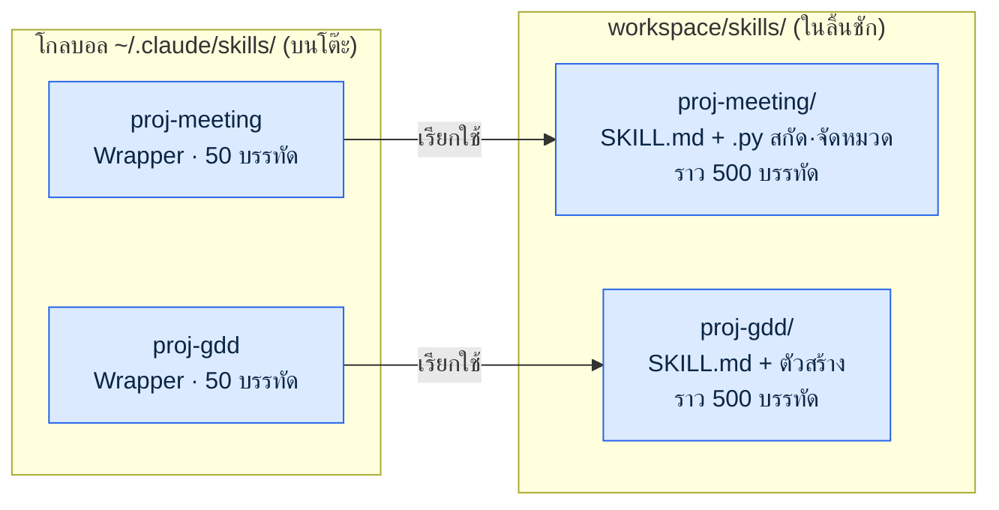
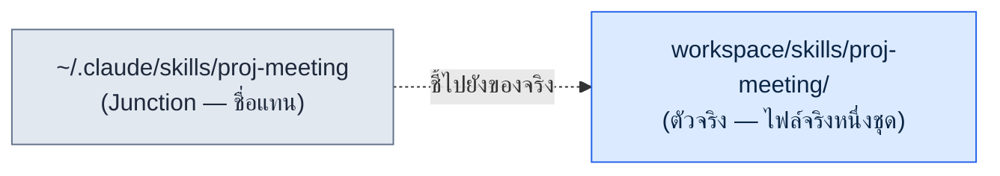
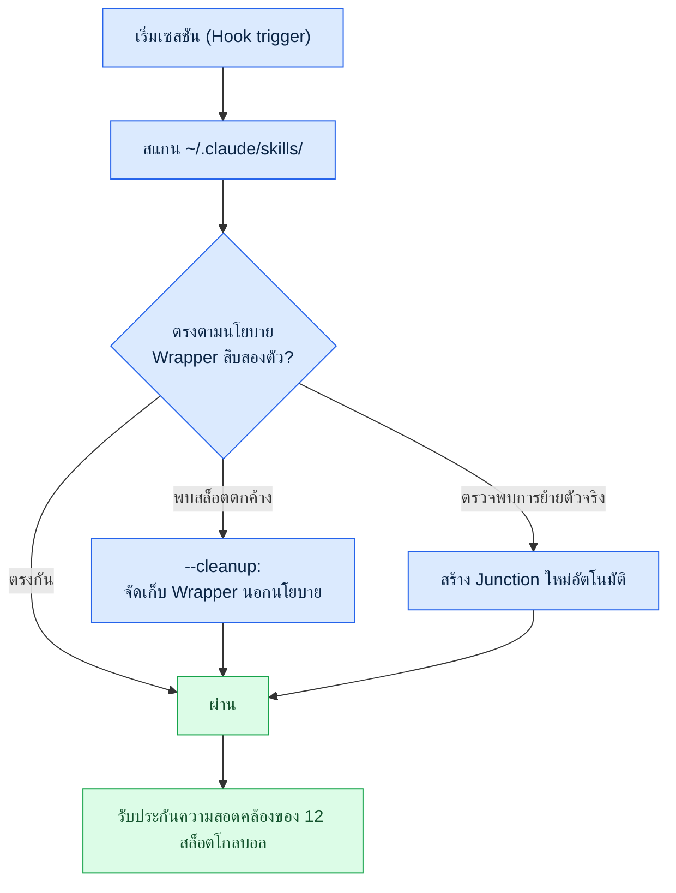
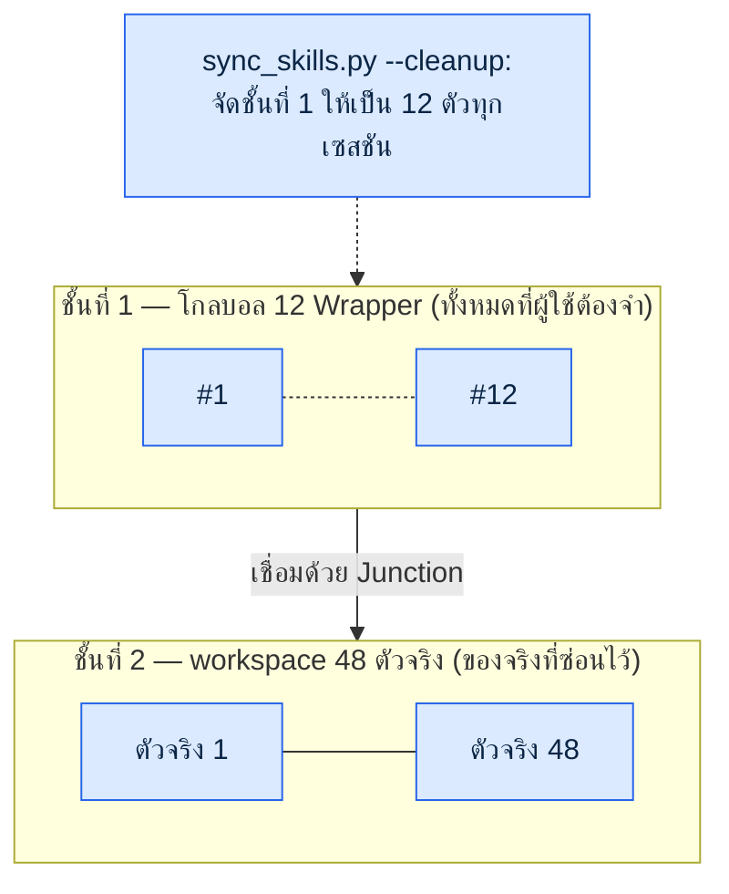
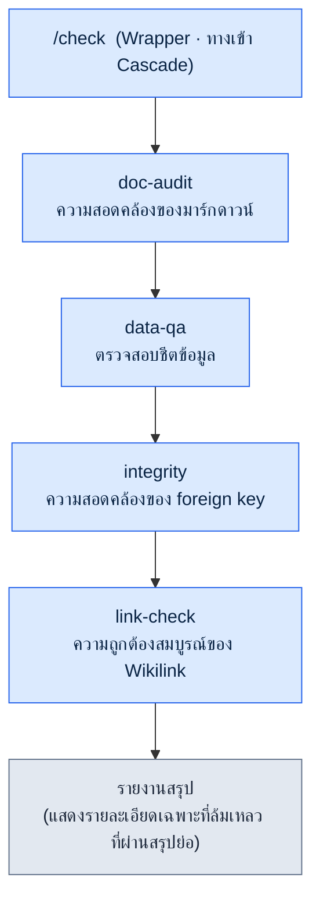
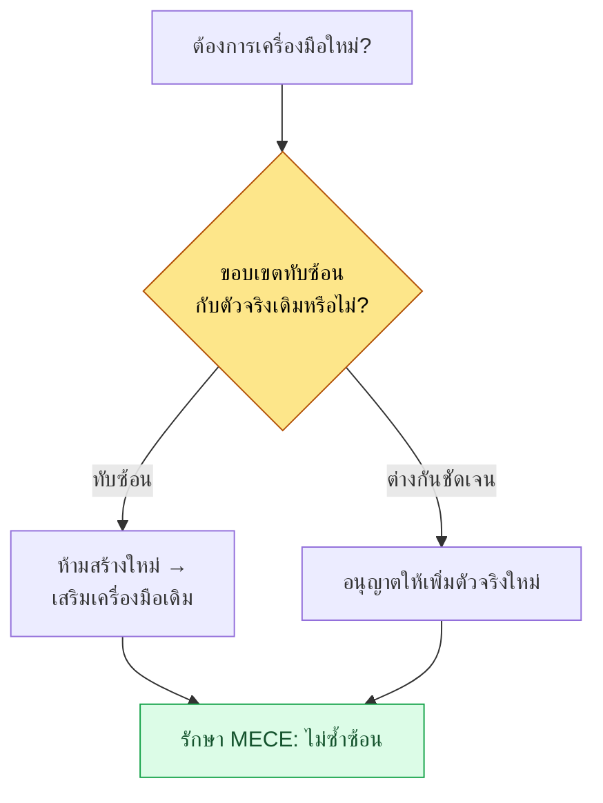

# ส่วนที่ 23 · บทที่ 1 รูปแบบ Wrapper·Cascade·Junction

> อย่าเพิ่มจำนวนเครื่องมือ แต่จงสร้างเครื่องมือของเครื่องมือ นี่คือเรื่องราวของโครงสร้างสองชั้นที่ซ่อนตัวจริง 48 ตัวไว้หลังจุดเข้าใช้ระดับโกลบอล 12 จุด และการทำงานอัตโนมัติที่รักษาความสอดคล้องของโครงสร้างนั้นไว้โดยไม่ต้องใช้มือคน

---

เย็นวันหนึ่งระหว่างที่ผมกำลังทำการทบทวนรายเดือน ผมนับรายการคำสั่งสแลช (slash command) ไปเรื่อย ๆ แล้วมือก็หยุดชะงัก มันมีอยู่สี่สิบคำสั่ง ทั้งที่เมื่อครึ่งปีก่อนเริ่มต้นด้วยเจ็ดแปดคำสั่งแท้ ๆ แต่พอสร้างเครื่องมือบันทึกการประชุมหนึ่งตัว เพิ่มเครื่องมือตรวจสอบข้อมูลอีกหนึ่งตัว เติมตัวสร้าง GDD (Game Design Document, เอกสารสเปกฉบับละเอียด) อีกหนึ่งตัว แบบนี้สัปดาห์ละหนึ่งถึงสองตัว ไม่ทันรู้ตัวมันก็กลายเป็นสี่สิบคำสั่ง และในจำนวนนั้นเกือบครึ่งหนึ่งไม่ได้ถูกเรียกใช้แม้แต่ครั้งเดียวตลอดเดือนที่ผ่านมา

ปัญหาอยู่ตรงที่เครื่องมือที่ไม่ได้ใช้ไม่ได้เพียงแค่นั่งเงียบ ๆ อยู่ตรงนั้น ทุกครั้งที่เริ่มเซสชัน ข้อกำหนดของคำสั่งสแลชทั้งสี่สิบตัวจะถูกโหลดเข้ามาทั้งหมด มันกัดกินงบประมาณโทเค็น ทำให้คำสั่งที่ชื่อคล้ายกัน (`skill-design`·`skill-design-new`·`skill-design-template`) ชวนสับสน และพอจะนึกถึงเครื่องมือที่ต้องการจริง ๆ ก็ต้องใช้เวลา เครื่องมือไม่ได้ช่วยทำงาน แต่การจัดการเครื่องมือกลับกลายเป็นงานเสียเอง

บทนี้ว่าด้วยกระบวนการที่ลดสี่สิบตัวให้เหลือสิบสองตัวระดับโกลบอล โดยไม่ทิ้งตัวจริงที่เหลือไปแม้แต่ตัวเดียว หัวใจอยู่ที่รูปแบบสามอย่าง **Wrapper** ที่สร้างจุดเข้าใช้แบบเบา **Cascade** ที่มัดเครื่องมือหลายตัวไว้ในทางเข้าเดียว และ **Junction** ที่เชื่อมจุดเข้าใช้กับตัวจริงเข้าด้วยกันในเชิงกายภาพ และ `sync_skills.py` ที่รักษาความสอดคล้องของทั้งสามอย่างนี้แทนคน

---

## 23.1.1 สัญญาณเชิงปริมาณที่ค้นพบจากการทบทวน

ความรู้สึกว่ามีเครื่องมือเยอะนั้นใคร ๆ ก็มี แต่ความรู้สึกอย่างเดียวตัดสินไม่ได้ว่าควรลดอะไร สิ่งที่ทำให้ตัดสินใจได้คือการวัดความคุ้มค่าของเครื่องมือในการทบทวนรายเดือน

โปรเจกต์นี้ดำเนินการทบทวน (การทบทวน) ในฐานะกลไกพัฒนาตนเอง ขณะที่การทบทวนรายวันสะสมเป็นรายสัปดาห์ และรายสัปดาห์รวมเป็นรายเดือน การทบทวนรายเดือนจะคำนวณย้อนกลับจากบันทึก commit ของ SVN ว่า "เดือนที่ผ่านมาใช้เครื่องมือไหนไปกี่ครั้ง" คะแนนที่ใช้ในการวัดนี้คือ `skill_audit_score` มันติดตามว่าคำสั่งสแลชแต่ละตัวปรากฏในผลงานจริงมากเพียงใดผ่านประวัติ commit แล้วให้คะแนนความถี่ในการใช้งาน

การกระจายตัวที่เผยออกมาในการวัดของเดือนนั้นเป็นดังนี้ (อัตราการใช้งานเป็นค่าวัดจริงจากบันทึก commit ของ SVN และเป็นสัดส่วนการปรากฏของแต่ละเครื่องมือ ไม่ใช่จำนวนครั้งที่เรียกใช้จริงในเชิงสัมบูรณ์)

<svg viewBox="0 0 640 220" xmlns="http://www.w3.org/2000/svg" font-family="sans-serif" font-size="13">
  <rect x="0" y="0" width="640" height="220" fill="#fafafa" stroke="#ddd"/>
  <text x="20" y="30" font-weight="bold" font-size="15">คำสั่งสแลช 40 ตัว — การกระจายความถี่การใช้งาน</text>

  <!-- TOP 12 bar -->
  <rect x="20" y="55" width="500" height="40" fill="#2c7be5"/>
  <text x="30" y="80" fill="#fff" font-weight="bold">คำสั่ง TOP 12</text>
  <text x="530" y="80" fill="#2c7be5" font-weight="bold">92% ของการใช้งาน</text>

  <!-- middle group -->
  <rect x="20" y="105" width="55" height="40" fill="#a6c8f0"/>
  <text x="85" y="130" fill="#555">ใช้งานปานกลาง 10 ตัว — ราว 8%</text>

  <!-- tail group -->
  <rect x="20" y="155" width="18" height="40" fill="#e0e0e0" stroke="#bbb"/>
  <text x="85" y="180" fill="#999">ใช้ไม่ถึงเดือนละครั้ง 18 ตัว (45% ของทั้งหมด) — เกือบ 0%</text>

  <text x="20" y="212" fill="#888" font-size="11">ที่มา: skill_audit_score จากการทบทวนรายเดือน คำนวณย้อนจากบันทึก commit ของ SVN / อัตราเป็นค่าวัดจริงของสัดส่วนการปรากฏ</text>
</svg>

สิบสองตัวบนสุดครองสัดส่วน 92% ของการใช้งานทั้งหมด ส่วนคำสั่งที่ไม่ได้ใช้แม้แต่เดือนละครั้งมีสิบแปดตัว คิดเป็น 45% ของทั้งหมด คำตอบจึงถูกกำหนดไว้ครึ่งหนึ่งแล้ว คือเปิดเผยเฉพาะสิบสองตัวที่ใช้บ่อยไว้ที่ระดับโกลบอล แล้วจัดการตัวที่เหลือ

ปัญหาอยู่ที่ "การจัดการ" ไม่ใช่ "การลบทิ้ง" เครื่องมือยี่สิบแปดตัวที่ไม่ได้ใช้ก็ยังจำเป็นในไตรมาสละหนึ่งถึงสองครั้งอยู่ดี ตอนเขียนรายงานครึ่งปี ตอนสร้างสคีมาข้อมูลใหม่ หรือตอนรันการตรวจสอบเฉพาะอย่าง เวลานั้นถ้าไม่มีเครื่องมือ งานก็จะหยุดอยู่กับที่ ฉะนั้นคำถามที่แท้จริงคือข้อนี้ **จะทำอย่างไรให้เห็นแค่สิบสองตัว แต่ยังเก็บยี่สิบแปดตัวไว้ได้**

อุปมาเรื่องโต๊ะทำงานคือสิ่งที่ร้อยเรียงทั้งบทนี้เข้าด้วยกัน ไม่มีใครวางปากกาสี่สิบด้ามไว้บนโต๊ะแล้วใช้ทุกวัน เราวางเฉพาะปากกาสิบสองด้ามที่ใช้บ่อยไว้บนโต๊ะ แล้วเก็บที่เหลือไว้ในลิ้นชัก แม้แต่ในลิ้นชักก็รวบรวมชนิดเดียวกันไว้ในกระบอกเดียว Wrapper คือจุดเข้าใช้แบบเบาที่วางไว้บนโต๊ะ Junction คือทางเชื่อมระหว่างลิ้นชักกับโต๊ะ ส่วน Cascade คือมัดปากกาที่มัดรวมไว้ในกระบอกเดียว

---

## 23.1.2 รูปแบบ Wrapper — จุดเข้าใช้แบบเบา ตัวจริงแบบหนัก

Wrapper คือเปลือกบาง ๆ ของคำสั่งสแลช ที่ระดับโกลบอลวางไว้แค่จุดเข้าใช้ ส่วนตรรกะจริงวางไว้ที่ตัวจริงใน workspace ในไดเรกทอรีโกลบอลมีเอกสารแนะนำ 50 บรรทัด ส่วนในตัวจริงมีโค้ดที่ implement จริง 500 บรรทัดอาศัยอยู่



การแยกส่วนนี้สร้างประโยชน์ห้าอย่าง เมื่อเริ่มเซสชันจะโหลดแค่ 50 บรรทัดที่ระดับโกลบอลจึงประหยัดโทเค็น ตัวจริงแก้ไขทุกวันก็ไม่กระทบสล็อตโกลบอล จะวางตัวจริงไว้ที่ SVN หรือ Git หรือที่ใดก็ได้ วางตัวจริงไว้ในโฟลเดอร์แชร์ของทีมแล้ววางแค่ Wrapper ไว้ที่โกลบอลส่วนตัวจึงแชร์ได้ง่าย และถ้ารวมรูปแบบของ Wrapper ให้เป็นมาตรฐานเดียวกัน ประสบการณ์ผู้ใช้ก็จะสอดคล้องกัน

รูปแบบมาตรฐานของ Wrapper เป็นดังนี้ Wrapper ทุกตัวใช้โครงร่างนี้ร่วมกัน

```markdown
---
name: proj-meeting
description: วิเคราะห์บันทึกการประชุม·สกัดการตัดสินใจ (ตัวจริง: workspace/skills/proj-meeting/)
---

# /proj-meeting — Wrapper

ตำแหน่งตัวจริง: workspace/skills/proj-meeting/SKILL.md

## การทำงาน
Wrapper นี้เรียกสคริปต์เข้าใช้ของตัวจริง ตรรกะรายละเอียดนิยามไว้ในตัวจริง
เมื่อตัวจริงเปลี่ยน เพียงปรับ description ของ Wrapper นี้ก็พอ (แนะนำให้ซิงค์อัตโนมัติ)
```

หัวใจคือมีเพียง description หนึ่งบรรทัดกับตัวชี้ไปยังตัวจริงเท่านั้น ในวินาทีที่ตรรกะเข้าไปอยู่ใน Wrapper มันก็จะหนักขึ้น และการซิงค์กับตัวจริงก็จะเริ่มแตก ฉะนั้นจึงบังคับเป็นกฎให้ Wrapper อยู่ภายใน 100 บรรทัด

สล็อตคำสั่งสแลชระดับโกลบอลของโปรเจกต์นี้มัดไว้ที่สิบสองตัว เครื่องมือที่ใช้บ่อยทั้งหมดต้องเข้าให้ได้ภายในสิบสองตัวนี้ และเกณฑ์การคัดเลือกให้การทบทวนรายเดือนเป็นผู้ดู ใช้งานตั้งแต่เดือนละ 5 ครั้งขึ้นไป สมดุลของสาขา (เครื่องมือสาขาหนึ่งต้องไม่เกินหกตัว) ความสอดคล้องของการเข้าใช้ (รวมกฎการตั้งชื่อให้เป็นหนึ่งเดียว) ถ้าเกินสิบสองตัวก็เลิกใช้ตัวที่ใช้น้อยที่สุดหนึ่งตัว หรือควบรวมเข้ากับคำสั่งอื่น

เลขสิบสองไม่ได้เป็นค่าสัมบูรณ์ หัวใจอยู่ที่ข้อเท็จจริงที่ว่ามีจำนวนกำหนดไว้ต่างหาก หากเป็นทีมขนาดเล็ก (\~10 คน) สิบตัวอาจพอเหมาะ หากเป็นทีมที่มีสาขาเยอะ สิบห้าตัวอาจเหมาะกว่า ต้องมีเพดานที่กำหนดไว้ ภาระทางความคิด (cognitive load) จึงจะอยู่ที่ระดับคงที่

---

## 23.1.3 รูปแบบ Junction — การเชื่อมเชิงกายภาพระหว่างตัวจริงกับจุดเข้าใช้

ถ้า Wrapper คือกฎที่ว่า "ที่โกลบอลวางแค่จุดเข้าใช้แบบเบา" Junction ก็คือวิธีการที่ implement กฎนั้นในระดับระบบปฏิบัติการ Junction คือ symbolic link ของไดเรกทอรี กล่าวคือชื่อแทน (alias) ที่ระบบปฏิบัติการมีให้



เมื่อผู้ใช้มองเข้าไปที่ตำแหน่งโกลบอล จะดูเหมือนว่าตัวจริงอยู่ตรงนั้น แต่ไฟล์จริงมีอยู่เพียงชุดเดียวที่ตำแหน่งตัวจริง ฝั่งโกลบอลเป็นเพียงป้ายบอกทางที่ชี้ไปยังที่นั่นเท่านั้น

ประโยชน์ที่โครงสร้างนี้ให้มานั้นชัดเจน เมื่อแก้ตัวจริงจะสะท้อนที่โกลบอลทันที (ไม่มีขั้นตอนคัดลอก) เพราะไฟล์มีอยู่เพียงชุดเดียวจึงประหยัดดิสก์ และเพราะที่โกลบอลมีแค่ Junction จึงไม่มี Git conflict (ตัวจริงจัดการแยกใน SVN/Git) แม้จะย้ายตัวจริง เพียงเชื่อม Junction ใหม่ ผู้ใช้ก็ไม่เห็นความเปลี่ยนแปลงใด ๆ

แต่ละ OS มีวิธีเชื่อมต่างกัน บน Windows สร้าง junction ของไดเรกทอรีด้วย `mklink /J <link> <target>` โดยไม่ต้องใช้สิทธิ์ผู้ดูแลระบบ ส่วน Linux และ macOS ใช้ `ln -s <target> <link>` และ WSL ใช้คำสั่ง Linux ได้เลย ความต่างของแพลตฟอร์มนี้ `sync_skills.py` ที่จะกล่าวถึงในภายหลังจะจัดการให้อัตโนมัติ ผู้ดำเนินการจึงไม่จำเป็นต้องจำคำสั่งของแต่ละ OS เอง

หากไม่ใช้ Junction แต่ดำเนินการด้วยการคัดลอก ในวินาทีที่ตัวจริงกับสำเนาโกลบอลแยกออกจากกันก็จะเกิดอุบัติเหตุการซิงค์ เช่น แก้บั๊กที่ตัวจริงแล้ว แต่สำเนาโกลบอลเป็นเวอร์ชันเก่าจึงทำงานแบบเก่า Junction กำจัดความเป็นไปได้ของอุบัติเหตุนี้ตั้งแต่ต้น ป้ายบอกทางจะมีสองอันไม่ได้ และของจริงมีหนึ่งเดียวเสมอ

---

## 23.1.4 sync_skills.py — เครื่องมือที่รักษาความสอดคล้องแทนคน

ถ้าจัดการ Wrapper กับ Junction ด้วยมือ สุดท้ายก็จะกลับไปเป็นสี่สิบตัว คนเรามักผัดผ่อนการจัดเก็บ ลืมนโยบาย และสร้างข้อยกเว้น ฉะนั้นจึงทำให้การรักษาความสอดคล้องเป็นอัตโนมัติ เครื่องมือนั้นคือ `sync_skills.py`

ทุกครั้งที่เซสชันเริ่ม Hook จะ trigger สคริปต์นี้ สิ่งที่สคริปต์ทำเป็นไปตามกระแสต่อไปนี้



ฟังก์ชันหลักมีสามอย่าง หนึ่ง สแกนไดเรกทอรีโกลบอลแล้วตรวจว่าตรงตามนโยบาย Wrapper สิบสองตัวหรือไม่ สอง จัดเก็บ Wrapper ตกค้างที่ไม่อยู่ในนโยบายด้วยแฟล็ก `--cleanup` ถ้าใครเพิ่มเครื่องมือชั่วคราวไว้แล้วยังค้างอยู่ในสล็อต มันจะถูกจัดเก็บเมื่อเริ่มเซสชันถัดไป สล็อตจึงไม่พุ่งทะลักอีก สาม ถ้าตำแหน่งตัวจริงเปลี่ยน ก็เชื่อม Junction ใหม่ให้อัตโนมัติ โดยตรวจจับ OS ถ้าเป็น Windows ก็เรียก `mklink /J` ถ้านอกเหนือจากนั้นก็เลือก `ln -s`
เรื่องสำคัญคือฟังก์ชันทั้งสามถูกออกแบบให้ **idempotent (ให้ผลคงเดิมเมื่อรันซ้ำ)** เพราะเป็นเครื่องมือที่ทำงานอัตโนมัติทุกครั้งที่เริ่มเซสชัน ฉะนั้นต่อให้รันซ้ำกี่ครั้งบนสถานะเดิม ผลลัพธ์ก็ต้องเหมือนกับรันเพียงครั้งเดียว Wrapper ที่ตรงตามนโยบายอยู่แล้วจะไม่ถูกแตะต้อง Junction ที่เชื่อมไว้ถูกต้องแล้วจะไม่ถูกเชื่อมซ้ำ และถ้าไม่มีสล็อตตกค้างให้จัดเก็บก็จะไม่ลบอะไรเลย หากไม่ idempotent การจัดเก็บแบบเดิมจะทับซ้อนกันทุกเซสชัน จนเกิดอุบัติเหตุสร้าง Junction ที่ดีอยู่แล้วใหม่ หรือแตะต้องตัวจริงผิด ๆ ซึ่งในเครื่องมือที่ทำงานไร้คนทุกเซสชัน นี่ย่อมนำไปสู่อุบัติเหตุการซิงค์โดยตรง ฉะนั้น `sync_skills.py` จึงตั้ง "แตะเฉพาะสิ่งที่เปลี่ยน และถ้าไม่มีอะไรเปลี่ยนก็ไม่แตะ" ไว้เป็นค่าคงที่ (invariant)

ผลของ `--cleanup` เชื่อมโยงตรงกับการปกป้องงบประมาณโทเค็น เมื่อมัดข้อกำหนดสแลชที่โหลดเข้าโกลบอลทุกเซสชันไว้ที่สิบสองตัว ต่อให้ตัวจริงเพิ่มเป็นสี่สิบแปดตัว ต้นทุนการเริ่มเซสชันก็คงที่ และเพราะคนไม่ต้องจัดการด้วยมือ นโยบายจึงไม่กระเจิง

ความสอดคล้องอัตโนมัตินี้คือสลักนิรภัยของโครงสร้างสองชั้น Wrapper กับ Junction สร้างโครงสร้าง ส่วน `sync_skills.py` รักษาโครงสร้างนั้นไว้แม้เวลาผ่านไป

---

## 23.1.5 โครงสร้างสองชั้น — โกลบอล 12 wrapper → workspace 48 ตัวจริง

เมื่อรูปแบบสามอย่างกับความสอดคล้องอัตโนมัติมารวมกัน โครงสร้างสองชั้นต่อไปนี้ก็เสร็จสมบูรณ์ ชั้นบนมีจุดเข้าใช้สิบสองจุดที่ผู้ใช้ต้องจำ ชั้นล่างมีตัวจริงสี่สิบแปดตัว



ผู้ใช้จำแค่สิบสองตัวระดับโกลบอลเท่านั้น แม้จะมีตัวจริงสี่สิบแปดตัวซ่อนอยู่ด้านหลัง ภาระทางความคิดก็อยู่ที่สิบสองตัว Wrapper ทำให้จุดเข้าใช้เบา Junction เชื่อมจุดเข้าใช้กับตัวจริง และ `sync_skills.py` รักษาความสอดคล้องของสิบสองตัวนั้นไว้ทุกเซสชัน

เมื่อดูเป็นสัดส่วน จุดเข้าใช้ต่อตัวจริงเป็น 1 ต่อ 4 (12 ต่อ 48) ต่อให้เพิ่มเครื่องมือ สิ่งที่ผู้ใช้ต้องจำก็ไม่เพิ่ม ต่อให้ตัวจริงเพิ่มเป็นหกสิบตัว แปดสิบตัว ชั้นที่ 1 ก็ยังคงเป็นสิบสองตัว นี่คือการ implement จริงของประโยค "อย่าเพิ่มจำนวนเครื่องมือ แต่จงสร้างเครื่องมือของเครื่องมือ" สิ่งที่เพิ่มคือชั้นที่ 2 (ตัวจริง) ส่วนชั้นที่ 1 (จุดเข้าใช้) ที่ผู้ใช้เผชิญหน้านั้นคงที่

---

## 23.1.6 รูปแบบ Cascade — การเรียกต่อเนื่องที่มัดไว้ในทางเข้าเดียว

ถ้าโครงสร้างสองชั้นคือรูปแบบที่ "ลดเครื่องมือมากให้เหลือจุดเข้าใช้น้อย" Cascade ก็คือรูปแบบที่ "มัดเครื่องมือที่มักใช้ร่วมกันไว้ในการเรียกครั้งเดียว" คำสั่งสแลชหนึ่งเรียกเครื่องมือย่อยหลายตัวตามลำดับ แล้วออกผลลัพธ์เป็นรายงานสรุปฉบับเดียว

Cascade ตัวแทนของโปรเจกต์นี้คือ `check` ผมรวมเครื่องมือสี่ตัวที่ใช้ตรวจสอบความถูกต้องสมบูรณ์ของข้อมูลออกแบบทุกเช้าให้เป็นหนึ่งเดียว



เมื่อก่อนทุกเช้าผมเรียกเครื่องมือสี่ตัวแยกกันทีละตัว ตรวจเอกสารหนึ่งครั้ง ตรวจข้อมูลหนึ่งครั้ง ตรวจ foreign key หนึ่งครั้ง ตรวจลิงก์หนึ่งครั้ง ต่องานหนึ่งรอบต้องเรียกด้วยมือสามถึงสี่ครั้ง `check` มัดทั้งสี่ตัวนี้ไว้ในคำสั่งเดียว พอเรียกครั้งเดียวก็จะรันสี่ขั้นตามลำดับ แล้วผลลัพธ์ก็รวมเป็นหนึ่ง

การออกแบบ Cascade มีหลักการ แต่ละขั้นต้องเรียกเดี่ยวได้ด้วย (`data-qa` ต้องเรียกแยกเองได้) เมื่อล้มเหลวจะหยุดหรือไปต่อให้ตั้งค่าเป็นรายขั้น งานตรวจสอบนั้นต่อให้ขั้นหนึ่งล้มเหลวก็รันที่เหลือต่อเพื่อดูภาพรวมทั้งหมด ส่วนงานเปลี่ยนแปลงนั้นถ้าขั้นหนึ่งล้มเหลวก็หยุดทันที ผลลัพธ์สะสมต่อเป็น input ของขั้นถัดไป และรายงานสรุปใช้รูปแบบเดียวกันในทุก Cascade

นิยามจริงของ `check` เป็นดังนี้ (เป็นการรวมการตรวจสอบ 4 ชนิดไว้เป็นหนึ่ง)

```yaml
cascade:
  - step: doc-audit
    purpose: ความสอดคล้องของมาร์กดาวน์ (YAML frontmatter·ลิงก์·การอ้างอิง atom)
    fail_action: continue
  - step: data-qa
    purpose: ตรวจสอบชีตข้อมูล Excel (สคีมา·ช่วงค่า·คอลัมน์ที่จำเป็น)
    fail_action: continue
  - step: integrity
    purpose: ความสอดคล้องของ foreign key (การอ้างอิงระหว่างชีต)
    fail_action: continue
  - step: link-check
    purpose: ความถูกต้องสมบูรณ์ของ Wikilink·ลิงก์ภายนอก
    fail_action: continue

report:
  format: markdown
  include_pass: false   # รายการที่ผ่านแสดงแค่สรุป แสดงรายละเอียดเฉพาะที่ล้มเหลว
  group_by: severity
```

ที่ `fail_action: continue` ติดอยู่ในทั้งสี่ขั้นเพราะนี่คือ Cascade ตรวจสอบ ต่อให้การตรวจหนึ่งล้มเหลวก็รันอีกสามที่เหลือต่อให้จบ เพื่อดูรายการข้อบกพร่องทั้งหมดของวันนั้นในครั้งเดียว รายงานพับรายการที่ผ่านไว้เป็นแค่สรุปแล้วกางเฉพาะที่ล้มเหลว เพื่อรวมสายตาไปยังสิ่งที่ต้องดูในตอนเช้า

Cascade ก็มีกับดักเช่นกัน ถ้าเพิ่มขั้นไม่มีที่สิ้นสุด ความซับซ้อนจะระเบิด ฉะนั้นเช่นเดียวกับนโยบาย 12 สล็อต Cascade ก็ตั้งเพดานจำนวนขั้นไว้ ถ้าเกินประมาณห้าถึงเจ็ดขั้นก็แยกเป็นสองหรือแยกบางส่วนออกเป็น Cascade ต่างหาก

---

## 23.1.7 การคัดสรรเครื่องมือ — นโยบาย MECE Wrapper

เมื่อโครงสร้างสองชั้นกับ Cascade เข้าที่ การเพิ่มตัวจริงก็กลายเป็นเรื่องง่าย เพราะแค่เพิ่มตัวจริงเข้า workspace โดยไม่ต้องแตะสล็อตโกลบอลก็พอ แต่ตรงนี้แหละที่กับดักใหม่ก่อตัวขึ้น เมื่อการเพิ่มกลายเป็นเรื่องง่าย เครื่องมือคล้าย ๆ กันก็จะสะสมซ้ำซ้อน

ฉะนั้นเวลาเพิ่มตัวจริงจึงบังคับนโยบายหนึ่งอย่าง นั่นคือ **นโยบาย MECE Wrapper** เมื่อจะเพิ่มเครื่องมือใหม่ ให้ตัดสินสองแพร่ง ถ้าขอบเขตทับซ้อนกับเครื่องมือเดิม อย่าสร้างใหม่แต่ให้เสริมเครื่องมือเดิม สร้างใหม่ต่อเมื่อขอบเขตต่างกันชัดเจนเท่านั้น หมายความว่ารักษารายการตัวจริงให้ไม่ซ้ำซ้อนกัน (Mutually Exclusive) และไม่ตกหล่น (Collectively Exhaustive)



การทบทวนเป็นตัวหนุนการตัดสินนี้ เพราะ `skill_audit_score` วัดความถี่การใช้ของแต่ละเครื่องมือจากบันทึก SVN สัญญาณอย่าง "เครื่องมือนี้จริง ๆ แล้วทำงานแทบเหมือนกับเครื่องมือนั้น แต่ทั้งคู่แทบไม่ได้ใช้" จึงถูกจับได้ จากนั้นก็รวมทั้งสองเป็นหนึ่ง หรือถอดตัวที่ใช้น้อยกว่าออกจากตัวจริง การคัดสรรนั้นการจัดระเบียบสำคัญพอ ๆ กับการเพิ่ม

หากไม่มีนโยบาย MECE "เสรีภาพในการเพิ่มตัวจริง" ที่โครงสร้างสองชั้นสร้างขึ้นจะกลับกลายเป็นพิษ ต่อให้ตัวจริงไม่ไปกัดกินสล็อตชั้นที่ 1 แต่ถ้าตัวจริงเองบวมขึ้นด้วยความซ้ำซ้อน เราก็จะเริ่มสับสนอีกว่าควรใช้ตัวจริงไหน นโยบายนั้นป้องกันการบวมนี้

---

## 23.1.8 เหตุใดการทบทวนจึงจุดประกายทั้งหมดนี้

ถึงตรงนี้ลองย้อนกลับไปที่จุดเริ่มต้น ทั้ง Wrapper ทั้ง Junction ทั้ง Cascade ทั้งนโยบาย MECE ไม่มีอันไหนเลยที่ออกแบบไว้ล่วงหน้าจากบนโต๊ะ ทั้งหมดเกิดขึ้นในฐานะคำตอบต่อปัญหาที่ค้นพบจากการทบทวน

เมื่อ `skill_audit_score` ในการทบทวนรายเดือนเผยให้เห็นเป็นปริมาณถึงสล็อตสี่สิบตัวและการกระจุกตัวของการใช้งานที่ 92% "มาจำกัดไว้สิบสองตัวกันเถอะ" ก็ถูกตัดสิน หลังการตัดสินนั้นก็ตามมาด้วยคำถาม "แล้วจะเก็บยี่สิบแปดตัวไว้อย่างไร" และคำตอบนั้นคือ Wrapper กับ Junction ในการทบทวนครั้งถัดมาเกิดการค้นพบว่า "การเรียกเครื่องมือตรวจสอบที่คล้ายกันสี่ตัวแยกกันทุกเช้านั้นยุ่งยาก" และคำตอบนั้นคือ Cascade `check` ในการทบทวนอีกครั้งหนึ่งจับสัญญาณได้ว่า "พอเพิ่มตัวจริงง่ายขึ้น ความซ้ำซ้อนก็สะสม" และคำตอบนั้นคือนโยบาย MECE

ถ้าไม่มีการทบทวน รูปแบบเหล่านี้ก็คงไม่ถูกสร้างขึ้น และต่อให้สร้าง มันก็คงกลายเป็น over-engineering ที่ไม่เกี่ยวกับปัญหาจริง ลำดับที่ค้นพบปัญหาด้วยการวัดก่อนแล้วจึงนำรูปแบบเข้ามา ลำดับนั้นแหละที่ทำให้เครื่องมือถูกใช้จริง ข้อความของส่วนที่ 21 ที่ว่าการทบทวนคือจุดเริ่มต้นของการพัฒนาตนเอง ได้แปรเป็นรูปธรรมในระดับเครื่องมือเช่นนี้

---

## 23.1.9 กรณีการดำเนินงาน — สะสม 6 เดือน

ผมเปรียบเทียบค่าวัดหกเดือนก่อนและหลังนำมาใช้ โดยมุ่งความสนใจไปที่การเปลี่ยนแปลงของภาระการดำเนินงาน ไม่ใช่จำนวนครั้งที่เรียกใช้ในเชิงสัมบูรณ์

| รายการ | ก่อนนำมาใช้ | หลังนำมาใช้ (Wrapper+Cascade+Junction) |
|---|---|---|
| จำนวนสล็อตโกลบอล | 40 ตัว (พุ่งทะลัก) | 12 ตัว (บังคับตามนโยบาย) |
| จำนวนตัวจริง | กระจัดกระจาย·ซ้ำซ้อนมาก | 48 ตัว (จัดด้วย MECE) |
| สัดส่วนสล็อตโกลบอลตอนเริ่มเซสชัน | มาก (โหลดข้อกำหนด 40 ตัว) | น้อย (โหลดเฉพาะข้อกำหนด 12 ตัว) |
| การสะท้อนสู่โกลบอลหลังแก้ตัวจริง | ต้องมีขั้นตอนคัดลอกด้วยมือ | ทันที (Junction, ไม่มีการคัดลอก) |
| การเรียกเครื่องมือตรวจสอบที่คล้ายกัน | 3\~4 ครั้งด้วยมือต่องาน | 1 ครั้ง (check Cascade) |

ค่าวัดของเดือนแรกที่นำมาใช้นั้นกระท่อนกระแท่น ก่อนรูปแบบ Wrapper จะเข้าที่ เกิดอุบัติเหตุการซิงค์สองสามครั้ง และก่อนนโยบายสิบสองตัวจะถูกบังคับ สล็อตก็แกว่งอยู่ระหว่างสิบห้าถึงสิบแปด การเริ่มเสถียรเป็นตั้งแต่เดือนที่สอง หลังจาก `sync_skills.py --cleanup` เริ่มจัดสล็อตทุกเซสชัน การพุ่งทะลักของสล็อตก็ไม่เกิดขึ้นอีก

การแสดงทิศทางอย่าง "สัดส่วน"·"ต้องมี"·"ทันที" ในตารางนั้นจงใจ เพราะต้นทุนโทเค็นและเวลาต่างกันไปตามสภาพแวดล้อม ผมจึงเขียนแค่ทิศทางของการเปลี่ยนแปลง สิ่งที่แน่ชัดคือชั้นที่ 1 ถูกตรึงจากสี่สิบเหลือสิบสอง และขั้นตอนคัดลอกด้วยมือในการสะท้อนตัวจริงได้หายไป

---

## 23.1.10 ข้อผิดพลาดที่พบบ่อยและวิธีหลีกเลี่ยง

ผมรวบรวมกับดักที่ชี้ไว้ในหัวข้อก่อน ๆ มาไว้ที่เดียว ทั้งห้าอย่างชี้ไปยังบทเรียนเดียวกันว่าการรักษาโครงสร้างไว้แม้เวลาผ่านไปนั้นยากกว่าการสร้างมันขึ้นมา

- **ตรรกะซึมเข้าไปใน Wrapper** ในวินาทีที่จุดเข้าใช้แบบเบาดูดซับส่วนหนึ่งของตัวจริง การซิงค์ก็แตก → บังคับเป็นกฎให้อยู่ภายใน 100 บรรทัด (§23.1.2)
- **ดำเนินงานด้วยการคัดลอกแทน Junction** ถ้าตัวจริงกับสำเนาแยกออกจากกัน เวอร์ชันเก่าก็จะทำงานแบบเก่า → Junction ไม่ใช่ตัวเลือกแต่เป็นสิ่งจำเป็น (§23.1.3)
- **เพิ่มขั้น Cascade ไม่มีที่สิ้นสุด** ถ้าเกินห้า\~เจ็ดขั้น ความซับซ้อนจะระเบิด → ตั้งเพดานจำนวนขั้น (§23.1.6)
- **จัดการ 12 สล็อตด้วยมือ** ถ้าไม่มีกลไกบังคับ มันจะพุ่งทะลักอีกแน่นอน → `sync_skills.py --cleanup` จัดทุกเซสชัน (§23.1.4)
- **นำรูปแบบเข้ามาก่อนโดยไม่มีการทบทวน** ถ้าสร้างโครงสร้างก่อนการวัด โครงร่างที่ไม่ถูกใช้ก็จะเหลือค้าง → ลำดับ วัด → ค้นพบ → รูปแบบ (§23.1.8)

---

## ลองทำดู (setup → prompt → verify)

**setup.** สร้างไดเรกทอรีตัวจริงหนึ่งตัวใน workspace (เช่น `workspace/skills/proj-meeting/`) วาง `SKILL.md` และสคริปต์จริงไว้ข้างใน ส่วนที่โกลบอล `~/.claude/skills/` ให้วางเฉพาะ Wrapper 50 บรรทัด

**prompt.** ขอสิ่งต่อไปนี้ต่อ Claude

```
สแกนรายการคำสั่งสแลชใน ~/.claude/skills/ ให้หน่อย
จัดหมวดว่าแต่ละคำสั่งเป็น (a) Wrapper แบบเบาที่มีแค่ตัวชี้ไปยังตัวจริง
หรือ (b) คำสั่งแบบหนักที่มีตรรกะเข้าไปอยู่
แล้วสำหรับตัวที่เข้าข่าย (b) ให้แยกตัวจริงออกไปยัง workspace
และเสนอแผนการเปลี่ยนแปลงที่เหลือไว้ที่โกลบอลแค่ Wrapper 50 บรรทัด
จากนั้นออกคำสั่งเชื่อม Junction ที่ชี้ไปยังตัวจริงให้เหมาะกับ OS
(ถ้าเป็น Windows ใช้ mklink /J ถ้านอกเหนือจากนั้นใช้ ln -s) ให้ด้วย
```

**verify.** ตรวจสามอย่าง หนึ่ง แต่ละรายการในไดเรกทอรีโกลบอลอยู่ภายใน 100 บรรทัดหรือไม่ สอง เมื่อเปิดรายการโกลบอลแล้วเห็นแค่ตำแหน่งตัวจริงหนึ่งบรรทัดกับ description หรือไม่ สาม เมื่อแก้ตัวจริงหนึ่งบรรทัดแล้วเรียกใช้จากโกลบอล การแก้สะท้อนทันทีหรือไม่ (ถ้า Junction เชื่อมถูกต้อง การแก้จะสะท้อนโดยไม่มีการคัดลอก)

## ฉบับย่อสำหรับคนเดียว

หากเป็นการดำเนินงานคนเดียวที่ไม่มีทั้งทีมและ SVN ก็ลดทอนแบบนี้ ไม่จำเป็นต้องมี workspace แค่มี Git repository ส่วนตัวหนึ่งก็พอ วางตัวจริงไว้ใน repository นั้น แล้ววางแค่ Wrapper ไว้ที่โกลบอล แม้ไม่มีเครื่องมือวัดอย่าง `skill_audit_score` เพียงลองจดด้วยมือเองว่า "เดือนนี้เรียกคำสั่งไหนจริง ๆ บ้าง" ตอนสิ้นเดือน การกระจุกตัวก็จะเผยออกมา เก็บไว้ที่โกลบอลแค่ห้าถึงเจ็ดตัวบนสุด ที่เหลือก็ถอดลงเป็นตัวจริง ส่วน Cascade นั้น เมื่อมีเครื่องมือที่มักเรียกร่วมกันสองตัวขึ้นไป ก็มัดไว้ในคำสั่งเดียวก็พอ หากสคริปต์รักษาความสอดคล้องอัตโนมัติเป็นภาระเกินไป ก็แทนได้ด้วยนิสัยกวาดสายตามองไดเรกทอรีโกลบอลหนึ่งรอบตอนเริ่มเซสชันใหม่ เมื่อขนาดเล็กลง นิสัยก็ทำงานเดียวกันแทนการทำงานอัตโนมัติ

---

### สรุปประเด็นสำคัญของบท
- อย่าเพิ่มจำนวนเครื่องมือ แต่จงสร้างเครื่องมือของเครื่องมือ — โกลบอล 12 จุดเข้าใช้ ตัวจริง 48 ของจริง
- Wrapper·Junction·sync_skills รักษาความสอดคล้องสองชั้นไว้โดยไม่ต้องใช้มือคน
- ทุกรูปแบบจุดประกายจากการวัดเชิงปริมาณของการทบทวน — วัดก่อน โครงสร้างตามมา

### ตัวอย่างบทถัดไป
- ส่วนที่ 23 · บทที่ 2 บันทึกการนำ Hermes Agent มาใช้
