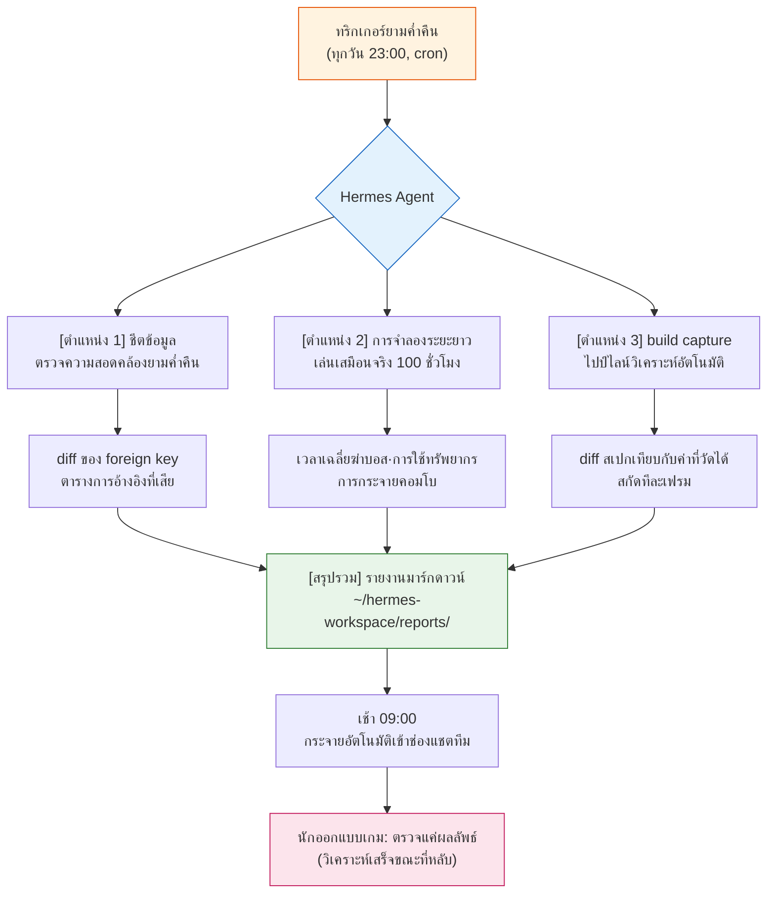

# Part 23 · บทที่ 2 บันทึกการนำ Hermes Agent มาใช้

ห้าทุ่มสี่สิบเจ็ดนาที ผมบันทึกชีตข้อมูลเป็นครั้งสุดท้ายแล้วปิดโน้ตบุ๊ก เช้าวันรุ่งขึ้นเวลาเก้าโมงสิบนาที ระหว่างที่กำลังชงกาแฟ ผมเปิดแชตภายในทีมขึ้นมา แล้วพบว่ามีรายงานหนึ่งฉบับขึ้นมาอยู่ด้านบนของช่อง เป็นมาร์กดาวน์ที่ตรวจสอบไขว้ชีตปรับสมดุลสามแผ่นซึ่งถูกอัปเดตเมื่อคืนตามเกณฑ์ของ foreign key (FK) แล้วทำเครื่องหมายสีแดงไว้บนการอ้างอิงที่เสียสองรายการ ผมไม่ได้เขียนมันขึ้นมา มันถูกสร้างขึ้นในขณะที่ผมหลับ

บทนี้คือบันทึกของกระบวนการที่ผมนำเครื่องมือที่สร้างรายงานฉบับนั้น — Hermes Agent — มาติดตั้งบน PC ส่วนตัว แล้ววางทับการดำเนินงานแบบ Wrapper · Cascade · Junction ที่กล่าวถึงใน §23.1 ตอนเริ่มนำมาใช้ใหม่ ๆ Hermes ยังอิงบน Linux ดังนั้นถ้าจะใช้บน Windows ก็ต้องผ่าน WSL2 แต่ในปี 2026 มี build แบบเนทีฟสำหรับ Windows ออกมา ทำให้ทางอ้อมนั้นหายไป ขอสรุปไว้ก่อนเลยว่า เอเจนต์ไม่ได้เข้ามาแทนที่ Claude Code มันมานั่งข้าง ๆ ต่างหาก

---

## 23.2.1 เครื่องมือสองตัวที่นั่งโต๊ะตัวเดียวกัน

การดำเนินงานจนถึง §23.1 ทั้งหมดมีศูนย์กลางอยู่ที่ Claude Code เมื่อผมป้อนหนึ่งประโยค เครื่องมือก็ตอบกลับหนึ่งครั้ง แล้วผมก็ตรวจคำตอบนั้นก่อนป้อนประโยคถัดไป วงจรสั้น ๆ นี้ดีเยี่ยมสำหรับงานที่ต้องการความแม่นยำ ถ้าเป็นงานแก้ตัวเลขปรับสมดุลตัวเดียวที่ต้องตรวจทุกขั้นตอน การให้คนเข้ามาแทรกทุกครั้งจึงเป็นเรื่องที่ถูกต้อง

ปัญหาอยู่ที่งานที่ใช้เวลายาว คำขออย่าง "อ่านบันทึกการประชุมหนึ่งเดือนที่ผ่านมาทั้ง 30 ฉบับให้หมด แล้วดึงเฉพาะข้อตัดสินใจออกมาเป็นตัวเลือก atom" หากจัดการอยู่ในกระแสบทสนทนา จะต้องไป-กลับถึง 30 ครั้ง และตลอด 30 ครั้งนั้นผมก็ทำอย่างอื่นไม่ได้ สำหรับงานแบบนี้ จุดแข็งของเครื่องมือที่อินพุตและเอาต์พุตติดกันแบบสั้น ๆ กลับกลายเป็นจุดอ่อน

เอเจนต์เข้ามาเติมในตำแหน่งตรงข้ามนั้น เพียงโยนเป้าหมายให้ — "ดึงข้อตัดสินใจจากบันทึกการประชุม 30 ฉบับมาเป็นตัวเลือก atom แล้วทำเป็นรายงาน" — มันก็เลือกเครื่องมือมาใช้เอง เดินผ่านขั้นตอนกลางด้วยตัวเอง และเมื่อเสร็จก็นำเฉพาะผลลัพธ์มาให้ วงจรของมันยาวและเป็นอิสระ แต่ก็มาพร้อมจุดอ่อนที่ว่าคนมองไม่เห็นทุกขั้นตอน

<svg viewBox="0 0 640 280" xmlns="http://www.w3.org/2000/svg" font-family="sans-serif" font-size="13">
  <rect x="0" y="0" width="640" height="280" fill="#fafafa" stroke="#ddd"/>
  <text x="320" y="28" text-anchor="middle" font-size="15" font-weight="bold">เปรียบเทียบวงจรการทำงานของเครื่องมือสองตัว</text>

  <!-- Claude Code lane -->
  <text x="20" y="70" font-weight="bold" fill="#1565c0">Claude Code</text>
  <text x="20" y="88" font-size="11" fill="#666">แม่นยำ · ครั้งเดียวจบ · ตรวจสอบทุกขั้น</text>
  <g fill="#bbdefb" stroke="#1565c0">
    <rect x="160" y="58" width="60" height="26"/>
    <rect x="260" y="58" width="60" height="26"/>
    <rect x="360" y="58" width="60" height="26"/>
    <rect x="460" y="58" width="60" height="26"/>
  </g>
  <g fill="#1565c0" font-size="10" text-anchor="middle">
    <text x="190" y="75">อินพุต→เอาต์พุต</text>
    <text x="290" y="75">อินพุต→เอาต์พุต</text>
    <text x="390" y="75">อินพุต→เอาต์พุต</text>
    <text x="490" y="75">อินพุต→เอาต์พุต</text>
  </g>
  <g stroke="#90caf9" stroke-width="2">
    <line x1="220" y1="71" x2="260" y2="71"/>
    <line x1="320" y1="71" x2="360" y2="71"/>
    <line x1="420" y1="71" x2="460" y2="71"/>
  </g>
  <text x="160" y="112" font-size="10" fill="#1565c0">↑ คนตรวจสอบทุกลูกศร</text>

  <!-- divider -->
  <line x1="20" y1="140" x2="620" y2="140" stroke="#ddd" stroke-dasharray="4"/>

  <!-- Agent lane -->
  <text x="20" y="180" font-weight="bold" fill="#c62828">Hermes Agent</text>
  <text x="20" y="206" font-size="11" fill="#666">ใช้เวลานาน · อัตโนมัติ · เฉพาะจุดเช็กพอยต์</text>
  <rect x="160" y="168" width="360" height="26" fill="#ffcdd2" stroke="#c62828"/>
  <text x="340" y="185" text-anchor="middle" font-size="10" fill="#c62828">ป้อนเป้าหมาย 1 ข้อ → (รันเอง: เลือกเครื่องมือ·ทำซ้ำ·ตรวจสอบ) → ออกผลลัพธ์ 1 ชิ้น</text>
  <g fill="#c62828">
    <circle cx="250" cy="168" r="4"/>
    <circle cx="340" cy="168" r="4"/>
    <circle cx="430" cy="168" r="4"/>
  </g>
  <text x="160" y="222" font-size="10" fill="#c62828">● จุดเช็กพอยต์ (จุดที่คนตรวจสอบได้) — ไม่ใช่ทุกขั้นตอน</text>

  <text x="320" y="262" text-anchor="middle" font-size="12" fill="#555">การตัดสินใจที่แม่นยำใช้เลนบน งานทำซ้ำ·ใช้เวลานานใช้เลนล่าง โต๊ะตัวเดียวกัน</text>
</svg>

ลองเปรียบกับเพื่อนร่วมงานที่นั่งข้าง ๆ จะเข้าใจง่ายขึ้น Claude Code คือเพื่อนคู่หูที่มองหน้าจอไปพร้อมกับผมในทุกประโยค ส่วนเอเจนต์คือผู้ช่วยที่อาสาทำงานกะกลางคืน แล้ววางรายงานไว้บนโต๊ะก่อนผมจะเข้างาน ทั้งสองไม่ได้อยู่ในความสัมพันธ์ที่ฝ่ายหนึ่งไล่อีกฝ่ายออก ทั้งคู่แบ่งกันใช้โต๊ะตัวเดียวกัน

---

## 23.2.2 ทำไมต้องเพิ่มเครื่องมืออีกตัว

ใน §23.1 ผมรวบช่องคำสั่งสแลชระดับโกลบอลไว้ที่ 12 ช่อง แล้วซ่อนตัวจริงอีก 48 ตัวไว้ด้านหลังด้วย Junction บทสรุปคือ ไม่ได้เพิ่มจำนวนเครื่องมือ แต่สร้างเครื่องมือของเครื่องมือขึ้นมา ทีนี้การจะนำเครื่องมือใหม่อีกตัวเข้ามาตรงนี้ฟังดูเหมือนขัดแย้งกับบทสรุปนั้น

ไม่ขัดแย้ง นโยบาย 12 ช่องของ §23.1 จัดการกับภาระทางการรับรู้ของ "เครื่องมือที่คนเรียกใช้โดยตรง" ส่วนตำแหน่งที่ Hermes จะเข้ามาเติมคือช่วงเวลาที่คนไม่ได้เรียกใช้ — เวลาที่หลับ เวลาที่ประชุม เวลาที่มือติดงานอื่นอยู่ มันไม่ได้แข่งกับ 12 ช่อง แต่เติมช่วงเวลาที่ 12 ช่องเอื้อมไม่ถึง

หลักฐานในการตัดสินใจนำมาใช้คือค่าวัดจากการทบทวนหนึ่งค่า ผมรันสคริปต์ `skill_audit_score` ที่ย้อนคำนวณความถี่การใช้เครื่องมือระดับโกลบอลจาก SVN commit log ตลอดหนึ่งเดือน แล้วพบว่าเครื่องมืออันดับต้น ๆ ส่วนใหญ่เป็นชนิดที่ใช้ "ในเวลาที่คนตื่นอยู่ สั้น ๆ และบ่อย ๆ" ในทางตรงข้าม งานที่ความถี่การใช้ต่ำแต่พอรันทีหนึ่งกินเวลานาน — การจัดประเภทบันทึกการประชุมเป็นชุด การตรวจความสอดคล้องของชีตข้อมูลในเวลากลางคืน การวิเคราะห์ build capture — กลับถูกผัดผ่อนทุกครั้งด้วยคำว่า "ค่อยทำพรุ่งนี้เช้า" เหตุผลของการผัดผ่อนนั้นชัดเจน เพราะมันกินเวลาตอนที่ตื่นอยู่ไปยาว ๆ

กลุ่มงานที่ถูกผัดผ่อนนี้แหละคือเป้าหมายอันแม่นยำของเอเจนต์

---

## 23.2.3 การติดตั้ง — build แบบเนทีฟสำหรับ Windows

ตอนติดตั้ง Hermes ครั้งแรก เพราะมันอิงบน Linux การจะใช้บน PC ส่วนตัวที่เป็น Windows จึงต้องลง WSL2 (Windows Subsystem for Linux 2) ก่อน แล้วค่อยเอา Hermes ไปวางในนั้น ตอนนี้มี build แบบเนทีฟสำหรับ Windows แล้ว จึงไม่ต้องอ้อมแบบนั้นอีก การติดตั้งเหมือนกับแอปพลิเคชัน Windows ทั่วไป — ดาวน์โหลด installer มารัน แล้วในการรันครั้งแรกก็ตั้งค่าเริ่มต้นของพาธพื้นที่ทำงานและ whitelist สิทธิ์

ถ้าใช้ WSL2 อยู่แล้วหรือชอบสภาพแวดล้อม Linux build ฝั่งนั้นก็ยังรองรับอยู่เหมือนเดิม แต่ถ้าเพิ่งเริ่มต้น ฝั่งเนทีฟจะเรียบง่ายกว่า เนื่องจาก installer และเวอร์ชันที่แน่นอนของเครื่องมือเปลี่ยนเร็ว จึงให้ยึดตามเอกสารทางการ

มีกับดักหนึ่งที่ยังคงอยู่ไม่ว่าจะติดตั้งที่ไหน นั่นคือพื้นที่ทำงานของ Hermes **ต้องวางบนดิสก์ภายในที่เร็ว** ถ้าผูกไดรฟ์เครือข่ายหรือโฟลเดอร์งาน SVN เป็นพื้นที่ทำงานโดยตรง การตรวจความสอดคล้องในเวลากลางคืนหนึ่งรอบที่ควรใช้เวลาไม่กี่นาที จะยืดเป็นหลายสิบนาที วิธีที่ถูกต้องคือวางชีตข้อมูลไว้นอกพื้นที่ทำงาน แล้วคัดลอกเข้ามาเฉพาะตอนเริ่มงานเท่านั้น หากใช้ WSL2 ก็ด้วยเหตุผลเดียวกัน ให้วางพื้นที่ทำงานไว้ในไฟล์ซิสเต็มของ Linux และไม่เดินข้ามไปพาธ Windows อย่าง `/mnt/c`

---

## 23.2.4 การติดตั้ง Hermes และการเชื่อมต่อครั้งแรก — บันทึกเซสชันจริง (worked transcript)

ตั้งแต่ตรงนี้คือส่วนที่ต้องลงมือทำจริง ๆ เพราะหัวใจของบทไม่ใช่การติดตั้งเอง แต่เป็น "หลังติดตั้งแล้วจะให้มันทำอะไร" ผมจึงจะพางานชิ้นแรกหนึ่งงานไปจนจบ — ตั้งแต่พรอมต์ฉบับเต็ม ผลลัพธ์ดิบ การตรวจสอบโดยมนุษย์ ไปจนถึงการขอใหม่ งานนี้ผมเลือกชิ้นที่ง่ายที่สุดในกลุ่มงานที่ถูกผัดผ่อนใน §23.2.2 นั่นคือการตรวจความสอดคล้องของชีตข้อมูลในเวลากลางคืน

> หมายเหตุ: คำสั่งบางส่วนด้านล่างเป็นรูปแบบตัวอย่างเพื่อแสดงหน้าตาภายนอกของ Hermes URL ของ installer และคำสั่งย่อยเปลี่ยนไปตามเวอร์ชัน จึงให้ตรวจสอบกับเอกสารทางการ ส่วนโครงสร้างของเวิร์กโฟลว์ (เป้าหมาย → รันเอง → ตรวจสอบ → ขอใหม่) ยังคงเดิมแม้เครื่องมือจะเปลี่ยน

ถ้าเป็นเนทีฟ Windows ก็ดาวน์โหลด `install.ps1` ทางการมารันใน PowerShell แต่ก่อนจะรันคำสั่งบรรทัดเดียว `iex (irm ...)` ตรง ๆ ให้ดาวน์โหลดสคริปต์ (ประมาณ 2,800 บรรทัด) มาก่อนแล้วกวาดสายตาดูรูปแบบที่เสี่ยงด้วยตาตัวเอง — นั่นคือขั้นตอนขั้นต่ำในการเชื่อถือแหล่งที่มา — แล้วแยกการตั้งค่าคีย์ออกมาต่างหาก โดยลงเฉพาะตัวหลักก่อนด้วย `-SkipSetup` แล้วค่อยรัน `hermes setup` แยกต่างหาก วิธีนี้ปลอดภัยกว่า ถ้าใช้ WSL2 หรือ Linux ก็ให้ทำตามหัวข้อการติดตั้งที่เกี่ยวข้องในเอกสารทางการ

```powershell
# เนทีฟ Windows — install.ps1 ทางการ (ดาวน์โหลดมาตรวจก่อนแล้วค่อยรัน)
irm https://hermes-agent.nousresearch.com/install.ps1 -OutFile install.ps1
# (หลังจากตรวจเนื้อหา install.ps1 แล้ว)
.\install.ps1 -SkipSetup
# จัดเตรียม Python 3.11 · Node · Git · Playwright · สกิลที่ bundle มาด้วยกัน
# ตำแหน่งติดตั้ง: %LOCALAPPDATA%\hermes\  (ลงทะเบียนคำสั่ง hermes ไว้ใน PATH — รู้จักตั้งแต่ terminal ใหม่)
# เมื่อเสร็จ: hermes setup
```

installer จะลง dependency (Python 3.11 · Node 22 · Git) ไปพร้อมกัน แล้วติดตั้งตัวหลักไว้ที่ `%LOCALAPPDATA%\hermes\` จากนั้นลงทะเบียนคำสั่ง `hermes` ใน PATH (รู้จักตั้งแต่ terminal ใหม่) ข้อมูลการดำเนินงานอย่างการตั้งค่า · ล็อก · งานตั้งเวลา (cron) · เช็กพอยต์ ก็จะอยู่ใต้ `%LOCALAPPDATA%\hermes\` เดียวกัน จึงคงอยู่แม้ติดตั้งใหม่ (ตรงนี้เป็นกับดัก — ใน `~/.hermes\` มีแค่สคริปต์เสริมอยู่ จึงสับสนได้ง่าย ตัว `config.yaml` · `logs\` จริง ๆ อยู่ฝั่ง `%LOCALAPPDATA%\hermes\` ทั้งหมด) เมื่อรัน `hermes setup` เป็นการรันครั้งแรก มันจะถามคีย์ API ของโมเดล แล้วตั้งค่าเริ่มต้นของพาธพื้นที่ทำงานและ whitelist สิทธิ์

```powershell
hermes --version
hermes setup
```

ทีนี้ก็มอบงานชิ้นแรกให้ เป้าหมายที่โยนให้เอเจนต์จะเป็นนามธรรมขึ้นมาอีกขั้นเมื่อเทียบกับพรอมต์ของ Claude Code มันไม่ใช่ "ทำสิ่งนี้แบบนี้ให้หน่อย" แต่ใกล้กับ "สร้างผลลัพธ์นี้ขึ้นมาไว้" มากกว่า เป้าหมายฉบับเต็มที่ผมป้อนเข้าไปจริง ๆ มีดังนี้

**[พรอมต์ฉบับเต็ม]**

```
เป้าหมาย: ตรวจความสอดคล้องของชีตข้อมูลในเวลากลางคืน

อ่าน xlsx สามไฟล์ item_master·drop_table·npc_shop ใน ~/hermes-workspace/sheets/
แล้วตรวจ foreign key ว่า item_id ที่ drop_table·npc_shop อ้างถึงนั้น มีอยู่จริง
ใน item_master หรือไม่ ค้นหาการอ้างอิงที่เสีย (แถวที่ชี้ไปยัง item_id ที่ไม่มีอยู่)
ให้หมด แล้วบันทึกเป็นมาร์กดาวน์ที่ตั้งชื่อไฟล์ด้วยวันที่ไว้ใน reports/
(เจตนา: ที่ผ่านให้บอกแค่จำนวน ที่ไม่ผ่านให้ทำเป็นตารางชื่อชีต·เลขแถว·item_id)

ข้อจำกัด:
- sheets/ ให้อ่านอย่างเดียว ห้ามแก้ไขเด็ดขาด
- ถ้าอ่านชีตไม่ได้หรือชื่อคอลัมน์ต่างจากที่คาด ให้หยุดแล้วรายงานว่าต่างตรงไหน ห้ามเดา
```

สองบรรทัดสุดท้ายสำคัญ เอเจนต์เป็นอิสระ พอติดขัดก็มีแนวโน้มจะ "เติมเอง" เช่น พอชื่อคอลัมน์ต่าง ก็เลือกชื่อที่คล้ายกันมาแล้วทำต่อไป ผมจึงป้อน "ถ้าติดขัดให้หยุดแล้วรายงาน ห้ามเดา" ไว้อย่างชัดเจน อันนี้เป็นแนวเดียวกับบทเรียนที่ได้ตอนเขียน Cascade ตรวจสอบชีตข้อมูลใน §23.1

**[ผลลัพธ์ดิบของ Hermes — รอบที่ 1]**

ขอยกมาตามจริงโดยไม่ย่อ ความพยายามครั้งแรกไม่ได้จบลงอย่างราบรื่น

```
[hermes] goal accepted: ตรวจความสอดคล้องของชีตข้อมูลในเวลากลางคืน
[hermes] step 1/4  reading sheets...
         item_master.xlsx   loaded (4,210 rows)
         drop_table.xlsx    loaded (1,880 rows)
         npc_shop.xlsx      ERROR

[hermes] npc_shop.xlsx: expected column 'item_id', found columns:
         ['shop_id', 'sell_item', 'price', 'stock']
[hermes] this conflicts with the constraint: "ถ้าชื่อคอลัมน์ต่างจากที่คาด ให้หยุดแล้วรายงาน".
[hermes] HALTING. reporting instead of guessing.

[hermes] partial result:
  - การตรวจ item_master ↔ drop_table ทำได้ (มีคอลัมน์ item_id ทั้งสองฝั่ง)
  - npc_shop คาดว่าชื่อคอลัมน์ item_id คือ 'sell_item' แต่ยืนยันไม่ได้ จึงยังไม่รัน
[hermes] awaiting clarification on npc_shop column mapping.
```

ตรงนี้คือจุดที่คนเพิ่งใช้เอเจนต์ครั้งแรกประหลาดใจที่สุด เครื่องมือหยุด และบอกเหตุผลที่หยุดอย่างแม่นยำ คอลัมน์อ้างอิงไอเทมของ `npc_shop.xlsx` ไม่ใช่ `item_id` ตามที่ผมคาด แต่เป็น `sell_item` ถ้าไม่ได้ป้อนข้อจำกัดไว้ เอเจนต์คงถือเอาเองว่า `sell_item` คือ `item_id` แล้วทำต่อไป และตอนเช้าผมก็คงได้รับแต่รายงานว่า "ปกติ" เท่านั้น การหยุดก็คือความปลอดภัย

**[การตรวจสอบโดยมนุษย์ · การปฏิเสธ]**

ผมดูผลลัพธ์แล้วตัดสินสองอย่าง

อย่างแรก ส่วนที่รายงานว่าสามารถตรวจ item_master ↔ drop_table ได้แล้วนั้นเชื่อถือได้ อย่างที่สอง การคาดว่า `sell_item` ของ npc_shop ถูกต้อง — มันเป็นชื่อคอลัมน์ไอเทมที่ขายของชีตนั้นจริง ๆ แต่การตัดสินใจที่จะไม่ทำต่อด้วย "การคาดเดา" นั้นถูกต้อง ผมจึงไม่รับผลลัพธ์รอบที่ 1 มาทั้งดุ้น (ปฏิเสธ) แล้วป้อนคำขอใหม่ที่ระบุการจับคู่คอลัมน์ไว้ชัดเจน

**[พรอมต์ขอใหม่]**

```
ยืนยันแล้ว ขอระบุการจับคู่คอลัมน์:
- คอลัมน์อ้างอิงไอเทมของ npc_shop.xlsx คือ 'sell_item' ให้ถือว่าเป็น item_id แล้วตรวจ
- ข้อจำกัดที่เหลือเหมือนเดิม อย่าเดาคอลัมน์อื่นนอกจาก 'sell_item' เพิ่ม
รันใหม่
```

**[ผลลัพธ์ดิบของ Hermes — รอบที่ 2]**

```
[hermes] resuming with column map: npc_shop.sell_item -> item_id
[hermes] step 2/4  foreign-key check...
         drop_table → item_master   : 1,880 refs, 2 broken
         npc_shop   → item_master   : 642 refs, 0 broken
[hermes] step 3/4  collecting broken refs...
[hermes] step 4/4  writing report...
         ~/hermes-workspace/reports/2026-05-25_sheet_integrity.md  written
[hermes] done. 2 broken references found. summary:
  | sheet      | row  | bad item_id |
  |------------|------|-------------|
  | drop_table | 417  | ITM_90412   |
  | drop_table | 1356 | ITM_90727   |
```

จับการอ้างอิงที่เสียได้สองรายการ แถวที่ 417 และ 1356 ของ `drop_table` ชี้ไปยัง `item_id` ที่ไม่มีอยู่ใน `item_master` นี่แหละคือตารางสีแดงที่ผมเห็นในตอนเช้า

ในการไป-กลับเพียงครั้งเดียวนี้ สารของบทแทบจะเผยออกมาหมดแล้ว เอเจนต์เป็นอิสระแต่หยุดเมื่อเจอข้อจำกัด และเมื่อคนเข้าไปเติมจุดที่หยุด มันก็เดินไปจนจบ ความเป็นอิสระกับการควบคุมไม่ได้ปะทะกัน แต่ประสานกัน และถ้าตั้งเวลาให้วงจรทั้งหมดนี้รันอีกครั้งในเวลาที่ผมหลับ นั่นแหละคือระบบอัตโนมัติยามค่ำคืนของ §23.2.5

---

## 23.2.5 สามตำแหน่งที่วางทับลงบนเวิร์กโฟลว์การออกแบบเกม

เมื่องานชิ้นแรกเข้ามือ ก็ค่อย ๆ ส่งกลุ่มงานที่ถูกผัดผ่อนไปยังเวลากลางคืนทีละชิ้น ที่ผมวางไว้จริงมีสามตำแหน่ง จุดร่วมของทั้งสามชัดเจน — ทั้งหมดเปลี่ยนเวลาที่คนไม่จำเป็นต้องตื่นอยู่ ให้เป็นเวลาทำงาน



**ตำแหน่ง 1 — ตรวจความสอดคล้องของชีตข้อมูลยามค่ำคืน** ตั้งเวลางานที่พาไปจนจบใน 2.4 ไว้ที่ห้าทุ่มทุกคืน ไม่ว่าเมื่อคืนใครจะไปแตะชีตไหน พอถึงเช้าจุดที่ foreign key เสียก็จะขึ้นมาเป็นตาราง อันนี้ดูผิวเผินคล้ายกับงานที่ Cascade `/check` ของ §23.1 (รวมตรวจ 4 ชนิด doc-audit → data-qa → integrity → link-check) เคยทำ แต่มีความต่างชี้ขาดหนึ่งอย่าง `/check` รันได้ก็ต่อเมื่อผมตื่นและเรียกใช้ ส่วนเอเจนต์ยามค่ำคืนรันได้แม้ผมไม่อยู่ ทั้งสองไม่ได้แข่งกัน — Cascade ตอนกลางวันคือการตรวจสอบทันที เอเจนต์ตอนกลางคืนคือการตรวจสอบแบบไร้คนเฝ้า บทบาทจึงแยกกัน

**ตำแหน่ง 2 — การจำลองระยะยาว** ขยายการจำลองการต่อสู้ที่กล่าวถึงใน §4.4 ให้ลึกลงไปตามแกนเวลา เป็นงานรันการเล่นเสมือนจริง 100 ชั่วโมง เพื่อวัดเวลาเฉลี่ยในการฆ่าบอส เส้นโค้งการใช้ทรัพยากร และการกระจายคอมโบ โดยเนื้อแท้แล้วงานนี้ไม่เข้ากับกระแสบทสนทนาของ Claude Code — รันทีหนึ่งใช้เวลาหลายชั่วโมง และตลอดเวลานั้นจะมานั่งจับหน้าต่างแชตไว้ไม่ได้ เอเจนต์รันอยู่เบื้องหลัง แล้วเมื่อเสร็จก็นำมาเฉพาะกราฟเส้นโค้งและตัวเลขสรุป

**ตำแหน่ง 3 — วิเคราะห์ build capture อัตโนมัติ** เมื่อวิดีโอ build ที่ QA แคปเจอร์ไว้ตกลงมาในโฟลเดอร์ เอเจนต์จะสกัดข้อมูลทีละเฟรมแล้วสร้าง diff ระหว่างค่าตามสเปกกับค่าที่วัดได้จริง นักออกแบบเกมไม่ต้องไล่ดูวิดีโอตั้งแต่ต้นจนจบ แค่ดูบรรทัด diff อย่าง "สเปกระบุดาเมจ 120 แต่ build วัดได้ 108" ก็พอ ส่วนที่น่าเบื่อทั้งหมดของการวิเคราะห์เป็นหน้าที่ของเอเจนต์

ทั้งสามตำแหน่ง เวลาของคนที่ดูผลลัพธ์ไม่ได้ลดลง ที่ลดลงคือเวลาของคนที่ใช้ไปกับการวิเคราะห์ การตัดสินใจยังคงเป็นของคนอยู่เช่นเดิม

---

## 23.2.6 ราคาของความเป็นอิสระ — กลไกความปลอดภัยห้าอย่าง

ความเป็นอิสระของเอเจนต์ก็คือความเสี่ยงในตัวมันเอง ถ้าเป็นเครื่องมือที่อ่านไฟล์และรันคำสั่งโดยไม่มีคนตรวจทุกขั้นตอน เมื่อมันคลี่คลายผิดทาง คนก็ไม่อยู่ตรงนั้น การที่ผมระบุ "ห้ามเดา" ไว้ใน §23.2.4 จึงไม่ใช่เรื่องบังเอิญ กลไกความปลอดภัยห้าอย่างไม่ใช่ทางเลือก แต่เป็นชุดที่ต้องเปิดพร้อมกันตั้งแต่วันแรกที่นำมาใช้

| กลไก | ทำอะไร (คีย์ตั้งค่า Hermes จริง) | ถ้าขาดไปจะเกิดอะไร |
|---|---|---|
| whitelist สิทธิ์ | คำสั่งทำลายล้างต้องผ่านการอนุมัติจากคน (`approvals.mode: manual`) อนุญาตเฉพาะคำสั่งใน whitelist (`command_allowlist`) ค่าลับถูกปิดบังในล็อก (`security.redact_secrets`) | แก้ไขชีตข้อมูลต้นฉบับเองโดยอัตโนมัติ |
| เช็กพอยต์ | snapshot ก่อนทำงานกับไฟล์เพื่อให้ย้อนกลับได้ (`checkpoints.enabled` กู้คืนด้วย `/rollback`) | สมมติฐานที่ผิดกลิ้งไปจนจบ ผลลัพธ์ทั้งหมดปนเปื้อน |
| บันทึกล็อกอัตโนมัติ | เก็บล็อก gateway · agent · error ไว้ที่ `%LOCALAPPDATA%\hermes\logs\` | หลังเกิดเหตุ ตามรอย "ทำไมถึงเป็นแบบนี้" ไม่ได้ |
| เพดานค่าใช้จ่าย | เพดานเทิร์นต่อหนึ่งงาน (`agent.max_turns`) · timeout ของ terminal (`terminal.timeout`) · ตรวจจับลูปไม่รู้จบอัตโนมัติ (`tool_loop_guardrails`) · บีบอัดบริบทอัตโนมัติ (`compression`) | งานที่ติดลูปไม่รู้จบทำให้บิล API พุ่ง |
| ยกเลิกได้ | หยุดได้ทุกเมื่อ (`/stop`) · พัก/ลบงานตั้งเวลา (cron pause) · timeout ของงานย่อย (`delegation.child_timeout_seconds`) · เก็บสกิลที่ไม่ใช้เข้าคลังอัตโนมัติ (`curator`) | หยุดงานยามค่ำคืนที่เริ่มรันผิดทางไม่ได้ |

ห้าอย่างนี้ไม่ใช่กลไกที่ต่างคนต่างทำงาน แต่ทำงานเป็นชุดเดียว ถ้าล็อกแค่สิทธิ์แต่ไม่ตั้งเพดานค่าใช้จ่าย ลูปไม่รู้จบก็จะวนอยู่ในขอบเขตสิทธิ์แล้วทำให้บิลพอง ถ้าเปิดแค่ล็อกแต่ไม่มีวิธียกเลิก ก็จะได้แต่มองเหตุที่เกิดโดยหยุดไม่ได้ ขาดอย่างใดอย่างหนึ่งไป โอกาสเกิดเหตุของการดำเนินงานไร้คนเฝ้ายามค่ำคืนก็พุ่งขึ้นทันที

พอเปิดเครื่องมือจริง ๆ มีอยู่หลายจุดที่เครื่องมือ implement ห้าแนวคิดนี้ละเอียดกว่าที่วาดไว้ในหนังสือไปอีกขั้น ฝั่งสิทธิ์มี policy engine แยกอีกชั้น (`security.tirith_enabled`) ที่กรองคำสั่งด้วยกฎ ฝั่งค่าใช้จ่าย การตรวจจับลูปไม่รู้จบก็ไม่ใช่เพดานเดียว แต่จับสัญญาณอย่าง "ความล้มเหลวเดิมซ้ำ" · "ทำซ้ำโดยไม่คืบหน้า" เป็นเกณฑ์แยกต่างหาก และในงานตั้งเวลาไร้คนเฝ้ายามค่ำคืน (cron) มีสวิตช์แยก (`approvals.cron_mode: deny`) เมื่อเจอคำสั่งทำลายล้างในช่วงที่ไม่มีคน มันจะไม่รอการอนุมัติแต่ปฏิเสธทันที — เท่ากับรวบ "สิทธิ์ + เช็กพอยต์" ของหนังสือไว้ในการตั้งค่าเดียว ส่วน `curator` ฝั่งยกเลิกได้คือจุดที่ "เครื่องมือที่ไม่ใช้ก็เก็บทิ้ง" ของ §21 ถูกบรรจุเป็นฟังก์ชันจริง โครงของชุดห้าอย่างคงไว้เหมือนเดิม แต่จุดที่เครื่องมือทำได้ละเอียดกว่า ก็เปิดคีย์นั้นไว้ก็พอ

หน้าตาของการป้อนชุดนี้ลงใน `config.yaml` คร่าว ๆ เป็นดังนี้

```yaml
# %LOCALAPPDATA%\hermes\config.yaml (ตัดมาบางส่วน)
approvals:
  mode: manual              # ① สิทธิ์ — คำสั่งทำลายล้างต้องผ่านการอนุมัติจากคน
  command_allowlist:        #    ระบุเฉพาะคำสั่งที่อนุญาตให้ทำได้โดยไม่ต้องอนุมัติ
    - "python *"
    - "rg *"
  cron_mode: deny           #    cron ไร้คนเฝ้ายามค่ำคืนเจอคำสั่งทำลายล้างให้ปฏิเสธอัตโนมัติ
security:
  redact_secrets: true      #    ปิดบังค่าลับในล็อก
  tirith_enabled: true      #    policy engine (กรองคำสั่งตามกฎ) อีกหนึ่งชั้น
checkpoints:
  enabled: true             # ② เช็กพอยต์ — snapshot ก่อนทำงานกับไฟล์ (กู้คืนด้วย /rollback)
  max_snapshots: 20
  retention: 7d
logs:
  path: "%LOCALAPPDATA%\\hermes\\logs"   # ③ ล็อก — gateway/agent/errors
agent:
  max_turns: 60             # ④ ค่าใช้จ่าย — เพดานเทิร์นต่อหนึ่งงาน
terminal:
  timeout: 180              #    timeout ของคำสั่ง terminal (วินาที)
tool_loop_guardrails:       #    ตรวจจับลูปไม่รู้จบอัตโนมัติ (ล้มเหลวเดิมซ้ำ·ไม่คืบหน้า)
  enabled: true
compression:
  enabled: true             #    บีบอัดบริบทอัตโนมัติ (ประหยัดโทเค็น)
delegation:
  child_timeout_seconds: 600  # ⑤ ยกเลิกได้ — timeout ของงานย่อย (ใช้คู่กับ /stop·cron pause)
curator:
  enabled: true             #    เก็บสกิลที่ไม่ใช้เข้าคลังอัตโนมัติ
```

การมอบหมายงานก็ไม่ได้ส่งให้หมดในครั้งเดียว เริ่มแรกมอบเฉพาะงานที่แคบที่สุดและย้อนกลับง่ายที่สุด (งานอ่านอย่างเดียวอย่างการตรวจความสอดคล้อง) แล้วเฝ้าดูผลสองสามวันก่อนจะขยายไปยังตำแหน่งถัดไป การที่เลือกการตรวจความสอดคล้องยามค่ำคืนเป็นงานชิ้นแรกใน §23.2.4 ก็ด้วยเหตุผลเดียวกัน — เพราะอ่านอย่างเดียว ต่อให้เลวร้ายที่สุดก็จบแค่รายงานที่ผิดหนึ่งฉบับ ต้นฉบับไม่บอบช้ำ

---

## 23.2.7 ความคืบหน้าของการนำมาใช้และขั้นค่อยเป็นค่อยไป (ณ มิถุนายน 2026)

ณ ช่วงที่อัปเดตบทนี้ การนำมาใช้เข้าสู่ระยะตั้งหลักแล้ว ติดตั้ง build แบบเนทีฟสำหรับ Windows (v0.16.0) เสร็จ และลงทะเบียนคีย์ API ของโมเดลด้วย `hermes setup` เรียบร้อย ผมเปิดใช้ตำแหน่งแรกแล้วตรวจกลไกความปลอดภัยทั้ง 5 อย่างทีละอย่างด้วยคีย์ตั้งค่าจริง ตอนนี้กำลังรันงานอัตโนมัติจริงเพื่อให้เข้ามือ พูดตามตรง ผมยังตรวจสอบอยู่บน PC ส่วนตัวก่อน ไม่ใช่ PC ของบริษัท — การนำเข้าบริษัทผัดผ่อนไว้จนกว่ากลไกความปลอดภัยจะเข้ามือเพียงพอบน PC ส่วนตัว นี่ไม่ใช่ความรอบคอบเสียทีเดียว แต่ใกล้กับหลักการแยก PC มากกว่า ผมจะไม่ปล่อยเครื่องมืออัตโนมัติที่ยังไม่ผ่านการตรวจสอบลงไปบนข้อมูลทีมทันที

| ช่วงเวลา | กิจกรรม | เกต |
|---|---|---|
| 1 เดือน | ติดตั้ง Hermes (เนทีฟ Windows v0.16.0) + `hermes setup` + งานชิ้นแรก | กลไกความปลอดภัยทั้ง 5 อย่างเปิดครบหรือยัง |
| 2\~3 เดือน | ขยายเป็น 2\~3 ตำแหน่ง (จัดประเภทบันทึกการประชุม·วิเคราะห์ build capture) | ตรวจล็อกในทุกขอบเขตการมอบหมาย |
| 3\~6 เดือน | บริษัทพิจารณา — ตัดสินใจจากผลการตรวจสอบบน PC ส่วนตัว | ยืนยันว่าการดำเนินงานไร้คนเฝ้าเกิดเหตุ 0 ครั้ง |
| 6\~12 เดือน | นำมาใช้ระดับทีม | กลไกความปลอดภัยตั้งหลักเป็นกติกาของทีม |

การเย้ายวนให้ข้ามขั้นตอนคืออันตรายที่สุด ถ้าจาก 1 เดือนกระโดดไป 6 เดือน (นำเข้าทีม) เลย กลไกความปลอดภัยจะยังเป็นแค่นิสัยของคนคนเดียว ยังไม่เข้ามือเป็นกติกาของทีม แล้วถูกปล่อยออกไป คำตอบคือหยุดสักครั้งที่ปลายของแต่ละขั้นเพื่อตรวจกลไกทั้งห้า การไปแบบที่ย้อนกลับได้สำคัญกว่าการไปเร็ว

---

## 23.2.8 ความเข้าใจผิดที่พบบ่อยห้าอย่าง

"เอเจนต์มาแทนที่คน" คือความเข้าใจผิดที่พบบ่อยที่สุด บันทึกเซสชันจริงใน §23.2.4 แสดงสิ่งที่ตรงข้าม — เอเจนต์หยุดที่การจับคู่คอลัมน์หนึ่งจุด และคนเข้าไปเติมการตัดสินใจนั้น การตัดสินใจหลักของการออกแบบเกมยังคงเป็นหน้าที่ของคน ส่วนที่เอเจนต์รับไปคือส่วนที่น่าเบื่อของการทำซ้ำและการวิเคราะห์

ความคาดหวังว่า "ติดตั้งครั้งเดียวแล้วอัตโนมัติหมด" ก็อันตราย หนึ่งถึงสองเดือนแรกกลับต้องลงมือมากกว่าเดิม ต้องปรับการจับคู่ชื่อคอลัมน์ ขอบเขตสิทธิ์ และเพดานค่าใช้จ่ายในทุกงาน และจนกว่าการปรับนั้นจะเข้ามือ คนก็ต้องตรวจทุกผลลัพธ์

การฟันธงว่า "Claude Code ตอนนี้ตกยุคแล้ว" นั้นผิด ทั้งสองอยู่คนละช่วงเวลา การตัดสินใจที่แม่นยำตอนกลางวันใช้ Claude Code การทำซ้ำไร้คนเฝ้าตอนกลางคืนใช้เอเจนต์ Cascade `/check` ของ §23.1 ไม่ได้หายไป แต่มีเลนยามค่ำคืนเพิ่มขึ้นมาอีกหนึ่งเลนข้าง ๆ

ความเข้าใจว่า "เป็นโอเพนซอร์สก็เลยฟรี" ถูกแค่ครึ่งเดียว ตัวหลักฟรีก็จริง แต่ค่าเรียก API ของโมเดลยังต้องจ่ายเหมือนเดิม ด้วยเหตุนี้ เพดานค่าใช้จ่ายอย่าง `agent.max_turns` · `compression` ใน `config.yaml` จึงเป็นทั้งกลไกความปลอดภัยและสมุดบัญชีรายจ่าย

สุดท้าย ความคาดหวังว่า "เอเจนต์ทำงานที่ซับซ้อนและอันตรายได้ด้วย" อันตรายที่สุด ยิ่งงานเสี่ยงมากเท่าไรยิ่งต้องอยู่ใต้การควบคุมของคน สิ่งที่ส่งให้เอเจนต์เริ่มจากงานที่เรียบง่ายและย้อนกลับง่ายก่อน ขยายการมอบหมายเท่าที่ความเชื่อใจสั่งสมไว้เท่านั้น

---

## 23.2.9 เชื่อมต่อไปยังบทถัดไป

ถ้า Wrapper · Cascade · Junction ของ §23.1 คือจุดสูงสุดของการดำเนินงาน Claude Code แล้ว Hermes ของบทนี้ก็คือการปูเลนยามค่ำคืนเพิ่มอีกหนึ่งเลนทับลงบนการดำเนินงานนั้น ภาพที่เครื่องมือกลางวันและเครื่องมือกลางคืนแบ่งกันใช้โต๊ะตัวเดียวกัน — นี่คือทั้งปัจจุบัน ณ ปี 2026 และโครงของอนาคตอันใกล้

บทถัดไปคือการคัดสรรเครื่องมือสำหรับนักออกแบบเกม จะใส่อะไรลงใน 12 ช่อง จะใช้ `skill_audit_score` คัดอะไรออก — เกณฑ์การคัดสรรที่ผ่านตาไปแวบหนึ่งในบทนี้ จะถูกคลี่ออกมาเป็นคำแนะนำเครื่องมือที่เป็นรูปธรรม

---

### สรุปประเด็นสำคัญของบท
- เอเจนต์ไม่ได้มาแทนที่ Claude Code แต่เติมช่วงเวลาที่มันเอื้อมไม่ถึง
- กลไกความปลอดภัยห้าอย่าง (สิทธิ์·เช็กพอยต์·ล็อก·ค่าใช้จ่าย·ยกเลิกได้) ต้องเปิดเป็นชุดเดียว
- การมอบหมายเริ่มจากงานแคบ ๆ ที่อ่านอย่างเดียว แล้วขยายเท่าที่ความเชื่อใจสั่งสมไว้

### ตัวอย่างบทถัดไป
- Part 23 · บทที่ 3 การคัดสรรเครื่องมือสำหรับนักออกแบบเกม

---

## ลองทำดู

**setup**
1. ดาวน์โหลด installer แบบเนทีฟสำหรับ Windows ของ Hermes มาติดตั้ง (ถ้าชอบ Linux ก็ยังมีทาง `wsl --install` แล้วติดตั้งในนั้นเช่นกัน)
2. สร้างโฟลเดอร์งานบนดิสก์ภายในที่เร็ว แล้วคัดลอกชีตข้อมูลที่จะตรวจไปไว้ฝั่งนั้น (ห้ามผูกไดรฟ์เครือข่าย·โฟลเดอร์งาน SVN เป็นพื้นที่ทำงานโดยตรง)
3. `hermes setup` → ป้อนคีย์ API ของโมเดล → ตรวจค่าเริ่มต้นของพาธพื้นที่ทำงาน·สิทธิ์
4. เปิดกลไกความปลอดภัย 5 อย่างใน `%LOCALAPPDATA%\hermes\config.yaml`: การอนุมัติสิทธิ์ (`approvals.mode: manual` · `command_allowlist` · `cron_mode: deny`) เพดานค่าใช้จ่าย (`agent.max_turns` · `terminal.timeout` · `tool_loop_guardrails`) เช็กพอยต์ (`checkpoints.enabled`) พาธล็อก (`logs.path`) และเข้าใจขั้นตอนหยุด (`/stop` · `/rollback`) ให้ขึ้นใจ

**prompt**
- โยนเป้าหมายให้เป็นนามธรรมขึ้นมาอีกขั้น: ไม่ใช่ "ทำสิ่งนี้ให้หน่อย" แต่เป็น "สร้างผลลัพธ์นี้ขึ้นมาไว้"
- ระบุเป้าหมาย·สิ่งที่ต้องทำ·ตำแหน่งบันทึกเป็นข้อ ๆ แล้วท้ายสุดต้องป้อนหนึ่งบรรทัดนี้เสมอ: "ถ้าติดขัดหรือคอลัมน์/รูปแบบต่างจากที่คาด ให้หยุดแล้วรายงาน ห้ามเดา"
- งานชิ้นแรกให้เลือกอันที่ย้อนกลับง่ายอย่างการตรวจความสอดคล้องที่อ่านอย่างเดียว

**verify**
- อย่าเชื่อผลลัพธ์รอบที่ 1 ทั้งดุ้น ให้คนตรวจจุดที่เอเจนต์หยุด (การจับคู่คอลัมน์·รูปแบบที่ไม่ตรงกัน)
- ถ้าการหยุดถูกต้อง ก็ระบุการจับคู่แล้วขอใหม่ ถ้าผิด ก็ป้อนข้อจำกัดใหม่อีกครั้ง
- นำรายการที่ไม่ผ่านในรายงานที่สร้างขึ้นสักหนึ่งสองรายการไปเทียบกับชีตต้นฉบับโดยตรง เพื่อตรวจว่าการตัดสินใจของเอเจนต์ถูกต้อง แล้วจึงค่อยส่งต่อไปตั้งเวลายามค่ำคืน (cron 23:00)

## ฉบับย่อสำหรับคนเดียว

ถ้าอยากจับความรู้สึกของเอเจนต์ก่อนโดยไม่ต้องติดตั้ง Hermes คุณสามารถรันฉบับย่อด้วยการรันเบื้องหลังภายใน Claude Code ได้

- เตรียมชีตข้อมูลหนึ่งแผ่นที่จะตรวจ และข้อความหนึ่งย่อหน้า "ดึงแถวที่ foreign key เสียมาเป็นตาราง / ถ้าชื่อคอลัมน์ต่างให้หยุดแล้วรายงาน / บันทึกผลไว้ในโฟลเดอร์ reports"
- รันมันเป็นงานเบื้องหลังหนึ่งครั้ง แล้วระหว่างนั้นก็ไปทำอย่างอื่น เมื่อเสร็จก็ตรวจแค่ผลลัพธ์
- หัวใจไม่ใช่เครื่องมือ แต่เป็นวงจร — พอจังหวะสี่จังหวะนี้เข้ามือ คือ โยนเป้าหมาย เชื่อการหยุด เติมจุดที่หยุด และตรวจแค่ผลลัพธ์ ภายหลังต่อให้ย้ายไปใช้ตัวหลักของ Hermes ก็จะเคลื่อนด้วยจังหวะเดียวกัน
