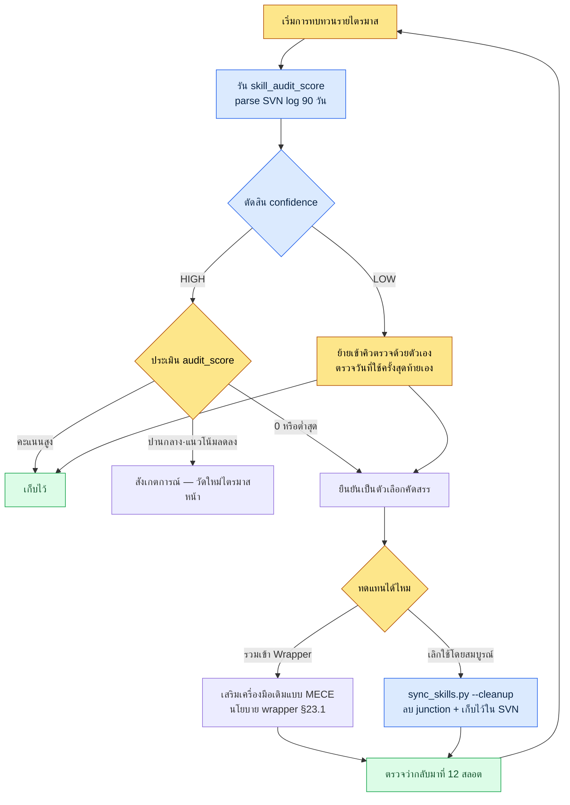

# Part 23 · บทที่ 3 การคัดสรรเครื่องมือ — ตัดเครื่องมือที่ไม่ได้ใช้ออกด้วยข้อมูล

ระหว่างทำการทบทวนรายไตรมาส ผมเปิดโฟลเดอร์สกิลส่วนกลางขึ้นมา พอไล่นับทีละบรรทัด ปรากฏว่ามี wrapper อยู่ถึง 19 ตัว ทั้งที่ตั้งใจไว้ชัดเจนว่าจะรันด้วย 12 ตัวและใช้มาตลอดทั้งปี แต่ไม่รู้ตอนไหนกลับมีเพิ่มขึ้นมาอีก 7 ตัว ที่งงยิ่งกว่าคือ ครึ่งหนึ่งในนั้นพอเห็นแค่ชื่อก็นึกไม่ออกว่าเป็นเครื่องมือทำอะไร `migrate-legacy-enum` นี่มันอะไรนะ ใช้ครั้งสุดท้ายเมื่อไหร่นะ

ผมนึกไม่ออก ตราบใดที่ยังพึ่งความทรงจำ คำถามนี้ก็ไม่มีวันตอบได้ ผมจึงตัดสินใจดู log แทนการพึ่งความทรงจำ การคัดสรรเครื่องมือไม่ควรเป็นงานที่ตัดออกตามรสนิยม แต่ควรเป็นงานที่ตัดออกด้วยตัวเลขที่ว่า "เครื่องมือนี้ถูกเรียกใช้กี่ครั้งในไตรมาสที่ผ่านมา"

บทนี้คือบันทึกว่าจะดึงตัวเลขนั้นออกมาโดยอัตโนมัติได้อย่างไร ใช้ตัวเลขนั้นตัดเครื่องมือออกได้อย่างไร และจะป้องกันไม่ให้เครื่องมือเพิ่มจำนวนพรวดพราดตั้งแต่ต้นได้อย่างไร

---

## 23.3.1 การที่เครื่องมือเพิ่มขึ้นเป็นปรากฏการณ์ธรรมชาติ

ก่อนจะพูดถึงการคัดสรร มีสิ่งหนึ่งที่ต้องยอมรับ เครื่องมือนั้นถ้าไม่ห้ามไว้ก็จะเพิ่มขึ้นแน่นอน ไม่ใช่เพราะใจไม่เข้มแข็ง แต่เป็นเพราะการสร้างสคริปต์เล็ก ๆ ขึ้นมาหนึ่งตัว "เพื่อจัดการงานครั้งนี้ให้เร็ว ๆ" ในทุก ๆ งาน เป็นทางเลือกที่สมเหตุสมผล เมื่อทางเลือกที่สมเหตุสมผลนั้นสะสมหลายสิบครั้ง มันก็กลายเป็นกองที่ไม่สมเหตุสมผล

โครงสร้างที่ใช้รันในโปรเจกต์ A คือรูปแบบที่ wrapper ส่วนกลาง 12 ตัวชี้ไปยังตัวหลัก 48 ตัวใน workspace ผ่าน junction ฝั่งส่วนกลางเบา ส่วนตัวหลักที่หนักก็เก็บไว้ใน workspace ที่จัดการด้วย SVN โครงสร้างนี้ได้กล่าวถึงไปแล้วใน §23.1 ปัญหาคือเลข 12 นี้มันอยู่นิ่ง ๆ ไม่ได้

ถ้าดูว่าอะไรเพิ่มขึ้นตามมาเมื่อเครื่องมือเพิ่มขึ้น ก็จะเห็นชัดว่าทำไมต้องห้ามไว้

<svg viewBox="0 0 640 250" xmlns="http://www.w3.org/2000/svg" font-family="sans-serif" font-size="13">
  <rect x="0" y="0" width="640" height="250" fill="#fbfbfb"/>
  <text x="20" y="28" font-size="15" font-weight="bold" fill="#222">เพิ่มเครื่องมือ 1 ตัว → ต้นทุน 4 อย่างที่เพิ่มตามมา</text>
  <!-- center node -->
  <rect x="270" y="100" width="100" height="46" rx="8" fill="#2b6cb0"/>
  <text x="320" y="128" fill="#fff" text-anchor="middle" font-weight="bold">เครื่องมือใหม่ +1</text>
  <!-- four cost nodes -->
  <rect x="40" y="55" width="160" height="40" rx="6" fill="#fff" stroke="#c53030"/>
  <text x="120" y="80" text-anchor="middle" fill="#c53030">การกินโทเค็นบริบท ↑</text>
  <rect x="440" y="55" width="160" height="40" rx="6" fill="#fff" stroke="#c53030"/>
  <text x="520" y="80" text-anchor="middle" fill="#c53030">ความล้าจากการเลือก ↑</text>
  <rect x="40" y="155" width="160" height="40" rx="6" fill="#fff" stroke="#c53030"/>
  <text x="120" y="180" text-anchor="middle" fill="#c53030">พื้นที่ที่ต้องดูแลรักษา ↑</text>
  <rect x="440" y="155" width="160" height="40" rx="6" fill="#fff" stroke="#c53030"/>
  <text x="520" y="180" text-anchor="middle" fill="#c53030">ความเสี่ยงฟังก์ชันซ้ำซ้อน ↑</text>
  <!-- lines -->
  <line x1="270" y1="115" x2="200" y2="75" stroke="#a0a0a0"/>
  <line x1="370" y1="115" x2="440" y2="75" stroke="#a0a0a0"/>
  <line x1="270" y1="131" x2="200" y2="175" stroke="#a0a0a0"/>
  <line x1="370" y1="131" x2="440" y2="175" stroke="#a0a0a0"/>
  <text x="320" y="232" text-anchor="middle" fill="#555" font-size="12">เครื่องมือ +1 แต่ต้นทุน +4 นี่คือเหตุผลที่การคัดสรรเป็นงานตัดออก</text>
</svg>

โดยเฉพาะข้อแรก การกินโทเค็นบริบท เป็นต้นทุนที่ยิ่งคมขึ้นเมื่อก้าวเข้าสู่ยุคที่ใช้เครื่องมือ AI เมื่อ wrapper ส่วนกลางเพิ่มขึ้น โทเค็นที่ AI ใช้อ่าน "รายการเครื่องมือที่ฉันใช้ได้" ในทุกเซสชันก็เพิ่มขึ้น บริบทที่ควรใช้กับงานจริงกลับลดลงเพราะต้องเสียไปอ่านคำอธิบายของเครื่องมือ 19 ตัว ด้วยเหตุนี้ใน `sync_skills.py` ของโปรเจกต์ A จึงมีออปชัน `--cleanup` ที่จัดการ wrapper ซึ่ง junction พังหรือตัวหลักหายไปโดยอัตโนมัติ นี่ใกล้เคียงกับงานสุขอนามัยเพื่อรักษางบประมาณโทเค็นมากกว่า

แต่สิ่งที่ `--cleanup` จับได้มีแค่เครื่องมือที่ "พัง" เท่านั้น เครื่องมือที่ยังมีชีวิตอยู่ดี ๆ แต่ไม่มีใครใช้นั้นจับไม่ได้ การจะจับมันได้ต้องอาศัยข้อมูลความถี่ในการใช้งาน

---

## 23.3.2 skill_audit_score — วัดความถี่ในการใช้งานด้วย SVN log

ไอเดียหลักนั้นเรียบง่าย สกิลและเครื่องมือใน workspace ทั้งหมดอยู่ใน SVN และทุกครั้งที่ใช้เครื่องมือ ผลลัพธ์ที่เครื่องมือนั้นสร้างขึ้น (ชีต เอกสาร HTML แผนผังความสัมพันธ์ ฯลฯ) จะถูก commit เข้า SVN กล่าวคือ **ถ้าดู SVN log ก็จะเห็นร่องรอยว่าเครื่องมือใดทำงานจริง**

ผมจึงสร้างสคริปต์วัดผลเล็ก ๆ ชื่อ `skill_audit_score` ขึ้นมา ตามชื่อเลย คือให้ "คะแนนการตรวจสอบ (audit)" แก่แต่ละสกิล ตอนสร้างเครื่องมือนี้ผมไม่ได้เขียนโค้ดเองทั้งหมดตั้งแต่ต้น แต่อธิบายตรรกะการวัดให้ AI แล้วรับร่างแรกมา ผมจะเก็บบันทึกเซสชันจริง (worked transcript) นั้นไว้ตามเดิม ไม่สรุปย่อ และเขียนไว้ทั้งหมดรวมถึงส่วนที่เดาผิดทางด้วย

### พรอมต์ (ฉบับเต็ม)

> wrapper สกิลส่วนกลางตั้งไว้ที่ 12 ตัว แต่ไม่รู้ตัวก็พองขึ้นเป็น 19 ตัว ตอนทบทวนรายไตรมาส ผมอยากคัดเลือก "เครื่องมือที่ไม่ได้ใช้" ออกด้วยข้อมูล ช่วยสร้างสคริปต์วัดผลตามเงื่อนไขต่อไปนี้
>
> - เครื่องมือสกิลแต่ละตัวมีอยู่ในรูปโฟลเดอร์ย่อยภายในโฟลเดอร์ workspace (เช่น `tools/relation-map-gen/`)
> - ผลลัพธ์ที่เครื่องมือเหล่านี้สร้างจะถูก commit เข้า SVN ในข้อความ commit มักจะมีชื่อเครื่องมือหรือชนิดของผลลัพธ์อยู่ (เช่น "relation-map regen", "schema-doc update")
> - ผมอยาก parse SVN log แล้วนับจำนวน commit ที่แต่ละเครื่องมือเกี่ยวข้องในช่วง 90 วันล่าสุด
> - การนับจำนวน commit เฉย ๆ ไม่พอ ช่วยรวมสองอย่างเข้าด้วยกันแล้วออกเป็น audit_score ระหว่าง 0\~100 (a) ยิ่งใหม่ยิ่งให้น้ำหนักสูง (b) ถ้าวันที่ใช้ครั้งสุดท้ายนานมาแล้วก็หักคะแนน
> - ผลลัพธ์เป็นตารางเรียงคะแนนจากมากไปน้อย เครื่องมือที่คะแนนต่ำคือ "ตัวเลือกคัดสรร (ตัดออก)"
> - สมมติว่าคำสั่ง SVN รับมาในรูปแบบ `svn log --xml -l 2000` ใช้เฉพาะไลบรารีมาตรฐานของ Python รับ absolute path เป็นอาร์กิวเมนต์

### ผลลัพธ์ดิบของ Claude (ตามเดิม)

> ได้ครับ แต่ขอชี้ประเด็นหนึ่งก่อน **ไม่มีอะไรรับประกันว่าข้อความ commit จะมีชื่อเครื่องมืออยู่เสมอ** ถ้าคนเขียนข้อความ commit ได้อย่างอิสระ ข้อความอย่าง "แก้ชีต" ก็จะบอกไม่ได้ว่าเครื่องมือใดเกี่ยวข้อง ผมจึงจะใช้การจับคู่สองแบบควบคู่กัน
>
> 1. จับคู่คีย์เวิร์ดชื่อเครื่องมือ/นามแฝงในข้อความ commit (หลวม)
> 2. จับคู่ว่า **path ของไฟล์** ที่ถูกแก้ไขอยู่ในโฟลเดอร์ของเครื่องมือนั้น หรืออยู่ในรูปแบบผลลัพธ์ของเครื่องมือนั้น (เช่น `*_relation.html`) หรือไม่ (เข้ม)
>
> ข้อ 2 เชื่อถือได้มากกว่า ผมจึงจะให้น้ำหนักมากกว่า ข้างล่างคือร่างแรก

```python
# skill_audit_score.py  (ร่างแรกของ Claude — ก่อนตรวจสอบ)
import subprocess, sys, datetime, xml.etree.ElementTree as ET
from collections import defaultdict

def svn_log_xml(repo_path, limit=2000):
    out = subprocess.run(
        ["svn", "log", "--xml", "-v", "-l", str(limit), repo_path],
        capture_output=True, text=True, check=True)
    return ET.fromstring(out.stdout)

def score_skills(repo_path, skills, window_days=90):
    root = svn_log_xml(repo_path)
    now = datetime.datetime.now(datetime.timezone.utc)
    hits = defaultdict(list)   # skill -> [days_ago, ...]
    for entry in root.findall("logentry"):
        date = datetime.datetime.fromisoformat(
            entry.find("date").text.replace("Z", "+00:00"))
        days_ago = (now - date).days
        if days_ago > window_days:
            continue
        msg = (entry.find("msg").text or "").lower()
        paths = [p.text for p in entry.findall("paths/path")]
        for sk in skills:
            name = sk["name"].lower()
            in_msg = name in msg or any(a in msg for a in sk.get("alias", []))
            in_path = any(name in (pp or "").lower() for pp in paths) \
                      or any(pat in (pp or "") for pp in paths
                             for pat in sk.get("artifact", []))
            if in_path:
                hits[sk["name"]].append((days_ago, 2.0))   # น้ำหนักจับคู่แบบเข้ม
            elif in_msg:
                hits[sk["name"]].append((days_ago, 1.0))   # จับคู่แบบหลวม

    rows = []
    for sk in skills:
        h = hits[sk["name"]]
        if not h:
            rows.append((sk["name"], 0, None, len(h)))
            continue
        # น้ำหนักความใหม่: ยิ่งใหม่ยิ่งเข้าใกล้ 1.0, ถ้า 90 วันก่อนเป็น 0.1
        recency = sum(w * (1 - 0.9 * (d / window_days)) for d, w in h)
        last_used = min(d for d, _ in h)
        # หักคะแนนตามวันที่ใช้ครั้งสุดท้าย
        stale_penalty = max(0, (last_used - 14)) * 0.5
        score = max(0, min(100, recency * 8 - stale_penalty))
        rows.append((sk["name"], round(score, 1), last_used, len(h)))

    rows.sort(key=lambda r: r[1])   # เรียงคะแนนจากน้อยไปมาก = ตัวเลือกขึ้นก่อน
    return rows

if __name__ == "__main__":
    REPO = sys.argv[1]
    SKILLS = [
        {"name": "relation-map-gen", "alias": ["relation", "관계도"],
         "artifact": ["_relation.html"]},
        {"name": "schema-doc", "alias": ["schema", "명세서"],
         "artifact": ["_schema.md"]},
        {"name": "gdd-gen", "alias": ["gdd"], "artifact": ["_gdd.md"]},
        {"name": "table-creator", "alias": ["table", "테이블"], "artifact": []},
        {"name": "excel-reader", "alias": ["xlsm", "vba"], "artifact": []},
        {"name": "migrate-legacy-enum", "alias": ["enum", "migrate"],
         "artifact": []},
    ]
    print(f"{'skill':22}{'score':>7}{'last_used(d)':>14}{'hits':>6}")
    for name, score, last, hits_n in score_skills(REPO, SKILLS):
        print(f"{name:22}{score:>7}{str(last):>14}{hits_n:>6}")
```

### การตรวจสอบโดยมนุษย์ — ส่วนที่ลองรันแล้วปฏิเสธ

ผมรันสคริปต์กับ working copy ของ SVN จริง ผลลัพธ์แรกออกมาแปลก ๆ `table-creator` กับ `excel-reader` ทั้งคู่มีรูปแบบ `artifact` ว่างเปล่า จึงถูกจับได้ก็ต่อเมื่อมีคำว่า "table" / "xlsm" อยู่ในข้อความ commit เท่านั้น แต่เครื่องมือสองตัวนี้ผลลัพธ์เป็นไฟล์ `.xlsm` ธรรมดา จึงแยกแยะด้วยรูปแบบไม่ได้ ผลคือทั้งคู่ได้คะแนนต่ำผิดปกติ — ทั้งที่จริงเป็นเครื่องมือที่ใช้ทุกวัน

ตรงนี้ผมตัดสินใจสำคัญข้อหนึ่ง **คะแนนต่ำไม่ได้แปลว่าต้องตัดทิ้งทันที** สาเหตุที่คะแนนต่ำเป็นเพราะ "ไม่ได้ใช้จริง ๆ" หรือเพราะ "การวัดจับเครื่องมือไม่ได้" นั้น มนุษย์ต้องเป็นคนแยก ตัวเลขที่ AI สร้างขึ้นแค่ช่วยจำกัดตัวเลือกให้แคบลง การตัดสินใจขั้นสุดท้ายเป็นของมนุษย์

ผมจึงร้องขอ AI อีกครั้ง

### พรอมต์ขอใหม่

> เครื่องมือที่มีรูปแบบ artifact ว่างเปล่าจะเชื่อคะแนนไม่ได้ ช่วยเพิ่มคอลัมน์ `confidence` ในผลลัพธ์ด้วย เครื่องมือที่ไม่เคยจับคู่ artifact ได้เลยให้แสดงเป็น `confidence=LOW` และตัดออกจากตัวเลือกคัดสรรอัตโนมัติ เครื่องมือที่เป็น LOW ให้แยกเป็นกลุ่มต่างหากในชื่อ "วัดไม่ได้ — ตรวจสอบด้วยตัวเอง"

ด้วยคำขอใหม่นี้ ผลลัพธ์ก็แยกออกเป็นสองกลุ่ม เครื่องมือที่ตัดออกได้ด้วยคะแนนที่เชื่อถือได้ และเครื่องมือที่การวัดอ่อน จึงต้องให้มนุษย์ดูเอง รูปร่างของผลที่รันจริงโดยประมาณเป็นแบบนี้ (คะแนนเป็นค่าที่วัดจริงบน working copy ของผู้เขียน ชื่อเครื่องมือบางส่วนถูกทำให้ไม่ระบุตัวตน)

| skill | audit_score | last_used (วันก่อน) | confidence | คำตัดสิน |
|---|---|---|---|---|
| relation-map-gen | 71.4 | 2 | HIGH | เก็บไว้ |
| schema-doc | 58.9 | 5 | HIGH | เก็บไว้ |
| gdd-gen | 22.1 | 31 | HIGH | สังเกตการณ์ |
| migrate-legacy-enum | 0.0 | วัดไม่ได้ | HIGH | **ตัวเลือกคัดสรร** |
| table-creator | 4.2 | 1 | LOW | ตรวจด้วยตัวเอง → เก็บไว้ |
| excel-reader | 6.0 | 1 | LOW | ตรวจด้วยตัวเอง → เก็บไว้ |

`migrate-legacy-enum` ได้คะแนน 0 และ confidence HIGH หมายความว่าในช่วง 90 วัน ทั้งโฟลเดอร์และผลลัพธ์ของเครื่องมือนี้ไม่เคยปรากฏใน commit แม้แต่ครั้งเดียว พอลองนึกย้อนดู มันคืองานที่ปีก่อนทำการ migrate เลกาซี enum ครั้งเดียวแล้วจบ เป็นงานที่ควรเกิดแค่ครั้งเดียวแต่ผมไปตรึงเป็นกฎไว้เป็นสกิล นี่แหละคือเครื่องมือที่ต้องตัด ในทางกลับกัน `table-creator` กับ `excel-reader` ได้คะแนนต่ำแต่ confidence เป็น LOW และวันที่ใช้ครั้งสุดท้ายคือเมื่อวานนี้ การวัดแค่จับไม่ได้ แต่จริง ๆ ใช้ทุกวัน ตัดไม่ได้

> ข้อควรระวัง: สูตรคำนวณคะแนนในตารางข้างต้น (น้ำหนักความใหม่ × 8, หักคะแนน stale) เป็นค่าที่ผู้เขียนปรับจูนให้เข้ากับ working copy ของตัวเอง ถ้านิสัยการ commit SVN และรูปแบบผลลัพธ์ต่างออกไป สัมประสิทธิ์ก็จะต่างไปด้วย แก่นแท้ของเครื่องมือนี้คือ "อันดับเชิงสัมพัทธ์ระหว่างเครื่องมือ" และ "การแยก confidence" มากกว่าคะแนนสัมบูรณ์

---

## 23.3.3 วงจรการคัดสรร — จากการวัดถึงการเลิกใช้

`skill_audit_score` เป็นเพียงเครื่องมือวัดผลเท่านั้น ต้องมีวงจรที่ใส่ค่าที่วัดได้เข้าไปในการทบทวนรายไตรมาสแล้วหมุนหนึ่งรอบ เครื่องมือจึงจะได้รับการจัดการจริง วงจรนั้นเป็นดังนี้



การแยกแยะทางออกสองทางของวงจรนี้เป็นเรื่องสำคัญ เครื่องมือที่คะแนนเป็น 0 ไม่ได้แปลว่าลบทิ้งโดยไม่มีเงื่อนไข ถ้างานนั้นเองหายไปแล้ว ก็ส่งไปเลิกใช้โดยสมบูรณ์ (`--cleanup`) แต่ถ้างานนั้นยังจำเป็นอยู่ เพียงแต่ไม่ได้บ่อยพอที่จะตั้งเป็นเครื่องมือแยกต่างหาก ก็ให้รวมเข้ากับเครื่องมือเดิม อย่างหลังนี่แหละคือการเสริมแบบ MECE ใน §23.3.4

ตอนเลิกใช้ โค้ดก็ยังคงอยู่ในประวัติ SVN เพียงเก็บ junction และการเปิดเผยในส่วนกลางออกเท่านั้น ไม่ใช่ลบตัวโค้ดทิ้งถาวร ถ้าอีก 6 เดือนงานนั้นเกิดขึ้นอีก ก็แค่กู้คืนจาก SVN ตาข่ายนิรภัยที่ว่า "ย้อนกลับได้" นี้เองที่ทำให้มนุษย์กล้าตัดได้อย่างเด็ดขาด

---

## 23.3.4 การยับยั้งการเพิ่มจำนวนด้วย MECE — ถามก่อนสร้าง

ดียิ่งกว่าการวัดแล้วตัด คือการไม่สร้างตั้งแต่ต้น ถ้า `skill_audit_score` คือการจัดการภายหลัง นโยบาย MECE wrapper ก็คือการยับยั้งล่วงหน้า

MECE คือ Mutually Exclusive, Collectively Exhaustive — ไม่ทับซ้อนกัน และครอบคลุมครบถ้วน ทุกครั้งที่อยากสร้างเครื่องมือใหม่ ผมจะโยนสองตัวอักษรนี้ใส่ **เครื่องมือใหม่ทับซ้อนกับเครื่องมือเดิมไหม (ละเมิด ME)? หรือเติมเต็มพื้นที่ที่ว่างอยู่จริง ๆ (มีส่วนช่วย CE)?** นโยบาย wrapper ของโปรเจกต์ A แตกออกเป็นสองทางตรงนี้

| สถานการณ์ | นโยบาย | ผลลัพธ์ |
|---|---|---|
| งานใหม่ทับซ้อนกับพื้นที่ของเครื่องมือเดิม | **เสริมเครื่องมือเดิมก่อน** | เพิ่มฟังก์ชันลงในตัวหลักของ wrapper เดิม ไม่ใช้สลอตใหม่ |
| งานใหม่อยู่ในพื้นที่ที่ต่างออกไปอย่างชัดเจน | **อนุญาตให้สร้าง wrapper ใหม่** | จัดสรรหนึ่งใน 12 สลอตให้เครื่องมือใหม่ (พร้อมตัวเลือกที่ต้องเอาออกควบคู่) |

แก่นคือ "ค่าตั้งต้นคือการเสริม" การสร้างเครื่องมือใหม่เป็นข้อยกเว้น การจะให้เหตุผลรองรับข้อยกเว้นนั้น ต้องพิสูจน์ให้ได้ว่า "ไม่มีเครื่องมือเดิมตัวใดทำงานนี้ได้" ค่าตั้งต้นข้อเดียวนี้เองที่เป็นสาเหตุที่แท้จริงในการดึงเครื่องมือซึ่งพองขึ้นเป็น 19 ตัวกลับลงมาเหลือ 12 ตัวอีกครั้ง

เรื่องนี้ก็เชื่อมโยงกับ cascade ใน §23.1 ด้วย cascade อย่าง check คือผลลัพธ์ของการรวมเครื่องมือตรวจสอบที่เดิมมี 4 ชนิดให้เหลือการเรียกใช้เดียว แทนที่จะมี wrapper แยกกัน 4 ตัว ก็มองในมุม MECE ว่า "ทั้งหมดนี้คือพื้นที่เดียวคือการตรวจสอบ" แล้วรวมเป็นหนึ่ง จำนวนเครื่องมือลดลงแต่ฟังก์ชันยังเท่าเดิม นี่คือแบบอย่างของการเสริม

ผู้ช่วย AI ตรงนี้เป็นทั้งปัจจัยเสี่ยงและทางแก้ ที่เป็นความเสี่ยงเพราะ ถ้าบอก AI ว่า "ช่วยสร้างสคริปต์จัดการงานนี้ให้หน่อย" เครื่องมือใหม่ก็ออกมาง่ายเกินไป ในสภาพแวดล้อมที่คลิกครั้งเดียวเกิดเครื่องมือหนึ่งตัว ถ้าไม่มีวินัย MECE สุสานเครื่องมือก็ก่อตัวขึ้นในพริบตา ที่เป็นทางแก้เพราะ ถ้าให้นโยบายแก่ AI ก่อน AI ก็จะเสนอเองว่า "อันนี้เอาไปแปะเป็นออปชันใน `relation-map-gen` เดิมน่าจะดีกว่า" ต้องยื่นวินัยการคัดสรรให้ AI ที่สร้างเครื่องมือไปพร้อมกันด้วย

---

## 23.3.5 วิธีไม่หลงกลคะแนน — ขีดจำกัดของการวัด

สิ่งที่ผมเรียนรู้มากที่สุดจากการรันเครื่องมือในบทนี้คือ ห้ามเชื่อค่าที่วัดได้อย่างหลับหูหลับตา `skill_audit_score` ดูแค่สัญญาณเดียวคือ SVN log จึงมีสิ่งที่พลาดไปในเชิงโครงสร้าง

- **จับเครื่องมืออ่านอย่างเดียวไม่ได้** เครื่องมือที่เพียงอ่านชีตอย่าง `excel-reader` โดยไม่สร้างผลลัพธ์ จะไม่ทิ้ง commit ไว้ ด้วยเหตุนี้กลไกที่ลด confidence ให้เป็น LOW แล้วโยนไปตรวจด้วยตัวเองจึงเป็นสิ่งจำเป็น
- **ประเมินเครื่องมือความถี่ต่ำมูลค่าสูงต่ำเกินไป** มีเครื่องมือที่ใช้ปีละสองครั้งแต่ทุกครั้งที่ใช้ช่วยประหยัดเวลาไปครึ่งวัน ถ้าดูแค่ความถี่ก็เป็นตัวเลือกคัดสรร แต่ถ้าดูที่มูลค่าก็ต้องเก็บไว้ ด้วยเหตุนี้คำตัดสินขั้นสุดท้ายของวงจรจึงเป็นของมนุษย์เสมอ
- **ขึ้นอยู่กับนิสัยการ commit** คะแนนของคนที่ยัดงานทั้งก้อนไว้ใน commit เดียวกับคนที่ซอยย่อย ๆ จะออกมาต่างกัน ด้วยเหตุนี้จึงต้องอ่านในรูปอันดับเชิงสัมพัทธ์ระหว่างเครื่องมือของคนคนเดียวกัน ไม่ใช่คะแนนสัมบูรณ์

สรุปคือ เครื่องมือนี้ไม่ใช่ "เครื่องมือที่ตัดสินใจ" แต่เป็น "เครื่องมือที่จำกัดตัวเลือกให้แคบลง" มันมอง 19 ตัวในคราวเดียวแล้วบอกได้ภายในวินาทีเดียวว่า "ควรสงสัยตัวไหน" การพิสูจน์ความสงสัยนั้นและการตัดยังคงเหลือไว้เป็นหน้าที่ของมนุษย์ การวัดไม่ได้มาแทนที่มนุษย์ แต่เพียงชี้ให้เห็นจุดที่มนุษย์ต้องไปดูเท่านั้น

---

## ลองทำดู — skill_audit_score หนึ่งวงจร

นี่คือขั้นตอนการหมุนวงจรการคัดสรรเครื่องมือด้วยตัวเองหนึ่งรอบ

**setup**
1. ตรวจสอบว่าสกิลและเครื่องมือของเวิร์กสเปซอยู่ในระบบจัดการเวอร์ชัน (SVN/Git) หรือไม่ ผลลัพธ์ก็ต้องถูก commit เข้า repository เดียวกันด้วย
2. สร้างรายการเครื่องมือที่ต้องการวัด แต่ละเครื่องมือให้ระบุ `name`, `alias` (นามแฝงที่จะปรากฏในข้อความ commit), `artifact` (รูปแบบไฟล์ผลลัพธ์ ถ้ามี) เครื่องมืออ่านอย่างเดียวที่ไม่มี artifact ให้ปล่อยว่างไว้

**prompt** (ถึง AI)
> ช่วยสร้างสคริปต์วัดความถี่การใช้เครื่องมือตามเงื่อนไขต่อไปนี้ (1) เครื่องมือแต่ละตัวทิ้งร่องรอยใน log ของ [ระบบจัดการเวอร์ชัน] ในรูป commit ผลลัพธ์ (2) parse log 90 วันล่าสุดแล้วนับจำนวน commit ที่แต่ละเครื่องมือเกี่ยวข้อง (3) ออกคะแนน 0\~100 ด้วยน้ำหนักความใหม่ + หักคะแนนตามวันที่ใช้ครั้งสุดท้าย (4) เครื่องมือที่ไม่เคยจับคู่รูปแบบผลลัพธ์ (artifact) ได้เลยให้แสดงเป็น confidence=LOW ตัดออกจากตัวเลือกอัตโนมัติ และแยกไปตรวจด้วยตัวเอง (5) ผลลัพธ์เป็นตารางเรียงคะแนนจากน้อยไปมาก — คะแนนต่ำคือตัวเลือกคัดสรร ใช้เฉพาะไลบรารีมาตรฐาน รับ path ของ repository เป็นอาร์กิวเมนต์

**verify**
1. ถ้าเครื่องมือที่ใช้ทุกวันขึ้นมาอยู่บนสุดของตาราง (คะแนนต่ำ) แสดงว่าการวัดผิด ให้ตรวจ confidence ของเครื่องมือนั้น — ถ้าเป็น LOW ก็ปกติ (วัดไม่ได้) แต่ถ้าเป็น HIGH ทั้งที่คะแนนต่ำ ให้ตรวจการตั้งค่า alias·artifact
2. ยืนยันเฉพาะเครื่องมือที่คะแนน 0 + confidence HIGH เป็นตัวเลือกคัดสรรเท่านั้น เทียบวันที่ใช้ครั้งสุดท้ายกับความทรงจำ แล้วให้มนุษย์ตัดสินว่าเป็นเครื่องมือที่ตายไปแล้วจริงหรือไม่
3. ส่งตัวเลือกไปสู่ทางใดทางหนึ่งระหว่าง "เลิกใช้โดยสมบูรณ์" กับ "รวมเข้าเครื่องมือเดิม" การเลิกใช้เก็บเฉพาะ junction ออก ส่วนโค้ดยังคงอยู่ใน repository
4. นับดูเป็นครั้งสุดท้ายว่า 12 สลอต (หรือขีดจำกัดที่ตัวเองกำหนด) กลับคืนมาหรือยัง

### ฉบับย่อสำหรับคนเดียว

ถ้าเป็นการพัฒนาคนเดียวที่มีเครื่องมือแค่ 6\~8 ตัวและไม่มี SVN ให้ย่อแบบนี้ ระบบจัดการเวอร์ชันใช้ Git ก็เพียงพอ ใช้ `git log --since="90 days ago" --name-only` ดึง path ของไฟล์ที่ถูกแก้ไขออกมา แล้ว grep ด้วยชื่อโฟลเดอร์เครื่องมือสักครั้ง ก็จะได้ว่า "เครื่องมือใดทำงานล่าสุด" ไม่ต้องสร้างสคริปต์ให้คะแนนเลยก็ได้ แก่นไม่ได้อยู่ที่ความแม่นยำของตัวเลข แต่อยู่ที่นิสัยข้อเดียว — **ดู log แทนความทรงจำ** ไตรมาสละครั้ง ดึง "เครื่องมือที่ไม่ได้แตะแม้แต่ครั้งเดียวใน 90 วันที่ผ่านมา" ออกมาด้วย git log แล้วเพ่งมองเครื่องมือนั้น 5 นาทีนั้นเองที่ป้องกันสุสานเครื่องมือ

---

### สรุปประเด็นสำคัญของบท
- เครื่องมือถ้าไม่ห้ามก็เพิ่ม และการคัดสรรไม่ใช่งานเพิ่มแต่เป็นงานตัดออก
- skill_audit_score วัดความถี่การใช้งานด้วย SVN log แล้วชี้ตัวเลือกที่ควรตัด
- การวัดเพียงจำกัดตัวเลือกให้แคบลง ส่วนจะตัดหรือไม่ มนุษย์เป็นคนตัดสินจาก confidence

### ตัวอย่างบทถัดไป
- Part 23 · บทที่ 4 เกมปริศนาที่สร้างคนเดียว — บันทึกภาคปฏิบัติของการนำเครื่องมือและวินัยการทบทวนชุดเดียวกันมาประยุกต์ใช้กับการพัฒนาเกมคนเดียว (Critter Sort)
