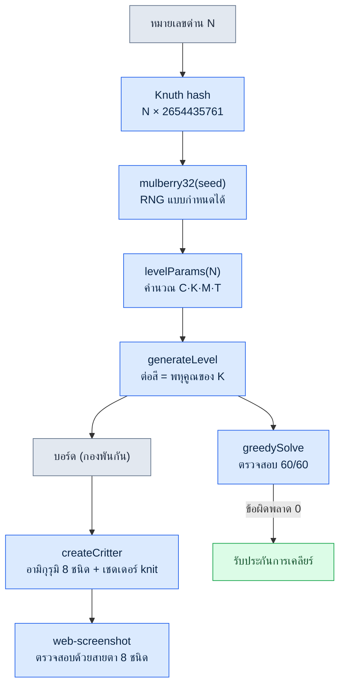

# ส่วนที่ 23 · บทที่ 4 เกมพัซเซิลที่สร้างคนเดียว — บันทึกภาคปฏิบัติ Critter Sort

บ่ายวันเสาร์ ภรรยาของผมกำลังเล่นเกมพัซเซิลจับคู่สีบนมือถือ เป็นเกมชื่อ *Yarn Fever* ที่ต้องคัดแยกไหมพันกันยุ่งใส่ตะกร้าสีเดียวกัน พอจบหนึ่งด่านเธอก็พูดว่า "ก็เหมือนเดิมอีกแล้ว" แล้วปิดเกม เมื่อไม่มีอะไรอัปเดต ความเบื่อจึงมาเร็ว

ความคิดที่ผุดขึ้นในตอนนั้นเรียบง่าย ลูปนั้นมีความน่าติดที่พิสูจน์แล้ว และตัวกลไกเองก็ไม่ใช่สิ่งที่ลิขสิทธิ์คุ้มครอง ถ้าเปลี่ยนเป็นธีมสัตว์ และปั๊มด่านออกมาแบบโพรซีเดอรัลให้ไม่มีที่สิ้นสุด ปัญหา "เหมือนเดิมอีกแล้ว" ก็จะหายไป ถ้าสร้างเป็น HTML 3D ที่รันได้ทันทีในเบราว์เซอร์โดยคนเดียว ก็ไม่ต้องติดตั้งอะไรบนมือถือของภรรยาด้วยซ้ำ

ปัญหาคือผมไม่ใช่กราฟิกเอนจิเนียร์ ผมเป็นนักออกแบบเกม (Game Designer) ที่มีประสบการณ์ 24 ปี แต่ไม่เคยเขียนเชดเดอร์ด้วย Three.js มาก่อน ดังนั้นบทนี้จึงเป็นบันทึกจริงของการ "ทำเกมหนึ่งเกมให้รันได้ภายในไม่กี่วันโดยลำพังร่วมกับ AI" เป็นบันทึกที่ใช้เครื่องมือชุดเดียวกับงาน MMORPG ของบริษัท (ต่อจากนี้เรียกว่าโปรเจกต์ A) แต่ก็เป็นบันทึกของการแบ่งแยกที่ไม่ปนเนื้อหาเชิงโดเมนเข้ามาแม้แต่บรรทัดเดียว

เกมจริงอยู่ใน repository `critter-sort/` และมี git tag v0.1\~v0.3 ที่เก็บบันทึกการตัดสินใจตลอดสามวันไว้ ผมจะอ้างอิงจาก repository นั้นตามจริง ไม่ใช่กรณีที่ปรุงแต่งขึ้น

---

## 23.4.1 ทำวิศวกรรมย้อนกลับด้วยพรอมต์ — แล้วก็สูญเสียลายเซ็นไป

สิ่งแรกที่ทำคือถอดเกมต้นฉบับออกมาเป็นคำพูดแล้วโยนให้ AI พรอมต์แรกเป็นแบบนี้

> **พรอมต์ (เริ่ม v0.1):**
> "ผมอยากดัดแปลงลูปหลักของเกมพัซเซิลแคชชวลชื่อ Yarn Fever ให้เป็นธีมสัตว์ แล้วสร้างด้วย Three.js + Vite ลูปเป็นแบบนี้ คัดแยกก้อนสีที่พันกันใส่ถังสีเดียวกัน ถ้าเกินช่องชั่วคราวก็เกมโอเวอร์ ใช้สัตว์เป็นเป้าหมายในการคัดแยก โดยให้แตะที่กองสัตว์ที่พันกันยุ่งแล้วมันถูกส่งไปยังรัง (nest) สีเดียวกัน เขียนลอจิกเป็น state machine ของ JS ล้วน ๆ ที่ไม่ขึ้นกับ Three.js เพื่อให้ทดสอบแบบ headless ได้ ใส่ด่านโพรซีเดอรัลที่ไม่มีที่สิ้นสุด (อิงซีด) มาด้วย"

AI ทำตามอย่างซื่อสัตย์ มันแยกโครงสร้างโฟลเดอร์เป็น `game/` (ลอจิกล้วน) กับ `render/` (Three.js) เขียน `state.js`·`rules.js`·`generator.js` ก่อน แล้วแสดงบอร์ดด้วย placeholder กล่องที่ลงสีไว้ ไม่ใช่กี่วันด้วยซ้ำ แค่เซสชันเดียว v0.1 ก็รันได้

แต่ในวินาทีที่ผมลองเล่นเองเพื่อจะให้ภรรยาดู ความรู้สึกขัด ๆ ก็มา มันกลายเป็นเกมจับคู่ทั่วไปที่สัตว์กระโดดจากด้านบนของจอลงไปในตะกร้า สัมผัสเฉพาะตัวของเกมต้นฉบับหายไป ตัวตนของ *Yarn Fever* ไม่ได้อยู่ที่ "การคัดแยก" แต่อยู่ที่ **สัมผัสของการใช้มือคลายไหมที่พันกันยุ่ง** และ **การหมุนจอไปเพื่อยืนยันสีที่ถูกบังไว้** ผมไปบีบสิ่งนั้นให้แบนเป็นการ sort ทั่วไปด้วยพรอมต์ที่ว่า "แตะสัตว์แล้วส่งไปรัง" และ AI ก็เพียงแค่ทำตามนิยามที่ผมให้อย่างซื่อสัตย์เท่านั้น

นี่คือกับดักแรกของการทำวิศวกรรมย้อนกลับ พอสรุปเกมต้นฉบับ ลายเซ็นก็ระเหยไป เพราะการสรุปทิ้งไว้แค่พื้นผิว ไม่ใช่แก่นแท้

ตรงนี้ผมขอชี้ชัดอย่างหนึ่ง AI ไม่ได้ให้คำตอบที่ผิด พรอมต์ของผมต่างหากที่ผิด ฉะนั้นรอบถัดไปจึงไม่ใช่การแก้โค้ด แต่เป็น **การแก้ไขนิยาม**

---

## 23.4.2 กระดูกสันหลัง — รอบการแก้ไขที่ชุบชีวิตการหมุนและการคลายไหมกลับมา

ทันทีที่เห็น v0.1 ผมระบุแก่นใหม่อีกครั้งในสองรอบ การแก้ไขรอบแรกเล็งไปที่การกระทำ รอบที่สองเล็งไปที่สัมผัส

> **พรอมต์ (แก้ไขรอบที่ 1 — การกระทำ):**
> "อันนี้มันกลายเป็นแค่เกมจับคู่ไปแล้ว ตัวตนของ Yarn Fever คือ 'การหมุนจอ 3D ไปเพื่อยืนยันสีที่ถูกบัง แล้วกำหนดลำดับการคลาย' อย่าโปรยบอร์ดลงบนระนาบ แต่ให้กองสูงเป็นเนินตรงกลาง เพื่อให้ต้องหมุนถึงจะเห็นสีที่บังอยู่ด้านหลัง ใส่การหมุนด้วย OrbitControls แต่การหมุนกับการแตะมันชนกันนี่ — จะแยกยังไง"

> **ผลลัพธ์จาก Claude (ดิบ ไม่สรุปย่อ):**
> "ถูกต้องครับ ท่าทางหมุนกับการแตะใช้ pointer event เดียวกันจึงชนกัน ผมเสนอวิธีแยกด้วยเกณฑ์ระยะทางและเวลา บันทึกพิกัดและเวลาที่ `pointerdown` แล้วที่ `pointerup` ถ้าระยะการเคลื่อนเกิน 9px หรือเวลากดเกิน 400ms ให้ถือว่าเป็นท่าทางหมุนและละเว้นการแตะ เฉพาะที่ต่ำกว่านั้นเท่านั้นจึงใช้ raycaster หยิบสัตว์แล้วเรียก `state.tap()` ส่วน azimuth ของ OrbitControls ผมจะจำกัดไว้ราว ±54° เพื่อไม่ให้กองหลุดออกนอกจอ อย่างไรก็ตามบนมือถือ 9px อาจไวเกินไป จึงต้องตรวจสอบบนเครื่องจริง"

เกณฑ์ 9px/400ms นั้นยังคงอยู่ใน `src/main.js` จนถึงตอนนี้ เป็นโค้ดที่ไม่มีส่วนเกินและตรวจสอบได้โดยตรง

```javascript
// src/main.js — ลาก = หมุน (OrbitControls) / แตะสั้น = คลายไหม
canvas.addEventListener('pointerup', (ev) => {
  if (!down || state.status !== 'playing') { down = null; return }
  const dist = Math.hypot(ev.clientX - down.x, ev.clientY - down.y)
  const dt = performance.now() - down.t
  down = null
  if (dist > 9 || dt > 400) return // ถือว่าเป็นท่าทางหมุน
  const rect = canvas.getBoundingClientRect()
  const x = ((ev.clientX - rect.left) / rect.width) * 2 - 1
  const y = -((ev.clientY - rect.top) / rect.height) * 2 + 1
  const id = view.pick(x, y, camera)
  if (id !== null) state.tap(id)
})
```

การกระทำกลับมาแล้ว แต่พอเล่นเป็นรอบที่สองก็ยังไม่มีความรู้สึก "คลายไหม" อยู่ดี สัตว์แค่เคลื่อนไปยังรังเฉย ๆ ไม่มีสัมผัสของการถูกคลายออก จึงเป็นการแก้ไขรอบที่สอง

> **พรอมต์ (แก้ไขรอบที่ 2 — สัมผัส):**
> "การหมุนดีขึ้นแล้ว แต่ยังไม่มีความรู้สึกของ 'การคลายไหม' พอแตะ ให้ใส่ลูกเล่นที่เส้นไหมพันกันยุ่งซึ่งพันรอบตัวสัตว์คลายออกแล้วหายไป จากนั้นไหมเส้นนั้นถูกม้วนเข้าไปในตะกร้า ส่วนลุคของสัตว์ก็อย่าใช้ GLB นกที่เกลี้ยงเกลา แต่ให้เป็นตุ๊กตาถักไหมพรม (อามิกุรุมิ) อ้วนกลม มีดีเทลแบบโคซีอย่างตาง่วงนอน แก้มแต้มสี ถ้าเอเซตภายนอกไม่เข้ากันก็เอาออก แล้วสร้างแบบโพรซีเดอรัลแทนก็ได้"

> **ผลลัพธ์จาก Claude (ดิบ):**
> "ผมจะแยกสองส่วนมาทำครับ (1) ไหมพันกัน พันเส้น `TorusGeometry` สีเดียวกันแต่เข้มขึ้นเล็กน้อย 2 เส้นไว้รอบลำตัวสัตว์แต่ละตัว แล้วตอนแตะให้ลด scale เหลือ 0.01 เพื่อให้คลายออกและหายไป (2) การม้วนไหม วาดไหมตามเส้นทางจากสัตว์ไปตะกร้าด้วย `TubeGeometry` แล้วทวีนให้ม้วนเข้าไปทางตะกร้า ลุคตุ๊กตาถักผมจะไปทางโพรซีเดอรัล สร้างเท็กซ์เจอร์ knit bump แบบโพรซีเดอรัลใส่ใน `MeshStandardMaterial` เพื่อให้ได้ผิวสัมผัสแบบนิตติง ส่วนตาง่วงทำด้วย box แบน แก้มแต้มทำด้วย sphere สีชมพูกึ่งโปร่งใส GLB สตาร์ทเตอร์เดิม (นก 3 ชนิด) ไม่เข้ากับโทนนิตติงจึงเอาออก แต่จะคงไปป์ไลน์โหลดแพ็กสัตว์ไว้เป็น fallback มีอยู่อย่างหนึ่งที่ขอเตือน สัตว์ที่สร้างแบบโพรซีเดอรัลมีความหลากหลายของชนิดสู้ GLB ไม่ได้ — ปลอดภัยกว่าถ้าจะตรวจสอบด้วยชนิดเดียวก่อนแล้วค่อยเพิ่มชนิด"

คำเตือนสุดท้ายนั้น ("ความหลากหลายของชนิดสู้ GLB ไม่ได้" — GLB คือ glTF Binary ฟอร์แมตไฟล์โมเดล 3D สำเร็จรูปที่รับมาจากภายนอกเพื่อนำมาใช้) คือเมล็ดพันธุ์ที่นำไปสู่ v0.3 พอดี AI พูดถึงข้อจำกัดถัดไปก่อน และผมก็รับมาเป็นไมล์สโตนถัดไป

การตรวจสอบเป็นสองขั้นทุกครั้ง ขั้นแรกดูว่าลอจิกไม่พังด้วย headless (ข้อผิดพลาด 0) จากนั้นจึงลองสัมผัสด้วยการหมุนและแตะในเบราว์เซอร์โดยตรง การตรวจสอบนั้นถูกตรึงเป็นกฎไว้ในข้อความคอมมิต v0.2 "ตรวจสอบ headless: การหมุน·การคลายไหม·การเคลียร์อัตโนมัติปกติ ข้อผิดพลาด 0"

ไหมพันกัน 2 เส้นยังคงอยู่ใน `src/render/pieces.js` แบบนี้

```javascript
// src/render/pieces.js — ไหมหลวม 2 เส้นที่พันรอบลำตัว (สีเดียวกันแต่เข้มขึ้นเล็กน้อย)
const strandMat = new THREE.MeshStandardMaterial({ color: darken(hex, 0.7), roughness: 1 })
const strands = []
const orient = [[0.5, 0.2, 0.0], [1.25, 0.0, 0.6]]
for (let i = 0; i < 2; i++) {
  const s = addMesh(g, G.torus, strandMat, [0, byo + 0.02, 0], Math.max(bx, bz) + 0.02, orient[i])
  strands.push(s)
}
g.userData.strands = strands  // ตอนแตะ view.js จะคลายเส้นเหล่านี้ให้หายไป
```

บทเรียนที่ได้จากตรงนี้ ผมขอบันทึกไว้เป็นบรรทัด

- ทำวิศวกรรมย้อนกลับ ถ้าสรุป ลายเซ็นก็ตาย
- ถ้านิยามผิด ให้แก้นิยาม ไม่ใช่แก้โค้ด
- ข้อจำกัดถัดไปที่ AI พูดถึง คือไมล์สโตนถัดไป

---

## 23.4.3 บันทึกการตัดสินใจสามวัน — อ่านการแก้ไขผ่าน git tag

ถ้ามองด้วยคำพูดอย่างเดียวก็คือ "แก้สองครั้ง" แต่ประวัติ git เก็บไว้พร้อมเวลาที่แม่นยำว่าการแก้ไขนั้นเข้ามาเมื่อไรในรูปแบบใด นี่คือสิ่งที่แทนการทบทวนในการพัฒนาคนเดียว แม้ไม่มีเพื่อนร่วมงาน คอมมิตก็เป็นพยานว่า "ทำไมถึงกลายเป็นแบบนี้"

| คอมมิต | เวลา (2026-05-30) | อะไรเปลี่ยนไป | สถานะลายเซ็น |
|---|---|---|---|
| `2b2e3bc` v0.1 | 14:43 | วิศวกรรมย้อนกลับ Yarn Fever, ลอจิกล้วน + placeholder, ผ่านโซลเวอร์ 60/60 | ขาดหาย (แบนเป็น sort ทั่วไป) |
| `70a0117` v0.2 | 15:11 | การหมุน (OrbitControls ±54°) + แยกแตะ/ลาก + คลายไหม + อามิกุรุมิ | กู้คืน (นิยามแก่นใหม่) |
| `160663c` สแนปช็อต | 15:31 | สแนปช็อตแกลเลอรี v0.2 5 ภาพ + แกลเลอรี README | — |
| `59b0baf` v0.3 | 15:55 | อามิกุรุมิโพรซีเดอรัล 8 ชนิด + พาเลตต์แคนดี้สีสด | เสริมแกร่ง (ได้ความหลากหลายของชนิด) |
| `c5b9a1b` ส่งต่องาน | 16:20 | ตัวชี้ส่งต่อเซสชัน NEXT_SESSION | — |

เนื้อข้อความคอมมิต v0.2 ตรึงตัวการตัดสินใจไว้เอง "แก้ตัวตนเกมจาก 'สัตว์กระโดด' เป็น 'หมุนจอไปคลายไหมพันกันน่ารัก (ตุ๊กตาถักไหมพรม) ลงตะกร้าสีเดียวกัน'" เป็นบันทึกที่ภายในชั่วโมงครึ่ง ตัวตนของเกมตายไปครั้งหนึ่งแล้วฟื้นกลับมา

ดีเทลหนึ่งที่น่าสังเกต พอดู `git show --stat` ของ v0.2 จะเห็นว่า GLB นกสตาร์ทเตอร์ 3 ชนิด (Flamingo·Parrot·Stork) ถูกลบทิ้งทั้งหมด เพราะ "อาร์ตไม่เข้ากับโทนนิตติง" เอเซตฟรีจากภายนอกไม่ใช่ว่าฟรีแล้วจะใช้ได้หมด แต่ถ้าโทนไม่เข้ากันก็ลบทิ้ง นี่คือด่านความรู้สึกทางสุนทรียะที่คนตัดสิน ไม่ใช่ AI

```
public/assets/animals/pack_starter/Flamingo.glb  | Bin 77428 -> 0 bytes
public/assets/animals/pack_starter/Parrot.glb    | Bin 97024 -> 0 bytes
public/assets/animals/pack_starter/Stork.glb     | Bin 76852 -> 0 bytes
```

---

## 23.4.4 พิสูจน์การสร้างแบบโพรซีเดอรัล — อามิกุรุมิ 8 ชนิดกับด่านไม่มีที่สิ้นสุด

การบ้านที่ v0.2 ทิ้งไว้คือ "สัตว์โพรซีเดอรัลมีความหลากหลายของชนิดสู้ GLB ไม่ได้" ผมแก้มันใน v0.3 โดยไม่เพิ่มเอเซตภายนอกแม้แต่ชิ้นเดียว แต่ปั๊มสัตว์ 8 ชนิดออกมาด้วยโค้ด

แก่นอยู่ที่ตาราง `SPECIES` ใน `src/render/pieces.js` แต่ละชนิดนิยามสัดส่วนลำตัว·หัว·ชนิดหู·จมูก·รูปทรงตาเป็นพารามิเตอร์ และฟังก์ชันเดียวอ่านพารามิเตอร์นั้นเพื่อประกอบเมช

```javascript
// src/render/pieces.js — พารามิเตอร์ silhouette แยกตามชนิด
const SPECIES = {
  cat:      { body: [0.5,0.46,0.48,0.04], ears: 'cat',   snout: 0.13, tail: 'cat',  eyes: 'sleepy' },
  bear:     { body: [0.52,0.5,0.5,0.03],  ears: 'bear',  snout: 0.16, tail: 'none', eyes: 'round' },
  bunny:    { body: [0.46,0.5,0.46,0.02], ears: 'bunny', snout: 0.12, tail: 'puff', eyes: 'round' },
  fox:      { body: [0.5,0.44,0.48,0.04], ears: 'fox',   snout: 0.2,  tail: 'fox',  eyes: 'sleepy' },
  capybara: { body: [0.58,0.5,0.56,0.02], ears: 'tiny',  snout: 0.22, tail: 'none', eyes: 'sleepy' },
  pig:      { body: [0.54,0.5,0.52,0.03], ears: 'pig',   snout: 0.1,  nose: true,   eyes: 'round' },
  frog:     { body: [0.56,0.4,0.54,0.05], ears: 'none',  snout: 0.1,  topEyes: true, eyes: 'none' },
  chick:    { body: [0.42,0.44,0.42,0.05], ears: 'none', beak: true,  tail: 'none', eyes: 'round' },
}
export const SPECIES_IDS = Object.keys(SPECIES)  // 8 ชนิด
```

รูปทรงหูเพียงอย่างเดียวก็แยก silhouette ได้ แมวกับหมาจิ้งจอกใช้ cone แหลม หมีใช้ sphere กลม กระต่ายใช้ sphere ยาว หมูใช้ cone ที่งอไปข้างหน้า กบมีตาที่โผล่ขึ้นเหนือหัว (`topEyes`) ลูกไก่มีปาก (`beak`) การแยกย่อยเล็ก ๆ เหล่านี้สร้างความแตกต่างของ 8 ชนิด เอเซตภายนอก 0 โค้ดไฟล์เดียว

แต่การสร้างแบบโพรซีเดอรัลมีกับดักอยู่ โค้ดที่ "ดูเหมือนจะใช้ได้" จะสร้าง 8 ชนิดที่แยกแยะออกจริงหรือไม่ ดูจากโค้ดอย่างเดียวไม่รู้ ฉะนั้นการตรวจสอบจึงเป็นสองขั้นอีกครั้ง ขั้นแรกดูว่า 8 ชนิดถูกสร้างขึ้นโดยไม่มีข้อผิดพลาดด้วย headless จากนั้นจับภาพการเรนเดอร์จริงด้วยสกิล web-screenshot (Chrome แบบ headless) เพื่อดูด้วยตาว่า 8 ชนิดแยกออกจากกันหรือไม่ ผลอยู่ใน DEVLOG v0.3 "แยก silhouette ด้วยหู/จมูก/ปาก/ปากนก/หาง/ตา เอเซตภายนอก 0 โทนนิตติงเป็นหนึ่งเดียวกันสมบูรณ์"

### ซีดเดียวกำหนดทั้งบอร์ด

ความไม่มีที่สิ้นสุดของด่านเป็นหน้าที่ของ RNG อิงซีด `generator.js` แปลงหมายเลขด่านเป็นซีดด้วย Knuth multiplicative hash แล้วสุ่มเลขแบบกำหนดได้ด้วย `mulberry32` หมายเลขด่านเดียวกันให้บอร์ดเดียวกันเสมอ

```javascript
// src/game/generator.js
export function generateLevel(level, animalPool = null) {
  const seed = (level * 2654435761) >>> 0  // Knuth multiplicative hash
  const rng = makeRng(seed)
  const { C, K, groupsPerColor, M, T } = levelParams(level)
  const colors = rng.shuffle(COLORS).slice(0, C)
  // ...
  for (const color of colors) {
    const count = K * groupsPerColor  // เป็นพหุคูณของ K เสมอ → แบ่งลงรังได้ลงตัว (รับประกันแก้ได้)
    // ...
  }
}
```

บรรทัดเดียวตรงนี้รับประกันความเป็นธรรมของเกม เพราะบังคับให้จำนวนสัตว์ต่อสีเป็น **พหุคูณของ K (จำนวนตัวที่ทำให้รังสมบูรณ์ คือ 3) เสมอ** บอร์ดไหนก็แบ่งลงรังได้ลงตัวพอดี ด่านที่แก้ไม่ได้จึงไม่เกิดขึ้นโดยต้นกำเนิด

### ด่าน 60 ด่านแก้ได้ทุกด่านหรือไม่ — greedySolve

การที่ออกแบบให้แก้ได้ ยังไม่ใช่ข้อพิสูจน์ ผมใส่กรีดีโซลเวอร์สำหรับตรวจสอบไว้ใน `rules.js` แล้วให้ `test-logic.mjs` เล่นด่าน 60 ด่านอัตโนมัติเพื่อตรวจทุกครั้งว่าเคลียร์ได้ครบจริงหรือไม่ นี่คือผลลัพธ์ที่วัดจริงตอนรันอีกครั้งขณะเขียนบทนี้

```
$ node scripts/test-logic.mjs
[โซลเวอร์] เคลียร์ 60/60 ด่าน

[กราฟความยาก] (C=สี, K=สมบูรณ์, groups, M=รัง, T=ถาด, รวมจำนวนตัว)
  Lv 1: C=3 K=3 grp=2 M=3 T=7 รวม=18
  Lv 8: C=4 K=3 grp=3 M=4 T=6 รวม=36
  Lv12: C=5 K=3 grp=3 M=4 T=5 รวม=45
  Lv20: C=5 K=3 grp=3 M=4 T=4 รวม=45

[เล่นมั่ว] อัตราแพ้เมื่อแตะสุ่ม (ยืนยันว่ามีความยากอยู่จริง)
  Lv 1: อัตราแพ้แบบสุ่ม 0%
  Lv12: อัตราแพ้แบบสุ่ม 1%
  Lv20: อัตราแพ้แบบสุ่ม 3%
```

การทดสอบนี้พิสูจน์สองอย่างพร้อมกัน การที่กรีดีโซลเวอร์ผ่าน 60/60 หมายความว่า **ทุกด่านแก้ได้** (ความยากไม่ถึงขั้นเป็นไปไม่ได้) และการที่อัตราแพ้ของการแตะสุ่มเพิ่มจาก 0%→3% เมื่อด่านสูงขึ้น หมายความว่า **ความยากมีอยู่จริง** (ถ้ากดมั่ว ๆ แล้วแก้ได้หมดก็ไม่ใช่เกม) กราฟความยากที่ถาดแคบลงจาก 7 ช่องเหลือ 4 ช่อง ถูกวัดออกมาเป็นอัตราแพ้

ตรงนี้ผมขอชี้ตามจริง อัตราแพ้แบบสุ่ม 3% คืออัตราแพ้ของ "บอตที่กดมั่ว" ไม่ใช่ความรู้สึกถึงความยากของคน คนจะหมุนเพื่อยืนยันสีล่วงหน้า อัตราแพ้จึงต่ำกว่านี้ ตัวเลขนี้เป็นการพิสูจน์เชิงทิศทางว่า "ความยากไม่ใช่ 0" ไม่ได้หมายความว่าภรรยาจะแพ้ด้วยความน่าจะเป็น 3% ความรู้สึกถึงความยากของคนยังไม่ได้วัด ณ จุด v0.3 และผมบันทึกไว้ใน NEXT_SESSION ว่า "เก็บฟีดแบ็กการเล่นของภรรยา (สำคัญที่สุด)"

### ไปป์ไลน์การสร้างแบบโพรซีเดอรัล



ลำดับนี้ที่ออกจากซีดแล้วแตกแขนงไปยังพารามิเตอร์·บอร์ด·เมช·การตรวจสอบ คือคำตอบที่แก้ปัญหาแรกสุด "ไม่มีอัปเดตจึงเบื่อ" ได้อย่างเป็นโครงสร้าง

---

## 23.4.5 ถ้า GLB เข้ามาล่ะ — สเกลอัตโนมัติและ fallback

สัตว์โพรซีเดอรัล 8 ชนิดคือ fallback สำหรับตอนที่ไม่มี GLB ในภายหลังถ้าหา GLB อามิกุรุมิจริงมาได้ ก็ให้มันถูกใช้ก่อน ผมจึงคงไปป์ไลน์แพ็กสัตว์ไว้ แค่วาง GLB ลงในโฟลเดอร์แล้วรัน `npm run scan` ก็จบ

ปัญหาคือ GLB แต่ละตัวมีขนาดต่างกันไป บางโมเดล 0.5 ยูนิต บางตัว 200 ยูนิต ถ้าปรับ scale ด้วยมือ การเพิ่มแพ็กสัตว์ก็จะกลายเป็นแรงงาน ฉะนั้น `scan-packs.mjs` จึงอ่าน bounding box ของ GLB แล้วคำนวณ scale ที่พอดีกับความสูงเป้าหมาย (0.95 ยูนิต) โดยอัตโนมัติ

```javascript
// scripts/scan-packs.mjs — คำนวณ scale/yOffset อัตโนมัติจาก bounding box ของ GLB
const maxDim = Math.max(max[0]-min[0], max[1]-min[1], max[2]-min[2])
const scale = +(TARGET_H / maxDim).toPrecision(3)        // TARGET_H = 0.95
const yOffset = +(-((min[1] + max[1]) / 2) * scale).toPrecision(3)
```

และ `assets.js` จะ fallback ไปยังสัตว์โพรซีเดอรัลอย่างเงียบ ๆ ถ้าไม่มี packs.json หรือโหลดไม่สำเร็จ

```javascript
// src/render/assets.js
createAnimal(species, hex) {
  const entry = this.models.get(species)
  if (!entry) return createCritter(hex, species)  // fallback อามิกุรุมิโพรซีเดอรัล
  // ... โคลน GLB + ทินต์สี
}
```

สองบรรทัดนี้รับประกัน "มี GLB ก็ใช้ GLB ไม่มีก็ใช้สัตว์โค้ด" แบบไม่สะดุด ขณะที่ภรรยากำลังเล่น ต่อให้ผมวาง GLB แพ็กใหม่ลงไป เกมก็ไม่หยุด

---

## 23.4.6 คนเดียวแต่ทำงานเหมือนทีม — ใช้ AI อย่างไร

ในโปรเจกต์นี้ผมเป็นนักออกแบบเกมคนเดียว แต่งานหมุนไปด้วยหลายบทบาท AI เข้าเติมบทบาทเหล่านั้น แก่นไม่ใช่ "เขียนโค้ดแทนให้" แต่เป็น **เติมในจุดที่ผมอ่อน**

| จุดที่ผมอ่อน | สิ่งที่ AI ทำ | ด่านที่คน (ผม) คุมไว้ |
|---|---|---|
| เชดเดอร์ Three.js | เท็กซ์เจอร์ knit bump โพรซีเดอรัล, ลูกเล่นไหม TubeGeometry | โทนเข้ากันหรือไม่ (ตัดสินใจลบ GLB นก 3 ชนิด) |
| แก้การชนกันของอินพุต | เสนอเกณฑ์ 9px/400ms | ยืนยันความรู้สึกบนเครื่องจริงมือถือ |
| ความปลอดภัยจาก regression | ตรวจสอบ 60/60 อัตโนมัติด้วย greedySolve | "ความยากมีอยู่จริง" คนเป็นผู้นิยาม |
| คาดการณ์ข้อจำกัดถัดไป | เตือนว่า "สัตว์โพรซีเดอรัลความหลากหลายของชนิดอ่อน" | รับมาเป็นไมล์สโตน v0.3 |

โดยเฉพาะการตรวจสอบด้วยสายตาคือข้อต่อที่อ่อนของการพัฒนาคนเดียว การที่โค้ดรันได้ กับ "8 ชนิดแยกออกด้วยตา" เป็นคนละปัญหากัน ฉะนั้นผมจึงยืมสกิล web-screenshot (รัน dev server ด้วย Chrome แบบ headless แล้วจับภาพหน้าจอ + รายงานข้อผิดพลาด console) มาจากงานบริษัทมาใช้ตามนั้น แม้ไม่มีส่วนขยาย claude-in-chrome ก็ยืนยันการเรนเดอร์ในวิวพอร์ตมือถือ (iPhone 15 Pro แนวตั้ง 393×852) ด้วยตาได้

ตรงนี้หลักการที่สำคัญที่สุดทำงาน **เครื่องมือยืมจากบริษัทได้ แต่เนื้อหาเชิงโดเมนยืม 0 ชิ้น**

- สิ่งที่ยืมมา รูปแบบการตรวจสอบ web-screenshot, ระเบียบข้อความ git commit, นิสัยการทดสอบลอจิกแบบ headless, hook ฉีด atom แบบ JIT
- สิ่งที่ไม่ยืม การต่อสู้·สกิล·เนื้อเรื่องโลก·ชีตข้อมูลของโปรเจกต์ A — ไม่แม้แต่บรรทัดเดียว

การแบ่งแยกนี้ตรวจสอบได้ด้วย grep บันทึกความจำมีคำว่า "ยืมเนื้อหาเชิงโดเมนของโปรเจกต์บริษัท 0 ชิ้น (ตรวจสอบด้วย grep PASS)" อยู่ สีของ Critter Sort คือชมพู·มินต์·เหลือง และสัตว์คือแมว·หมี·กระต่าย คำศัพท์เชิงโดเมนของโปรเจกต์ A (MMORPG ของบริษัท) ไม่มีอยู่ในที่ใดเลยของ repository นี้

ทำไมต้องแบ่งแยกถึงขนาดนี้ เพื่อกันสองอุบัติเหตุพร้อมกัน อุบัติเหตุทางกฎหมายที่ IP ของบริษัทรั่วเข้าสู่งานอดิเรกส่วนตัว และการปนเปื้อนของบริบทที่ atom เชิงโดเมน MMORPG ถูกฉีดเข้าไปในงานพัซเซิลผิด ๆ จนกลายเป็นสัญญาณรบกวน ให้เครื่องมือไหลผ่านแต่กั้นเนื้อหา — ช่องว่างนั้นคือการแบ่งแยกที่ดีต่อสุขภาพ

---

## 23.4.7 สรุป — คนเดียวก็ทำให้ระบบทำงานได้

Critter Sort เป็นเกมเล็ก ๆ สามวัน 5 คอมมิต สัตว์ 8 ชนิด ด่าน 60 ด่าน แต่วิธีที่ใช้ที่บริษัทก็ทำงานได้เหมือนกันแม้ในสเกล 1/1000

- วิศวกรรมย้อนกลับต้องรักษาลายเซ็นไว้
- ถ้านิยามผิด ให้แก้นิยาม
- ตรวจสอบด้วย headless + ตา สองขั้น

บทเรียนใหญ่ที่สุดคือความล้มเหลวของหัวข้อแรก ใน v0.1 ตัวตนของเกมตายไปครั้งหนึ่ง แล้วชุบชีวิตกลับมาด้วยการแก้ไขสองครั้ง ในการพัฒนาคนเดียวที่ไม่มีเพื่อนร่วมงาน สิ่งที่เป็นพยานต่อความตายและการฟื้นคืนนั้นคือ git commit ถ้าไม่มีการทบทวน หนึ่งเดือนต่อมาคงลืมไปแล้วว่า "ทำไมถึงรื้อทำใหม่หมดที่ v0.2"

ใน Part 24 ถัดไป ผมจะกล่าวถึงว่าจะตรึงบันทึกการตัดสินใจแบบนี้ให้กลายเป็นการกำกับดูแล (governance) ในทีมใหญ่และการให้บริการระยะยาวได้อย่างไร

บทนี้เป็นบันทึกที่ออกเดินทางจากพัซเซิลที่ภรรยาเบื่อจนปิดไป จนถึงตอนที่เกมซึ่งสร้างคนเดียวกลับเข้าไปอยู่ในมือเธออีกครั้ง ผมได้ยืนยันว่าระบบไม่ใช่ปัญหาของสเกล แต่เป็นปัญหาของระเบียบวินัย

---

## ลองทำดู — หนึ่งขั้นที่ทำได้วันนี้

เป็นขั้นของการลองหมุนลูปหลักของเกมแคชชวลที่คุณชอบสักหนึ่งเกมร่วมกับ AI โดยอย่าให้สูญเสียลายเซ็น

**setup** — ในสภาพแวดล้อมที่ติดตั้ง Node แล้ว สร้างโฟลเดอร์เปล่าขึ้นมาหนึ่งโฟลเดอร์ `mkdir my-puzzle && cd my-puzzle`

**prompt** — โยนให้ AI แบบนี้ แก่นคือ "อย่าสรุป แต่ระบุลายเซ็นให้ชัด"

> "ผมอยากดัดแปลงลูปหลักของ [ชื่อเกม] ให้เป็น [ธีม] ลายเซ็นของเกมนี้คือ [เขียนสัมผัสเฉพาะตัวเป็นหนึ่งบรรทัด — เช่น 'สัมผัสของการหมุนจอเพื่อยืนยันสิ่งที่ถูกบังแล้วคลายออก'] อย่าทำให้มันแบนเป็นเกมจับคู่ทั่วไปเด็ดขาด เขียนลอจิกแยกจากการเรนเดอร์เพื่อให้ทดสอบแบบ headless ได้"

**verify** — ลองเล่นผลลัพธ์แรกด้วยตัวเอง ถามว่า "ลายเซ็นที่ผมเขียนไว้ยังอยู่ไหม" ถ้าไม่อยู่ ให้ **เขียนนิยามใหม่** แล้วขอใหม่ ไม่ใช่แก้โค้ด นั่นคือสิ่งที่ผมทำในช่วง v0.1→v0.2

### ฉบับย่อสำหรับผู้อ่านคนเดียว·งานอดิเรก

ไม่ต้องมีเอนจิน ไม่ต้องมีการสร้างโพรซีเดอรัล เขียน "ลายเซ็นของเกมนี้หนึ่งบรรทัด" ลงในกระดาษหนึ่งแผ่น ให้ AI ทำต้นแบบ แล้วเล่นเองเพื่อดูแค่ว่าบรรทัดนั้นยังอยู่หรือไม่ ถ้าตายไป ให้เขียนบรรทัดนั้นใหม่ให้เป็นรูปธรรมขึ้น นิสัยการรักษาลายเซ็นหนึ่งบรรทัด เพียงสิ่งเดียวนี้ก็หลีกเลี่ยงกับดักแรกของวิศวกรรมย้อนกลับได้
