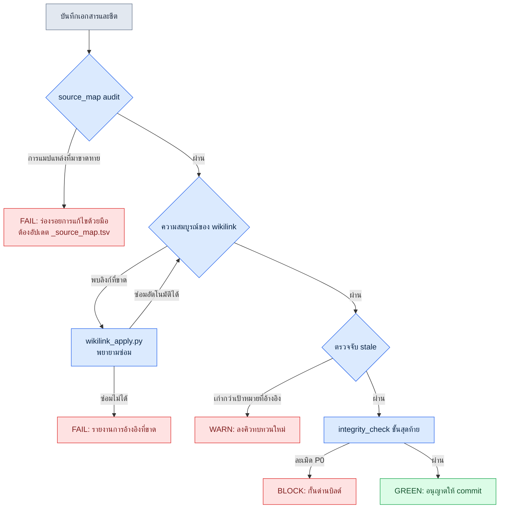

# 24.1 ระบบตรวจสอบ — จับความสอดคล้อง ลิงก์ และ stale ด้วยโค้ด

หลังจบสแตนด์อัปเช้าวันจันทร์ทันที สมาชิกทีม A จากทีมข้อมูลส่งภาพหน้าจอมาให้ทางแชตภายในทีม มันคือรายงาน QA ที่บอกว่าคำอธิบายของไอเทมวัตถุดิบบางตัวในร้านค้าในเกมว่างเปล่า หลังไล่ตามต้นเหตุอยู่ 30 นาที ตัวการก็ปรากฏ สองสัปดาห์ก่อน มีคนเปลี่ยนชื่อไอเทมนั้นในเอกสารออกแบบเป็น `재료_목재_상` แต่การอ้างอิงในชีตข้อมูลยังชี้ไปที่ชื่อเก่า `재료_목재_A` อยู่อย่างเดิม เอกสารถูกอัปเดต ชีตไม่ถูกอัปเดต และลิงก์ที่เชื่อมทั้งสองเข้าด้วยกันก็ขาดไปอย่างเงียบ ๆ ไม่มีใครโกหกสักคน แต่เกมกลับแสดงสิ่งที่เป็นเท็จออกมา

อุบัติเหตุแบบนี้จะเกิดบ่อยขึ้นแบบทวีคูณเมื่อเอกสารเพิ่มจำนวนขึ้น สายตามนุษย์มองเห็นการอ้างอิงไขว้กันของเอกสาร 50 ฉบับพร้อมกันไม่ได้ ด้วยเหตุนี้เราจึงมอบหมายงานตรวจสอบให้โค้ดทำแทน บทนี้ว่าด้วยระบบที่ทำให้สคริปต์ ไม่ใช่มนุษย์ เป็นผู้ตรวจสอบความสอดคล้องของเอกสาร ข้อมูล และลิงก์ แก่นมีอยู่สามอย่าง — ความสอดคล้องของแหล่งที่มา (`_source_map.tsv` audit), ความสมบูรณ์ของลิงก์ (wikilink), และการตรวจจับ stale (จับการอ้างอิงที่เก่าจนเน่าเสีย)

---

## 24.1.1 ทำไมลิงก์ที่ขาดจึงเงียบ

เอกสารและข้อมูลมีชีวิตอยู่โดยชี้หากันและกัน เอกสารออกแบบอ้างอิง enum, enum อ้างอิงชีตข้อมูล, และชีตก็อ้างอิงการตัดสินใจของเอกสารออกแบบอีกฉบับ ถ้ามนุษย์จัดการตาข่ายนี้ด้วยมือ เมื่อโหนดหนึ่งเปลี่ยนไป มนุษย์ต้องจำการอ้างอิงทั้งหมดที่เคยชี้ไปยังโหนดนั้นและไล่ตามมันให้ได้ ความทรงจำล้มเหลว

เหตุผลที่ลิงก์ขาดเป็นอันตรายคือมัน **ไม่โยน error** ออกมา ถ้าเป็นโค้ด เมื่ออ้างอิงตัวแปรที่ไม่มีอยู่ คอมไพเลอร์จะกั้นให้ แต่ wikilink ที่เขียนว่า `[[재료_목재_A]]` ในเอกสาร แม้เป้าหมายจะหายไป มันก็แค่ยังคงเป็นข้อความธรรมดาอยู่อย่างนั้น ไม่กลายเป็นสีแดง เกมถูกบิลด์ ถูกปล่อยออก และกว่าจะมีคนสังเกตเห็นก็ต่อเมื่อผู้เล่นเห็นคำอธิบายที่ว่างเปล่าแล้ว

ด้วยเหตุนี้ งานแรกของระบบตรวจสอบจึงคือ **การทำให้สิ่งที่สายตามนุษย์มองไม่เห็นกลายเป็นมองเห็นได้** ดึงการละเมิดความสอดคล้องออกมาเป็นเอาต์พุตข้อความ แล้วผูกเอาต์พุตนั้นไว้กับด่านบิลด์ เมื่อนั้นต่อให้มนุษย์ลืม สคริปต์ก็ไม่ลืม

---

## 24.1.2 cascade ของการตรวจสอบสามสาย

การตรวจสอบไม่ใช่ก้อนเดียว แต่เป็นลำดับขั้น เริ่มจากรันการตรวจสอบที่ถูกที่สุดก่อนเพื่อกรองการละเมิดที่ชัดเจนออก แล้วส่งเฉพาะสิ่งที่ผ่านไปยังขั้นถัดไป เพราะถ้ารันการตรวจสอบที่แพงกับทุกอินพุต มันจะช้าจนไม่มีใครยอมรัน ด้านล่างคือกระแสการตรวจสอบที่ผู้เขียนใช้งานจริง



แก่นของ cascade นี้คือ **ยิ่งล้มเหลวเร็ว ยิ่งถูก** `source_map audit` เป็นการเทียบ TSV แค่บรรทัดเดียวจึงจบภายในหน่วยมิลลิวินาที ตรงกันข้าม `integrity_check` ขั้นสุดท้ายต้องโหลดชีตข้อมูลทั้งหมดเพื่อตรวจสอบความสัมพันธ์ FK จึงใช้เวลาหลายวินาที เมื่อวางการตรวจสอบที่ถูกไว้ข้างหน้า ความผิดพลาดที่ชัดเจนจะถูกตัดออกตรงนั้น และการตรวจสอบที่แพงก็จะรันเฉพาะกับอินพุตส่วนน้อยที่ผ่านมันมาได้

อีกประเด็นที่สำคัญคือเอาต์พุตของแต่ละขั้นต่างกัน `audit` ให้ FAIL (หลักฐานว่าผู้แก้ไขไปแตะอะไรบางอย่างด้วยมือ), `wikilink` ให้ FAIL หลังพยายามซ่อมอัตโนมัติ, `stale` ให้ WARN (ไม่ถึงกับกั้น แต่ต้องทบทวนใหม่), `integrity_check` ให้ BLOCK (กั้นตัวบิลด์เอง) แม้จะเป็น "ปัญหา" เหมือนกัน แต่ต้องตอบสนองต่างกันตามระดับความรุนแรง มนุษย์จึงจะแยกแยะสัญญาณออกจากสิ่งรบกวนได้

---

## 24.1.3 ขั้นแรก — `_source_map.tsv` audit

การตรวจสอบที่รันก่อนสุดคือความสอดคล้องของแหล่งที่มา ไปป์ไลน์สร้างเอกสารของผู้เขียนจะบันทึกไว้ใน `_source_map.tsv` ว่าเอกสารสังเคราะห์ใด (เช่น เนื้อหา GDD) มาจากไฟล์ต้นทางใด หนึ่งบรรทัดตรึงสายเลือด (lineage) ไว้ว่า "เซกชันของผลลัพธ์นี้ = การสังเคราะห์จากไฟล์ต้นทางเหล่านี้"

เหตุผลที่สิ่งนี้กลายเป็นเครื่องมือตรวจสอบได้ก็เพราะ **เมื่อมนุษย์แก้ไขผลลัพธ์ด้วยมือ การแมปจะขาด** หากมีใครไปแก้เซกชัน GDD ที่ถูกสร้างอัตโนมัติโดยตรง เซกชันนั้นก็จะไม่ใช่การสังเคราะห์ที่ซื่อตรงต่อไฟล์ต้นทางอีกต่อไป สคริปต์ audit จะเทียบแฮชของแต่ละเซกชันในผลลัพธ์กับแฮชที่สังเคราะห์ใหม่จากต้นทาง และถ้าไม่ตรงกันก็จะให้ FAIL กฎที่ว่า "แก้ไขด้วยมือ → audit FAIL" ออกมาจากตรงนี้

นี่ไม่ใช่การพยายามห้ามไม่ให้มนุษย์แก้ไข แต่เป็นการพยายาม **ทำให้การแก้ไขแสดงตัวออกมาอย่างชัดเจน** ถ้าจำเป็นต้องแก้ผลลัพธ์ ก็ให้เลือกอย่างใดอย่างหนึ่งระหว่างแก้ต้นทางแล้วสร้างใหม่ หรือถอดเซกชันนั้นออกจากการแมปอย่างเป็นทางการ (ประกาศแยก) สัญญาณนี้กำลังบอกแบบนั้น การทำให้การแก้ไขเงียบ ๆ กลายเป็นเสียงดัง นั่นคืองานของ audit

---

## 24.1.4 ขั้นที่สอง — ความสมบูรณ์ของ wikilink และการซ่อมตัวเอง

เมื่อผ่าน audit แล้วก็ข้ามไปยังการตรวจสอบลิงก์ เอกสารของผู้เขียนเชื่อมต่อโหนดด้วย wikilink แบบ Obsidian `[[เป้าหมาย]]` `wikilink_apply.py` ทำสองอย่าง — ตีความ wikilink เป็นเส้นทางจริงแล้วนำไปใช้ และซ่อมลิงก์ที่ขาดเท่าที่ทำได้ในขอบเขตที่เป็นไปได้

กรณีที่ซ่อมได้นั้นชัดเจน นั่นคือเมื่อโหนดเป้าหมาย **เพียงแค่เปลี่ยนชื่อ แต่ยังคงอยู่ที่ตำแหน่งเดิม** การเปลี่ยนชื่อแบบ `재료_목재_A` → `재료_목재_상` ที่กล่าวมาก่อนหน้า ถ้าการแมปชื่อแทน (alias map) ถูกอัปเดตไว้ สคริปต์ก็จะแก้ชื่อเก่าให้เป็นชื่อใหม่โดยอัตโนมัติ ในทางกลับกัน ถ้าเป้าหมายถูกลบไปทั้งก้อน หรือไล่ตามไม่ได้ว่าย้ายไปไหน ก็จะยอมแพ้ในการซ่อมแล้วรายงานการอ้างอิงที่ขาดออกมา

ตรงนี้มีการตัดสินใจเชิงออกแบบอยู่หนึ่งข้อ **ถ้าซ่อมอัตโนมัติแบบรุกเกินไป มันอันตราย** ถ้าไปค้นหา "ชื่อที่คล้ายกัน" แล้วเชื่อมต่อตามอำเภอใจ ลิงก์อาจถูกต่อผิดไปยังโหนดที่มีความหมายต่างกัน ทำให้เกิดอุบัติเหตุที่แย่กว่าเดิม ด้วยเหตุนี้การซ่อมของ `wikilink_apply.py` จึงอนุรักษนิยม — แก้อัตโนมัติเฉพาะการเปลี่ยนชื่อที่มีการแมปชื่อแทนระบุไว้ชัดเจน ส่วนกรณีที่ต้องเดาก็โยนให้มนุษย์ คุณธรรมของการทำงานอัตโนมัติอยู่ที่ความพอเหมาะ — ทำอัตโนมัติเฉพาะสิ่งที่แน่ใจ และโยนสิ่งที่คลุมเครือให้มนุษย์อย่างซื่อตรง

---

## 24.1.5 ขั้นที่สาม — ตรวจจับ stale

ต่อให้ลิงก์ยังมีชีวิตอยู่ **การอ้างอิงก็อาจเก่าได้** เอกสาร A อ้างอิงชีตข้อมูล B แต่ถ้า B ถูกอัปเดตทีหลัง A คำอธิบายของ A ก็มีโอกาสจะขัดกับ B ในปัจจุบัน ตัวลิงก์เองยังปกติดี เพราะเป้าหมายที่ชี้ไปยังมีอยู่ แต่เนื้อหาเน่าเสียแล้ว

การตรวจจับ stale จะเทียบเวลาที่แก้ไข (หรือเวอร์ชันของแฮชเนื้อหา) ของทั้งสองฝั่งของการอ้างอิง ถ้าฝั่งที่อ้างอิงเก่ากว่าเป้าหมายที่ถูกอ้างอิง ก็จะแสดง WARN และลงคิวทบทวนโหนดนั้นใหม่ เหตุผลที่เป็น WARN ไม่ใช่ BLOCK ก็เพราะการอัปเดตไม่ได้หมายถึงความขัดแย้งของเนื้อหาเสมอไป ถ้าเป็นการอัปเดตที่แค่แก้พิมพ์ผิดหนึ่งตัว การอ้างอิงก็ยังปกติดี ด้วยเหตุนี้ stale จึงไม่ใช่ "การกั้น" แต่เป็น "การติดป้ายให้เข้าไปดู"

ลองดูว่าขั้นนี้จับอุบัติเหตุลิงก์ขาดที่กล่าวมาก่อนหน้าได้อย่างไร ถ้าชีต `재료_목재` ถูกอัปเดตทีหลังเอกสาร ก่อนการซ่อมอัตโนมัติ stale WARN ก็คงขึ้นไปแล้ว นั่นคือการตรวจสอบทั้งสามเป็น **ตาข่ายนิรภัยที่ซ้อนทับกัน** สิ่งที่ตาข่ายหนึ่งพลาดไป ตาข่ายถัดไปจะจับ นี่คือเหตุผลที่ cascade จับอุบัติเหตุที่การตรวจสอบเดี่ยว ๆ จับไม่ได้

---

## 24.1.6 บันทึกเซสชันจริง (worked transcript) — ให้ Claude เป็นผู้สร้างสคริปต์ตรวจสอบ

ถ้ามนุษย์ต้องเขียนตรรกะการตรวจสอบทั้งหมดเองตั้งแต่ต้น ก็จะเหนื่อย ผู้เขียนจะบรรยายกฎการตรวจสอบเป็นภาษาธรรมชาติ แล้วรับร่างแรกของสคริปต์ที่รันได้จาก AI ด้านล่างคือเซสชันจริงที่สร้างสคริปต์ตรวจจับ stale เอาต์พุตไม่ได้ถูกขัดเกลา แต่ปล่อยทิ้งกระบวนการล้มเหลวและการปฏิเสธไว้ตามจริง

**[พรอมต์ฉบับเต็ม]**

> ไฟล์ Markdown ในโฟลเดอร์เอกสารเชื่อมต่อหากันด้วย wikilink `[[เป้าหมาย]]` ช่วยสร้างสคริปต์ Python ที่ตรวจสอบว่าแต่ละเอกสารถูกอัปเดตเก่ากว่าไฟล์เป้าหมายที่มันอ้างอิงหรือไม่ (=stale) เงื่อนไข:
> - เวลาที่แก้ไขไฟล์ใช้เกณฑ์เวลาคอมมิตสุดท้ายของ git (mtime ของไฟล์ระบบเชื่อไม่ได้ เพราะถูกอัปเดตตอน checkout)
> - ลิงก์ที่ขาด (ไม่มีเป้าหมาย) ให้แยกออกจากการตรวจสอบ stale และรายงานต่างหาก
> - เอาต์พุตเป็น TSV: `source<TAB>target<TAB>status` (status = OK / STALE / BROKEN)
> - WARN ไม่กั้น โค้ดออก (exit code) คงเป็น 0 (ห้ามกั้นบิลด์)

**[เอาต์พุตดิบของ Claude — รอบที่ 1]**

> สคริปต์ด้านล่างใช้ `git log -1 --format=%ct <file>` เพื่อหาเวลาคอมมิตสุดท้ายของแต่ละไฟล์ และดึง wikilink ออกมาด้วย regex `\[\[([^\]]+)\]\]` เพื่อเทียบกัน
>
> ```python
> import subprocess, re, sys, pathlib
>
> def git_mtime(path):
>     out = subprocess.run(
>         ["git", "log", "-1", "--format=%ct", str(path)],
>         capture_output=True, text=True)
>     return int(out.stdout.strip())
>
> def resolve(link, root):
>     # [[เป้าหมาย]] -> root/เป้าหมาย.md
>     return root / f"{link}.md"
>
> root = pathlib.Path(sys.argv[1])
> for md in root.glob("*.md"):
>     src_t = git_mtime(md)
>     for link in re.findall(r"\[\[([^\]]+)\]\]", md.read_text(encoding="utf-8")):
>         tgt = resolve(link, root)
>         if not tgt.exists():
>             print(f"{md.name}\t{link}\tBROKEN")
>             continue
>         tgt_t = git_mtime(tgt)
>         status = "STALE" if src_t < tgt_t else "OK"
>         print(f"{md.name}\t{link}\t{status}")
> ```
>
> ทำแบบนี้ก็จะได้เอาต์พุตในรูปแบบ TSV ตามที่ร้องขอ

**[การตรวจสอบโดยมนุษย์ / การปฏิเสธ]**

หยุดตรงนี้ ผู้เขียนเห็นข้อบกพร่องสามอย่าง

ข้อแรก ถ้า `git_mtime` คืนค่าสตริงว่าง มันจะระเบิดที่ `int("")` ไฟล์ใหม่ที่ไม่เคยถูกคอมมิตเป็นแบบนั้น ข้อสอง `glob("*.md")` มองไม่เห็นโฟลเดอร์ย่อย เอกสารของผู้เขียนกระจายอยู่ใต้ `part*/` ข้อสาม — สำคัญที่สุด — wikilink มีกรณีที่มีชื่อแทนคั่นด้วยไปป์แบบ `[[เป้าหมาย|ชื่อที่แสดง]]` และโค้ดรอบที่ 1 เข้าใจผิดว่า `เป้าหมาย|ชื่อที่แสดง` ทั้งก้อนเป็นชื่อไฟล์ ถ้าเป็นแบบนี้ ลิงก์ที่ปกติดีจะถูกจับเป็น BROKEN ทั้งหมด ถ้าเอาไปใช้ตามนั้นมันคือระเบิดสัญญาณเตือนเท็จ

ผู้เขียนชี้สามข้อนี้แล้วร้องขอใหม่

**[การร้องขอใหม่]**

> ช่วยแก้สามอย่าง: (1) ไฟล์ที่ยังไม่ถูกคอมมิต git_mtime เป็น None กรณีนี้ให้พักการตัดสิน STALE ไว้แล้วใช้ status=UNTRACKED (2) ใช้ rglob แทน glob เพื่อรวมโฟลเดอร์ย่อย (3) จัดการไปป์ `[[เป้าหมาย|ชื่อแทน]]` — ใช้เฉพาะส่วนหน้า `|` เป็นเป้าหมาย และโค้ดออก (exit code) คงเป็น 0 แม้จะมี BROKEN (หลักการ WARN ไม่กั้น)

**[เอาต์พุตดิบของ Claude — รอบที่ 2]**

> ```python
> import subprocess, re, sys, pathlib
>
> def git_mtime(path):
>     out = subprocess.run(
>         ["git", "log", "-1", "--format=%ct", str(path)],
>         capture_output=True, text=True)
>     s = out.stdout.strip()
>     return int(s) if s else None   # ไม่มีประวัติคอมมิตก็คืน None
>
> def target_name(link):
>     return link.split("|", 1)[0].strip()   # [[เป้าหมาย|ชื่อแทน]] -> เป้าหมาย
>
> root = pathlib.Path(sys.argv[1])
> for md in root.rglob("*.md"):
>     src_t = git_mtime(md)
>     text = md.read_text(encoding="utf-8")
>     for raw in re.findall(r"\[\[([^\]]+)\]\]", text):
>         name = target_name(raw)
>         hits = list(root.rglob(f"{name}.md"))
>         if not hits:
>             print(f"{md.name}\t{name}\tBROKEN")
>             continue
>         tgt_t = git_mtime(hits[0])
>         if src_t is None or tgt_t is None:
>             status = "UNTRACKED"
>         elif src_t < tgt_t:
>             status = "STALE"
>         else:
>             status = "OK"
>         print(f"{md.name}\t{name}\t{status}")
>
> sys.exit(0)   # WARN ไม่กั้น: คืน 0 เสมอ
> ```

เอาต์พุตรอบที่ 2 นี้ผู้เขียนรับไว้ แต่มีอยู่หนึ่งอย่างที่เป็นการตัดสินใจที่มนุษย์เหลือไว้ — ถ้า `rglob(f"{name}.md")` ค้นเจอไฟล์ชื่อเดียวกันในหลายโฟลเดอร์ มันจะใช้แค่ `hits[0]` นี่เป็นความกำกวมที่อาจเกิดขึ้นได้ แต่ตามกฎการตั้งชื่อไฟล์ในเอกสารของผู้เขียน ชื่อไฟล์เป็นค่าไม่ซ้ำกันทั้งระบบ จึงไม่มีการชนกันในงานจริง ผู้เขียนรับสมมติฐานนี้ที่ AI ไม่ได้ชี้ไว้อย่างมีสติแล้วเขียนกำกับไว้เป็นคอมเมนต์ **ต่อให้เป็นโค้ดที่การทำงานอัตโนมัติเขียนขึ้น มนุษย์ก็รับผิดชอบต่อสมมติฐานที่โค้ดนั้นพึ่งพา**

---

## 24.1.7 ผูกผลการตรวจสอบไว้กับด่านบิลด์

ต่อให้มีสคริปต์ ถ้าไม่มีใครรันก็ไร้ประโยชน์ การออกแบบขั้นสุดท้ายของการตรวจสอบคือ **การทำให้ไม่รันไม่ได้** ผู้เขียนผูกสามขั้นไว้กับ hook ก่อน commit (pre-commit) หรือไปป์ไลน์บิลด์ audit FAIL และการละเมิด P0 ของ integrity_check เป็น BLOCK จึงกั้น commit/บิลด์ ส่วน wikilink BROKEN และ stale เป็น WARN จึงปล่อยให้ผ่านแต่ทิ้งรายงานไว้

การแบ่งสองทาง BLOCK/WARN นี้เป็นตัวกำหนดความอยู่รอดของระบบ ถ้ากั้นทุกอย่างเป็น BLOCK commit จะถูกกั้นเพราะ stale เล็ก ๆ น้อย ๆ เพียงหนึ่งตัว แล้วผู้คนก็จะเริ่มเลี่ยงตัวการตรวจสอบเอง การตรวจสอบที่ถูกเลี่ยงคือการตรวจสอบที่ไม่มีอยู่ ในทางกลับกัน ถ้าตั้งทุกอย่างเป็น WARN การละเมิดความสมบูรณ์ของข้อมูลที่ต้องกั้นจริง ๆ ก็จะผ่านไปเฉย ๆ **เส้นแบ่งระหว่างสิ่งที่จะกั้นกับสิ่งที่จะเพียงติดป้าย คือจุดออกแบบที่แท้จริงของระบบตรวจสอบ**

---

## 24.1.8 การวัด — ก่อนและหลังเปิดการตรวจสอบด้วยโค้ด

นี่คือแนวโน้มที่สังเกตได้จากโปรเจกต์ A ของบริษัทพัฒนา MMORPG A ที่ผู้เขียนดูแล โดยอิงเกณฑ์เอกสารราว 90 ฉบับ ตัวเลขสัมบูรณ์บางส่วนเป็นการประมาณของผู้เขียน (ยังไม่ได้ตรวจสอบ) และสิ่งที่มีความหมายคือแนวโน้ม

| รายการ | ยุคตรวจด้วยมือ | cascade ตรวจสอบด้วยโค้ด |
|---|---|---|
| จุดที่พบการอ้างอิงที่ขาด | หลังรายงานของผู้เล่น/QA | ก่อน commit (ทิศทาง: เกิดเหตุ → ก่อนเกิด) |
| เวลาที่ใช้ตรวจความสอดคล้องหนึ่งครั้ง | หลายชั่วโมง (ประมาณของผู้เขียน) | หลักสิบวินาที (วัดจริงด้วยสคริปต์) |
| stale ที่สะสมแฝงตัว | แฝงตัวหลายสัปดาห์ | WARN ที่ commit ถัดไป |
| อุบัติเหตุจากการซ่อมอัตโนมัติผิดพลาด | ไม่มี | คงไว้ 0 รายการด้วยการซ่อมแบบอนุรักษนิยม |

ผู้เขียนแนะนำให้เชื่อเฉพาะทิศทางที่ว่า "จุดที่พบถูกดึงจากหลังเกิดเหตุมาเป็นก่อนเกิดเหตุ" มากกว่าจะเชื่อตัวเลขตรงตัว คุณค่าที่แท้จริงของระบบตรวจสอบไม่ได้อยู่ที่การประหยัดเวลา แต่อยู่ที่ **การย้ายตำแหน่งที่ทำให้จับอุบัติเหตุได้ก่อนที่มันจะไปถึงผู้เล่น**

---

## 24.1.9 ความล้มเหลวที่พบบ่อย

| รูปแบบ | วิธีแก้ |
|---|---|
| กั้นทุกการละเมิดเป็น BLOCK จนผู้คนเลี่ยงการตรวจสอบ | แบ่งสองทาง BLOCK/WARN กั้นเฉพาะ P0 ของความสมบูรณ์ของข้อมูล |
| ซ่อมอัตโนมัติแบบรุกไปจนถึงขั้นเดา | แก้อัตโนมัติเฉพาะการเปลี่ยนชื่อที่มีชื่อแทนระบุชัด คลุมเครือก็โยนให้มนุษย์ |
| ดูแค่ลิงก์ที่ขาดแล้วเมิน stale | ตรวจจับการอ้างอิงที่เก่าต่างหากด้วยการเทียบเวลาที่แก้ไข |
| ปล่อยให้แก้ไขผลลัพธ์ด้วยมืออย่างเงียบ ๆ | ทำให้การแก้ไขมองเห็นได้เป็น FAIL ด้วย source_map audit |
| มีสคริปต์แต่ไม่ผูกไว้กับ hook | เชื่อมกับ pre-commit/ด่านบิลด์ ทำให้ไม่รันไม่ได้ |

---

## ลองทำดู — cascade ตรวจสอบขั้นต่ำหนึ่งชุด

**setup.** จัดการโฟลเดอร์เอกสารด้วย git (เป็นเกณฑ์ในการเทียบเวลาคอมมิต) ทำ wikilink ให้เป็นมาตรฐานเดียวกันด้วยรูปแบบ `[[เป้าหมาย]]` หรือ `[[เป้าหมาย|ชื่อแทน]]`

**prompt.** ส่งพรอมต์ฉบับเต็มของบันทึกเซสชันข้างต้นให้ AI ตามนั้น แต่อย่าเอาเอาต์พุตแรกไปใช้ตรง ๆ เด็ดขาด คุณต้องตรวจสอบและปฏิเสธแล้วร้องขอใหม่สามอย่างนี้เสมอ — (1) การจัดการไฟล์ที่ยังไม่ถูกคอมมิต (2) การค้นหาโฟลเดอร์ย่อย (3) การพาร์สชื่อแทนแบบไปป์ นี่คือจุดที่ AI แทบจะพลาดในรอบแรกเสมอ

**verify.** รันสคริปต์เพื่อรับ TSV ตรวจด้วยมือว่าแถว `BROKEN` เป็นลิงก์ที่ขาดจริงหรือไม่ โดยสุ่มตัวอย่าง 5 รายการ ถ้าออกมาเป็น BROKEN เท็จ แสดงว่าการพาร์สชื่อแทน/โฟลเดอร์ย่อยยังไม่ครบ เมื่อยืนยันว่าปกติแล้วก็ผูกไว้กับ pre-commit hook โดยแยกโค้ดออก (exit code) ให้ WARN (STALE/BROKEN) ผ่าน และ BLOCK (P0 ของความสมบูรณ์ของข้อมูล) กั้น

**ฉบับย่อสำหรับคนเดียว.** ถ้าคุณเขียน GDD เล็ก ๆ คนเดียว cascade ทั้งชุดก็มากเกินไป เอาไปแค่ **ขั้นตรวจจับ stale ขั้นเดียว** ก็พอ แค่เทียบด้วยเวลาของ git ว่าเอกสารเก่ากว่าชีตข้อมูลหรือไม่ ก็จับอุบัติเหตุแบบ "นึกว่าแก้แล้วแต่ยังไม่ได้แก้" ได้เกือบทั้งหมด ส่วนการซ่อมอัตโนมัติและ source_map audit ค่อยเพิ่มเข้ามาตอนที่เอกสารเกิน 30 ฉบับจนตามด้วยมือไม่ไหวก็ได้

---

### สรุปประเด็นสำคัญของบท
- ลิงก์ที่ขาดไม่โยน error จึงย้ายการตรวจสอบมาไว้ในโค้ด เพื่อดึงการละเมิดที่สายตามนุษย์มองไม่เห็นออกมาเป็นเอาต์พุต
- ด้วย cascade ที่เริ่มจากการตรวจสอบที่ถูกก่อน ตัดความผิดพลาดที่ชัดเจนออกไปก่อน แล้วรันการตรวจสอบที่แพงเฉพาะกับส่วนน้อย
- เส้นแบ่งระหว่าง BLOCK กับ WARN คือจุดออกแบบที่แท้จริงของระบบตรวจสอบ และถ้ากั้นทุกอย่างก็จะถูกเลี่ยง
