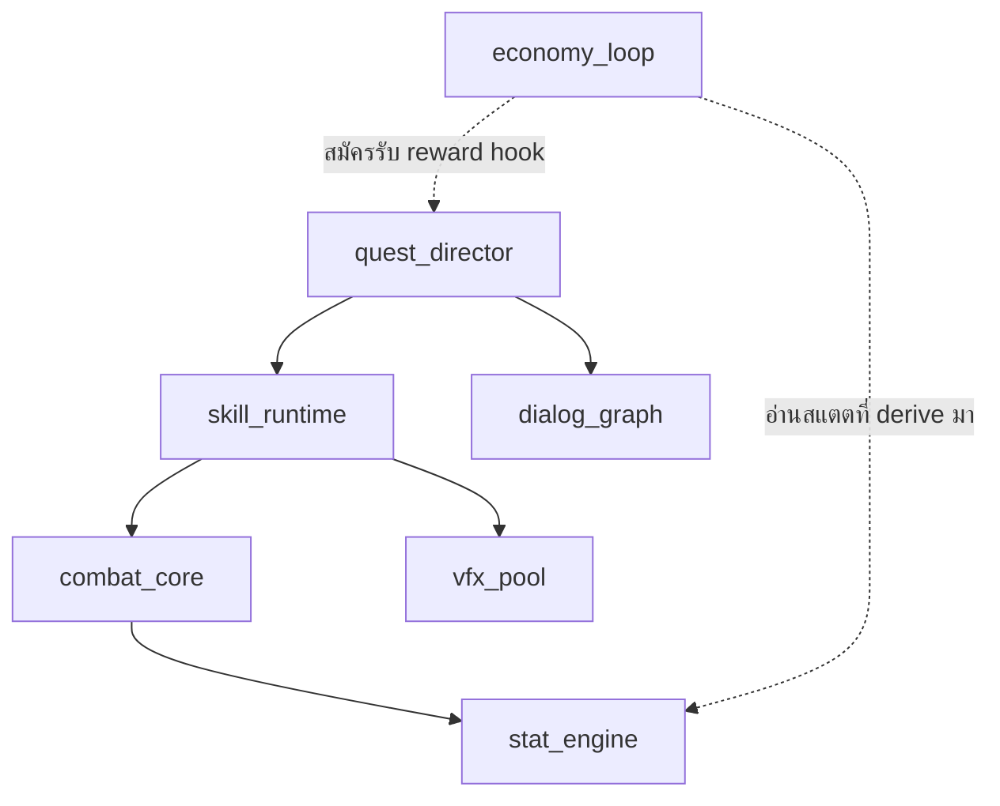
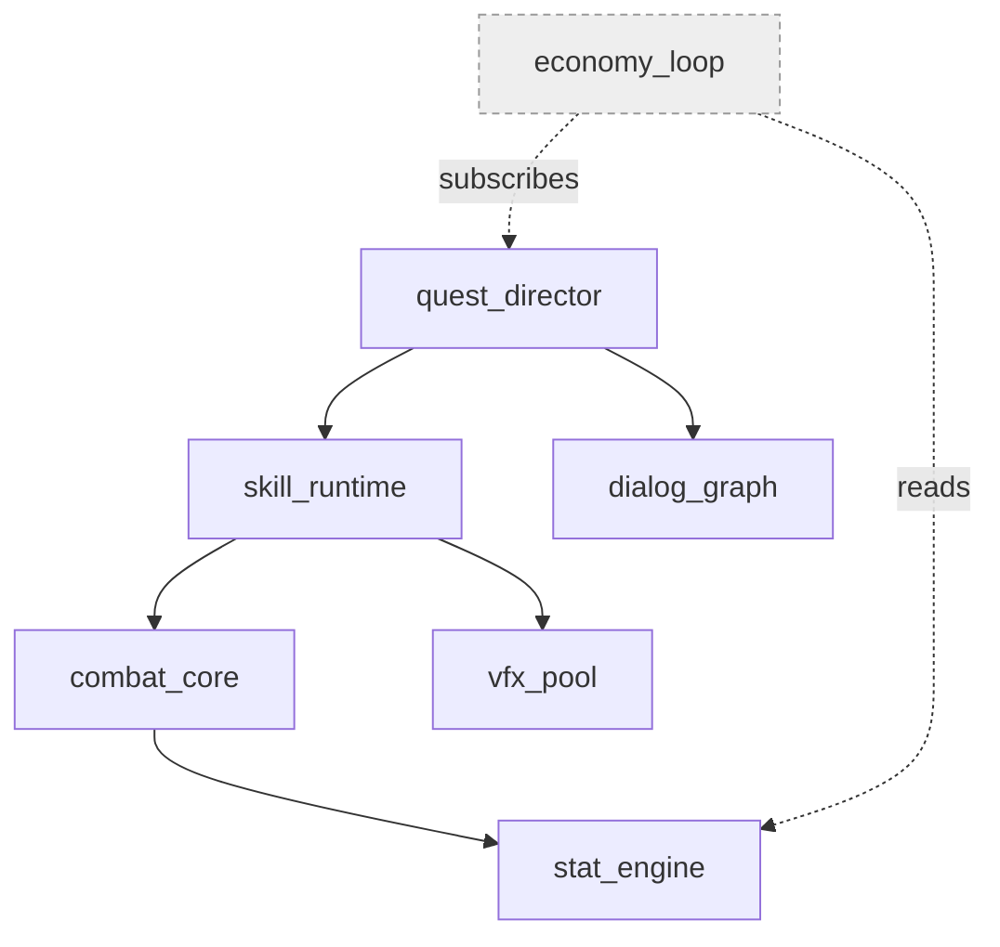
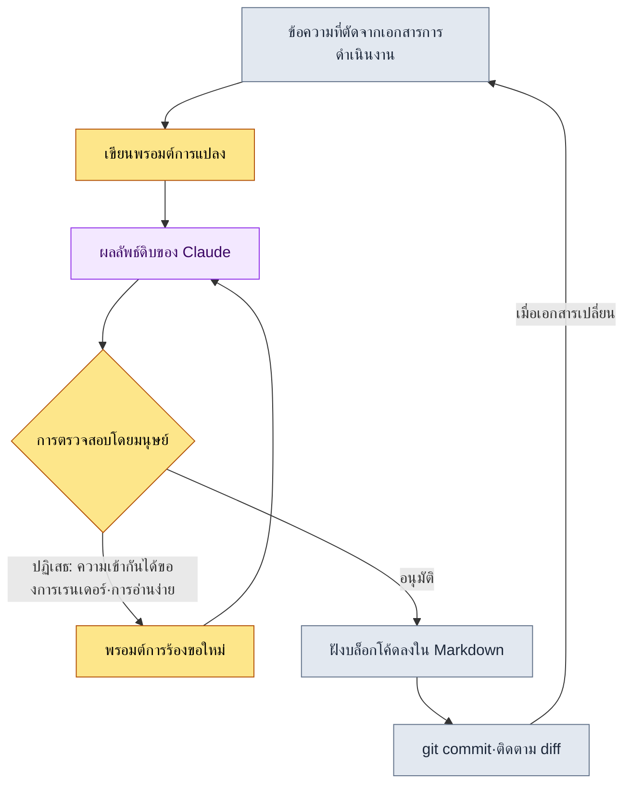
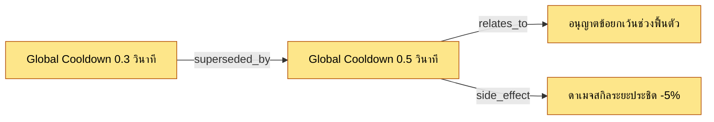

# 24.2 การทำไดอะแกรม Mermaid อัตโนมัติ — ให้เอกสารวาดภาพของตัวเอง

นักออกแบบเกมที่เพิ่งเข้าทำงานได้สามวันถามขึ้นมาว่า "พี่ครับ ภาพที่สรุปว่าระบบเหล่านี้ส่งผลต่อกันตามลำดับไหน มีอยู่ที่ไหนบ้างครับ" ผมลังเลอยู่ครู่หนึ่ง ภาพน่ะมีอยู่ มีรูปถ่ายไวต์บอร์ดที่ใครบางคนวาดไว้เมื่อราวครึ่งปีก่อนแปะอยู่ที่ไหนสักแห่งในวิกิ แต่ในภาพนั้นยังมีระบบที่ตอนนี้หายไปแล้วเหลืออยู่สองระบบ และขาดลูปหลักสามลูปที่ถูกเพิ่มเข้ามาภายหลัง สุดท้ายผมจึงตอบไปว่า "อย่าไปเชื่อภาพ ให้อ่านเอกสารเอา" เป็นคำตอบที่น่าอาย ในจังหวะที่ภาพไม่ตรงกับเอกสาร ภาพก็เลิกเป็นข้อมูล แล้วกลายเป็นข้อมูลผิดทันที

ขอพูดข้อสรุปของบทนี้ก่อน เป็นอย่างนี้ ไดอะแกรมที่คนวาดเองจะต้องเน่าเสียภายในหนึ่งถึงสองเดือนอย่างหลีกเลี่ยงไม่ได้ ดังนั้นจึงต้องถอดงานวาดไดอะแกรมออกจากมือคน แล้วทำให้โครงสร้างของเอกสารเองคายภาพของตัวเองออกมา บทความนี้จะแสดงกระบวนการนั้นผ่านบันทึกการทำงานจริงครั้งหนึ่ง โดยนำบันทึกเซสชันจริง (worked transcript) ที่รับเอกสารเป็นอินพุตแล้วสร้างโค้ด Mermaid มาลงไว้ทั้งก้อน และเรนเดอร์ไดอะแกรมที่ดึงออกมานั้นจริง ๆ ในหน้านี้ พูดอีกอย่างคือ บทความที่อธิบายเทคนิคหนึ่ง พิสูจน์ตัวเองด้วยผลผลิตของเทคนิคนั้นนั่นเอง

---

## 24.2.1 ทำไมต้องเป็น Mermaid

เครื่องมือทำไดอะแกรมมีมากมาย ตั้งแต่ draw.io, Figma, Visio ไปจนถึงรูปถ่ายไวต์บอร์ด เครื่องมือเหล่านี้มีกับดักร่วมกันอยู่อย่างหนึ่ง นั่นคือผลลัพธ์เป็นไฟล์ภาพ (รูปภาพ) ภาพไม่สามารถให้ git ติดตามการเปลี่ยนแปลงทีละบรรทัดได้ LLM ที่จัดการกับข้อความก็ไม่สามารถสร้างหรือแก้ไขได้โดยตรง และไม่สามารถถูกฝังเป็นโค้ดในเอกสาร Markdown ได้ ในมุมมองของการดำเนินงาน สิ่งที่ร้ายแรงที่สุดคือข้อแรก ภาพที่ติดตามไม่ได้ว่าใครเปลี่ยน เปลี่ยนเมื่อไหร่ และเปลี่ยนทำไม เมื่อเวลาผ่านไปก็จะกลายเป็นซากที่ไม่มีใครรับผิดชอบ

Mermaid แก้ทั้งสามเรื่องนี้ได้ในคราวเดียว เขียนไดอะแกรมเป็นข้อความ ส่วนการเรนเดอร์ปล่อยให้วิวเวอร์จัดการเอง เพราะเป็นข้อความ `git diff` จึงจับได้แม้กระทั่งการเพิ่มโหนดเข้ามาเพียงโหนดเดียว เพราะเป็นข้อความ LLM จึงอ่านและเขียนได้ เพราะเป็นข้อความ มันจึงเข้าไปอยู่ในบล็อกโค้ด Markdown ได้ตรง ๆ เนื้อหาของบทนี้เองคือหลักฐานนั้น ไดอะแกรมที่จะปรากฏในไม่ช้าใต้ประโยคที่คุณกำลังอ่านอยู่นี้ ล้วนเป็นบล็อกข้อความภายใน Markdown ทั้งสิ้น และถูกเรนเดอร์เป็นภาพในกระบวนการ build หนังสือ

แต่ก็ต้องป้องกันความเข้าใจผิดไว้ด้วย ไม่จำเป็นเลยที่จะต้องทำเอกสารการดำเนินงานทุกชิ้นให้เป็นไดอะแกรม การนำรายการมาเรียงต่อกัน ใช้หัวข้อย่อย (bullet) จะเร็วกว่า การเปรียบเทียบตัวเลข ใช้ตารางจะเร็วกว่า ที่ที่ Mermaid ชนะมีอยู่แค่สามอย่าง ความสัมพันธ์ (อะไรเชื่อมกับอะไร) การไหล (อะไรมาหลังอะไร) และซีเควนซ์ (ใครส่งอะไรให้ใครเมื่อไหร่) ถ้าฝืนยัดไดอะแกรมเข้าไปในที่ที่ไม่ใช่สามอย่างนี้ กลับจะเพิ่มภาระทางความคิดเสียมากกว่า

---

## 24.2.2 กระดูกสันหลัง: การทำงานครั้งหนึ่งที่ดึงไดอะแกรมออกมาจากโครงสร้างเอกสาร

จากตรงนี้ไปคือกระดูกสันหลังของบทนี้ แทนที่จะอธิบายแบบนามธรรม จะแสดงกระบวนการแปลงเอกสารจริงก้อนหนึ่งให้เป็น Mermaid ตั้งแต่ต้นจนจบ อินพุตคือชิ้นส่วน Markdown ที่บันทึกโครงสร้างการพึ่งพา (dependency) ระหว่างระบบ ซึ่งอยู่ในเอกสารการดำเนินงานของโปรเจกต์ A (ด้านล่างเป็นข้อความที่ตัดมาจริงและทำให้ไม่ระบุตัวตนแล้ว)

````text
# บันทึกการพึ่งพาของระบบ (ตัดมาจากเอกสารการดำเนินงาน ทำให้ไม่ระบุตัวตน)

- combat_core พึ่งพา stat_engine
- skill_runtime พึ่งพา combat_core
- skill_runtime พึ่งพา vfx_pool
- quest_director พึ่งพา skill_runtime
- quest_director พึ่งพา dialog_graph
- economy_loop สมัครรับ (subscribe) reward hook ของ quest_director
- economy_loop อ่านสแตตที่ derive มาจาก stat_engine
````

ถ้านำสิ่งนี้มาวาดเป็นไดอะแกรมด้วยมือ ก็จะได้โหนดเจ็ดโหนดกับลูกศรเจ็ดเส้น วาดครั้งเดียวยังพอวาดได้ ปัญหาอยู่ที่สัปดาห์หน้า เมื่อมีการเพิ่มระบบ `mail_box` และ `dialog_graph` ถูกแยกออกเป็นสอง ภาพที่วาดด้วยมือจะเริ่มโกหกตั้งแต่จังหวะนั้น ด้วยเหตุนี้จึงไม่ให้คนทำ แต่ให้ LLM เป็นผู้แปลงแทน

### ขั้นที่ 1 — พรอมต์เต็ม

ด้านล่างคือพรอมต์ที่ผมโยนเข้าไปจริง ๆ ลงไว้ตามนั้นทั้งหมดโดยไม่ขัดเกลาแม้แต่ตัวอักษรเดียว

````text
ช่วยแปลงบันทึกการพึ่งพาของระบบด้านล่างให้เป็น Mermaid graph (บนลงล่าง, graph TB) กฎคือ:
1. ใช้เฉพาะระบบที่ปรากฏในบันทึกเป็นโหนด ห้ามเพิ่มระบบใหม่
2. "A พึ่งพา B" ให้เป็น A --> B
3. การเชื่อมโยงแบบหลวม เช่น "สมัครรับ" "อ่าน" ให้ใช้เส้นประ -.-> แล้วใส่ชื่อความสัมพันธ์กำกับ
4. id ของโหนดให้ใช้ชื่อภาษาอังกฤษในบันทึกตามนั้น อย่าใส่ป้ายภาษาเกาหลี
เอาเฉพาะบล็อกโค้ด ตัดคำอธิบายและคอมเมนต์ออก

[บันทึก]
- combat_core พึ่งพา stat_engine
- skill_runtime พึ่งพา combat_core
- skill_runtime พึ่งพา vfx_pool
- quest_director พึ่งพา skill_runtime
- quest_director พึ่งพา dialog_graph
- economy_loop สมัครรับ (subscribe) reward hook ของ quest_director
- economy_loop อ่านสแตตที่ derive มาจาก stat_engine
````

กฎข้อ 1 และข้อ 4 คือหัวใจ อุบัติเหตุที่พบบ่อยที่สุดเวลามอบงานวาดไดอะแกรมให้ LLM คือ "อาการหลอนแบบใจดี (hallucination)" มันจะเพิ่มโหนดที่ไม่ได้สั่ง ("ปกติมักจะมีระบบล็อกอินด้วย เลยใส่เข้าไปให้ครับ") และใส่ป้ายภาษาเกาหลีตามใจชอบ จนทำให้ ID กับการค้นหาในเนื้อหาไม่ตรงกัน เราใช้กฎมาตัดความใจดีนั้นออกไป

### ขั้นที่ 2 — ผลลัพธ์ดิบของ Claude (ไม่มีการสรุป)

ต่อไปนี้คือคำตอบที่โมเดลส่งกลับมาครั้งแรก ลงไว้ตามนั้นโดยไม่ได้ขัดเกลา ในนั้นมีปัญหาเล็ก ๆ ปนอยู่หนึ่งอย่าง และผมจะลงไว้ทั้งปัญหานั้นด้วย

````text

````

ไวยากรณ์ไม่มีปัญหา และโหนดก็มีเจ็ดโหนดพอดี ไม่ได้กุระบบใหม่ขึ้นมา กฎข้อ 1 และ 4 ถูกทำตาม แต่มีอยู่อย่างหนึ่งที่สะดุดใจ มีภาษาเกาหลีอยู่ในป้ายของเส้นประ (`สมัครรับ reward hook`, `อ่านสแตตที่ derive มา`) นี่ไม่ใช่การละเมิดกฎ เพราะกฎข้อ 3 บอกให้ "ใส่ชื่อความสัมพันธ์กำกับ" โมเดลจึงทำตามอย่างซื่อสัตย์ เพียงแต่ผมรู้จากประสบการณ์ว่า ใน Mermaid ถ้าป้ายภาษาเกาหลีมีช่องว่างคั่นอยู่ เรนเดอร์เวอร์ชันเก่าบางตัวจะแสดงผลพัง โมเดลไม่มีทางรู้เรื่องนั้นได้

### ขั้นที่ 3 — การตรวจสอบและการปฏิเสธโดยมนุษย์

ตรงนี้คือขั้นตอนที่ถูกข้ามบ่อยที่สุดในการทำงานอัตโนมัติ แต่กลับสำคัญที่สุด ผมไม่ได้รับผลลัพธ์ไปตามนั้น แต่ปฏิเสธ เหตุผลที่ปฏิเสธมีสองข้อ

ข้อแรก ต้องเปลี่ยนช่องว่างภาษาเกาหลีในป้ายของเส้นประให้เป็นโทเค็นภาษาอังกฤษ เพื่อให้มั่นใจถึงความเข้ากันได้ของการเรนเดอร์ ข้อสอง การเชื่อมโยงแบบหลวม (เส้นประ) และการเชื่อมโยงแบบแน่น (เส้นทึบ) ปนกันอยู่ในภาพเดียว แต่ไม่มีการแยกด้วยสีหรือสไตล์ จึงมองไม่เห็นในทันที ผมถือสองข้อนี้กลับไปร้องขออีกครั้ง

### ขั้นที่ 4 — พรอมต์การร้องขอใหม่

````text
เกือบดีแล้ว แก้แค่สองอย่าง

1. เปลี่ยนป้ายของลูกศรเส้นประให้เป็นคำภาษาอังกฤษคำเดียว (ไม่มีช่องว่าง)
   "สมัครรับ reward hook" -> subscribes, "อ่านสแตตที่ derive มา" -> reads
   เหตุผล: เรนเดอร์บางตัวพังกับป้ายเส้น (edge) ที่เป็นภาษาเกาหลี+ช่องว่าง
2. เพื่อแยกโหนดเส้นประ (การเชื่อมโยงแบบหลวม) กับโหนดเส้นทึบ (การเชื่อมโยงแบบแน่น) ให้เห็นด้วยสายตา
   ให้ใส่สไตล์สีเทาอ่อนด้วย classDef ให้กับโหนดที่มีแต่การเชื่อมโยงแบบหลวมอย่างเช่น economy_loop
3. ที่เหลือคงไว้ตามเดิม
````

### ขั้นที่ 5 — ผลลัพธ์ดิบของการร้องขอใหม่

````text

````

ครั้งนี้ผมรับไว้ ป้ายถูกเปลี่ยนเป็นโทเค็นภาษาอังกฤษคำเดียว และมีเพียง `economy_loop` ที่หลุดออกมาเป็นสีเทา ทำให้ข้อมูลที่ว่า "ระบบนี้ไม่ได้พึ่งพาโดยตรง แต่เป็นระบบขอบนอกที่เกี่ยวพันด้วยการสมัครรับและการอ่านเท่านั้น" ถูกสื่อออกมาด้วยสี ถ้าผมไม่ได้แตะพรอมต์แม้แต่บรรทัดเดียวแล้ววาดด้วยมือ ก็มีความเป็นไปได้สูงที่ผมจะนึกถึง classDef ตัวนี้ไม่ออกด้วยซ้ำ

### ผลผลิตของกระดูกสันหลัง — เรนเดอร์จริงตรงจุดนี้

ผลลัพธ์สุดท้ายของบันทึกเซสชันด้านบน ลงไว้บนหน้าหนังสือเล่มนี้เป็นบล็อกโค้ดตามนั้นโดยไม่ลอกด้วยมือ การ build หนังสือจะวาดสิ่งนี้ออกมาเป็นภาพ นี่คือของจริงของคำว่า "พิสูจน์ตัวเองด้วยเทคนิคของตัวเอง"


ข้อความที่ตัดมาจากเอกสารก้อนหนึ่ง ผ่านการโต้ตอบไปมาห้าครั้ง กลายเป็นทรัพย์สินด้านการดำเนินงานที่เข้าไปอยู่ใน git ได้ ที่ LLM อัปเดตได้ และที่ถูกเรนเดอร์บนหน้านี้ สัปดาห์หน้าถ้ามีการเพิ่ม `mail_box` ก็แค่เขียนเพิ่มหนึ่งบรรทัดในบันทึก แล้วโยนพรอมต์เดิมเข้าไปอีกครั้งก็พอ ไม่มีจังหวะที่คนต้องหยิบปากกาขึ้นมาเลย

---

## 24.2.3 ไดอะแกรมที่สอง: วาดตัวไปป์ไลน์อัตโนมัตินี้เอง

ถ้าไดอะแกรมก่อนหน้านี้คือ "ผลลัพธ์ของการแปลง" คราวนี้คือ "กระบวนการของการแปลง" ผมนำขั้นตอนของบันทึกเซสชันจริงที่เพิ่งดำเนินไปห้าขั้นมาทำเป็นผังการไหล (flowchart) ไดอะแกรมนี้ก็ให้ LLM ดึงออกมาด้วยวิธีเดียวกัน และผ่านการตรวจสอบแบบเดียวกัน ผมจะลงผลลัพธ์นั้นตามนั้น



ผังการไหลนี้บอกอยู่อย่างหนึ่ง สิ่งที่ผมอยากเน้นด้วยลูกศรหนา ไม่ใช่เส้นประ คือรูปสี่เหลี่ยมขนมเปียกปูนตรงกลาง นั่นคือ `การตรวจสอบโดยมนุษย์` ถ้าหลงระเริงไปกับคำว่าอัตโนมัติแล้วตัดโหนดนี้ทิ้ง อาการหลอนแบบใจดีในขั้นที่ 1 ก็จะถูกบรรจุลงในเอกสารการดำเนินงานไปตรง ๆ การทำงานอัตโนมัติปลดปล่อยคนจากการวาดภาพ แต่ไม่ได้ปลดปล่อยคนจากการตัดสินใจ ลูกศรเส้นสุดท้ายของลูป (`เมื่อเอกสารเปลี่ยน` → `ข้อความที่ตัดจากเอกสารการดำเนินงาน`) คือหัวใจ ต้องมีวงป้อนกลับ (feedback loop) นี้ ไดอะแกรมจึงจะไม่ใช่ของใช้ครั้งเดียวทิ้ง แต่เป็นทรัพย์สินที่เติบโตไปพร้อมเอกสารโดยไม่แก่ลง

---

## 24.2.4 สคริปต์การแปลง: เส้นทางเชิงกำหนด (deterministic) ที่ทำงานได้แม้ไม่มี LLM

การแปลงด้วย LLM นั้นยืดหยุ่น แต่ในกรณีที่ความสัมพันธ์มีอยู่เป็นข้อมูลที่มีรูปแบบ (structured) อยู่แล้ว ก็ไม่จำเป็นต้องเรียกใช้โมเดลให้เปลืองเปล่า ข้อมูลที่มีฟิลด์ตายตัว เช่น decision card ของโปรเจกต์ A สคริปต์ Python เล็ก ๆ จะเร็วกว่าและซื่อสัตย์กว่า (อาการหลอนเป็นไปไม่ได้ตั้งแต่ต้นทาง) ด้านล่างคือส่วนหัวใจของสคริปต์จริงที่แปลงรายการ decision card เป็น Mermaid graph ของกราฟการตัดสินใจ

````python
# decision_graph_to_mermaid.py
# แปลง decision card (ข้อมูลที่มีรูปแบบ) -> Mermaid graph ไม่ต้องใช้ LLM เป็นเชิงกำหนด

def to_mermaid(decisions):
    lines = ["graph LR"]
    # 1) ประกาศโหนด: ใช้ id และ title ตามนั้น ไม่กุขึ้นมา
    for d in decisions:
        safe_title = d.title.replace('"', "'")   # escape เฉพาะเครื่องหมายคำพูด
        lines.append(f'    {d.id}["{safe_title}"]')
    # 2) เส้น (edge): นำชนิดความสัมพันธ์มาเป็นป้ายของลูกศร
    for d in decisions:
        for rel in d.relations:
            lines.append(f'    {d.id} -->|{rel.type}| {rel.target}')
    return "\n".join(lines)
````

หัวใจคือมันจบลงด้วยเพียงสองขั้นตอน ประกาศโหนด แล้วเชื่อมเส้น โหนดที่ไม่มีในอินพุตจะไม่มีทางปรากฏในเอาต์พุตเด็ดขาด เมื่อสคริปต์นี้รับ decision card สามใบเข้าไป ก็จะได้กราฟแบบด้านล่างออกมา



การตัดสินใจหนึ่งถูกแทนที่ด้วยการตัดสินใจอีกอันหนึ่ง (superseded_by) และผลข้างเคียงที่แตกออกมาจากตรงนั้น (side_effect) ก็มองเห็นได้ด้วยลูกศรเส้นเดียว โดยไม่ต้องอ่าน log การตัดสินใจที่เขียนเป็นข้อความหลายสิบบรรทัดให้ครบ แค่กราฟใบนี้ใบเดียว ประวัติของคำถามที่ว่า "ทำไมตอนนี้คูลดาวน์จึงเป็น 0.5 วินาที" ก็จับได้ภายในห้านาที

เมื่อไหร่ใช้ LLM และเมื่อไหร่ใช้สคริปต์ เกณฑ์นั้นเรียบง่าย ถ้าอินพุตเป็นข้อมูลที่มีรูปแบบ (การ์ดหรือชีตที่มีฟิลด์ตายตัว) ให้ใช้สคริปต์ ถ้าอินพุตเป็นข้อความอิสระ (บันทึกการประชุม·บันทึกย่อ·บทสนทนา) ให้ใช้ LLM ถ้าใช้ LLM กับข้อมูลที่มีรูปแบบ ก็จะแบกความเสี่ยงอาการหลอนที่ไม่จำเป็นไว้เปล่า ๆ และถ้าใช้สคริปต์กับข้อความอิสระ กฎการ parse ก็จะเพิ่มขึ้นไม่รู้จบ

---

## 24.2.5 กับดักสี่อย่างและวิธีรับมือ

นี่คือกับระเบิดที่เหยียบมาจริงระหว่างการดำเนินงานระบบทำไดอะแกรมอัตโนมัติ

ข้อแรก กับดักของการซับซ้อนเกินไป เมื่อโหนดเกินห้าสิบ ภาพจะไม่ช่วยการรับรู้อีกต่อไป แต่กลับขัดขวางการรับรู้ วิธีรับมือคือจำกัดให้อยู่ระหว่างยี่สิบถึงสามสิบโหนดต่อหนึ่งหน้าจอ และถ้าใหญ่กว่านั้นก็มัดพื้นที่ด้วย subgraph หรือไม่ก็แยกไดอะแกรมออกเป็นสองอันไปเลย

ข้อสอง กับดักของการอัปเดตที่ขาดช่วง เรามักคิดว่าเรื่องนี้เกิดเฉพาะกับภาพที่วาดด้วยมือ แต่ถึงจะทำเป็นอัตโนมัติไว้แล้ว ถ้าไม่แก้เอกสารอินพุตมันก็เน่าเสียเหมือนกัน วิธีรับมือคือวงป้อนกลับที่อยู่ในผังการไหลก่อนหน้านี้ ทำให้เอกสารอินพุตเป็นแหล่งความจริงเดียว (single source of truth) แล้วสร้างไดอะแกรมขึ้นใหม่จากตรงนั้นเสมอ

ข้อสาม กับดักของการนามธรรมเกินไป ภาพระดับ "ระบบต่าง ๆ เกี่ยวพันกันคร่าว ๆ ประมาณนี้" นั้นสวยแต่ไร้ประโยชน์ วิธีรับมือคือใส่ ID จริง (`skill_runtime`, `D_B`) ลงในโหนดแทนคำนามนามธรรม การค้นหาในเนื้อหากับไดอะแกรมต้องใช้ตัวระบุเดียวกัน จึงจะกระโดดจากภาพไปยังโค้ดได้โดยตรง

ข้อสี่ กับดักของการใช้ผลลัพธ์ LLM ไปตรง ๆ โดยไม่ตรวจสอบ ดังที่เห็นในขั้นที่ 3 ของกระดูกสันหลัง โมเดลสามารถสร้างป้ายที่ทำตามกฎทุกข้อแต่เรนเดอร์แล้วพังได้ วิธีรับมือคืออย่าถอดโหนดการตรวจสอบโดยมนุษย์ออกจากไปป์ไลน์เด็ดขาด

---

## 24.2.6 ผลลัพธ์ — การเปลี่ยนแปลงที่พูดอย่างซื่อสัตย์

มีแรงยั่วยวนให้หยิบตัวเลขขึ้นมา แต่ตรงนี้จะพูดเพียงทิศทาง การเปรียบเทียบด้านล่างเป็นการเปลี่ยนแปลงที่ผู้เขียนรู้สึกได้จากทีมที่ผู้เขียนดูแล ไม่ใช่ค่าที่วัดอย่างแม่นยำ แต่เป็นการประมาณของผู้เขียน (ยังไม่ได้ตรวจสอบ)

สิ่งที่เปลี่ยนชัดเจนที่สุดคือความเร็วในการทำความเข้าใจระบบของพนักงานใหม่ การจับประเด็นที่ว่า "ระบบเหล่านี้เกี่ยวพันกันอย่างไร" ซึ่งเคยใช้เวลาหลายวันในช่วงแรกของการเข้าทำงาน ลดเหลือราวหนึ่งชั่วโมงเมื่อยืนอยู่หน้ากราฟการพึ่งพาที่ถูกสร้างอัตโนมัติใบเดียว การเตรียมเอกสารประชุมก็เบาลง เมื่อก่อนมีคนต้องวาดภาพใหม่ด้วยมือในคืนก่อนประชุม แต่ตอนนี้แค่แปลงเอกสารหนึ่งครั้งก็จบ และที่สำคัญที่สุด คำถามที่ว่า "ภาพนี้เชื่อได้ไหม" ซึ่งเคยเกิดขึ้นเวลาไดอะแกรมไม่ตรงกับของจริง แทบจะหายไปเลย เพราะเอกสารอินพุตคือภาพ ถ้าเอกสารถูก ภาพก็ถูกตามไปด้วย

ในทางกลับกัน ถ้าจะพูดอย่างตรงไปตรงมา การทำงานอัตโนมัติไม่ใช่ยาครอบจักรวาล การร่างไอเดียในขั้นต้นที่ยังมีรูปแบบไม่ชัด ไวต์บอร์ดยังเร็วกว่าอยู่ดี การทำงานอัตโนมัติจะเปล่งประกายหลังจากที่โครงสร้างแข็งตัวลงในระดับหนึ่งแล้ว

---

## สรุปประเด็นสำคัญของบท

- ไดอะแกรมที่คนวาดเองจะต้องเน่าเสียอย่างแน่นอน จึงโยนงานวาดให้กับโครงสร้างเอกสาร
- ข้อความอิสระแปลงด้วย LLM ข้อมูลที่มีรูปแบบแปลงด้วยสคริปต์ แต่การตรวจสอบให้คนเป็นผู้ทำ
- ไดอะแกรมกับเนื้อหาต้องใช้ ID เดียวกัน จึงจะกระโดดจากภาพไปยังโค้ดได้

---

## ลองทำดู

**setup.** มีรีโพ Markdown สำหรับเก็บเอกสารหนึ่งที่ และวิวเวอร์ที่เรนเดอร์ Mermaid ได้ (มีอยู่ในตัววิวเวอร์ Markdown ส่วนใหญ่และ git hosting) ก็เพียงพอแล้ว เลือกชิ้นส่วนที่ตรงกับ "ความสัมพันธ์·การไหล·ซีเควนซ์" จากเอกสารที่จะแปลงมาหนึ่งชิ้น (เช่น บันทึกการพึ่งพาของระบบ)

**prompt.** นำชิ้นส่วนนั้นใส่เข้าไปในแม่แบบพรอมต์ของขั้นที่ 1 ในกระดูกสันหลังของเนื้อหา แล้วโยนให้ LLM ต้องใส่กฎสองข้อนี้ด้วยเสมอ คือ "อย่าเพิ่มโหนดที่ไม่มีในบันทึก" และ "ID ให้ใช้ชื่อภาษาอังกฤษในต้นฉบับตามนั้น" ถ้าเป็นข้อมูลที่มีรูปแบบ ให้แปลงด้วยสคริปต์เชิงกำหนดอย่างเช่น `decision_graph_to_mermaid.py` แทน LLM

**verify.** นำบล็อกโค้ดผลลัพธ์ไปแปะใน Markdown แล้วลองเรนเดอร์จริง ตรวจสอบสามอย่าง (1) มีโหนดที่ไม่มีในอินพุตเกิดขึ้นหรือไม่ (2) ป้ายของเส้น (edge) ถูกวาดออกมาโดยไม่พังหรือไม่ (3) ID ที่ใช้ในเนื้อหากับ ID ในไดอะแกรมตรงกันหรือไม่ ถ้ามีสักอย่างที่ไม่ตรง ให้ปฏิเสธด้วยพรอมต์การร้องขอใหม่แล้วรับมาใหม่ ถ้าผ่านก็ commit ลง git — ทีนี้การเปลี่ยนแปลงก็จะถูกติดตามด้วย diff

### ฉบับย่อสำหรับคนเดียว

ถ้าเป็นผู้ทำงานคนเดียวที่ไม่มีทั้งทีมและสคริปต์ ก็ย่อลงแบบนี้ จดความสัมพันธ์ระหว่างระบบ·สิ่งที่ต้องทำ·ไอเดีย ลงในแอปโน้ตเป็นหัวข้อย่อยในรูปแบบ "A พึ่งพา B" สัปดาห์ละครั้ง คัดลอกรายการนั้นทั้งก้อน แล้วโยนหนึ่งบรรทัดว่า "ช่วยแปลงสิ่งนี้เป็น Mermaid graph TB หน่อย อย่าเพิ่มโหนดที่ไม่มีในรายการ" นำบล็อกโค้ดที่ได้กลับมาแปะไว้บนสุดของโน้ต จบแค่นั้น เพราะไม่ได้วาดด้วยมือจึงไม่มีภาระในการอัปเดต และตราบใดที่รายการอินพุตยังมีชีวิตอยู่ ภาพก็เป็นปัจจุบันเสมอ
