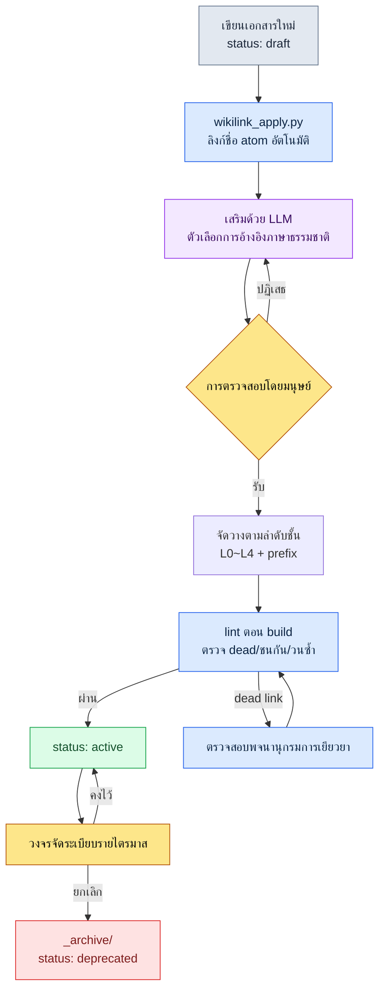

# 24.3 Wikilink กับลำดับชั้นของเอกสาร — สองทางเข้าของการเชื่อมโยงและการจัดหมวด รวมถึงการค้นหา

> การเชื่อมโยง (wikilink) และการจัดหมวด (ลำดับชั้น) คือสองทางเข้าของปัญหาเดียวกัน ฝั่งหนึ่งตอบว่า "การตัดสินใจนี้นำไปสู่ที่ใด" อีกฝั่งหนึ่งตอบว่า "เอกสารนี้อยู่ที่ไหน"

นักออกแบบเกมที่เพิ่งเข้าร่วมทีมถามขึ้นในเช้าวันที่สอง "ค่าคูลดาวน์รวมของการต่อสู้คือ 0.5 วินาทีใช่ไหมครับ แล้วมีเอกสารไหนเป็นหลักฐานบ้าง" ผมตอบไม่ได้ ทั้งที่บันทึกการตัดสินใจต้องอยู่ที่ใดที่หนึ่งแน่ ๆ แต่จำไม่ได้ว่ามันคือ rulebook ของการต่อสู้ บันทึกการประชุม หรือรายงานรายไตรมาส เราสามคนช่วยกันค้นทั้งโฟลเดอร์ด้วย grep ตัวเลขเดียวกันโผล่ขึ้นมาในหกที่ และในจำนวนนั้นแยกไม่ออกว่าอันไหนคือ "การตัดสินใจต้นฉบับ" และอันไหนคือ "สำเนาที่อ้างอิง" เราใช้เวลาไป 40 นาที สุดท้ายสิ่งที่ค้นเจอคือบรรทัดเดียวที่ฝังอยู่ในบันทึกการประชุม

เย็นวันนั้นผมตระหนักว่ามีสองสิ่งที่ขาดหายไป สิ่งแรกคือ **การเชื่อมโยงอย่างชัดเจน** ระหว่างเอกสารต่าง ๆ ไม่มี ต่อให้ตัวเลขเดียวกันอยู่ในหกที่ ก็ไม่มีเส้นด้ายที่ใดบันทึกไว้ว่า "อันนี้อ้างมาจากที่นั่น" สิ่งที่สองคือ **ลำดับชั้น** ที่เอกสารอยู่อาศัยไม่มี บันทึกการตัดสินใจกระจัดกระจายอยู่ใน rulebook บันทึกการประชุม และรายงาน โดยไม่มีข้อตกลงว่า "การตัดสินใจอยู่ที่นี่"

สองสิ่งนี้คือหัวข้อของบทนี้ wikilink เขียนการเชื่อมโยงลงเป็นข้อความ ส่วนลำดับชั้นกำหนดการจัดหมวดด้วยโฟลเดอร์ ทั้งสองดูเหมือนเทคนิคที่แยกจากกัน แต่แท้จริงแล้วเป็นสองด้านของปัญหาเดียวกันคือการค้นหา

---

## 24.3.1 เมื่อไม่มีการเชื่อมโยง อะไรพังลง

เมื่อมีเอกสาร 30 ฉบับ เรายังจำได้ทั้งหมดด้วยหัว เมื่อเกิน 100 ฉบับ ความทรงจำของคนทำหน้าที่เป็นดัชนีไม่ได้อีกต่อไป ตอนนั้นสิ่งที่พึ่งพาได้มีหนึ่งในสองอย่าง ค้นทั้งหมดด้วย grep (ช้าและไม่แม่นยำ) หรือเดินตามการเชื่อมโยงอย่างชัดเจนที่เขียนไว้ในเอกสาร (เร็วและแม่นยำ)

เหตุผลที่ grep ไม่แม่นยำนั้นง่าย ๆ เมื่อค้นสตริง `combat_global_cooldown_constant` เอกสารที่ **ตัดสินใจ** ค่านั้นกับเอกสารที่เพียง **กล่าวถึง** ค่านั้นจะถูกจับขึ้นมาเหมือนกันหมด grep ไม่รู้ว่าอันไหนคือต้นฉบับ ในทางกลับกัน หากเราตกลงใช้สัญลักษณ์วงเล็บเหลี่ยมคู่ `[[combat_global_cooldown_constant]]` ไว้ในเอกสาร สัญญาณที่ว่า "อันนี้อ้างอิง atom นั้นโดยเจตนา" จะหลงเหลืออยู่ในตัวสตริงเอง เมื่อจำกัดด้วยรูปแบบ `\[\[combat_global_cooldown` การกล่าวถึงโดยบังเอิญจะหลุดออกไป เหลือเพียงการอ้างอิงที่ตั้งใจ

ข้อตกลงสัญลักษณ์บรรทัดเดียวนี้กลายเป็นเส้น (edge) หนึ่งของกราฟ เมื่อเอกสาร A เขียน `[[atom_X]]` เส้นเชื่อมทิศทาง A→X ก็เกิดขึ้น หากเอกสาร 200 ฉบับต่างเขียนกันคนละไม่กี่อัน กราฟก็จะสะสมอยู่ในข้อความโดยไม่มีใครต้องวาดมันขึ้นมา

ด้านล่างคือชิ้นส่วนหนึ่งของภาพที่ atom การตัดสินใจ และเอกสารในโปรเจกต์ของเราถูกผูกไว้ด้วย wikilink สีของโหนดแสดงประเภท ส่วนลูกศรแสดงทิศทางการอ้างอิง

<svg viewBox="0 0 720 360" xmlns="http://www.w3.org/2000/svg" font-family="sans-serif" font-size="12">
  <defs>
    <marker id="arrow" markerWidth="9" markerHeight="9" refX="8" refY="3" orient="auto" markerUnits="strokeWidth">
      <path d="M0,0 L8,3 L0,6 Z" fill="#555"/>
    </marker>
  </defs>
  <!-- edges -->
  <g stroke="#888" stroke-width="1.4" marker-end="url(#arrow)" fill="none">
    <line x1="180" y1="80" x2="350" y2="150"/>
    <line x1="180" y1="240" x2="350" y2="160"/>
    <line x1="430" y1="150" x2="560" y2="90"/>
    <line x1="430" y1="170" x2="560" y2="240"/>
    <line x1="180" y1="80" x2="180" y2="220"/>
  </g>
  <!-- doc nodes (blue) -->
  <g>
    <rect x="90" y="58" width="180" height="44" rx="6" fill="#dbeafe" stroke="#2563eb"/>
    <text x="180" y="84" text-anchor="middle" fill="#1e3a8a">[[CombatFormula_v3]]</text>
    <rect x="90" y="218" width="180" height="44" rx="6" fill="#dbeafe" stroke="#2563eb"/>
    <text x="180" y="244" text-anchor="middle" fill="#1e3a8a">[[Meeting_W21]]</text>
  </g>
  <!-- atom node (green) -->
  <g>
    <rect x="350" y="134" width="180" height="48" rx="6" fill="#dcfce7" stroke="#16a34a"/>
    <text x="440" y="155" text-anchor="middle" fill="#14532d">[[combat_global_</text>
    <text x="440" y="171" text-anchor="middle" fill="#14532d">cooldown_constant]]</text>
  </g>
  <!-- decision nodes (amber) -->
  <g>
    <rect x="560" y="68" width="150" height="44" rx="6" fill="#fef3c7" stroke="#d97706"/>
    <text x="635" y="94" text-anchor="middle" fill="#92400e">[[D2026_Q2_017]]</text>
    <rect x="560" y="218" width="150" height="44" rx="6" fill="#fef3c7" stroke="#d97706"/>
    <text x="635" y="244" text-anchor="middle" fill="#92400e">[[D2026_Q2_018]]</text>
  </g>
  <!-- legend -->
  <g font-size="11">
    <rect x="90" y="312" width="14" height="14" fill="#dbeafe" stroke="#2563eb"/>
    <text x="110" y="324" fill="#333">เอกสาร</text>
    <rect x="170" y="312" width="14" height="14" fill="#dcfce7" stroke="#16a34a"/>
    <text x="190" y="324" fill="#333">atom</text>
    <rect x="250" y="312" width="14" height="14" fill="#fef3c7" stroke="#d97706"/>
    <text x="270" y="324" fill="#333">การตัดสินใจ</text>
  </g>
</svg>

สิ่งที่ชิ้นส่วนเล็ก ๆ นี้แสดงให้เห็นก็คือ คำตอบของคำถามจากนักออกแบบเกมคนใหม่อยู่ในกราฟอยู่แล้ว เมื่อย้อนตามลูกศรที่พุ่งเข้าสู่ atom `combat_global_cooldown_constant` กลับไป ก็จะพบการตัดสินใจ `D2026_Q2_017` ไม่ใช่ 40 นาที แต่เป็นการย้อนอ้างอิงเพียงครั้งเดียว

---

## 24.3.2 ข้อตกลงสัญลักษณ์ — สี่ประเภท หนึ่งรูปแบบ

เรากำหนดให้สิ่งที่จะผูกด้วย wikilink มีเพียงสี่ประเภทเท่านั้น หากเพิ่มประเภท รูปแบบก็จะสั่นคลอน และเมื่อรูปแบบสั่นคลอน grep ก็จะไม่แม่นยำอีกครั้ง

- **การอ้างอิง atom** — `[[combat_global_cooldown_constant]]` ชี้ไปยัง atom ซึ่งเป็นหน่วยของ 1 เอกสาร 1 การตัดสินใจ
- **การอ้างอิงการตัดสินใจ** — `[[D2026_Q2_017]]` บันทึกการตัดสินใจที่ระบุด้วยไตรมาสและหมายเลข
- **การอ้างอิงเอกสาร** — `[[CombatFormula_v3]]` เอกสารขนาดใหญ่ เช่น rulebook หรือ specification
- **การอ้างอิงบุคคล** — `[[สมาชิกทีม A]]` ผู้รับผิดชอบหรือผู้ตัดสินใจ

ทั้งสี่ประเภทใช้รูปแบบเดียวกันคือ `[[name]]` name ต้องไม่ซ้ำกันในระดับ global หากชื่อ atom ชนกันในสองที่ มันจะถูกรวมเป็นโหนดเดียวกันในกราฟ ทำให้เกิดเหตุการณ์ที่ "cooldown ของการต่อสู้" และ "cooldown ของ UI" กลายเป็นโหนดเดียวกัน ด้วยเหตุนี้กฎการตั้งชื่อ atom จึงบังคับใช้ prefix ตามสาขา (`combat_`, `ui_`)

---

## 24.3.3 wikilink_apply.py — การปรับใช้และการเยียวยา

ลำพังข้อตกลงสัญลักษณ์อย่างเดียวยังไม่พอ การให้คนใส่วงเล็บเหลี่ยมทีละอันในเอกสาร 200 ฉบับนั้นไม่สมจริง และต่อให้ใส่เสร็จแล้ว เมื่อชื่อ atom เปลี่ยน ทั้งหมดก็จะพังหมด ด้วยเหตุนี้เราจึงใช้สคริปต์ที่ทำงานสองอย่าง อย่างแรกคือ **การปรับใช้** (apply) — แปลงชื่อ atom ที่รู้จักซึ่งปรากฏในเนื้อหาให้เป็น wikilink โดยอัตโนมัติ อย่างที่สองคือ **การเยียวยา** (heal) — ค้นหาลิงก์ที่เปลี่ยนชื่อไปแล้วหรือที่เสียหาย แล้วอัปเดตและรายงาน

ส่วนหลักของ `wikilink_apply.py` มีหน้าตาแบบนี้

```python
# wikilink_apply.py — ปรับใช้ชื่อ atom ในเนื้อหาให้เป็น [[wikilink]] และเยียวยาลิงก์ที่เสียหาย
import re
from pathlib import Path

WIKILINK = re.compile(r"\[\[([A-Za-z0-9_]+)\]\]")
# จับเฉพาะชื่อ atom ที่ปรากฏแบบเปลือยซึ่งยังไม่ใช่ลิงก์ (กรณีที่ด้านหน้าไม่มี [[ )
BARE_NAME = lambda name: re.compile(rf"(?<!\[\[)(?<![A-Za-z0-9_])({re.escape(name)})(?![A-Za-z0-9_])(?!\]\])")

def load_known_atoms(registry: Path) -> set[str]:
    # _atom_registry.tsv: คอลัมน์แรกคือ atom name ที่ใช้งานได้ในปัจจุบัน
    return {ln.split("\t")[0].strip()
            for ln in registry.read_text(encoding="utf-8").splitlines()
            if ln.strip() and not ln.startswith("#")}

def apply_links(text: str, known: set[str]) -> tuple[str, int]:
    applied = 0
    for name in sorted(known, key=len, reverse=True):  # ชื่อยาวก่อน: ป้องกันการปนเปื้อนจากการจับคู่บางส่วน
        text, n = BARE_NAME(name).subn(rf"[[{name}]]", text)
        applied += n
    return text, applied

def heal_links(text: str, known: set[str], aliases: dict[str, str]) -> tuple[str, list[str]]:
    dead = []
    def repl(m):
        ref = m.group(1)
        if ref in known:
            return m.group(0)              # ยังมีอยู่ → คงไว้ตามเดิม
        if ref in aliases:                  # atom ที่ถูกเปลี่ยนชื่อ → เยียวยาเป็นชื่อใหม่
            return f"[[{aliases[ref]}]]"
        dead.append(ref)                    # dead link จริง ๆ → รายงาน
        return m.group(0)
    return WIKILINK.sub(repl, text), dead
```

ตรงนี้มีตัวเลือกการออกแบบสองอย่างที่เป็นกระดูกสันหลังของเนื้อหา

อย่างแรก `apply_links` แทนที่ **ชื่อยาวก่อน** เมื่อมี atom สองตัวคือ `combat_cooldown` และ `combat_cooldown_global` หากแทนที่ตัวสั้นก่อน ส่วนหน้าของตัวยาวจะถูกปนเปื้อน การเรียงลำดับจากยาวไปสั้นบรรทัดเดียวป้องกันเหตุการณ์นี้ นี่คือส่วนที่ผมลืมไปตอนเขียนครั้งแรก และเพิ่มเข้ามาก็ต่อเมื่อเกิดผลลัพธ์ที่เสียหายอย่าง `[[combat_cooldown]]_global` ขึ้นจริง ๆ แล้ว

อย่างที่สอง `heal_links` เยียวยาผ่าน **พจนานุกรมการเปลี่ยนชื่อ** (aliases) เมื่อชื่อ atom เปลี่ยนจาก `combat_gcd` → `combat_global_cooldown_constant` มันจะแทนที่ชื่อเก่าด้วยชื่อใหม่โดยอัตโนมัติ และจะรายงานเป็น dead link ก็ต่อเมื่อไม่มีอยู่ในพจนานุกรมเลยเท่านั้น แทนที่จะแก้เอกสาร 200 ฉบับด้วยมือทุกครั้งที่ชื่อเปลี่ยน เราเพียงเพิ่ม alias หนึ่งบรรทัด

---

## 24.3.4 บันทึกเซสชันจริง (worked transcript) — มอบหมายให้ Claude เสริม wikilink

การ apply อัตโนมัติจะลิงก์เฉพาะ "ชื่อ atom ที่รู้จักอยู่แล้ว" เท่านั้น แต่ประโยคที่ไม่ได้เขียนชื่อ atom ในเนื้อหาแต่บรรยายขยายความออกมา ("คูลดาวน์รวมของการต่อสู้คือ 0.5 วินาที") นั้นจับไม่ได้ การแปลงการอ้างอิงด้วยภาษาธรรมชาติเช่นนี้ให้เป็น wikilink ตัวเลือก LLM ทำได้เร็วกว่าคน ด้านล่างคือบทสนทนาฉบับเต็มที่เกิดขึ้นจริง ผมไม่ได้สรุปย่อผลลัพธ์ และส่วนที่ผมปฏิเสธก็คงไว้ตามเดิม

**พรอมต์ของผม (ฉบับเต็ม):**

```
จะให้ย่อหน้าหนึ่งของ rulebook การต่อสู้และรายการ atom ที่ลงทะเบียนไว้ จากเนื้อหา
ช่วยหาสำนวนภาษาธรรมชาติที่ชี้ไปยัง atom เหล่านี้ แล้วเสนอ [[wikilink]] ที่เป็นตัวเลือก
ในรูปแบบตาราง เฉพาะตอนที่แน่ใจเท่านั้น ถ้าคลุมเครือก็แค่ทำเครื่องหมาย "คลุมเครือ" ไว้
อย่าเขียนเนื้อหาใหม่ บอกแค่ว่าจะเปลี่ยนวลีไหนเป็นลิงก์ใด
แนวคิดที่ยังไม่ได้ลงทะเบียน ให้แยกออกมาเป็น "atom ใหม่ที่เป็นตัวเลือก"

[atom ที่ลงทะเบียนไว้]
combat_global_cooldown_constant
combat_skill_cast_interrupt_rule
combat_resource_regen_rate

[เนื้อหา]
คูลดาวน์รวมของการต่อสู้คือ 0.5 วินาที และใช้ร่วมกันกับสกิลแอ็กทีฟทุกตัว
หากถูกโจมตีระหว่างร่าย การร่ายจะถูกขัดจังหวะ ยกเว้นสกิลสายฟื้นฟู
การฟื้นฟูทรัพยากรจะกลับสู่ความเร็วปกติเฉพาะในสถานะนอกการต่อสู้เท่านั้น
```

**ผลลัพธ์จาก Claude (ดิบตามเดิม):**

```
wikilink ที่เสนอ:

| วลีในเนื้อหา                       | ลิงก์ตัวเลือก                          | ความมั่นใจ |
|------------------------------------|----------------------------------------|------------|
| "คูลดาวน์รวมของการต่อสู้คือ 0.5 วินาที" | [[combat_global_cooldown_constant]]    | สูง        |
| "หากถูกโจมตีระหว่างร่าย การร่ายจะถูกขัดจังหวะ" | [[combat_skill_cast_interrupt_rule]]   | สูง        |
| "การฟื้นฟูทรัพยากรเฉพาะในสถานะนอกการต่อสู้" | [[combat_resource_regen_rate]]         | ปานกลาง    |

atom ใหม่ที่เป็นตัวเลือก:
- "สกิลสายฟื้นฟูเป็นข้อยกเว้น" → กฎข้อยกเว้นนี้ไม่ได้ระบุไว้ที่ใดในบรรดา atom
  ที่ลงทะเบียนไว้เลย ดูเหมือนจะต้องมี atom แยกต่างหาก เช่น
  combat_skill_cast_interrupt_heal_exception (คลุมเครือ: อาจเป็นข้อย่อยของ
  interrupt_rule ก็ได้ จึงตัดสินไม่ได้ว่าเป็น atom เดี่ยวหรือไม่)

หมายเหตุ: บรรทัด "การฟื้นฟูทรัพยากร" มีความมั่นใจปานกลางเพราะยังไม่เห็นนิยามของ atom
ว่า combat_resource_regen_rate ชี้ไปยัง 'ความเร็วการฟื้นฟู' หรือ 'เงื่อนไขนอกการต่อสู้'
```

**การตรวจสอบและการปฏิเสธของผม:**

ในสามบรรทัด ผมรับสองบรรทัด คูลดาวน์รวมและการขัดจังหวะระหว่างร่ายตรงกับนิยามของ atom เป๊ะ ส่วนบรรทัดที่สาม "การฟื้นฟูทรัพยากร" Claude ลดความมั่นใจของตัวเองลงเป็น "ปานกลาง" ด้วยตัวเองนั้นถูกต้องแล้ว — atom `combat_resource_regen_rate` นิยามเฉพาะ **ค่าความเร็ว** เท่านั้น ส่วน **เงื่อนไข** ที่ว่า "เฉพาะในสถานะนอกการต่อสู้" เป็นความรับผิดชอบของ atom อื่น หากใส่ลิงก์ไปตรง ๆ จะเกิดเหตุการณ์ที่เชื่อม "เงื่อนไข" เข้ากับ atom ของ "ความเร็ว" อย่างผิด ๆ **ผมปฏิเสธ**

ส่วนการชี้ atom ใหม่ที่เป็นตัวเลือกนั้นถูกต้อง "ข้อยกเว้นสายฟื้นฟู" ไม่มี atom อยู่ที่ใดเลยจริง ๆ เพียงแต่ส่วนที่ Claude บอกว่าคลุมเครือ ("เป็นข้อย่อยของ interrupt_rule หรือ atom เดี่ยว") เป็นขอบเขตที่คนต้องตัดสิน และผมตัดสินใจแยกออกมาเป็น atom เดี่ยว

**การร้องขอใหม่:**

```
บรรทัด "การฟื้นฟูทรัพยากร" อย่าลิงก์ แทนที่จะเป็นเช่นนั้น ให้ [[combat_resource_regen_rate]]
ครอบคลุมเฉพาะ 'ความเร็ว' ส่วน 'เงื่อนไขนอกการต่อสู้' ให้แยกเป็น atom ใหม่ ช่วยเขียนนิยาม
1 บรรทัดของแต่ละ atom ทั้งสอง และข้อยกเว้นการฟื้นฟูก็ให้แยกเป็น atom เดี่ยวพร้อมนิยาม 1 บรรทัดด้วย
```

ในการโต้ตอบไปมานี้ สิ่งที่ LLM ทำไม่ใช่ "สร้างตัวเลือกจากศูนย์" แต่เป็น "คัดเลือกตัวเลือกให้" หัวใจสำคัญคือ **มีจุดที่คนจะปฏิเสธได้อย่างชัดเจน** หากเป็นการเผยแพร่อัตโนมัติ ลิงก์ที่ผิดเพียงอันเดียวก็จะหลงเหลืออยู่ในกราฟอย่างถาวร

---

## 24.3.5 lint — สกัดการเชื่อมโยงที่เสียหายตั้งแต่ในขั้นตอน build

ลิงก์ย่อมเสียหายเมื่อเวลาผ่านไป atom ถูกยกเลิก ชื่อเปลี่ยน และมีคำพิมพ์ผิดแทรกเข้ามา ด้วยเหตุนี้เราจึงรัน wikilink lint ในทุกครั้งที่ build รายการตรวจสอบและการจัดการมีดังนี้

- **dead link** — name ใน `[[name]]` ไม่มีอยู่ในรีจิสทรี → เตือนในขั้นตอน build ตรวจสอบพจนานุกรมการเยียวยา
- **ละเมิดรูปแบบ** — ละเมิดกฎ snake_case หรือ prefix → สกัด
- **ชื่อชนกัน** — name เดียวกันอยู่ในสอง atom → สกัด (ความไม่ซ้ำในระดับ global ถูกทำลาย)
- **การอ้างอิงวนซ้ำ** — A→B→A → เตือน (กรณีที่ตั้งใจให้อยู่ในรายการอนุญาต)
- **การอ้างอิงเกิน** — เอกสารหนึ่งอ้าง atom เดียวกันตั้งแต่ 10 ครั้งขึ้นไป → เตือน (สงสัยว่าเป็นสัญญาณรบกวน)

ที่ตั้ง dead link ให้เป็นเพียงคำเตือนแทนที่จะสกัดนั้นเป็นความตั้งใจ ในสถานะระหว่างที่กำลังเปลี่ยนชื่อ atom จะเกิด dead ขึ้นชั่วครู่ ถ้าสกัดสิ่งนี้ให้ build ล้มเหลว งานก็จะหยุดชะงัก แทนที่จะเป็นเช่นนั้นเราให้ตรวจสอบพจนานุกรมการเยียวยาก่อน ส่วนการละเมิดรูปแบบและชื่อชนกันให้สกัดทันที — เพราะทั้งสองอย่างนี้ทำให้กราฟทั้งหมดปนเปื้อน

> lint นี้พิสูจน์ตัวเองได้ ลิงก์ที่ wikilink_apply.py สร้างขึ้นถูกตรวจโดย lint ของระบบเดียวกัน และผลลัพธ์นั้นก็ถูกบันทึกไว้เป็นการตัดสินใจ atom อีกครั้งหนึ่ง วงจรที่เครื่องมือตรวจสอบผลผลิตของตัวเองด้วยเกณฑ์ของตัวเองคือกระดูกสันหลังพื้นฐานของการดำเนินงาน

---

## 24.3.6 การจัดหมวด — ลำดับชั้นที่เอกสารอยู่อาศัย

มาถึงตรงนี้คือเรื่องการเชื่อมโยง ทีนี้มาถึงการจัดหมวด หาก wikilink ตอบว่า "การตัดสินใจนี้นำไปสู่ที่ใด" ลำดับชั้นก็ตอบว่า "เอกสารนี้อยู่ที่ไหน" หากขาดทั้งสองอย่าง การค้นหา 40 นาทีของนักออกแบบเกมคนใหม่ก็จะเกิดซ้ำ

โฟลเดอร์เอกสารของเรามีสี่ชั้น ชั้นเหล่านี้แชร์กระดูกสันหลังเดียวกันกับการรวม Layer ของสถาปัตยกรรมสารสนเทศ — วิสัยทัศน์ ระบบ เนื้อหา และเมตา อย่างละหนึ่งชั้น

```
docs/
├── L0_vision/              วิสัยทัศน์ (ไม่เกิน 5 ฉบับ แทบไม่เปลี่ยน)
├── L1_systems/             rulebook ตามสาขา
│   ├── combat/
│   ├── narrative/
│   └── ui/
├── L2_content/             เนื้อหาแต่ละชิ้น
│   ├── characters/
│   └── quests/
└── L4_meta/                การดำเนินงาน·การตัดสินใจ·การประชุม·atom
    ├── decisions/
    ├── meetings/
    ├── reports/
    └── atoms/
```

เหตุที่ L3 ว่างเปล่าเพราะชีตข้อมูลและ DB เข้าไปแทนที่ตำแหน่งนั้น (เป็นตารางไม่ใช่เอกสาร) การตัดสินใจที่นักออกแบบเกมคนใหม่ตามหาอยู่ที่ `L4_meta/decisions/` — เพียงมีข้อตกลงเดียวนี้ การค้นหา 40 นาทีก็คงจบลงด้วยประโยคเดียวว่า "การตัดสินใจอยู่ที่นั่น"

เพื่อให้ลำดับชั้นทำงานเป็นทางเข้าของการค้นหา ต้องรักษาห้าข้อนี้ไปพร้อมกัน หากขาดข้อใดข้อหนึ่ง การจัดหมวดก็พังลง

1. **จัดหมวดตามความหมาย ห้ามจัดตามเวลา** `combat/`·`narrative/` ค้นหาได้ แต่ `2026-Q1/`·`2026-Q2/` หกเดือนถัดมาไม่มีใครเปิด เวลานั้น git บันทึกอยู่แล้ว จึงไม่มีเหตุผลที่จะแบ่งด้วยโฟลเดอร์ซ้ำอีก
2. **ลึกไม่เกิน 4 ชั้น** `L1_systems/combat/skills/active/single_target/attack.md` คือ 5 ชั้น เมื่อ path ยาวเกินหนึ่งหน้าจอ คนจะเก็บตำแหน่งไว้ในหัวไม่ได้
3. **prefix ในชื่อไฟล์** ใส่ประเภทลงในชื่อไฟล์ด้วย `spec_`·`report_`·`decision_`·`char_` มองเห็นประเภทได้โดยไม่ต้องดูโฟลเดอร์
4. **README ในทุกโฟลเดอร์** README ของแต่ละโฟลเดอร์เขียนนิยาม เนื้อหา และกฎการตั้งชื่อ เป็นทางเข้าแรกของผู้ที่เพิ่งเข้าร่วมทีม
5. **โฟลเดอร์เมตาที่มี prefix `_`** `_archive/`·`_TEMPLATES/`·`_NAMING/` จะถูกจัดเรียงขึ้นด้านบนในการเรียงลำดับอัตโนมัติ และไม่ปะปนกับเนื้อหาหลัก

เอกสารไม่ได้อยู่ที่เดียวตลอด ระหว่างการเขียนมันอยู่ในโฟลเดอร์หลักด้วย `status: draft` เมื่อถูกเปิดใช้งานก็กลายเป็น `status: active` และเมื่อถูกยกเลิกก็ **ไม่ใช่การลบ** แต่ย้ายไปยัง `_archive/` แล้วติดป้าย `status: deprecated` การไม่ลบข้อมูลที่ถูกยกเลิกคือหลักการเหล็ก หกเดือนถัดมาเมื่อมีใครถามว่า "ทำไมถึงพลิกการตัดสินใจนั้น" คำตอบอยู่ในข้อมูลที่ถูกยกเลิกเท่านั้น หากลบทิ้งไป ก็ไม่มีทางหาเหตุผลของการตัดสินใจกลับคืนมาภายหลังได้

การเปลี่ยนแปลงใหญ่ ๆ เราไม่ฝากไว้กับ git เพียงอย่างเดียว แต่บันทึกไว้เป็น change_log ใน frontmatter ด้วย

```yaml
---
title: combat_global_cooldown_rule
version: v3
last_modifier: teammate_a
change_log:
  - v1 (2025): ร่างแรก
  - v2 (2025): cooldown 0.3 → 0.5  ([[D2026_Q2_017]])
  - v3 (2026): เพิ่มข้อยกเว้นการฟื้นฟู  ([[D2026_Q2_018]])
---
```

จงสังเกตว่า ID การตัดสินใจใน change_log เขียนไว้เป็น wikilink ตรงนี้คือจุดที่การเชื่อมโยงและการจัดหมวดมาบรรจบกัน เอกสารอยู่ที่เดียวภายในลำดับชั้น (การจัดหมวด) แต่ประวัติการเปลี่ยนแปลงของมันเชื่อมต่อไปยังกราฟการตัดสินใจ (การเชื่อมโยง) frontmatter หนึ่งเปิดสองทางเข้าพร้อมกัน

---

## 24.3.7 หนึ่งครั้งต่อไตรมาส วงจรการจัดระเบียบ

ลำดับชั้นจะเน่าหากปล่อยทิ้งไว้ โฟลเดอร์ว่างเกิดขึ้น draft ที่ค้างนานหกเดือนพอกพูน และความลึกค่อย ๆ เพิ่มขึ้นทีละน้อย ด้วยเหตุนี้เราจึงจัดระเบียบหนึ่งครั้งต่อไตรมาส โฟลเดอร์ว่างก็ลบ draft ที่เกินหกเดือนก็ตัดสินว่าจะเปิดใช้งานหรือยกเลิก ที่ลึกตั้งแต่ 5 ชั้นขึ้นไปก็ทำให้แบนราบ โฟลเดอร์ที่ไม่มี README ก็เขียนหรือยกเลิก และเมื่อ `_archive` เกินครึ่งก็เก็บรักษาแบบบีบอัด หากไม่มีวงจรนี้ ลำดับชั้นก็จะเต็มไปด้วยสัญญาณรบกวนจนแยกสัญญาณกับเสียงรบกวนไม่ออก

หากมองภาพรวมทั้งหมดเป็นรูปเดียว จะเป็นเช่นนี้ ตั้งแต่เอกสารเข้ามา ถูกเชื่อมโยง ถูกจัดหมวด ถูกตรวจสอบ จนถูกยกเลิก คือวงจรหนึ่งวง



ในวงจรนี้ การเชื่อมโยง (B·C·D·F) และการจัดหมวด (E·I·J) ทำงานสลับกัน ทั้งสองไม่ได้หมุนแยกกัน แต่ประสานกันภายในวงจรชีวิตของเอกสารหนึ่งฉบับ

---

## 24.3.8 ผลลัพธ์ — อะไรเปลี่ยนไปอย่างไร

ตัวเลขเป็น **ทิศทาง** ที่เปรียบเทียบก่อนและหลังการนำมาใช้ในโปรเจกต์ของผู้เขียน ไม่ใช่ค่าวัดที่แม่นยำ แต่เป็นขนาดของความแตกต่างที่รู้สึกได้เมื่อทำงานเดียวกันในสองสภาพแวดล้อม (จากการสังเกตของผู้เขียน ยังไม่ได้วัดอย่างละเอียด)

ก่อนที่การเชื่อมโยงและลำดับชั้นจะเข้าที่ คำถามติดตามการตัดสินใจของนักออกแบบเกมคนใหม่ใช้เวลานานถึงหนึ่งถึงสองชั่วโมงเหมือนกรณี 40 นาทีในบทนำ หลังการนำมาใช้ เป็นการย้อนอ้างอิง atom เพียงครั้งเดียว — ระดับนาที การค้นหาเอกสารลดจาก 5\~10 นาทีเหลือราว 30 วินาที ซึ่งนี่คือผลของการจัดหมวดตามความหมายและ prefix ของลำดับชั้นที่ทำงานร่วมกัน ส่วนเหตุการณ์ที่เกิดจากการอ้างอิงผิด (ประเภทเข้าใจผิดว่าค่าที่ถูกยกเลิกแล้วยังเป็นค่าปัจจุบัน) ลดจากหลายครั้งต่อไตรมาสเหลือหนึ่งถึงสองครั้ง — เพราะ wikilink ระบุชัดว่า "อันนี้อ้างอิง atom นั้น" ค่าที่ถูกสำเนามากับค่าต้นฉบับจึงไม่สับสนกันอีก

การเปลี่ยนแปลงที่ใหญ่ที่สุดคือ **การปรับตัวของผู้ที่เพิ่งเข้าร่วมทีม** หากไม่มีลำดับชั้น การเรียนรู้ว่าอะไรอยู่ในโฟลเดอร์ไหนต้องใช้เวลาหลายวัน และหากไม่มีการเชื่อมโยง ก็ไม่มีทางเข้าใจว่าระบบต่าง ๆ เกี่ยวพันกันอย่างไร หลังจากที่มีทั้งสองครบแล้ว พวกเขาเรียนรู้ตำแหน่งจาก README ของโฟลเดอร์ และสำรวจความสัมพันธ์ระหว่างระบบด้วยตัวเองโดยตามกราฟ wikilink "สิ่งที่ต้องถามจึงจะรู้" กลายเป็น "สิ่งที่ตามไปแล้วจะเห็น"

ผลลัพธ์นี้เกิดขึ้นเฉพาะเมื่อมีสองทางเข้า **อยู่ด้วยกัน** เท่านั้น หากมีแค่การเชื่อมโยงแต่ไม่มีการจัดหมวด ก็มีกราฟแต่ไม่รู้ว่าเอกสารอยู่ที่ไหน และหากมีแค่การจัดหมวดแต่ไม่มีการเชื่อมโยง โฟลเดอร์ก็เป็นระเบียบแต่ไม่รู้ว่าการตัดสินใจนำไปสู่ที่ใด

---

## 24.3.9 ความล้มเหลวที่พบบ่อยและการแก้ไข

ความล้มเหลวที่พบบ่อยที่สุดในฝั่งการเชื่อมโยงคือ **ลิงก์ที่เป็นสัญญาณรบกวน** หากเห็นว่า wikilink ดีแล้วใส่วงเล็บเหลี่ยมในทุกคำนาม กราฟก็จะเต็มไปด้วยเส้นเชื่อมที่ไร้ความหมายจนเครื่องมือ visualize ไร้พลัง หลักการคือเหลือเฉพาะลิงก์ที่สามารถถามและตอบได้ว่า "เอกสารนี้มีความสัมพันธ์อย่างไรกับเอกสารนั้น" เท่านั้น ถัดมาคือ **การเผยแพร่อัตโนมัติ** — หาก commit ลิงก์ที่ LLM สร้างโดยไม่ผ่านการตรวจสอบ การเชื่อมโยงที่ผิดอย่างบรรทัด "การฟื้นฟูทรัพยากร" ในบันทึกเซสชันจริงก็จะหลงเหลืออยู่ถาวร apply เป็นอัตโนมัติ แต่การเผยแพร่เป็นหน้าที่ของคน

ความล้มเหลวในฝั่งการจัดหมวดส่วนใหญ่คือการละเมิดห้าหลักการ โฟลเดอร์ตามเวลา ความลึกตั้งแต่ 5 ชั้น ชื่อไฟล์ไร้กฎ และการไม่มี README และที่ย้อนคืนได้ยากที่สุด — **การลบข้อมูลที่ถูกยกเลิก** เหตุผลของการตัดสินใจที่ถูกลบไปแล้วสร้างขึ้นใหม่ไม่ได้ การส่งไปยัง `_archive` หนึ่งบรรทัดปกป้องสื่อการเรียนรู้ของหกเดือนถัดมา

---

### สรุปประเด็นสำคัญของบท

- การเชื่อมโยงและการจัดหมวดคือสองทางเข้าของการค้นหา และลำพังฝั่งเดียวจะทำให้การค้นหา 40 นาทีของผู้ที่เพิ่งเข้าร่วมทีมเกิดซ้ำ
- wikilink ปรับใช้ชื่อ atom โดยอัตโนมัติ แต่ตัวเลือกจาก LLM ต้องเหลือจุดให้คนปฏิเสธจึงจะปลอดภัย
- ข้อมูลที่ถูกยกเลิกต้องเก็บรักษาไว้ที่ `_archive` แทนการลบ เหตุผลของการตัดสินใจจึงจะรอดมาให้ใช้ภายหลัง

---

## ลองทำดู — การนำ wikilink + ลำดับชั้นมาใช้ขั้นต่ำ

**setup.** สร้างสี่โฟลเดอร์ `L0_vision/` `L1_systems/` `L2_content/` `L4_meta/` ในโฟลเดอร์เอกสาร และวาง README หนึ่งบรรทัดไว้ในแต่ละโฟลเดอร์ รวบรวมรายการชื่อ atom ไว้ในไฟล์เดียว `_atom_registry.tsv` (คอลัมน์แรก = atom name)

**prompt.** ให้ย่อหน้าหนึ่งของเนื้อหาและรายการ atom ที่ลงทะเบียนไว้แก่ LLM แล้วร้องขอเช่นนี้ — "จากเนื้อหา ช่วยหาสำนวนภาษาธรรมชาติที่ชี้ไปยัง atom เหล่านี้ แล้วเสนอ `[[wikilink]]` ที่เป็นตัวเลือกในรูปแบบตาราง เสนอเฉพาะตอนที่แน่ใจเท่านั้น ถ้าคลุมเครือก็แค่ทำเครื่องหมาย 'คลุมเครือ' ไว้ อย่าเขียนเนื้อหาใหม่ แนวคิดที่ยังไม่ได้ลงทะเบียนให้แยกเป็น 'atom ใหม่ที่เป็นตัวเลือก'"

**verify.** เทียบทุกลิงก์ที่เสนอกับนิยาม atom รับเฉพาะเมื่อสิ่งที่ atom ชี้ถึงกับสิ่งที่เนื้อหาชี้ถึง **ตรงกันเป๊ะ** เท่านั้น หากเงื่อนไข/คุณสมบัติ/ข้อยกเว้นคลาดเคลื่อนก็ปฏิเสธ หลังรับแล้วให้ตรวจด้วย `grep "\[\[name\]\]"` ว่าลิงก์ถูกใส่จริงหรือไม่ และไม่มี dead link หรือไม่

**ฉบับย่อสำหรับคนเดียว.** หากจะเริ่มโดยไม่มีทั้งสคริปต์และ lint กฎสองบรรทัดก็พอ (1) การตัดสินใจให้อยู่ในโฟลเดอร์ `decisions/` โฟลเดอร์เดียวเสมอ ในรูปแบบ `decision_*.md` (2) เมื่อเอกสารอื่นกล่าวถึงการตัดสินใจนั้นให้เขียนเป็น `[[decision_id]]` เพียงรักษาสองบรรทัดนี้ คำถามว่า "การตัดสินใจนั้นอยู่ที่ไหน" ก็ตอบได้ด้วย `grep "\[\[decision_"` เพียงครั้งเดียว เครื่องมือนำมาใช้หลังจากเอกสารเกิน 100 ฉบับก็ยังไม่สาย
