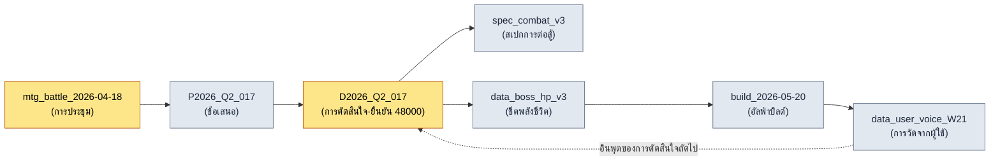

# 24.4 การติดตามแหล่งที่มา·data lineage

> ช่วงเวลาที่เราเริ่มสงสัยข้อมูลมักมาช้าเกินไปเสมอ เรามักจะมาถามว่า "ค่านี้มาจากไหน" ก็ต่อเมื่อค่าที่ผิดถูกป้อนเข้าไปในไลฟ์บิลด์เรียบร้อยแล้ว

---

เย็นวันศุกร์ก่อนหน้าอัลฟ่าบิลด์ เพื่อนร่วมทีม B เดินมาที่โต๊ะของผม ในมือถือโน้ตบุ๊กที่เปิดสเปรดชีตการปรับสมดุลการต่อสู้ค้างไว้ "ผู้อำนวยการครับ ค่าพลังชีวิตเฟส 1 ของบอสในชีตคือ 48,000 แต่ค่าที่เข้าไปในบิลด์คือ 52,000 ตกลงอันไหนถูกครับ"

ผมไม่รู้ พูดให้ตรงกว่านั้นคือ — ในจังหวะนั้นไม่มีใครรู้ ค่า 52,000 ในบิลด์อาจเป็นค่าล่าสุดที่สะท้อนการตัดสินใจในการประชุมเมื่อไม่กี่วันก่อน หรืออาจเป็นค่าที่ใครบางคนใส่ไว้ชั่วคราวโดยยังไม่ได้ตรวจสอบก็ได้ ส่วน 48,000 อาจเป็นค่าที่ตกลงกันก่อนการประชุมนั้น ทั้งสองตัวเลขดูสมเหตุสมผลทั้งคู่ แต่ความสมเหตุสมผลไม่ใช่หลักฐาน

หากต้องการตอบคำถามนี้ ต้องย้อนกลับไปยังแหล่งที่มา ตัดสินใจในการประชุมไหน อินพุตของการประชุมนั้นคืออะไร ใครเป็นคนย้ายค่าลงในชีต แต่ถ้าโซ่ของการติดตามนั้นอยู่แค่ในความทรงจำของคน คำตอบก็จะกลายเป็น "พรุ่งนี้เดี๋ยวผมถามเพื่อนร่วมทีม A ให้นะครับ" พอถึงเดือนที่ 6 ของการ Live Ops คำถามที่ยังไม่มีคำตอบแบบนั้นจะกองสุมกันสูงเป็นภูเขา data lineage — สายเลือดของข้อมูล — คือโครงสร้างพื้นฐานที่ทำให้ภูเขานั้นไม่ก่อตัวขึ้นมา

แก่นมีเพียงหนึ่งเดียว แหล่งที่มาต้องไม่เขียนด้วยมือ บันทึกแหล่งที่มาที่คนมาเติมย้อนหลังจะอยู่ได้ไม่ถึงเดือน มีเพียงแหล่งที่มาที่ถูกบันทึกโดยอัตโนมัติในวินาทีที่ข้อมูลถูกสร้างขึ้นเท่านั้นที่อยู่รอด

---

## 24.4.1 ต้นทุนห้าแบบของข้อมูลที่ขาดแหล่งที่มา

ต้นทุนในการบันทึกหนึ่งบรรทัดของ `_source_map.tsv` โดยอัตโนมัติคือไม่กี่มิลลิวินาที แต่ต้นทุนที่ต้องจ่ายเมื่อไม่มีบรรทัดนั้นจะลามออกไปห้าทาง

<svg viewBox="0 0 720 300" xmlns="http://www.w3.org/2000/svg" font-family="sans-serif">
  <rect x="280" y="120" width="160" height="60" rx="8" fill="#1f2933" stroke="#0b3d2e"/>
  <text x="360" y="148" fill="#ffffff" font-size="15" text-anchor="middle">แหล่งที่มาขาดหาย</text>
  <text x="360" y="168" fill="#9fb3c8" font-size="12" text-anchor="middle">(ไม่ได้บันทึก source)</text>

  <rect x="20" y="20" width="170" height="44" rx="6" fill="#e8f0fe" stroke="#1967d2"/>
  <text x="105" y="40" fill="#1a1a1a" font-size="12.5" text-anchor="middle">ตรวจสอบไม่ได้</text>
  <text x="105" y="56" fill="#5f6368" font-size="11" text-anchor="middle">"ค่านี้มาจากไหน?"</text>

  <rect x="530" y="20" width="170" height="44" rx="6" fill="#e8f0fe" stroke="#1967d2"/>
  <text x="615" y="40" fill="#1a1a1a" font-size="12.5" text-anchor="middle">พลาดการอัปเดต</text>
  <text x="615" y="56" fill="#5f6368" font-size="11" text-anchor="middle">ต้นฉบับเปลี่ยน→ทิ้งของที่สืบทอด</text>

  <rect x="20" y="236" width="170" height="44" rx="6" fill="#fce8e6" stroke="#c5221f"/>
  <text x="105" y="256" fill="#1a1a1a" font-size="12.5" text-anchor="middle">การเปิดเผยความรับผิดทางกฎหมาย</text>
  <text x="105" y="272" fill="#5f6368" font-size="11" text-anchor="middle">หลักฐานของแอสเซตภายนอกหาย</text>

  <rect x="530" y="236" width="170" height="44" rx="6" fill="#fce8e6" stroke="#c5221f"/>
  <text x="615" y="256" fill="#1a1a1a" font-size="12.5" text-anchor="middle">วินิจฉัยเหตุล่าช้า</text>
  <text x="615" y="272" fill="#5f6368" font-size="11" text-anchor="middle">ย้อนรอยค่าที่ผิดไม่ได้</text>

  <rect x="275" y="236" width="170" height="44" rx="6" fill="#fef7e0" stroke="#f29900"/>
  <text x="360" y="256" fill="#1a1a1a" font-size="12.5" text-anchor="middle">สูญเสียตอนส่งมอบงาน</text>
  <text x="360" y="272" fill="#5f6368" font-size="11" text-anchor="middle">"ทำไมตัดสินใจแบบนี้?" ไม่มีคำตอบ</text>

  <line x1="280" y1="135" x2="190" y2="55" stroke="#5f6368" stroke-width="1.5"/>
  <line x1="440" y1="135" x2="530" y2="55" stroke="#5f6368" stroke-width="1.5"/>
  <line x1="280" y1="165" x2="190" y2="245" stroke="#c5221f" stroke-width="1.5"/>
  <line x1="440" y1="165" x2="530" y2="245" stroke="#c5221f" stroke-width="1.5"/>
  <line x1="360" y1="180" x2="360" y2="236" stroke="#f29900" stroke-width="1.5"/>
</svg>

กับดักก็คือ ไม่มีต้นทุนใดในห้าแบบนี้ที่มองเห็นได้ในวินาทีที่สร้างข้อมูลขึ้นมา ใบเรียกเก็บเงินทั้งหมดจะมาถึงในอีกไม่กี่สัปดาห์ ไม่กี่เดือน หรือหลังจากที่คนผลัดเปลี่ยนกันไปแล้ว ด้วยเหตุนี้ แหล่งที่มาจึงไม่อาจเป็นเรื่องที่ "ค่อยไปจัดการทีหลัง" ได้ มันต้องถูกบันทึกในวินาทีที่สร้างขึ้น

---

## 24.4.2 _source_map.tsv — โครงมาตรฐานของการแมปแหล่งที่มา

ในโปรเจกต์ A ไฟล์แมปแหล่งที่มาที่ใช้งานมีเพียง `_source_map.tsv` ไฟล์เดียว เหตุผลที่ใช้ข้อความคั่นด้วยแท็บนั้นเรียบง่าย คนสามารถอ่านหนึ่งบรรทัดด้วยตาได้ สคริปต์พาร์สด้วย `split('\t')` ครั้งเดียว และ git diff แสดงการเปลี่ยนแปลงทีละบรรทัดได้อย่างสะอาดตา CSV จะพังเมื่อมีจุลภาคปนอยู่ในเนื้อหา ส่วน JSON หนึ่งบรรทัดนั้นคนอ่านยาก

```tsv
asset_id	source_type	source	created	creator	notes
spec_combat_v3	internal	mtg_battle_2026-04-18	2026-04-18	teammate_a	อ้างอิง decision_D2026_Q2_017
data_boss_hp_v3	internal	decision_D2026_Q2_017	2026-04-18	teammate_b	ยืนยันเฟส 1 ที่ 48000
asset_K_001_concept	internal_ai_assisted	imagegen + teammate_b ปรับแต่ง	2026-04-20	teammate_b	legal_review เสร็จสิ้น
data_user_voice_W21	external_aggregated	forum + community + sns	2026-05-25	auto_collect	ผลลัพธ์จากไปป์ไลน์ 13.1
ref_visual_tone_a	external_reference	refgame (2024)	2026-04-15	teammate_c	อ้างอิงโทนภาพ ไม่ได้นำมาใช้โดยตรง
```

บทบาทของหกช่องนั้นชัดเจน `asset_id` คือคีย์เฉพาะของข้อมูล `source_type` คือการจำแนกประเภท (จะกล่าวถึงด้านล่าง) `source` คือตำแหน่งของแหล่งที่มา — ID การประชุม·ID การตัดสินใจ·ไปป์ไลน์การเก็บข้อมูล·ชื่อผลงานภายนอก ส่วน `created`/`creator` คือเมื่อไหร่·โดยใคร และ `notes` คือบริบทหนึ่งบรรทัดที่คนอ่านได้

ลองกลับมาดูบรรทัดที่สองและบรรทัดที่สามอีกครั้ง จะเห็นคำตอบของคำถามจากเพื่อนร่วมทีม B ในหัวข้อก่อนหน้า แหล่งที่มาของ `data_boss_hp_v3` คือ `decision_D2026_Q2_017` และใน notes มีข้อความ "ยืนยันเฟส 1 ที่ 48000" บันทึกไว้ ค่า 52,000 ในบิลด์ไม่อยู่ใน lineage นี้ กล่าวคือ 52,000 เป็นค่าชั่วคราวที่ยังไม่ได้ตรวจสอบ และคำตอบที่ถูกต้องคือ 48,000 คำถามนี้ปิดได้ภายใน 1\~2 นาที โดยไม่ต้องเรียกความทรงจำของคน และไม่ต้องทำให้เย็นวันศุกร์พังไป

แต่ไฟล์นี้ยังมีกฎอีกข้อแขวนอยู่ หากคนแก้ไข `_source_map.tsv` ด้วยมือ การ audit ของ `integrity_check` จะให้ผลเป็น FAIL เหตุผลจะกล่าวถึงในหัวข้อถัดไป — เพราะแหล่งที่มาต้องถูกบันทึกโดยอัตโนมัติเท่านั้น

---

## 24.4.3 source_type 5 ประเภท — การจำแนกคือกฎการประมวลผล

เหตุผลที่จำแนกแหล่งที่มาออกเป็นห้าประเภทนั้นไม่ใช่เพราะชอบความเป็นระเบียบ แต่เพราะกฎการดำเนินงานที่ติดมากับแต่ละ source_type นั้นต่างกัน

<svg viewBox="0 0 720 270" xmlns="http://www.w3.org/2000/svg" font-family="sans-serif">
  <rect x="20" y="20" width="210" height="48" rx="6" fill="#e6f4ea" stroke="#137333"/>
  <text x="32" y="40" fill="#1a1a1a" font-size="13" font-weight="bold">internal</text>
  <text x="32" y="58" fill="#5f6368" font-size="11">ประชุม·proposal·ตัดสินใจ → ติดตามอย่างเดียว</text>

  <rect x="20" y="76" width="210" height="48" rx="6" fill="#e6f4ea" stroke="#137333"/>
  <text x="32" y="96" fill="#1a1a1a" font-size="13" font-weight="bold">internal_ai_assisted</text>
  <text x="32" y="114" fill="#5f6368" font-size="11">AI สร้าง+คนปรับแต่ง → ระบุแหล่งที่มา</text>

  <rect x="20" y="132" width="210" height="48" rx="6" fill="#fef7e0" stroke="#f29900"/>
  <text x="32" y="152" fill="#1a1a1a" font-size="13" font-weight="bold">external_aggregated</text>
  <text x="32" y="170" fill="#5f6368" font-size="11">วัดจากผู้ใช้ → ระบุวันเก็บ·กลุ่มตัวอย่าง</text>

  <rect x="20" y="188" width="210" height="48" rx="6" fill="#fce8e6" stroke="#c5221f"/>
  <text x="32" y="208" fill="#1a1a1a" font-size="13" font-weight="bold">external_reference</text>
  <text x="32" y="226" fill="#5f6368" font-size="11">ผลงานบริษัทอื่น → ต้องมี legal_review</text>

  <rect x="20" y="244" width="210" height="22" rx="6" fill="#e8f0fe" stroke="#1967d2"/>
  <text x="32" y="259" fill="#1a1a1a" font-size="12" font-weight="bold">self_measured</text>

  <rect x="280" y="20" width="420" height="246" rx="8" fill="#f8f9fa" stroke="#dadce0"/>
  <text x="300" y="48" fill="#1a1a1a" font-size="13" font-weight="bold">การแมปจำแนกประเภท → กฎการประมวลผล</text>
  <text x="300" y="78" fill="#3c4043" font-size="12">กลุ่ม internal: ผ่านได้หากย้อนรอยด้วย ID การตัดสินใจ</text>
  <text x="300" y="104" fill="#3c4043" font-size="12">ai_assisted: ต้องระบุใน notes ว่าเครื่องมือ·พรอมต์ใด</text>
  <text x="300" y="130" fill="#3c4043" font-size="12">aggregated: ถ้าไม่มีเวลาเก็บ จะตีความค่าไม่ได้</text>
  <text x="300" y="156" fill="#c5221f" font-size="12">reference: ถ้า legal_review ว่าง audit FAIL ← บังคับ</text>
  <text x="300" y="182" fill="#3c4043" font-size="12">self_measured: ซิม/KPI แนะนำให้ระบุเงื่อนไขการทำซ้ำใน notes</text>
  <text x="300" y="222" fill="#5f6368" font-size="11.5">→ source_type ไม่ใช่ป้ายกำกับ แต่เป็น</text>
  <text x="300" y="242" fill="#5f6368" font-size="11.5">  สวิตช์ที่ตัวตรวจสอบอ่านแล้วแยกเส้นทาง</text>
</svg>

ลองดู `external_reference` หนึ่งบรรทัด ถ้าเป็นแอสเซตที่อ้างอิง refgame เพื่อดูโทนภาพ แอสเซตนี้จะเข้าบิลด์ไม่ได้หากไม่ผ่านการตรวจสอบทางกฎหมาย หาก source_type เป็น `external_reference` แต่บันทึก legal_review ว่างเปล่า audit จะขวางไว้ นี่คือจุดที่ป้ายกำกับไม่ได้จบลงแค่การเป็นป้ายกำกับ แต่กลายเป็นสวิตช์ที่ตัวตรวจสอบอ่าน ที่บอกว่าการจำแนก 5 ประเภทเป็นโครงของความน่าเชื่อถือในการดำเนินงาน ก็หมายถึงพลังการบังคับนี้

---

## 24.4.4 การบันทึกอัตโนมัติ — หนึ่งบรรทัดที่ทิ้งไว้ในวินาทีที่สร้าง

ทีนี้มาถึงแก่นแล้ว แหล่งที่มาต้องถูกบันทึกโดยอัตโนมัติในจังหวะที่สร้างข้อมูล `source_tracker.py` ของโปรเจกต์ A แขวนอยู่กับฮุกการสร้างแอสเซต

```python
# source_tracker.py
import time, getpass, csv
from pathlib import Path

SOURCE_MAP = Path("_source_map.tsv")
VALID_TYPES = {
    "internal", "internal_ai_assisted",
    "external_aggregated", "external_reference", "self_measured",
}

def track_source(asset_id: str, source_type: str, source: str, notes: str = ""):
    if source_type not in VALID_TYPES:
        raise ValueError(f"unknown source_type: {source_type}")
    if source_type == "external_reference" and "legal_review" not in notes:
        raise ValueError(f"{asset_id}: แอสเซตประเภท external_reference ต้องระบุ legal_review")

    record = [
        asset_id,
        source_type,
        source,
        time.strftime("%Y-%m-%d"),
        getpass.getuser(),
        notes,
    ]
    with SOURCE_MAP.open("a", encoding="utf-8", newline="") as f:
        csv.writer(f, delimiter="\t").writerow(record)
```

หากฟังก์ชันนี้แขวนอยู่กับไปป์ไลน์การสร้างแอสเซต — ตอนที่ชีตถูก export ตอนที่แอสเซตคอนเซ็ปต์ถูกลงทะเบียน ตอนที่ข้อมูลผู้ใช้ถูกรวบรวม — แหล่งที่มาหนึ่งบรรทัดจะถูก append โดยอัตโนมัติ ไม่มีขั้นตอนใดที่คนจะลืมได้ ภาระของการเติมย้อนหลังจึงเข้าใกล้ศูนย์

จุดที่เติมช่อง `creator` ด้วย `getpass.getuser()` โดยอัตโนมัตินั้นเล็กแต่ชี้ขาด หากให้คนกรอกชื่อตัวเอง ช่องว่างจะเกิดขึ้น หากระบบกรอก จะไม่มีช่องว่าง และถ้า `external_reference` ไม่มี legal_review การบันทึกก็จะถูกปฏิเสธไปเลย — เป็นการปิดช่องทางที่แอสเซตภายนอกไร้แหล่งที่มาจะเล็ดลอดเข้าสู่ระบบ

ตรงนี้ขอชี้ให้เห็นภาพจริงของการใช้ AI ผมได้ร่างแรกของฟังก์ชัน `track_source` นี้มาจาก Claude ต่อไปนี้คือแกนหนึ่งของบันทึกเซสชันจริง (worked transcript) นั้น

**พรอมต์ของผม (ฉบับเต็ม):**

```
ช่วยเขียนฟังก์ชัน Python ที่ append แหล่งที่มาหนึ่งบรรทัดลงใน _source_map.tsv ให้หน่อย
คอลัมน์: asset_id, source_type, source, created(วันที่วันนี้),
creator(ผู้ใช้ OS ปัจจุบัน), notes คั่นด้วยแท็บ
จำกัด source_type ไว้ 5 ประเภท: internal, internal_ai_assisted,
external_aggregated, external_reference, self_measured
```

**ผลลัพธ์ดิบจาก Claude (ไม่ได้สรุปย่อ):**

```python
import csv, datetime, os

def track_source(asset_id, source_type, source, notes=""):
    record = [asset_id, source_type, source,
              datetime.date.today().isoformat(),
              os.getlogin(),          # ← ผู้ใช้ปัจจุบัน
              notes]
    with open("_source_map.tsv", "a", newline="") as f:
        csv.writer(f, delimiter="\t").writerow(record)
```

> หากต้องการเพิ่มการตรวจสอบ source_type ก็สามารถสร้างเซต VALID_TYPES
> แล้วตรวจสอบที่ต้นฟังก์ชันได้ครับ ต้องการให้ใส่ให้ไหมครับ

**การตรวจสอบและการปฏิเสธของผม:**

ผลลัพธ์นี้ทำงานได้ แต่ไม่เข้ากับการดำเนินงานของเราในสองจุด ข้อแรก `os.getlogin()` เมื่อถูกเรียกจาก cron หรือ CI อาจคืนค่าสตริงว่างหรือโยน exception ขึ้นอยู่กับสภาพแวดล้อม ไปป์ไลน์ export ของเรารันด้วยตารางเวลาแบบไม่มีคนดูแลด้วย ผมจึงเปลี่ยนเป็น `getpass.getuser()` — มันดูจากตัวแปรสภาพแวดล้อมแล้วจับผู้ใช้ได้เสถียรกว่า ข้อสอง Claude ทิ้งการตรวจสอบ source_type ไว้เป็นตัวเลือกด้วยประโยค "ต้องการให้ใส่ให้ไหม" แต่สำหรับเรานั่นไม่ใช่ตัวเลือก มันเป็นข้อบังคับ ถ้าไม่มีการตรวจสอบ source_type ที่พิมพ์ผิดจะหลุดเข้ามาและทำให้การจำแนกพังทลาย

**การร้องขอใหม่ของผม:**

```
เปลี่ยนเป็น getpass.getuser() ให้หน่อย แล้วการตรวจสอบ source_type
ก็ไม่ใช่ตัวเลือก แต่ให้ฝังไว้ในฟังก์ชันเป็นข้อบังคับ เพิ่มอีกข้อคือ
ถ้าเป็นประเภท external_reference แต่ใน notes ไม่มีสตริง legal_review
ให้โยน ValueError ผมต้องการสกัดไม่ให้แอสเซตภายนอกที่ไม่ผ่านการตรวจสอบ
ทางกฎหมายถูกบันทึกลงไปตั้งแต่ต้นทาง
```

ผลของการร้องขอใหม่นี้คือ `source_tracker.py` ฉบับสุดท้ายที่ลงไว้ด้านบน จุดที่ต้องชี้คือ ไม่ใช่ว่าผลลัพธ์แรกของ Claude ผิด แต่เพราะมีข้อจำกัดด้านการดำเนินงานที่ AI ไม่รู้ — ตารางเวลาแบบไม่มีคนดูแล การบังคับ legal_review — ซึ่งผมรู้ การปฏิเสธและการร้องขอใหม่จึงจำเป็น โดยทั่วไป AI ให้โค้ดที่ถูกต้องได้อย่างรวดเร็ว ส่วนคนเป็นผู้ตรวจสอบว่า "ถูกต้องในสภาพแวดล้อมของเราหรือไม่" จุดตรวจสอบนั้นเองที่กลายเป็นการตัดสินใจออกแบบของระบบติดตามแหล่งที่มา

---

## 24.4.5 audit FAIL — การตรวจสอบความสมบูรณ์ที่ขวางการแก้ไขด้วยมือ

ก่อนหน้านี้ผมบอกไปแล้วว่าหากคนแก้ไข `_source_map.tsv` ด้วยมือ `integrity_check` จะให้ผลเป็น FAIL แล้วจับได้อย่างไร

หลักการเรียบง่าย ทุกครั้งที่ `track_source` append หนึ่งบรรทัด จะนำช่องหลักของบรรทัดนั้น (asset_id, source_type, source, created, creator) มา serialize แล้วสร้างเป็นแฮช และสะสมไว้ในไฟล์แยกชื่อ `.source_map.audit` ส่วนการ audit จะอ่าน `_source_map.tsv` ขึ้นมาอีกครั้ง คำนวณแฮชใหม่ด้วยวิธีเดียวกัน แล้วเทียบรายการแฮชทั้งสองชุด

```python
# ส่วน source_map audit ภายใน integrity_check
def audit_source_map():
    fails = []
    rows = read_tsv(SOURCE_MAP)
    expected = read_lines(AUDIT_FILE)   # แฮชที่สะสมไว้ตอน append

    for i, row in enumerate(rows):
        h = row_hash(row["asset_id"], row["source_type"],
                     row["source"], row["created"], row["creator"])
        if i >= len(expected) or h != expected[i]:
            fails.append(f"L{i+1} {row['asset_id']}: สงสัยว่าแก้ไขด้วยมือ (แฮชไม่ตรงกัน)")

    if len(rows) != len(expected):
        fails.append(f"จำนวนแถวไม่ตรงกัน: tsv={len(rows)} audit={len(expected)}")
    return fails
```

สมมติว่ามีคนแก้ source ของ `data_boss_hp_v3` ในชีตด้วยมือเป็น `decision_D2026_Q2_099` แฮชของบรรทัดนั้นจะคลาดเคลื่อนจากแฮชเดิมที่สะสมไว้ใน audit และการตรวจสอบจะให้ผลลัพธ์ดังนี้

```
[FAIL] source_map audit
  L3 data_boss_hp_v3: สงสัยว่าแก้ไขด้วยมือ (แฮชไม่ตรงกัน)
  → การเปลี่ยนแปลงที่ไม่ผ่าน track_source() แหล่งที่มาต้องบันทึกผ่านเส้นทางโค้ดเท่านั้น
```

ทำไมการบังคับนี้จึงสำคัญ ถ้าอนุญาตให้แก้ด้วยมือ สุดท้ายเมื่อใครบางคนรีบ เขาก็จะเติมแหล่งที่มาเข้าไปแบบ "ให้ดูสมเหตุสมผล" ในวินาทีนั้น lineage จะตกต่ำลงจากความจริงกลายเป็นไฟล์ที่บรรจุการคาดเดาของใครบางคน audit FAIL ติดเขี้ยวให้กับกฎที่ว่า "แหล่งที่มาต้องผ่านเส้นทางอัตโนมัติเท่านั้น" ระบบ verification ใน §24.1 มัด audit นี้รวมกับการตรวจสอบอื่น ๆ แล้วรันใน CI

---

## 24.4.6 การแพร่กระจายการเปลี่ยนแปลง — เมื่อต้นฉบับเปลี่ยน ก็ปลุกของที่สืบทอด

เหตุผลที่แท้จริงของการบันทึกแหล่งที่มาโดยอัตโนมัติอยู่ที่การคิวรีย้อนทาง "ต้นฉบับ X เปลี่ยนไปแล้ว อะไรได้รับผลกระทบบ้าง?"

```python
def find_derivatives(source_id: str):
    return [
        row for row in read_tsv(SOURCE_MAP)
        if row["source"] == source_id
    ]

# การใช้งาน: decision_D2026_Q2_017 ถูกพลิกในการประชุม
deps = find_derivatives("decision_D2026_Q2_017")
# → [spec_combat_v3, data_boss_hp_v3, ...]
```

สมมติว่า `decision_D2026_Q2_017` ถูกพลิกในการประชุมครั้งถัดไป ทำให้พลังชีวิตเฟส 1 ของบอสเปลี่ยนจาก 48,000 เป็น 50,000 เมื่อเรียก `find_derivatives` แอสเซตที่สืบทอดทั้งหมดที่แขวนอยู่กับการตัดสินใจนี้จะออกมาทันที — เอกสารสเปกการต่อสู้ ชีตข้อมูลพลังชีวิต การแจ้งเตือนจะส่งไปยังผู้รับผิดชอบแต่ละแอสเซต และอุบัติเหตุที่ "แอสเซตที่ยังมองการตัดสินใจเก่า" ยังค้างอยู่ในบิลด์จะลดลงจากหลายเคสต่อไตรมาสเหลือเกือบ 0

แหล่งที่มาที่เขียนด้วยมือไม่อาจทำให้การคิวรีย้อนทางนี้สำเร็จได้ ถ้าแหล่งที่มาเป็นข้อความอิสระ `decision_D2026_Q2_017` ก็จะถูกเขียนเป็น "การตัดสินใจ Q2 017" ในบางบรรทัด และ "การตัดสินใจประชุมครั้งที่ 17 ไตรมาส 2" ในบางบรรทัด ทำให้การจับคู่พังลง ต้องมีรูปแบบมาตรฐานของ `_source_map.tsv` และการบันทึกอัตโนมัติของ `track_source` เสียก่อน การแพร่กระจายการเปลี่ยนแปลงจึงจะทำงานได้

---

## 24.4.7 lineage graph — สายเลือดข้อมูลในหน้าจอเดียว

`_source_map.tsv` เมื่อดูทีละบรรทัดจะดูเป็นแบบแบนราบ แต่เมื่อ source หนึ่งกลายเป็น source ของอีกแอสเซตหนึ่ง สายเลือดของข้อมูลก็ก่อตัวเป็นโซ่ขึ้นมา เมื่อกางโซ่นั้นออกในหน้าจอเดียว ความน่าเชื่อถือของอินพุตในการตัดสินใจก็จะมองเห็นได้ mermaid นี้ดึงออกมาโดยตรงจากไปป์ไลน์การสร้างไดอะแกรมอัตโนมัติใน §24.2 ที่อ่าน `_source_map.tsv` — เท่ากับพิสูจน์แอสเซตของตัวเองด้วยเทคนิคของตัวเอง



วงจรเกิดขึ้นอย่างเป็นธรรมชาติ บิลด์ให้กำเนิดข้อมูลผู้ใช้ และข้อมูลผู้ใช้กลายเป็นอินพุตของการตัดสินใจครั้งถัดไป เมื่อมองเห็นวงจรนี้ คำถาม "ค่านี้มาจากไหน" ก็กลายเป็นเส้นทางบนหน้าจอ คำถามเย็นวันศุกร์ของเพื่อนร่วมทีม B ในกราฟนี้ก็เป็นเพียงการย้อนรอย `Data → Decision` ขึ้นไปครั้งเดียว

---

## 24.4.8 การวัดผล — ประสิทธิผลของการดำเนินงาน lineage

ในโปรเจกต์ A ผมเปรียบเทียบก่อนและหลังการนำระบบ lineage มาใช้ ค่าเวลาด้านล่างเป็นการประมาณของผู้เขียน (ยังไม่ได้ตรวจสอบ) ควรดูที่ทิศทางและสัดส่วนของความต่างมากกว่าค่าสัมบูรณ์ ส่วนจำนวนเคสเป็นค่าที่วัดจริง รวบรวมจากบันทึก audit รายไตรมาส

| รายการ | ไม่มี lineage | มี lineage | ลักษณะ |
|---|---|---|---|
| เวลาในการระบุแหล่งที่มาของข้อมูล | 1\~2 ชั่วโมง | 1\~2 นาที | การประมาณของผู้เขียน (ยังไม่ได้ตรวจสอบ) |
| หลักฐานตรวจสอบความน่าเชื่อถือของข้อมูล | ความทรงจำของซีเนียร์ | ค้นแหล่งที่มาได้ทันที | เชิงคุณภาพ |
| การพลาดของที่สืบทอดเมื่อต้นฉบับเปลี่ยน | 5\~8 เคส/ไตรมาส | 0\~1 เคส | วัดจริงจากบันทึก audit |
| การพลาดตรวจสอบทางกฎหมายของแอสเซตภายนอก | อาจเกิดขึ้น | 0 เคส (บังคับบันทึก) | วัดจริงจากบันทึก audit |
| เวลาที่ใช้ในการ audit รายไตรมาส | 1\~2 วัน | 2\~3 ชั่วโมง | การประมาณของผู้เขียน (ยังไม่ได้ตรวจสอบ) |

ตัวเลขที่หนักแน่นที่สุดคือแถว "การพลาดของที่สืบทอดเมื่อต้นฉบับเปลี่ยน" เพราะมันนับได้ เนื่องจากบันทึก audit เก็บ ID การตัดสินใจและแอสเซตที่สืบทอดที่ถูกพลาดไว้ตรง ๆ ส่วนค่าเวลานั้นผันแปรอย่างมากตามสภาพแวดล้อมการวัด (ขนาดทีม·จำนวนแอสเซต) ผมจึงระบุไว้ชัดว่าเป็นการประมาณ ทิศทางนั้นชัดเจน — เมื่อแหล่งที่มาถูกบันทึกโดยอัตโนมัติ การติดตามก็เปลี่ยนจากการพึ่งความทรงจำมาเป็นการค้นหา

---

## 24.4.9 ความล้มเหลวที่พบบ่อยและทางแก้

| รูปแบบความล้มเหลว | ทางแก้ |
|---|---|
| เติมแหล่งที่มาด้วยมือย้อนหลัง | บันทึกอัตโนมัติในจังหวะสร้างด้วย `track_source` |
| รูปแบบแหล่งที่มาต่างกันในแต่ละบรรทัด | มาตรฐานแท็บ `_source_map.tsv` + บังคับรูปแบบ |
| พลาดตรวจสอบทางกฎหมายของแอสเซตภายนอก | บังคับ legal_review ในการตรวจสอบ source_type |
| แก้ไข `_source_map.tsv` ด้วยมือ | เทียบแฮชด้วย audit ของ `integrity_check` ให้ FAIL |
| ทิ้งของที่สืบทอดเมื่อต้นฉบับเปลี่ยน | คิวรีย้อนทาง `find_derivatives` + การแจ้งเตือน |
| อธิบายสายเลือดด้วยข้อความเท่านั้น | สร้าง mermaid อัตโนมัติเพื่อมองเห็นในหน้าจอเดียว |

จุดร่วมของหกทางแก้คือไม่พึ่งความขยันของคน การบันทึกอัตโนมัติ·การบังคับรูปแบบ·การเทียบแฮช·การคิวรีย้อนทาง ทั้งหมดเป็นสิ่งที่ระบบทำ เพราะเหตุผลเดียวที่ทำให้การติดตามแหล่งที่มาพังทลายคือ "คนหลงลืม"

---

## 24.4.10 ปิดท้ายส่วนที่ 24

ส่วนที่ 24 เป็นสี่แขนงที่ค้ำความน่าเชื่อถือของการดำเนินงานด้วยการทำให้เป็นอัตโนมัติ บทที่ 1 รวมการตรวจสอบไว้ที่จุดเดียวด้วย verification บทที่ 2 วาดโครงสร้างด้วยการสร้าง mermaid อัตโนมัติ บทที่ 3 เชื่อมและจัดชั้นเอกสารด้วย wikilink และ document hierarchy และสุดท้ายในบทที่ 4 นี้ ผนึกความน่าเชื่อถือของข้อมูลด้วยแหล่งที่มาและสายเลือด

ประโยคหนึ่งที่ร้อยทั้งสี่บทเข้าด้วยกันคือ **ความน่าเชื่อถือของการดำเนินงานมาจากบันทึกของระบบ ไม่ใช่ความทรงจำของคน** เช่นเดียวกับที่ verification ถามโดยอัตโนมัติว่า "ผลผลิตนี้ตรงตามกฎหรือไม่" lineage ก็ตอบโดยอัตโนมัติว่า "ข้อมูลนี้มาจากไหน" แก่นอยู่ที่ว่าทั้งคู่ไม่พังทลายแม้คนจะลืม

โนว์ฮาวการดำเนินงานนี้มีเนื้อเดียวกันกับปรัชญาการบูรณาการ Layer ของทั้งเล่ม เป็นโซ่หนึ่งสายที่วิสัยทัศน์ (การทำเป็นสินทรัพย์·ความน่าเชื่อถือ) ไหลลงสู่ระบบ (กฎแหล่งที่มา) ระบบไหลลงสู่ข้อมูล (`_source_map.tsv`) และข้อมูลไหลลงสู่บิลด์·QA (audit·การอัปเดตอัตโนมัติ) โซ่สายนั้นเองคือ lineage

---

### สรุปประเด็นสำคัญของบท
- แหล่งที่มาต้องถูกบันทึกโดยอัตโนมัติในวินาทีที่สร้าง และแหล่งที่มาที่มาเติมย้อนหลังจะอยู่ได้ไม่ถึงเดือน
- มาตรฐาน `_source_map.tsv` และ source_type 5 ประเภทเป็นโครงของการแพร่กระจายการเปลี่ยนแปลงและการบังคับทางกฎหมาย
- ต้องขวางการแก้ไขด้วยมือด้วย audit FAIL lineage จึงจะคงอยู่ในฐานะความจริง

---

## ลองทำดู (setup → prompt → verify)

**setup.** สร้าง `_source_map.tsv` ที่รากของโปรเจกต์ด้วยส่วนหัวหนึ่งบรรทัด (`asset_id\tsource_type\tsource\tcreated\tcreator\tnotes`) แล้ววาง `source_tracker.py` ด้านบนไว้ จากนั้นแขวนการเรียก `track_source(...)` ไว้ที่ท้ายสคริปต์ export·ลงทะเบียนแอสเซต

**prompt.** หากต้องการฟังก์ชันบันทึกแหล่งที่มาอัตโนมัติ ให้ร้องขอ Claude แบบนี้

```
ช่วยเขียนฟังก์ชัน Python ที่ append หนึ่งบรรทัดลงใน _source_map.tsv
(คั่นด้วยแท็บ คอลัมน์: asset_id, source_type, source,
created, creator, notes) ให้หน่อย
จำกัด source_type ไว้ 5 ประเภท และถ้าเป็น external_reference แต่ใน notes
ไม่มี legal_review ให้โยน ValueError ส่วน creator ใช้ getpass.getuser()
```

**verify.** ตรวจสอบสองอย่างด้วยตัวเอง (1) เรียกด้วย `external_reference` โดยทิ้ง notes ไว้ว่าง ดูว่าเกิด ValueError หรือไม่ (2) แก้ช่อง source ของ `_source_map.tsv` ด้วยเท็กซ์เอดิเตอร์ไปหนึ่งตัวอักษร แล้วรัน source_map audit ของ `integrity_check` ดูว่าขึ้น FAIL หรือไม่ ถ้าทั้งสองอย่างถูกขวางไว้ แสดงว่าเส้นทางแหล่งที่มาปิดสนิทแล้ว

### ฉบับย่อสำหรับคนเดียว
หากทำงานคนเดียว ไฟล์ `_source_map.tsv` ไฟล์เดียวกับฟังก์ชัน `track_source` ฟังก์ชันเดียวก็เพียงพอแล้ว ส่วน integrity audit·การคิวรีย้อนทาง·การทำ mermaid อัตโนมัติ ค่อยทยอยติดทีละอย่างเมื่อแอสเซตเกินหลายสิบชิ้นจนแหล่งที่มาเริ่มสับสนก็ได้ จุดเริ่มต้นคือนิสัยเพียงหนึ่งเดียว — "เมื่อจดค่าตัวเลข ก็ทิ้งแหล่งที่มาหนึ่งบรรทัดไว้ที่เดียวกันโดยอัตโนมัติ"
