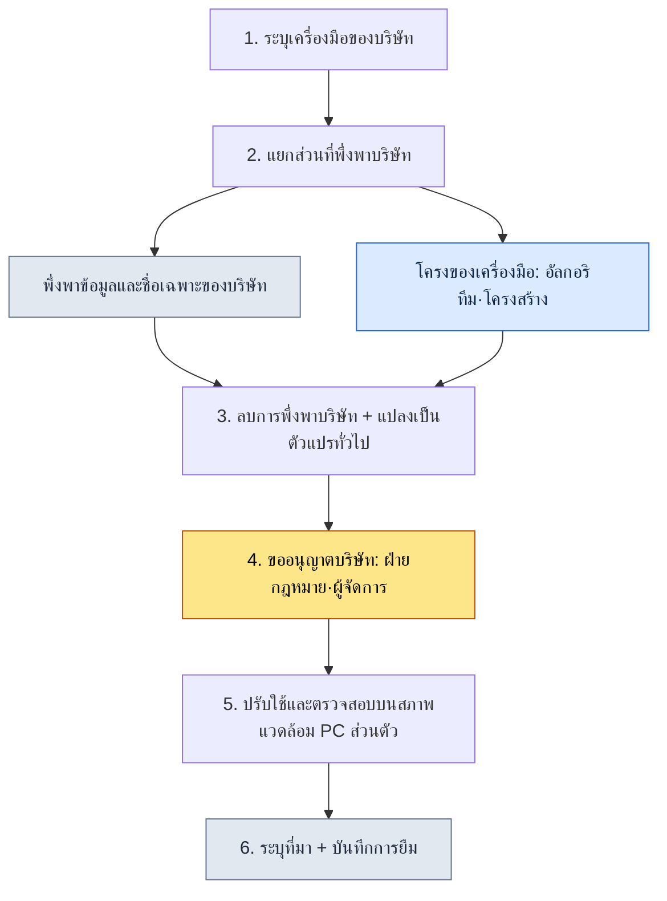

# ภาคผนวก B. ขั้นตอนการยืมเครื่องมือ (การทำให้ใช้ได้ทั่วไปจากบริษัทสู่การใช้งานส่วนตัว)

> ภาคผนวกนี้สรุปขั้นตอนที่ผู้เขียนนำเครื่องมือและสกิลที่สร้างและใช้งานในโปรเจกต์ A ของบริษัท มาปรับใช้ใหม่บน PC ส่วนตัวและกับงานทั่วไป คำถามหลักมีเพียงข้อเดียว: "จะนำเฉพาะโครงของเครื่องมือที่เรียนรู้มาอย่างถูกต้องตามกฎหมายโดยไม่ละเมิดทรัพย์สินทางความรู้ของบริษัทได้อย่างไร" ภาคผนวกนี้แสดงให้เห็นว่าผู้เขียนขีดเส้นแบ่งนั้นอย่างไร นำอะไรมาและทิ้งอะไรไว้ และบันทึกการตัดสินใจนั้นไว้เป็นหลักฐานอย่างไร

วิธีอ่านภาคผนวกนี้เป็นดังนี้ ก่อนอื่นให้อ่านหลักการห้าข้อใน B.1 โดยเทียบกับสถานการณ์ของคุณเอง แล้วลองทำตามขั้นตอนใน B.3 หนึ่งรอบตามที่เขียนไว้ จากนั้นคัดลอกแบบฟอร์มบันทึกใน B.4 มากรอกให้ตรงกับเครื่องมือที่คุณต้องการยืม เนื่องจากเป็นงานที่เกี่ยวกับทรัพย์สินของบริษัท "การทำให้บันทึกไว้ได้" จึงสำคัญกว่า "การทำให้เร็ว" และภาคผนวกทั้งหมดนี้ถูกร้อยเรียงด้วยมุมมองนั้น

---

## B.1 หลักการห้าข้อของการยืม

นี่คือหลักการห้าข้อที่ตกลงกันไว้ก่อนนำเครื่องมือมาใช้ ทั้งห้าข้อนี้ไม่ใช่ลำดับขั้น แต่เป็นเงื่อนไขที่ต้องรักษาพร้อมกัน หากข้อใดข้อหนึ่งพังลง ก็ให้ระงับการยืมนั้นไว้ก่อน สามข้อแรกคือขอบเขตทางเทคนิคของ "นำอะไรมา" และสองข้อหลังคือขอบเขตของกระบวนการในเรื่อง "นำมาอย่างไรให้ถูกต้องชอบธรรม"

| หลักการ | คำอธิบาย |
|---|---|
| 1. ไม่รวมทรัพย์สินทางความรู้ของบริษัท | ลบชื่อบริษัท ชื่อจริง และชื่อเฉพาะออก |
| 2. นำเฉพาะโครงของเครื่องมือ | ปิดกั้นข้อมูลในโดเมนของบริษัท |
| 3. ปรับให้ใช้ได้ทั่วไป | สร้างใหม่ให้เป็นกรณีการใช้งานทั่วไป |
| 4. อ้างอิงและระบุที่มาชัดเจน | ระบุชัดว่าเป็นเครื่องมือที่ยืมมาจากบริษัท |
| 5. ได้รับความเห็นชอบจากฝ่ายกฎหมายและฝ่ายบุคคล | ผ่านขั้นตอนการขออนุญาตจากบริษัท |

แถวที่สั่นคลอนบ่อยที่สุดคือข้อ 2 อัลกอริทึมและโครงสร้าง (โครง) นำมาใช้ได้ แต่หากรูปแบบข้อมูลของบริษัทที่โครงนั้นตั้งอยู่บนพื้นฐานถูกลากตามมาด้วย ก็เท่ากับว่านำทรัพย์สินทางความรู้มาในทันที งานแยกโครงออกจากข้อมูลคือเนื้อแท้ของการยืม

---

## B.2 เครื่องมือและสกิลที่ยืมมา 6 ชนิด

ตามหลักการ เครื่องมือที่นำมาบน PC ส่วนตัวจริง ๆ มีหกชนิด (ข้อมูล ณ เดือนพฤษภาคม 2026) ทั้งหมดมีจุดร่วมคือเป็นเครื่องมือที่จัดการกับข้อมูล ซึ่งไม่ใช่เรื่องบังเอิญ เพราะเครื่องมือประมวลผลข้อมูลนั้นแยกโครง (ตรรกะการแยกวิเคราะห์ การแปลง การแสดงผลภาพ) ออกจากโดเมน (รูปแบบเฉพาะของชีตในบริษัท) ได้ค่อนข้างง่าย

| เครื่องมือ | ต้นฉบับของบริษัท | ฉบับใช้ทั่วไปส่วนตัว |
|---|---|---|
| excel-reader | สกัดชีต xlsm และ VBA | ประมวลผล Excel แบบทั่วไป |
| relation-map-gen | HTML ความสัมพันธ์ FK | แผนผังความสัมพันธ์ข้อมูลแบบทั่วไป |
| schema-doc | สร้างสคีมา Markdown จากชีต | จัดทำเอกสารสคีมาแบบทั่วไป |
| table-creator | ผลิตตารางข้อมูลจำนวนมาก | สร้างตารางแบบทั่วไป |
| gdd-gen | สร้าง GDD อัตโนมัติ | สร้างเอกสารแบบทั่วไป |
| gdd-export | แปลงจาก Markdown เป็น xlsx หลายชีต | แปลง xlsx แบบทั่วไป |

หากเทียบช่องตรงกลางกับช่องขวาในตาราง จะเห็นชัดว่า "การทำให้ใช้ได้ทั่วไป" หมายถึงอะไร ฝั่งซ้ายเป็นชื่อที่มีโดเมนแฝงอยู่ เช่น "ชีตของบริษัท" "GDD" ส่วนฝั่งขวาเป็นชื่อที่ถอดโดเมนออกแล้ว เช่น "Excel ทั่วไป" "เอกสารทั่วไป" การที่บริษัทหายไปจากชื่อคือสัญญาณแรกของการทำให้ใช้ได้ทั่วไป

---

## B.3 ขั้นตอนการยืม

เมื่อแปลงหลักการ (B.1) ให้กลายเป็นการลงมือทำจริง ก็จะได้หกขั้นตอนด้านล่างนี้ จุดแยกที่สำคัญที่สุดคือขั้นที่ 2 และขั้นที่ 4 หากในขั้นที่ 2 แยกโครงออกจากโดเมนได้ไม่สะอาด ทุกขั้นตอนต่อจากนั้นจะปนเปื้อน และหากข้ามขั้นที่ 4 คือการขออนุญาตจากบริษัทไป ต่อให้ทำได้ดีเพียงใดก็จะกลายเป็นเครื่องมือที่ใช้งานไม่ได้



ในหกขั้นตอนนี้ ช่องที่ใช้เวลานานที่สุดไม่ใช่งานเขียนโค้ด (ขั้นที่ 2·3) แต่เป็นขั้นที่ 4 คือการตกลงกับบริษัทและการผ่านฝ่ายกฎหมาย นั่นหมายความว่าด่านที่ใหญ่ที่สุดไม่ใช่เทคนิคแต่เป็นความไว้วางใจ ดังนั้นการยืมจึงดำเนินตามลำดับที่ตกลงกันก่อนแล้วค่อยปรับโค้ดทีหลังเสมอ

---

## B.4 บันทึกการยืม

เครื่องมือที่ยืมมาต้องบันทึกไว้ควบคู่กันเสมอ เพราะอาจมีช่วงเวลาที่ต้องตอบคำถามว่า "เครื่องมือนี้มาจากไหน ลบอะไรออกไปบ้าง และได้รับความเห็นชอบจากใคร" ด้านล่างนี้คือแบบฟอร์มบันทึกที่ยกตัวอย่างด้วย excel-reader ซึ่งคุณสามารถคัดลอกโครงนี้ไปกรอกให้ตรงกับเครื่องมือของคุณเองได้เลย

```yaml
---
tool: excel-reader (ฉบับใช้ทั่วไปส่วนตัว)
original_source: โปรเจกต์ A ของบริษัท
adopted: 2026-05
permission: ผู้จัดการบริษัท + ผ่านฝ่ายกฎหมาย
modifications:
  - ลบการพึ่งพารูปแบบชีตของบริษัท
  - ลบฟังก์ชันในโดเมนของบริษัท (xlsm VBA)
  - ทำให้ใช้ทั่วไปด้วยการประมวลผล csv/xlsx แบบทั่วไป
  - ลบการอ้างอิงชื่อบริษัทและชื่อจริงทั้งหมด
usage_in_book: อ้างอิงเป็นกรณีตัวอย่างเครื่องมือในหนังสือเล่มนี้ (ส่วนที่ 1·5·6·8 ฯลฯ)
---
```

ช่องวันที่ (`adopted`) ในแบบฟอร์มให้เขียนเป็นปี-เดือนที่แน่นอน เช่น `2026-05` การเขียนแบบเปิดกว้าง เช่น "ราวเดือนพฤษภาคม 2026" จะดูเหมือนช่องว่างที่รอเติมภายหลัง จึงควรตอกหมุดเวลาที่ยืนยันการยืมลงไปตรงนั้นเลย

ในบันทึกนี้ บรรทัดที่มีค่ามากที่สุดคือ `permission` และ `modifications` บรรทัดแรกพิสูจน์ว่าการยืมนั้นชอบธรรม บรรทัดหลังพิสูจน์ว่าได้ถอดอะไรออกไปบ้าง หากมีสองบรรทัดนี้ ต่อให้ภายหลังมีข้อสงสัยขึ้นมา ก็ยังมีหลักฐานให้ติดตามย้อนหลังได้

---

## B.5 เครื่องมือที่ไม่ได้ยืม

สิ่งที่ทิ้งไว้สำคัญพอ ๆ กับสิ่งที่นำมา ผู้เขียนได้บันทึกเครื่องมือของบริษัทที่ตั้งใจไม่ยืมไว้พร้อมเหตุผล จุดร่วมของเครื่องมือที่ทิ้งไว้คือ เป็นทรัพย์สินทางความรู้หลักของบริษัท หรือผูกติดอยู่กับโครงสร้างองค์กรของบริษัทอย่างลึกซึ้ง จนไม่สามารถแยกโครงออกจากโดเมนได้

| เครื่องมือ | เหตุผลที่ไม่ยืม |
|---|---|
| เครื่องมือระบบต่อสู้ของบริษัท | ทรัพย์สินทางความรู้หลักของบริษัท เป็นกรรมสิทธิ์เฉพาะของบริษัท |
| เครื่องมือเอกสารเนื้อเรื่องของบริษัท | พึ่งพาโลกในเกมของบริษัท |
| เครื่องมือ TF ระบบต่อสู้ของบริษัท | พึ่งพาโครงสร้างองค์กรของบริษัท |
| เครื่องมือฝ่ายบุคคล·การเงินของบริษัท | ไม่เหมาะกับสภาพแวดล้อมภายนอก |

ตรงกันข้ามอย่างชัดเจนกับเครื่องมือที่ยืมมาใน B.2 ซึ่งล้วนเป็น "การประมวลผลข้อมูล" สิ่งที่นำมาคือเครื่องมือที่แยกออกจากโดเมนได้ ส่วนสิ่งที่ทิ้งไว้คือเครื่องมือที่เป็นเนื้อเดียวกับโดเมน ความเป็นไปได้ในการแยกออกเป็นตัวกำหนดความเป็นไปได้ในการยืม

---

## B.6 ข้อควรพิจารณาสำหรับผู้อ่าน — รายการตรวจสอบตนเองก่อนยืม

สุดท้ายนี้คือห้ารายการที่ต้องผ่านการตรวจสอบด้วยตนเองก่อนนำเครื่องมือมาใช้ ตารางนี้เป็นเช็กลิสต์ที่ตัดสินผ่าน/ไม่ผ่าน จะยืมได้ก็ต่อเมื่อผ่านครบทั้งห้ารายการเท่านั้น และหากติดแม้เพียงรายการเดียวก็ให้ระงับไว้ก่อน ไม่มีคำว่า "โดยรวมก็พอใช้ได้" เพราะงานที่เกี่ยวกับทรัพย์สินของบริษัทนั้นการผ่านบางส่วนใช้ไม่ได้

| รายการตรวจสอบ | เกณฑ์ผ่าน |
|---|---|
| ได้รับความเห็นชอบจากบริษัทแล้วหรือไม่ | ความยินยอมชัดแจ้งจากผู้จัดการ·ฝ่ายกฎหมาย |
| ผ่านการตรวจสอบจากฝ่ายกฎหมายแล้วหรือไม่ | มีการยืนยันเป็นลายลักษณ์อักษรหรือบันทึกไว้ |
| ลบทรัพย์สินทางความรู้ของบริษัทออกหมดแล้วหรือไม่ | การตรวจ grep watchlist พบ 0 รายการ |
| ตรวจสอบความเป็นสากลแล้วหรือไม่ | ยืนยันว่าทำงานได้ในสภาพแวดล้อมอื่นด้วย |
| มีขั้นตอนรับมือเมื่อเกิดเหตุหรือไม่ | กำหนดเส้นทางการติดตาม·การเรียกคืนไว้แล้ว |

ขออย่าอ่านห้ารายการนี้เป็นการผ่านห้าช่อง แต่ขอให้อ่านเป็นกลอนห้าดอก การนำสิ่งที่เรียนรู้จากบริษัทมาเป็นทรัพย์สินส่วนตัวอย่างชอบธรรมนั้นเป็นไปได้แน่นอน แต่ความชอบธรรมนั้นจะเกิดขึ้นได้ก็ต่อเมื่อล็อกทั้งห้าดอกนี้ถูกลงครบทุกดอกเท่านั้น
