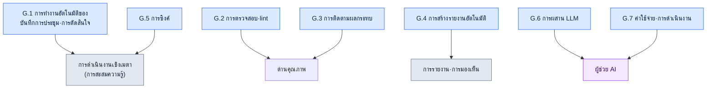

# ภาคผนวก G. รวมตัวอย่างสคริปต์สำหรับการดำเนินงาน

ภาคผนวกนี้คือรวมตัวอย่างสคริปต์อัตโนมัติสำหรับการดำเนินงานที่กล่าวถึงในเนื้อหาหลัก โดยรวบรวมไว้ในที่เดียว เนื้อหาหลักได้อธิบายว่าสคริปต์แต่ละตัว "จำเป็นเพราะอะไร" ไปตามกระแสของเรื่อง แต่เมื่อจะลงมือสร้างเครื่องมือคล้ายกันจริง ๆ สิ่งที่ต้องการคือแผนที่ที่ช่วยให้เห็นในพริบตาว่า "มีสคริปต์อะไรบ้างที่ผูกกันอยู่ในบทบาทใด" ภาคผนวกนี้คือแผนที่นั้น

ผู้เขียนได้ใส่ชื่อสคริปต์ คำอธิบายหนึ่งบรรทัด พร้อมระบุว่ากล่าวถึงในหัวข้อไหนของเนื้อหาหลัก สคริปต์หลักที่สามารถทำให้เป็นรูปแบบทั่วไปได้อย่างเรียบร้อย (G.1.1 ตัวตรวจรูปแบบ · G.2.1 ตัวตรวจความสอดคล้อง · G.3.1 แผนผังความสัมพันธ์ · G.7.1 ตัวติดตามค่าใช้จ่าย) และตัวอย่างเทสต์·hook ใน G.8 นั้น ผู้เขียนเขียนขึ้นใหม่เป็นโครงทั่วไปที่ไม่เกี่ยวข้องกับข้อมูลของบริษัท และเป็นโค้ดจริงที่ตรวจสอบแล้วว่ารันได้ตามที่เป็น ค่าตัวอย่างอินพุต เอาต์พุต และโค้ดสิ้นสุด (exit code) ล้วนเป็นค่าที่รันจริงและยืนยันแล้ว ส่วนรายการที่เหลือ ผู้เขียนระบุไว้แค่ชื่อ·บทบาท·หัวข้อเนื้อหาหลักที่เชื่อมโยง ซึ่งเหตุผลนั้นเปิดเผยอย่างตรงไปตรงมาในภาคผนวก G.9 ผู้อ่านสามารถยึดรายการที่เป็นโค้ดจริงเป็นต้นแบบ แล้วสร้างการนำไปใช้ที่เหมาะกับสภาพแวดล้อมของตนเองได้โดยตรง

วิธีใช้เป็นดังนี้ ก่อนอื่นกำหนดลักษณะของงานที่ต้องการทำให้เป็นอัตโนมัติ (เป็นการตรวจสอบ การสร้างรายงาน หรือการซิงค์) แล้วเปิดหัวข้อที่ตรงกัน (G.1\~G.7) เลือกสคริปต์ที่ใกล้เคียงที่สุดจากตรงนั้น แล้วไปที่หมายเลขหัวข้อเนื้อหาหลักในวงเล็บ เพื่อยืนยันบริบทและเจตนาในการออกแบบ สุดท้าย เทียบกับหลักการดำเนินงานใน G.8 เพื่อตรวจดูว่าสคริปต์ของตนรักษาหลักการนั้นไว้หรือไม่

เมื่อจัดกลุ่มสคริปต์ทั้งหมดตามบทบาท จะได้ดังนี้



---

## G.1 การทำงานอัตโนมัติของบันทึกการประชุม·การตัดสินใจ

เป็นชุดสคริปต์ที่ทำให้การตัดสินใจซึ่งเกิดขึ้นในที่ประชุมไม่กระจัดกระจาย แต่สะสมขึ้นเป็นสินทรัพย์ความรู้ ตั้งแต่การตรวจสอบบันทึกการประชุม การสกัด atom ไปจนถึงการเลื่อนขั้นเป็นทางการ เชื่อมต่อกันเป็นเส้นเดียว

### G.1.1 meeting_lint.py

สคริปต์ที่ตรวจสอบว่าบันทึกการประชุมมีรูปแบบที่กำหนดไว้ (ส่วนหัวที่จำเป็น·ส่วนที่จำเป็น) ครบหรือไม่ บันทึกการประชุมที่รูปแบบกระจัดกระจายจะทำให้การสกัดอัตโนมัติในภายหลังพังลง จึงสกัดกั้นตั้งแต่ทางเข้า (17.2.2)

ด้านล่างคือโครงทั่วไปที่ไม่เกี่ยวข้องกับข้อมูลของบริษัท ใช้เพียงไลบรารีมาตรฐาน (sys เท่านั้น) และรันได้ตามที่เป็น โดยจะดูว่าคีย์ส่วนหัว (บล็อกที่ห่อด้วย `---`) และส่วนหัวของหัวข้อในเนื้อหา (`## ...`) ของบันทึกการประชุม Markdown มีครบหรือไม่ ถ้ามีรายการที่ขาดหายไปจะออก violation และ exit 1 ถ้าครบทั้งหมดจะ exit 0

```python
#!/usr/bin/env python3
"""meeting_lint.py

ตรวจสอบว่าบันทึกการประชุม Markdown มีรูปแบบที่กำหนดไว้ครบหรือไม่
- ในส่วนหัว (บล็อก ---) มีคีย์ที่จำเป็นครบหรือไม่
- ในเนื้อหามีส่วนหัวของหัวข้อที่จำเป็น (## ...) ครบหรือไม่
ถ้ามีรายการที่ขาดหายไปจะพิมพ์ violation และ exit 1 ถ้าไม่มีจะ exit 0
ใช้เพียงไลบรารีมาตรฐานเท่านั้น

การใช้งาน:
    python meeting_lint.py meeting.md
"""
import sys

REQUIRED_FRONTMATTER = ["type", "date", "category", "attendees"]
REQUIRED_SECTIONS = ["## วาระการประชุม", "## การตัดสินใจ", "## รายการที่ต้องดำเนินการ", "## การประชุมครั้งถัดไป"]


def lint(text):
    """รับสตริงเนื้อหาบันทึกการประชุมแล้วคืนรายการของรายการที่ขาดหายไป (violation)"""
    violations = []

    # ส่วนหัว: ถ้าบรรทัดแรกเป็น --- ให้นับถึง --- ถัดไปเป็นส่วนหัว
    lines = text.splitlines()
    front = []
    if lines and lines[0].strip() == "---":
        for line in lines[1:]:
            if line.strip() == "---":
                break
            front.append(line)
    front_keys = [ln.split(":", 1)[0].strip() for ln in front if ":" in ln]
    for key in REQUIRED_FRONTMATTER:
        if key not in front_keys:
            violations.append({"kind": "frontmatter", "missing": key})

    # หัวข้อ: ตรวจว่าในเนื้อหามีบรรทัดส่วนหัวที่ตรงกันอยู่หรือไม่
    body_lines = [ln.strip() for ln in lines]
    for section in REQUIRED_SECTIONS:
        if section not in body_lines:
            violations.append({"kind": "section", "missing": section})

    return violations


def main(argv=None):
    argv = sys.argv[1:] if argv is None else argv
    if len(argv) != 1:
        sys.stderr.write("การใช้งาน: python meeting_lint.py meeting.md\n")
        return 2
    with open(argv[0], encoding="utf-8") as f:
        violations = lint(f.read())

    for v in violations:
        print(f"[VIOLATION] {v['kind']}: {v['missing']}")
    if violations:
        sys.stderr.write(f"[FAIL] ละเมิดรูปแบบ {len(violations)} รายการ\n")
        return 1
    sys.stderr.write("[PASS] รูปแบบครบถ้วน\n")
    return 0


if __name__ == "__main__":
    sys.exit(main())
```

ค่าคงที่สองตัวคือเกณฑ์การตรวจสอบ ตัวอย่างเช่น เมื่อใส่บันทึกการประชุมที่ส่วนหัวขาด `attendees` และในเนื้อหาไม่มี `## การประชุมครั้งถัดไป` จะถูกจับได้สองรายการดังนี้ และโค้ดสิ้นสุดคือ 1

```text
[VIOLATION] frontmatter: attendees
[VIOLATION] section: ## การประชุมครั้งถัดไป
```

### G.1.2 decision_parser.py

สคริปต์ที่อ่านส่วน "การตัดสินใจ" ของบันทึกการประชุมแล้วสกัด atom ความรู้ที่เป็นตัวเลือกออกมาโดยอัตโนมัติ ทำหน้าที่แทนงานที่คนเคยต้องคัดลอกเองทีละรายการ (17.2.3)

### G.1.3 promote.py

สคริปต์ที่เลื่อนขั้น atom ที่อยู่ในสถานะรอตรวจ (pending) ไปยังโฟลเดอร์ atom ที่เป็นทางการ โดยวางด่านตรวจสอบโดยมนุษย์ไว้ระหว่างการสกัดอัตโนมัติกับสินทรัพย์ที่เป็นทางการ (17.2.6)

---

## G.2 การตรวจสอบ·lint

เป็นด่านคุณภาพที่จับโดยอัตโนมัติว่าข้อมูลและเนื้อหาละเมิดกฎหรือไม่ ให้เครื่องคัดกรองข้อผิดพลาดด้านความสอดคล้องที่ตามองข้ามได้ง่ายก่อนเป็นอันดับแรก

### G.2.1 integrity_check_id_uniqueness.py

สคริปต์ที่ตรวจสอบว่า ID ของแต่ละรายการข้อมูลไม่ซ้ำกัน การชนกันของ ID เป็นเหตุที่จะแตกออกตอนรันไทม์ จึงสกัดกั้นไว้ตั้งแต่ขั้นข้อมูล (10.1.2)

ด้านล่างคือโครงทั่วไปที่ไม่เกี่ยวข้องกับข้อมูลของบริษัท ใช้เพียงไลบรารีมาตรฐาน (csv·json·sys·argparse) และบันทึกไว้แล้วรันได้ทันทีตามที่เป็น อินพุตเป็นรูปแบบเรียบง่ายที่ข้อมูลเกมใด ๆ ก็น่าจะมี นั่นคือ CSV ที่มีคอลัมน์ `id`

```python
#!/usr/bin/env python3
"""integrity_check_id_uniqueness.py

ตรวจสอบว่าคอลัมน์ id ของข้อมูล CSV ไม่ซ้ำกันหรือไม่
- ถ้ามี id ซ้ำ จะพิมพ์รายการ violation และ exit 1
- ถ้าไม่ซ้ำทั้งหมดจะ exit 0
ใช้เพียงไลบรารีมาตรฐานเท่านั้น

การใช้งาน:
    python integrity_check_id_uniqueness.py data.csv
    python integrity_check_id_uniqueness.py data.csv --id-column quest_id
"""
import argparse
import csv
import json
import sys


def find_duplicate_ids(rows, id_column):
    """หาค่าที่ซ้ำของ id_column จาก rows (ลิสต์ของดิกชันนารี)

    คืนค่า: ลิสต์ violation แต่ละรายการมีรูปแบบ
    {"id": ค่า, "row_numbers": [หมายเลขแถวแบบ 1-based, ...]}
    นับส่วนหัวเป็นแถวที่ 1 และนับแถวข้อมูลแรกเป็น 2
    """
    seen = {}  # ค่า id -> ลิสต์หมายเลขแถวที่ปรากฏ
    for index, row in enumerate(rows):
        row_number = index + 2  # ถัดจากส่วนหัว (แถวที่ 1)
        key = row.get(id_column, "")
        seen.setdefault(key, []).append(row_number)

    violations = []
    for key, row_numbers in seen.items():
        if len(row_numbers) > 1:
            violations.append({"id": key, "row_numbers": row_numbers})
    violations.sort(key=lambda v: v["row_numbers"][0])
    return violations


def load_rows(csv_path):
    with open(csv_path, newline="", encoding="utf-8") as f:
        return list(csv.DictReader(f))


def main(argv=None):
    parser = argparse.ArgumentParser(description="ตรวจสอบความไม่ซ้ำของ id ใน CSV")
    parser.add_argument("csv_path", help="เส้นทางไฟล์ CSV ที่จะตรวจสอบ")
    parser.add_argument("--id-column", default="id", help="ชื่อคอลัมน์ที่ใช้เป็น id (ค่าเริ่มต้น: id)")
    args = parser.parse_args(argv)

    rows = load_rows(args.csv_path)
    violations = find_duplicate_ids(rows, args.id_column)

    # มาตรฐานเอาต์พุต G.8: ออก violation_list เป็น JSON ทาง standard output
    print(json.dumps({"violation_list": violations}, ensure_ascii=False, indent=2))

    if violations:
        sys.stderr.write(f"[FAIL] พบ id ซ้ำ {len(violations)} รายการ\n")
        return 1
    sys.stderr.write("[PASS] ไม่มี id ซ้ำ\n")
    return 0


if __name__ == "__main__":
    sys.exit(main())
```

ตัวอย่างอินพุต (`data.csv`):

```text
id,name
Q001,ภารกิจแรก
Q002,เครื่องประดับที่หายไป
Q001,ภารกิจแรก(ซ้ำ)
```

ผลการรันเป็นดังนี้ เนื่องจาก `Q001` ปรากฏสองครั้งในแถวที่ 2 และแถวที่ 4 จึงถูกจับเป็น violation หนึ่งรายการ และโค้ดสิ้นสุดคือ 1

```json
{
  "violation_list": [
    {
      "id": "Q001",
      "row_numbers": [2, 4]
    }
  ]
}
```

### G.2.2 voice_lint.py

สคริปต์ที่ตรวจสอบความสอดคล้องของบุคลิกเสียง (สำนวน·นิสัย) ในบทพูดของ NPC จับความผิดเพี้ยนที่ตัวละครเดียวกันใช้สำนวนต่างกันในแต่ละบท (5.2·5.4)

### G.2.3 visual_regression.py

สคริปต์ตรวจสอบการถดถอย (regression test) ที่เปรียบเทียบว่าเมื่อทรัพยากร (อาร์ต·UI ฯลฯ) เปลี่ยนไป เกิดการเปลี่ยนแปลงทางภาพที่ไม่ได้ตั้งใจขึ้นหรือไม่ (12.1.5)

---

## G.3 การติดตามผลกระทบ

เป็นชุดสคริปต์ที่ติดตามว่าเมื่อเปลี่ยนสิ่งหนึ่งแล้วอะไรจะพลอยสั่นคลอนตามไปด้วย โดยไล่ตามการเชื่อมโยงระหว่างเอกสาร·การตัดสินใจ·ทรัพยากร และแสดงขอบเขตผลกระทบของการเปลี่ยนแปลง

### G.3.1 wikilink_graph.py

สคริปต์ที่รวบรวม Wikilink (`[[เป้าหมาย]]`) ระหว่างเอกสารแล้วสร้างกราฟการเชื่อมโยงโดยอัตโนมัติ ทำให้เห็นในพริบตาว่าเอกสารใดอ้างอิงเอกสารใด (24.3.4)

ด้านล่างคือโครงทั่วไปที่ไม่เกี่ยวข้องกับข้อมูลของบริษัท ใช้เพียงไลบรารีมาตรฐาน (os·re·json·argparse) โดยอ่านไฟล์ `.md` ในโฟลเดอร์เดียว แล้วมองชื่อไฟล์ (ไม่รวมนามสกุล) เป็นโหนด และมองลิงก์ `[[...]]` เป็นเอจ ผลลัพธ์จะออกทั้งลิสต์ความต่อเนื่อง (adjacency list) และโค้ดผังแบบ Mermaid พร้อมกัน

```python
#!/usr/bin/env python3
"""wikilink_graph.py

สร้างกราฟการเชื่อมโยง [[Wikilink]] ของเอกสาร .md ในโฟลเดอร์
- โหนด: ชื่อไฟล์ที่ตัดนามสกุลออก
- เอจ: การเขียน [[เป้าหมาย]] ในเนื้อหาเอกสาร ถ้าเป็นรูปแบบ [[เป้าหมาย|ข้อความแสดง]] จะดูเฉพาะเป้าหมาย
ใช้เพียงไลบรารีมาตรฐานเท่านั้น

การใช้งาน:
    python wikilink_graph.py ./docs
    python wikilink_graph.py ./docs --format mermaid
"""
import argparse
import json
import os
import re
import sys

WIKILINK = re.compile(r"\[\[([^\]|#]+)")  # [[เป้าหมาย]] / [[เป้าหมาย|ข้อความแสดง]] / [[เป้าหมาย#สมอ]]


def extract_links(text):
    """ดึงชื่อเป้าหมายของลิงก์จากเนื้อหาตามลำดับที่ปรากฏ โดยไม่ซ้ำ"""
    result = []
    for match in WIKILINK.findall(text):
        target = match.strip()
        if target and target not in result:
            result.append(target)
    return result


def build_graph(doc_dir):
    """ไล่อ่าน .md ในโฟลเดอร์แล้วสร้างลิสต์ความต่อเนื่อง {ชื่อเอกสาร: [เป้าหมายลิงก์, ...]}"""
    graph = {}
    for name in sorted(os.listdir(doc_dir)):
        if not name.endswith(".md"):
            continue
        node = name[:-3]
        path = os.path.join(doc_dir, name)
        with open(path, encoding="utf-8") as f:
            graph[node] = extract_links(f.read())
    return graph


def to_mermaid(graph):
    """แปลงลิสต์ความต่อเนื่องให้เป็นสตริงโค้ด Mermaid flowchart"""
    lines = ["flowchart LR"]
    for node, targets in graph.items():
        if not targets:
            lines.append(f'    {_id(node)}["{node}"]')
        for target in targets:
            lines.append(f'    {_id(node)}["{node}"] --> {_id(target)}["{target}"]')
    return "\n".join(lines)


_ID_CACHE = {}


def _id(name):
    """id โหนดของ Mermaid ต้องเป็น ASCII ชื่อภาษาเกาหลีจะถูกติด id ASCII สั้น ๆ
    เป็น n1, n2, ... ตามลำดับที่พบครั้งแรก และเก็บชื่อเดิมไว้ในป้ายกำกับ[...]"""
    if name not in _ID_CACHE:
        _ID_CACHE[name] = "n%d" % (len(_ID_CACHE) + 1)
    return _ID_CACHE[name]


def main(argv=None):
    parser = argparse.ArgumentParser(description="ตัวสร้างกราฟการเชื่อมโยง Wikilink")
    parser.add_argument("doc_dir", help="โฟลเดอร์ที่มีเอกสาร (.md) อยู่")
    parser.add_argument("--format", choices=["json", "mermaid"], default="json")
    args = parser.parse_args(argv)

    graph = build_graph(args.doc_dir)
    if args.format == "mermaid":
        print(to_mermaid(graph))
    else:
        print(json.dumps(graph, ensure_ascii=False, indent=2))
    return 0


if __name__ == "__main__":
    sys.exit(main())
```

ตัวอย่างอินพุต (สามไฟล์ในโฟลเดอร์ `docs/`):

```text
docs/세계관.md     ในเนื้อหามีลิงก์ [[지역_한양]] และ [[세력_의금부]]
docs/지역_한양.md  ในเนื้อหามีลิงก์ [[세력_의금부]]
docs/세력_의금부.md  ไม่มีลิงก์
```

เมื่อรันด้วย `--format mermaid` จะได้โค้ดผังดังนี้ โหนดจะถูกประมวลผลตามลำดับชื่อไฟล์ (세계관 → 세력_의금부 → 지역_한양) และชื่อภาษาเกาหลีเดิมยังคงอยู่ในป้ายกำกับตามที่เป็น เห็นได้ในพริบตาว่าเอกสารใดแตกแขนงไปทางไหน และปลายทาง (`세력_의금부`) คืออะไร

```text
flowchart LR
    n1["세계관"] --> n2["지역_한양"]
    n1["세계관"] --> n3["세력_의금부"]
    n3["세력_의금부"]
    n2["지역_한양"] --> n3["세력_의금부"]
```

### G.3.2 decision_impact.sh

สคริปต์ที่วิเคราะห์ว่าการ์ดการตัดสินใจหนึ่ง ๆ ส่งผลกระทบต่อเอกสาร·ทรัพยากรใดบ้าง ก่อนจะกลับการตัดสินใจ ให้ตรวจขอบเขตผลกระทบเสียก่อน (18.4.3)

### G.3.3 find_skills_using.py

สคริปต์ที่ค้นย้อนกลับเพื่อหาสกิลที่ใช้ทรัพยากรหนึ่ง ๆ ก่อนจะแก้ไข·ลบทรัพยากร ให้รู้ว่ามีอะไรพึ่งพาอยู่บ้าง (11.2.4)

---

## G.4 การสร้างรายงานอัตโนมัติ

เป็นสคริปต์ที่รวบข้อมูลที่กระจัดกระจายให้กลายเป็นรายงาน·ผังที่คนอ่านได้ ทำการรายงานประจำที่เกิดซ้ำ ๆ ให้เป็นอัตโนมัติ เพื่อลดงานที่ต้องลงมือเอง

### G.4.1 alpha_gap_report_generator.py

สคริปต์ที่รวบรวมส่วนที่ขาด (gap) เทียบกับเป้าหมายในขั้นอัลฟา แล้วสร้างเป็นรายงานรายสัปดาห์โดยอัตโนมัติ (10.3.3)

### G.4.2 decision_graph_to_mermaid.py

สคริปต์ที่แปลงความสัมพันธ์การเชื่อมโยงของการ์ดการตัดสินใจให้เป็นโค้ดผัง Mermaid ดูกระแสการตัดสินใจเป็นรูปภาพ (24.2.3)

### G.4.3 weekly_kpi_summary.py

สคริปต์ที่สรุปตัวชี้วัดหลัก (KPI) เป็นรายสัปดาห์ (13.2)

---

## G.5 การซิงค์

เป็นสคริปต์ที่ปรับข้อมูลซึ่งกระจัดกระจายอยู่หลายตำแหน่งให้ตรงกันอย่างมีประสิทธิภาพ โดยไม่คัดลอกทั้งหมดทุกครั้ง แต่เลือกซิงค์เฉพาะส่วนที่เปลี่ยนไป

### G.5.1 incremental_sync.py

สคริปต์ที่เลือกซิงค์บันทึกการประชุมเฉพาะส่วนที่เปลี่ยนแปลง ไม่ใช่ทั้งหมด ยิ่งข้อมูลสะสมมากขึ้น การคัดลอกทั้งหมดยิ่งช้าลง จึงใช้วิธีแบบส่วนเพิ่ม (incremental) (17.5.4)

### G.5.2 การตรวจจับการเปลี่ยนแปลงด้วย git diff

วิธีที่ใช้ diff ของ git ในการตรวจจับว่าอะไรเปลี่ยนไปอย่างมีประสิทธิภาพ โดยไม่ต้องมีกลไกติดตามแยกต่างหาก แต่ใช้ git เองเป็นตัวตรวจจับการเปลี่ยนแปลง (17.5.4.1)

---

## G.6 การผสาน LLM

เป็นสคริปต์ที่มอบงานซึ่งต้องใช้วิจารณญาณ เช่น การจัดประเภท·การเรียกใช้ ให้แก่ LLM งานที่ไม่ลงตัวพอดีด้วยกฎ จะถูกจัดการด้วยผู้ช่วย LLM

### G.6.1 faq_classifier.py

สคริปต์ที่จัดประเภท FAQ ที่เข้ามาตามหมวดหมู่โดยอัตโนมัติ (13.1.3)

### G.6.2 meeting_classifier.py

สคริปต์ที่จัดประเภทการประชุมตามลักษณะโดยอัตโนมัติ ใช้เพื่อเติมค่า category ในส่วนหัวของบันทึกการประชุม (17.3.6)

### G.6.3 prompt_library_loader.py

สคริปต์ที่เรียกพรอมต์ที่จำเป็นจากคลังพรอมต์ที่จัดเตรียมไว้ล่วงหน้า ทำให้ไม่ต้องเขียนพรอมต์เดิมซ้ำทุกครั้ง (22.1.2)

---

## G.7 ค่าใช้จ่าย·การดำเนินงาน

เป็นสคริปต์ที่จัดการไม่ให้การทำงานอัตโนมัติเองสร้างจุดบอดด้านค่าใช้จ่ายและการติดตามข้อมูลขึ้นมา

### G.7.1 llm_cost_tracker.py

สคริปต์ที่ติดตามค่าใช้จ่ายในการเรียก LLM และบังคับใช้เพดาน (cap) สกัดกั้นค่าใช้จ่ายที่พุ่งสูงล่วงหน้า ไม่ใช่หลังจากเกิดขึ้นแล้ว (22.3.5)

ด้านล่างคือโครงทั่วไปที่ไม่เกี่ยวข้องกับข้อมูลของบริษัท ใช้เพียงไลบรารีมาตรฐาน (json·os·argparse) บันทึกจำนวนโทเค็นในแต่ละการเรียก คำนวณค่าใช้จ่ายสะสม และเมื่อเกินเพดานจะส่งสัญญาณปฏิเสธ (exit 2) ราคาต่อหน่วยเป็นค่าคงที่ในโค้ด และค่าจริงเปลี่ยนเป็นตารางราคาของโมเดลที่แต่ละคนใช้ได้ (ค่าด้านล่างเป็นตัวยึดตำแหน่งสำหรับใช้อธิบาย)

```python
#!/usr/bin/env python3
"""llm_cost_tracker.py

บันทึกสะสมโทเค็นการเรียก LLM และตรวจสอบเพดานค่าใช้จ่ายรายวัน
- record: บวกการเรียกหนึ่งครั้ง (โทเค็นอินพุต/เอาต์พุต) ลงในไฟล์ ledger
- ถ้าค่าใช้จ่ายสะสมเกิน cap จะกั้นการเรียกด้วย exit 2 (สกัดล่วงหน้า)
ใช้เพียงไลบรารีมาตรฐานเท่านั้น

การใช้งาน:
    python llm_cost_tracker.py --ledger ledger.json --in 1200 --out 800
    python llm_cost_tracker.py --ledger ledger.json --in 1200 --out 800 --cap-usd 5.0
"""
import argparse
import json
import os
import sys

# ราคาต่อหน่วย: USD ต่อ 1,000 โทเค็น ค่าตัวยึดตำแหน่งสำหรับใช้อธิบาย — ให้เปลี่ยนเป็นตารางราคาโมเดลจริง
PRICE_PER_1K_INPUT = 0.003
PRICE_PER_1K_OUTPUT = 0.015


def cost_of(in_tokens, out_tokens):
    """คำนวณค่าใช้จ่าย (USD) ของการเรียกหนึ่งครั้งจากโทเค็นอินพุต/เอาต์พุต"""
    return (in_tokens / 1000) * PRICE_PER_1K_INPUT + (out_tokens / 1000) * PRICE_PER_1K_OUTPUT


def load_ledger(path):
    if os.path.exists(path):
        with open(path, encoding="utf-8") as f:
            return json.load(f)
    return {"calls": 0, "in_tokens": 0, "out_tokens": 0, "total_usd": 0.0}


def save_ledger(path, ledger):
    with open(path, "w", encoding="utf-8") as f:
        json.dump(ledger, f, ensure_ascii=False, indent=2)


def main(argv=None):
    parser = argparse.ArgumentParser(description="การติดตาม·เพดานค่าใช้จ่าย LLM")
    parser.add_argument("--ledger", required=True, help="เส้นทางไฟล์ JSON สำหรับบันทึกสะสม")
    parser.add_argument("--in", dest="in_tokens", type=int, required=True, help="โทเค็นอินพุตของการเรียกครั้งนี้")
    parser.add_argument("--out", dest="out_tokens", type=int, required=True, help="โทเค็นเอาต์พุตของการเรียกครั้งนี้")
    parser.add_argument("--cap-usd", type=float, default=None, help="เพดานค่าใช้จ่ายสะสม (USD) ถ้าเกินจะกั้น")
    args = parser.parse_args(argv)

    ledger = load_ledger(args.ledger)
    this_cost = cost_of(args.in_tokens, args.out_tokens)

    ledger["calls"] += 1
    ledger["in_tokens"] += args.in_tokens
    ledger["out_tokens"] += args.out_tokens
    ledger["total_usd"] = round(ledger["total_usd"] + this_cost, 6)
    save_ledger(args.ledger, ledger)

    print(json.dumps({"this_call_usd": round(this_cost, 6), "ledger": ledger}, ensure_ascii=False, indent=2))

    if args.cap_usd is not None and ledger["total_usd"] > args.cap_usd:
        sys.stderr.write(f"[CAP] สะสม {ledger['total_usd']} USD > เพดาน {args.cap_usd} USD — กั้น\n")
        return 2
    return 0


if __name__ == "__main__":
    sys.exit(main())
```

ตัวอย่างอินพุตและผลลัพธ์ เมื่อบันทึกโทเค็นอินพุต 1,200·เอาต์พุต 800 จากสถานะว่าง ค่าใช้จ่ายของการเรียกครั้งนี้คือ `1200/1000*0.003 + 800/1000*0.015 = 0.0036 + 0.012 = 0.0156` USD

```json
{
  "this_call_usd": 0.0156,
  "ledger": {
    "calls": 1,
    "in_tokens": 1200,
    "out_tokens": 800,
    "total_usd": 0.0156
  }
}
```

เมื่อให้ `--cap-usd 0.01` ไปด้วย เนื่องจากค่าสะสม 0.0156 เกินเพดาน 0.01 จึงกั้นการเรียกครั้งถัดไปด้วยโค้ดสิ้นสุด 2 นี่คือการทำงานจริงของ "สกัดล่วงหน้า ไม่ใช่หลังจากเกิดขึ้นแล้ว"

### G.7.2 source_tracker.py

สคริปต์ที่บันทึกแหล่งที่มาของข้อมูลที่อ้างอิง·ใช้อ้างถึงโดยอัตโนมัติ เก็บไว้เพื่อให้ย้อนกลับไปดูแหล่งที่มาในภายหลังได้ (24.5.4)

---

## G.8 หลักการดำเนินงานของสคริปต์

สำคัญกว่าการสร้างสคริปต์จำนวนมาก คือการที่สคริปต์ที่สร้างขึ้นทำงานได้อย่างน่าเชื่อถือ หลักการห้าข้อด้านล่างนี้ใช้ร่วมกันกับสคริปต์ทั้งหมดข้างต้น

| หลักการ | คำอธิบาย |
|---|---|
| ความเรียบง่าย | หลีกเลี่ยงไลบรารีที่ซับซ้อน |
| การทดสอบ | เทสต์ระดับหน่วย (unit test) ทุกสคริปต์ |
| มาตรฐานเอาต์พุต | มาตรฐานเช่น violation_list (10.1.7) |
| การควบคุมเวอร์ชัน | git |
| ด่านตรวจสอบโดยผู้ใช้ | การทำงานอัตโนมัติก็ต้องมีการตรวจสอบโดยมนุษย์ |

หลักการข้อสุดท้ายสำคัญเป็นพิเศษ การทำงานอัตโนมัติไม่ใช่การมาแทนที่คน แต่เป็นการลดขั้นตอนก่อนหน้าวิจารณญาณของคน ไม่ว่าจะเป็นการตรวจสอบ·การสกัด·การสร้าง ก่อนการนำไปใช้ขั้นสุดท้าย ต้องวางด่านที่คนได้ดูสักครั้งเสมอ

### G.8.1 ตัวอย่างเทสต์ระดับหน่วย

เพื่อไม่ให้หลักการ "การทดสอบ" เป็นเพียงคำพูด ผู้เขียนจึงวางเทสต์จริงที่ตรวจสอบฟังก์ชันหลัก `find_duplicate_ids` ของ G.2.1 ด้วยไลบรารีมาตรฐาน `unittest` ไว้ เนื่องจากไม่มีการพึ่งพาภายนอก จึงบันทึกตามที่เป็นแล้วรันด้วย `python -m unittest test_integrity_check -v` ได้ ประเด็นสำคัญคือ ฟังก์ชันที่จะตรวจสอบต้องถูกแยกออกจากการอ่าน/เขียนไฟล์ จึงจะทดสอบได้ง่ายเช่นนี้ (จึงเป็นเหตุที่ G.2.1 แยกตรรกะการตรวจสอบกับ `load_rows` ออกจากกัน)

```python
# test_integrity_check.py
import unittest

from integrity_check_id_uniqueness import find_duplicate_ids


class TestFindDuplicateIds(unittest.TestCase):
    def test_no_duplicates_returns_empty(self):
        rows = [{"id": "Q001"}, {"id": "Q002"}]
        self.assertEqual(find_duplicate_ids(rows, "id"), [])

    def test_one_duplicate_reports_row_numbers(self):
        rows = [{"id": "Q001"}, {"id": "Q002"}, {"id": "Q001"}]
        self.assertEqual(
            find_duplicate_ids(rows, "id"),
            [{"id": "Q001", "row_numbers": [2, 4]}],
        )

    def test_missing_column_treated_as_empty_string(self):
        rows = [{"name": "a"}, {"name": "b"}]
        result = find_duplicate_ids(rows, "id")
        self.assertEqual(result, [{"id": "", "row_numbers": [2, 3]}])


if __name__ == "__main__":
    unittest.main()
```

เมื่อรันแล้ว เทสต์ทั้งสามผ่านทั้งหมด

```text
test_missing_column_treated_as_empty_string ... ok
test_no_duplicates_returns_empty ... ok
test_one_duplicate_reports_row_numbers ... ok

----------------------------------------------------------------------
Ran 3 tests in 0.000s

OK
```

### G.8.2 ความล้มเหลวเงียบ (exit 0) ของ hook

สิ่งที่มักถูกมองข้ามในหลักการข้างต้นคือการจัดการความล้มเหลวของ hook ตัว hook ที่รันอัตโนมัติก่อนคอมมิตหรือเมื่อบันทึก โดยแก่นแท้แล้วควรเป็นกิ่งก้านของงานหลัก (คอมมิต·บันทึก) แต่ถ้า hook ออกโค้ดสิ้นสุดที่ไม่ใช่ 0 จากความผิดพลาดภายใน งานหลักที่ผูก hook นั้นไว้ก็จะถูกกั้นทั้งดุ้น เท่ากับว่ากลไกเสริมจับงานหลักเป็นตัวประกัน ดังนั้น hook ที่มีลักษณะเป็นตัวช่วยจึงต้องทำให้ไม่ว่าเกิดอะไรขึ้นภายในก็คงเหลือเพียงคำเตือนทาง standard error (stderr) และคืนโค้ดสิ้นสุดเป็น 0 เพื่อไม่ให้กั้นงานหลัก ด้านล่างคือรูปแบบขั้นต่ำของสิ่งนั้น แม้เกิด exception ภายในก็ตาม โค้ดสิ้นสุดก็เป็น 0

```python
import sys

def run_hook():
    raise RuntimeError("เกิดข้อผิดพลาดภายใน")

def main():
    try:
        run_hook()
    except Exception as exc:
        sys.stderr.write(f"[hook] คำเตือน: {exc} — จะไม่กั้นงานหลัก\n")
    return 0  # hook ตัวช่วยจะไม่กั้นงานหลักไม่ว่าเกิดอะไรขึ้น

if __name__ == "__main__":
    sys.exit(main())
```

เมื่อรันแล้วจะเห็นคำเตือน แต่โค้ดสิ้นสุดเป็น 0 กล่าวคือ คนรู้ได้ว่ามีอะไรผิดเพี้ยน และกระแสงานก็ไม่ขาดตอน

```text
[hook] คำเตือน: เกิดข้อผิดพลาดภายใน — จะไม่กั้นงานหลัก
(โค้ดสิ้นสุด 0)
```

อย่างไรก็ตาม "ความล้มเหลวเงียบ" นี้ใช้กับ hook ตัวช่วยเท่านั้น สำหรับการตรวจสอบที่ตัวการผ่านหรือไม่ผ่านคือจุดประสงค์เอง อย่างด่านคุณภาพใน G.2 นั้น ตรงกันข้าม เมื่อล้มเหลวต้องออกโค้ดที่ไม่ใช่ 0 (exit 1 ที่เห็นมาก่อนหน้า) เพื่อหยุดไปป์ไลน์ แม้จะเป็นตำแหน่ง hook เดียวกัน นโยบายโค้ดสิ้นสุดก็ตรงกันข้ามขึ้นกับว่าเป็น "ตัวช่วย" หรือ "ด่าน" ซึ่งต้องแยกแยะให้ออก

### G.8.3 จะรับรู้และกู้คืนความล้มเหลวเงียบได้อย่างไร

นโยบาย exit 0 ในหัวข้อก่อนมีราคาที่ต้องจ่ายอยู่หนึ่งอย่าง การที่ hook ตัวช่วยไม่กั้นงานหลักไม่ว่าเกิดอะไรขึ้น เมื่อพลิกกลับก็หมายความว่า **แม้ hook ตายเงียบ ๆ งานหลักก็ยังเดินต่อได้อย่างปกติ** hook ที่รันในกิ่งก้าน เช่น การฉีดบริบทอัตโนมัติ ต่อให้ไม่ทำงานหลายวัน กระแสงานก็ไม่ขึ้นไฟแดง ดังนั้น hook ตัวช่วยจึงต้องมีกลไกคู่หู "ล้มเหลวก็ไม่กั้น" ควบคู่กับ "ให้คนได้เห็นความล้มเหลวแม้จะช้าก็ตาม" เสมอ ถ้าขาดคู่หูไป สักวันหนึ่งจะมาพบในการทบทวนว่า "atom นี้ช่วงนี้ไม่ขึ้นเลยสักครั้ง" แล้วจึงได้รู้ว่า hook ตายมาทั้งสัปดาห์แล้ว

คู่หูนั้นคือล็อก อย่าปล่อยให้คำเตือนที่รูปแบบขั้นต่ำในหัวข้อก่อน (`sys.stderr.write(...)`) ทิ้งไว้ระเหยหายไป แต่ให้หล่นลงเป็นไฟล์ โดยการเรียกปกติบันทึกหนึ่งบรรทัด การเรียกที่ล้มเหลวบันทึกหนึ่งบรรทัดพร้อมเหตุผล ในสภาพแวดล้อมของผู้เขียน ร่องรอยนี้สะสมอยู่ที่ `~/.claude/hooks/_injection_log.txt` (ล็อกเดียวกันนี้ยังถูกอ่านในการตรวจสอบการทำงานของ §21.3.4 ด้วย) ลูปการดำเนินงานไม่ได้ใหญ่โต เพียงทำขั้นตอนตรวจ·กู้คืนสามขั้นวนหนึ่งรอบก็พอ

| ขั้นตอน | ดูอะไร | ทำอะไร |
|---|---|---|
| ตรวจจับ | บรรทัดการฉีดปกติล่าสุดในล็อกขาดตอน หรือบรรทัดความล้มเหลวด้วยเหตุผลเดียวกันเกิดซ้ำหรือไม่ | กวาดดูหางล็อกสักครั้งในการทบทวนรายสัปดาห์ (จับอัตโนมัติบรรทัดเดียวก็พอ) |
| แยกแยะ | เหตุของความล้มเหลวเป็นบั๊กของ hook เอง หรือเป็นข้อมูลอินพุต (manifest ที่เสีย·ไฟล์ atom ที่ไม่มี) | แยกสองอย่างด้วยสตริงเหตุผลใน stderr — ถ้าเป็นปัญหาโค้ดก็แก้โค้ด ถ้าเป็นปัญหาข้อมูลก็แก้ manifest |
| กู้คืน | การฉีดปกติกลับมาขึ้นด้วยตัวกระตุ้นหรือไม่ | หลังแก้แล้ว ลองป้อนตัวกระตุ้นที่ตั้งใจไว้สักครั้งในเซสชันใหม่ เพื่อยืนยันว่ามีบรรทัดปกติกลับมาในล็อกหรือไม่ (เหมือนการตรวจสอบการทำงานของ §21.3.4) |

แก่นคือ การมอบ "การตรวจจับ" ให้แก่ **ไฟล์ล็อกหนึ่งไฟล์และบรรทัดการทบทวนหนึ่งบรรทัด** แทนที่จะพึ่งความใส่ใจของคน สิ่งที่ exit 0 กั้นไว้คือการหยุดชะงักของงานหลัก ไม่ใช่การปกปิดความล้มเหลว ความล้มเหลวถูกเผยออกมาทาง stderr→ล็อก การทบทวนหมั่นส่องดูล็อกนั้นเป็นระยะ และการกู้คืนก็นำการตรวจสอบการทำงานที่ใช้อยู่เป็นปกติมาใช้ซ้ำตามเดิม เมื่อ "ไม่กั้น + เปิดเผย + ส่องดูเป็นระยะ + กู้คืนด้วยวิธีเดิม" เป็นชุดเดียวกันเท่านั้น ความล้มเหลวเงียบจึงจะไม่แข็งตัวกลายเป็นการปล่อยปละเงียบ ๆ

---

## G.9 ข้อมูลสำหรับผู้อ่าน

โค้ดในรวมตัวอย่างนี้มีสองชนิด ชนิดหนึ่งคือโค้ดอย่าง G.1.1·G.2.1·G.3.1·G.7.1·G.8 ที่เขียนขึ้นใหม่เป็นโครงทั่วไปที่ไม่เกี่ยวข้องกับข้อมูลของบริษัท และตรวจสอบแล้วว่ารันได้ตามที่เป็น ใช้เพียงไลบรารีมาตรฐาน และตัวอย่างอินพุต·เอาต์พุต·โค้ดสิ้นสุดที่เขียนไว้ข้างต้นล้วนเป็นผลที่รันจริงและยืนยันแล้ว คัดลอกไปใช้ได้ทันที เพียงเปลี่ยนค่าตัวยึดตำแหน่ง เช่น ตารางราคาหรือชื่อคอลัมน์ ให้เหมาะกับสภาพแวดล้อมของตนเอง

อีกชนิดหนึ่งคือรายการอย่างหัวข้อที่เหลือ ที่ระบุไว้แค่ชื่อ·บทบาท·หัวข้อเนื้อหาหลักที่เชื่อมโยง เหตุที่ไม่ได้ลงเป็นโค้ดเต็มนั้น พูดอย่างตรงไปตรงมามีสองข้อ ข้อแรก ต้นฉบับสคริปต์การดำเนินงานของบริษัทเป็น IP ของบริษัท จึงคัดลอกมาตามที่เป็นไม่ได้ ข้อสอง ตรรกะส่วนใหญ่ผูกกับสคีมาข้อมูล·โครงสร้างโฟลเดอร์·รูปแบบการ์ดการตัดสินใจเฉพาะของบริษัท เมื่อถอดสมมติฐานเหล่านั้นออกไปแล้ว ก็ไม่เหลือโค้ดที่ใช้ประโยชน์ได้ตามที่เป็นสำหรับผู้อ่านทั่วไป ด้วยเหตุนี้ผู้เขียนจึงเลื่อนขั้นเป็นโค้ดจริงเฉพาะสี่ตัวที่ทำให้เป็นรูปแบบทั่วไปได้อย่างเรียบร้อย (ตัวตรวจรูปแบบ·ตัวตรวจความสอดคล้อง·แผนผังความสัมพันธ์·ตัวติดตามค่าใช้จ่าย) และคงที่เหลือไว้เป็นโครง ผู้อ่านสามารถยึดสี่ตัวนี้เป็นต้นแบบ แล้วสร้างการนำไปใช้ที่เหมาะกับสภาพแวดล้อมของตนเองด้วยวิธีเดียวกัน — แยกตรรกะการตรวจสอบออกจากการอ่าน/เขียน ออกรายการ violation ทาง standard output และติดเทสต์ระดับหน่วยเข้าไป

ขั้นตอนการนำเครื่องมือที่มีอยู่มาดัดแปลง ดูได้ที่ภาคผนวก B
