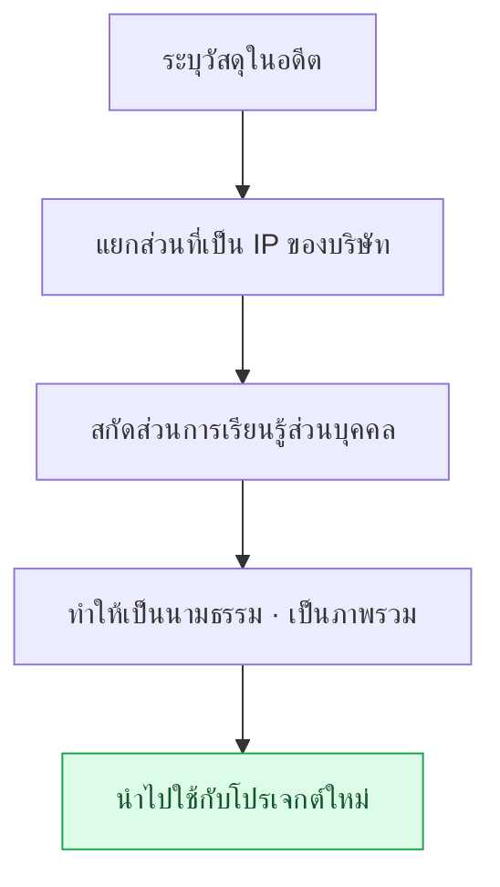

# ภาคผนวก H. การนำวัสดุงานในอดีตกลับมาใช้ใหม่

นักออกแบบเกมที่ทำงานมานานย่อมมีวัสดุงานสะสมไว้นับสิบปี ทั้งบันทึกการประชุม บันทึกการตัดสินใจ การทบทวน บันทึกการเรียนรู้ ไปจนถึงบทเรียนที่ได้จากความล้มเหลว ภาคผนวกนี้ว่าด้วยวิธีนำวัสดุเหล่านั้นกลับมาใช้ใหม่ในโปรเจกต์ใหม่ ความตึงเครียดหลักมีเพียงข้อเดียว วัสดุส่วนใหญ่เป็น IP ของบริษัทจึงเคลื่อนย้ายตามอำเภอใจไม่ได้ แต่ในขณะเดียวกันภายในนั้นก็มีการเรียนรู้ส่วนบุคคลที่ใช้ได้ทุกที่ปะปนอยู่ด้วย การแยกสองสิ่งนี้ออกจากกันคือจุดเริ่มต้นของการนำกลับมาใช้ใหม่

วิธีใช้ภาคผนวกนี้แตกต่างกันไปตามตำแหน่งของคุณ หากคุณอยู่ในสถานการณ์ที่ต้องการดึงวัสดุเก่ามาใช้ในโปรเจกต์ใหม่ ให้ทำตาม H.2 (หลักการแยก) และ H.3 (ขั้นตอน) ตามลำดับ หากกังวลว่าจะเกิดเหตุพลาดขณะเคลื่อนย้ายจริง ให้อ่าน H.5 (ห้ากับดัก) ก่อนเพื่อหลีกเลี่ยงล่วงหน้า หากคุณยังอยู่ช่วงต้นของอาชีพและยังไม่มีวัสดุสะสมมากนัก ให้ดู H.6 แล้วกำหนดตั้งแต่ตอนนี้ว่าจะเก็บอะไรไว้อย่างไร

หลักการที่กล่าวถึงในที่นี้ไม่ใช่ทฤษฎีการบริหารสินทรัพย์อันใหญ่โต แต่บีบอัดได้ในประโยคเดียวว่า "เก็บสิ่งที่เป็นรูปธรรมไว้ที่บริษัท นำกลับมาเฉพาะรูปแบบ (pattern) ที่เป็นนามธรรมเท่านั้น" ส่วนที่เหลือคือวิธีนำประโยคนั้นไปใช้กับสถานการณ์จริง

---

## H.1 คุณค่าของวัสดุในอดีต

ก่อนอื่นมาดูว่ามีวัสดุประเภทใดสะสมไว้บ้าง และสิทธิ์ในการเก็บรักษาของแต่ละอย่างต่างกันอย่างไร เพราะเมื่อสิทธิ์การเก็บรักษาต่างกัน ขอบเขตที่นำกลับมาใช้ใหม่ได้ก็ต่างกันด้วย

| วัสดุ | การเก็บรักษา |
|---|---|
| บันทึกการประชุม (วัสดุบริษัท) | อยู่ในสิทธิ์ของบริษัท |
| decision card (วัสดุบริษัท) | อยู่ในสิทธิ์ของบริษัท |
| การทบทวนรายไตรมาส (ส่วนบุคคล + บริษัท) | เก็บสำเนาส่วนบุคคลได้ |
| บันทึกการเรียนรู้ (ส่วนบุคคล) | เป็นของส่วนบุคคลถาวร |
| บันทึกอุบัติเหตุ (การเรียนรู้ส่วนบุคคล) | เป็นของส่วนบุคคลถาวร |

บันทึกการประชุมและ decision card อยู่ภายในสิทธิ์ของบริษัท การทบทวนสามารถเก็บสำเนาส่วนบุคคลได้ ส่วนบันทึกการเรียนรู้และบันทึกอุบัติเหตุเป็นสินทรัพย์ส่วนบุคคลโดยสมบูรณ์ วัสดุที่สะสมมานานเป็นสินทรัพย์การเรียนรู้ขนาดใหญ่ในตัวเอง แต่ต้องไม่ทำให้เส้นแบ่งระหว่างพื้นที่ IP ของบริษัทกับพื้นที่ส่วนบุคคลพร่าเลือน ยิ่งแบ่งเส้นให้ชัด ก็ยิ่งนำกลับมาใช้ใหม่ได้อย่างสบายใจ

---

## H.2 การแยก IP ของบริษัทออกจากการเรียนรู้ส่วนบุคคล

เกณฑ์ของการแยกคือ "เป็นรูปธรรมหรือเป็นนามธรรม" ผลลัพธ์ที่เป็นรูปธรรมเป็นของบริษัท ส่วนรูปแบบความคิดที่สร้างผลลัพธ์นั้นขึ้นมาเป็นของส่วนบุคคล ประเด็นสำคัญคือทั้งสองด้านนี้ออกมาด้วยกันจากงานชิ้นเดียวกัน

| พื้นที่ | IP ของบริษัท | การเรียนรู้ส่วนบุคคล |
|---|---|---|
| เนื้อหาการตัดสินใจ | บริษัท | — |
| รูปแบบการตัดสินใจ (สถานการณ์แบบนี้ตัดสินแบบนี้ดี) | — | ส่วนบุคคล |
| ข้อมูลเกม | บริษัท | — |
| โนว์ฮาวการให้บริการ (การจัดการ rulebook · เครื่องมือ) | — | ส่วนบุคคล |
| โค้ด | บริษัท | — |
| อัลกอริทึม · โครงสร้าง | — | ส่วนบุคคล |

"ตัดสินใจอะไรไป" เป็น IP ของบริษัท แต่ "ในสถานการณ์แบบนี้การตัดสินใจแบบนี้ใช้ได้ผลดี" เป็นรูปแบบที่เป็นการเรียนรู้ส่วนบุคคล ค่าข้อมูลเกมเองเป็นของบริษัท แต่โนว์ฮาวที่ใช้ดำเนินการข้อมูลนั้นเป็นของส่วนบุคคล เก็บวัสดุที่เป็นรูปธรรมไว้ที่บริษัท นำกลับมาเฉพาะรูปแบบที่เป็นนามธรรม — นี่คือหลักการของการแยก

---

## H.3 ขั้นตอนการนำกลับมาใช้ใหม่

เมื่อแปลงหลักการแยกให้เป็นงานจริง จะได้ห้าขั้นตอนต่อไปนี้ ระบุวัสดุ แยก IP ออก สกัดการเรียนรู้ ทำให้เป็นภาพรวม แล้วจึงนำไปใช้กับโปรเจกต์ใหม่

ขั้นตอนนี้ต้องดำเนินการหลังจากตรวจสอบสิทธิ์ของบริษัทและผ่านการพิจารณาทางกฎหมายแล้วเท่านั้น ถึงแม้จะทำให้เป็นนามธรรมเพียงพอแล้ว แต่หากจุดเริ่มต้นเป็นวัสดุของบริษัท การได้รับการยืนยันตามขั้นตอนไว้ก่อนย่อมปลอดภัยกว่า

---

## H.4 กรณีตัวอย่างการนำกลับมาใช้ใหม่ — หนังสือเล่มนี้

กรณีตัวอย่างการนำกลับมาใช้ใหม่ที่ใกล้ตัวที่สุดคือหนังสือเล่มนี้เอง เนื้อหาในหลายจุดเริ่มต้นจากงานในอดีตของผู้เขียน และเป็นผลลัพธ์จากการทำให้เป็นภาพรวมและทำให้ไม่ระบุตัวตน (anonymization) ผ่านขั้นตอนข้างต้น

| พื้นที่ | ที่มา | การนำกลับมาใช้ใหม่ |
|---|---|---|
| การออกแบบแบบบูรณาการ Layer (ส่วนที่ 6) | การให้บริการหลายปีของผู้เขียน | การเรียนรู้ส่วนบุคคล → ทำให้เป็นภาพรวม |
| ระบบบันทึกการประชุม (ส่วนที่ 17) | การดำเนินงานโปรเจกต์ A ของผู้เขียน | รูปแบบของบริษัท → ทำให้ไม่ระบุตัวตน |
| โนว์ฮาวการให้บริการ (ส่วนที่ 24) | การสะสมหลายปี | การเรียนรู้ส่วนบุคคล → ทำให้เป็นภาพรวม |
| รายการสินค้าคงคลังในภาคผนวก A | โปรเจกต์ A ของบริษัท | ทำให้ไม่ระบุตัวตน + กลั่นกรองบางส่วน |

การออกแบบ Layer และโนว์ฮาวการให้บริการทำให้การเรียนรู้ส่วนบุคคลเป็นภาพรวม ส่วนระบบบันทึกการประชุมและภาคผนวก A ทำให้รูปแบบของบริษัทไม่ระบุตัวตน ทุกรายการผ่านการขออนุญาตจากบริษัทแล้ว และ IP ของบริษัทถูกทำให้ไม่ระบุตัวตนครบถ้วนไม่มีตกหล่น กล่าวได้ว่าหนังสือซึ่งเป็นผลลัพธ์เองนั่นแหละคือหลักฐานเชิงประจักษ์ของขั้นตอน H.3

---

## H.5 ห้ากับดักของการนำกลับมาใช้ใหม่

การนำกลับมาใช้ใหม่หากทำดีก็เป็นสินทรัพย์ แต่หากทำพลาดก็เป็นอุบัติเหตุ ห้ากับดักด้านล่างเป็นจุดที่เหยียบพลาดบ่อยจริง และได้แนบใบสั่งยาไว้กับแต่ละข้อ

### H.5.1 กับดัก 1 — ไม่ผ่านสิทธิ์ของบริษัท

หากใช้วัสดุโดยไม่ได้รับอนุญาตจากบริษัท จะลุกลามเป็นข้อพิพาท ใบสั่งยาเรียบง่าย ขออนุญาตจากบริษัทก่อนใช้

### H.5.2 กับดัก 2 — ตกหล่นการทำให้ไม่ระบุตัวตน

หากชื่อบริษัทหรือชื่อจริงหลงเหลือแม้แต่จุดเดียว ก็กลายเป็นอุบัติเหตุ IP ใบสั่งยาคือการตรวจด้วย grep อัตโนมัติ ทำชื่อบริษัท · ชื่อจริง · เส้นทางไฟล์ให้เป็น watchlist แล้วให้เครื่องไล่ตรวจครบถ้วนไม่ตกหล่น

### H.5.3 กับดัก 3 — นำมาใช้ตามเดิมแบบในอดีต

หากนำโนว์ฮาวเก่าแก่มาใช้โดยไม่แตะต้อง ก็จะไม่เข้ากับช่วงเวลาปัจจุบัน ใบสั่งยาคือการเรียบเรียงใหม่ให้เข้ากับยุคสมัย คงหลักการไว้ แต่ปรับเครื่องมือและบริบทให้ทันสมัยเป็นปัจจุบัน

### H.5.4 กับดัก 4 — ทำให้เป็นนามธรรมไม่พอ

หากย้ายมาเฉพาะกรณีรูปธรรม ก็จะนำไปใช้กับสภาพแวดล้อมอื่นได้ยาก ใบสั่งยาคือวางรูปแบบที่เป็นนามธรรมและตัวอย่างที่เป็นรูปธรรมไว้ด้วยกัน จับความเป็นทั่วไปด้วยรูปแบบ และจับความเข้าใจด้วยตัวอย่าง

### H.5.5 กับดัก 5 — ไม่ได้เรียนรู้ในตัวมันเอง

ต่อให้มีวัสดุมากเพียงใด หากไม่หยิบกลับมาดูอีก ก็ไม่ต่างจากไม่มี ใบสั่งยาคือวงจรการเรียนรู้สม่ำเสมอ สร้างรอบที่จะได้พบวัสดุอีกครั้ง เหมือนกับการทบทวนรายวัน · รายสัปดาห์ · รายเดือน

---

## H.6 ข้อแนะนำสำหรับผู้อ่าน — การนำวัสดุของตนเองกลับมาใช้ใหม่

หลักการนี้ไม่ใช่ของผู้เขียนเพียงผู้เดียว ผู้อ่านก็สามารถนำวัสดุจากอาชีพของตนกลับมาใช้ใหม่ด้วยวิธีเดียวกัน ด้านล่างคือนิสัยที่แนะนำซึ่งเริ่มได้ตั้งแต่ตอนนี้

| ข้อแนะนำ | เหตุผล |
|---|---|
| ทบทวนการตัดสินใจของตนทุกไตรมาส | ค้นพบรูปแบบ |
| เก็บบันทึกการเรียนรู้แยกต่างหาก | แยกออกจาก IP ของบริษัท |
| ระบุรูปแบบที่เป็นนามธรรมให้ชัด | นำกลับมาใช้ใหม่ในอนาคตได้ |
| การให้คำปรึกษา (mentoring) · การนำเสนอภายนอก | แบ่งปันรูปแบบ |
| หนังสือ · บล็อก (หลังได้รับอนุญาตจากบริษัท) | การเรียนรู้คงอยู่ตลอดไป |

หากทบทวนการตัดสินใจของตนทุกไตรมาส รูปแบบก็จะปรากฏให้เห็น และหากเก็บบันทึกการเรียนรู้แยกออกจากวัสดุของบริษัท ภายหลังก็จะหยิบมาใช้ได้อย่างสบายใจ เมื่อนำรูปแบบนั้นออกไปสู่การให้คำปรึกษา · การนำเสนอ · การเขียนหนังสือ การเรียนรู้ก็จะคงอยู่ยาวนานแทนที่จะถูกใช้เพียงครั้งเดียวแล้วหายไป สุดท้ายแล้วการเรียนรู้ของตนเองนั่นแหละคือสินทรัพย์ของตนเอง
