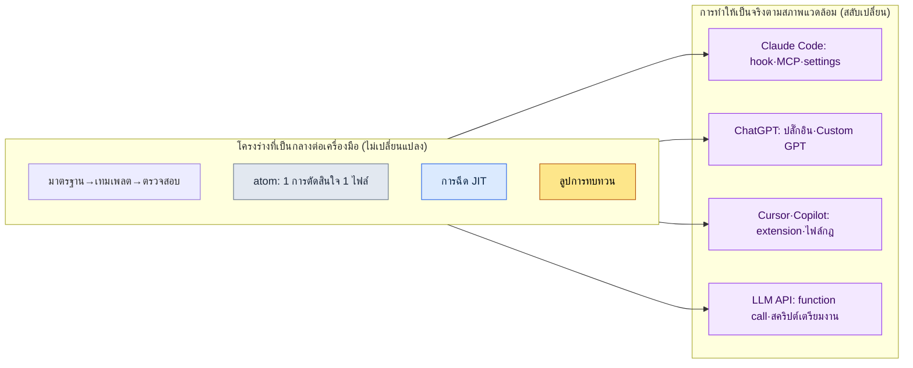

# ภาคผนวก K. การพอร์ตไปยัง LLM และฮาร์เนสอื่น

กรณีศึกษาและเครื่องมือในหนังสือเล่มนี้เกือบทั้งหมดเขียนขึ้นบนสมมติฐานของสภาพแวดล้อมเดียว นั่นคือ Claude Code ด้วยเหตุนี้ ในที่ประชุมอนุมัติหรือการตรวจทานจากภายนอกจึงมีข้อท้วงติงหนึ่งที่แทบจะไม่เคยขาดหายไป "นี่มันผูกติดกับเครื่องมือของบริษัทใดบริษัทหนึ่งไม่ใช่หรือ" ผู้รับผิดชอบฝ่ายออกแบบเกมรู้สึกหนักใจที่จะอนุมัติการตัดสินใจซึ่งพึ่งพาผู้ขาย (vendor) เพียงรายเดียว ฝ่ายที่สงสัยก็ตั้งคำถามว่าหากเปลี่ยนเครื่องมือ วิธีการทั้งหมดในหนังสือเล่มนี้จะพังทลายลงทันที ส่วนฝ่ายที่พิจารณาลิขสิทธิ์ต่างประเทศก็ถามว่า เมื่อในประเทศของตนมีเครื่องมืออื่นเป็นมาตรฐาน หนังสือเล่มนี้จะยังมีประโยชน์อยู่หรือไม่ ทั้งสามฝ่ายแสดงออกต่างกัน แต่แก่นเรื่องเหมือนกัน นั่นคือความไม่ไว้วางใจต่อ vendor lock-in หรือการถูกขังอยู่กับเครื่องมือเดียว

จุดประสงค์ของภาคผนวกนี้คือการตอบความไม่ไว้วางใจนั้น หากกล่าวบทสรุปก่อน โครงร่างของวิธีทำงานที่หนังสือเล่มนี้แนะนำนั้นเป็นกลางต่อเครื่องมือ (tool-neutral) มันไม่ได้ผูกติดกับชื่อโมเดลใดโมเดลหนึ่ง และไม่ได้ผูกติดกับเครื่องมือบรรทัดคำสั่งใดเครื่องมือหนึ่ง Claude Code เป็นเพียงภาชนะที่นำโครงร่างนั้นไปทำให้เป็นจริงได้อย่างราบรื่นที่สุด และเราสามารถย้ายโครงร่างเดียวกันนี้ไปใส่ในภาชนะอื่นได้ ภาคผนวกนี้จะ (1) แสดงเป็นตารางว่าอะไรคือโครงร่างที่ไม่ขึ้นกับเครื่องมือ (2) จับคู่ว่าแต่ละองค์ประกอบของ Claude Code เมื่อย้ายไปยังสภาพแวดล้อมอื่นแล้วจะตรงกับอะไร (3) กำหนดหลักการในการตรวจสอบข้อมูลล่าสุดบนสมมติฐานว่าโมเดลรุ่นต่าง ๆ จะเปลี่ยนไปเรื่อย ๆ และ (4) เขียนอย่างตรงไปตรงมาว่าเมื่อย้ายแล้วจะสูญเสียอะไรและรักษาอะไรไว้ได้

---

## K.1 โครงร่างที่ไม่ขึ้นกับเครื่องมือ

วิธีทำงานที่ร้อยเรียงตลอดทั้งเล่มสามารถสรุปได้เป็นเสาหลักห้าต้น เสาทั้งห้านี้ไม่มีต้นใดเป็นชื่อฟีเจอร์ของโมเดลหรือเครื่องมือบรรทัดคำสั่งใดโดยเฉพาะ แต่เป็นคำตอบต่อคำถามที่ว่า "เมื่อมนุษย์และปัญญาประดิษฐ์ทำงานร่วมกัน จะดึงผลลัพธ์ที่เชื่อถือได้ออกมาอย่างซ้ำ ๆ ได้อย่างไร" ด้วยเหตุนี้ แม้เปลี่ยนเครื่องมือ เสาเหล่านี้ก็ยังคงอยู่เหมือนเดิม

| โครงร่าง | คืออะไร | ทำไมจึงเป็นกลางต่อเครื่องมือ |
|---|---|---|
| มาตรฐาน → เทมเพลต → verification gate (ด่านตรวจสอบ) | ทำให้กฎที่ตกลงกัน (มาตรฐาน) แข็งตัวเป็นกรอบช่องว่าง (เทมเพลต) แล้ววางด่าน (gate) ที่กรองโดยอัตโนมัติว่าผลลัพธ์เป็นไปตามกฎหรือไม่ | แนวคิดเรื่องกฎ กรอบ และการตรวจสอบ สามารถแสดงออกได้ด้วยข้อความหรือสคริปต์ในเครื่องมือใดก็ได้ |
| atom = 1 การตัดสินใจ 1 ไฟล์ | เขียนการตัดสินใจหนึ่งเรื่องลงในไฟล์เล็ก ๆ หนึ่งไฟล์ เพื่อหยิบมาใช้เมื่อจำเป็น และเมื่อจะแก้ก็แก้เพียงช่องนั้นช่องเดียว | การซอยการตัดสินใจให้เล็กแล้วเก็บเป็นไฟล์ ขอเพียงมีระบบไฟล์ก็เพียงพอ |
| การฉีด JIT | คัดเฉพาะการตัดสินใจที่จำเป็นต่อบทสนทนาตอนนี้จริง ๆ มาใส่ให้โมเดลแบบทันเวลา (Just-In-Time) | เป็นหลักการที่ว่า "ใส่เฉพาะบริบทที่จำเป็น" ส่วนวิธีใส่นั้นต่างกันไปตามเครื่องมือเท่านั้น |
| ลูปการทบทวน | ย้อนมองงานที่ทำในระดับรายวัน รายสัปดาห์ รายเดือน แล้วยกระดับรูปแบบที่เกิดซ้ำให้กลายเป็นกฎของงานครั้งถัดไป | ขั้นตอนการย้อนมองและปรับปรุงนั้นขับเคลื่อนด้วยนิสัยและเอกสาร ไม่ใช่ด้วยเครื่องมือ |
| ขอบเขตการยืมเครื่องมือ | สิ่งที่หยิบมาคือโครงร่าง (อัลกอริทึม โครงสร้าง) เท่านั้น ส่วนข้อมูลโดเมนนั้นทิ้งไว้ที่เดิม (ภาคผนวก B) | การตัดสินว่าจะหยิบอะไรมาและทิ้งอะไรไว้นั้นเหมือนกันในทุกเครื่องมือ |

ช่องขวาของตารางนี้คือหัวใจสำคัญ โครงร่างทั้งห้า ในนิยามของแต่ละข้อไม่มีชื่อผลิตภัณฑ์ใดปรากฏแม้แต่ครั้งเดียว สิ่งที่ปรากฏมีเพียงแนวคิดสากลซึ่งมีอยู่ในสภาพแวดล้อมการทำงานใดก็ได้ เช่น กฎ ไฟล์ บริบท นิสัย และขอบเขต ด้วยเหตุนี้ คำถามที่ว่า "ถ้าใช้ Claude Code ไม่ได้แล้วจะทำอย่างไร" แท้จริงแล้วจึงแปรเปลี่ยนเป็นคำถามที่ตอบง่ายกว่ามาก นั่นคือ "จะนำห้าแนวคิดนี้ไปทำให้เป็นจริงในเครื่องมืออื่นได้อย่างไร" และคำตอบนั้นอยู่ในหัวข้อถัดไป

---

## K.2 ตารางจับคู่องค์ประกอบ (Claude Code → สภาพแวดล้อมอื่น)

ใน Claude Code มีกลไกที่เป็นรูปธรรมซึ่งช่วยให้นำโครงร่างข้างต้นไปทำให้เป็นจริงได้อย่างสะดวก ได้แก่ hook (สคริปต์ที่ทำงานอัตโนมัติ ณ จังหวะเวลาหนึ่ง), MCP (ข้อกำหนดสำหรับเชื่อมเครื่องมือ/ข้อมูลภายนอกเข้ากับโมเดล), ไฟล์ settings (การตั้งค่าสิทธิ์/สภาพแวดล้อม), คำสั่งสแลช (slash command — คำสั่งย่อที่เรียกขั้นตอนซึ่งใช้บ่อยด้วยบรรทัดเดียว), สกิล (ชุดงานที่นำกลับมาใช้ซ้ำได้) เป็นต้น สิ่งเหล่านี้เป็นชื่อเฉพาะของ Claude Code แต่บทบาทของมันแทบทั้งหมดมีสิ่งที่ตรงกันในสภาพแวดล้อมอื่นด้วย ตารางด้านล่างคือการจับคู่นั้น

| Claude Code | ChatGPT (เว็บ/แอป) | Cursor / Copilot | LLM API ทั่วไป |
|---|---|---|---|
| hook (รันอัตโนมัติตามจังหวะ) | ขั้นตอนทำมือก่อน/หลังบทสนทนา / คำสั่งของ Custom GPT | task ก่อน/หลังงานในเอดิเตอร์ / pre-commit hook | สคริปต์ก่อน/หลังที่แทรกเข้าไปครอบการเรียก |
| MCP (ข้อกำหนดเชื่อมต่อภายนอก) | ปลั๊กอิน / action / code interpreter | extension / การเรียกเครื่องมือในตัว | function calling / API wrapper ที่สร้างเอง |
| ไฟล์ settings (สิทธิ์/สภาพแวดล้อม) | หน้าจอตั้งค่า Custom GPT / การตั้งค่าโปรเจกต์ | ไฟล์ตั้งค่า `.cursor`/workspace | ออบเจกต์ตั้งค่าในโค้ด / ไฟล์ตั้งค่า `.env`/YAML |
| คำสั่งสแลช (ย่อขั้นตอน) | พรอมต์ที่บันทึกไว้ / Custom GPT | snippet / คำสั่งที่ผู้ใช้กำหนดเอง | ฟังก์ชันเทมเพลตพรอมต์ |
| สกิล (ชุดงานใช้ซ้ำ) | Custom GPT / ชุดพรอมต์ | ไฟล์กฎ + สคริปต์ | พรอมต์/ฟังก์ชันโค้ดที่แยกเป็นโมดูล |
| CLAUDE.md / หน่วยความจำ | คำสั่งกำหนดเอง / ฟีเจอร์หน่วยความจำ | ไฟล์กฎของโปรเจกต์ (rules) | system prompt + ที่เก็บหน่วยความจำภายนอก |
| ชุดไฟล์ atom | (ไม่ขึ้นกับเครื่องมือ) ไฟล์ Markdown | (ไม่ขึ้นกับเครื่องมือ) Markdown ในรีพอซิทอรี | (ไม่ขึ้นกับเครื่องมือ) ไฟล์/เรกคอร์ดใน DB |

เมื่อดูตารางจะเห็นชัดอย่างหนึ่ง ยิ่งไปทางขวา นั่นคือยิ่งไปทางฝั่ง LLM API ทั่วไป สิ่งที่ "เคยทำให้โดยอัตโนมัติ" ก็จะเปลี่ยนเป็น "สิ่งที่ต้องสร้างเองแล้วแทรกเข้าไป" การฉีดอัตโนมัติที่ใน Claude Code จบได้ด้วย hook บรรทัดเดียว เมื่ออยู่ใน API ทั่วไปจะกลายเป็นสคริปต์เตรียมงานที่ต้องเขียนเองก่อนการเรียก ความสะดวกของระบบอัตโนมัติลดลง แต่ตัวโครงร่างเองยังคงย้ายไปได้เหมือนเดิม กล่าวคือ การพอร์ตไม่ใช่ "การสูญเสียฟังก์ชัน" แต่เป็น "การติดตั้งความสะดวกขึ้นมาใหม่ด้วยมือของเราเอง"

ภาพนี้คือบทสรุปหนึ่งหน้าของทั้งภาคผนวก กล่องด้านบน (โครงร่าง) ไม่ว่าลูกศรจะชี้ไปยังสภาพแวดล้อมใด เนื้อหาก็ไม่เปลี่ยน มีเพียงกล่องด้านล่าง (การทำให้เป็นจริง) เท่านั้นที่ถูกสลับเปลี่ยนให้เข้ากับสภาพแวดล้อม เมื่อในที่ประชุมอนุมัติมีคำว่า "vendor lock-in" ปรากฏขึ้น ก็เพียงเปิดภาพหนึ่งหน้านี้แล้วตอบว่า "สิ่งที่ถูกผูกติดคือช่องล่าง ไม่ใช่ช่องบน"

---

## K.3 สมมติฐานที่ว่าชื่อโมเดลย่อมเปลี่ยนไป

เมื่อพูดถึงการพอร์ต ข้อมูลที่ล้าสมัยเร็วที่สุดคือชื่อโมเดล หากตอกชื่อโมเดลล่าสุด ณ เวลาที่เขียนหนังสือเล่มนี้ลงในเนื้อหา พอโมเดลรุ่นถัดไปออกมา ประโยคนั้นก็กลายเป็นข้อมูลที่ผิดทันที ด้วยเหตุนี้ หนังสือเล่มนี้จึงยึดหลักการหนึ่งมาตั้งแต่ต้น คือไม่อธิบายโดยพึ่งพาชื่อหรือหมายเลขรุ่นของโมเดลใดโมเดลหนึ่ง แต่อธิบายโดยพึ่งพาบทบาทที่โมเดลทำ (ฟังก์ชันอย่างการให้เหตุผล การสรุปความ การสร้างโค้ด)

| สิ่งที่เปลี่ยน (อย่าตอกตรึงไว้) | สิ่งที่ไม่เปลี่ยน (พึ่งพาได้) |
|---|---|
| ชื่อผลิตภัณฑ์/หมายเลขรุ่นของโมเดล | การแบ่งบทบาทอย่าง "โมเดลที่ให้เหตุผลได้ดี" "โมเดลที่รับบริบทยาว" |
| ตัวเลขเฉพาะของขีดจำกัด context | หลักการ JIT ที่ว่า "เพราะมีขีดจำกัด จึงใส่เฉพาะบริบทที่จำเป็นจริง ๆ" |
| ตัวเลขเฉพาะของราคา/ความเร็ว | จิตสำนึกด้านต้นทุนที่ว่า "งานที่แพงให้รันเฉพาะสิ่งที่ผ่าน gate แล้ว" |
| วิธีเปิด/ปิดฟีเจอร์ใดฟีเจอร์หนึ่ง | "บทบาทที่ฟีเจอร์นั้นทำ" และโครงร่างที่ทดแทนมันได้ |

วิธีตรวจสอบโมเดล/ฟีเจอร์ล่าสุดในงานจริงก็ใช้เพียงบรรทัดเดียวต่อเครื่องมือ ใน Claude Code สามารถตรวจสอบโมเดลที่ใช้อยู่ตอนนี้และตัวเลือกต่าง ๆ ได้ทันทีด้วยคำสั่ง `/model` ส่วนเครื่องมืออย่าง ChatGPT หรือ Cursor ก็แสดงข้อมูลเดียวกันในหน้าจอตั้งค่าหรือดรอปดาวน์เลือกโมเดล ดังนั้น หากประโยคใดในหนังสือเล่มนี้ดูขัดกับชื่อโมเดล ไม่ใช่ว่าประโยคนั้นผิด แต่เป็นเพราะโมเดลก้าวไปอีกหนึ่งรุ่นแล้ว ขอเพียงบทบาทยังเหมือนเดิม วิธีการก็นำมาใช้ได้ตามเดิม เมื่ออ่านหนังสือแล้วเจอชื่อโมเดลที่ไม่คุ้น โปรดอย่าสงสัยเนื้อหา แต่ขอแนะนำให้ตรวจสอบสถานะล่าสุดของเครื่องมือที่อยู่ในมือก่อนด้วยคำสั่งอย่าง `/model`

---

## K.4 สิ่งที่สูญเสียและสิ่งที่รักษาไว้ได้เมื่อพอร์ต

เมื่อย้ายเครื่องมือ ย่อมมีสิ่งที่สูญเสียไปอย่างแน่นอน หากปกปิดความจริงข้อนี้กลับยิ่งทำให้สูญเสียความไว้วางใจ ดังนั้นผู้เขียนจะเขียนอย่างตรงไปตรงมาก่อนว่าสูญเสียอะไรบ้าง อย่างไรก็ตาม สิ่งที่สูญเสียเกือบทั้งหมดอยู่ในขอบเขตของ "ความสะดวก" ส่วนสิ่งที่รักษาไว้ได้อยู่ในขอบเขตของ "โครงร่าง" กล่าวคือ สิ่งที่สูญเสียคือสิ่งที่ติดตั้งใหม่ก็เรียกกลับคืนมาได้ ส่วนสิ่งที่รักษาไว้ได้คือสิ่งที่แต่แรกก็ไม่ได้ผูกติดกับเครื่องมืออยู่แล้ว

| ประเภท | รายการ | คำอธิบาย |
|---|---|---|
| สิ่งที่สูญเสีย (ความสะดวก) | ความราบรื่นของการรันอัตโนมัติ | ระบบอัตโนมัติที่แทรกตัวเข้ามาเองอย่าง hook ต้องสร้างขึ้นเองด้วยสคริปต์ก่อน/หลัง |
| สิ่งที่สูญเสีย (ความสะดวก) | หน้าจอเดียวที่รวมทุกอย่าง | คำสั่ง เครื่องมือ และไฟล์ที่เคยรวมอยู่ในกระแสงานเดียว อาจต้องกระจายไปติดตั้งในเครื่องมือหลายตัว |
| สิ่งที่สูญเสีย (ความสะดวก) | สกิล/คำสั่งที่ใช้ได้ทันที | ต้องลงทะเบียนคำสั่งสแลช/สกิลใหม่ตามวิธีของเครื่องมือนั้น |
| สิ่งที่รักษาไว้ (โครงร่าง) | มาตรฐาน·เทมเพลต·verification gate | กฎ กรอบ และการตรวจสอบ เป็นข้อความและสคริปต์ จึงคงอยู่ได้เหมือนเดิมทุกที่ |
| สิ่งที่รักษาไว้ (โครงร่าง) | atom·JIT·ลูปการทบทวน | ขับเคลื่อนด้วยไฟล์และนิสัย จึงคงอยู่แม้เปลี่ยนเครื่องมือ |
| สิ่งที่รักษาไว้ (โครงร่าง) | ขอบเขตการยืมเครื่องมือ (ภาคผนวก B) | เกณฑ์ตัดสินว่าจะหยิบอะไรมาและทิ้งอะไรไว้ ไม่ขึ้นกับสภาพแวดล้อม |

หากย่อตารางนี้ให้เหลือประโยคเดียวก็เป็นดังนี้ สิ่งที่สูญเสียในการพอร์ตคือความสะดวกของระบบอัตโนมัติที่ใช้เวลาสักหน่อยก็ฟื้นคืนมาได้ ส่วนสิ่งที่รักษาไว้คือโครงร่างของงานที่หนังสือเล่มนี้พยายามวางไว้นอกเครื่องมือมาตั้งแต่ต้น ดังนั้น คำตอบที่ตรงไปตรงมาที่สุดต่อคำถามที่ว่า "นี่มัน vendor lock-in ไม่ใช่หรือ" คือสิ่งนี้ มีส่วนที่ถูกผูกติดอยู่จริง แต่นั่นเป็นภาชนะที่สลับเปลี่ยนได้ ส่วนเนื้อหาในภาชนะซึ่งเป็นคุณค่าที่แท้จริงนั้น แต่แรกก็ไม่ได้ผูกติดกับภาชนะใดเลย ผู้เขียนหวังว่าภาคผนวกบทนี้จะช่วยตอบคำถามนั้นแทนผู้เขียนในที่ประชุมอนุมัติ
