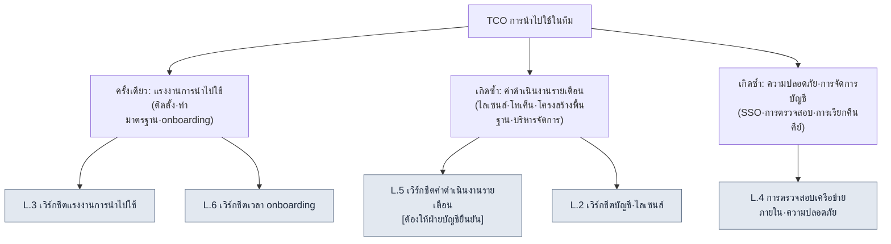

# ภาคผนวก L. เวิร์กชีต TCO และการ Onboarding สำหรับการนำไปใช้ในทีม

> ภาคผนวกนี้คือเวิร์กชีตแบบเติมช่องว่างที่จัดทำขึ้นเพื่อตอบคำถามของ PD และผู้บริหารสตูดิโอที่ว่า "เมื่อจะขยายระบบที่คนเดียวสร้างมา 6 เดือนไปสู่ทีมขนาดกลาง จะประเมินแรงงานในการนำไปใช้ ค่าใช้จ่ายดำเนินงาน บัญชีผู้ใช้ และความปลอดภัยของเครือข่ายภายในด้วยอะไรและอย่างไร" หากหัวข้อ 19.3 (กลยุทธ์การนำ AI ไปใช้และการโน้มน้าวผู้บริหาร) ในเนื้อหาหลักบอกว่า "อย่าปั้นแต่ง ROI" ภาคผนวกนี้ก็นำหลักการเดียวกันนั้นมาใช้กับฝั่งต้นทุนการนำไปใช้เช่นกัน กล่าวคือ **ภาคผนวกนี้ไม่ได้ให้ตัวเลข** ทุกช่องเป็นช่องว่าง และผู้ที่เติมช่องเหล่านั้นคือการวัดและการประมาณของทีมคุณ ส่วนช่องที่ทำเครื่องหมาย `[ต้องให้ฝ่ายบัญชียืนยัน]` ไว้นั้น จะไม่มีใครเติมด้วยการประมาณจนกว่าฝ่ายบัญชีจะเติมเอง

วิธีใช้ภาคผนวกนี้เป็นดังนี้ ก่อนอื่น ใน L.1 ให้จับภาพรวมว่า TCO (Total Cost of Ownership, ต้นทุนการเป็นเจ้าของทั้งหมด) แบ่งออกเป็นรายการใดบ้างด้วยแผนภาพ จากนั้นพิมพ์เวิร์กชีตทั้งห้าใน L.2\~L.6 ออกมาในสภาพช่องว่างโดยจัดให้ตรงกับแถวขนาดทีมของตัวเอง แล้ววัดด้วยตัวเองหรือส่งต่อให้ผู้รับผิดชอบฝ่ายบัญชี/ความปลอดภัยสารสนเทศด้วยคำถามบรรทัดเดียว สุดท้ายใช้รายการตรวจสอบตนเองใน L.7 เพื่อยืนยันว่าไม่มีช่องใดตกหล่น คุณค่าของภาคผนวกนี้ไม่ได้อยู่ที่ตัวเลขที่เติมแล้ว แต่อยู่ที่ **การสร้างช่องไว้ล่วงหน้าสำหรับรายการต้นทุนที่ตกหล่นได้ง่าย**

---

## L.1 TCO ไม่ใช่ค่าธรรมเนียมไลเซนส์

กับดักที่ PD พลาดบ่อยที่สุดคือการมองต้นทุนการนำไปใช้เป็นเพียง "ค่าสมาชิก × จำนวนคน" เท่านั้น ต้นทุนการเป็นเจ้าของทั้งหมดจริง ๆ นั้นกว้างกว่านั้น มันแยกออกเป็น **แรงงานในการนำไปใช้** ที่จ่ายครั้งเดียวแล้วจบ (การติดตั้ง·การทำให้เป็นมาตรฐาน·การ onboarding) และ **ค่าใช้จ่ายดำเนินงาน** ที่เกิดซ้ำทุกเดือน (ไลเซนส์·โทเค็น·โครงสร้างพื้นฐาน·ค่าแรงงานในการบริหารจัดการ) และเหนือสิ่งนั้นยังมีต้นทุน **ความปลอดภัย·การจัดการบัญชี** ที่มองไม่เห็นทับซ้อนอยู่อีก

ในสามแขนงนั้น ฝั่งที่ PD ประเมินต่ำเกินไปได้ง่ายคือฝั่งซ้าย (แรงงานการนำไปใช้) และฝั่งขวา (ความปลอดภัย·บัญชี) ค่าธรรมเนียมไลเซนส์จะระบุมาในใบเสนอราคา แต่ "แรงงานในการจัดมาตรฐาน·สกิลที่คนเดียวสั่งสมด้วยมือมา 6 เดือนให้อยู่ในรูปแบบที่ทีมแบ่งปันกันได้" และ "การตรวจสอบความปลอดภัยเพื่อกำหนดว่าจะอนุญาตให้เรียกใช้ LLM ภายนอกจากเครือข่ายภายในได้ถึงระดับใด" นั้นไม่มีอยู่ในใบเสนอราคา และด้วยเหตุนี้มันจึงทำให้กำหนดการและงบประมาณบานปลายเสมอ เวิร์กชีตในภาคผนวกนี้มีจุดมุ่งหมายเพื่อเปิดเผยต้นทุนที่มองไม่เห็นนั้นออกมาก่อน แม้จะเป็นในสภาพช่องว่างก็ตาม

> หัวข้อ 19.3.6 ในเนื้อหาหลักบอกว่า "ค่าใช้จ่ายจะไม่ใส่ค่าสัมบูรณ์ไว้ในหนังสือ — มันคือช่องว่างที่จะรับมาจากฝ่ายบัญชีแล้วเติม" ภาคผนวกนี้คือการกางช่องว่างนั้นออกเป็นรายการ ๆ ว่าควรวางไว้ที่ใดบ้าง

---

## L.2 เวิร์กชีตบัญชี·ไลเซนส์

นี่คือตารางแรกที่ต้องเติม บันทึกว่าใครใช้เครื่องมือใด และสิทธิ์นั้นถูกออก·เรียกคืนอย่างไร พร้อมจำนวนคน ช่องจำนวนคนให้เติมด้วยจำนวนหัวจริงของทีมคุณ ส่วนช่องราคาต่อหน่วยให้นำมาจากใบเสนอราคาหรือตารางค่าธรรมเนียมสาธารณะมาเติม หนังสือเล่มนี้ไม่ระบุราคาต่อหน่วย

| รายการ | บันทึกอะไร | ใครเป็นผู้เติม | ค่าของทีมตัวเอง |
|---|---|---|---|
| จำนวนซีตต่อเครื่องมือ | จำนวนบัญชี (ซีต) ที่จำเป็นต่อเครื่องมือแต่ละตัว | ลีด | ______ ซีต |
| การกระจายระดับสิทธิ์ | full / cap ต่องาน / คน outsource ครั้งเดียว (ภาคผนวก C.1.2) | ลีด | full __คน / ทั่วไป __คน / outsource __คน |
| ราคาต่อซีต | ค่าธรรมเนียมรายเดือนต่อซีตของแต่ละเครื่องมือ | บัญชี·จัดซื้อ | ______ /ซีต·เดือน |
| มีคีย์ส่วนกลางหรือไม่ | คีย์ API ส่วนกลางของทีม vs คีย์รายบุคคล | ความปลอดภัยสารสนเทศ | □ ส่วนกลาง □ รายบุคคล |
| ขั้นตอนการออก | เส้นทาง·เวลาที่ใช้ในการออกบัญชีให้พนักงานใหม่ | ลีด | ______ |
| ขั้นตอนการเรียกคืน | เส้นทางเรียกคืนคีย์/ซีตเมื่อลาออก·สิ้นสุด outsource | ความปลอดภัยสารสนเทศ | ______ |

กฎมีอยู่สองข้อ ข้อแรก **คน outsource·คนระยะสั้น อย่าออกซีตแบบถาวร แต่ให้เปิดและเรียกคืนตามแต่ละงาน** (ภาคผนวก C.1.2) ข้อสอง **หากช่องขั้นตอนการเรียกคืนยังว่างอยู่ ก็อย่าเริ่มออกบัญชี** เนื่องจากอุบัติเหตุที่พบบ่อยที่สุดคือบัญชีของผู้ลาออกไม่ถูกเรียกคืน ทำให้ทั้งค่าใช้จ่ายและการเปิดเผยคีย์รั่วไหลไปพร้อมกัน จึงต้องออกแบบการเรียกคืนก่อนการออกบัญชี

---

## L.3 เวิร์กชีตแรงงานการนำไปใช้ตามขนาดทีม

นี่คือตารางสำหรับประมาณแรงงานครั้งเดียวที่เพิ่มขึ้นเมื่อ "คนเดียว 6 เดือน" ขยายไปสู่ทีม โดยแบ่งตามขนาด ช่องแรงงานใช้หน่วย **คน-วัน (คนหนึ่งทำงานหนึ่งวัน)** ซึ่งทีมคุณวัดหรือประมาณจริงแล้วเติมเอง หนังสือเล่มนี้ไม่ได้ให้จำนวนคน-วัน — เพราะมันต่างกันมากตามระดับความชำนาญของทีมและระดับการจัดมาตรฐานที่มีอยู่เดิม

| รายการแรงงานการนำไปใช้ | 1\~3 คน | 4\~10 คน | 11\~30 คน | 31\~50 คน | ผู้วัด/ประมาณ |
|---|---|---|---|---|---|
| ติดตั้ง·ตั้งค่าสภาพแวดล้อม (เครื่องมือ·hook·สิทธิ์) | ___คน-วัน | ___คน-วัน | ___คน-วัน | ___คน-วัน | ลีด/โครงสร้างพื้นฐาน |
| ทำสินทรัพย์ของคนเดียวให้ทีมแบ่งปันได้ (จัดสกิล·มาตรฐาน·atom) | ___คน-วัน | ___คน-วัน | ___คน-วัน | ___คน-วัน | ลีด |
| กำหนดมาตรฐานทีม (การตั้งชื่อ·frontmatter·rulebook, ภาคผนวก D) | ___คน-วัน | ___คน-วัน | ___คน-วัน | ___คน-วัน | ลีด |
| สร้าง verification gate (lint·ทำ rulebook ให้อัตโนมัติ) | ___คน-วัน | ___คน-วัน | ___คน-วัน | ___คน-วัน | QA/ลีด |
| จัดทำเอกสาร onboarding (เชื่อมโยงกับ L.6) | ___คน-วัน | ___คน-วัน | ___คน-วัน | ___คน-วัน | ลีด |
| รวม (แรงงานการนำไปใช้ครั้งเดียว) | ___คน-วัน | ___คน-วัน | ___คน-วัน | ___คน-วัน | — |

ช่องที่ตกหล่นได้ง่ายเมื่อเติมตารางนี้คือแถวที่สอง สินทรัพย์ที่คนเดียวสั่งสมไว้ในหัวและในโฟลเดอร์ส่วนตัวมา 6 เดือนนั้น หากจะให้ทีมแบ่งปันก็ต้องมีใครสักคนดึงออกมาจัดระเบียบและทำเป็นเอกสาร ซึ่งกินแรงงานต่างหากออกไป หากคิดแรงงานนี้เป็น "0" กำหนดการนำไปใช้จะเลื่อนแน่นอน อีกทั้งตารางยังแสดงให้เห็นล่วงหน้าผ่านรูปร่างของช่องว่า ยิ่งขนาดใหญ่ขึ้น แรงงานด้าน **การกำหนดมาตรฐาน·verification gate** จะเพิ่มขึ้นชันกว่าแรงงานการติดตั้ง — เพราะเมื่อคนเพิ่มขึ้น จำนวนมาตรฐานที่ต้องตกลงร่วมกันก็เพิ่มขึ้น

> หากทำตามการนำไปใช้เป็นขั้น (อนุรักษ์นิยม→ก้าวหน้า) ในหัวข้อ 19.3.1 ของเนื้อหาหลัก คุณจะกระจายแรงงานนี้โดยไม่ใช้หมดในไตรมาสเดียว แต่ค่อย ๆ ทยอยลงทุนตั้งแต่ขั้นที่ 1 (การฉีดบริบท) แบบ pilot ได้ อย่าพยายามขออนุมัติยอดรวมของตารางในครั้งเดียว แต่แยกเฉพาะแรงงานของขั้นที่ 1 ออกมาขออนุมัติก่อนจะเป็นจริงมากกว่า

---

## L.4 เวิร์กชีตตรวจสอบเครือข่ายภายใน·ความปลอดภัย

นี่คือพื้นที่ที่ PD·ผู้บริหารหวาดกลัวโดยตรงที่สุด ตรวจสอบเป็นรายการว่ามีอะไรออกไปยัง LLM ภายนอกบ้าง และอนุญาตให้เรียกใช้ภายนอกจากเครือข่ายภายในได้ถึงระดับใด ตารางนี้เป็นรายการตรวจสอบที่ใช้แยกผ่าน/รอพิจารณา (เชื่อมโยงกับภาคผนวก C.6 ความปลอดภัย) และหากมีรายการใดแม้แต่รายการเดียวที่ยังไม่กำหนด ก็ให้รอการนำไปใช้ในขอบเขตนั้นไว้ก่อน

| รายการตรวจสอบ | เกณฑ์ผ่าน | ผู้รับผิดชอบ | สถานะ |
|---|---|---|---|
| ขอบเขตข้อมูลที่ส่งไป LLM ภายนอก | ข้อมูลอ่อนไหวใช้ placeholder/โฮสต์เอง (C.6) | ความปลอดภัยสารสนเทศ | □ ผ่าน □ รอพิจารณา |
| การส่งข้อมูลการชำระเงิน·ข้อมูลส่วนบุคคล | ระบุชัดว่าห้ามส่งโดยไม่มีข้อยกเว้น | ความปลอดภัยสารสนเทศ | □ ผ่าน □ รอพิจารณา |
| นโยบายการเรียกใช้ภายนอกจากเครือข่ายภายใน | กำหนดโดเมนที่อนุญาต·proxy·ระยะเก็บ log | โครงสร้างพื้นฐาน | □ ผ่าน □ รอพิจารณา |
| ความจำเป็นในการโฮสต์เอง | ตัดสินใจว่าจะประมวลผล IP หลักด้วยโมเดลที่โฮสต์เองหรือไม่ | ผู้บริหาร/ความปลอดภัยสารสนเทศ | □ ตัดสิน □ ยังไม่กำหนด |
| การรับมืออุบัติเหตุคีย์รั่ว | เปลี่ยนทันที + เส้นทางตรวจสอบประวัติการใช้งาน (C.7) | ความปลอดภัยสารสนเทศ | □ ผ่าน □ รอพิจารณา |
| audit log | บันทึก·เก็บรักษาว่าใคร·เมื่อใด·เรียกใช้อะไร | โครงสร้างพื้นฐาน | □ ผ่าน □ รอพิจารณา |
| การตรวจการรั่วไหล IP ของบริษัทออกภายนอก | ขั้นตอนตรวจล่วงหน้า เช่น grep watchlist (ภาคผนวก B.6) | ลีด | □ ผ่าน □ รอพิจารณา |
| การแยก access ของ outsource | บัญชี outsource ตัดการเข้าถึงสินทรัพย์หลัก·แยกตามงาน | ความปลอดภัยสารสนเทศ | □ ผ่าน □ รอพิจารณา |

ช่องที่ทำให้ต้นทุนต่างกันมากที่สุดในตารางนี้คือแถวที่สี่ (ความจำเป็นในการโฮสต์เอง) หากตัดสินใจว่าไม่สามารถส่ง IP หลักไปยัง LLM ภายนอกได้เด็ดขาด ค่าใช้จ่ายโครงสร้างพื้นฐานในการโฮสต์เองจะถูกทับลงไปทั้งก้อนบนค่าดำเนินงานของ L.5 ด้วยเหตุนี้การตัดสินใจนี้จึงต้องไม่ใช่ลีด แต่ต้องเป็น **ผู้บริหาร·ความปลอดภัยสารสนเทศร่วมกัน** เป็นผู้ตัดสิน และก่อนตัดสินใจ ก็ไม่สามารถยืนยันช่องโครงสร้างพื้นฐานของ L.5 ได้ เวิร์กชีตสองตารางเชื่อมต่อกันด้วยช่องเดียวนี้

---

## L.5 เวิร์กชีตค่าดำเนินงานรายเดือน [ต้องให้ฝ่ายบัญชียืนยัน]

นี่คือตารางที่แยกค่าใช้จ่ายที่เกิดซ้ำทุกเดือนออกเป็นรายการ ๆ **ช่องจำนวนเงินในตารางนี้ว่างทั้งหมด และช่องที่ทำเครื่องหมาย `[ต้องให้ฝ่ายบัญชียืนยัน]` ไว้นั้น จะไม่มีใครเติมด้วยการประมาณจนกว่าฝ่ายบัญชีจะเติมเอง** ราคาต่อหน่วยโทเค็น·ค่าสมาชิก·ค่าโครงสร้างพื้นฐานเปลี่ยนแปลงทุกเดือนตามโมเดล·ปริมาณการเรียกใช้·สัญญา ดังนั้นหนังสือเล่มนี้จึงไม่ระบุค่าสัมบูรณ์

| รายการค่าดำเนินงาน | วิธีคำนวณ | ใครเป็นผู้เติม | จำนวนเงินรายเดือน |
|---|---|---|---|
| ไลเซนส์·ค่าสมาชิก | จำนวนซีต × ราคาต่อซีต (L.2) | บัญชี | [ต้องให้ฝ่ายบัญชียืนยัน] |
| ค่าโทเค็น LLM | ปริมาณการเรียกใช้ × ราคาต่อโทเค็น, ผลรวมเพดาน (cap) ต่อเครื่องมือ | บัญชี | [ต้องให้ฝ่ายบัญชียืนยัน] |
| โครงสร้างพื้นฐาน (กรณีโฮสต์เอง) | เซิร์ฟเวอร์·GPU·สตอเรจตามการตัดสินใจของ L.4 | บัญชี·โครงสร้างพื้นฐาน | [ต้องให้ฝ่ายบัญชียืนยัน] |
| สำรองข้อมูล·ซิงค์ | repository·สตอเรจสำรองข้อมูล (ภาคผนวก C.5) | บัญชี | [ต้องให้ฝ่ายบัญชียืนยัน] |
| ค่าแรงงานบริหารจัดการดำเนินงาน | แปลงเวลาของผู้รับผิดชอบจัดการเครื่องมือ·คีย์·log เป็นค่าแรง | ลีด·บัญชี | [ต้องให้ฝ่ายบัญชียืนยัน] |
| รวมรายเดือน | ผลรวมรายการข้างต้น | บัญชี | [ต้องให้ฝ่ายบัญชียืนยัน] |

กฎของตารางนี้มีเพียงข้อเดียว **ปล่อยช่องว่างให้ว่างไว้** ลองนึกถึงความล้มเหลวในหัวข้อ 19.3.2 ของเนื้อหาหลักที่ AI ปั้นแต่งช่องค่าดำเนินงานให้ดูน่าเชื่อเป็น `$4,500` — ไม่ว่าจะคนหรือ AI พอเติมช่องนี้ด้วยการประมาณเมื่อใด รายงานนั้นก็จะพังตั้งแต่คำถามแรก ในทางกลับกัน กลไกที่ควบคุมค่าใช้จ่ายได้จริงไม่ใช่จำนวนเงิน แต่คือ **โครงสร้างที่มีเพดานรายเดือน (cap) ต่อเครื่องมือคาดไว้และมีการรายงานการเกินโดยอัตโนมัติ** (19.3.6) สิ่งที่จะแสดงต่อผู้บริหารเมื่อขออนุมัติไม่ใช่จำนวนเงินที่เติมแล้ว แต่เป็นโครงสร้างที่ว่า "มีเพดานคาดไว้และการเกินถูกรายงาน" กับรายการช่องว่างที่ฝ่ายบัญชีจะเติม

> แถวที่ห้า (ค่าแรงงานบริหารจัดการดำเนินงาน) ตกหล่นบ่อยที่สุด เครื่องมือไม่ได้ติดตั้งทิ้งไว้แล้วจบ แต่กินเวลาของคนที่ต้องเรียกคืนคีย์ ดู log และปรับเพดานทุกเดือน หากปล่อยช่องนี้เป็น 0 งานนั้นก็จะซ่อนตัวกลายเป็นการทำงานล่วงเวลาที่มองไม่เห็นของลีด

---

## L.6 เวิร์กชีตเวลา Onboarding

นี่คือตารางสำหรับประมาณเวลาเป็นขั้น ๆ ที่สมาชิกใหม่หนึ่งคนใช้จนกว่าจะทำหน้าที่ของตนได้บนระบบ การวัดที่แม่นยำที่สุดสำหรับช่องเวลาคือ ให้ลอง onboarding จริงในทีมคุณสักครั้งหนึ่งแล้ววัด (วิธีเดียวกับสูตรวัด baseline ในหัวข้อ 19.3.7 ของเนื้อหาหลัก) ก่อนวัดให้ปล่อยเป็นช่องว่างไว้

| ขั้น onboarding | ทำอะไร | เวลาที่วัดได้ | หมายเหตุ |
|---|---|---|---|
| ติดตั้งสภาพแวดล้อม | จนถึงตั้งค่าเครื่องมือ·hook·บัญชี | ___ชั่วโมง | เชื่อมโยงกับขั้นตอนการออกของ L.2 |
| เรียนรู้มาตรฐาน | ทำความเข้าใจการตั้งชื่อ·frontmatter·rulebook (ภาคผนวก D) | ___ชั่วโมง | ย่นได้หากมีเอกสาร |
| งานแรก (อนุรักษ์นิยม) | ผ่านผลงานแรก·การตรวจสอบด้วยการฉีดบริบท | ___ชั่วโมง | ขั้นที่ 1 ของ 19.3.1 |
| ปรับตัวกับ verification gate | ทำงานให้สอดคล้องกับ gate ของ lint·rulebook | ___ชั่วโมง | — |
| บรรลุการทำงานอิสระ | ทำงาน·ตัดสินการรับเอาได้โดยไม่ต้องมีคนกำกับ | ___วัน | เกณฑ์เสร็จสิ้นการ onboarding |

เมื่อเติมตารางนี้แล้ว จะเผยให้เห็นว่าทำไมช่อง "จัดทำเอกสาร onboarding" ของแรงงานการนำไปใช้ (L.3) จึงสำคัญ ยิ่งเอกสาร onboarding ถูกจัดระเบียบไว้ดีเท่าใด เวลาในแถวที่สอง·สามก็ยิ่งสั้นลง และยิ่งสมาชิกใหม่เพิ่มขึ้น การประหยัดนั้นก็ยิ่งสะสม กล่าวคือ การจัดทำเอกสาร onboarding เป็นแรงงานครั้งเดียว แต่การเก็บเกี่ยวเกิดซ้ำตามจำนวนสมาชิก สิ่งที่หัวข้อ 19.3.3 ของเนื้อหาหลักบอกว่า "การฉีดอัตโนมัติแบบ JIT 221 ครั้ง — สมาชิกใหม่ก็ทำงานบนกฎเดียวกัน" ในตารางนี้ปรากฏออกมาเป็นการย่นเวลาในแถวที่สาม

> แถวสุดท้าย (บรรลุการทำงานอิสระ) คือเกณฑ์เสร็จสิ้นการ onboarding ที่แท้จริง หากเข้าใจผิดว่าการติดตั้งสภาพแวดล้อมเสร็จคือการ onboarding เสร็จ ต้นทุนการกำกับดูแลก็จะสะสมที่ลีดต่อไปเรื่อย ๆ เกณฑ์ต้องเป็น "ตัดสินการรับเอาได้โดยไม่ต้องมีคนกำกับ"

---

## L.7 รายการตรวจสอบตนเองก่อนนำไปใช้

สุดท้ายนี้ คือรายการที่ต้องผ่านด้วยตนเองก่อนนำเวิร์กชีตเหล่านี้ไปเสนอผู้บริหาร ด้วยจิตวิญญาณเดียวกับภาคผนวก B.6 (ตรวจสอบก่อนยืมมาใช้) หากมีรายการใดแม้แต่รายการเดียวที่ยังว่างอยู่ ก็ให้เลื่อนการขออนุมัติออกไปและเติมช่องนั้นก่อน

| รายการตรวจสอบ | เกณฑ์ผ่าน |
|---|---|
| มีการกำหนดขั้นตอนการเรียกคืนบัญชีแล้วหรือไม่ | ช่องขั้นตอนการเรียกคืนของ L.2 ไม่ว่าง |
| การตรวจสอบความปลอดภัยผ่าน/ตัดสินครบทุกข้อแล้วหรือไม่ | □รอพิจารณา·□ยังไม่กำหนด ใน L.4 เป็น 0 รายการ |
| ช่องว่างค่าดำเนินงานถูกส่งต่อไปฝ่ายบัญชีแล้วหรือไม่ | [ต้องให้ฝ่ายบัญชียืนยัน] ของ L.5 ถูกส่งไปเป็นคำถามแล้ว |
| แบ่งแรงงานการนำไปใช้เป็นขั้น ๆ แล้วหรือไม่ | ขออนุมัติตั้งแต่แรงงานขั้นที่ 1 ไม่ใช่ยอดรวมของ L.3 |
| เกณฑ์เสร็จสิ้น onboarding คือ "การทำงานอิสระ" หรือไม่ | ตัดสินความเสร็จสิ้นด้วยแถวสุดท้ายของ L.6 |
| ไม่ได้เขียนค่าประมาณเป็นการยืนยันแบบเด็ดขาดใช่หรือไม่ | ทุกช่องประมาณกำกับ "ค่าประมาณ·จำนวนตัวอย่าง" ไว้ |

อย่าอ่านตารางนี้เป็นการผ่านห้าช่อง แต่ขอให้อ่านเป็นกลไกล็อกหกอัน การขยายระบบของคนเดียวไปสู่ทีมเป็นเรื่องที่ทำได้แน่นอน แต่ต้นทุนของการขยายนั้นไม่ใช่ค่าธรรมเนียมไลเซนส์ ภาพรวมทั้งหมดจะปรากฏก็ต่อเมื่อเติมช่องว่างทั้งหกของตารางนี้อย่างซื่อสัตย์แล้วเท่านั้น และอย่าสั่งให้ AI เติมช่องใด ๆ — AI จะเติมช่องว่างด้วยตัวเลขที่ดูน่าเชื่อเหมือนในหัวข้อ 19.3.2 ของเนื้อหาหลัก ที่ของ AI คือการรับค่าที่คุณวัดมาแล้วเรียบเรียงเป็นประโยคสไลด์ขออนุมัติเท่านั้น
