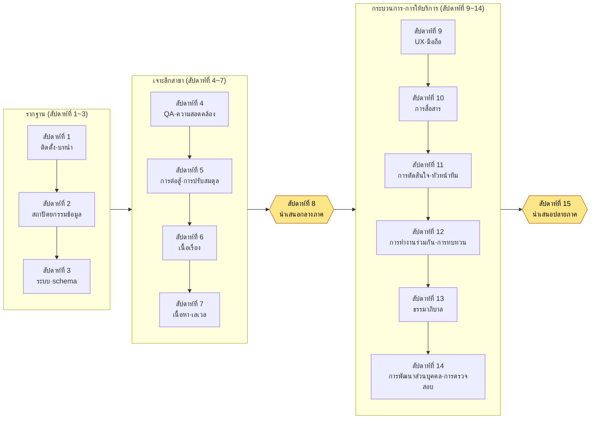

# ภาคผนวก N. ตารางความก้าวหน้า 15 สัปดาห์สำหรับการสอน·คู่มือระดับความยาก

ภาคผนวกนี้จัดทำขึ้นสำหรับผู้ที่ต้องการนำหนังสือเล่มนี้มาใช้เป็นตำราเรียนของรายวิชาหนึ่งภาคการศึกษา ไม่ว่าจะเป็นอาจารย์ในมหาวิทยาลัย วิทยาลัย หรืออะคาเดมี ผู้รับผิดชอบการอบรมภายในองค์กร หรือผู้นำกลุ่มศึกษา การแบ่งหนังสือเล่มเดียวที่หนาเกือบ 1,000 หน้าออกเป็นหน่วยภาคการศึกษานั้นยากกว่าที่คิด จะใส่ส่วนใดในสัปดาห์ที่เท่าไร จะเปลี่ยน «ลองทำดู» ในเนื้อหาให้เป็นงานมอบหมายอย่างไร และจะให้คะแนนผลงานที่ส่งมาด้วยเกณฑ์อะไร เมื่อสามเรื่องนี้ติดขัด แม้หนังสือดีก็ยากที่จะถูกเลือกมาเป็นตำราได้ ภาคผนวกนี้จะทำให้สามเรื่องดังกล่าวกลายเป็นเครื่องมือที่คุณคัดลอกไปใช้ได้ทันที

วิธีใช้ภาคผนวกนี้มีดังนี้ ก่อนอื่นให้อ่านตารางความก้าวหน้า 15 สัปดาห์ใน N.1 โดยปรับให้เข้ากับปฏิทินการศึกษาของคุณ (รูปแบบ 16 สัปดาห์·ภาคฤดูร้อนได้แยกไว้ต่างหากใน N.2) แล้วประเมินระดับของผู้เรียนด้วยป้ายระดับความยากและตารางความรู้พื้นฐานใน N.3 จากนั้นคัดลอกเกณฑ์การให้คะแนน (rubric) ใน N.4 แล้วเปลี่ยนเฉพาะรายการให้เข้ากับงานมอบหมายของคุณ ทุกตารางถูกออกแบบมาให้พิมพ์ออกมาแล้วแปะลงในเอกสารแผนการสอน (syllabus) ได้ทันที

มีเรื่องหนึ่งที่ต้องบอกไว้ล่วงหน้า ทุกบทของหนังสือเล่มนี้ลงท้ายด้วย «ลองทำดู» เป้าหมายของเนื้อหาไม่ใช่บทที่อ่านจบแล้วปิด แต่เป็นบทที่ทำให้คุณลงมือทำในวันนี้ และในการสอน «ลองทำดู» นั้นเองที่กลายเป็นวัตถุดิบลำดับแรกของงานมอบหมาย ด้วยเหตุนี้ตารางความก้าวหน้าในภาคผนวกนี้จึงระบุไว้ด้วยว่าจะแปลง «ลองทำดู» ในเนื้อหาให้เป็นงานมอบหมายรายสัปดาห์ได้อย่างไร

---

## N.1 ตารางความก้าวหน้ามาตรฐาน 15 สัปดาห์

นี่คือตารางความก้าวหน้ามาตรฐานที่จัดทำขึ้นโดยอิงภาคการศึกษาแบบ 15 สัปดาห์ที่พบบ่อยที่สุด (สัปดาห์ละ 1 ครั้ง ครั้งละ 3 ชั่วโมง) เราจะไม่ครอบคลุมทั้ง 24 ส่วนของหนังสือเล่มนี้ภายในภาคการศึกษาเดียว เพราะหากฝืนยัดเข้าไปทั้งหมด ก็จะไม่มีอะไรเหลือติดมือเลย เราจึงเลือกโครงสร้างที่ **วางรากฐาน (ส่วนที่ 1·2) ให้แน่น เจาะลึก 5–6 หัวข้อตัวแทนในกลุ่มสาขา แล้วเลือกเฉพาะแก่นจากกระบวนการ·การให้บริการมาปิดท้าย** ส่วนที่ไม่ได้กล่าวถึงและเหลือไว้จะระบุเป็น «อ่านเพิ่มเติม (ส่วนขยาย)» เพื่อชี้ทางให้ผู้เรียนที่สนใจไปเปิดอ่านด้วยตนเอง

วัตถุประสงค์การเรียนรู้ทั้งหมดเขียนด้วยคำกริยาในแง่ "ผู้เรียนจะทำอะไรได้บ้าง" ไม่ใช่ "รู้" แต่เป็น "สร้าง·ตรวจสอบ·เลือก" เนื่องจากหนังสือทั้งเล่มย้ำประโยคเดียวว่า "AI เสนอตัวเลือกและมนุษย์เป็นผู้กรอง" คำกริยาของวัตถุประสงค์จึงเป็นไปตามการแบ่งงานนั้นด้วย

| สัปดาห์ | ส่วน·บทที่ครอบคลุม | วัตถุประสงค์การเรียนรู้ (ทำได้หลังเรียน) | «ลองทำดู» ที่แปลงเป็นงานมอบหมาย |
|---|---|---|---|
| 1 | 1.0 ก่อนเริ่มต้น + ส่วนที่ 1 (บทนำ) | อธิบายเทอร์มินัล·บัญชี·โครงสร้างค่าบริการ และติดตั้งเครื่องมือ AI ลงบน PC ของตนเพื่อเปิดเซสชันแรก | «ลองทำดู» การติดตั้ง 1.0 — ส่งภาพหน้าจอการติดตั้ง + พรอมต์·ผลลัพธ์แรก |
| 2 | ส่วนที่ 2 (สถาปัตยกรรมข้อมูล) | แปลงเอกสารให้เป็นข้อมูลด้วย YAML frontmatter และออกแบบกฎการตั้งชื่อ·โฟลเดอร์ | «ลองทำดู» frontmatter 2.1 — ใส่ frontmatter ให้เอกสารของตน 3 ฉบับ |
| 3 | ส่วนที่ 3 (การออกแบบระบบ) | นิยาม $schema ของชีตข้อมูลก่อนตามหลักการ schema-first | «ลองทำดู» schema 3.2 — เขียนข้อกำหนดของมินิชีต 1 ชนิด |
| 4 | ส่วนที่ 10 (QA·ความสอดคล้อง) | ทำตามเพื่อสร้างเครื่องมือที่ตรวจสอบความสอดคล้องของ FK ใน 30 ชีตด้วยโค้ด | «ลองทำดู» การตรวจสอบความสอดคล้อง 10.1 — **งานหลักที่ให้คะแนนด้วย rubric ใน N.4** |
| 5 | ส่วนที่ 4 (การต่อสู้) + ส่วนที่ 8 (การปรับสมดุล) | แยกค่าตัวเลขการต่อสู้ออกเป็น Layer และวางสูตรการปรับสมดุลเชิงกำหนดไว้เป็น rulebook | «ลองทำดู» สูตรการปรับสมดุล 8.1 — สูตรดาเมจ 1 ชนิด + การจำลอง |
| 6 | ส่วนที่ 5 (เนื้อเรื่อง) | สร้าง voice_profile ของบทพูด NPC และจับการหลุดโทนด้วย voice_lint | «ลองทำดู» voice_profile 5.2 — โปรไฟล์เสียงของตัวละคร 1 ตัว |
| 7 | ส่วนที่ 6 (เนื้อหา) + ส่วนที่ 7 (เลเวล) | แยกแกนสองด้านของการสร้างแบบโพรซีเดอรัล (กฎ·AI) และผลิต·ตรวจสอบเนื้อหาตัวเลือกจำนวนมาก | «ลองทำดู» ตัวสร้าง 6.2 — สร้างเนื้อหาตัวเลือก 10 รายการ + บันทึกการตรวจสอบ |
| 8 | **การตรวจสอบกลางภาค·การนำเสนอ** | บูรณาการงานสัปดาห์ที่ 1–7 แล้วสาธิตเป็นมินิโปรเจกต์ของตน | นำเสนองานกลางภาค (สาธิตผลงานรวมจากสัปดาห์ที่ 3–6) |
| 9 | ส่วนที่ 9 (UX·UI) + ส่วนที่ 14 (มือถือ) | นำ HUD เข้า lint เพื่อจับการหลุดสายตา·คอนทราสต์ไม่ถึงเกณฑ์ และบีบอัด HUD ของ PC ลงสู่มือถือ | «ลองทำดู» HUD lint 9.1 — รายงาน lint ของหน้าจอ 1 ชนิด |
| 10 | ส่วนที่ 16 (ผู้สื่อสาร) + ส่วนที่ 17 (บันทึกการประชุม) | จัดให้เป็นทางการเฉพาะการตัดสินใจในพื้นที่ทำงานที่แยกตัว และจัดโครงสร้างบันทึกการประชุม | «ลองทำดู» บันทึกการประชุม 17.x — จัดโครงสร้างเทปบันทึกการประชุมจริง 1 รายการ |
| 11 | ส่วนที่ 18 (การตัดสินใจ) + ส่วนที่ 19 (หัวหน้าทีม) | บันทึกการตัดสินใจเป็นการ์ดที่ติดตามได้ และแปลงวิสัยทัศน์ให้เป็นเกณฑ์การให้คะแนนของการตัดสินใจ | «ลองทำดู» การติดตามการตัดสินใจ 18.1 — เขียนการ์ดการตัดสินใจ 3 ใบ |
| 12 | ส่วนที่ 20 (หน่วยความจำการทำงานร่วมกัน) + ส่วนที่ 21 (การปรับปรุงตนเอง) | ดำเนินบริบทการทำงานร่วมกันด้วยหน่วยความจำ และหมุนการทบทวนให้เป็นลูปการปรับปรุงตนเอง | «ลองทำดู» การทบทวน บทที่ 21 — การทบทวนรายสัปดาห์ 1 รายการ + กฎการสกัด 1 ข้อ |
| 13 | ส่วนที่ 22 (ธรรมาภิบาล) | ตรวจสอบเส้นแบ่งของพรอมต์·การหลอน·ต้นทุน·กฎหมาย·จริยธรรม แล้วตั้งกฎ | «ลองทำดู» พรอมต์ 22.1 — ใบสั่งงาน 1 ใบ + ขั้นตอนการตรวจสอบการหลอน |
| 14 | ส่วนที่ 23 (การพัฒนาส่วนบุคคล) + ส่วนที่ 24 (การให้บริการเชิงลึก) | ย้ายเครื่องมือไปยังฉบับย่อสำหรับคนเดียว และตรวจสอบความสอดคล้อง·ลิงก์·stale ด้วยโค้ด | «ลองทำดู» การตรวจสอบ 24.1 — สคริปต์ตรวจสอบโปรเจกต์ของตน 1 ชนิด |
| 15 | **การนำเสนอ·การประเมินโปรเจกต์ปลายภาค** | ออกแบบ·สาธิต·ตรวจสอบเวิร์กโฟลว์ของตนเอง 1 ชุดที่ร้อยเรียงตลอดทั้งภาคการศึกษา | นำเสนองานปลายภาค (ประเมินด้วย rubric ฉบับขยายใน N.4) |

> **อ่านเพิ่มเติม (ไม่รวมในการสอน·แนะนำให้เรียนรู้ด้วยตนเอง):** ส่วนที่ 11 (ตัวละคร·สัตว์เลี้ยง·ยานพาหนะ), ส่วนที่ 12 (อาร์ตไดเรกชัน), ส่วนที่ 13 (ข้อมูล·KPI), ส่วนที่ 15 (Live Ops) สี่ส่วนนี้มีความเฉพาะทางสูง จึงเหลือไว้ให้ผู้เรียนที่สนใจไปเปิดอ่านตามสาขาของตน หากใช้ภาคผนวก F (ดัชนีกรณีศึกษา) เป็นเข็มทิศ ก็จะค้นหาแบบย้อนกลับจากกรณีที่ใกล้เคียงกับสภาพแวดล้อมของตนเข้าไปได้

หากมองภาพการไหลของความก้าวหน้าโดยรวมจะเป็นดังนี้ เป็นโครงสร้างที่มีสองยอดเขา (กลางภาค·ปลายภาค) คือ รากฐาน → เจาะลึกสาขา → บูรณาการกลางภาค → กระบวนการ·การให้บริการ → บูรณาการปลายภาค

---

## N.2 รูปแบบแปรผันตามความยาวภาคการศึกษา (16 สัปดาห์ / ภาคฤดูร้อน 8 สัปดาห์)

แต่ละสถาบันมีความยาวภาคการศึกษาต่างกัน นอกเหนือจากมาตรฐาน 15 สัปดาห์ เราขอเสนอแนวทางปรับสำหรับสองรูปแบบที่พบบ่อยที่สุด งานหลัก (การตรวจสอบความสอดคล้องในสัปดาห์ที่ 4) และยอดเขาการนำเสนอทั้งสอง ขอแนะนำให้คงไว้ในทุกรูปแบบ เพราะนี่คือจุดที่หลักการความซื่อสัตย์ของหนังสือเล่มนี้ ("แสดงโครงสร้าง ไม่ใช่ผลลัพธ์") ปรากฏชัดที่สุด

| รูปแบบภาคการศึกษา | วิธีปรับ |
|---|---|
| 16 สัปดาห์ | มาตรฐาน 15 สัปดาห์ + เพิ่ม **สัปดาห์เสริม·ประเมินซ้ำ** ในสัปดาห์ที่ 16 เปิดโอกาสส่งงานปลายภาคใหม่ หรือให้ผู้เรียนโหวตเลือก 1 ใน 4 ส่วนของ «อ่านเพิ่มเติม» มาบรรยายพิเศษ |
| ภาคฤดูร้อน 8 สัปดาห์ (สัปดาห์ละ 2 ครั้งหรือแบบเข้มข้น) | สัปดาห์ที่ 1 (ติดตั้ง·บทนำ) → สัปดาห์ที่ 2 (ข้อมูล·schema) → สัปดาห์ที่ 3 (ความสอดคล้อง งานหลัก) → สัปดาห์ที่ 4 (การต่อสู้·การปรับสมดุล·เนื้อเรื่องรวมกัน) → สัปดาห์ที่ 5 นำเสนอกลางภาค → สัปดาห์ที่ 6 (การประชุม·การตัดสินใจ·การทำงานร่วมกัน) → สัปดาห์ที่ 7 (ธรรมาภิบาล·การตรวจสอบ) → สัปดาห์ที่ 8 นำเสนอปลายภาค ลดสาขาลงเหลือตัวแทน 3 หัวข้อ และดูดซับ «ลองทำดู» เป็นการฝึกปฏิบัติในชั้นเรียน |
| การเรียนแบบพลิกกลับ (ห้องเรียนกลับด้าน) | ให้การอ่านเนื้อหาเป็นงานมอบหมายล่วงหน้า และจัดสรรเวลาเรียนทั้งหมดให้กับการฝึก «ลองทำดู» และการประเมินกันเองด้วย rubric หนังสือเล่มนี้บรรจุโค้ดที่รันได้ตรงตามนั้นโดยไม่ต้องพึ่งสิ่งภายนอก จึงเหมาะกับการดำเนินงานที่เน้นการฝึกปฏิบัติ |

---

## N.3 ป้ายระดับความยากของบท·ความรู้พื้นฐาน

แม้อยู่ในหนังสือเล่มเดียวกัน แต่ละบทก็ต้องการความรู้พื้นฐานต่างกัน บางบทแม้เป็นนักศึกษาปี 1 ที่เพิ่งใช้เทอร์มินัลครั้งแรกก็ตามได้ บางบทต้องมีแนวคิดเรื่องคีย์ฐานข้อมูลหรือสถิติพื้นฐานจึงจะย่อยได้ครบถ้วน เราจัดเป็นป้ายสามระดับเพื่อให้คุณใช้ปรับความก้าวหน้าตามระดับของผู้เรียน หรือแนะนำวิชาที่ควรเรียนมาก่อน

ความหมายของป้ายมีดังนี้

| ป้าย | ระดับ | ความหมาย |
|---|---|---|
| 🟢 เริ่มต้น | เริ่มต้น | ผู้ไม่ใช่สายตรงหรือนักศึกษาปี 1 ก็ตามได้ โค้ดเพียงระดับคัดลอก·รันก็เพียงพอ |
| 🟡 ภาคปฏิบัติ | ภาคปฏิบัติ | ต้องอ่านโค้ดและแก้ให้เข้ากับข้อมูลของตนได้ แนะนำให้เข้าใจบริบทงานออกแบบเกมภาคปฏิบัติ |
| 🔴 เชิงลึก | เชิงลึก | ขั้นออกแบบ·ขยายอัลกอริทึม·โครงสร้าง หากไม่มีความรู้พื้นฐานจะย่อยยาก |

ป้ายและความรู้พื้นฐานของส่วนหลักในแต่ละสัปดาห์มีดังนี้ "ความรู้พื้นฐาน" คือพื้นฐานที่ควรมีไว้ล่วงหน้าเพื่อตามสัปดาห์นั้นได้อย่างราบรื่น ไม่ได้หมายความว่าหากไม่มีแล้วจะเรียนไม่ได้

| สัปดาห์ | ส่วนหลัก | ป้าย | ความรู้พื้นฐาน |
|---|---|---|---|
| 1 | บทนำ 1.0·ส่วนที่ 1 | 🟢 เริ่มต้น | ไม่มี (ตั้งสมมติฐานว่าใช้เทอร์มินัลครั้งแรก) |
| 2 | ส่วนที่ 2 สถาปัตยกรรมข้อมูล | 🟢 เริ่มต้น | การใช้โปรแกรมแก้ไขข้อความ |
| 3 | ส่วนที่ 3 ระบบ·schema | 🟡 ภาคปฏิบัติ | พื้นฐานตาราง/สเปรดชีต แนวคิดชนิดข้อมูล |
| 4 | ส่วนที่ 10 การตรวจสอบความสอดคล้อง | 🔴 เชิงลึก | **พื้นฐานไพทอน** (ฟังก์ชัน·ลูป), แนวคิดคีย์เชิงสัมพันธ์ (FK) |
| 5 | ส่วนที่ 4·8 การต่อสู้·การปรับสมดุล | 🟡 ภาคปฏิบัติ | สูตรการคำนวณพื้นฐาน, **การคำนวณในตาราง** (ฟังก์ชันเอ็กเซล) |
| 6 | ส่วนที่ 5 เนื้อเรื่อง | 🟢 เริ่มต้น | ทักษะการเขียนตัวละคร·บท |
| 7 | ส่วนที่ 6·7 เนื้อหา·เลเวล | 🟡 ภาคปฏิบัติ | แนวคิดการสร้างแบบโพรซีเดอรัล (แนะนำ), ทักษะพิกัด·กริด |
| 9 | ส่วนที่ 9·14 UX·มือถือ | 🟡 ภาคปฏิบัติ | แนวคิดเลย์เอาต์หน้าจอ·ความละเอียด |
| 10 | ส่วนที่ 16·17 การสื่อสาร | 🟢 เริ่มต้น | ไม่มี (มีประสบการณ์ทำงานร่วมกันจะได้เปรียบ) |
| 11 | ส่วนที่ 18·19 การตัดสินใจ·หัวหน้าทีม | 🟡 ภาคปฏิบัติ | ประสบการณ์ทำงานเป็นทีม·บริหารโปรเจกต์ (แนะนำ) |
| 12 | ส่วนที่ 20·21 การทำงานร่วมกัน·การทบทวน | 🟡 ภาคปฏิบัติ | เรียนสถาปัตยกรรมข้อมูลในสัปดาห์ที่ 2 มาแล้ว |
| 13 | ส่วนที่ 22 ธรรมาภิบาล | 🟡 ภาคปฏิบัติ | **สถิติพื้นฐาน** (ค่าเฉลี่ย·การกระจาย, บริบทการตรวจจับการหลอน), พื้นฐานลิขสิทธิ์ |
| 14 | ส่วนที่ 23·24 ส่วนบุคคล·การให้บริการ | 🔴 เชิงลึก | พื้นฐานไพทอน, พื้นฐาน git, เรียนความสอดคล้องในสัปดาห์ที่ 4 มาแล้ว |

> **คำแนะนำวิชาเรียนมาก่อนหนึ่งบรรทัด (สำหรับแผนการสอน):** "แนะนำให้มีพื้นฐานไพทอนเบื้องต้นหรือพื้นฐานการเขียนโปรแกรมเทียบเท่า แต่ไม่บังคับ บทเชิงลึกในสัปดาห์ที่ 4·14 ตั้งสมมติฐานว่ามีระดับฟังก์ชัน·ลูปของไพทอน ส่วนผู้ที่ยังไม่ได้เรียนจะดำเนินงานมอบหมายแบบแยกแทร็กเริ่มต้นในสัปดาห์ที่ 1–3 ให้ตามได้อย่างเพียงพอ"

เคล็ดลับการดำเนินงานตามองค์ประกอบของผู้เรียนมีดังนี้

- **รายวิชาที่ไม่ใช่สายตรง·วิชาเลือกทั่วไป:** หากดำเนินบทเชิงลึก 🔴 (สัปดาห์ที่ 4·14) ในรูปแบบ "ให้ AI เขียนโค้ดและตรวจสอบผลลัพธ์" ผู้ที่ยังไม่ได้เรียนไพทอนก็สามารถบรรลุวัตถุประสงค์การเรียนรู้ได้ การแบ่งงานที่เนื้อหาของหนังสือเล่มนี้แสดงให้เห็นว่า "มนุษย์ยึดตำแหน่งผู้ตรวจสอบไว้" จะกลายเป็นการออกแบบการเรียนรู้ได้ตรงตามนั้น
- **รายวิชาสายตรง·หลักสูตรฝึกภาคปฏิบัติ:** หากให้ผู้เรียนอ่านโค้ดที่ AI สร้างขึ้นในบทเชิงลึก 🔴 ด้วยตนเองแล้วอธิบายทีละบรรทัด สมรรถนะการตรวจสอบเองก็จะกลายเป็นเป้าหมายของการประเมิน (เชื่อมโยงกับ rubric ข้อ 4 ใน N.4)

---

## N.4 ตัวอย่าง rubric การให้คะแนน — ลองทำดูเครื่องมือตรวจสอบความสอดคล้อง (งานหลักสัปดาห์ที่ 4)

หากไม่มี rubric ผลงาน «ลองทำดู» ที่ส่งมามักถูกให้คะแนนด้วยการแบ่งแบบทวิภาคเพียง "รันได้/รันไม่ได้" เท่านั้น แล้วสิ่งที่หนังสือเล่มนี้ให้ความสำคัญสูงสุด — **กระบวนการตรวจสอบและปฏิเสธผลลัพธ์ AI** — ก็จะหายไปจากการประเมิน ด้วยเหตุนี้เราจึงนำงานหลักสัปดาห์ที่ 4 («ลองทำดู» atom การตรวจสอบความสอดคล้อง 10.1) มาเป็นตัวอย่าง แล้ววาง rubric ที่ให้คะแนนทั้งผลลัพธ์และกระบวนการ คุณสามารถนำไปใช้กับงานมอบหมายของสัปดาห์อื่นได้ทันทีโดยเปลี่ยนเพียงชื่อรายการ

**คำนิยามงาน:** สำหรับชีตข้อมูลหลายชนิดที่ตนสร้าง (หรือได้รับมา) ให้สร้างเครื่องมือที่ตรวจสอบความสอดคล้องของคีย์ภายนอก (FK) ระหว่างชีตร่วมกับ AI และสาธิตว่าเครื่องมือจับข้อผิดพลาดที่จงใจฝังไว้ได้หรือไม่ ผลงานที่ส่งประกอบด้วย ① โค้ดเครื่องมือ ② ผลการรันตรวจสอบ (รายงานผ่าน/ไม่ผ่าน) ③ บันทึกพรอมต์ฉบับเต็มที่ส่งให้ AI พร้อมผลลัพธ์ที่ปฏิเสธ·แก้ไขในนั้น

rubric ประกอบด้วย 4 รายการ·แต่ละรายการ 25 คะแนน (รวม 100 คะแนน) แก่นสำคัญคือ นอกเหนือจาก "เครื่องมือรันได้" (รายการ 2) แล้ว ยังประเมิน **วิธีจัดการกับ AI** (รายการ 3·4) ด้วยน้ำหนักครึ่งหนึ่ง

| # | รายการประเมิน | คะแนน | ยังไม่ถึงเกณฑ์ (0\~12) | พอใช้ (13\~19) | ดีเยี่ยม (20\~25) |
|---|---|---|---|---|---|
| 1 | **การนิยามกฎความสอดคล้อง** — ตรวจความสัมพันธ์ FK ใดเพราะอะไร ชัดเจนหรือไม่ | 25 | ความสัมพันธ์ที่ตรวจสอบไม่ชัดเจนหรือกำหนดตามอำเภอใจ | ระบุความสัมพันธ์ FK หลักได้ แต่อธิบายเหตุผลไม่เพียงพอ | นิยามความสัมพันธ์ระหว่างชีตพร้อมแผนภาพ·เหตุผล และอธิบายลำดับความสำคัญของการตรวจสอบ |
| 2 | **การทำงานของเครื่องมือ·การตรวจจับข้อผิดพลาด** — จับข้อผิดพลาดที่ฝังไว้ได้จริงหรือไม่ | 25 | รันไม่ได้หรือพลาดข้อผิดพลาดที่ชัดเจน | จับข้อผิดพลาดได้ส่วนใหญ่ แต่มีบางส่วนตกหล่น·แจ้งผิดพลาด | จับข้อผิดพลาดที่ฝังไว้ได้ทั้งหมด และรายงานออกมาให้มนุษย์อ่านได้โดยไม่มีการแจ้งผิดพลาด |
| 3 | **ความโปร่งใสของกระบวนการใช้ AI** — บันทึกพรอมต์ฉบับเต็มและผลลัพธ์ไว้ในลักษณะที่ทำซ้ำได้หรือไม่ | 25 | ไม่มีบันทึกพรอมต์·ผลลัพธ์ หรือแนบมาแต่ผลลัพธ์ | มีพรอมต์ แต่ขาดกระบวนการปฏิเสธ·แก้ไข | บันทึกพรอมต์ฉบับเต็มที่ส่ง ผลลัพธ์ดิบ และกระบวนการปฏิเสธ·สั่งใหม่ไว้ตามลำดับเวลา |
| 4 | **การตัดสินใจตรวจสอบ·ปฏิเสธ** — ปฏิเสธ·แก้ไขอะไรในผลลัพธ์ AI เพราะอะไร | 25 | ยอมรับผลลัพธ์ตามนั้น (ไม่มีร่องรอยการตรวจสอบ) | แก้ไขบางส่วน แต่เหตุผลในการตัดสินใจอ่อน | ชี้ข้อผิดพลาด·การหลอน·การออกแบบเกินจำเป็น แล้วปฏิเสธ และอธิบายเหตุผลในการตัดสินใจด้วยภาษาของตน |

> **บันทึกการดำเนินงานการให้คะแนน:** รายการ 3·4 (รวม 50 คะแนน) คือกระดูกสันหลังของ rubric นี้ แม้เครื่องมือจะรันได้สมบูรณ์ (รายการ 2 เต็ม) แต่หากยอมรับผลลัพธ์ AI โดยไม่วิพากษ์ (รายการ 4 ยังไม่ถึงเกณฑ์) ก็ถือว่ายังไม่บรรลุวัตถุประสงค์การเรียนรู้ของงานนี้ — "มนุษย์ยึดตำแหน่งผู้ตรวจสอบไว้" ในทางกลับกัน แม้เครื่องมือจะไม่สมบูรณ์ในบางส่วน หากกระบวนการปฏิเสธ·สั่งใหม่หนักแน่นก็สามารถได้คะแนนสูงได้ หลักการของหนังสือเล่มนี้ที่ว่าประเมินโครงสร้าง (วิธีจัดการ) ไม่ใช่ผลลัพธ์ (ผลที่รันได้) ถูกนำมาใช้กับการให้คะแนนตรงตามนั้นด้วย

สำหรับงานปลายภาค ขอแนะนำ rubric ฉบับขยายเป็น 5 รายการ·แต่ละรายการ 20 คะแนน โดยเพิ่ม **⑤ การทำให้เวิร์กโฟลว์เป็นทั่วไป (อธิบายการย้ายไปสู่สาขาของตน)** อีก 1 รายการเข้ากับ 4 รายการข้างต้น สามารถย้ายเครื่องมือที่เรียนมาตลอดภาคการศึกษาไปยังโปรเจกต์ของตนได้หรือไม่ — นั่นคือคำถามที่หนังสือเล่มนี้ถามในตอนท้าย และการประเมินสุดท้ายของการสอนก็เป็นคำถามเดียวกันก็เพียงพอแล้ว

---

## N.5 สรุปการดำเนินการสอนหนึ่งหน้า

สุดท้าย หากย่อภาคผนวกนี้ลงเหลือหนึ่งหน้าจะเป็นดังนี้

- **เลือก อย่าใส่ทั้งหมด** อย่าพยายามครอบคลุมทั้ง 24 ส่วน แต่จัดหนึ่งภาคการศึกษาด้วยรากฐาน (ส่วนที่ 1·2) + ความสอดคล้อง (ส่วนที่ 10) + ตัวแทนสาขา 5–6 หัวข้อ + แก่นของกระบวนการ·การให้บริการ ที่เหลือเก็บไว้เป็น «อ่านเพิ่มเติม»
- **ย้าย «ลองทำดู» ไปเป็นงานมอบหมาย** เนื่องจากเนื้อหาถูกออกแบบมาให้ลงมือทำอยู่แล้ว ครึ่งหนึ่งของการออกแบบงานมอบหมายจึงอยู่ในหนังสือแล้ว
- **ให้คะแนนการตรวจสอบ ไม่ใช่ผลลัพธ์** วางจุดศูนย์ถ่วงของ rubric ไว้ที่ "วิธีจัดการกับ AI" นั่นคือวิธีทำให้ประโยคเดียวที่หนังสือเล่มนี้ย้ำตั้งแต่ต้นจนจบ — AI เสนอตัวเลือก และการตัดสินใจสุดท้ายมนุษย์เป็นผู้ทำ — มีชีวิตอยู่ในห้องเรียน

ตารางความก้าวหน้านี้เป็นจุดเริ่มต้น ไม่ใช่คำตอบที่ถูกต้อง โปรดย้ายสัปดาห์และเปลี่ยนงานมอบหมายให้เข้ากับระดับของผู้เรียนและปฏิทินการศึกษาของคุณ การให้เครื่องมือ AI อ่านหนังสือเล่มนี้ทั้งเล่มแล้วขอว่า "ช่วยจัดตารางความก้าวหน้านี้ใหม่ให้เข้ากับตารางการสอน 16 สัปดาห์และระดับผู้เรียนของฉัน" ก็เป็นทางที่เปิดอยู่เช่นกัน — สมกับเป็นวิธีใช้หนังสือเล่มนี้ที่เร็วที่สุด
